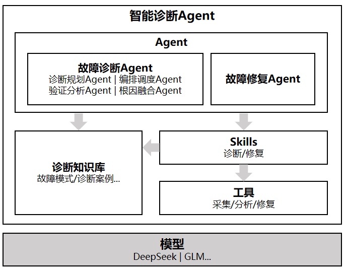
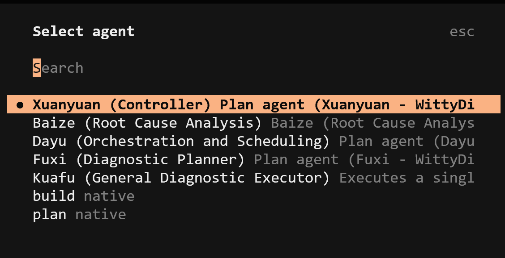
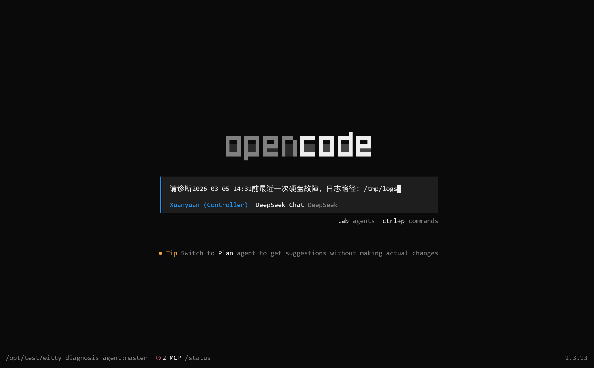
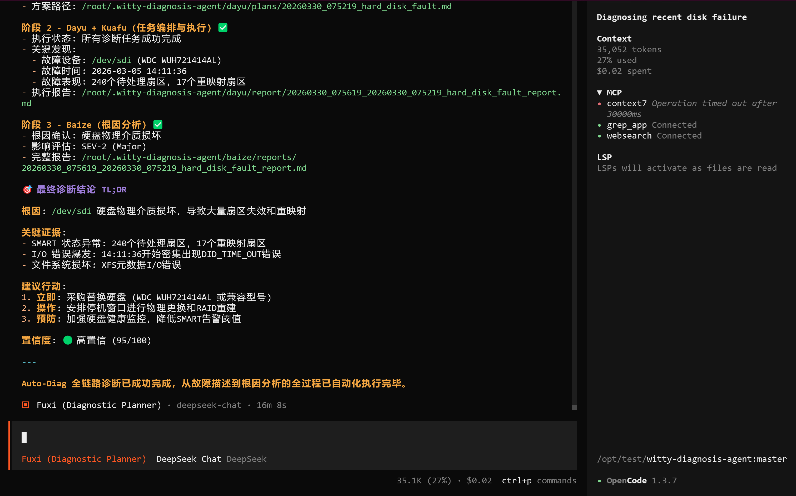

<div align="center">
  
</div>

Witty 智能诊断 Agent 基于「假设-验证」（Hypothetico-Deductive）故障排查范式与 Multi-Agent 协同架构，提供分钟级、代码行级的全自动故障诊断能力。

- **全栈并发诊断**：支持跨系统、内核与硬件的多路径并行排查，彻底打破传统线性排查的效率瓶颈。
- **专家经验封装**：内置多场景诊断技能与丰富故障模式库，固化专家级排查思路，实现根因精准穿透。
- **端到端闭环自愈**：涵盖“现象分析、根因定界、生成报告、执行修复”全链路，提供一站式自动化运维。
- **严格的安全管控**：诊断排查阶段严格只读，仅修复阶段按需赋予操作权限，且变更必经用户审批确认。

### 架构与核心能力

Witty 智能诊断 Agent 采用“Agent-Skill-工具-知识”四层解耦架构，兼具高灵活性与可扩展性。

<div align="center">
  
</div>

#### 1. 多智能体协同 (Agent 层)

采用流水线式机制实现诊断自动化：

- **Xuan Agent(总控)**：调度其它Agent协同完成故障诊断。
- **Fuxi Agent (规划)**：基于现象生成结构化排查计划。
- **Dayu Agent (调度)**：解析计划并并发调度给执行节点。
- **Kuafu Agent (执行)**：加载专属 Skill 深入节点拉取指标与推理。
- **Baize Agent (融合)**：汇总证据链，输出最终根因报告。
- **Nuwa Agent (自愈)**：基于安全规则，自动生成并执行修复。

#### 2. 专家经验沉淀 (Skill & 知识层)

- **Skill 层**：将专家排查流程封装为可复用的诊断技能（如 OOM、死锁排查）。
- **知识底座**：内置 openEuler 专属故障模式与因果规则，持续自我进化。

#### 3. 核心诊断场景

深度结合 openEuler 操作系统特性，目前已支持：

- **内核级诊断**：自动化采集解析 VMCore，精准回溯系统崩溃（Crash/Panic）调用栈。
- **系统级诊断**：针对磁盘 I/O、网络丢包、内存碎片等资源瓶颈提供多维关联分析。
- **进程级诊断**：深度诊断进程死锁、僵尸进程及服务超时等逻辑异常。

> 💡 **更多基于 OS 全栈（硬件层 -> 内核层 -> 系统服务层）的诊断能力持续演进中...**

### 快速开始

#### 环境要求

- 运行环境：Node.js (>=18.0.0)
- 依赖工具：已安装[OpenCode](https://opencode.ai/)
- 依赖工具：已安装 [Ansible](https://docs.ansible.com/ansible/latest/installation_guide/)（`ansible` 命令须在系统 PATH 中可用，可通过 `ansible --version` 提前验证）

> ⚠️ **注意**：执行 `witty-diagnosis-agent install` 前，请确保本地已完成 Ansible 的安装与环境配置，否则安装程序将直接终止。

#### 安装与配置

Witty 智能诊断 Agent 支持**在线安装**与**源码安装**两种方式，请根据您的网络环境选择合适的安装方式。

##### 方式一：在线安装（推荐）

```bash
npm install -g witty-diagnosis-agent@latest
witty-diagnosis-agent install
```

##### 方式二：源码一键安装（适用于源码）

如果您已经克隆了仓库，可以使用一键安装脚本自动完成环境检查、依赖安装、项目构建及插件配置：

```shell
git clone https://atomgit.com/openeuler/witty-diagnosis-agent.git
cd witty-diagnosis-agent
bash install.sh
```

### 如何使用

1. 启动 \*\*OpenCode \*\*。

2. 执行`/agents`命令，选择`Xuanyuan`Agent。
   
   

3. 输入故障问题描述，示例：
   
   ```shell
   请诊断2026-03-05 14:31前最近一次硬盘故障，日志路径：/tmp/logs
   ```
   
   

4. 系统将自动执行**智能诊断**流程。

5. 诊断完成后，系统将生成[HTML](docs/reference/reports/hard_disk_fault_diagnosis_report.html)和[Markdown](docs/reference/reports/hard_disk_fault_diagnosis_report.md)两种格式的诊断分析报告，同时在界面上展示完整报告内容：
   
   

如需了解更多操作细节，可查阅[用户手册](docs/guide/MANUAL.html)；支持的诊断能力与功能说明详见[功能列表](docs/reference/features.html)。

### 如何贡献

#### 社区贡献

我们诚挚欢迎新贡献者加入项目，也会为新加入者提供全面的指导与帮助。请注意：贡献代码前，请先签署 [CLA](https://clasign.osinfra.cn/sign/6983225bdcbb19710248ccf0)，再参考 [代码贡献指引](https://www.openeuler.org/zh/community/contribution/detail#_4-2-代码类贡献) 提交代码。

#### 问题讨论

若您有任何疑问、建议或讨论需求，可通过以下方式联系我们：

- 提交 [issue](https://atomgit.com/openeuler/witty-diagnosis-agent/issues)
- 发送邮件至 <intelligence@openeuler.org>

### License

本项目中部分代码基于 `oh-my-openagent` 修改，这部分代码遵循 **Sustainable Use License Version 1.0**。其他原创及贡献部分代码协议以最终发布版本为准。详情请参阅项目根目录下的 [LICENSE](./LICENSE) 文件。
