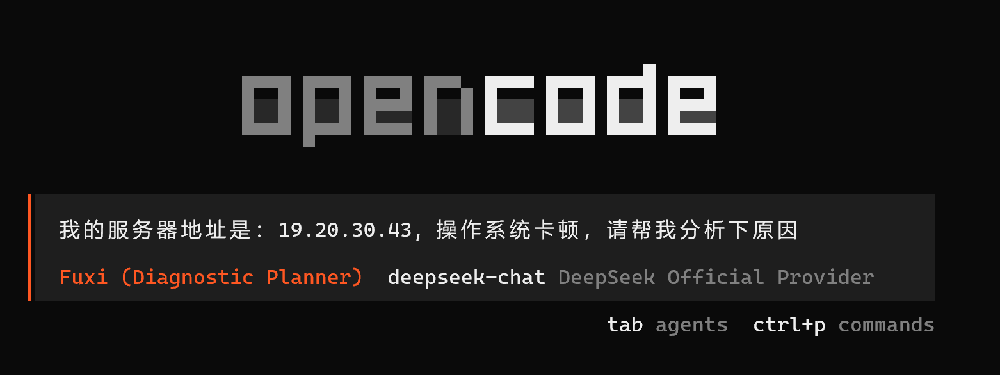

# witty-diagnosis-agent

面向运维故障诊断的多 Agent 自动化诊断系统，围绕标准化流程组织协作分工，将“生成诊断计划、任务拆解、执行验证、根因分析、解决方案生成”串成可复用的执行链路。

## 安装

### 1. 安装 OpenCode

使用本项目之前，需要先安装 OpenCode：

- OpenCode 安装说明：https://opencode.ai/docs/zh-cn/#%E5%AE%89%E8%A3%85

### 2. 安装 witty-diagnosis-agent

在 OpenCode 环境就绪后，你可以选择以下两种方式之一来安装 `witty-diagnosis-agent`：

**方式 A：通过 Agent 自动化安装（推荐）**

把下面这段提示词直接发给你的 OpenCode Agent，它会自动完成下载与配置：

```
Install and configure witty-diagnosis-agent by following the instructions here:
https://atomgit.com/openeuler/witty-diagnosis-agent/tree/master/docs/reference/witty-diagnosis-installation.md
```

**方式 B：手动安装**

如果你更习惯手动操作或进行本地调试，请参考详细文档：[手动安装指南](docs/guide/installation.md)。

### 3. 验证安装

安装完成后，请在 Shell 终端执行以下命令验证是否成功：

```bash
witty-diagnosis-agent -V
# 预期输出：
# 1.0.0
```

## 架构与组件


详细架构设计请参阅：[Overview](docs/guide/overview.md) | [Orchestration](docs/guide/orchestration.md)

## 运行模式与 Agents

为实现精准的故障诊断，系统采用了**四层多 Agent 协作**架构，从诊断规划、任务编排、根因分析到方案修复，通过专职分工模拟资深运维团队的排查链路。

### Agent 分层体系

我们以中国神话命名各阶段 Agent，按职责划分为四个核心层次：

#### 1. 诊断规划层 (Diagnosis Planning)
负责故障的顶层认知、上下文理解及全局战略制定。
- **伏羲 (Fuxi)**: **诊断规划**。识别故障场景，澄清上下文，生成标准诊断计划 (Plan)。

#### 2. 任务编排与执行层 (Task Orchestration & Execution)
负责将高层计划转化为计算机可执行的指令序列，并执行具体的现场数据采集与验证。
- **大禹 (Dayu)**: **任务编排**。解析计划，拆解任务，并行调度执行 Agent。
- **夸父 (Kuafu)**: **执行验证**。追踪线索，执行通用工具 (Skill) 进行数据采集与验证。

#### 3. 根因分析层 (Root Cause Analysis)
负责深度逻辑推理与证据链关联，穿透表象定位根本原因。
- **白泽 (Baize)**: **根因分析**。穿透表象推理根因，关联证据链，生成最终报告。

#### 4. 方案修复层 (Remediation & Repair)
负责故障处理的闭环，生成并实施修复方案。
- **女娲 (Nuwa)**: **方案修复**。(可选) 生成修复方案，修补系统裂痕。

### 运行模式

为满足不同运维场景，系统设计了两种运行模式。

#### 1. 分阶段交互模式 (Interactive Mode)
**适用场景**：疑难故障排查，需要专家介入确认关键决策（推荐默认）。

- **使用流程**：
  1. 用户触发诊断。
  2. **伏羲** 生成计划 -> **暂停** -> 专家审核。
  3. **大禹** 任务编排与执行 -> **暂停** -> 专家确认结果。
  4. **白泽** 生成报告 -> **暂停** -> 专家确认根因。
  5. **女娲** (可选) 生成修复方案 -> **暂停** -> 专家确认执行。

#### 2. 全自动端到端模式 (End-to-End Mode)
**适用场景**：标准化故障自动检测与修复。

- **使用方式**（任选其一）：
  1. **关键指令触发**：使用 `autopilot` 关键字（如 "autopilot 排查..."）。
  2. **特定 Agent**：直接呼叫 **Xuanyuan (轩辕)**。
- **执行流程**：
  - 触发 -> **伏羲** 规划 -> **大禹** 编排与执行 -> **白泽** 分析 -> **女娲** (可选) 修复 -> 输出报告。

## 使用说明

1. **选择 Agent**：在 OpenCode 中选择具体的 Agent（如 **Fuxi/Dayu**）。
2. **输入故障诊断**：描述故障现象（如 "排查 API 响应超时"），Agent 将自动启动诊断流程。



更详细的每个 Agent 的使用说明，请参考对应的文档：
- [Features](docs/reference/features.md)
- [CLI](docs/reference/cli.md)
- [Configuration](docs/reference/configuration.md)

- **安装插件**：参考上文安装步骤。
- **触发诊断**：在 OpenCode 中直接使用自然语言描述故障（如“排查 API 响应慢”）。
- **查看报告**：诊断完成后会自动生成 Markdown 报告。

## 扩展开发

OpenCode 支持通过 **Skills** 和 **MCP (Model Context Protocol)** 进行灵活扩展。详细扩展方式请参阅：[Skill 接口规范](docs/standards/skill-interfaces.md)

### 1. Skills 扩展 (自定义能力)
Skills 是特定的任务指令集，支持 Markdown 格式定义。

- **存放位置**：
  - **项目级**：`.opencode/skills/*.md` (仅当前项目可用)
  - **全局级**：`~/.opencode/skills/*.md` (所有项目可用)

- **定义示例** (`hello.md`)：
  ```markdown
  ---
  name: hello
  description: Say hello to the user
  ---
  # Instruction
  When the user says hello, reply with a friendly greeting and the current time.
  ```

### 2. MCP 扩展 (外部工具集成)
支持集成标准 MCP Server，赋予 Agent 操作外部系统（如数据库、API）的能力。

- **配置方式**：在 Skill 的 Frontmatter 中添加 `mcp` 配置。
- **示例** (集成 SQLite MCP)：
  ```markdown
  ---
  name: database-tool
  description: Access local SQLite database
  mcp:
    sqlite:
      command: uvx
      args:
        - mcp-server-sqlite
        - --db-path
        - ./my-data.db
  ---
  You can now use the `sqlite` tool to query the database.
  ```
## 故障排查

遇到问题？请查看：[Troubleshooting](docs/troubleshooting/opencode.md)
