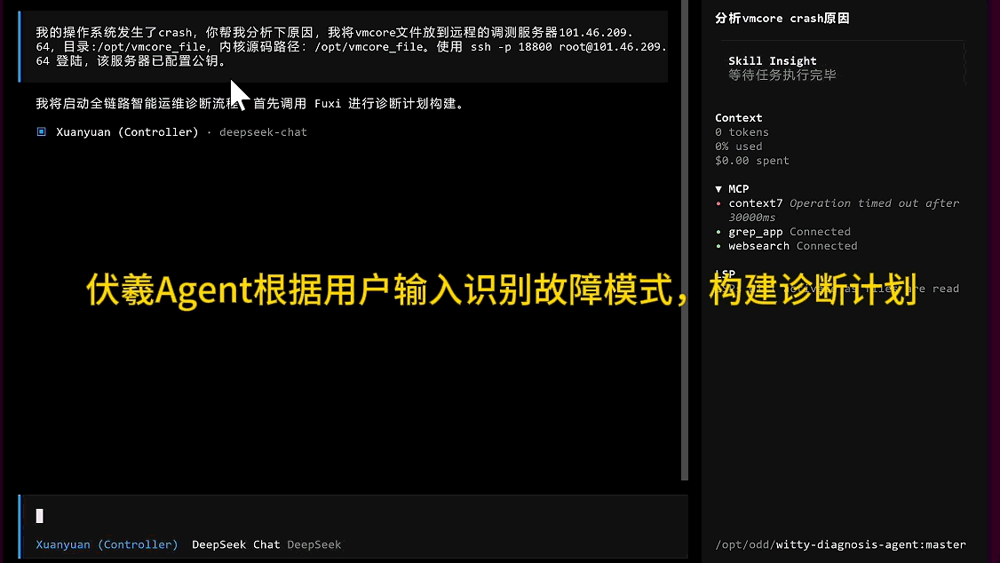
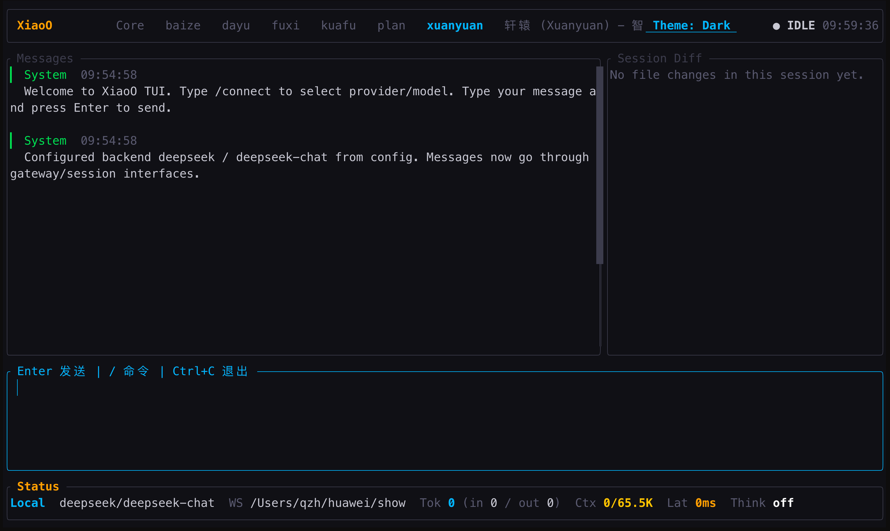
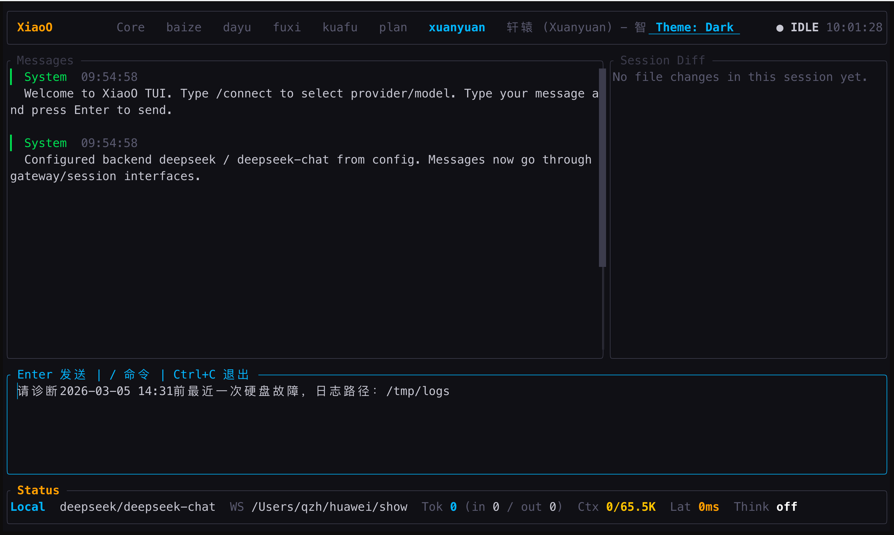
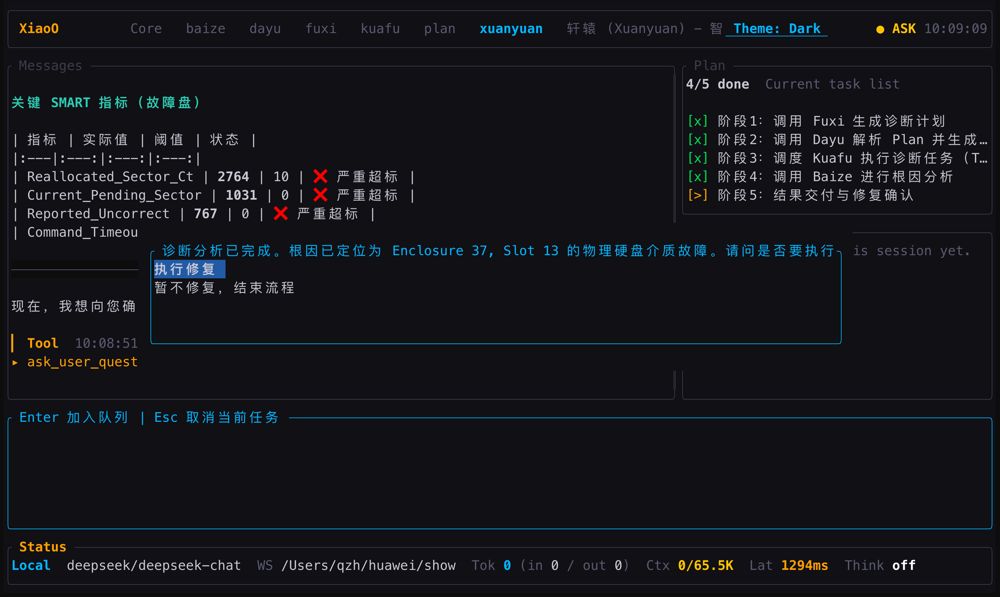

<div align="center">
  
</div>

Witty 智能诊断 Agent 基于「假设-验证」（Hypothetico-Deductive）故障排查范式与 Multi-Agent 协同架构，提供分钟级、代码行级的全自动故障诊断能力。

- **全栈并发诊断**：支持跨系统、内核与硬件的多路径并行排查，彻底打破传统线性排查的效率瓶颈。
- **专家经验封装**：内置多场景诊断技能与丰富故障模式库，固化专家级排查思路，实现根因精准穿透。
- **端到端闭环自愈**：涵盖“现象分析、根因定界、生成报告、执行修复”全链路，提供一站式自动化运维。
- **严格的安全管控**：诊断排查阶段严格只读，仅修复阶段按需赋予操作权限，且变更必经用户审批确认。

<div align="center">
  
</div>

### 架构与核心能力

Witty 智能诊断 Agent 采用“Agent-Skill-工具-知识”四层解耦架构，兼具高灵活性与可扩展性。

<div align="center">
  
</div>

#### 1. 多智能体协同 (Agent 层)

采用流水线式机制实现诊断自动化：

- **Xuan Agent(总控)**：调度其它Agent协同完成故障诊断。
- **Fuxi Agent (规划)**：基于现象生成结构化排查计划。
- **Dayu Agent (调度)**：解析计划并并发调度给执行节点。
- **Kuafu Agent (执行)**：加载专属 Skill 深入节点拉取指标与推理。
- **Baize Agent (融合)**：汇总证据链，输出最终根因报告。
- **Nuwa Agent (自愈)**：基于安全规则，自动生成并执行修复。

#### 2. 专家经验沉淀 (Skill & 知识层)

- **Skill 层**：将专家排查流程封装为可复用的诊断技能（如 OOM、死锁排查）。
- **知识底座**：内置 openEuler 专属故障模式与因果规则，持续自我进化。

#### 3. 核心诊断能力

深度结合 openEuler 操作系统特性，目前已支持：

- **用户态诊断**：诊断进程 coredump、文件描述符泄漏、系统调用异常、IPC/资源耗尽、Unix Socket/Pipe、容器（Docker）、时间同步与安全认证等进程/服务层逻辑异常。
- **内核级诊断**：自动解析VMCore，精准回溯内核崩溃（Crash/Panic）调用栈；覆盖 OOM、CPU 调度、文件系统（EXT4/XFS/OverlayFS）、Swap 抖动，以及块设备 IO 与网络协议栈等内核子系统故障。
- **硬件级诊断**：基于 iBMC 带外日志与 OS 信息采集，定位 CPU/内存/磁盘/GPU/NPU/网卡/电源等部件的物理故障（ECC/MCE、坏道、掉卡、链路不稳、供电异常等），并提供磁盘健康预测与 GRUB 启动链故障诊断。

> 💡 诊断能力详情，请参见[功能列表](docs/reference/features.md)。

---

### 快速开始

#### 环境要求

- 运行环境：Node.js (>=20.0.0)
- 依赖工具：已安装[OpenCode](https://opencode.ai/)或[xiaoO](https://gitcode.com/openeuler/xiaoO/)
- 依赖工具：已安装 [Ansible](https://docs.ansible.com/ansible/latest/installation_guide/)（`ansible` 命令须在系统 PATH 中可用，可通过 `ansible --version` 提前验证）

> ⚠️ **注意**：执行 `witty-diagnosis-agent install` 前，请确保本地已完成 Ansible 的安装与环境配置，否则安装程序将直接终止。

#### 安装与配置

Witty 智能诊断 Agent 支持**在线安装**与**源码安装**两种方式，请根据您的网络环境选择合适的安装方式。

##### 方式一：在线安装（推荐）

```bash
npm install -g witty-diagnosis-agent@latest
witty-diagnosis-agent install
```

##### 方式二：源码一键安装（适用于源码）

如果您已经克隆了仓库，可以使用一键安装脚本自动完成环境检查、依赖安装、项目构建及插件配置：

```shell
git clone https://atomgit.com/openeuler/witty-diagnosis-agent.git
cd witty-diagnosis-agent
bash install.sh
```

---

### 如何使用
#### 基于opencode框架启动

1. 启动 \*\*OpenCode \*\*。

2. 执行`/agents`命令，选择`Xuanyuan`Agent。
   
   

3. 输入故障问题描述，示例：
   
   ```shell
   请诊断2026-03-05 14:31前最近一次硬盘故障，日志路径：/tmp/logs
   ```
   
   

4. 系统将自动执行**智能诊断**流程。

5. 诊断完成后，系统将生成[HTML](docs/reference/reports/hard_disk_fault_diagnosis_report.html)和[Markdown](docs/reference/reports/hard_disk_fault_diagnosis_report.md)两种格式的诊断分析报告，同时在界面上展示完整报告内容：
   
   

如需了解更多操作细节，可查阅[用户手册](docs/guide/MANUAL.md)。

#### 基于xiaoO框架启动
1. 启动 \*\*xiaoO \*\*。

2. 使用`tab`键，切换`Xuanyuan`Agent。
   
   

3. 输入故障问题描述，示例：
   
   ```shell
   请诊断2026-03-05 14:31前最近一次硬盘故障，日志路径：/tmp/logs
   ```
   
   

4. 系统将自动执行**智能诊断**流程。

5. 诊断完成后，系统将生成[HTML](docs/reference/reports/hard_disk_fault_diagnosis_report.html)和[Markdown](docs/reference/reports/hard_disk_fault_diagnosis_report.md)两种格式的诊断分析报告，同时在界面上展示完整报告内容：
   
   


---

### 进程 CORE 故障诊断示例

本节以 WSL2 Ubuntu 系统为例，演示如何使用 Witty 智能诊断 Agent 分析进程 Core Dump 文件。本示例仅用于演示和体验智能诊断 Agent 的分析过程和输出报告。由于示例代码非常简单（空指针解引用），直接使用原生 OpenCode 或任何调试工具也能定位出根因。对于更复杂的生产环境故障，智能诊断 Agent 的系统化排查能力将展现更大优势。

#### 1. 修改系统配置以获得进程 Core Dump 文件

默认情况下，Linux 系统可能禁用了进程 core dump 功能。请使用 root 用户执行以下步骤启用：

```bash
# 查看当前 core dump 配置（0 表示禁用）
ulimit -c

# 临时启用 core dump（不限制文件大小）
ulimit -c unlimited

# 永久启用：在 /etc/security/limits.conf 末尾添加
echo "* soft core unlimited" >> /etc/security/limits.conf
echo "* hard core unlimited" >> /etc/security/limits.conf

# 停用 apport（否则会拦截并吃掉 core 文件）
sudo service apport stop
sudo systemctl disable apport

# 设置 core dump 文件存放路径和命名格式（当前目录）
sudo sysctl -w kernel.core_pattern=core.%e.%p

# 验证配置
ulimit -c
cat /proc/sys/kernel/core_pattern
```

> **说明**：`%e` 为进程名，`%p` 为进程 PID。core 文件将保存在当前工作目录。

#### 2. 开发会产生 Core Dump 的示例 C 代码

1）创建 `crash_demo.c` 文件：

```c
#include <stdio.h>
#include <stdlib.h>

void trigger_segfault() {
    int *ptr = NULL;
    *ptr = 42;
}

int main() {
    printf("Starting crash demo...\n");
    trigger_segfault();
    return 0;
}
```

2）安装编译工具和 GDB：

```bash
sudo apt update && sudo apt install -y gcc gdb
```

3）编译（禁用优化，开启调试符号）：

```bash
gcc -g -O0 -o crash_demo crash_demo.c
```

4）运行：

```bash
./crash_demo
```

5）执行后将触发段错误并产生 core dump 文件：

```
Starting crash demo...
Segmentation fault (core dumped)
```

6）查看生成的 core 文件：

```bash
ls -la ./core.*
```

#### 3. 在 WSL 中启动 OpenCode 并使用智能诊断 Agent 分析

1）启动 OpenCode：

```bash
opencode
```

2）加载 Xuanyuan Agent：执行 `/agents` 命令，选择 `Xuanyuan` Agent。

3）输入问题描述：

```
分析/tmp/test目录下的core文件根因。
```

> **提示**：将 `/tmp/test` 替换为示例 C 代码所在的实际目录路径。

4）系统将自动执行智能诊断流程，分析进程崩溃原因并输出诊断报告。

---

### 硬盘故障诊断示例

#### 1. 环境准备

1. 下载测试用例日志logs.zip（链接: https://pan.baidu.com/s/1-VlfKy5sx7LR-_tXkJ1G1A?pwd=bykf 提取码: bykf）；
2. 将logs.zip拷贝到/tmp目录下并解压；

#### 2. 使用智能诊断 Agent 分析

1）启动 OpenCode：

```bash
opencode
```

2）加载 Xuanyuan Agent：执行 `/agents` 命令，选择 `Xuanyuan` Agent。

3）输入问题描述：

```
请诊断2026-03-05 14:31前最近一次硬盘故障，日志路径：/tmp/logs
```

4）系统将自动执行智能诊断流程，分析硬盘故障原因并输出诊断报告。

---

### 如何贡献

#### 社区贡献

我们诚挚欢迎新贡献者加入项目，也会为新加入者提供全面的指导与帮助。请注意：贡献代码前，请先签署 [CLA](https://clasign.osinfra.cn/sign/6983225bdcbb19710248ccf0)，再参考 [代码贡献指引](https://www.openeuler.org/zh/community/contribution/detail#_4-2-代码类贡献) 提交代码。

#### 问题讨论

若您有任何疑问、建议或讨论需求，可通过以下方式联系我们：

- 提交 [issue](https://atomgit.com/openeuler/witty-diagnosis-agent/issues)
- 发送邮件至 <intelligence@openeuler.org>

---

### License

本项目中部分代码基于 `oh-my-openagent` 修改，这部分代码遵循 **Sustainable Use License Version 1.0**。其他原创及贡献部分代码协议以最终发布版本为准。详情请参阅项目根目录下的 [LICENSE](./LICENSE) 文件。
