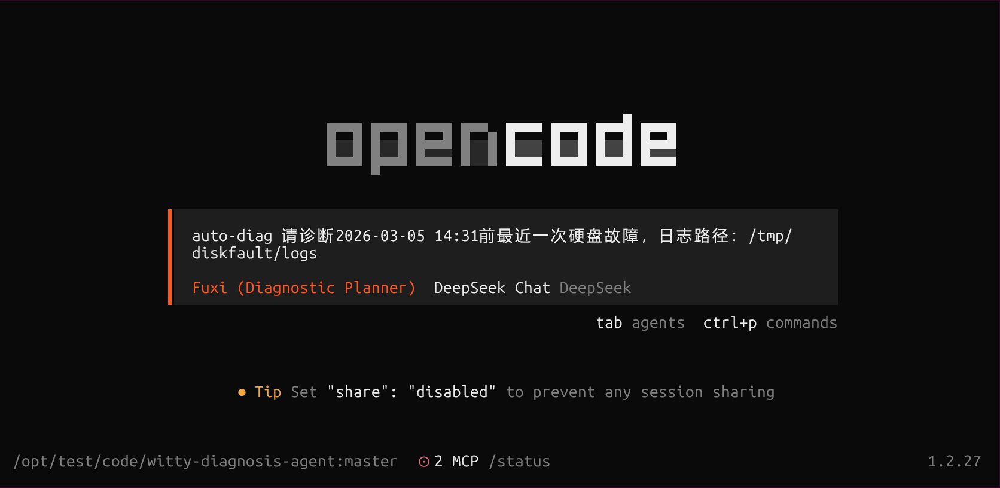
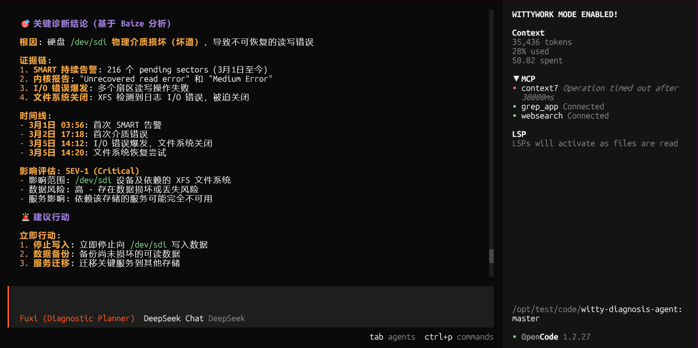

# 项目介绍

Witty智能诊断Agent基于「假设-推断」分析范式与多Agent协同架构，实现多路径并行分析，全面覆盖**应用→系统→内核→硬件**全栈故障场景，显著提升故障诊断的效率、全面性与精准度。依托拓扑动态感知、多模态遥测融合与多维关联分析技术，结合内置故障模式库与运维知识库，可在分钟级完成根因定位（无需人工介入），并支持代码行级精准定界。同时，Agent能自动生成结构化根因报告，清晰呈现溯源路径、关键证据与优化建议，高效支撑各类复杂故障的精准诊断。

# 架构与功能介绍

## 软件架构

Witty智能诊断Agent采用分层解耦架构，分为Agent层、Skill层、工具层、知识层四大核心模块，各模块通过标准化接口通信，兼具灵活性与可扩展性，确保系统高效迭代与维护。

### 1. Agent层：智能协同的推理引擎与决策中枢

采用多智能体协同机制，实现故障根因的全流程自动化诊断：诊断规划Agent（**伏羲 (Fuxi)**）明确故障信息并生成根因假设；编排调度Agent（**大禹 (Dayu)**）匹配诊断Skill，并行分发诊断任务；各验证分析Agent（**夸父 (Kuafu)**）执行具体推理分析；根因融合Agent（**白泽 (Baize)**）汇总多路分析结果，输出包含根因、证据链与修复建议的结构化报告；故障修复Agent依据根因与运维知识，安全可控地执行修复指令，快速恢复业务。

### 2. Skill层：专家经验的标准化沉淀与场景化赋能

将专家诊断思路、排查流程与最佳实践，封装为可复用的标准化技能，覆盖崩溃、死锁、内存泄漏等高频故障场景。为Agent提供标准化执行策略，实现专家经验的规模化复用，提升诊断结果的一致性与准确性。

### 3. 工具层：高效可靠的多源数据处理底座

深度集成openEuler原生观测与调试工具，以低底噪方式采集指标、日志、内核状态等多维度数据。通过清洗、去重、结构化处理，为上层诊断流程提供高质量数据输入，保障诊断过程的稳定性与高效性。

### 4. 知识层：持续进化与自我完善的知识底座

存储openEuler专属故障模式、诊断案例与因果规则，是精准诊断的核心基础。系统可自动沉淀诊断数据与结果，形成可复用案例并反哺Skill层优化，实现诊断能力的自进化迭代，让诊断精度随使用场景持续提升。


## 关键能力

- **智能日志解析**：基于模板挖掘、向量降维等算法，将海量非结构化日志转化为结构化特征，实现关键日志秒级精准识别，为根因分析提供高质量数据支撑。

- **VMCore自动分析**：针对系统宕机等严重故障，自动完成VMCore数据的采集、融合分析与根因定位，将运维人员从复杂的手动调试工作中解放出来，提升故障处置效率。

- **超节点拓扑动态感知**：基于eBPF技术实现灵衢超节点拓扑动态感知，将多模遥测数据与拓扑节点协同关联，辅助超节点故障的高效定界与定位。

# 快速开始

## 环境要求

- 运行环境：Bun（推荐）或 Node.js

- 依赖工具：已安装[OpenCode](https://opencode.ai/)

## 安装

```shell
git clone https://gitcode.com/sparklezfl/witty-diagnosis-agent.git
cd witty-diagnosis-agent
bun install
```

## 构建

```shell
bun run build
```

构建完成后，将在项目根目录生成 `dist/index.js` 等相关文件。

## 注册插件

配置文件支持两种路径（二选一），优先选择用户级配置：

- 用户级（推荐）：`~/.config/opencode/opencode.json` 或 `opencode.jsonc`

- 项目级：项目根目录下的 `.opencode/opencode.json` 或 `.opencode/opencode.jsonc`

在配置文件中新增或修改 `plugin` 数组，指向本仓库的构建入口（请替换为实际项目路径）：

```json
{
    "$schema": "https://opencode.ai/config.json",
    "plugin": [
        "file:///{witty-diagnosis-agent项目绝对路径}/dist/index.js"
    ]
}
```

示例（假设项目绝对路径为 `/opt/witty-diagnosis-agent`）：

```json
{
    "$schema": "https://opencode.ai/config.json",
    "plugin": [
        "file:///opt/witty-diagnosis-agent/dist/index.js"
    ]
}
```

## 配置模型

修改项目根目录下的 `.opencode/witty-diagnosis-agent.jsonc` 文件，配置如下：

```json
{
    "agents": {
        "fuxi": { "model": "deepseek/deepseek-chat" },
        "dayu": { "model": "deepseek/deepseek-chat" },
        "kuafu": { "model": "deepseek/deepseek-chat" },
        "baize": { "model": "deepseek/deepseek-chat" }
    }
}
```

# 如何使用

1. 启动 **OpenCode **。

2. 在终端执行命令：
   
   ```shell
   auto-diag 故障问题描述
   ```
   
   **说明**：当前支持离线分析，需在故障描述中指定**遥测数据 / 日志存储路径**。
   
   示例：
   
   ```shell
   auto-diag "请诊断2026-03-05 14:31前最近一次硬盘故障，日志路径：/tmp/diskfault/logs"
   ```
   
   

3. 系统将自动执行**智能诊断**流程。

4. 诊断完成后，根据终端输出的报告路径，查看完整的诊断分析报告。
   
   

# 如何贡献

## 社区贡献

我们诚挚欢迎新贡献者加入项目，也会为新加入者提供全面的指导与帮助。请注意：贡献代码前，请先签署 [CLA](https://clasign.osinfra.cn/sign/6983225bdcbb19710248ccf0)，再参考 [代码贡献指引](https://www.openeuler.org/zh/community/contribution/detail#_4-2-代码类贡献) 提交代码。

## 问题讨论

若您有任何疑问、建议或讨论需求，可通过以下方式联系我们：

- 提交 [issue](https://atomgit.com/openeuler/witty-diagnosis-agent/issues)

- 发送邮件至 [intelligence@openeuler.org](mailto:intelligence@openeuler.org)

# License

本项目采用 **MIT** 开源协议，详情请参阅项目根目录下的 LICENSE 文件。