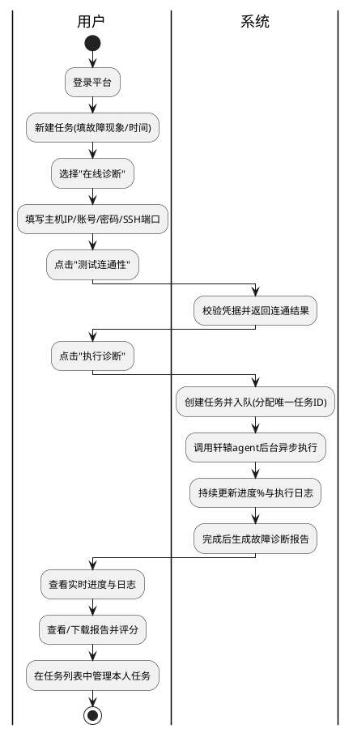

# 需求分析规格书 · 智能诊断前端 Web 服务
版本：1.2
最后更新：2026-06-20 14:23:40

> 关联产物：[用户需求描述](user-requirements-description.md)、[交互原型](openEuler-ops-prototype.html)

| 元数据 | 内容 |
|-|-|
| name | 智能诊断前端 Web 服务 |
| type | 新增功能（new feature） |
| change | 为轩辕诊断系统新增 Web 交互界面与后端服务层 |
| version | v1.1（已纳入 Review1.2 修订） |
| stage | Phase1 需求分析 |
| effort | Medium |
| base_commit | aa8af4a |
| update_time | 2026-06-17 |

**难度判断（Effort=Medium）**：需新增轩辕的**首个 HTTP 服务层 + 异步任务编排/队列 + 外部认证集成**，属跨模块新增（无现成服务层可复用），但不改造 agent 内部诊断算法、单仓内可控，故评估为中等复杂度。

## §1 基本信息

### 1.1 项目背景

**需求价值**：当前 `witty-diagnosis-agent`（轩辕智能诊断系统）只能通过 OpenCode 插件以"命令行 / 对话"方式交互式运行，缺少图形化入口、任务化并发管理与多用户隔离；本需求为其构建 Web 交互界面与后端服务，**降低使用门槛、支持任务化并发与结果留存、实现用户级数据隔离**，让运维人员能像管理工单一样创建、监控并复盘故障诊断任务。

**需求描述**：面向多用户服务端部署，提供"**新建诊断任务 → 后台异步执行 → 实时进度/日志监控 → 任务列表管理 → 报告查看/下载/评分**"的完整闭环，并以登录认证为前提保证用户任务隔离。本需求**只负责把现有轩辕编排能力（Xuanyuan→Fuxi→Dayu→Kuafu→Baize）封装为 Web 可访问的任务化服务**，不改造 agent 内部诊断算法；亦**不包含**运维问答（Q&A/CVE/继续分析）模块（列为二期）。

### 1.2 结构化信息

|维度|内容|
|-|-|
|Who|运维工程师 / 故障处理人员（已认证的平台用户）；系统侧为轩辕诊断 agent。|
|When|发生线上或离线故障、需要定位根因时；在故障处置与事后复盘阶段使用。|
|What|通过 Web 界面填写故障信息并选择在线/离线方式发起诊断任务，后台异步执行、实时查看进度与日志，完成后查看/下载/评分诊断报告，并在任务列表中管理仅属于本人的任务。|
|Why|轩辕现有交互方式（CLI/对话）门槛高、无法多用户并发与任务留存，难以规模化运维使用。|
|Where|多用户服务端部署（浏览器访问），对接外部统一认证；目标诊断对象为 openEuler 主机（在线）或其日志（离线）。|
|How Much|支持多任务并发，受全局队列+并发上限约束；任务/报告保留 N 天后自动清理；在线 SSH 凭据"仅本次使用、阅完即焚"，报告与日志自动脱敏。|
|How|登录 → 新建任务（在线填主机凭据并测连通性 / 离线上传日志）→ 执行 → 监控 → 看报告/评分；通过唯一任务 ID 查看详情。|

## §2 核心能力

### 2.1 场景分析

**主成功场景（在线诊断）**



|编号|路径|类别|触发|步骤|
|-|-|-|-|-|
|S-001|主成功|业务|用户在线诊断|登录→新建→填故障信息+在线凭据→测连通性→执行→后台异步诊断→实时进度/日志→看报告/评分|
|S-002|主成功|业务|用户离线诊断|登录→新建→填故障信息→选离线→上传 `.log/.tar.gz/.zip`→执行→后台解析日志诊断→实时进度/日志→看报告/评分|
|S-003|扩展|操作|并发下发|用户/多用户同时下发多个任务→系统按全局队列+并发上限调度，超额任务排队等待|
|S-004|扩展|操作|任务管理|用户在列表中按状态/类型查看本人任务，进入任意任务查看进度、日志或报告|
|S-005|扩展|操作|取消任务|用户对运行中任务点击"取消"→系统终止后台执行并置为已取消|
|S-006|扩展|操作|失败重试|任务失败后用户点击"重试"→以原故障信息重新发起诊断|
|S-007|扩展|操作|删除任务|用户删除本人历史任务→连带清理其报告/日志记录|
|S-101|异常|业务|连通性失败|测连通性时 SSH 不可达/认证失败/超时→提示失败原因，未通过前禁止执行在线诊断|
|S-102|异常|业务|采集中断连|在线采集过程中目标主机断连/超时→任务标记失败并保留已采集片段与失败原因|
|S-103|异常|业务|离线文件非法|上传非 `.log/.tar.gz/.zip` 格式或解压失败/空日志→拒绝或在执行时报错并提示|
|S-104|异常|业务|执行失败|agent 执行异常 / LLM 不可用 / 超时→任务置失败，记录错误，支持重试|
|S-105|异常|安全|越权访问|用户访问非本人任务 ID→拒绝访问（不泄露任务是否存在的差异信息）|
|S-106|异常|安全|会话过期|登录会话过期后操作→引导重新认证，不丢失已持久化任务|

### 2.2 业务规则

|编号|描述|原因|影响范围|
|-|-|-|-|
|BC-001|每个任务必须有全局唯一任务 ID，且与创建者用户身份绑定；用户**仅能**查看/操作本人创建的任务|实现用户任务隔离需求|全体用户、任务列表、详情、报告|
|BC-002|"运维类型"必须为"在线诊断"或"离线分析"二选一，二者输入字段互斥；同一任务不混用两种模式|两种模式数据采集来源不同|新建任务表单、执行|
|BC-003|在线诊断**必须**先"测试连通性"通过后方可"执行诊断"；连通性未通过禁止提交执行|避免无效任务消耗资源|在线诊断流程|
|BC-004|在线 SSH 凭据**仅本次使用、不持久化保存**；任务结束后即销毁，报告与日志中必须自动脱敏（IP/账号/密码等敏感信息）|安全合规，符合"加密存储、自动脱敏、用完即焚"承诺|凭据存储、日志、报告|
|BC-005|多任务并发受**全局队列 + 并发上限**约束；超过上限的任务进入排队状态，不立即执行|资源（LLM/SSH/系统）可控，防止过载|任务调度、状态机|
|BC-006|任务状态机：`排队中 → 运行中 →（成功/失败/已取消）`；运行中可"取消"。**"重试"复用原任务 ID，在该任务下新增一次执行记录**（不新建任务），任务列表仍按同一任务 ID 呈现，进度/日志切换为最新一次执行|明确任务生命周期与重试归属，消除二义|任务状态、列表、详情、重试|
|BC-007|任务、进度、日志、报告**持久化保存**，保留 N 天（默认 30 天，可配置，见 §5.2）后自动清理；删除任务连带清理其报告/日志。**仅非运行中（成功/失败/已取消/排队中）任务可删除；运行中任务需先取消方可删除**|任务列表/历史回看需求与存储成本平衡，避免删除运行中任务导致悬挂进程|存储、清理任务、删除|
|BC-008|故障现象、故障时间、运维类型为**必填**；故障时间支持具体时间点/时间段/不确定时间段，不确定时由模型自行判断|对齐用户需求描述|新建任务表单校验|
|BC-009|访问控制基于外部统一认证；未认证用户不可访问任何任务相关功能|多用户服务端部署安全前提|全站|
|BC-010|后端持久化存储**默认使用 SQLite**（单文件、零外部服务），并**必须支持切换为 MySQL**；存储后端经配置项选择，业务代码与具体数据库解耦|降低本地/单机部署门槛，同时满足云化/集中式部署对独立数据库的需求|存储层、安装脚本、配置、部署|
|BC-011|SQLite 默认数据文件存放于 `~/.witty-diagnosis-agent/database/`；MySQL 模式下连接信息由配置提供，不在该目录落库|对齐默认数据目录约定，便于备份与卸载；与 agent 每任务隔离 HOME（仅子进程重定向）互不冲突|安装脚本、存储层、留存清理|
|BC-012|前端与后端**可独立部署于不同容器/主机**；前端为静态 SPA，经反向代理（默认前端容器内 nginx 反代）访问后端 API 与实时通道，二者无强进程耦合|满足云化容器分离部署诉求，前后端可独立扩缩与发布|部署架构、前端、后端、配置|

### 2.3 数据约束

|编号|类别|名称|描述|
|-|-|-|-|
|DC-001|String(多行)|任务描述(故障现象)|必填，多行文本，描述故障表现|
|DC-002|String/时间|故障时间|必填，支持具体时间点、时间段或不确定时间段（自由文本，语义由模型判断）|
|DC-003|Enum|运维类型|必填，取值 `online`(在线诊断) / `offline`(离线分析)|
|DC-004|String(IP)|主机 IP|在线诊断必填，合法 IPv4/IPv6 或主机名|
|DC-005|String|账号|在线诊断必填，SSH 登录用户名（如 root）|
|DC-006|Secret|密码|在线诊断必填，SSH 登录口令；敏感字段，禁止明文落盘/回显/进报告|
|DC-007|Int|SSH 端口|在线诊断选填，默认 22，范围 1–65535|
|DC-008|File[]|日志文件|离线诊断必填（≥1 个），仅允许 `.log` / `.tar.gz` / `.zip`，不设大小/数量上限；压缩包须可成功解压且解压后日志内容非空（空内容/解压失败视为非法，拒绝或执行时报错）|
|DC-009|UUID|任务 ID|系统生成，全局唯一，与创建者绑定|
|DC-010|Enum|任务状态|`queued`/`running`/`succeeded`/`failed`/`canceled`|
|DC-011|Int(0–100)|任务进度|百分比，0–100|
|DC-012|Int(1–5)|结果评分|用户对报告结果的满意度评分，1–5 星，选填；每任务一条评分，可覆盖更新|

## §3 需求列表

### 3.1 功能性需求

|编号|类别|名称|描述|优先级|
|-|-|-|-|-|
|FR-001|认证|登录与用户认证|用户经外部统一认证登录后方可使用平台；建立会话，作为任务隔离与归属的身份基础。|P0|
|FR-002|新建任务|基础信息填写|提供故障现象（多行文本，必填）、故障时间（灵活输入，必填）、运维类型（在线/离线二选一，必填）的录入与校验。|P0|
|FR-003|新建任务|在线诊断模式|选择在线时填写主机 IP、账号、密码（必填）与 SSH 端口（选填默认 22）；提供"测试连通性"按钮验证凭据；展示凭据安全提示（加密存储、自动脱敏、仅本次使用不保存）。|P0|
|FR-004|新建任务|离线分析模式|选择离线时展示上传区，点击添加日志文件，明确提示支持 `.log/.tar.gz/.zip`，支持多文件添加与移除。|P0|
|FR-005|任务执行|后台异步执行|点击"执行诊断"后创建任务并调用轩辕 agent 后台异步执行；任务受全局队列+并发上限调度。|P0|
|FR-006|任务执行|进度与实时日志|执行过程中持续更新任务进度百分比与状态；用户查看任务时可看到 agent 的实时执行日志/过程。|P0|
|FR-007|任务执行|取消运行中任务|用户可取消运行中的任务，系统终止后台执行并置为已取消。|P1|
|FR-008|任务执行|失败重试|任务失败后用户可一键重试，以原故障信息重新发起诊断。|P1|
|FR-009|任务列表|列表与筛选|展示本人所有任务，含状态、进度、类型、创建时间等；支持按类型（全部/在线/离线）筛选；支持同时下发并展示多个任务。|P0|
|FR-010|任务列表|删除任务|用户可删除本人历史任务，连带清理其报告/日志。|P1|
|FR-011|用户隔离|任务归属与隔离|每个任务有唯一任务 ID 并与创建者绑定；用户仅能查看/操作本人任务；越权访问被拒绝。|P0|
|FR-012|报告|报告查看/下载|任务完成后查看故障诊断报告（含报告编号、故障级别、根因、影响、置信度等），支持新窗口打开与下载 HTML。|P0|
|FR-013|报告|结果评分|用户对报告结果进行 1–5 星满意度评分并提交。|P2|
|FR-014|数据安全|脱敏与凭据治理|报告与日志中自动脱敏敏感信息（IP/账号/密码）；在线凭据仅本次使用、任务结束即销毁、不持久化。|P0|
|FR-015|数据生命周期|留存与自动清理|任务/进度/日志/报告持久化保存，保留 N 天后自动清理。|P1|
|FR-016|部署运维|一键安装脚本|提供 `start.sh` 在本地/单机一键安装并启动后端服务：依据配置选择存储后端（默认 SQLite），自动**创建数据库**与**初始化数据表**，SQLite 默认数据文件落于 `~/.witty-diagnosis-agent/database/`；幂等执行（重复运行不破坏已有数据）。|P1|

### 3.2 非功能性需求

|编号|类别|名称|描述|优先级|
|-|-|-|-|-|
|NFR-001|安全|凭据保护|SSH 密码全程不明文落盘、不回显、不入日志/报告；传输加密（HTTPS）；任务结束后凭据销毁可验证。|P0|
|NFR-002|安全|脱敏有效性|报告与日志中 IP/账号/密码等敏感信息脱敏覆盖率 100%（关键字段抽检无泄漏）。|P0|
|NFR-003|安全|访问隔离|任意用户尝试访问非本人任务 ID 时 100% 被拒绝，且不通过响应差异泄露任务存在性。|P0|
|NFR-004|可用性|实时反馈时效|进度与日志更新延迟可感知地"实时"（目标值 ≤2s，**待体验/负载确认，见 §5.2**）；长任务期间界面不卡死。|P1|
|NFR-005|可靠性|并发与排队|在全局并发上限内稳定执行多任务，超额任务排队不丢失；单任务失败不影响其他任务。|P0|
|NFR-006|可靠性|崩溃恢复|服务重启后已持久化任务的状态、日志、报告不丢失；运行中任务有明确的恢复或失败兜底策略。|P1|
|NFR-007|性能|资源可控|并发上限可配置，避免 LLM/SSH/系统资源被诊断任务耗尽；上传不设大小上限但需有磁盘/内存保护兜底（见风险）。|P1|
|NFR-008|可维护性|可观测|任务执行关键节点（入队/开始/各 agent 阶段/完成/失败）有结构化日志，便于排障。|P2|
|NFR-009|兼容性|文件格式|离线上传严格限定 `.log/.tar.gz/.zip`，对非法格式给出明确提示。|P1|
|NFR-010|可移植性|存储可插拔|持久化层与具体数据库解耦，**默认 SQLite、可切换 MySQL**；切换仅经配置完成，无需改动业务代码；同一套建表/迁移逻辑适配两种方言。|P1|
|NFR-011|可部署性|前后端分离与容器化|前端、后端可分别构建为独立容器镜像并分离部署；提供容器化交付物（前端镜像 + 后端镜像 + 编排文件）；前端经反向代理对接后端，部署形态对云化环境友好（无强进程/主机耦合）。|P1|

## §4 验收方案

### 4.1 验收准则

|编号|关联能力|维度|描述|验收标准|
|-|-|-|-|-|
|AC-001|S-001, FR-002~006|功能|在线诊断主流程|登录后填写完整故障信息+在线凭据，测连通性通过→执行→任务进入运行→进度从 0 递增至 100→生成可查看报告|
|AC-002|S-002, FR-004~006|功能|离线诊断主流程|上传 ≥1 个合法日志文件→执行→后台解析→进度递增→生成报告，全程无需主机连接|
|AC-003|BC-003, S-101|功能|连通性门禁|未点测连通性或测试失败时，"执行诊断"被禁用/拒绝，并提示失败原因|
|AC-004|BC-002|功能|模式互斥|切换运维类型时在线/离线字段互斥展示；离线任务不要求主机凭据，反之亦然|
|AC-005|S-003, BC-005, NFR-005|可靠性|并发与排队|同时下发超过并发上限的任务时，超额任务显示"排队中"，并在前序任务释放后自动开始执行，无任务丢失|
|AC-006|FR-007, S-005|功能|取消任务|对运行中任务取消后 ≤5s 内状态变为"已取消"，后台执行被终止|
|AC-007|FR-008, S-104|功能|失败重试|失败任务重试后以原故障信息重新发起并可成功进入运行态|
|AC-008|FR-011, BC-001, NFR-003|安全|任务隔离|用户 A 用任务 ID 访问用户 B 的任务详情/报告/日志一律被拒绝|
|AC-009|FR-014, BC-004, NFR-001/002|安全|凭据与脱敏|任务完成后凭据不可再被读取；报告与日志中抽检无明文密码/账号/IP 泄漏|
|AC-010|FR-009|功能|任务列表与筛选|列表展示本人全部任务的状态/进度/类型/创建时间，按"全部/在线/离线"筛选结果正确|
|AC-011|FR-012/013|功能|报告查看与评分|完成任务可查看报告、下载 HTML、新窗口打开；提交 1–5 星评分后可见当前评分|
|AC-012|FR-015, BC-007|功能|留存清理|超过 N 天的任务/报告/日志被自动清理；删除任务后其报告/日志同步清除；运行中任务不可直接删除（需先取消）|
|AC-013|S-106, FR-001|安全|会话过期|登录会话过期后执行操作被拦截并引导重新认证；重认证后已持久化任务（列表/进度/报告）完整可见，无数据丢失|
|AC-014|NFR-010, BC-010|可移植性|存储后端可切换|默认配置下使用 SQLite 正常读写；将存储配置改为 MySQL 并指向有效实例后，同一套功能（建表/任务 CRUD/留存清理）在 MySQL 上同样通过，业务代码无需改动|
|AC-015|FR-016, BC-011|部署运维|一键安装|在干净环境执行 `start.sh` 后：自动完成数据库创建与表初始化，SQLite 数据文件出现于 `~/.witty-diagnosis-agent/database/`，后端 `GET /api/health` 返回 ok；再次执行 `start.sh` 不破坏已有数据（幂等）|
|AC-016|NFR-011, BC-012|可部署性|前后端容器分离|前端、后端分别以独立容器镜像启动并分离部署；经反向代理后，浏览器可完整走通"新建任务→进度/日志→看报告"主流程，前后端不共享进程/主机|

### 4.2 测试用例

|编号|关联准则|前置条件|操作步骤|预期结果（量化指标/判断条件）|
|-|-|-|-|-|
|TC-001|AC-001|用户已认证|新建在线任务→填全字段→测连通性→执行→观察进度|连通性返回成功；任务进入运行；进度 0→100；生成报告可打开|
|TC-002|AC-003|用户已认证|在线任务未测连通性直接点执行|执行被禁用/拒绝，提示"请先测试连通性"|
|TC-003|AC-002|用户已认证|新建离线任务→上传 1 个 `.tar.gz`→执行|任务运行并生成报告，全程无主机连接调用|
|TC-004|AC-002/NFR-009|用户已认证|离线任务上传 `.txt` 非法文件|拒绝添加或执行时报错，提示仅支持 `.log/.tar.gz/.zip`|
|TC-005|AC-005|并发上限=N，用户已认证|连续下发 N+2 个任务|前 N 个运行，后 2 个"排队中"；前序完成后排队任务自动开始|
|TC-006|AC-006|存在运行中任务|点击"取消"|≤5s 状态变"已取消"，后台进程终止|
|TC-007|AC-008|用户 A、B 各有任务|A 用 B 的任务 ID 直接请求详情/报告|请求被拒绝（403/404 一致策略），不泄露任务存在性|
|TC-008|AC-009|在线任务已完成|查看其日志与报告，检索密码/账号/IP|无明文敏感信息；凭据存储已销毁不可读|
|TC-009|AC-012|存在超过 N 天的历史任务|触发/等待清理|过期任务及其报告/日志被清除；列表不再展示|
|TC-010|AC-013|用户已登录且会话已过期|执行查看任务/新建等操作|操作被拦截并引导重新认证；重认证后原任务列表与报告完整可见|
|TC-011|AC-015|干净环境（未初始化）|执行 `start.sh`→检查数据目录与健康检查→再次执行 `start.sh`|首次：`~/.witty-diagnosis-agent/database/` 下生成 SQLite 文件且表已建，`/api/health`=ok；二次执行不报错、已有数据不丢失|
|TC-012|AC-014|分别配置 SQLite 与 MySQL|两种配置下各跑一遍建表+新建任务+查询+留存清理|两种存储后端结果一致、约束生效；切换仅改配置，无代码改动|
|TC-013|AC-016|前端、后端各自容器镜像就绪|分离启动两容器并经反代联通→浏览器走离线主流程|前后端分属不同容器；主流程（新建→进度/日志→报告）全通；无跨容器进程依赖|

### 4.3 交付物定义

|交付物|描述|
|-|-|
|需求分析规格书|本文档（01）|
|需求设计规格书|Phase2 输出（02），含架构、接口、数据、DFx 设计|
|开发计划|Phase3 输出（03），含 AR 任务分解与验收|
|前端 Web 界面|登录、新建任务、任务列表、任务详情（进度/日志）、报告查看/评分|
|后端服务|任务管理 API、agent 异步执行编排、队列调度、认证集成、脱敏与凭据治理、数据留存清理；**可插拔存储层（SQLite 默认 / MySQL 可选）**|
|一键安装脚本|`start.sh`：本地/单机一键安装与启动，含数据库创建与表初始化，SQLite 默认数据目录 `~/.witty-diagnosis-agent/database/`（FR-016）|
|容器化交付物|前端镜像（Dockerfile + nginx 反代配置）、后端镜像（Dockerfile）、编排文件（docker-compose，含可选 MySQL 服务），支持前后端分离部署（NFR-011）|

## §5 附录

### 5.1 用户记录

#### 5.1.1 初始描述

```text
1. 基于witty-diagnosis-agent创建一个web交互的界面，实现故障任务诊断，包括如下功能模块：
（1）新建故障诊断任务：用户可以通过填写故障信息，选择在线或离线方式进行诊断。
  - 基础信息填写：任务描述（故障现象，必填，多行文本）；故障时间（必填，支持灵活输入，可为时间点/时间段/不确定时间段，由模型自行判断）；运维类型（必填，"在线诊断"/"离线分析"二选一）。
  - 在线诊断模式（连接目标主机自动采集数据）：必填主机IP、账号、密码；选填SSH端口（默认22）；提供"测试连通性"按钮；安全提示"凭据将加密存储，报告与日志中自动脱敏。仅本次使用，不保存"。
  - 离线分析模式（上传已有日志进行分析）：展示日志上传区域，点击添加日志文件，支持 .log/.tar.gz/.zip。
（2）故障诊断任务执行：点击"执行诊断"后调用witty-diagnosis-agent（xuanyuan agent）后台执行；后台任务不断执行、更新状态、显示百分比；查看过程中可看到日志执行过程。
（3）故障诊断任务列表：查看所有已创建任务（状态、进度、创建时间等）；支持同时下发多个任务。
（4）用户任务隔离：每个用户只能查看和管理自己创建的任务；每个任务有唯一任务ID，可通过任务ID查看详情。
```

#### 5.1.2 澄清

```text
Q1 需求范围（4 个核心模块为基线，额外纳入项）：纳入【登录与用户认证】【诊断报告查看/下载/评分】；不纳入【运维问答 Q&A/CVE/继续分析】（二期）。
Q2 部署与使用形态：多用户服务端部署（需正式登录认证 + 严格数据隔离）。
Q3 用户身份/认证方式：对接外部统一认证（LDAP/OAuth/openEuler 等）。
Q4 需求设计深度 Effort：Medium。
Q5 任务生命周期操作：纳入【取消运行中任务】【失败后重试】【删除任务】；不纳入【在线↔离线切换重建】。
Q6 并发策略：全局队列 + 并发上限（超额排队）。
Q7 留存策略：任务/报告保留 N 天后自动清理；在线凭据阅完即焚、不持久化。
Q8 离线上传约束：不设大小/数量上限（仅限定格式 .log/.tar.gz/.zip）。
```

#### 5.1.3 Refine 澄清（2026-06-20，新增三项需求）

```text
Q9  存储后端：默认 SQLite、同时支持 MySQL；经配置切换，业务代码与具体数据库解耦（BC-010/NFR-010）。
Q10 部署形态：后端单实例（不做多副本水平扩展）；MySQL 主要服务于云化/集中式部署与备份便利。
Q11 安装形态：start.sh 仅面向本地/单机一键安装（含建库+建表，SQLite 默认数据目录 ~/.witty-diagnosis-agent/database/）；容器化为另一套交付物（FR-016 与 NFR-011 分属两种部署模式）。
Q12 前后端通信：前端容器内 nginx 反向代理后端 API 与 SSE，同源、免 CORS（BC-012）。
Q13 DB 访问层实现：采用查询构建器（Knex）统一 SQLite/MySQL 方言与迁移（设计层决策，详见 02）。
```

### 5.2 待确认与风险

```text
- [待确认] 留存天数 N 具体取值（建议默认 30 天，作为可配置项）——BC-007/FR-015/AC-012 引用此处。
- [待确认] 全局并发上限默认值与是否区分用户级配额（建议给出默认值 + 可配置）——BC-005/NFR-005/NFR-007 引用此处。
- [待确认] 实时反馈时效目标值（NFR-004 暂定 ≤2s），待体验/负载测试确认。
- [待确认] 外部认证的具体协议与对接方（LDAP / OAuth2 / OIDC / openEuler 统一认证），影响登录模块对接成本——Phase2 需确认。
- [风险] 离线上传"不设上限"在多用户服务端存在磁盘/内存耗尽风险；需在 NFR-007 兜底（流式落盘、磁盘配额或熔断告警），Phase2 给出技术约束。
- [风险] 轩辕当前无 HTTP/服务层（仅 OpenCode 插件），Web 服务是首个 HTTP 入口与异步执行编排层，集成方式为 Phase2 关键设计点。
- [已解决] 数据库选型：原 G5 暂定 better-sqlite3、后续再议 PostgreSQL；本次 refine 明确为**默认 SQLite + 可选 MySQL**，统一经 Knex 查询构建器适配（BC-010/NFR-010）。
- [约束] SQLite 为单文件单写入端，仅适配后端单实例；如未来需后端多副本水平扩展，须切换 MySQL（与 Q10 一致，已在 NFR-010/部署文档标注）。
- [约束] 默认数据目录 `~/.witty-diagnosis-agent/database/` 与 agent 状态根目录同父；Web 服务自身 DB 写真实 HOME，诊断子进程各自重定向 HOME，二者隔离不冲突（BC-011）。容器部署时该路径落于后端容器内并经命名卷持久化。
```


## 变更记录

### v1.2

- **新增**：
```
|BC-010|后端持久化存储**默认使用 SQLite**（单文件、零外部服务），并**必须支持切换为 MySQL**；存储后端经配置项选择，业务代码与具体数据库解耦|降低本地/单机部署门槛，同时满足云化/集中式部署对独立数据库的需求|存储层、安装脚本、配置、部署|
|BC-011|SQLite 默认数据文件存放于 `~/.witty-diagnosis-agent/database/`；MySQL 模式下连接信息由配置提供，不在该目录落库|对齐默认数据目录约定，便于备份与卸载；与 agent 每任务隔离 HOME（仅子进程重定向）互不冲突|安装脚本、存储层、留存清理|
|BC-012|前端与后端**可独立部署于不同容器/主机**；前端为静态 SPA，经反向代理（默认前端容器内 nginx 反代）访问后端 API 与实时通道，二者无强进程耦合|满足云化容器分离部署诉求，前后端可独立扩缩与发布|部署架构、前端、后端、配置|

```
- **新增**：
```
|FR-016|部署运维|一键安装脚本|提供 `start.sh` 在本地/单机一键安装并启动后端服务：依据配置选择存储后端（默认 SQLite），自动**创建数据库**与**初始化数据表**，SQLite 默认数据文件落于 `~/.witty-diagnosis-agent/database/`；幂等执行（重复运行不破坏已有数据）。|P1|

```
- **新增**：
```
|NFR-010|可移植性|存储可插拔|持久化层与具体数据库解耦，**默认 SQLite、可切换 MySQL**；切换仅经配置完成，无需改动业务代码；同一套建表/迁移逻辑适配两种方言。|P1|
|NFR-011|可部署性|前后端分离与容器化|前端、后端可分别构建为独立容器镜像并分离部署；提供容器化交付物（前端镜像 + 后端镜像 + 编排文件）；前端经反向代理对接后端，部署形态对云化环境友好（无强进程/主机耦合）。|P1|

```
- **新增**：
```
|AC-014|NFR-010, BC-010|可移植性|存储后端可切换|默认配置下使用 SQLite 正常读写；将存储配置改为 MySQL 并指向有效实例后，同一套功能（建表/任务 CRUD/留存清理）在 MySQL 上同样通过，业务代码无需改动|
|AC-015|FR-016, BC-011|部署运维|一键安装|在干净环境执行 `start.sh` 后：自动完成数据库创建与表初始化，SQLite 数据文件出现于 `~/.witty-diagnosis-agent/database/`，后端 `GET /api/health` 返回 ok；再次执行 `start.sh` 不破坏已有数据（幂等）|
|AC-016|NFR-011, BC-012|可部署性|前后端容器分离|前端、后端分别以独立容器镜像启动并分离部署；经反向代理后，浏览器可完整走通"新建任务→进度/日志→看报告"主流程，前后端不共享进程/主机|

```
- **新增**：
```
|TC-011|AC-015|干净环境（未初始化）|执行 `start.sh`→检查数据目录与健康检查→再次执行 `start.sh`|首次：`~/.witty-diagnosis-agent/database/` 下生成 SQLite 文件且表已建，`/api/health`=ok；二次执行不报错、已有数据不丢失|
|TC-012|AC-014|分别配置 SQLite 与 MySQL|两种配置下各跑一遍建表+新建任务+查询+留存清理|两种存储后端结果一致、约束生效；切换仅改配置，无代码改动|
|TC-013|AC-016|前端、后端各自容器镜像就绪|分离启动两容器并经反代联通→浏览器走离线主流程|前后端分属不同容器；主流程（新建→进度/日志→报告）全通；无跨容器进程依赖|

```
- **删除**：
```
|后端服务|任务管理 API、agent 异步执行编排、队列调度、认证集成、脱敏与凭据治理、数据留存清理|

```
- **新增**：
```
|后端服务|任务管理 API、agent 异步执行编排、队列调度、认证集成、脱敏与凭据治理、数据留存清理；**可插拔存储层（SQLite 默认 / MySQL 可选）**|
|一键安装脚本|`start.sh`：本地/单机一键安装与启动，含数据库创建与表初始化，SQLite 默认数据目录 `~/.witty-diagnosis-agent/database/`（FR-016）|
|容器化交付物|前端镜像（Dockerfile + nginx 反代配置）、后端镜像（Dockerfile）、编排文件（docker-compose，含可选 MySQL 服务），支持前后端分离部署（NFR-011）|

```
- **新增**：
```
#### 5.1.3 Refine 澄清（2026-06-20，新增三项需求）

```text
Q9  存储后端：默认 SQLite、同时支持 MySQL；经配置切换，业务代码与具体数据库解耦（BC-010/NFR-010）。
Q10 部署形态：后端单实例（不做多副本水平扩展）；MySQL 主要服务于云化/集中式部署与备份便利。
Q11 安装形态：start.sh 仅面向本地/单机一键安装（含建库+建表，SQLite 默认数据目录 ~/.witty-diagnosis-agent/database/）；容器化为另一套交付物（FR-016 与 NFR-011 分属两种部署模式）。
Q12 前后端通信：前端容器内 nginx 反向代理后端 API 与 SSE，同源、免 CORS（BC-012）。
Q13 DB 访问层实现：采用查询构建器（Knex）统一 SQLite/MySQL 方言与迁移（设计层决策，详见 02）。
```


```
- **新增**：
```
- [已解决] 数据库选型：原 G5 暂定 better-sqlite3、后续再议 PostgreSQL；本次 refine 明确为**默认 SQLite + 可选 MySQL**，统一经 Knex 查询构建器适配（BC-010/NFR-010）。
- [约束] SQLite 为单文件单写入端，仅适配后端单实例；如未来需后端多副本水平扩展，须切换 MySQL（与 Q10 一致，已在 NFR-010/部署文档标注）。
- [约束] 默认数据目录 `~/.witty-diagnosis-agent/database/` 与 agent 状态根目录同父；Web 服务自身 DB 写真实 HOME，诊断子进程各自重定向 HOME，二者隔离不冲突（BC-011）。容器部署时该路径落于后端容器内并经命名卷持久化。

```

