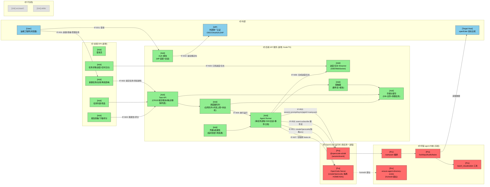
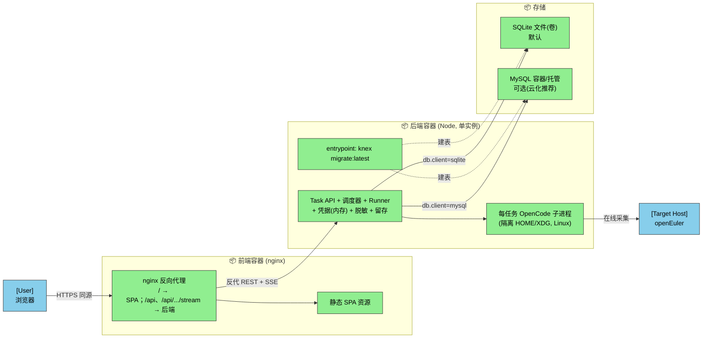
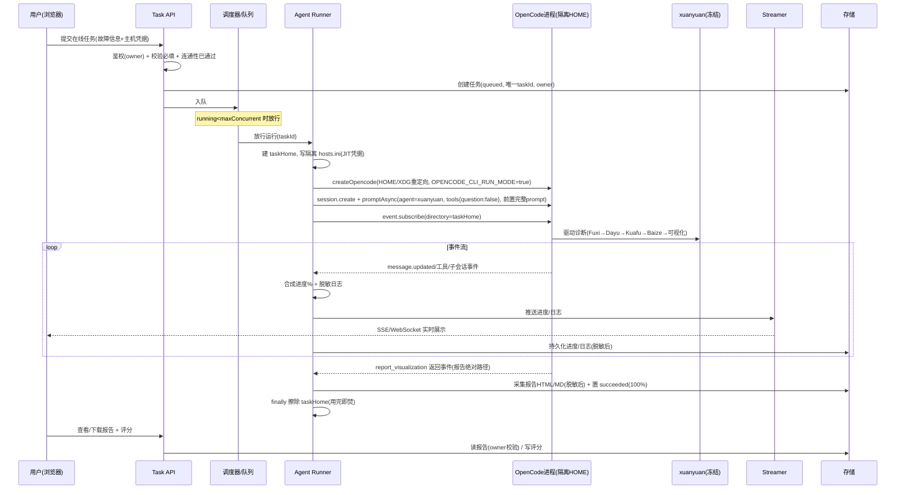
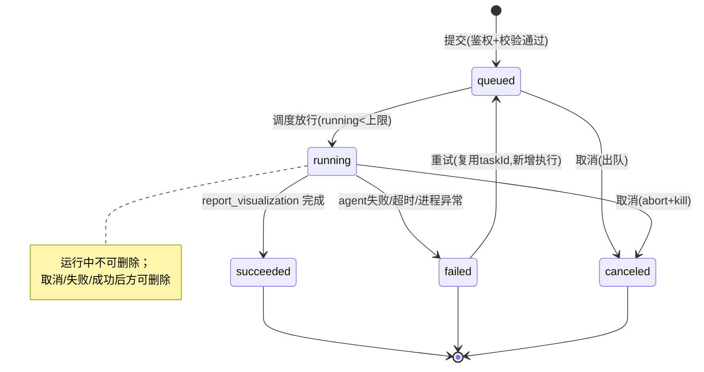
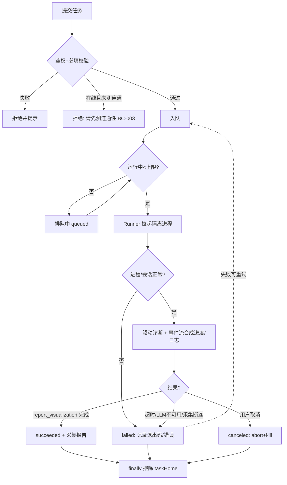

# 智能诊断前端 Web 服务 —— 需求设计规格书
版本：1.3
最后更新：2026-06-20 14:26:18

> 文档版本：v1.2（Review2.2 第二轮 Conditional Pass 88；E-1 + W-1~W-6 + W-A/B/C + INFO 全部落实；A2.2 可行性验证：Feasible-with-conditions，条件已全部吸收为设计约束）
> 类型（type）：新增服务（New Service，agent 内核零改动）
> 基线（base_commit）：aa8af4a（master）
> 更新时间（update_time）：2026-06-17
> 上游文档：[01-需求分析规格书](./01-需求分析规格书.md)（v1.1，Review1.2 条件通过）
> 难度评估：**Medium**
> 技术栈：后端 Node/TypeScript（与 agent、`@opencode-ai/sdk` 同栈）；前端 SPA；agent 内核（`src/opencode`）冻结
> 实现范围：新增独立 Web 服务（前端 + 后端 API + 任务编排层）；不修改 `src/opencode` agent 内核与 `skills/`

---

## §1 设计概要

### 1.1 实现思路

在 `witty-diagnosis-agent` 之上新增一个**独立的 Web 服务**，作为轩辕诊断能力的**首个 HTTP 入口**，把原本只能交互式运行的 agent 封装为任务化、多用户、可并发的诊断平台。核心思路：

1. **任务化建模（持久化状态机）**：每次诊断 = 一个带唯一 ID、归属用户、可持久化的 `Task`，状态机 `queued → running → (succeeded | failed | canceled)`；任务、进度、日志、报告落库/落盘，保留 N 天后清理（FR-005/006/009/011/015、BC-006/007）。

2. **进程级任务隔离驱动 agent（关键决策 D-001）**：后端**不**修改 agent 内核，而是为每个运行中的任务**启动一个独立的 OpenCode 进程**，并为其重定向 `HOME / XDG_DATA_HOME / XDG_CACHE_HOME` 到一个**每任务专属目录**。由于 agent 的状态根目录由 `ensure-agent-directory-exists.ts:6` 的 `join(homedir(), ".witty-diagnosis-agent")` 决定，且 OpenCode 会话存储位于 `~/.local/share/opencode/storage`（受 `XDG_DATA_HOME`），重定向上述环境变量即可让 agent 沿用其"单用户"假设而获得**完全隔离**——彻底规避进程级全局态（`_mainSessionID`、`subagentSessions`）、共享报告目录、`hosts.ini` 单文件竞争等并发隐患，且**零改动 agent 内核**（与"最小变更"原则一致）。隔离仅在 Linux/openEuler 成立（部署目标一致）。

3. **SDK 会话 + 事件流（关键决策 D-002）**：后端经 `@opencode-ai/sdk` 的 `createOpencode()` 拉起每任务进程、`session.create()` 建会话、`session.promptAsync({ agent: "xuanyuan", parts: [故障信息] })` 启动诊断；订阅 `client.event.subscribe({ query: { directory } })` 事件流（用法见 `runner.ts:88`），把 `message.updated` / 工具调用 / 子会话 / `session.idle` 等事件**合成为进度百分比与实时日志**，经后端 SSE/WebSocket 推送给前端。**完成判定采用双信号（与 `runner.ts` 的 `pollForCompletion` + `eventState.lastPartText` 同源）**：① 轮询会话至空闲/稳定后，解析 Xuanyuan 最终消息正文（`message.updated` 的 part text）中的报告路径关键字（`xuanyuan/identity-constraints.ts:41`："RCA报告路径："/"报告已写入："）；② 校验该 `.html` 确已出现在 `taskHome/.witty-diagnosis-agent/baize/reports/`。每任务 HOME 全新、该目录初始为空，取最新 `.html` 即本任务产物，二者互为印证。

4. **非交互（headless）契约复刻**：SDK 默认不会进入 CLI 运行态，后端**必须**在 spawn 的进程上设 `OPENCODE_CLI_RUN_MODE=true`，并在每次 prompt 传 `tools: { question: false }`（复刻 `runner.ts:32`、`tool-config-handler.ts:34-35` 行为）。**真正的交互阻塞点在 Xuanyuan 层而非 Fuxi**：Xuanyuan 以 `subagent_type="fuxi-sub"` 驱动诊断（`xuanyuan/identity-constraints.ts:11`），而 Fuxi-Sub **严禁调用 `question`**、信息不足时以 `【需要交互】` 文本标记把问题**上抛给 Xuanyuan**（`fuxi/fuxi-sub/identity-constraints.ts:99-102`（:102 「严禁使用 question 等任何提问工具」））；Xuanyuan 收到后用**自己的 `question` 工具**向用户提问并循环续跑 fuxi-sub（`xuanyuan/identity-constraints.ts:14-17`），且 Stage-4 修复确认也强制用 `question`（`:46-49`）。因此 `tools:{question:false}` 必须作用于 **Xuanyuan** 的 prompt，且后端**必须把全部必填输入前置注入首条 prompt**（故障现象/时间/模式、在线主机组名、离线日志绝对路径），否则该交互循环在无真实用户答复时无法推进。（注：另有 `fuxi/fuxi` 变体会主动调用 `question`（`:135`）；须确认运行时绑定的是经 Xuanyuan→fuxi-sub 的主路径。）

5. **凭据"用完即焚"与脱敏（关键决策 D-003）**：在线 SSH 凭据仅以加密形式临时驻留。需注意 agent 现状在**多处运行期**以明文 `ansible_ssh_pass` 写入 `hosts.ini`——不止 Fuxi 启动期（`fuxi/fuxi/identity-constraints.ts:26`、`fuxi/fuxi-sub/identity-constraints.ts:27`、`fuxi/interview-mode.ts:64`），**Kuafu 执行期在 IP 不存在时也会自行新建组并写明文密码**（`kuafu/agent.ts:136`）。因此"加密存储 + 用完即焚 + 自动脱敏"由宿主以两道确定性防线兜底：① 任务结束（含成功/失败/取消/超时/崩溃）在 `finally` 阶段**保证擦除整个每任务 HOME**（覆盖任意子代理运行期写盘）；② 脱敏器作用于**事件流（工具入参/结果，含 Kuafu 的 Bash 回显/`cat hosts.ini`）与最终报告**，确保 IP/账号/密码不进入持久化日志与报告（BC-004、FR-014、NFR-001/002）。

6. **认证与隔离**：对接外部 IdP（OIDC/OAuth2/LDAP，经适配层），建立会话；所有任务 API 强制按 `owner == 当前用户` 鉴权，越权访问统一返回不泄露存在性的响应（FR-001/011、BC-009、NFR-003）。

7. **全局队列 + 并发上限**：调度器维护全局 FIFO 队列，仅放行不超过并发上限的任务进入 `running`（即同时存活的 OpenCode 进程数受控），超额任务停留 `queued`（BC-005、NFR-005）。

### 1.2 设计决策

|编号|决策项|类别|内容|理由|
|-|-|-|-|-|
|D-001|并发隔离方式：**进程级任务隔离（每任务独立 OpenCode 进程 + 重定向 HOME/XDG）**，而非"单 OpenCode 服务多会话"|架构设计 / 多租户策略|后端为每个 running 任务 spawn 一个独立 opencode 进程，环境变量重定向 `HOME/XDG_DATA_HOME/XDG_CACHE_HOME` 至每任务目录，使 agent 的 `~/.witty-diagnosis-agent` 与会话存储天然隔离；进程数受全局并发上限约束|agent 内核含**进程级全局态**（`features/claude-code-session-state/state.ts:4` 的 `_mainSessionID`、`subagentSessions`）与**共享文件路径**（`hosts.ini`、`baize/reports` 等）。单服务多会话方案需改造这些全局态与目录命名（侵入冻结内核、风险高、超出需求范围）；进程隔离方案以"每进程仍是单用户"复用现有假设，**零改动内核**即获完全隔离。代价是每任务一个进程，但诊断本身是重量级 LLM 编排，进程开销可忽略，且并发上限已封顶进程数|
|D-002|agent 驱动与进度获取：**SDK `session.promptAsync(agent="xuanyuan")` + `event.subscribe` 事件流合成进度/日志**，并以 `report_visualization` 工具返回事件作为完成信号|技术选型 / 数据流设计|经 `@opencode-ai/sdk`（已是依赖，`package.json:49`）驱动，复用 `cli/run/runner.ts` 已验证的"订阅事件流 + 轮询至完成"模式；进度由事件→里程碑映射合成；完成以解析 `report_visualization` 返回的报告绝对路径为准|该模式在 `runner.ts:88` 已生产验证（`createOpencode`/`client.event.subscribe` 真实存在）；agent 无原生进度%信号，只能由宿主把粗粒度阶段/工具/子会话事件映射为百分比；`session.idle` 在每轮边界都触发、不可靠，故以工具返回事件做确定性完成握手，且每任务 HOME 全新使报告目录无历史文件干扰|
|D-003|凭据治理：**JIT 写入隔离 hosts.ini + 任务终态强制擦除 HOME + 事件流级脱敏**，调用侧确定性实现|DFx 设计（安全）|凭据加密临时驻留，运行期 JIT 写入每任务 `hosts.ini`，`finally`（含崩溃/取消/超时）擦除整个每任务 HOME；脱敏器扫描事件流（工具入参/结果）与报告|agent 在**多处运行期**把明文 `ansible_ssh_pass` 写入 `hosts.ini`——Fuxi 启动期（`fuxi/fuxi/identity-constraints.ts:26`、`fuxi/fuxi-sub/identity-constraints.ts:27`、`fuxi/interview-mode.ts:64`）**与 Kuafu 执行期**（`kuafu/agent.ts:136`），且 Bash 步骤可能 `cat` 出 hosts.ini 内容到日志；故"加密存储+用完即焚+自动脱敏"（BC-004/NFR-001/002）必须由宿主确定性代码兜底：擦除整个 taskHome 可覆盖任意子代理写盘，脱敏须作用于事件流（含 Kuafu 回显）而非仅最终报告，擦除须为终态保证而非尽力而为|
|D-004|持久化可插拔：**Knex 查询构建器 + 方言驱动（`sqlite3` 默认 / `mysql2` 可选）**，存储层经 Repository 接口隔离|技术选型 / 可移植性（NFR-010、BC-010）|后端不直连具体数据库，统一经 Knex 访问；`db.client` 配置选择方言；建表/演进统一用 **Knex migrations**（同一套迁移脚本适配 SQLite 与 MySQL），该迁移即 start.sh 与容器 entrypoint 的"表初始化"唯一来源|需求要求"默认 SQLite、同时支持 MySQL"。Knex 是成熟查询构建器，对 SQLite/MySQL 同时一等支持、内置迁移工具，一套代码两种方言，避免手写双驱动的方言漂移与重复维护；相较 ORM 更轻、与既有 SQL 风格接近。原 better-sqlite3 为同步 API，改用 Knex（异步）需将存储层接口统一为 async（影响面限于存储层与调用处的 await，业务逻辑不变）|
|D-005|部署形态：**前后端分离、独立容器**；前端容器（nginx 托管静态 SPA）**反向代理** `/api` 与 SSE 至后端容器，同源免 CORS；**后端单实例**（不做多副本水平扩展）|架构设计 / 可部署性（NFR-011、BC-012）|前端为纯静态产物，后端为有状态服务（全局队列 + 内存凭据驻留 + 每任务 OpenCode 子进程）。前端 nginx 反代使浏览器同源访问、规避 CORS 与跨域 Cookie 复杂度；后端保持单实例以延续 D-001/D-003（全局队列、内存凭据、进程隔离）成立条件——这些状态为进程内态，多副本会破坏全局并发上限与凭据查找，故本期锁定单实例，水平扩展须先切 MySQL 并外置队列（列为演进项）|单后端实例方案对现有核心决策零冲击，改动集中在"打包与部署"而非"运行时架构"，风险最低且满足云化分离部署诉求|
|D-006|交付与安装：**本地一键安装 `start.sh`** 与**容器化交付物**双轨|DFx 设计（可部署性，FR-016/NFR-011）|`start.sh` 面向本地/单机：装依赖→读配置→`knex migrate`（建库+建表）→拉起后端，SQLite 默认数据目录 `~/.witty-diagnosis-agent/database/`，幂等可重入；容器化面向云化：前端镜像 + 后端镜像 + `docker-compose`（含可选 MySQL 服务），表初始化由后端容器 entrypoint 复用同一 Knex migrations 完成|两种部署模式共享同一套迁移与配置约定，避免"安装路径"与"容器路径"建表逻辑分叉；满足"一键安装"与"云化分离部署"两类诉求|

---

## §2 架构设计

### 2.1 架构变更

#### 2.1.1 变更总览

图例：🔵外部 🟢新增 🟡修改 🔴保护（被调用但本期禁止修改）⚪不涉及。接口命名 IF-{E外部/N新增/M修改/R复用}{编号}。

> 说明：本设计为**新增独立服务**，agent 内核（`src/opencode/*`）全部为 🔴保护/⚪不涉及；新增集中在 Web 服务侧。



#### 2.1.2 模块变更

|模块|变更|职责|接口|依赖|约束|
|-|-|-|-|-|-|
|前端 SPA `web/frontend/`|新增|登录、新建任务（在线/离线表单）、任务列表/筛选、任务详情（进度+实时日志）、报告查看/下载/评分|IF-N01~N04|后端 API、SSE/WebSocket|纯前端，不直接触达 agent；敏感字段不在本地持久化|
|Auth 模块|新增|对接外部 IdP，登录/登出/会话校验，提供当前用户身份|IF-E01/E02|外部 IdP（OIDC/OAuth2/LDAP 适配层）|认证失败拦截所有任务 API；不自存口令|
|Task API|新增|任务 CRUD、提交/取消/重试/删除、按用户隔离的列表与详情、报告获取/评分|IF-N02/N04|调度器、存储|所有读写强制 `owner==当前用户`；越权返回一致响应（不泄露存在性）|
|调度器/队列|新增|全局 FIFO 队列 + 并发上限；任务状态机；取消=终止进程；重试=复用任务 ID 新增执行|IF-N05|Agent Runner、存储|并发上限可配；超额排队不丢失；状态迁移持久化|
|Agent Runner|新增|每任务：spawn 隔离 OpenCode 进程→建会话→prompt xuanyuan→订阅事件→合成进度/日志→判定完成→采集报告→擦除 HOME|IF-N05/N06/N07、IF-R01~R03|@opencode-ai/sdk、脱敏器、凭据模块|必须设 `OPENCODE_CLI_RUN_MODE=true` 且 `tools:{question:false}`；HOME/XDG 重定向；终态 finally 擦除 HOME|
|进度/日志 Streamer|新增|后端→前端实时通道，转发合成后的进度与脱敏日志|IF-N03/N06|Agent Runner|断连可重连续传；仅推送脱敏内容|
|凭据&连通性|新增|在线凭据临时加密驻留；"测试连通性"探测（独立于完整诊断）|IF-N02|（连通性探测）SSH/ansible ping|凭据不持久化；测连通不触发完整诊断|
|脱敏器|新增|扫描事件流（工具入参/结果）与报告，脱敏 IP/账号/密码|IF-N06|—|对事件流与报告双重作用；脱敏覆盖率目标 100%|
|存储与留存|新增|任务/进度/日志/报告持久化；保留 N 天清理；删除任务连带清理|—|数据访问层(Knex) + 文件系统|运行中任务不可删除；凭据不入库；经存储层接口访问，不直连具体方言|
|数据访问层（DB Abstraction）|新增|基于 Knex 封装 Repository；按 `db.client` 选择 SQLite/MySQL 方言；统一 Knex migrations 建表/演进|—|knex + sqlite3/mysql2|默认 SQLite；切 MySQL 仅改配置（NFR-010/BC-010）；接口为 async|
|安装脚本 `start.sh`|新增|本地/单机一键安装：装依赖→建库（migrate）→建表→启动后端；SQLite 默认数据目录 `~/.witty-diagnosis-agent/database/`|—|数据访问层、配置|幂等可重入；不破坏已有数据（FR-016/BC-011）|
|容器化交付物（前端镜像/后端镜像/编排）|新增|前端镜像（nginx 托管 SPA + 反代 `/api`、SSE 至后端）、后端镜像、`docker-compose`（含可选 MySQL 服务）；后端容器 entrypoint 复用 Knex migrations 建表|—|nginx、Docker|前后端分离部署；同源免 CORS；后端单实例（NFR-011/BC-012）|
|OpenCode 运行时（每任务进程）|保护|提供 SDK 会话与事件；以隔离 env 运行|IF-R01~R03|—|仅以 SDK 调用/订阅；不修改其代码|
|`src/opencode/*` agent 内核|保护|编排与诊断（xuanyuan/fuxi/dayu/kuafu/baize、report_visualization、ensure-agent-directory-exists）|—|—|**本期禁止修改**；仅经 SDK + 环境隔离 + 前置 prompt 集成|
|`src/xiaoO/`、`skills/`|不涉及|—|—|—|明确防止误改|

### 2.2 模块详情

#### 2.2.1 Agent Runner（新增，核心集成模块）

- 负责职责：把一个 `Task` 转化为一次真实的轩辕诊断执行，并把执行过程实时回流为进度与日志、把结果沉淀为报告——是 Web 服务与冻结 agent 之间的唯一接缝。
- 功能性设计：
  1. **进程拉起与隔离**：为任务创建专属目录 `taskHome=<base>/tasks/<taskId>/home`，以 `env = { ...process.env, HOME: taskHome, XDG_DATA_HOME, XDG_CACHE_HOME, OPENCODE_CLI_RUN_MODE: "true" }` 调用 `createOpencode({ port: <auto>, hostname: "127.0.0.1", signal })` 拉起独立进程并取得 `client`。
  2. **启动诊断**：`session.create()` → 组装**前置完整 prompt**（故障现象/时间/模式 + 在线主机组名或离线日志绝对路径）→ `session.promptAsync({ path:{id}, body:{ agent:"xuanyuan", tools:{ question:false }, parts:[{type:"text", text:<prompt>}] }, query:{ directory } })`（签名与 per-call `tools` 覆盖经 `runner.ts:95-106` 确证）。
  3. **事件订阅与进度合成**：`client.event.subscribe({ query:{ directory: taskHome } })`，把 `message.updated`/工具调用/子会话事件映射为里程碑→进度百分比（见 §4.1），并把（脱敏后）文本增量作为实时日志推送给 Streamer。
  4. **完成判定与报告采集**：双信号判定（§1.1.3）——轮询至空闲稳定 + 解析 Xuanyuan 最终消息正文的报告路径关键字（`xuanyuan/identity-constraints.ts:41`），并校验 `.html` 已现于 `baize/reports/`；取 `taskHome/.witty-diagnosis-agent/baize/reports/` 下最新 `.html` 复制入持久化存储。
  5. **取消**：收到取消请求 → `session.abort` + 终止该任务进程；状态置 `canceled`。
- 非功能设计：
  1. 资源回收：无论成功/失败/取消/超时/崩溃，`finally` 关闭 server、kill 进程、**擦除 `taskHome`**（落实 BC-004 用完即焚）。
  2. 健壮性：进程异常退出→任务置 `failed` 并记录退出码；事件流断开→在存活进程上重订阅。
- 风险与缓解：
  1. **headless 下 Xuanyuan 交互循环无法推进**：主路径上 Fuxi-Sub 严禁 `question`、以 `【需要交互】` 上抛（`fuxi/fuxi-sub/identity-constraints.ts:99-102`（:102 「严禁使用 question 等任何提问工具」）），Xuanyuan 用自身 `question` 续跑（`xuanyuan/identity-constraints.ts:14-17`）并在 Stage-4 强制 `question` 确认修复（`:46-49`）。`question:false` 下 Xuanyuan 只能以文本替代、流程可下穿，但属行为假设 → **必须在实现前做 xuanyuan headless 端到端冒烟**，确认前置 prompt 输入完整时无阶段卡死（落实为 TC/AC，见 §8.1 遗留风险 R-1）。
  2. 隔离仅 Linux 成立（`ensure-agent-directory-exists.ts:6` 用非 HOME-aware 的 `os.homedir()`，Windows 取 USERPROFILE 无法随 HOME 迁移）：约束部署目标为 Linux/openEuler，文档显式标注（见 R-3）。

#### 2.2.2 调度器 / 队列（新增）

- 负责职责：在全局资源约束下编排任务的生命周期，保证并发可控、超额排队不丢失、状态可追溯。
- 功能性设计：
  1. 全局 FIFO 队列 + 可配并发上限 `maxConcurrent`；放行条件 `running 数 < maxConcurrent`。
  2. 状态机驱动（见 §3.2）：`queued→running→succeeded|failed|canceled`；持久化每次迁移。
  3. 取消：运行中→委派 Runner 终止；排队中→直接出队置 `canceled`。
  4. 重试：复用原 `taskId`，在其下新增一次执行记录（对齐 BC-006），重新入队。
- 非功能设计：进程崩溃/服务重启后，依据持久化状态恢复（运行中任务按失败兜底，见 NFR-006）。
- 风险与缓解：并发上限默认值需结合单进程内存/LLM 占用实测确定（§5.2 待确认）；上限过低影响吞吐、过高耗尽资源 → 设为可配置 + 文档给默认值。

#### 2.2.3 脱敏器 + 凭据模块（新增）

- 负责职责：保证敏感信息（IP/账号/密码）既不持久化也不外泄，且凭据"仅本次使用"。
- 功能性设计：
  1. 凭据：在线 SSH 凭据**仅驻留于后端进程内存**，以 `taskId` 为键，用进程级密钥（启动时生成、不落盘）加密；**从不序列化入库、不写文件、不进前端持久化、不进日志**。`POST /api/tasks` 收到后即进入该内存密文区，至 `vault.stage` JIT 写入隔离 `hosts.ini`、任务终态 `vault.wipe` 时连同 taskHome 一并清除；驻留窗口 = 提交到任务终态。
  2. 连通性测试：以 ansible ping 或直接 SSH 探测在每任务上下文执行，独立于完整诊断，返回连通/失败原因（BC-003）。
  3. 脱敏：对**事件流（工具入参/结果）**与**最终报告**应用字段+正则脱敏；覆盖 hosts.ini 内容被 `cat` 进日志的情形。
- 非功能设计：脱敏覆盖率目标 100%（NFR-002）；脱敏在持久化与推送**之前**完成。
- 风险与缓解：脱敏漏网 → 以白名单字段 + 已知敏感模式双策略，并在验收抽检（AC-009/TC-008）。

### 2.3 功能影响

```text
- 智能诊断 Web 服务（新增）
  - 认证与会话
    - 新增：外部 IdP 登录、会话校验、用户身份
  - 任务管理
    - 新增：新建（在线/离线）、列表/筛选、详情、取消、重试、删除、按用户隔离
  - 任务执行
    - 新增：进程级隔离驱动 xuanyuan、事件流合成进度/实时日志、完成判定与报告采集
  - 报告
    - 新增：报告查看/下载/评分
  - 数据安全与生命周期
    - 新增：凭据用完即焚、事件流+报告脱敏、保留 N 天清理
- 轩辕 agent 内核（冻结，零改动）
  - 仅经 SDK 会话 + 环境隔离 + 前置 prompt 被集成
```

|功能|变更|变更点|对应需求|
|-|-|-|-|
|登录认证|增|Auth 模块 + IdP 适配 + 会话|FR-001、BC-009、NFR-003|
|新建任务（基础/在线/离线）|增|Task API + 表单 + 连通性探测 + 凭据临时驻留|FR-002/003/004、BC-002/003/008、DC-001~008|
|任务异步执行|增|调度器 + Agent Runner（进程隔离 + SDK 驱动）|FR-005、BC-005、D-001/D-002|
|进度与实时日志|增|事件流→里程碑映射 + Streamer|FR-006、DC-011、NFR-004|
|取消/重试/删除|增|状态机 + 进程终止 + 复用 taskId 重试 + 连带清理|FR-007/008/010、BC-006/007|
|任务列表/隔离|增|按 owner 鉴权的列表/详情；唯一 taskId|FR-009/011、BC-001、NFR-003|
|报告查看/下载/评分|增|报告采集/持久化 + 评分（每任务一条可覆盖）|FR-012/013、DC-012|
|脱敏与凭据治理|增|脱敏器（事件流+报告）+ 用完即焚擦除|FR-014、BC-004、NFR-001/002|
|留存与清理|增|持久化 + N 天清理任务|FR-015、BC-007|
|存储可插拔|增|数据访问层(Knex) + 方言驱动 + 统一 migrations|NFR-010、BC-010、D-004|
|一键安装/容器化|增|`start.sh`（本地）+ 前端/后端镜像 + compose（含可选 MySQL）|FR-016、NFR-011、BC-011/012、D-005/006|

### 2.4 部署架构（前后端分离 / 容器化）

**两种部署模式共享同一份后端构件与 Knex migrations，仅"如何拉起 + 用哪种存储"不同：**

| 模式 | 形态 | 存储默认 | 表初始化入口 | 适用 |
|-|-|-|-|-|
| 本地/单机 | `start.sh` 原生进程 | SQLite（`~/.witty-diagnosis-agent/database/witty.db`） | `start.sh` 调 `knex migrate:latest` | 开发、单机试用、小规模 |
| 云化/容器 | 前端容器 + 后端容器（+ 可选 MySQL 容器） | 可切 MySQL（推荐）；SQLite 需挂卷 | 后端容器 entrypoint 调 `knex migrate:latest` | 集中式/云化分离部署 |

**容器拓扑（云化分离部署）**：



**关键约束**：
1. 前端容器**仅**经 nginx 反代触达后端，浏览器侧同源、无 CORS；后端地址（upstream）由前端容器环境变量注入（BC-012）。
2. 后端**单实例**：全局队列、内存凭据驻留、每任务 OpenCode 子进程均为进程内态；多副本会破坏全局并发上限与凭据查找，故本期不水平扩展（D-005）。水平扩展演进路径：切 MySQL + 外置共享队列 + 凭据外置/粘性路由。
3. 进程级隔离（D-001）依赖重定向 HOME/XDG 且**仅 Linux 成立**（R-3），故后端容器基础镜像须为 Linux；容器内 spawn 子进程不受容器边界影响。
4. SQLite 为单文件单写入端，容器模式下须挂载持久卷且不可多副本共享；云化推荐 MySQL（NFR-010）。

---

## §3 核心流程

### 3.1 主流程（在线诊断，从提交到出报告）



### 3.2 任务状态机



### 3.3 降级与异常流程



---

## §4 算法设计

### 4.1 进度百分比合成规则

**目标**：agent 无原生进度%信号（只发粗粒度阶段/工具/子会话事件），需把事件流确定性映射为 0–100 的进度，支撑 FR-006/DC-011/AC-001。

**核心逻辑**：以诊断流水线阶段为锚点的里程碑加权，阶段内按子任务/工具事件做有界插值（单调不回退）：

```
里程碑权重（累计上界，可配）：
  受理/入队            →  5%
  Fuxi 规划完成        → 25%   (检测到 plan 文件/规划阶段结束事件)
  Dayu 调度开始        → 30%
  Kuafu 执行           → 30%→80% (按已完成子任务数/总子任务数线性插值)
  Baize RCA           → 80%→95%
  report_visualization 完成 → 100%

规则：
  - 进度单调不回退：new = max(prev, milestoneFloor + interp)
  - 阶段事件缺失时停在当前里程碑 floor，不臆造前进
  - 仅 report_visualization 完成事件可置 100%
```

**里程碑的事件判据（确定性识别，供实现对齐）**：

| 里程碑 | 识别信号（来自 event.subscribe 流） |
|-|-|
| 受理/入队 | 调度器放行、`session.created` |
| Fuxi 规划完成 | `task(subagent_type="fuxi-sub")` 子会话返回 + Plan 文件出现于 `taskHome/.witty-diagnosis-agent/dayu/plans/`（每任务 HOME 全新，初始为空，故首现即本任务产物） |
| Dayu 调度开始 | `task(subagent_type="dayu")` 子会话创建 |
| Kuafu 执行(插值) | Kuafu 子任务报告 `dayu/report/kuafu_*.md` 出现数 / 分母（Plan 第 5 节 JSON 元数据的 `tasks[]` 计数，由 Runner 读取 plan 文件解析；解析不到则用饱和函数逼近 80%） |
| Baize RCA | `task(subagent_type="baize")` 子会话创建/活动 |
| 完成(100%) | **双信号**：Xuanyuan 最终消息正文出现报告路径关键字（`xuanyuan/identity-constraints.ts:41`）**且** `baize/reports/` 出现 `.html`（§1.1.3） |

**输入**：事件流中的子会话 create/idle、工具调用与返回事件、上述文件出现信号（与 `cli/run/events.ts` 消费的同一组事件 + taskHome 目录观察）。
**输出**：单调递增的进度百分比 + 当前阶段标签。
**复杂度分析**：O(事件数)，常量内存（仅维护 prev、当前阶段、子任务计数）。
**边界条件与异常处理**：子任务总数未知时 Kuafu 段按"已完成数的饱和函数"逼近 80% 不越界；失败/取消冻结当前进度并打终态标记。

---

## §5 数据模型

### 5.1 核心实体

**描述**：全部为 Web 服务新增持久化实体（agent 侧不新增表）。凭据**不**作为持久化实体存在（仅临时密文驻留）。

```
User            { id, external_subject(IdP), display_name, created_at }   // 由 IdP 映射，最小化存储
Task            { id(UUID), owner_id→User, title/故障现象, fault_time(text),
                  mode(online|offline), status(queued|running|succeeded|failed|canceled),
                  progress(0..100), current_stage, created_at, updated_at, expire_at }
OnlineTarget    { task_id→Task, host_ip, ssh_user, ssh_port(default 22) }  // 不含密码；密码仅临时密文，不落本表
OfflineUpload   { id, task_id→Task, filename, stored_path, size, uploaded_at }
Execution       { id, task_id→Task, attempt_no, started_at, ended_at, exit_reason }  // 重试=同task新增execution
LogChunk        { id, execution_id→Execution, seq, ts, text(已脱敏) }      // 定稿：日志正文落盘(每execution一文件)，本表仅存索引/偏移，避免DB膨胀
Report          { id, task_id→Task, html_path, md_path, report_no, fault_level, created_at }  // 已脱敏
Rating          { task_id→Task(唯一), stars(1..5), updated_at }            // 每任务一条，可覆盖
```

关系：`User 1—* Task`；`Task 1—1 OnlineTarget`(在线) / `1—* OfflineUpload`(离线)；`Task 1—* Execution`；`Execution 1—* LogChunk`；`Task 1—0..1 Report`；`Task 1—0..1 Rating`。

### 5.2 留存与清理

- `Task.expire_at = created_at + N 天`（N 默认 30，可配，见 §6.3）；后台清理任务删除过期 `Task` 及其 `OfflineUpload/Execution/LogChunk/Report/Rating` 与磁盘文件。
- 凭据无持久化模型；`taskHome`（含 hosts.ini）在任务终态即擦除，不参与 N 天留存。

### 5.3 存储后端与数据目录（可插拔）

- **抽象方式**：所有实体经数据访问层（Knex + Repository）读写，业务代码不出现具体方言 SQL；`db.client` 选择 `sqlite`（默认）或 `mysql`。
- **建表/演进**：统一用 **Knex migrations**（一套迁移脚本适配 SQLite/MySQL）；该迁移是 `start.sh` 与容器 entrypoint 的"表初始化"唯一来源，幂等可重复执行（NFR-010/FR-016）。
- **SQLite（默认）**：单文件 `~/.witty-diagnosis-agent/database/witty.db`（路径可配）；容器模式须挂持久卷；仅适配后端单实例（单写入端）。
- **MySQL（可选）**：连接信息（host/port/user/password/database）由配置提供，不落 `~/.witty-diagnosis-agent/database/`；云化分离部署推荐。
- **方言注意（实现约束）**：跨方言兼容点须在迁移与查询中规避——主键/UUID 用 `varchar(36)` 而非依赖具体自增语义；时间戳用统一类型；布尔在 SQLite 落为整型；避免使用任一方言独有的 SQL 函数。`LogChunk` 正文仍落盘、DB 仅存索引（两方言一致），规避大文本字段的方言差异与 DB 膨胀。

---

## §6 接口设计

### 6.1 外部接口（前端 ↔ 后端，REST + 实时通道）

|名称|变更|描述|请求方式|请求参数|返回参数|错误码|
|-|-|-|-|-|-|-|
|IF-N01 登录|增|发起外部 IdP 认证|`GET /api/auth/login` → 重定向|—|重定向至 IdP；回调建会话|401|
|IF-N02 创建任务|增|提交诊断任务|`POST /api/tasks`|故障现象/时间/模式；在线:IP/账号/密码/端口；离线:上传文件引用|`{taskId, status:"queued"}`|400/401/403|
|IF-N02b 测连通性|增|在线凭据连通探测|`POST /api/tasks/connectivity-test`|IP/账号/密码/端口|`{ok, reason?}`|400/401|
|IF-N02c 上传日志|增|离线日志上传(流式落盘)|`POST /api/uploads`(multipart)|文件(.log/.tar.gz/.zip)|`{uploadId, filename}`|400/401/415|
|IF-N03 订阅进度/日志|增|实时进度与日志|`GET /api/tasks/:id/stream`(SSE/WS)|taskId|进度/日志事件流(脱敏)|401/404|
|IF-N04a 任务列表|增|本人任务列表/筛选|`GET /api/tasks?type=all\|online\|offline`|筛选条件|任务数组(owner 限定)|401|
|IF-N04b 任务详情|增|单任务详情|`GET /api/tasks/:id`|taskId|任务+进度+阶段|401/404|
|IF-N04c 取消/重试/删除|增|生命周期操作|`POST /api/tasks/:id/{cancel\|retry}`、`DELETE /api/tasks/:id`|taskId|新状态|401/404/409(运行中删除)|
|IF-N04d 报告获取/下载|增|查看/下载报告|`GET /api/tasks/:id/report[?format=html]`|taskId|报告 HTML/元数据(脱敏)|401/404|
|IF-N04e 评分|增|提交/更新评分|`PUT /api/tasks/:id/rating`|`{stars:1..5}`|当前评分|400/401/404|

> 越权一致性（NFR-003/AC-008/TC-007）：对**非 owner** 的任意任务 ID 访问，IF-N03/N04* **统一返回 404**（而非 403），响应体一致、且不引入可被时序侧信道区分的处理差异——使"任务不存在"与"无权访问"对外不可区分，不泄露存在性。IF-N02b（测连通性）/N02c（上传）为**任务创建前**的无任务态操作，仅需登录鉴权（401），不涉及任务归属。

### 6.2 内部接口

|名称|变更|描述|调用方|提供方|请求参数|返回参数|
|-|-|-|-|-|-|-|
|`scheduler.enqueue` / `cancel` / `retry`|增|入队/取消/重试，驱动状态机|Task API|调度器|`taskId`|任务新状态|
|`runner.run(task)`|增|执行一次诊断（进程隔离全流程）|调度器|Agent Runner|`Task`|`Promise<Result>`（永不阻塞调度循环）|
|`runner.cancel(taskId)`|增|abort 会话 + kill 进程|调度器|Agent Runner|`taskId`|—|
|`vault.stage(taskId, cred)` / `wipe(taskId)`|增|JIT 写 hosts.ini / 终态擦除 HOME|Agent Runner|凭据模块|`taskId, cred`|—|
|`desensitize(text)` / `desensitizeEvent(evt)`|增|脱敏事件流与报告|Agent Runner|脱敏器|文本/事件|脱敏后内容|
|`createOpencode({port,hostname,signal})`(IF-R01)|复用|拉起隔离 OpenCode 进程|Agent Runner|@opencode-ai/sdk|env 重定向 HOME/XDG|`{client, server}`|
|`session.promptAsync` / `session.abort` / `event.subscribe`(IF-R02/R03)|复用|启动诊断 / 中止 / 订阅事件|Agent Runner|@opencode-ai/sdk|见 §2.2.1|会话/事件流|

### 6.3 配置接口

|名称|变更|描述|类型|默认值|取值范围|
|-|-|-|-|-|-|
|`scheduler.maxConcurrent`|增|全局并发上限（同时存活诊断进程数）|number|`4`（保守默认；上线前按"单进程峰值内存×并发≤可用内存×0.7"实测调优）|正整数|
|`task.retentionDays`|增|任务/报告留存天数 N|number|`30`|正整数|
|`auth.provider`|增|外部认证类型（Phase2 须落定具体协议，见 §8.1 R-6）|enum|`oidc`|`oidc \| oauth2 \| ldap`|
|`auth.*`|增|IdP 端点/client/secret/回调 等|object|—|按 provider|
|`opencode.serverPortBase`|增|每任务进程端口起点（自动避让）|number|`4096`|有效端口|
|`runner.taskTimeoutMs`|增|单任务最长执行时长（超时置 failed）|number|`1800000`（30 min，可按实测调整）|正整数|
|`upload.streamToDisk`|增|上传流式落盘（不设大小上限的兜底）|boolean|`true`|true/false|
|`upload.diskQuotaBytes`|增|上传总磁盘配额（熔断阈值，防耗尽）|number|`53687091200`（50GB；`0`=不限，不建议）|正整数/0=不限|
|`db.client`|增|存储后端方言|enum|`sqlite`|`sqlite \| mysql`|
|`db.sqlite.path`|增|SQLite 数据文件路径|string|`~/.witty-diagnosis-agent/database/witty.db`|有效路径|
|`db.mysql`|增|MySQL 连接（host/port/user/password/database）|object|—|`db.client=mysql` 时必填|
|`db.pool`|增|连接池上下限（主要用于 MySQL）|object|`{min:1,max:5}`|按部署调|
|`frontend.apiUpstream`|增|前端 nginx 反代的后端地址（容器环境变量注入）|string|`http://backend:PORT`|有效 URL|
|`server.publicBaseUrl`|增|后端对外基地址（认证回调等用）|string|—|有效 URL|

---

## §7 DFx 设计

### 7.1 可用性 / 可靠性

|故障/风险场景|触发|应对策略|取舍/决策|
|-|-|-|-|
|agent headless 下卡在交互 `question`|Fuxi/Xuanyuan 坚持调用提问工具|`OPENCODE_CLI_RUN_MODE=true` + `tools:{question:false}` + 前置全部输入；实现前 headless 冒烟验证|复刻 CLI-run 契约；属最高风险，以冒烟测试关闭（§8.1 R-1）|
|单任务进程崩溃/异常退出|某个 OpenCode 进程错误|该任务置 `failed` + 记录退出码；事件断流在**存活**进程重订阅；其他任务不受影响|进程隔离使**单任务**崩溃不影响他任务（NFR-005）|
|后端服务整体重启|后端进程重启|重启会使**所有** running 子进程随之消亡 → 据持久化状态把全部 `running` 置 `failed` 兜底；用户可凭持久化任务一键重试（不丢历史，NFR-006）|不做运行态进程接管（复杂度高、收益低）；与上一行"单任务隔离"分场景：整体重启是全量失败兜底，非单点隔离|
|采集中目标主机断连/超时|在线 SSH 中断|任务 `failed`，保留已采集日志片段与失败原因|对齐 S-102|
|检索/执行超时|超过 `taskTimeoutMs`|abort + kill + 置 failed|显式超时上界，避免僵尸进程|

### 7.2 性能

|指标|目标值|模块分解|分解假设|
|-|-|-|-|
|进度/日志实时性|更新可感知"实时"，目标 ≤2s（NFR-004，待体验/负载确认）|事件订阅→合成<50ms；推送延迟取决于 SSE/WS 链路|事件 cadence 由 agent 输出节奏决定，非后端可控|
|提交任务 API|P95 < 300ms（仅入队，不含诊断）|鉴权+校验+落库+入队|诊断本身异步，不计入 API 时延|
|并发吞吐|= maxConcurrent 个任务并行|每任务一进程|单进程内存/LLM 占用待实测以定上限|

**优化措施**：

|关注点|应对策略|取舍/决策|
|-|-|-|
|进度合成无原生信号|里程碑加权 + 子任务插值 + 单调不回退（§4.1）|接受近似进度；以 report_visualization 事件锚定 100%|
|上传不设大小上限的资源风险|流式落盘 + 总磁盘配额熔断 + 告警|需求选择"不设上限"，以配额兜底防耗尽（NFR-007）|
|每任务进程开销|并发上限封顶进程数；诊断本身重量级，进程开销占比小|换取零内核改动的完全隔离|

### 7.3 安全性

|高风险项|类型|风险分析|应对策略|
|-|-|-|-|
|SSH 凭据明文落盘|数据保护|agent 在多处运行期把明文 `ansible_ssh_pass` 写入 hosts.ini——Fuxi 启动期（`fuxi/fuxi/identity-constraints.ts:26`、`fuxi/fuxi-sub/identity-constraints.ts:27`、`fuxi/interview-mode.ts:64`）**与 Kuafu 执行期**（`kuafu/agent.ts:136`），且可能被 Bash 步骤 `cat` 进日志|凭据加密临时驻留 + JIT 写隔离 hosts.ini + **终态强制擦除整个 taskHome（覆盖 Kuafu 运行期写盘）** + 脱敏器作用于事件流（含 Kuafu 回显）与报告（D-003）|
|敏感信息进日志/报告|日志审计|事件流/报告可能含 IP/账号/密码|脱敏器作用于事件流与报告，持久化/推送前完成；覆盖率目标 100%（NFR-002）|
|越权访问他人任务|授权认证|任务 ID 可枚举|强制 owner 鉴权；越权返回一致响应不泄露存在性（NFR-003）|
|外部 IdP 集成|授权认证|认证链路与回调安全|经成熟 OIDC/OAuth2/LDAP 库；HTTPS 全程；会话过期重认证（S-106/AC-013）|
|上传文件|依赖安全|恶意/超大文件|限定扩展名 .log/.tar.gz/.zip；流式落盘 + 配额熔断；解压在隔离任务上下文|

### 7.4 其他

|目标|类型|应对策略|取舍/决策|
|-|-|-|-|
|agent 内核零侵入|可维护性/可升级性|仅经 SDK + 环境隔离 + 前置 prompt 集成，不改 `src/opencode`|agent 升级不破坏 Web 服务（接口面稳定）|
|认证可替换|可扩展性|`auth.provider` 适配层（oidc/oauth2/ldap）|新增 IdP 改适配器单点|
|可测试性|可测试性|① Runner 以 mock OpenCode client 单测事件→进度映射；② 调度器状态机纯函数测试；③ headless 端到端冒烟（关闭 R-1）|三层测试，关键路径确定性可测|
|可观测性|可维护性|任务关键节点（入队/开始/各阶段/完成/失败）结构化日志，统一前缀|支撑排障与命中统计（NFR-008）|
|存储可移植|可移植性|数据访问层经 Knex 抽象，`db.client` 切换 SQLite/MySQL；统一 migrations 适配两方言；规避方言独有 SQL|默认 SQLite 零运维，云化切 MySQL；以"配置切换"换取双方言维护成本（NFR-010）|
|可分离部署|可部署性|前后端独立镜像；前端 nginx 反代后端（同源免 CORS）；`start.sh` 本地一键安装；后端单实例|满足云化分离部署；后端单实例保住 D-001/D-003 进程内态前提，水平扩展留演进路径（NFR-011/D-005）|
|安装一致性|可维护性|本地 `start.sh` 与容器 entrypoint 复用同一 Knex migrations 建表，幂等可重入|避免两路建表逻辑分叉导致 schema 漂移（FR-016/D-006）|

---

## §8 附件

### 8.1 验证遗留风险（A2.2 可行性验证输出，已固化为设计约束）

1. **R-1（最高风险）headless 下 Xuanyuan 交互循环无法推进**：主路径为 Xuanyuan→fuxi-sub——Fuxi-Sub **严禁** `question`、以 `【需要交互】` 上抛（`fuxi/fuxi-sub/identity-constraints.ts:99-102`（:102 「严禁使用 question 等任何提问工具」）），由 **Xuanyuan** 用自身 `question` 提问并续跑（`xuanyuan/identity-constraints.ts:14-17`），Stage-4 修复确认也强制 `question`（`:46-49`）。故 `tools:{question:false}` 须作用于 **Xuanyuan** prompt（对 Fuxi-Sub 设置是空操作）。`question:false` 下 Xuanyuan 只能以文本替代、流程**可**下穿，但属行为假设。**约束**：实现首个里程碑即做 xuanyuan headless 端到端冒烟，确认前置 prompt 含全部必填输入时无阶段卡死（含 Stage-4 修复确认）；并确认运行时绑定的是经 Xuanyuan→fuxi-sub 主路径（而非会主动调用 `question` 的 `fuxi/fuxi` 变体，`:135`）。落实为开发计划首个验证任务。
2. **R-2 隔离边界含 XDG 存储**：OpenCode 会话 SQLite 位于 `~/.local/share/opencode/storage`（`data-path.ts:13`，受 `XDG_DATA_HOME`）。**约束**：每任务进程必须同时重定向 `HOME + XDG_DATA_HOME + XDG_CACHE_HOME`，否则会话存储跨进程共享、隔离失效。
3. **R-3 隔离仅 Linux 成立（根因）**：隔离失效的根因是 `ensure-agent-directory-exists.ts:6` 用**非 HOME-aware** 的 `os.homedir()`——Linux 上 `os.homedir()` 认 `$HOME`，Windows 取 `USERPROFILE`、agent 状态根目录无法随 `HOME` 迁移。注意 XDG 存储（`data-path.ts`，经 xdg-basedir 在含 Windows 的**所有平台**用 `~/.local/share`）虽可被 `XDG_DATA_HOME` 重定向，但 agent 状态根目录这一支柱无法在 Windows 迁移，故两支柱跨平台成立条件不一致。**约束**：部署目标锁定 Linux/openEuler。
4. **R-4 完成信号**：以 `report_visualization` 工具返回事件解析报告绝对路径为准（`report-visualization/tool.ts` 返回 HTML 绝对路径）；`session.idle` 仅作辅助兜底。每任务 HOME 全新→`baize/reports/` 初始为空，取最新 `.html` 安全。
5. **R-5 进度近似**：无 ground-truth 百分比，§4.1 为近似映射（已补里程碑事件判据）；NFR-004 的 ≤2s 为目标值、依赖 agent 事件 cadence，验收以"可感知实时"为准、待负载确认。
6. **R-6 认证协议须 Phase2 落定**：上游 01-§5.2 要求 Phase2 确认外部认证协议与对接方。**约束**：`auth.provider` 默认 `oidc`，开发前须与对接方确认最终协议（oidc/oauth2/ldap）及端点，作为 Auth 适配层的实现输入。

### 8.2 可行性验证记录摘要

- 验证方式：委派 Subagent 对照 `references/design-available.md` 核查设计符合性与代码可行性。
- 结论：**Feasible-with-conditions**。SDK 用法（`createOpencode`/`createOpencodeClient`/`event.subscribe`）经 `cli/run/server-connection.ts:1,25`、`runner.ts:88` 真实存在并生产验证；端口自动避让无单实例锁（`port-utils.ts`）支持并发多进程；非交互契约（`OPENCODE_CLI_RUN_MODE`、`tools:{question:false}`）经 `runner.ts:32`、`tool-config-handler.ts:34-35` 确证。
- 条件（R-1~R-6）已全部吸收为本文 §1.1/§2.2/§7/§8.1 的显式设计约束。R-4 完成握手代码佐证：`report-visualization/tool.ts` 返回报告 HTML 绝对路径。
- 用户确认：认可设计方案，技术栈定为 Node/TypeScript 后端 + SPA 前端（2026-06-17）。
- Review2.2 修订（v1.1）：纠正 R-1 的交互阻塞机制（真实阻塞在 Xuanyuan `【需要交互】→question→续跑` 循环，而非 Fuxi）、补全明文凭据落盘位置（含 `kuafu/agent.ts:136`）、给出关键配置默认值、补里程碑事件判据、统一越权返回 404、明确服务重启兜底与 Linux 约束根因。


## 变更记录

### v1.3

- **新增**：
```
|D-004|持久化可插拔：**Knex 查询构建器 + 方言驱动（`sqlite3` 默认 / `mysql2` 可选）**，存储层经 Repository 接口隔离|技术选型 / 可移植性（NFR-010、BC-010）|后端不直连具体数据库，统一经 Knex 访问；`db.client` 配置选择方言；建表/演进统一用 **Knex migrations**（同一套迁移脚本适配 SQLite 与 MySQL），该迁移即 start.sh 与容器 entrypoint 的"表初始化"唯一来源|需求要求"默认 SQLite、同时支持 MySQL"。Knex 是成熟查询构建器，对 SQLite/MySQL 同时一等支持、内置迁移工具，一套代码两种方言，避免手写双驱动的方言漂移与重复维护；相较 ORM 更轻、与既有 SQL 风格接近。原 better-sqlite3 为同步 API，改用 Knex（异步）需将存储层接口统一为 async（影响面限于存储层与调用处的 await，业务逻辑不变）|
|D-005|部署形态：**前后端分离、独立容器**；前端容器（nginx 托管静态 SPA）**反向代理** `/api` 与 SSE 至后端容器，同源免 CORS；**后端单实例**（不做多副本水平扩展）|架构设计 / 可部署性（NFR-011、BC-012）|前端为纯静态产物，后端为有状态服务（全局队列 + 内存凭据驻留 + 每任务 OpenCode 子进程）。前端 nginx 反代使浏览器同源访问、规避 CORS 与跨域 Cookie 复杂度；后端保持单实例以延续 D-001/D-003（全局队列、内存凭据、进程隔离）成立条件——这些状态为进程内态，多副本会破坏全局并发上限与凭据查找，故本期锁定单实例，水平扩展须先切 MySQL 并外置队列（列为演进项）|单后端实例方案对现有核心决策零冲击，改动集中在"打包与部署"而非"运行时架构"，风险最低且满足云化分离部署诉求|
|D-006|交付与安装：**本地一键安装 `start.sh`** 与**容器化交付物**双轨|DFx 设计（可部署性，FR-016/NFR-011）|`start.sh` 面向本地/单机：装依赖→读配置→`knex migrate`（建库+建表）→拉起后端，SQLite 默认数据目录 `~/.witty-diagnosis-agent/database/`，幂等可重入；容器化面向云化：前端镜像 + 后端镜像 + `docker-compose`（含可选 MySQL 服务），表初始化由后端容器 entrypoint 复用同一 Knex migrations 完成|两种部署模式共享同一套迁移与配置约定，避免"安装路径"与"容器路径"建表逻辑分叉；满足"一键安装"与"云化分离部署"两类诉求|

```
- **删除**：
```
|存储与留存|新增|任务/进度/日志/报告持久化；保留 N 天清理；删除任务连带清理|—|DB + 文件系统|运行中任务不可删除；凭据不入库|

```
- **新增**：
```
|存储与留存|新增|任务/进度/日志/报告持久化；保留 N 天清理；删除任务连带清理|—|数据访问层(Knex) + 文件系统|运行中任务不可删除；凭据不入库；经存储层接口访问，不直连具体方言|
|数据访问层（DB Abstraction）|新增|基于 Knex 封装 Repository；按 `db.client` 选择 SQLite/MySQL 方言；统一 Knex migrations 建表/演进|—|knex + sqlite3/mysql2|默认 SQLite；切 MySQL 仅改配置（NFR-010/BC-010）；接口为 async|
|安装脚本 `start.sh`|新增|本地/单机一键安装：装依赖→建库（migrate）→建表→启动后端；SQLite 默认数据目录 `~/.witty-diagnosis-agent/database/`|—|数据访问层、配置|幂等可重入；不破坏已有数据（FR-016/BC-011）|
|容器化交付物（前端镜像/后端镜像/编排）|新增|前端镜像（nginx 托管 SPA + 反代 `/api`、SSE 至后端）、后端镜像、`docker-compose`（含可选 MySQL 服务）；后端容器 entrypoint 复用 Knex migrations 建表|—|nginx、Docker|前后端分离部署；同源免 CORS；后端单实例（NFR-011/BC-012）|

```
- **新增**：
```
|存储可插拔|增|数据访问层(Knex) + 方言驱动 + 统一 migrations|NFR-010、BC-010、D-004|
|一键安装/容器化|增|`start.sh`（本地）+ 前端/后端镜像 + compose（含可选 MySQL）|FR-016、NFR-011、BC-011/012、D-005/006|

```
- **新增**：
```
### 2.4 部署架构（前后端分离 / 容器化）

**两种部署模式共享同一份后端构件与 Knex migrations，仅"如何拉起 + 用哪种存储"不同：**

| 模式 | 形态 | 存储默认 | 表初始化入口 | 适用 |
|-|-|-|-|-|
| 本地/单机 | `start.sh` 原生进程 | SQLite（`~/.witty-diagnosis-agent/database/witty.db`） | `start.sh` 调 `knex migrate:latest` | 开发、单机试用、小规模 |
| 云化/容器 | 前端容器 + 后端容器（+ 可选 MySQL 容器） | 可切 MySQL（推荐）；SQLite 需挂卷 | 后端容器 entrypoint 调 `knex migrate:latest` | 集中式/云化分离部署 |

**容器拓扑（云化分离部署）**：


**关键约束**：
1. 前端容器**仅**经 nginx 反代触达后端，浏览器侧同源、无 CORS；后端地址（upstream）由前端容器环境变量注入（BC-012）。
2. 后端**单实例**：全局队列、内存凭据驻留、每任务 OpenCode 子进程均为进程内态；多副本会破坏全局并发上限与凭据查找，故本期不水平扩展（D-005）。水平扩展演进路径：切 MySQL + 外置共享队列 + 凭据外置/粘性路由。
3. 进程级隔离（D-001）依赖重定向 HOME/XDG 且**仅 Linux 成立**（R-3），故后端容器基础镜像须为 Linux；容器内 spawn 子进程不受容器边界影响。
4. SQLite 为单文件单写入端，容器模式下须挂载持久卷且不可多副本共享；云化推荐 MySQL（NFR-010）。


```
- **新增**：
```
### 5.3 存储后端与数据目录（可插拔）

- **抽象方式**：所有实体经数据访问层（Knex + Repository）读写，业务代码不出现具体方言 SQL；`db.client` 选择 `sqlite`（默认）或 `mysql`。
- **建表/演进**：统一用 **Knex migrations**（一套迁移脚本适配 SQLite/MySQL）；该迁移是 `start.sh` 与容器 entrypoint 的"表初始化"唯一来源，幂等可重复执行（NFR-010/FR-016）。
- **SQLite（默认）**：单文件 `~/.witty-diagnosis-agent/database/witty.db`（路径可配）；容器模式须挂持久卷；仅适配后端单实例（单写入端）。
- **MySQL（可选）**：连接信息（host/port/user/password/database）由配置提供，不落 `~/.witty-diagnosis-agent/database/`；云化分离部署推荐。
- **方言注意（实现约束）**：跨方言兼容点须在迁移与查询中规避——主键/UUID 用 `varchar(36)` 而非依赖具体自增语义；时间戳用统一类型；布尔在 SQLite 落为整型；避免使用任一方言独有的 SQL 函数。`LogChunk` 正文仍落盘、DB 仅存索引（两方言一致），规避大文本字段的方言差异与 DB 膨胀。


```
- **新增**：
```
|`db.client`|增|存储后端方言|enum|`sqlite`|`sqlite \| mysql`|
|`db.sqlite.path`|增|SQLite 数据文件路径|string|`~/.witty-diagnosis-agent/database/witty.db`|有效路径|
|`db.mysql`|增|MySQL 连接（host/port/user/password/database）|object|—|`db.client=mysql` 时必填|
|`db.pool`|增|连接池上下限（主要用于 MySQL）|object|`{min:1,max:5}`|按部署调|
|`frontend.apiUpstream`|增|前端 nginx 反代的后端地址（容器环境变量注入）|string|`http://backend:PORT`|有效 URL|
|`server.publicBaseUrl`|增|后端对外基地址（认证回调等用）|string|—|有效 URL|

```
- **新增**：
```
|存储可移植|可移植性|数据访问层经 Knex 抽象，`db.client` 切换 SQLite/MySQL；统一 migrations 适配两方言；规避方言独有 SQL|默认 SQLite 零运维，云化切 MySQL；以"配置切换"换取双方言维护成本（NFR-010）|
|可分离部署|可部署性|前后端独立镜像；前端 nginx 反代后端（同源免 CORS）；`start.sh` 本地一键安装；后端单实例|满足云化分离部署；后端单实例保住 D-001/D-003 进程内态前提，水平扩展留演进路径（NFR-011/D-005）|
|安装一致性|可维护性|本地 `start.sh` 与容器 entrypoint 复用同一 Knex migrations 建表，幂等可重入|避免两路建表逻辑分叉导致 schema 漂移（FR-016/D-006）|

```

