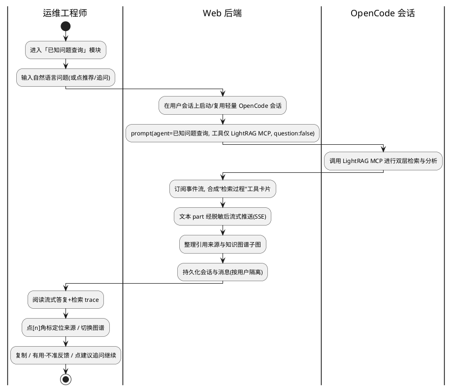

# 需求分析规格书 · 已知问题对话查询分析 Agent

|字段|值|
|-|-|
|name|已知问题对话查询分析 Agent（known-fault-dialog-interaction）|
|type|现有 Web 平台的**可选新增模块**（agent 内核与现有「故障运维」链路零改动）|
|change|新增——对话式已知问题检索问答模块（前端对话 UI + 后端会话/MCP 接入 + 可选安装）|
|version|v1.1|
|stage|Phase1 需求分析（Review1.2：Conditional Pass 85 → 已按 W-01~W-04 / I-01~I-03 修订）|
|effort|Medium|
|base_commit|74fd153（master）|
|update_time|2026-06-21|

> 上游平台：[智能诊断前端 Web 服务](../intelligent-diagnosis-frontend-web-service/02-需求设计规格书.md)（本模块作为其可开关子模块，同栈同部署）
> 阶段产物：Phase1 需求分析 → 下游 [02 需求设计规格书]、[03 开发计划]

---

## §1 基本信息

### 1.1 项目背景

需求价值：运维工程师面对**已知/高频故障**时，无需每次都启动重型自动诊断流水线，而是以自然语言对话**快速检索已沉淀的运维知识**（官方文档 / 内部故障案例 / 运维 Skill），获得**带出处与引用**的可信答复，从而缩短 MTTR、复用专家经验、降低重复排查成本。

需求描述：在现有「智能诊断 Web 平台」中新增一个**对话式「已知问题查询分析」模块**（与「故障运维」并列）。后端复用 OpenCode 能力拉起一个**轻量问答会话**，其唯一外部能力是**经 MCP 对接 LightRAG** 完成已知问题的双层检索与分析；前端以**流式对话 + 检索过程可视化 + 引用来源 + 知识图谱**的形式呈现，UI 参考 `openEuler-ops-qa.html`。本模块**只读问答**、**可选安装**、相对独立，不修改也不影响现有故障运维诊断链路与 `src/opencode` agent 内核。边界外：不负责 LightRAG 的知识灌库/抽取，不做知识/图谱管理 UI，不触发任何修复动作。

### 1.2 结构化信息

|维度|内容|
|-|-|
|Who|运维工程师 / SRE（平台已登录用户）|
|When|发生疑似**已知/高频故障**、需快速定位与处置建议，或日常查阅运维知识时|
|What|以自然语言**对话**提问，获得**流式、带引用出处与知识图谱佐证**的答复，并可多轮追问、回看历史会话|
|Why|重型自动诊断对已知问题"杀鸡用牛刀"，且专家经验分散难复用；需要低门槛、可溯源的知识问答入口 <!-- required: C -->|
|Where|现有诊断 Web 平台内的新模块（浏览器端 SPA + 同栈后端），后端经 MCP 连接 LightRAG 知识服务 <!-- required: C -->|
|How|在导航中进入「已知问题查询」→ 输入问题 / 点推荐问题 → 阅读流式答复与右侧引用证据 → 点 `[n]` 角标定位来源、切换检索图谱 → 多轮追问或新建/回看会话 <!-- required: C -->|

---

## §2 核心能力

### 2.1 场景分析

**主成功场景**



|编号|路径|类别|触发|步骤|
|-|-|-|-|-|
|S-001|主成功|业务|用户在问答模块提交问题|进入模块 → 提交问题 → 后端启动/复用 OpenCode 会话并 prompt → agent 调 LightRAG MCP 双层检索 → 后端将"工具调用"合成检索 trace、文本流式推送、整理引用来源与图谱 → 会话/消息持久化 → 用户阅读答复并查看引用|
|S-002|扩展|操作|多轮追问|在已有会话内继续提问 → **复用同一 OpenCode 会话上下文** → 检索与回答受上下文影响 → 追加为同一会话的新消息对|
|S-003|扩展|操作|点击"建议追问/推荐问题"chip|等价于以该问题文本发起一次提问（同 S-001/S-002）|
|S-004|扩展|操作|新建 / 切换 / 回看历史会话|列出当前用户历史会话 → 打开任一会话重建消息、引用与图谱 → 或新建空会话|
|S-005|扩展|操作|停止生成|流式生成中用户点击"停止"→ 后端中止当前 prompt/事件订阅 → 已生成内容保留、标记中断|
|S-006|备选|业务|未命中知识库（检索为空/相关度过低）|返回"未在知识库找到充分依据"的兜底答复并提示补充信息，**不编造**；引用面板为空|
|S-007|异常|维护|LightRAG 服务不可用 / 连接失败 / 超时|友好降级报错（"知识检索服务暂不可用"）、可重试；**不影响故障运维模块**|
|S-008|异常|维护|MCP 返回异常 / 非预期格式|降级为纯文本答复或报错，证据面板置空，记录可观测日志|
|S-009|异常|业务|LightRAG 未返回逐条引用或图谱数据（与 S-006 同属"返回内容不足"的降级谱系：S-006 为"无答案"、S-009 为"有答案缺佐证"）|答复正文正常呈现，**引用角标与图谱优雅降级**（缺失项不渲染），呈现丰富度受 LightRAG 返回能力约束|
|S-010|异常|维护|OpenCode 会话/进程启动失败|报错并允许重试，不留下半挂会话|
|S-011|异常|安全|未登录 / 越权访问他人会话|复用现有鉴权与 owner 隔离；越权统一返回**不泄露存在性**的响应|
|S-012|异常|维护|模块未安装却访问其路由/入口|后端路由未启用（404/未启用），前端隐藏导航与入口|

### 2.2 业务规则 <!-- required: M=C -->

|编号|描述|原因|影响范围|
|-|-|-|-|
|BC-001|本模块为**可选模块**：未安装时其前端入口必须隐藏、后端路由必须不可用；安装与否**不得影响**「故障运维」模块及 `src/opencode` agent 内核的可用性|"可配置安装、功能独立"诉求；避免新模块拖累既有链路|部署/运维、前端导航、后端路由|
|BC-002|问答**全程只读**：本模块严禁触发任何主机变更 / 修复 / 写操作，仅做知识检索与文本应答|安全边界，区别于具备自愈能力的诊断链路|安全、用户预期|
|BC-003|答复必须**可溯源**：凡 LightRAG 返回了来源/引用，答复须保留 `[n]` 角标与对应来源卡片；无充分依据时须如实告知而非编造|可信问答的核心价值|答复质量、用户信任|
|BC-004|会话与消息按 `owner == 当前用户`**强隔离**，列表/详情/历史均按归属鉴权；越权访问不泄露资源存在性|多用户数据隔离（沿用平台 BC-009 约定）|安全、数据隔离|
|BC-005|进入持久化日志与前端展示的**事件流文本与消息内容必须脱敏**（IP/账号等），复用平台现有脱敏器|用户可能粘贴含敏感信息的日志|安全、合规|
|BC-006|LightRAG 等外部知识服务**故障必须被隔离与降级**：其不可用不得导致本模块崩溃或阻塞，更不得波及平台其它模块|可用性与故障域隔离|可用性、用户体验|
|BC-007|本期固定连接**单一** LightRAG 知识库/工作区（不提供多库切换 UI），但配置上应预留可扩展位|经确认本期范围收敛；降低对 LightRAG 多工作区能力的依赖|范围、配置|

### 2.3 数据约束 <!-- required: M=C -->

<!-- 仅领域对象字段级约束，不含物理表结构 -->

|编号|类别|名称|描述|
|-|-|-|-|
|DC-001|对象|Conversation（会话）|归属唯一用户；含标题（可由首条问题生成）、创建/更新时间、所属知识库标识；按用户隔离、可回看|
|DC-002|对象|Message（消息）|隶属某会话；区分 user / assistant 角色；assistant 消息关联其检索 trace、引用来源集合、图谱子图、状态（生成中/完成/中断/失败）|
|DC-003|字符串|Question（问题文本）|必填、非空、去除首尾空白；单条问题长度上限**暂定 ≤ 4000 字符**（[待确认]，避免超长 prompt），超限须前端拦截/截断并提示，空白输入禁止提交|
|DC-004|对象|Citation（引用来源）|对应答复中的 `[n]`，含类型（文档/案例/Skill/知识库）、标题、出处链接、摘录、关联实体/关系、相关度；逐条引用可能缺失（取决于 LightRAG 返回）|
|DC-005|对象|RetrievalTrace（检索过程）|双层：低层（精确实体与关系）、高层（主题/概念）；用于"检索 trace"卡片，可能部分缺失|
|DC-006|对象|GraphSubview（图谱子图）|节点（实体/核心）+ 边（关系）；用于"检索图谱"标签页，可能缺失（优雅降级）|

---

## §3 需求列表

### 3.1 功能性需求

|编号|类别|名称|描述|优先级|
|-|-|-|-|-|
|FR-001|功能|对话式流式问答|用户以自然语言提问，系统经 OpenCode 会话调 LightRAG 检索并**流式**返回答复；含发送（Enter）/换行（Shift+Enter）、生成中态|P0|
|FR-002|功能|检索过程可视化（工具卡片）|将 MCP 检索这一"工具调用"合成为可折叠的**检索 trace** 卡片，展示低层（实体/关系）与高层（主题）双层检索内容与命中来源数|P0|
|FR-003|功能|引用角标与证据面板|答复正文含可点击 `[n]` 角标；右侧"引用来源"面板以卡片呈现来源（类型徽标/标题/出处/摘录/关联实体关系/相关度）；点角标定位并高亮对应来源|P0|
|FR-004|功能|知识图谱子图可视化|证据面板提供"检索图谱"标签页，渲染本次检索子图（实体节点 + 关系边）；LightRAG 未返回图谱时优雅降级|P1|
|FR-005|功能|多轮上下文|同一会话内追问复用 OpenCode 会话上下文，上下文影响后续检索与回答|P0|
|FR-006|功能|会话历史持久化与管理|会话与消息落库、按用户隔离；支持新建、切换、回看历史会话（重建消息/引用/图谱）|P0|
|FR-007|功能|推荐问题与建议追问|提供初始推荐问题 chip 与答复后的"建议追问"，点击即发起对应提问|P1|
|FR-008|功能|答复操作|复制答复、"有用/不准"反馈；查看 N 处来源快捷入口|P1|
|FR-009|功能|停止生成|流式过程中可中止当前生成，保留已生成内容并标记中断|P1|
|FR-010|功能|未命中兜底|检索为空/相关度过低时返回明确的兜底提示而非编造，引用面板置空|P0|
|FR-011|功能|模块可选安装|安装时引入本模块依赖、连通/起 LightRAG 依赖、开启后端路由与前端导航；不安装则整模块隐藏且路由不可用；与平台同栈、经一键安装/容器 compose profile 开关|P0|
|FR-012|功能|鉴权与归属隔离|复用平台登录会话；本模块全部 API 按 owner 鉴权，越权不泄露存在性|P0|
|FR-013|功能|内容脱敏|事件流文本与持久化/展示的消息内容复用现有脱敏器做脱敏|P0|

### 3.2 非功能性需求 <!-- required: M=C -->

|编号|类别|名称|描述|优先级|
|-|-|-|-|-|
|NFR-001|可用性/可靠性|外部依赖故障隔离|LightRAG/MCP 不可用或超时时，本模块给出友好降级且自身不崩溃，并**不波及**「故障运维」模块；具备会话级超时与可重试|P0|
|NFR-002|可靠性|崩溃恢复|后端重启后，生成中（未完成）的 assistant 消息须有确定性兜底（标记失败/可重试），不留半挂会话|P1|
|NFR-003|性能|流式响应及并发|检索 trace 首呈现 **暂定 ≤ 3s**、答复首字节 **暂定 ≤ 5s**（均含 LightRAG 检索耗时，[待负载/体验确认]）后 token 持续流式；并发活跃会话数受控，**暂定上限 N=10**（[待确认]），超额排队，避免无界拉起会话进程|P1|
|NFR-004|安全|数据隔离与脱敏|会话/消息严格按用户隔离；进入日志/前端的内容脱敏；LightRAG 端点凭据安全管理（不入库明文/不进日志）|P0|
|NFR-005|可维护性|复用现有接缝|复用平台 Knex（sqlite/mysql 可插拔）、SSE、auth、desensitize 等接缝；新 agent 与 MCP 端点以**声明式配置**管理，便于替换/灰度|P1|
|NFR-006|可移植/可部署|可开关交付|随平台 `start.sh` 一键安装与容器化交付；以可选 profile/开关控制是否安装本模块及其 LightRAG 依赖；sqlite/mysql 双方言兼容|P1|

---

## §4 验收方案

### 4.1 验收准则

|编号|关联能力|维度|描述|验收标准|
|-|-|-|-|-|
|AC-001|S-001, FR-001/002/003|功能|主成功问答全链路|提交问题后：检索 trace 卡片出现、答复**流式**逐步呈现、出现 `[n]` 角标与右侧来源卡片；点角标能定位并高亮对应来源|
|AC-002|S-002/S-005, FR-005/009|功能|多轮上下文与停止|追问能体现上下文延续；点击"停止"后生成立即中止，已生成内容保留并标记中断|
|AC-003|S-004, FR-006|功能|会话历史|新建/切换/回看历史会话可正确重建消息、引用与图谱；仅能看到本人会话|
|AC-004|FR-004, S-009|功能|图谱与优雅降级|LightRAG 返回图谱时"检索图谱"正确渲染节点/边；未返回引用或图谱时答复仍正常、缺失项不报错不空白崩溃|
|AC-005|S-006/S-007/S-008/S-010, NFR-001|可用性|降级与隔离|LightRAG 不可用/超时/异常返回时给出友好降级提示且可重试；同时「故障运维」模块功能不受影响|
|AC-006|S-011/S-012, FR-011/012, BC-001/004|安全/部署|安装开关与隔离|未安装时入口隐藏且后端路由不可用；越权访问他人会话返回不泄露存在性的响应|
|AC-007|FR-013, BC-005|安全|脱敏|粘贴含 IP/账号的问题后，持久化与前端展示内容中的敏感字段已脱敏|
|AC-008|BC-002, S-001|安全|只读边界|问答全链路**不产生任何主机变更/写操作**；本模块 agent 仅挂 LightRAG MCP（无 Bash/编辑/修复类工具）|
|AC-009|DC-003|功能|输入边界|空白问题禁止提交；超长（> 上限）问题被拦截/截断并提示，不发起无界 prompt|
|AC-010|BC-007|部署|单库范围|本期固定连接单一知识库；不提供多库切换 UI（本期不验证多库切换）|

### 4.2 测试用例

|编号|关联准则|前置条件|操作步骤|预期结果（量化指标/判断条件）|
|-|-|-|-|-|
|TC-001|AC-001|已登录、模块已安装、LightRAG 可用|提交一条命中知识库的问题|≤数秒出现检索 trace；答复以流式增量呈现；出现 ≥1 个 `[n]` 角标与对应来源卡片；点角标对应卡片高亮滚动到位|
|TC-002|AC-002|存在一个进行中会话|在同一会话追问一个依赖上文的问题；随后对一次新提问点击"停止"|追问答复体现上文延续；"停止"后 1s 内停止增量、内容保留、状态=中断|
|TC-003|AC-003|当前用户有 ≥2 个历史会话；另有他人会话|切换/回看历史会话；尝试以 URL/ID 访问他人会话|本人会话正确重建展示；访问他人会话返回不泄露存在性的统一响应|
|TC-004|AC-004|LightRAG 分别返回"含图谱"与"无图谱/无引用"两类响应|分别提问|含图谱时图谱正确渲染；无图谱/无引用时答复正文正常、无报错、面板呈空态而非崩溃|
|TC-005|AC-005|关闭/阻断 LightRAG 端点|提问；并在另一标签使用故障运维模块|问答模块给出"知识检索服务暂不可用"且可重试；故障运维新建/查看任务正常|
|TC-006|AC-006|准备"未安装"部署形态|访问问答前端入口与后端路由|前端无该导航/入口；后端路由返回 404/未启用|
|TC-007|AC-007|LightRAG 可用|提问中粘贴含示例 IP 与账号的日志片段|落库与前端展示中的 IP/账号被脱敏|
|TC-008|AC-008|模块已安装|提交一条诱导"修复/执行命令"的问题并审计本次会话的工具调用|答复仅为文本建议；审计无任何主机写/变更类工具调用|
|TC-009|AC-009|已登录|分别提交空白问题、超长（> 上限）问题|空白被禁止提交；超长被拦截/截断并提示，未发起超长 prompt|

### 4.3 交付物定义 <!-- required: C -->

|交付物|描述|
|-|-|
|前端「已知问题查询」模块|对话流式 UI（检索 trace + 流式答复 + `[n]` 引用 + 证据面板含来源/图谱 + 会话历史 + 推荐/追问/反馈/停止），参考 `openEuler-ops-qa.html`|
|后端问答与会话服务|会话/消息持久化、OpenCode 轻量会话编排、LightRAG MCP 接入、事件流→检索 trace/流式合成、SSE 推送、脱敏、鉴权隔离|
|可选安装与部署交付物|`start.sh` 安装开关与容器 compose profile（含可选 LightRAG 依赖的拉起/连通），模块未装时入口与路由禁用|

---

## §5 附录

### 5.1 用户记录

#### 5.1.1 初始描述

```text
1. 基于witty-diagnosis-agent前端交互页面新增一个功能：已知问题查询分析agent，基于对话交互实现对已知问题的查询和分析。
2. 前端使用对话交互的形式。
3. 后端使用opencode的能力，然后通过MCP去对接light-rag的能力，实现对已知问题的查询和分析。
4. 前端的交互的显示逻辑参考opencode提供的官方web，你先查找下他们的流式输出和工具显示能力。
5. 前端展示形式参考里面的运维问答模块：/opt/src/witty-diagnosis-agent/docs/design/known-fault-dialog-interaction/openEuler-ops-qa.html
6. 该功能是可以配置的：用户如果选择了安装这个模块，就要安装对应的依赖，也可以不安装。相关的功能可以是独立的。
```

#### 5.1.2 澄清

```text
Q（LightRAG 边界）：本需求对 LightRAG 负责到哪一层？
A：含部署 LightRAG（作为可选依赖一并安装/起容器并连通），但知识灌库/抽取不在本期。

Q（对话范围）：是否需要保留多轮上下文与历史会话？
A：多轮会话 + 历史持久化（按用户隔离、可回看）。

Q（呈现丰富度）：要复刻参考页到什么程度？
A：完整——流式答案 + 引用来源面板 + 检索图谱（受 LightRAG 返回的引用/图谱数据能力约束）。

Q（独立性与安装形态）：『可配置/可独立』具体指？
A：现有平台内的可选模块——可开关，装则加依赖/路由/导航，不装则隐藏，与现有服务同栈同部署。

Q（难度）：A：Medium。
Q（知识库范围多库切换是否本期）：A：本期不做，单库（预留可扩展）。
Q（问答内容是否脱敏）：A：复用现有脱敏器。
```

### 5.2 待确认与风险

**待确认项（暂定值，待负载/体验/对接确认）**

|编号|事项|暂定取值|依据/影响|
|-|-|-|-|
|TBD-001|检索 trace 首呈现 / 答复首字节时延|≤ 3s / ≤ 5s|NFR-003；含 LightRAG 检索耗时，依实际链路调优|
|TBD-002|并发活跃会话上限 N|10|NFR-003；控会话进程资源，超额排队|
|TBD-003|单条问题长度上限|≤ 4000 字符|DC-003；避免超长 prompt|
|TBD-004|LightRAG MCP 返回契约（是否含逐条引用映射、图谱子图）|以实际接口为准|S-009/AC-004；决定引用/图谱呈现的可达上限|

**风险**

```text
- 呈现丰富度（逐条引用、知识图谱子图）受 LightRAG MCP 实际返回契约约束（TBD-004），缺失项需优雅降级（见 S-009/AC-004）。本期不灌库，问答质量同样依赖既有库内容。
- 多轮上下文需 OpenCode 会话在追问间保活/续跑；并发会话需设上限以控资源（NFR-003/TBD-002）。
- 本模块为现有平台的可选附加，严禁侵入 src/opencode 内核与故障运维链路（BC-001/BC-006）。
- NFR-005 列举的「复用 Knex/SSE/auth/desensitize 接缝」为本阶段**约束/前提**而非技术选型，具体设计详见 02 需求设计规格书。
```
