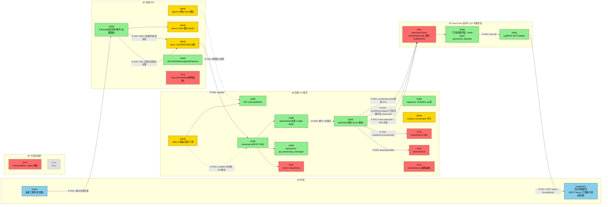
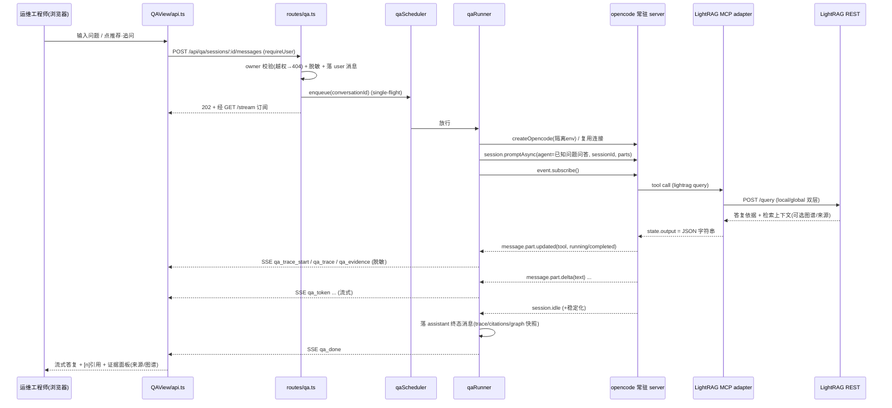
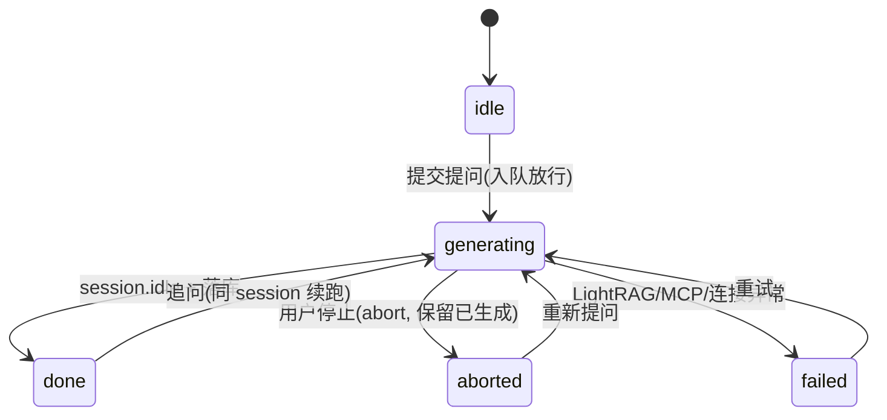

# 需求设计规格书 · 已知问题对话查询分析 Agent

|字段|值|
|-|-|
|name|已知问题对话查询分析 Agent（known-fault-dialog-interaction）|
|type|现有 Web 平台的**可选新增模块**（agent 内核与既有「故障运维」链路零改动）|
|version|v1.1|
|stage|Phase2 需求设计（A2.2 验证：Feasible-with-conditions；Review2.2：Conditional Pass 88 → 已按 W-1~W-3 / I-1~I-3 修订）|
|effort|Medium|
|base_commit|74fd153（master）|
|update_time|2026-06-21|
|上游文档|[01-需求分析规格书](./01-需求分析规格书.md)|
|平台基线|[智能诊断前端 Web 服务 02 设计](../intelligent-diagnosis-frontend-web-service/02-需求设计规格书.md)（复用其 D-001~D-006）|
|技术栈|后端 Node/TypeScript（Fastify + Knex + `@opencode-ai/sdk`，与平台同栈）；前端 React SPA（Zustand + Vite）；agent 内核（`src/opencode`）冻结|

---

## §1 设计概要

### 1.1 实现思路

在既有「智能诊断 Web 平台」上新增一个**可选子模块**「已知问题对话查询」，与「故障运维」并列。核心思路：

1. **轻量问答 agent + LightRAG MCP**：新建一个 builtin「已知问题问答」agent，其权限经 allowlist 收敛为**仅可调用 LightRAG MCP 工具**（`permission: {"*":"deny", "lightrag*":"allow"}`，先例 `agents/multimodal-looker.ts:17`），并在 prompt 级 `tools:{question:false}` 关闭交互（复刻 `cli/run/runner.ts:99`）。LightRAG 经新增的**轻量 MCP adapter**（桥接 LightRAG REST `/query` 的 local/global 双层检索）以全局 `mcp` 字段声明于 opencode 配置（`plugin-handlers/mcp-config-handler.ts:59`）。

2. **单常驻 opencode server + 每会话一 session（关键决策 DQ-001，显式偏离平台 D-001）**：QA 模块用**一个专属隔离 HOME/XDG 的常驻 opencode server**（与诊断存储分离），**每个对话会话对应一个 opencode session**（`sessionId` 入库）；追问经 `session.promptAsync({ path:{id:sessionId} })` 原生续跑上下文（`cli/run/runner.ts:95-105`、`session-resolver.ts:15-24`）。**不**沿用诊断的「每任务独立进程 + 用后即焚 HOME」——因 QA **只读、无 SSH 凭据、无 hosts.ini、不起子代理**，进程级强隔离的安全收益极低而成本高（资源、生命周期、跨进程 storage 一致性）。owner 隔离改由我方 DB/路由层强制。

3. **事件流 → SSE 合成（关键决策 DQ-002）**：每轮提问后 `client.event.subscribe()` 订阅事件流（`cli/run/runner.ts:88`），由**QA 专用事件消费器**（不复用 CLI 终端渲染 handler）把：① `message.part.delta(field=text)` 增量合成**流式答复 token**；② `message.part.updated(type=tool, tool=lightrag*)` 的 `state.status` 状态机（running→completed/error）与 `state.output` 合成**检索 trace + 证据**；③ `session.idle` + 稳定化判完成（`poll-for-completion.ts`）。检索 trace（low/high）、引用来源、图谱子图由 LightRAG MCP 工具以**结构化 JSON 字符串**置于 `state.output`（因 `cli/run/types.ts:95` 中 output 为 `string`），后端**自行 `JSON.parse` + schema 校验 + 失败降级**（S-008/S-009）。

4. **复用平台接缝**：鉴权与 owner 隔离（`auth.ts:37` `requireUser`、`repositories.ts:172` 越权返 null→404）、SSE（`streamHub.ts`，按 `conversationId` 订阅）、脱敏（`desensitize.ts:24` `desensitizeWith`，落库/推送前）、Knex 迁移与 sqlite/mysql 双方言（`db/knex.ts`）、独立并发调度（新建 `qaScheduler`，仿 `scheduler.ts:19` pump）。

5. **可选安装与故障隔离**：后端以 `config.conversation.enabled` 门控路由注册（`index.ts:32`），新增 `GET /api/capabilities` 供前端运行时探测显隐导航；`install.sh` 模块勾选 → 装 MCP adapter 依赖 +（可选）起 LightRAG 容器 + 写 `CONVERSATION_ENABLED` 与 LightRAG endpoint；compose 增 profile。**硬约束**：LightRAG 端点不可达时，MCP 连接失败**不得阻塞** xuanyuan 等既有 agent 初始化（lazy/`disabled` 兜底），更不得波及故障运维（BC-006/NFR-001）。

### 1.2 设计决策

|编号|决策项|类别|内容|理由|
|-|-|-|-|-|
|DQ-001|QA 运行模型：**单常驻 opencode server + 每会话一 session**，显式偏离平台 D-001「每单元独立进程 + 用后即焚 HOME」|架构设计 / 多租户与隔离策略|QA 模块用一个专属隔离 HOME/XDG 的常驻 opencode server，每会话一个 opencode session（sessionId 入库），追问经 `promptAsync(sessionId)` 续跑；owner 隔离在 DB/路由层强制；并发由 qaScheduler + 单会话 single-flight 控制|D-001 的强隔离是为诊断的**进程级全局态、hosts.ini 明文凭据、用后即焚**而设；QA **只读、无凭据、不起子代理**，这些前提都不成立。常驻多 session 原生支持多轮上下文、消除跨进程 storage 一致性与续跑竞态、显著降资源与生命周期复杂度（直接缓解 NFR-003/TBD-002）。代价是放弃进程级隔离，但其在只读问答下安全收益极低，可接受|
|DQ-002|LightRAG 接入与证据合成：**新增 LightRAG MCP adapter（全局声明）+ QA agent permission allowlist 收敛 + 后端从 tool `state.output`（JSON 字符串）解析证据**|技术选型 / 数据流设计|adapter 桥接 LightRAG REST `/query`（local/global 双层）；agent 经 `permission:{"*":"deny","lightrag*":"allow"}` 仅放行该工具；检索元数据（实体/关系/主题/来源/图谱）由 MCP 序列化为 JSON 字符串入 `state.output`，QA 后端 JSON.parse+校验+降级，经 SSE 推为证据事件|MCP 在 opencode 只能**全局声明**、无 per-agent 绑定（`mcp-config-handler.ts:59`），收敛只能靠 agent 的 permission allowlist；`state.output` 在代码中是 `string`（`cli/run/types.ts:95`），结构化数据必须经 JSON 字符串承载并由后端解析。该路径复用 opencode 既有 tool-part 模型，最小改动且与 CLI 流式范式同源|
|DQ-003|可选模块化：**`config.conversation.enabled` 门控后端路由 + `GET /api/capabilities` 前端运行时探测显隐 + install/compose profile 控依赖与 LightRAG**；MCP 连接失败不阻塞既有 agent|变更点设计 / 可部署性（FR-011、BC-001/BC-006）|未安装：路由不注册、`capabilities.qa=false` 前端隐藏入口、不声明 LightRAG MCP；安装：勾选后装 adapter 依赖 +（可选）起 LightRAG + 置 env。LightRAG 不可达时 MCP 以 lazy/`disabled` 兜底|满足「可配置安装、功能独立、不影响既有链路」诉求；运行时探测优于构建期开关，支持灰度与同一镜像多环境差异化；故障隔离把 NFR-001/BC-006 的真正风险点（全局 MCP 探测阻塞其它 agent）显式钉死|

---

## §2 架构设计

### 2.1 架构变更

#### 2.1.1 变更总览

图例：🔵外部 🟢新增 🟡修改 🔴保护（被调用但本期禁止修改）⚪不涉及。接口命名 IF-{E外部/N新增/M修改/R复用}{编号}。



#### 2.1.2 模块变更

|模块|变更|职责|接口|依赖|约束|
|-|-|-|-|-|-|
|`web/server/src/routes/qa.ts`|新增|QA REST + SSE 端点；鉴权与 owner 隔离；脱敏；入队|IF-N02/N03/N04|auth、repositories、streamHub、qaScheduler、desensitize|仅在 `config.conversation.enabled` 时注册|
|`web/server/src/qaRunner.ts`|新增|驱动常驻 opencode server 完成一次问答；事件流→SSE 合成；落库|IF-R01~R05、IF-N06|`@opencode-ai/sdk`、streamHub、desensitize、repositories|web 层**首个真实 opencode 编排**；不依赖诊断 stub `runner.ts`|
|`web/server/src/qaScheduler.ts`|新增|QA 提问全局 FIFO 队列 + 并发上限 + 单会话 single-flight|IF-N06|config|与诊断 `scheduler.ts` 相互独立，互不挤占|
|`web/server/src/repositories.ts`|修改|新增 qa_sessions/qa_messages 的 CRUD（owner 隔离，越权返 null）|—|knex|沿用 `getTaskForOwner` 越权一致性模式|
|`web/server/src/db/migrations/2026..._qa.cjs`|新增|建 qa_sessions、qa_messages 表（sqlite/mysql 兼容）|—|knex|UUID 主键、epoch ms、级联删除，仿 init 迁移风格|
|`web/server/src/index.ts`|修改|enabled 时注册 QA 路由；注册 `/api/capabilities`|IF-M01|config|不改既有路由注册顺序|
|`web/server/src/config.ts`|修改|新增 `conversation` 配置段（enabled、并发、超时、LightRAG endpoint、opencode HOME）|IF 配置|env|`as const` 字面量内补字段|
|`web/server/src/types.ts`|修改|扩展 `StreamEvent` 联合，新增 QA 事件成员；新增 QA DTO|—|—|不破坏既有 task 事件成员|
|`opencode 配置（agent + mcp）`|新增|新建『已知问题问答』agent + LightRAG MCP 声明。**agent 经 `shared/permission-compat.ts:29 createAgentToolAllowlist(['lightrag*'])` 生成 `{"*":"deny","lightrag*":"allow"}` 权限并以配置注册（先例 `agents/multimodal-looker.ts:17`），不走 `AgentOverridesSchema` 封闭枚举、不改既有 agent**|IF-N07/E01|opencode config schema、permission-compat|MCP 全局声明；agent 经 allowlist 收敛；连接失败不阻塞其它 agent|
|`MCP adapter（lightrag）`|新增|桥接 LightRAG REST `/query`（local/global），结构化结果序列化入 tool output|IF-E01|LightRAG REST|输出为 JSON 字符串供后端解析|
|`web/frontend/src/{App,store,api}.tsx`|修改|导航项（按 capabilities 显隐）、View 联合+goQA、QA REST/SSE 封装|IF-N01~N05|—|不改故障运维既有 view|
|`web/frontend/src/pages/QAView.tsx` 等|新增|对话 UI：会话列表 + 流式答复 + 检索 trace + [n] 引用 + 证据面板（来源/图谱）|IF-N01~N03|api、styles 令牌|复用 styles.css 令牌；内联 SVG 渲染图谱|
|`install.sh` / compose|修改|模块勾选；装 adapter 依赖、可选起 LightRAG、写 env/profile|—|—|未勾选则零影响既有链路|
|`web/server/src/{auth,streamHub,desensitize}.ts`、`routes/tasks.ts`、`src/opencode/*` agent 内核|保护|被复用/调用，本期禁止修改|IF-R*|—|🔴 仅调用，不改签名|

### 2.2 模块详情 <!-- required: M=C -->

#### 2.2.1 qaRunner（事件流→SSE 合成）

- **负责职责**：接管一次提问的端到端执行——连接 QA 常驻 opencode server、按 sessionId 续跑会话、`promptAsync` 发起、订阅事件流并合成 SSE（流式 token + 检索 trace + 证据）、脱敏后落库 assistant 消息、终态收敛。
- **功能性设计**：
  1. 会话映射：`conversationId →（首轮）session.create()` 得 `sessionId` 入库；后续轮直接复用。sessionId 失效（server 重启/回收后 `session.get` not found）→ 重建 session 并以系统提示标注「上下文已重置」降级（S-002 兜底）。
  2. 事件消费（专用解析器，不复用 CLI handler）：`message.part.delta(field=text)`→`{type:"qa_token"}`；`message.part.updated(type=tool, tool 前缀 lightrag)`→读 `state.status`，running→`{type:"qa_trace_start"}`，completed→`JSON.parse(state.output)` 得检索元数据→`{type:"qa_trace"}`+`{type:"qa_evidence"}`，error/parse 失败→降级事件。
  3. 完成判定：`pollForCompletion`/`session.idle` + 稳定化；写入 assistant 终态消息（含 trace/citations/graph 快照）→`{type:"qa_done"}`。
- **非功能设计**：
  1. single-flight：同一 conversationId 同时刻仅一个活跃 prompt（追问/停止/重发互斥）。**锁释放时机**：在「终态落库完成」或「abort 完成（停止）」后立即释放，确保 stop→立即重发不被 409 误拒；仅当锁仍被占用时新提交才返 409。
  2. 脱敏：token 与 tool 入参/结果在 publish 与落库前过 `desensitizeWith`。
  3. 超时与停止：会话级超时上限；用户停止→`abortController.abort()` + 标记中断、保留已生成（S-005）。
- **风险与缓解**：
  1. LightRAG 返回契约不确定（TBD-004）→ output schema 校验 + 缺失字段降级（S-009）。
  2. 常驻 server 崩溃→qaRunner 探测连接失败→该轮置 failed 可重试，下次按需重连/重建 session（NFR-002）。

#### 2.2.2 LightRAG MCP adapter

- **负责职责**：把 opencode 的一次工具调用翻译为 LightRAG REST `/query`，并把结果整理成「答复依据文本 + 结构化检索元数据」。
- **功能性设计**：
  1. 入参：`question`、检索模式、会话上下文（由 agent 提供）。**双层来源（以 TBD-004 实际接口为准）**：优先一次 `mode=hybrid`/`mix` 调用，从其返回上下文中拆出 low（local：精确实体/关系）与 high（global：主题/概念）两层；若该接口不返回分层上下文，则降级为分别发 `mode=local` 与 `mode=global` 两次调用合成双层。
  2. 出参：`state.output` = JSON 字符串，含 `answer_context`（供 agent 组织答复）、`retrieval{low[],high[]}`、`sources[]{type,title,origin,url,excerpt,entities[],relations[],rel}`、`graph{nodes[],edges[]}`（对齐参考页 `openEuler-ops-qa.html` 的 KB 结构）。
  3. LightRAG 返回不含图谱/逐条来源时，仅回 `answer_context` + 可得字段，其余留空。
- **非功能设计**：
  1. 连接 lazy 化：MCP 启动不强连 LightRAG；端点不可达时工具调用返回明确错误而非令 server 启动失败（保护其它 agent 初始化，BC-006）。
  2. 端点/凭据经 env 注入，不入库明文、不进日志。
- **风险与缓解**：LightRAG 超时→工具返回 timeout 错误→qaRunner 降级提示可重试（S-007）。

### 2.3 功能影响

```text
- 智能诊断 Web 平台
  - 已知问题对话查询（新增模块）
    - 对话流式问答 / 检索 trace / [n] 引用 + 证据面板 / 知识图谱
    - 多轮上下文 + 会话历史持久化 / 隔离 / 回看
    - 推荐问题 / 建议追问 / 复制 / 反馈 / 停止生成
    - 可选安装与能力探测显隐
  - 故障运维（保护，零改动）
```

|功能|变更|变更点|对应需求|
|-|-|-|-|
|对话流式问答|增|qaRunner 事件→SSE token；前端流式渲染|FR-001|
|检索 trace 可视化|增|tool part→qa_trace 事件；前端折叠卡片|FR-002|
|引用与证据面板|增|tool output 解析→qa_evidence；前端来源卡片+[n]定位|FR-003|
|知识图谱子图|增|graph 字段→内联 SVG|FR-004|
|多轮上下文/会话历史|增|session 续跑 + qa_sessions/qa_messages 持久化|FR-005/006|
|推荐问题|增|**本期前端硬编码静态文案**（参考页 SUGGESTS 同款）；`kb_id` 预留后端化扩展，本期无后端接口|FR-007|
|建议追问|增|来自 assistant 消息（LightRAG followups，缺失则不显示）；点击=以该文本发起新提问|FR-007|
|复制/停止|增|前端复制 + `/stop`（abort，保留已生成）|FR-008/009|
|有用·不准反馈|增|**落库**：`qa_messages.feedback` 字段 + `PUT /api/qa/sessions/:id/messages/:mid/feedback`，供质量回流|FR-008|
|未命中兜底|增|空检索→兜底文案，证据置空|FR-010|
|可选安装/能力探测|增|config 门控 + /api/capabilities + install/compose|FR-011|
|鉴权与脱敏|改(复用)|QA 路由挂 requireUser + owner 隔离 + desensitizeWith|FR-012/013|

---

## §3 核心流程

### 3.1 一次提问的主流程（含多轮续跑）



### 3.2 会话状态与停止/失败 <!-- required: C -->



---

## §4 算法设计 <!-- required: M=C -->

### 4.1 事件流 → SSE 证据合成

**目标**：把 opencode 单向事件流确定性地合成为前端可消费的「流式 token + 检索 trace + 证据」三类 SSE 事件，支撑 FR-001/002/003/004，且对 LightRAG 返回缺失优雅降级。

**核心逻辑**：

```
state = { tokenBuf:"", toolPartId:null }
for ev in event.subscribe():
  switch ev.type:
    case "message.part.delta" when ev.field=="text":
        publish(qa_token, desensitize(ev.delta))           # 流式增量
    case "message.part.updated" when ev.part.type=="tool" and ev.part.tool startsWith "lightrag":
        if ev.part.state.status == "running":
            publish(qa_trace_start, { tool: ev.part.tool })
        elif status in ("completed"):
            meta = safeJsonParse(ev.part.state.output)      # output 是 string
            if meta == null: publish(qa_trace, {degraded:true}); break
            validate(meta, RETRIEVAL_SCHEMA)                # 缺字段置空, 不抛
            publish(qa_trace,    desensitize(meta.retrieval))   # low/high
            publish(qa_evidence, desensitize({sources:meta.sources, graph:meta.graph}))
        elif status == "error":
            publish(qa_trace, {degraded:true, error:ev.part.state.error})
    case "session.idle": if stabilized(): finalize()
```

**输入**：opencode `event.subscribe()` 流（`message.part.delta` / `message.part.updated(tool)` / `session.idle`）。
**输出**：SSE 事件序列 `qa_token* / qa_trace_start / qa_trace / qa_evidence / qa_done`。
**复杂度分析**：O(事件数)，单遍流式，内存仅累积当前消息文本。
**边界条件与异常处理**（对齐 01 场景谱系）：
- `state.output` 非 JSON / schema 不符（**MCP 返回格式异常**）→ 该证据降级（`degraded:true`），答复正文不受影响（**S-008**）。
- output 合法但缺逐条引用/图谱字段（**有答案缺佐证**）→ 引用/图谱字段置空、不渲染，正文正常（**S-009**）。
- tool error / LightRAG 超时/不可达 → `qa_trace.degraded` + 友好提示可重试（S-007）。
- 空检索（sources 为空且无 answer 依据，**无答案**）→ 兜底文案，证据置空（**S-006/FR-010**）。

---

## §5 数据模型 <!-- required: M=C -->

### 5.1 新增 qa_sessions / qa_messages

**描述**：相对既有系统**纯新增**两表，沿用 init 迁移风格（UUID 主键、epoch ms 时间戳、级联删除）；sqlite/mysql 双方言经 Knex 迁移统一。owner 隔离落在 `qa_sessions.owner_id`。

**详细设计**：

```
qa_sessions
  id            string(36) PK            # UUID
  owner_id      string(36)  NOT NULL idx # 归属用户(隔离键)
  title         string                   # 由首条问题生成/可改
  oc_session_id string  NULL             # 绑定的 opencode sessionId(可失效重建)
  kb_id         string  NULL             # 本期单库, 预留
  created_at    bigint                   # epoch ms
  updated_at    bigint

qa_messages
  id            string(36) PK
  session_id    string(36) NOT NULL  -> qa_sessions.id  ON DELETE CASCADE, idx
  role          string                   # 'user' | 'assistant'
  status        string                   # 'generating'|'done'|'aborted'|'failed' (assistant)
  text          string(long)             # 已脱敏正文
  retrieval     json/text NULL           # {low[],high[]} 快照
  citations     json/text NULL           # sources[] 快照
  graph         json/text NULL           # {nodes[],edges[]} 快照
  followups     json/text NULL           # 建议追问(LightRAG 返回, 可空) 快照
  feedback      string  NULL             # 'useful'|'inaccurate'|null (FR-008 质量回流)
  created_at    bigint
```

> 关系：`qa_sessions 1—N qa_messages`。assistant 消息把本轮 trace/citations/graph 以快照落库，供历史会话回看重建（FR-006），无需复跑检索。JSON 字段在 sqlite 存 text、mysql 可用 json 列。

### 5.2 崩溃恢复 <!-- required: C -->

启动时仿 `failOrphanRunning`，把残留 `status='generating'` 的 assistant 消息置 `failed`（NFR-002），前端可重试。

---

## §6 接口设计

### 6.1 外部接口（前端 ↔ 后端，新增 `/api/qa/*` 与 capabilities）

|名称|变更|描述|请求方式|请求参数|返回参数|错误码|
|-|-|-|-|-|-|-|
|能力探测|增|前端据此显隐 QA 导航|GET `/api/capabilities`|—|`{ qa: boolean }`|—|
|新建会话|增|创建 QA 会话|POST `/api/qa/sessions`|`{ title? }`|`{ id, createdAt }`|401|
|会话列表|增|当前用户会话（隔离）|GET `/api/qa/sessions`|—|`Session[]`|401|
|会话详情/消息|增|回看历史（含 trace/引用/图谱快照）|GET `/api/qa/sessions/:id`|—|`{ session, messages[] }`|401/404|
|发送消息|增|提问/追问（入队，single-flight）|POST `/api/qa/sessions/:id/messages`|`{ text }`|`{ userMessageId, assistantMessageId }`|400/401/404/409|
|停止生成|增|中止当前生成|POST `/api/qa/sessions/:id/stop`|—|`{ ok }`|401/404|
|答复反馈|增|有用/不准（FR-008 质量回流）|PUT `/api/qa/sessions/:id/messages/:mid/feedback`|`{ feedback: 'useful'\|'inaccurate' }`|`{ ok }`|400/401/404|
|流式订阅|增|SSE：token/trace/evidence/done|GET `/api/qa/sessions/:id/stream`|—|SSE `StreamEvent`|401/404|
|删除会话|增|删除并级联消息|DELETE `/api/qa/sessions/:id`|—|`{ ok }`|401/404|

> 越权统一 404（不泄露存在性，BC-004）；未登录 401；空白/超长问题 400（DC-003）；同会话已有进行中生成时再次提交 409（single-flight）。

### 6.2 内部接口 <!-- required: M=C -->

|名称|变更|描述|调用方|提供方|请求参数|返回参数|
|-|-|-|-|-|-|-|
|IF-N06 enqueue|增|入队一次提问，受并发与 single-flight 约束|routes/qa.ts|qaScheduler|`conversationId`|void(异步放行)|
|IF-R04 publish|增(复用)|按 conversationId 推 SSE|qaRunner|streamHub|`(conversationId, StreamEvent)`|void|
|IF-R02 promptAsync|复用|续跑会话发起问答|qaRunner|`@opencode-ai/sdk`|`{ path:{id:sessionId}, body:{agent,tools,parts} }`|stream 句柄|
|IF-N07 tool call|增|agent 调 LightRAG 工具|QA agent|MCP adapter|`{ question, mode, ... }`|`state.output`(JSON 字符串)|

### 6.3 配置接口 <!-- required: M=C -->

|名称|变更|描述|类型|默认值|取值范围|
|-|-|-|-|-|-|
|`CONVERSATION_ENABLED`|增|QA 模块总开关（门控路由 + capabilities）|bool|`false`|true/false|
|`CONVERSATION_MAX_CONCURRENT`|增|QA 并发提问上限（qaScheduler）|int|`10`|≥1（TBD-002）|
|`CONVERSATION_TIMEOUT_MS`|增|单轮问答超时|int|`120000`|>0|
|`CONVERSATION_QUESTION_MAX_CHARS`|增|单条问题长度上限|int|`4000`|>0（DC-003/TBD-003）|
|`LIGHTRAG_ENDPOINT`|增|LightRAG REST 基址|string|—|URL|
|`LIGHTRAG_API_KEY`|增|LightRAG 凭据（不入库/不进日志）|string|—|—|
|`QA_OPENCODE_HOME`|增|QA 常驻 server 专属隔离 HOME/XDG|string|`~/.witty-diagnosis-agent/qa-home`|路径|

---

## §7 DFx 设计

### 7.1 可用性 / 可靠性

|故障/风险场景|触发|应对策略|取舍/决策|
|-|-|-|-|
|LightRAG 不可达/超时|端点宕机/网络|MCP lazy 连接、工具返回明确错误；qaRunner 降级提示可重试；**不阻塞 xuanyuan 等 agent 初始化**，不波及故障运维|安全优先于功能：宁可问答暂不可用，也不拖垮平台（NFR-001/BC-006）|
|常驻 opencode server 崩溃|进程异常|该轮置 failed 可重试；下次按需重连/重建 session（上下文重置降级）|常驻单点换低复杂度；崩溃面仅限 QA 模块|
|后端重启残留 generating|崩溃/重启|启动置 failed（仿 failOrphanRunning），前端重试|确定性兜底，不留半挂（NFR-002）|
|sessionId 失效|server 回收/重启|`session.get` not found→重建 session + 标注上下文已重置|多轮上下文尽力而为，正确性 > 假装连续|

### 7.2 性能

|指标|目标值|模块分解|分解假设|
|-|-|-|-|
|检索 trace 首呈现|≤ 3s（TBD-001）|MCP→LightRAG 检索为主，事件合成 <50ms|LightRAG 检索 ≤2s|
|答复首字节|≤ 5s（TBD-001）|检索后 LLM 首 token|模型与上下文规模常态|
|QA 并发提问|上限 N=10（TBD-002）|qaScheduler 限流，超额排队|常驻 server 可承载|

**优化措施**：

|关注点|应对策略|取舍/决策|
|-|-|-|
|资源占用|单常驻 server 多 session（DQ-001）|相比每会话进程，大幅降资源|
|历史回看|trace/引用/图谱快照落库，回看不复跑|空间换时间，避免重复检索|

### 7.3 安全性

|高风险项|类型|风险分析|应对策略|
|-|-|-|-|
|跨用户数据|授权认证|越权读他人会话|owner_id 隔离，repository 越权返 null→路由 404（BC-004）|
|敏感信息入库/外显|数据保护|用户粘贴含 IP/账号日志|`desensitizeWith` 落库/推送前脱敏（FR-013）|
|LightRAG 凭据|依赖安全|端点/key 泄露|env 注入，不入库明文、不进日志|
|越权工具|授权认证|QA agent 触发写/修复|`permission:{"*":"deny","lightrag*":"allow"}` + `question:false`，只读闭环（AC-008）|

### 7.4 其他 <!-- required: C -->

|目标|类型|应对策略|取舍/决策|
|-|-|-|-|
|可选安装|可部署性|config 门控 + capabilities 探测 + install/compose profile|未装零影响既有链路（FR-011）|
|多库扩展|可扩展性|`kb_id` 字段与 mode 预留，本期单库|收敛本期范围（BC-007）|
|可测试性|可测试性|事件→SSE 合成为纯函数（§4），可单测；owner 隔离/降级有 TC 覆盖|—|

---

## §8 附件 <!-- required: C -->

**关键代码锚点（确权依据）**
- 真实 opencode 编排范式：`src/opencode/cli/run/runner.ts:31-106`（createServerConnection / event.subscribe / promptAsync / pollForCompletion）。
- 续跑会话：`cli/run/session-resolver.ts:15-24`、`server-connection.ts`（attach）。
- agent 工具收敛先例：`src/opencode/agents/multimodal-looker.ts:17`、`shared/permission-compat.ts:29`（createAgentToolAllowlist）。
- MCP 全局声明：`plugin-handlers/mcp-config-handler.ts:59`；tool output 为 string：`cli/run/types.ts:95`。
- 复用接缝：`web/server/src/auth.ts:37`、`repositories.ts:172`、`streamHub.ts`、`desensitize.ts:24`、`scheduler.ts:19`、`config.ts:33-65`、`types.ts:94-98`、`db/migrations/20260620_000001_init.cjs`。

**与平台决策的关系**：复用 D-002(事件订阅→进度/日志)、D-004(Knex 可插拔)、D-005(前后端分离+nginx)、D-006(start.sh+容器)；**DQ-001 显式偏离 D-001**（理由见 §1.2）。

**待确认项**：TBD-001~004 见 [01 §5.2]，其中 TBD-004（LightRAG 返回契约）直接决定 §4 证据合成可达上限。
