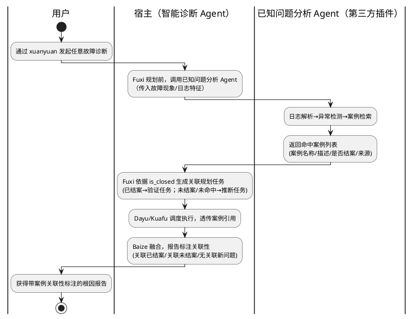

# 已知问题分析 Agent 集成 —— 需求分析规格书

> 文档版本：v1.3（Review 1 通过；含 Phase2 设计阶段口径回写）
> 类型（type）：新特性集成（Feature）
> 变更（change）：在 opencode 实现中集成可插拔"已知问题分析 Agent"
> 基线（base_commit）：9478703（master）
> 更新时间（update_time）：2026-06-11
> 关联文档：[智能诊断系统架构分析报告](../智能诊断系统架构分析报告.md)
> 难度评估：**High**
> 实现范围：仅 opencode 实现（`src/opencode`），不涉及 xiaoO 实现

---

## §1 基本信息

### 1.1 项目背景

需求价值：通过在诊断规划前引入"已知问题分析 Agent"的历史案例检索能力，为根因分析补充更多上下文信息，提升根因分析的命中率与可信度；并在最终报告中体现案例关联性，便于诊断结果的后续归类与沉淀。

需求描述：在 witty-diagnosis-agent 的 opencode 实现中，落地"宿主 + 可插拔扩展"协同架构——宿主（本项目整体，入口为 xuanyuan agent）通过标准检索契约调用第三方"已知问题分析 Agent"（以 opencode 插件形式交付、注册 Agent/Tool），获取候选历史案例（案例名称、案例描述、是否结案、来源），以 `is_closed` 标志驱动诊断规划的双路分流（已结案→验证路径；未结案/未命中→推断路径），并在最终报告中标注关联性。本需求**不实现**已知问题分析 Agent 的内部检索能力（属第三方职责），仅在本仓库内提供一个 mock 实现用于联调验证。

### 1.2 结构化信息

|维度|内容|
|-|-|
|Who|① 运维/内核开发人员（诊断发起者，消费带关联性标注的报告）；② 第三方已知问题分析 Agent 提供方（按契约接入）；③ 系统管理员（通过配置决定是否启用、选用哪个提供方）|
|When|诊断会话的规划阶段（Fuxi 规划前检索）、执行阶段（任务携带案例引用）、报告阶段（Baize 标注关联性）|
|What|宿主在所有诊断场景下，规划前自动检索历史案例并将结果贯通到规划、执行与报告全链路；扩展缺位或失败时优雅降级，主流程不阻塞|
|Why|历史案例命中本质是为根因分析提供更多上下文信息，并在报告中体现以便归类沉淀，从而提升命中率与可信度|
|Where|opencode 运行时环境（Node.js >= 20），宿主与第三方插件加载于同一 opencode 实例|
|How Much|未配置时行为与现有版本完全一致（零 Breaking Change）；检索调用受可配置超时约束，失败默认降级|
|How|管理员通过 `witty-diagnosis-agent.jsonc` 配置启用并指定提供方；用户照常通过 xuanyuan 发起诊断，无需感知扩展是否存在|

---

## §2 核心能力

### 2.1 场景分析

**主成功场景**



|编号|路径|类别|触发|步骤|
|-|-|-|-|-|
|S-001|主成功|业务|用户发起诊断且已知问题分析 Agent 已启用并命中已结案案例|① 用户经 xuanyuan 发起诊断 → ② 规划前宿主调用已知问题分析 Agent → ③ 返回含已结案案例的命中列表 → ④ Fuxi 生成"已知问题验证"规划任务并携带案例引用 → ⑤ Dayu/Kuafu 执行验证分析 → ⑥ Baize 报告标注"关联已结案案例"（附名称+来源）|
|S-002|扩展|业务|命中案例均为未结案|③' 返回未结案案例 → ④' Fuxi 生成"未知（含未结）推断"任务，未结案例作为推断线索上下文 → ⑥' 报告标注"关联未结案案例：属同类待确认问题，需进一步排查"|
|S-003|扩展|业务|命中多条案例且已结/未结混合|④'' Fuxi 同时生成验证任务与推断任务（双路并行），各自携带对应案例引用 → ⑧ Baize 融合双路结论|
|S-004|备选|业务|检索返回空列表（未命中）|等同未命中：仅生成"未知推断"任务（无案例引用），报告标注"无关联的新问题"|
|S-005a|备选|维护|`enabled:false` 或无任何已知问题分析相关配置|不发起检索调用，诊断流程与报告**与现有版本完全一致**（不出现任何关联性标注章节）|
|S-005b|备选|维护|`enabled:true` 但 provider 缺位（指向的 Agent/Tool 不存在或第三方插件未安装）|视同检索失败并降级：走单路推断，报告标注"无关联的新问题"，记录告警日志|
|S-006a|异常|操作|检索调用超时或抛出异常，且 `fallback=degrade`（默认）|立即降级为单路推断，记录降级事件日志，主流程不阻塞|
|S-006b|异常|操作|检索调用超时或抛出异常，且 `fallback=retry`|按配置的重试次数（默认 1 次）重试；任一次成功则按命中结果正常走 S-001~S-004；全部失败后降级为单路推断并记录日志（最终归宿与 S-006a 相同）|
|S-006c|异常|维护|配置值非法（如 timeout_ms 非正数、fallback 非法枚举、`enabled:true` 但 provider 为空）|配置校验检出并记录告警日志，已知问题分析功能视同未启用（行为同 S-005a），诊断主流程照常完成|
|S-007|异常|操作|响应不符合契约（缺必填字段/格式非法）|丢弃非法条目并记录日志；若全部条目非法则等同未命中（S-004）|
|S-008|备选|业务|已结案验证不通过（Kuafu 验证发现案例与实际故障不匹配）|结论回落到未知推断路径结果，报告如实标注验证不通过的情况|
|S-009|扩展|维护|开发/测试人员使用 mock 插件联调|本仓库内置 mock 已知问题分析插件（注册同契约 Agent/Tool，返回可控固定案例），驱动 S-001~S-008、S-010 各场景的自动化验证|
|S-010|扩展|业务|命中多条已结案案例（N>1）|每条已结案案例的引用均进入验证路径，并在报告中逐条列出，禁止静默丢弃；任务拆分粒度（合并为一个验证任务或拆为多个）不在需求层约束|

### 2.2 业务规则

|编号|描述|原因|影响范围|
|-|-|-|-|
|BR-001|诊断规划任务**必须**由已知问题分析结果驱动关联生成：`is_closed=true` → 已知问题验证路径；`is_closed=false` 或未命中 → 未知（含未结）推断路径|「是否结案」是连接已知问题分析与诊断规划的关键开关（架构报告 §6.5 硬性要求 1）|Fuxi 规划逻辑|
|BR-002|携带案例引用的规划任务**必须**在调度与执行环节透传案例引用与 `is_closed` 标记，**禁止**在中间环节丢失|保证根因与关联案例的对应关系可贯通至报告|Dayu 调度、Kuafu 执行|
|BR-003|**在已知问题分析功能启用（`enabled:true`）的前提下**，最终报告**必须**标注本次诊断结果的关联性，且仅可为三种之一：关联已结案案例 / 关联未结案案例 / 无关联的新问题；前两种**必须**附案例名称与来源。功能未启用时**禁止**出现关联性标注章节（保持与现有版本一致）|架构报告 §6.5 硬性要求 2；便于结果归类沉淀与可信度判断；与 BR-006 零 Breaking Change 约束兼容|Baize 报告生成|
|BR-004|已知问题分析 Agent 未启用、未配置、调用失败或返回非法时，主诊断流程**必须**照常完成并输出报告，**禁止**整体阻塞；重试（retry）策略下全部重试失败后**必须**最终降级，**禁止**因检索失败而终止诊断|未知推断路径核心自洽（仅依赖故障现场数据），优雅降级是可插拔设计的核心价值|全流程|
|BR-005|命中案例的 `case_name`、`case_description`、`is_closed`、`source` 四项为必填；任一缺失的条目**必须**被丢弃，**禁止**进入规划|契约完整性是规划分流与报告标注正确性的前提|契约校验|
|BR-006|未进行任何相关配置时，系统行为**必须**与现有版本完全一致（默认不启用，报告无关联性标注）|零 Breaking Change 约束|存量用户|
|BR-007|宿主**禁止**感知已知问题分析 Agent 的内部实现与数据源细节，只依赖标准检索契约；响应中契约之外的未知字段**必须**被忽略且不影响流程|实现解耦，支持提供方可替换|Provider 边界|
|BR-008|报告与契约中**禁止**出现提供方公司标识（如华为、美团等字样）|用户明确要求中立化|契约定义、报告模板|
|BR-009|命中多条已结案案例时，每条案例的引用**必须**进入验证分析并在报告中逐条列出，**禁止**静默丢弃|完整保留上下文与追溯链，支撑归类沉淀|Fuxi 规划、Baize 报告|
|BR-010|`similarity` 字段（若提供方返回）本期**仅透传至报告展示**，**禁止**参与规划分流决策；分流仅以 `is_closed` 为依据|本期最小闭环；避免不同提供方相似度口径不一引入决策风险|Fuxi 规划、Baize 报告|
|BR-011|配置值非法时**必须**被检测并记录告警日志，已知问题分析功能视同未启用，诊断主流程**必须**照常完成|配置错误不应破坏主流程可用性|配置加载|
|BR-012|混合命中（同时存在已结/未结案例）时，报告关联性标注**必须**按以下裁决规则取值：已结案验证通过 → "关联已结案案例"；验证不通过 → 取推断路径结论——推断采用了未结案案例线索则标注"关联未结案案例"，否则标注"无关联的新问题"。无论取何值，所有命中案例**必须**在报告中逐条列出（BR-009）|保证 BR-003"三选一"标注在双路并行场景下可判定|Baize 报告生成|

### 2.3 数据约束

|编号|类别|名称|描述|
|-|-|-|-|
|DC-001|string|case_name|命中案例的标题/名称；必填，非空字符串|
|DC-002|string|case_description|案例的现象、根因、修复等描述；必填，非空字符串|
|DC-003|boolean|is_closed|是否结案/是否经过确认；必填；true=已结案，false=未结案|
|DC-004|string|source|来源标签；必填，非空字符串（如 openeuler、github 等数据源标识，不含公司标识）|
|DC-005|string|source_url|来源链接；可选|
|DC-006|number|similarity|相似度/可信度；可选；取值范围 [0,1]；本期仅透传至报告展示，不参与决策（BR-010）|
|DC-007|array|matched_cases|命中案例列表；可为空数组（表示未命中）|
|DC-008|boolean|enabled|配置项：已知问题分析总开关；默认 false（保证 BR-006）|
|DC-009|string|provider|配置项：提供方标识（第三方插件注册的 Agent/Tool 名称）；enabled=true 时必填|
|DC-010|number|timeout_ms|配置项：检索调用超时（毫秒）；正整数，需有合理默认值；非法值按 BR-011 处理|
|DC-011|enum|fallback|配置项：失败策略；本期取值 degrade / retry，默认 degrade；retry 含重试次数（正整数，默认 1），全部重试失败后最终降级（BR-004）；非法枚举值按 BR-011 处理。注：架构报告中的 fail（失败终止）策略与主流程不阻塞约束（BR-004）冲突，**不纳入本期范围**（见 §5.2 边界 5）|

---

## §3 需求列表

### 3.1 功能性需求

|编号|类别|名称|描述|优先级|
|-|-|-|-|-|
|FR-001|契约|标准检索契约定义|定义宿主与已知问题分析 Agent 之间与实现无关的请求/响应数据契约：请求含故障现象/日志特征与检索选项；响应含命中案例列表，每条案例必含案例名称、案例描述、是否结案、来源（见 DC-001~DC-007）|P0|
|FR-002|集成|第三方 Agent/Tool 调用能力|宿主能够调用同一 opencode 实例中第三方插件注册的已知问题分析 Agent/Tool 并获取契约格式的检索结果；未启用时不发起检索、视同未命中；提供方可替换且不感知其内部实现（BR-007）|P0|
|FR-003|配置|已知问题分析配置项|在 `witty-diagnosis-agent.jsonc` 配置体系中新增已知问题分析配置：总开关、提供方标识、超时、失败策略（见 DC-008~DC-011）；管理员无需改代码即可启停或更换提供方|P0|
|FR-004|规划|Fuxi 规划关联生成|Fuxi 规划前先获取已知问题分析结果，依据 `is_closed` 生成关联规划任务：已结案→验证任务（携带案例引用）；未结案→推断任务（案例作线索）；未命中→推断任务（无引用）；混合命中→双路任务并行（BR-001）|P0|
|FR-005|执行|案例引用透传与验证分析|Dayu 调度与 Kuafu 执行环节透传案例引用与 `is_closed` 标记（BR-002）；Kuafu 在验证任务中基于案例信息对"已知问题"假设做验证分析，验证不通过时如实记录（S-008）|P0|
|FR-006|报告|Baize 报告关联性标注|Baize 最终报告中标注关联性（关联已结案/关联未结案/无关联新问题），附关联案例名称与来源（BR-003），支撑后续归类沉淀|P0|
|FR-007|容错|优雅降级|未启用/未配置时不发起检索且行为与现版本一致（S-005a）；provider 缺位时降级并告警（S-005b）；调用超时/异常时按 fallback 策略处理：degrade 立即降级（S-006a），retry 重试后仍失败最终降级（S-006b）；配置非法视同未启用并告警（S-006c）；全程主流程不阻塞（BR-004、BR-011）|P0|
|FR-008|校验|契约校验|对已知问题分析 Agent 的响应做契约校验：丢弃缺必填字段或格式非法的条目并留痕，全部非法等同未命中（S-007、BR-005）；契约外未知字段忽略且不影响流程（BR-007）|P0|
|FR-009|验证|Mock 已知问题分析插件|本仓库提供一个以 opencode 插件形式实现的 mock 已知问题分析 Agent：按契约注册 Agent/Tool，可控返回各类案例数据（已结/未结/混合/多已结/空/非法/超时/附加契约外字段），用于联调与自动化测试（S-009）|P0|

### 3.2 非功能性需求

|编号|类别|名称|描述|优先级|
|-|-|-|-|-|
|NFR-001|可用性|扩展缺位不阻塞|已知问题分析 Agent 未配置、调用失败或返回非法时，诊断流程 100% 照常完成并输出报告；降级路径无人工干预|P0|
|NFR-002|兼容性|零 Breaking Change|默认配置（未启用）下，诊断行为、配置加载、报告格式与现有版本完全一致；存量配置文件无需任何修改即可继续使用|P0|
|NFR-003|性能|检索调用时延受控|检索调用受 timeout_ms 约束（默认值不超过 30s）。"不超过一个超时周期"按 fallback=degrade 口径验收（TC-006）；fallback=retry 时时延上界为 (1+retry_count)×timeout_ms（TC-006b 按此口径验收）|P1|
|NFR-004|可维护性|提供方可替换|新增/更换已知问题分析提供方仅需新增适配并修改配置，不修改规划/调度/执行/报告主流程代码|P1|
|NFR-005|可观测性|调用与降级留痕|检索调用的发起、结果（命中数/耗时）、契约校验失败、降级事件均有日志记录，可用于问题定位与命中率统计|P1|
|NFR-006|可测试性|mock 驱动自动化验证|基于 mock 插件可自动化覆盖 S-001~S-008、S-010 全部场景路径；测试不依赖任何真实第三方服务或外部数据源|P0|

---

## §4 验收方案

### 4.1 验收准则

|编号|关联能力|维度|描述|验收标准|
|-|-|-|-|-|
|AC-001|S-001, BR-001, FR-004|功能|已结案命中走验证路径|mock 返回 `is_closed=true` 案例时，Fuxi 规划产出含"已知问题验证"任务且任务中携带案例名称与来源|
|AC-002|S-002, BR-001, FR-004|功能|未结案命中走推断路径|mock 返回 `is_closed=false` 案例时，规划产出"未知推断"任务且未结案例作为线索出现在任务上下文中|
|AC-003|S-003, FR-004|功能|混合命中双路并行|mock 同时返回已结+未结案例时，规划同时产出验证任务与推断任务，各自携带正确的案例引用|
|AC-004|S-004, FR-004|功能|未命中走单路推断|mock 返回空列表时，仅产出无案例引用的推断任务，报告标注"无关联的新问题"|
|AC-005|S-005a, BR-004, BR-006, FR-007|功能|未启用时行为不变|`enabled:false` 或无相关配置时，不发起检索调用，诊断流程与报告（含无任何关联性标注章节）与现有版本完全一致|
|AC-006|S-006a/S-006b, BR-004, FR-007|可用性|超时/异常降级与重试|fallback=degrade 时，mock 模拟超时/异常后在一个超时周期内降级单路；fallback=retry 时按配置次数重试、全部失败后最终降级；两种策略下流程均完成且有对应日志|
|AC-007|S-007, BR-005, FR-008|功能|契约校验|mock 返回缺必填字段的条目时，该条目被丢弃且留痕；全部非法时行为等同 AC-004|
|AC-008|BR-002, FR-005|功能|案例引用透传|从规划任务到 Kuafu 执行上下文再到 Baize 输入，案例名称/来源/is_closed 全程无丢失|
|AC-009|BR-003, FR-006|功能|报告关联性标注|三类场景（已结/未结/无关联）的最终报告分别含对应关联性标注；前两类附案例名称与来源；标注值仅限三种之一|
|AC-010|FR-003, NFR-004|功能|配置化启停与切换|仅修改 jsonc 配置即可完成启用、禁用、更换 provider、调整超时与 fallback，无需改代码|
|AC-011|NFR-005|可观测性|日志留痕|检索调用、命中数、耗时、校验失败、降级事件均可在日志中检索到|
|AC-012|S-009, FR-009, NFR-006|可测试性|mock 插件能力|mock 插件以 opencode 插件形式加载，可配置返回已结/未结/混合/多已结/空/非法/超时/附加契约外字段共八类响应|
|AC-013|BR-008|功能|无公司标识|契约字段、配置项、报告模板中不含提供方公司标识字样|
|AC-014|S-008, FR-005|功能|验证不通过回落|mock 返回已结案案例但构造验证不通过情形时，最终结论回落到未知推断路径结果，报告如实标注验证不通过情况|
|AC-015|BR-007, FR-002, FR-008|功能|契约隔离|mock 响应中附加契约外私有字段时，宿主忽略这些字段且规划/执行/报告流程不受影响；宿主消费的数据仅限契约定义字段|
|AC-016|S-005b, S-006c, BR-011, FR-007|功能|provider 缺位与非法配置|`enabled:true` 但 provider 缺位时降级并告警、报告标注"无关联的新问题"；timeout_ms 非正数、fallback 非法枚举、provider 为空等非法配置时视同未启用并告警，主流程照常完成|
|AC-017|S-010, BR-009|功能|多已结案例不丢失|mock 返回多条已结案案例时，每条案例引用均进入验证路径且在报告中逐条列出|
|AC-018|BR-010, DC-006|功能|similarity 仅透传不决策|mock 返回带不同 similarity 值的案例时，规划分流仅由 is_closed 决定、不随 similarity 高低改变；similarity 值在报告中透传展示|
|AC-019|S-003, BR-012|功能|混合命中报告裁决|混合命中场景下，报告关联性标注严格按 BR-012 裁决规则取值，且所有命中案例逐条列出|

### 4.2 测试用例

|编号|关联准则|前置条件|操作步骤|预期结果（量化指标/判断条件）|
|-|-|-|-|-|
|TC-001|AC-001|mock 插件已加载，配置 enabled=true、provider 指向 mock；mock 设定返回 1 条已结案案例|发起一次诊断至规划完成|规划任务列表含 1 个验证类任务；任务内容包含 mock 案例的 case_name 与 source|
|TC-002|AC-002|同上，mock 返回 1 条未结案案例|发起诊断至规划完成|规划任务为推断类；任务上下文含该未结案例线索（case_name 可检索到）|
|TC-003|AC-003|mock 返回 1 条已结 + 1 条未结案例|发起诊断至规划完成|规划同时含验证任务与推断任务各 ≥1 个，引用各自正确案例|
|TC-004|AC-004|mock 返回空 matched_cases|发起完整诊断|仅推断任务；最终报告含"无关联的新问题"标注|
|TC-005|AC-005|配置 enabled=false（或删除相关配置）|发起完整诊断，对比启用前后行为|无检索调用日志；诊断流程与报告结构与基线版本一致，报告无关联性标注章节|
|TC-006|AC-006|mock 设定为延迟超过 timeout_ms / 抛异常；fallback=degrade|发起完整诊断并计时|流程完成；降级日志存在；总耗时增量 ≤ 1 个 timeout_ms 周期|
|TC-006b|AC-006|mock 设定为持续超时；fallback=retry，重试次数=1|发起完整诊断|可观测到 1 次重试记录；全部失败后降级日志存在；流程完成且报告标注"无关联的新问题"|
|TC-007|AC-007|mock 返回 2 条案例，其中 1 条缺 is_closed 字段|发起诊断至规划完成|非法条目被丢弃且有校验失败日志；合法条目正常进入规划|
|TC-008|AC-007|mock 返回的所有条目均缺必填字段|发起完整诊断|行为与 TC-004 一致|
|TC-009|AC-008|TC-001 场景|检查规划任务、Kuafu 执行上下文、Baize 输入三处|三处均含一致的 case_name/source/is_closed|
|TC-010|AC-009|分别执行 TC-001/TC-002/TC-004 场景至报告产出|检查三份最终报告|分别含"关联已结案案例"/"关联未结案案例"/"无关联的新问题"标注；前两份附案例名称与来源|
|TC-011|AC-010|系统运行中|依次仅修改 jsonc：禁用→启用→改 provider→改 timeout_ms→改 fallback，每次重新加载后发起诊断|每次变更均生效且无需修改任何代码文件|
|TC-012|AC-011|TC-001 与 TC-006 场景|检索日志输出|可检索到调用发起、命中数=1、耗时、降级事件等记录|
|TC-013|AC-012|本仓库构建产物|按 opencode 插件方式加载 mock 插件并依次切换八类响应模式|八类模式均可正常触发对应场景|
|TC-014|AC-013|全部交付物|全文检索契约/配置 schema/报告模板|无"华为""美团"等公司标识字样|
|TC-015|AC-016（负向）|配置 enabled=true 但 provider 指向不存在的 Agent/Tool|发起完整诊断|视同检索失败并降级：流程完成，有告警日志，报告标注"无关联的新问题"|
|TC-016|AC-014|mock 返回 1 条已结案案例；构造与实际故障不匹配的案例内容使验证不通过|发起完整诊断至报告产出|验证任务记录"验证不通过"；最终结论采用未知推断路径结果；报告如实标注验证不通过情况|
|TC-017|AC-015|mock 返回的案例条目中附加契约外私有字段（如 provider_internal_id）|发起完整诊断|私有字段被忽略；规划任务、执行上下文、报告中均不出现该字段；流程结果与 TC-001 一致|
|TC-018|AC-016（负向）|配置 timeout_ms=-1 / fallback="fail"（非法枚举）/ enabled=true 且 provider 为空，三种各执行一次|发起完整诊断|每种均有配置告警日志；已知问题分析视同未启用（行为同 TC-005）；主流程照常完成|
|TC-019|AC-017|mock 返回 3 条已结案案例|发起完整诊断至报告产出|3 条案例引用均进入验证路径；报告中逐条列出 3 条案例的名称与来源，无丢失|
|TC-020|AC-018|mock 返回 2 条案例：已结案 similarity=0.1、未结案 similarity=0.95|发起完整诊断至报告产出|已结案案例仍进入验证路径、未结案案例仍进入推断路径（分流不受 similarity 影响）；报告中两条案例的 similarity 值可见|
|TC-021|AC-019|mock 返回已结+未结混合案例：分别构造 (a) 已结案验证通过、(b) 验证不通过且推断采用未结线索 两种情形|各发起一次完整诊断至报告产出|(a) 报告标注"关联已结案案例"；(b) 报告标注"关联未结案案例"；两份报告均逐条列出全部命中案例|

### 4.3 交付物定义

|交付物|描述|
|-|-|
|标准检索契约定义|宿主与已知问题分析 Agent 间的请求/响应数据契约（含校验规则），位于 src/opencode 内|
|宿主集成代码|提供方接入/解耦机制、Fuxi 规划关联生成、Dayu/Kuafu 透传、Baize 报告标注、降级容错等改动（仅 src/opencode）|
|配置 Schema 扩展|`witty-diagnosis-agent.jsonc` 新增 known_issue 相关配置节点及默认值|
|Mock 已知问题分析插件|本仓库内独立的 opencode 插件，按契约注册 Agent/Tool，支持八类可控响应（见 AC-012）|
|自动化测试|覆盖 AC-001~AC-019 全量验收准则的测试用例（bun:test）|
|设计文档|本需求分析规格书、需求设计规格书、SDD 开发计划（docs/design/known-issue-agent-integration/）|

---

## §5 附录

### 5.1 用户记录

#### 5.1.1 初始描述

```text
你帮我设计一个需求文档，目标是实现在当前的witty-diagnosis-agent中实现集成已知问题分析 Agent，
将最终的设计文件输出到/opt/src/witty-diagnosis-agent/docs/design（新建一个文件夹），要求：
（1）你参考初步的设计说明：/opt/src/witty-diagnosis-agent/docs/design/智能诊断系统架构分析报告.md
（2）witty-diagnosis-agent包含两种实现，你仅仅需要修改opencode的实现：参考：/opt/src/witty-diagnosis-agent/src/opencode
（3）已知问题分析 Agent 是第三方实现，也是基于opencode的插件实现方式，不在当前的项目（witty-diagnosis-agent）中，
可以mock一个验证；
```

#### 5.1.2 澄清

```text
[第一轮澄清 A1.1]
Q1 整体理解是否正确？
A1：诊断场景范围不限制；报告里的"智能诊断 Agent"就是本项目整体，对应入口是 xuanyuan agent；
    不需要体现华为、美团等公司标识。
Q2 第三方 Agent 交互形态？
A2：插件注册 Agent/Tool —— 第三方插件向同一 opencode 实例注册一个 agent 或 tool，
    宿主通过 opencode 内部的 subagent/tool 调用机制交互。
Q3 诊断场景范围？
A3：所有诊断场景。
Q4 业务背景与动机是否有偏差？
A4：历史案例命中本质提供更多的上下文信息，以及在最终的报告中体现，便于后续归类沉淀，
    本质也能提升根因分析命中率与可信度。

[第二轮澄清 A1.2/A1.3]
Q1 主成功场景（检索调用发生在 Fuxi 规划之前）是否准确？ A1：准确。
Q2 扩展/备选/异常场景（1-7）与需求边界（不做1-4）是否准确全面？ A2：准确且无遗漏。
Q3 难度评估？ A3：由 Medium 改为 High（更多努力保证设计完善）。
Q4 功能需求①-⑨与非功能需求是否合理？ A4：合理无遗漏。
```

```text
[评审阶段修订记录（Review 1，v1.0 → v1.1）]
1. ERROR-1：fallback 仅保留 degrade/retry 并定义 retry 语义（重试后仍失败最终降级）；
   fail 策略因与 BR-004 冲突明确移出本期范围（边界 5）。
2. ERROR-2：拆分 S-005 为 S-005a（未启用→与基线完全一致、无标注）与 S-005b（启用但
   provider 缺位→降级+标注"无关联的新问题"）；BR-003 增加"功能启用时"前置条件。
3. ERROR-3：新增 AC-014/TC-016 覆盖 S-008 验证不通过回落；新增 AC-015/TC-017 以
   "契约外字段忽略"方式为 BR-007 提供可测验收。
4. WARNING-1：FR-008 优先级 P1 → P0。
5. WARNING-2：FR-002 去除"Provider 抽象/空实现"等设计语言，改为行为描述。
6. WARNING-3：新增 BR-009/S-010/AC-017/TC-019（多已结案例不丢失）与 BR-010
   （similarity 仅透传展示不参与决策）。
7. WARNING-4：新增 S-006c/BR-011/AC-016/TC-018（非法配置负面用例）。
8. INFO-1：补齐文档元数据（type/change/base_commit/update_time）。
```

```text
[评审阶段修订记录（Review 1 第 2 轮，v1.1 → v1.2，Conditional Pass 79 分）]
1. E-1：新增 BR-010 验收闭环——AC-018/TC-020（similarity 仅透传不参与分流）。
2. W-1：§4.3 mock 响应类别"六类"→"八类"。
3. W-2：§4.3 自动化测试覆盖范围更新为 AC-001~AC-019 全量。
4. W-3：新增 BR-012（混合命中报告标注裁决规则）+ AC-019/TC-021。
5. I-1：S-009/NFR-006 范围更新为 S-001~S-008、S-010。
6. I-2：§4.3 交付物"Provider 抽象"中立化为"提供方接入/解耦机制"。
```

```text
[Phase2 设计阶段回写记录（v1.2 → v1.3，Review 2 Conditional Pass 后同步）]
1. NFR-003 口径澄清：degrade 按"一个超时周期"验收；retry 上界 (1+retry_count)×timeout_ms。
2. 需求边界新增第 7 条：同会话二次诊断不重新检索（检索仅在规划 Agent 首条消息触发一次）。
```

### 5.2 需求边界（明确不做）

1. 不实现已知问题分析 Agent 的内部能力（日志解析、异常检测、多源检索、数据源优先级与回退）——属第三方职责，本项目仅提供 mock；
2. 不修改 xiaoO 实现（`src/xiaoO`）；
3. 不实现"确认反馈 → 分析结果入库"闭环——案例沉淀入库由第三方/后续迭代承担，本期仅在报告中体现关联性以便归类；
4. 不在任何交付物中体现提供方公司标识；
5. 不支持 `fallback=fail`（失败终止）策略——该策略与"主流程不阻塞"约束（BR-004）冲突，本期 fallback 仅支持 degrade / retry，fail 留待后续如有显式运维诉求再评估；
6. `similarity` 不参与规划分流决策（BR-010），相似度阈值过滤等能力留待后续迭代；
7. 同一诊断会话内的二次诊断不重新检索——检索仅在每个会话的规划 Agent 首条消息时触发一次（Phase2 设计阶段确认的本期边界），同会话重复触发能力留待后续迭代。
