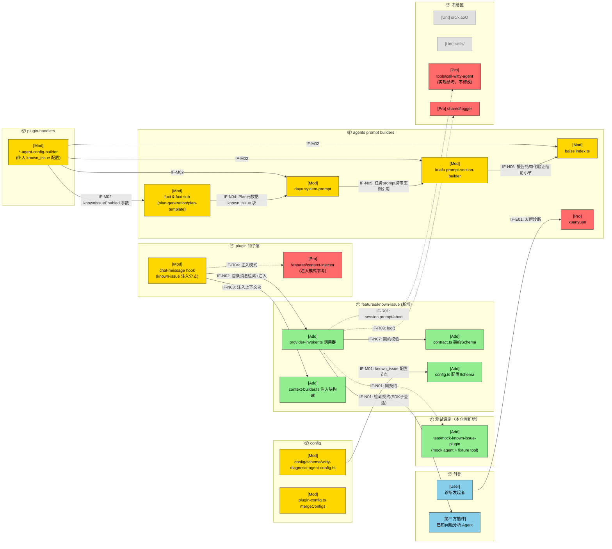
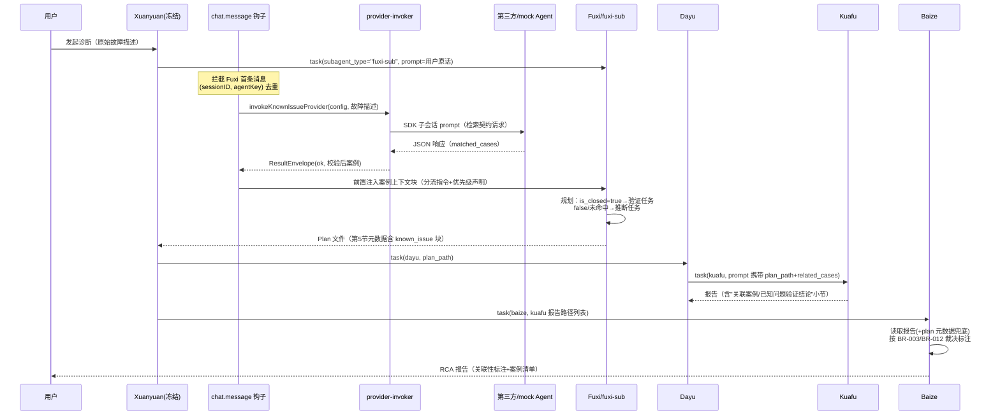
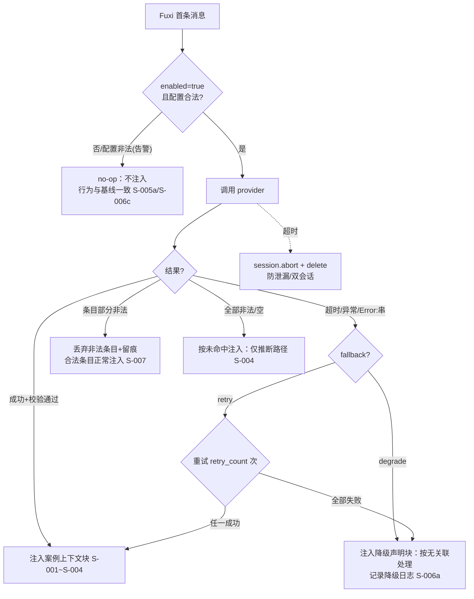

# 已知问题分析 Agent 集成 —— 需求设计规格书

> 文档版本：v1.1（Review 2 结论：Conditional Pass 88 分，必改项 Major-1/2/3 与 Minor-1/2/3 已全部完成）
> 类型（type）：新特性集成（Feature）
> 基线（base_commit）：9478703（master）
> 更新时间（update_time）：2026-06-11
> 上游文档：[01-需求分析规格书](./01-需求分析规格书.md)（v1.3，Review 1 通过，含 Phase2 口径回写）
> 难度评估：**High**
> 实现范围：仅 opencode 实现（`src/opencode`）+ mock 插件（`test/mock-known-issue-plugin`）

---

## §1 设计概要

### 1.1 实现思路

在 witty-diagnosis-agent 的 opencode 插件内，以**宿主侧确定性代码**为接缝集成可插拔"已知问题分析 Agent"：

1. **检索触发（确定性，不依赖 LLM 自觉）**：复用现有 `chat.message` 钩子与 context-injector 注入模式——当 `known_issue.enabled=true` 且当前会话消息目标为 Fuxi/fuxi-sub 的**首条消息**时（按 `(sessionID, agentKey)` 去重，仿 `firstMessageVariantGate` 模式），宿主调用 Provider 调用器完成检索，并把校验后的案例结果作为上下文块前置注入该消息。
2. **Provider 调用（新增 `src/opencode/features/known-issue/`）**：经 opencode SDK 子会话调用 `provider.name` 指定的第三方插件注册 Agent（与现有 `tools/call-witty-agent/sync-executor.ts` 同款机制）；内置超时（`Promise.race` + 显式 `session.abort/delete` 防泄漏）、重试（新建会话）、双失败通道识别（throw 与 `"Error:"` 字符串）、宽容 JSON 解析 + Zod 契约校验（非法条目丢弃留痕）；返回**永不抛出**的 `ResultEnvelope`。
3. **链路贯通（文件契约为事实源）**：Fuxi prompt 条件注入分流规则（`is_closed=true`→验证任务；false/未命中→推断任务；与现有"第零步/短路规则"优先级显式界定）→ Plan 第 5 节 JSON 元数据扩展 `known_issue` 块与 `tasks[].hypothesis_type/related_cases`（案例唯一事实源）→ Dayu 派发 prompt 透传 `plan_path` 与案例引用 → Kuafu 报告输出结构化"关联案例 / 已知问题验证结论"小节 → Baize 按 BR-003/BR-012 输出三选一"关联性标注"章节，并以 plan 元数据兜底校对。
4. **零 Breaking Change 双保险**：`known_issue` 配置默认未启用；禁用/未配置时钩子 no-op、各 agent prompt 逐字节与基线一致、不注册任何新全局工具。
5. **Mock 验证**：`test/mock-known-issue-plugin/` 独立 opencode 插件，注册 `mock-known-issue-agent` 并绑定确定性 fixture tool（8 类响应模式，超时经 tool 内 sleep 实现），经 opencode config `plugin` 数组以 `file:` 路径加载。

### 1.2 设计决策

|编号|决策项|类别|内容|理由|
|-|-|-|-|-|
|D-001|检索触发载体：宿主 `chat.message` 钩子确定性注入，而非"注册检索工具 + Fuxi LLM 自觉调用"|架构设计 / 变更点设计|在 Fuxi/fuxi-sub 首条消息钩子中由宿主代码完成检索并注入上下文；放弃全局工具方案|Fuxi 现有 prompt 含"第零步确定性判断/强制短路规则（最高优先级）"（`agents/fuxi/fuxi/plan-generation.ts:33,84`），LLM 自觉调用在短路场景下无保障，BR-001/AC-001~004 不可稳定达成；且全局工具会改变所有 agent 的禁用态可见面，破坏 BR-006。钩子注入路径已被 `features/context-injector/injector.ts` 生产验证（`Hooks["chat.message"]` 可读 `input.agent` 并改写 `output.parts`）|
|D-002|Provider 形态：本期仅支持 Agent 形态（SDK 子会话调用），`provider.type` 预留枚举|技术选型|第三方以插件注册 Agent 交付，宿主经 `promptAsync({body:{agent}})` 调用（`tools/call-witty-agent/sync-executor.ts:48-58` 已验证）。Tool 形态不纳入本期|经核实 `@opencode-ai/sdk` 的 `Tool` 类仅有 `ids/list` 方法，**不提供宿主直接执行其他插件 Tool 的 API**；Agent 形态是当前 SDK 能力下唯一确定可行路径。Tool 形态时延更低但无 API 支撑，留待 SDK 演进后经 `provider.type` 枚举扩展（开闭原则）|
|D-003|失败语义收敛于确定性代码：`ResultEnvelope {status: ok\|disabled\|degraded\|invalid, matched_cases, meta}`，调用器永不抛出|DFx 设计 / 设计模式|超时、重试、降级、契约校验、双失败通道识别全部在 TS 代码实现，LLM 仅消费已校验结果；契约信封 + 宽容解析（提取首个 JSON 块）|BR-004"主流程禁止阻塞"是 P0 硬约束，不能依赖 prompt 遵守；跨插件 LLM 输出不可全信，需要确定性校验边界。与项目现有"部分失败容错"模式（`plugin-config.ts` 的 `parseConfigPartially`：跳过无效节点+告警继续）一致|

---

## §2 架构设计

### 2.1 架构变更

#### 2.1.1 变更总览

图例：🔵外部 🟢新增 🟡修改 🔴保护（被调用但本期禁止修改）⚪不涉及。接口命名 IF-{E外部/N新增/M修改/R复用}{编号}。



#### 2.1.2 模块变更

|模块|变更|职责|接口|依赖|约束|
|-|-|-|-|-|-|
|`src/opencode/features/known-issue/`|新增|契约 Schema、known_issue 配置 Schema、Provider 调用器、注入上下文块构建|IF-N01/N02/N03|@opencode-ai/sdk（子会话）、zod、shared/logger|调用器永不 throw；所有失败路径收敛为 ResultEnvelope；不依赖任何 agent prompt|
|`src/opencode/plugin/` chat-message 钩子|修改|新增 known-issue 注入分支：识别 Fuxi/fuxi-sub 首条消息→检索→注入|IF-N02|features/known-issue|disabled 时该分支严格 no-op；不得影响现有 context-injector 行为|
|`src/opencode/config/schema/witty-diagnosis-agent-config.ts`|修改|新增 `known_issue` 可选节点|IF-M01|zod|节点 optional；不改动既有字段；refine 拦截 enabled=true 且 provider.name 为空|
|`src/opencode/plugin-config.ts`|修改|`mergeConfigs` 为 `known_issue` 增加 deepMerge|IF-M01|deep-merge-record|沿用 agents/categories 的既有 deepMerge 模式；不改其它字段合并语义|
|`src/opencode/agents/fuxi/`（fuxi 与 fuxi-sub）|修改|plan-generation/plan-template 条件注入分流规则段落与元数据扩展|IF-N04|plugin-handlers 传参|仅条件追加段落；disabled 时输出逐字节一致；不修改"第零步/短路规则"既有文本|
|`src/opencode/agents/dayu/`|修改|system-prompt 增加"透传 plan_path 与 related_cases 至 Kuafu 任务 prompt"指令|IF-N05|—|条件注入；不改既有调度逻辑指令|
|`src/opencode/agents/kuafu/`|修改|prompt-section-builder 增加验证任务指引与报告结构化小节格式|IF-N06|—|条件注入；不改既有 skill 加载与报告路径约定|
|`src/opencode/agents/baize/`|修改|index.ts 增加"关联性标注"章节规则（BR-003 三选一 + BR-012 裁决）与 plan 元数据兜底指令|IF-N06|—|条件注入；不改既有 RCA 报告骨架|
|`src/opencode/plugin-handlers/*-agent-config-builder.ts`|修改|将 known_issue 配置（enabled 等）传入各 prompt builder|IF-M02|plugin-config|仅新增参数透传；不改既有 agent 注册流程|
|`test/mock-known-issue-plugin/`|新增|独立 opencode 插件：mock agent + 确定性 fixture tool（8 类模式）|IF-N01（提供方侧）|@opencode-ai/plugin|与宿主代码零依赖；仅测试时经 `file:` 路径加载；基线/TC-005 测试**不得**加载|
|`src/opencode/agents/xuanyuan/`|保护|总控编排（不变）|—|—|本期禁止修改：检索在 Fuxi 阶段内完成，编排流程无感知|
|`src/opencode/tools/call-witty-agent/`、`features/context-injector/`、`shared/logger`|保护|实现参考/复用|IF-R01/R03/R04|—|仅调用/参考，禁止修改|
|`src/xiaoO/`、`skills/`|不涉及|—|—|—|明确防止误改|

### 2.2 模块详情

#### 2.2.1 features/known-issue（新增）

- 负责职责：已知问题检索的全部确定性逻辑——配置解析、契约定义与校验、第三方 Agent 调用、结果归一化、注入上下文块构建。
- 功能性设计：
  1. `contract.ts`：检索请求/响应 Zod Schema。响应条目 `case_name/case_description/is_closed/source` 必填，`source_url/similarity` 可选；使用 `.passthrough()` 容忍未知字段但消费层仅读取契约字段（BR-007/AC-015）。
  2. `config.ts`：`KnownIssueConfigSchema = { enabled: boolean (default false), provider: { type: "agent", name: string }, timeout_ms: positive int (default 30000), fallback: { strategy: "degrade"|"retry" (default "degrade"), retry_count: positive int (default 1) } }`；`.refine(enabled === false || provider.name 非空)` —— 非法节点经 `parseConfigPartially` 跳过+告警（BR-011）。
  3. `provider-invoker.ts`：`invokeKnownIssueProvider(config, query, ctx): Promise<ResultEnvelope>`。子会话创建→`promptAsync({body:{agent: provider.name}})`→`Promise.race` 超时→超时/失败时 `session.abort` + `session.delete`→retry 策略下新建会话重试→宽容解析（提取首个 JSON 块）→逐条 Zod 校验（非法丢弃留痕）。**双失败通道**：catch 异常 + 识别 `"Error:"` 前缀返回串。
  4. `context-builder.ts`：将 `ResultEnvelope` 渲染为注入上下文块（含案例清单、is_closed 分流指令、与短路规则的优先级声明、检索状态）。
- 非功能设计：
  1. 永不 throw（BR-004）；每次调用记录 `log()`：发起、命中数、耗时、校验失败明细、降级事件（NFR-005/AC-011）。
  2. 调用器与 LLM/prompt 零耦合，可对其做单元级注入桩测试（NFR-006）。
- 风险与缓解：
  1. 第三方返回 JSON 夹杂自然语言 → 宽容解析提取首个 JSON 块；解析失败按 `invalid` 降级。
  2. provider agent 名不存在 → `"Error:"` 通道识别，按缺位降级（S-005b）并告警。

#### 2.2.2 钩子注入分支（chat-message）

- 负责职责：在正确的时机以确定性方式触发检索并注入结果。
- 功能性设计：
  1. 触发条件（全部满足）：`known_issue.enabled=true` 且配置合法；`input.agent` 归一化后（经 `getAgentConfigKey`）∈ {fuxi, fuxi-sub}；该 `(sessionID, agentKey)` 首次出现（内存 Map 去重，仿 `firstMessageVariantGate`）。
  2. 注入方式：调用 invoker 后，将 context-builder 产出的上下文块**前置**写入 `output.parts`（与 `injectPendingContext` 同模式）。
  3. 去重键语义：同一会话同一 agent 仅检索一次；同会话二次诊断不重新检索（本期边界，已回写上游需求文档 §5.2 第 7 条）。
  4. 去重 Map 生命周期：挂接 `session.deleted` 事件清理对应条目（`plugin/event.ts` 已有同款事件处理先例），避免长寿命进程下无界增长。
- 非功能设计：禁用时该分支在配置判断后立即 return（no-op），无任何可观测副作用（AC-005）。
- 风险与缓解：检索阻塞首条消息 → 受 timeout_ms 硬上界约束（最坏 `(1+retry_count)×timeout_ms`，见 §7.2）。

#### 2.2.3 Mock 插件（test/mock-known-issue-plugin）

- 负责职责：以与真实第三方完全相同的形态（opencode 插件注册 Agent）提供 8 类可控契约响应。
- 功能性设计：
  1. 经 `Hooks.config` 注册 `mock-known-issue-agent`（`config.agent[...]`，宿主 `agent-config-handler.ts:256` 同款方式），`AgentConfig.tools` 仅启用自带 `mock_known_issue_fixture` tool。
  2. fixture tool 读取**模式文件**（唯一切换机制，固定路径：`test/mock-known-issue-plugin/mock-mode.json`，内容 `{ "mode": "<模式名>" }`；每次 tool 调用时实时读取，支持测试运行中热切换、不依赖进程重启，与 TC-011"重新加载后生效"匹配）返回 8 类响应之一：`closed`（已结）/ `open`（未结）/ `mixed`（混合）/ `multi_closed`（多已结）/ `empty`（空）/ `invalid`（缺必填字段）/ `timeout`（tool 内 sleep > timeout_ms）/ `extra_fields`（契约外字段）。模式文件缺失或 mode 非法时默认 `closed` 并在 tool 返回中附告警标记。
  3. mock agent system prompt 仅一条指令："调用 `mock_known_issue_fixture` 并将其返回内容原样作为最终回复，不增删改任何字符"。
- 非功能设计：与宿主零代码依赖；tool 注册面为全局扁平命名空间，故**基线一致性测试（TC-005）不得加载本插件**。
- 风险与缓解：LLM"原样输出"最后一跳可能改写非法 JSON → 宿主侧宽容解析+校验天然兜底；另以调用器注入桩做确定性单元测试双保险。

### 2.3 功能影响

```text
- witty-diagnosis-agent (opencode 实现)
  - 配置体系
    - 新增 known_issue 配置节点（默认关闭，零 Breaking Change）
  - 诊断规划（Fuxi/fuxi-sub）
    - 新增：规划前案例上下文注入；任务携带 hypothesis_type/related_cases
  - 调度执行（Dayu/Kuafu）
    - 新增：案例引用透传；验证任务与结构化验证结论
  - 报告（Baize）
    - 新增：关联性标注章节（三选一 + 混合裁决）
  - 测试设施
    - 新增：mock 已知问题分析插件
```

|功能|变更|变更点|对应需求|
|-|-|-|-|
|known_issue 配置|增|schema 节点 + deepMerge + refine 校验|FR-003、BR-011、DC-008~011|
|检索契约与校验|增|contract.ts + 调用器内逐条校验|FR-001、FR-008、BR-005、BR-007|
|Provider 调用|增|provider-invoker.ts（SDK 子会话 + 超时/重试/降级）|FR-002、FR-007、BR-004|
|规划关联生成|改|Fuxi prompt 条件段落 + Plan 元数据扩展|FR-004、BR-001、BR-009、BR-010|
|案例透传与验证|改|Dayu/Kuafu prompt 条件段落 + 报告结构化小节|FR-005、BR-002、S-008|
|报告关联性标注|改|Baize prompt 条件段落（三选一 + BR-012 裁决 + plan 兜底）|FR-006、BR-003、BR-012|
|Mock 插件|增|test/mock-known-issue-plugin|FR-009、NFR-006|

---

## §3 核心流程

### 3.1 主流程（启用且命中）



### 3.2 降级与容错流程



> 关键差异说明：**S-005a（未启用）与 S-005b/S-006（启用但失败）的注入行为不同**——前者完全不注入（报告无标注章节）；后者注入"降级声明块"，使 Baize 标注"无关联的新问题"（BR-003 启用前置条件成立）。

---

## §4 算法设计

### 4.1 分流与关联性裁决规则

**目标**：将契约的 `is_closed` 转化为规划任务类型与报告标注，保证 BR-001/BR-003/BR-012 可判定（该"算法"以 prompt 规则 + 元数据契约形式落地，宿主不写决策代码）。

**核心逻辑**：

```
规划分流（注入到 Fuxi 的规则，优先级声明：短路规则决定任务结构，
本规则为正交标注层，已结案命中时验证任务不受短路豁免）：
  for case in matched_cases:
    case.is_closed == true  → 必须存在 hypothesis_type="verification" 任务，related_cases 含该案例
    case.is_closed == false → 推断任务 related_cases 含该案例（线索）
  matched_cases 为空/降级    → 任务均为 hypothesis_type="inference"，related_cases=[]
  similarity 仅透传，禁止参与分流（BR-010）

报告标注裁决（注入到 Baize 的规则，BR-012）：
  若功能未启用（kuafu 报告/plan 无 known_issue 痕迹）→ 不输出标注章节
  若存在已结案案例且其验证结论 verification_result=passed → "关联已结案案例"
  否则若推断路径采用了未结案案例线索 → "关联未结案案例"
  否则 → "无关联的新问题"
  无论取值，所有命中案例逐条列出（名称+来源，BR-009）
```

**输入**：校验后的 `matched_cases`；Kuafu 报告中的 `verification_result`。
**输出**：Plan 任务标注字段；报告"关联性标注"章节（三选一）。
**边界条件与异常处理**：混合命中（S-003）按上述裁决顺序唯一可判定；验证不通过（S-008）自然落入第二/第三分支。

### 4.2 Provider 调用器状态机

**目标**：在不可信外部调用上实现 BR-004（永不阻塞）。

```
disabled ──(enabled 且配置合法)──> invoking
invoking ──成功+解析校验通过──> ok(matched_cases)
invoking ──全部条目非法/解析失败──> invalid(=按未命中消费)
invoking ──超时/异常/"Error:"串──> strategy=degrade ? degraded
                                  : 重试<retry_count ? invoking(新会话)
                                  : degraded
任何超时/失败路径 → session.abort + session.delete（资源回收）
```

**复杂度/时延分析**：最坏阻塞时长 = `(1 + retry_count) × timeout_ms`（默认 2×30s；见 §7.2 对 NFR-003 的口径澄清）。

---

## §5 数据模型

### 5.1 检索契约（IF-N01，宿主 ↔ 已知问题分析 Agent）

**描述**：新增的跨插件数据契约，JSON 文本承载（请求嵌入子会话 prompt，响应为 agent 最终消息中的 JSON 块）。相对架构报告 §6.1 的适配：检索发生在规划前，输入以故障描述文本为主（vmcore 摘要等尚不可得）；`sources/top_k` 等检索策略属第三方内部职责，不进入本期契约必填面。

**请求**：

```json
{
  "task_id": "string（必填，会话级唯一）",
  "inputs": {
    "fault_description": "string（必填：用户原始故障描述/现象文本）",
    "context_hints": "string（可选：宿主可得的补充特征）"
  },
  "options": { "top_k": 5 }
}
```

> 字段约定：`options` 整体可选，缺省时由提供方自行决定返回条数；`options.top_k` 可选，默认 5。`fault_description` 提取规则：取 Fuxi/fuxi-sub 首条用户消息中全部 text 类型 parts 按序拼接（与 `injectPendingContext` 遍历 parts 的方式一致），不含宿主注入的 synthetic 内容。

**响应**（Zod 校验，条目级容错）：

```json
{
  "task_id": "string",
  "matched_cases": [
    {
      "case_name": "string（必填）",
      "case_description": "string（必填）",
      "is_closed": true,
      "source": "string（必填，数据源标识，不含公司标识）",
      "source_url": "string（可选）",
      "similarity": 0.83
    }
  ],
  "agent_meta": { "provider": "string", "version": "string" }
}
```

### 5.2 ResultEnvelope（宿主内部归一化模型）

```ts
type ResultEnvelope = {
  status: "ok" | "disabled" | "degraded" | "invalid"
  matched_cases: MatchedCase[]        // 已通过校验的条目（degraded/invalid 时为 []）
  meta: { elapsed_ms: number; attempts: number; dropped_entries: number; provider?: string }
}
```

### 5.3 Plan 第 5 节元数据扩展（IF-N04，向后兼容：新增可选字段）

```json
{
  "plan_path": "...", "created_at": "...", "mode": "...", "target": "...",
  "known_issue": {
    "status": "ok | degraded | invalid",
    "matched_cases": [ { "case_name": "...", "is_closed": true, "source": "..." } ]
  },
  "tasks": [
    {
      "id": "T1", "symptom": "...", "failure_mode": "...",
      "hypothesis_type": "verification | inference",
      "related_cases": [ { "case_name": "...", "is_closed": true, "source": "..." } ]
    }
  ]
}
```

### 5.4 Kuafu 报告结构化小节（IF-N06）

```markdown
## 关联案例
| 案例名称 | 是否结案 | 来源 | similarity |
## 已知问题验证结论
verification_result: passed | failed     ← 固定键值行，Baize 据此裁决
说明: <验证依据/不匹配原因>
```

---

## §6 接口设计

### 6.1 外部接口

|名称|变更|描述|请求方式|请求参数|返回参数|
|-|-|-|-|-|-|
|IF-N01 已知问题检索契约|增|宿主调用已知问题分析 Agent（第三方/mock 同契约）|opencode SDK 子会话（`session.prompt`，body.agent=provider.name），JSON 文本承载|§5.1 请求体|§5.1 响应体；失败以 throw 或 `"Error:"` 串返回，宿主双通道识别|

### 6.2 内部接口

|名称|变更|描述|调用方|提供方|请求参数|返回参数|
|-|-|-|-|-|-|-|
|`invokeKnownIssueProvider`|增|检索调用（超时/重试/降级/校验）|chat-message 钩子|features/known-issue|`(config, query, ctx)`|`Promise<ResultEnvelope>`（永不 reject）|
|`buildKnownIssueContextBlock`|增|渲染注入上下文块|chat-message 钩子|features/known-issue|`(envelope)`|string（含分流指令与优先级声明）|
|`KnownIssueResponseSchema.safeParse`（IF-N07）|增|契约校验|provider-invoker|contract.ts|原始 JSON|条目级校验结果|
|各 prompt builder 签名扩展|改|`buildFuxiPrompt/buildBaizePrompt/...` 增加 `knownIssue?: { enabled: boolean }` 参数|plugin-handlers/*-agent-config-builder|agents/*|新增可选参数（缺省=禁用）|prompt 字符串（禁用时逐字节不变）|
|`mergeConfigs` known_issue 分支|改|配置 deepMerge（项目级覆盖用户级，字段级合并）|plugin-config|plugin-config|两份配置|合并后配置|
|`session.abort/delete`|复用|超时后子会话回收|provider-invoker|@opencode-ai/sdk|`{path:{id}}`|—|

### 6.3 配置接口

|名称|变更|描述|类型|默认值|取值范围|
|-|-|-|-|-|-|
|`known_issue.enabled`|增|总开关|boolean|`false`|true/false|
|`known_issue.provider.type`|增|提供方形态（本期仅 agent，预留扩展）|enum|`"agent"`|`"agent"`|
|`known_issue.provider.name`|增|第三方插件注册的 Agent 名|string|—|非空字符串；enabled=true 时必填（refine）|
|`known_issue.timeout_ms`|增|单次检索调用超时|number|`30000`|正整数|
|`known_issue.fallback.strategy`|增|失败策略|enum|`"degrade"`|`"degrade" \| "retry"`（fail 不纳入本期，见需求边界 5）|
|`known_issue.fallback.retry_count`|增|retry 策略下的重试次数|number|`1`|正整数|

> 非法值处理：整节点经 zod 校验失败 → `parseConfigPartially` 跳过该节点 + `addConfigLoadError` 告警 → 功能视同未启用（BR-011/S-006c/TC-018）。

---

## §7 DFx 设计

### 7.1 可用性 / 可靠性

|故障/风险场景|触发|应对策略|取舍/决策|
|-|-|-|-|
|第三方 Agent 缺位（未安装/名字错误）|启用但 provider 不存在|`"Error:"` 通道识别 → degraded 注入降级声明块 + 告警日志，主流程继续|不做启动期探活：调用期惰性发现足够且实现简单|
|检索超时|响应超过 timeout_ms|`Promise.race` 截断 + `session.abort/delete` 回收 → 按 fallback 处理|显式 abort 避免子会话泄漏与 retry 双会话并发|
|响应非法/夹杂自然语言|契约校验失败|宽容解析提取首个 JSON 块；条目级丢弃+留痕；全非法→invalid（按未命中）|条目级容错优于整包拒绝：部分可用数据仍有价值|
|配置非法|schema/refine 校验失败|对齐 `parseConfigPartially` 既有行为：跳过+告警+视同未启用|复用既有容错模式，不引入新错误处理路径|
|LLM 透传丢失案例引用|Dayu/Kuafu 不遵守 prompt|Plan 元数据为唯一事实源 + Kuafu prompt 双处携带 + Baize 读 plan 兜底|接受残余风险：三重冗余下丢失概率可控，TC-009 守护|

### 7.2 性能

|指标|目标值|模块分解|分解假设|
|-|-|-|-|
|检索引入的规划阶段时延上界|degrade：≤ 1×timeout_ms（默认 30s）；retry：≤ (1+retry_count)×timeout_ms（默认 60s）|provider-invoker 全部承担；钩子/校验/注入 < 50ms|NFR-003"不超过一个超时周期"按 degrade 口径验收（TC-006）；retry 上界口径已回写上游需求文档 v1.3（NFR-003 与回写记录）|

**优化措施**：

|关注点|应对策略|取舍/决策|
|-|-|-|
|禁用态零开销|配置判断短路（一次布尔判断）|无需缓存层|
|同会话重复检索|`(sessionID, agentKey)` 去重，仅首条消息触发|同会话二次诊断不重新检索（本期边界，§8.1）|

### 7.3 安全性

|高风险项|类型|风险分析|应对策略|
|-|-|-|-|
|第三方响应注入 prompt|依赖安全|案例描述文本直接注入 Fuxi 上下文，可能含提示注入内容|注入块以固定框架包裹并声明"案例内容仅作参考数据"；契约校验限制字段集；本期接受残余风险（与现有 skill 文本注入同级）|
|日志泄露|日志审计|案例描述可能含敏感信息|日志仅记录 case_name/source/计数/耗时，不落 case_description 全文|

### 7.4 其他

|目标|类型|应对策略|取舍/决策|
|-|-|-|-|
|提供方可替换|可扩展性|provider.name 配置化；provider.type 预留枚举；契约 Schema 单一事实源|新提供方零代码接入（改配置）；新形态（tool/http）改 invoker 单点|
|可测试性|可测试性|① mock 插件端到端（AC-012）；② invoker 注入桩单元测试（确定性）；③ prompt builder 纯函数断言（禁用态逐字节一致）|三层测试金字塔，TC-005 不加载 mock 插件以保证基线纯净|
|可观测性|可维护性|`shared/logger`：调用发起/命中数/耗时/校验失败/降级事件，统一 `[known-issue]` 前缀|可经日志统计命中率（NFR-005）|
|零 Breaking Change|兼容性/可升级性|known_issue 节点 optional；禁用态 prompt 逐字节一致 + 无新工具 + 钩子 no-op；Plan 元数据新字段为可选扩展（旧消费者容忍）|双保险 + 三处验收断言（TC-005/AC-005）|

---

## §8 附件

### 8.1 验证遗留风险澄清（第 2 轮可行性验证输出，已固化为设计约束）

1. **Plan 元数据无宿主侧确定性校验**：`hypothesis_type/related_cases/known_issue` 块由 Fuxi（LLM）按 prompt 写入。本期以测试显式断言 plan JSON 字段存在性（TC-001/TC-009 落实），不增加宿主侧修补环节（避免过度设计）；若实测丢失率不可接受，后续迭代再加确定性校验钩子。
2. **首条消息去重键**：`(sessionID, agentKey)` 内存 Map，挂接 `session.deleted` 事件清理；同一会话内第二次诊断不重新检索——该边界已回写上游需求文档 v1.3 §5.2 第 7 条。
3. **retry 模式时延上界**：`(1+retry_count)×timeout_ms`，已在 §7.2 显式声明；NFR-003 验收口径（degrade 一个超时周期 / retry 上界）已回写上游需求文档 v1.3。

### 8.2 可行性验证记录摘要

- 第 1 轮：5 项不符合（2 项 P0：LLM 自觉调用与短路规则冲突、禁用态工具注册面）→ 设计修订为钩子确定性注入 + 取消全局工具。
- 第 2 轮：5 项全部确认解决；3 项新假设经代码核实成立——`chat.message` 钩子可区分 agent 并改写 parts（`features/context-injector/injector.ts` 生产验证）、SDK `session.abort/delete` 存在且有 3 处生产调用先例（`plugin/event.ts`）、插件可注册 agent 并经 `AgentConfig.tools` 绑定专属 tool。结论：**通过，可进入文档生成**。
- 用户确认：同意该设计方案（2026-06-11）。
