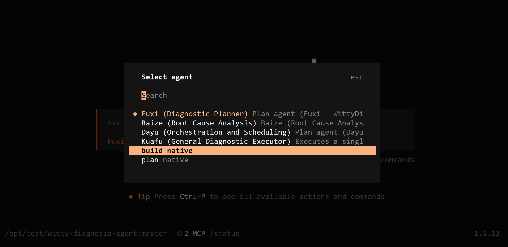
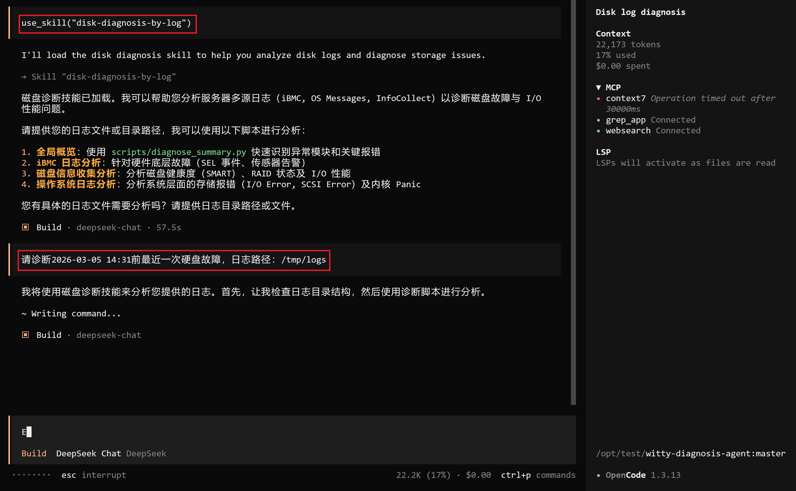
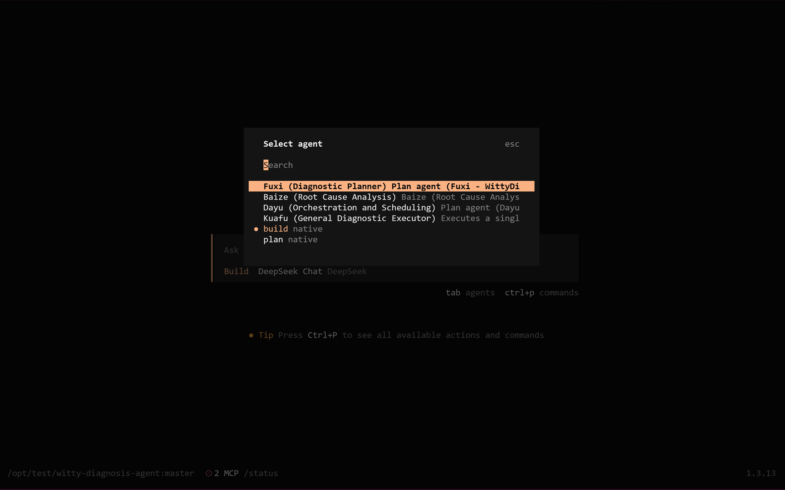

# 扩展开发指南 (Extension Development Guide)

**Witty Diagnosis Agent** 采用模块化设计，支持开发者通过编写 **Skill** (技能) 来扩展其能力。

## 什么是 Skill？

Skill 是 Agent 的原子能力单元。一个 Skill 可以封装一个 Shell 命令、一个 Python 脚本、一次 API 调用，甚至是一段复杂的逻辑。

例如：

- `check_cpu_usage`: 封装 `top` 命令。
- `analyze_mysql_slow_log`: 封装对 MySQL 慢查询日志的解析逻辑。

## 开发流程

### 1. 创建 Skill 目录

在 `skills/` 目录下创建一个新的子目录，例如 `skills/my-custom-skill/`。

### 2. 定义 Skill 元数据 (skill.yaml)

每个 Skill 必须包含一个 `skill.yaml` 文件，描述其输入、输出和用途。

```yaml
name: check_disk_usage
description: 检查磁盘空间使用率
version: 1.0.0
inputs:
  path:
    type: string
    description: 要检查的目录路径，默认为 /
    required: false
outputs:
  usage:
    type: string
    description: 磁盘使用率百分比
```

### 3. 实现执行逻辑 (index.ts / script.py)

您可以选择使用 TypeScript 或 Python/Shell 实现具体逻辑。

**TypeScript 示例 (index.ts):**

```typescript
import { SkillContext } from '@witty/sdk';

export async function run(ctx: SkillContext) {
  const path = ctx.inputs.path || '/';
  // 执行 df -h 命令
  const result = await ctx.exec(`df -h ${path}`);
  return { usage: parseDfOutput(result.stdout) };
}
```

## 最佳实践

1. **原子性**: 一个 Skill 只做一件事，保持功能单一。
2. **鲁棒性**: 处理好各种异常情况（如命令不存在、权限不足）。
3. **标准化输出**: 尽量返回结构化的 JSON 数据，便于下游 Agent 解析。
4. **无状态**: Skill 应设计为无状态的，不依赖外部持久化存储。

## 调试

### 一、准备工作：确保 Skill 基础配置正确

1. **确认 Skill 存放路径（优先级从高到低）**
   
   OpenCode 按以下路径搜索 Skill，优先加载项目级：
   
   | 优先级 | 路径                                 | 类型      |
   | --- | ---------------------------------- | ------- |
   | 1   | `.opencode/skills/[skill-name]/`   | 项目级（推荐） |
   | 2   | `~/.opencode/skills/[skill-name]/` | 全局级     |

2. **校验目录结构（必须）**
   
   每个 Skill 目录必须包含：
   
   ```plaintext
   .opencode/skills/your-skill/
   ├── SKILL.md # 技能定义（核心）
   ├── scripts/ # 可选：可执行脚本
   │ └── run.sh
   └── README.md # 可选：说明
   ```

3. **校验 SKILL.md 格式（最常见错误）**
   
   必须以 **YAML frontmatter** 开头，用 `---` 包裹，否则加载失败：
   
   ```markdown
   ---
   name: your-skill          # 技能名（英文，无空格）
   description: "调试用Skill" # 描述
   version: 0.1.0
   author: you
   scripts:                  # 可选：注册可执行脚本
     - scripts/run.sh
   ---
   
   # 技能说明
   这里写 Skill 的功能、触发条件、使用示例。
   ```

4. **确认Skill加载状态**
   
   ```shell
   # 列出所有已加载的 Skill,确认Skill是否已加载
   list_skills
   ```

### 二、调试

建议先使用OpenCode内置的**build Agent**单独调试Skill本身，调试通过后再在**Witty智能诊断Agent**中调试端到端效果，以提升调试效率。

#### 使用build Agent调试

1. 执行`/agents`命令选择`build`Agent：
   
   

2. 加载和调试Skill：
   
   ```shell
   # 加载Skill，your-skill必须和SKILL.md 中 name 完全一致（区分大小写）
   use_skill("your-skill")
   
   # 输入具体的问题，例如：
   请诊断2026-03-05 14:31前最近一次硬盘故障，日志路径：/tmp/logs
   ```
   
   

#### 使用Witty智能诊断Agent调试

1. 执行`/agents`命令选择`Fuxi`Agent：
   
   

2. 执行`auto-diag`调试Skill：
   
   ```shell
    auto-diag 故障问题描述
   ```
   
   示例：
   
   ```shell
    auto-diag "请诊断2026-03-05 14:31前最近一次硬盘故障，日志路径：/tmp/logs"
   ```
   
   
