# 产品介绍

## 智能诊断Agent是什么

智能诊断 Agent 是面向 **openEuler** 生态的自动化故障诊断工具，融合 AI 技术与内核可观测能力，依托 **「假设 - 验证」** 范式与 **多 Agent 协同** 架构，可在分钟级内自动定位系统崩溃、死锁、内存泄漏等复杂故障根因，生成结构化诊断报告与可执行优化建议，重构传统运维排障模式，实现OS故障诊断智能化、高效化。

## 产品优势

* **全栈并发诊断**：跨系统、内核、硬件多路径并行排查，打破传统线性诊断的效率瓶颈，大幅缩短排障耗时。
* **专家经验沉淀**：内置多场景诊断能力与完备故障模式库，复刻资深运维专家排查思路，精准定位故障根因，避免无效排查。
* **端到端闭环自愈**：完整覆盖“现象分析→根因定界→报告生成→执行修复”全流程，无需人工介入衔接，实现故障处置闭环。
* **全流程安全管控**：诊断阶段采用只读模式，避免对系统造成干扰；修复阶段实行按需赋权+用户审批机制，确保操作安全可控，杜绝误操作风险。

## 核心功能

* **服务故障诊断**：针对OS系统服务异常（如服务启动失败、运行中断等场景），自动采集服务运行日志与相关数据，结合AI分析能力快速定位故障根因，支撑系统服务快速恢复，保障OS整体运行稳定性。
* **内核故障诊断**：聚焦系统内核级异常，涵盖系统Crash、死锁、内存泄漏等核心问题，依托内核可观测能力，实现分钟级根因自动定位，破解内核故障排查难度大、耗时长的痛点。
* **硬件故障诊断**：面向CPU、内存、磁盘、网卡等核心硬件组件，智能识别硬件运行异常特征，精准判定硬件故障根源，同时提前预警潜在硬件隐患，减少硬件故障对业务的影响。
* **故障快速修复**：基于诊断过程中生成的结构化报告，自动输出可执行优化建议与修复方案，简化故障处置流程，缩短故障排查与修复周期，实现故障快速恢复，保障业务稳定运行。

完整故障诊断能力请参见[功能列表](reference/features.md)。

## 系统架构

Witty 智能诊断Agent采用“Agent-Skill-工具-知识”四层解耦架构，兼具高灵活性与可扩展性，各层独立运行、协同联动，保障诊断流程高效稳定。


**1. Agent层：智能协同的推理引擎与决策中枢**

- **诊断规划 Agent（Fuxi）**：接收故障信息，梳理故障现象，生成根因假设与系统化排查计划。
- **编排调度 Agent（Dayu）**：解析排查计划，将任务拆解为可执行单元，并行下发至验证分析 Agent。
- **验证分析 Agent（Kuafu）**：执行专属诊断Skill，调用工具采集、分析多维度数据，完成证据推理与假设验证。
- **根因融合 Agent（Baize）**：汇总多路诊断结果，进行交叉验证与融合分析，输出结构化、可解读的诊断报告。
- **故障修复 Agent（Nuwa）**：基于诊断报告推荐针对性修复策略，经人工审核通过后，受控执行修复操作。

**2. Skill层：专家经验的标准化沉淀与场景化赋能**
将资深运维专家的故障排查思路，抽象为可复用、可编排的标准化诊断技能，覆盖系统崩溃、死锁、IO异常等各类复杂故障场景，支撑多场景快速诊断。

**3. 工具层：高效可靠的多源数据处理底座**
深度集成gala-gopher、sysTrace等openEuler生态观测工具，以低侵入方式采集和分析指标、日志、内核等多维度遥测数据，为诊断推理提供精准数据支撑。

**4. 知识层：持续进化与自我完善的诊断智慧核心**
内置openEuler专属故障模式与因果规则库，结合实际诊断场景持续迭代优化，实现诊断能力的自我进化，适配更多复杂故障场景。

# 安装与配置

## 环境要求

- 运行环境：Node.js (>=18.0.0)
- 依赖工具：已安装[OpenCode](https://opencode.ai/)
- 依赖工具：已安装 [Ansible](https://docs.ansible.com/ansible/latest/installation_guide/)（`ansible` 命令须在系统 PATH 中可用，可通过 `ansible --version` 提前验证）

## 安装

智能诊断Agent支持**在线安装**与**源码安装**两种方式，您可根据自身网络环境与使用需求选择合适方式。

### 方式一：在线安装（推荐）

通过 npm 全局安装智能诊断 Agent，安装完成后可通过命令行一键为 OpenCode 注册插件及配置：

```bash
npm install -g witty-diagnosis-agent@latest
witty-diagnosis-agent install
```

### 方式二：源码安装

如果您需要二次开发或在离线环境中使用，可以使用一键安装脚本自动完成环境检查、依赖安装、项目构建及插件配置：

```shell
git clone https://atomgit.com/openeuler/witty-diagnosis-agent.git
cd witty-diagnosis-agent
bash install.sh
```

## 配置

修改项目根目录下的`.opencode/witty-diagnosis-agent.jsonc` 文件，为各个Agent配置缺省运行模型，以下以 `deepseek/deepseek-chat` 模型为例（可根据实际需求替换）：

```json
{
  "agents": {
    "fuxi":  { "model": "deepseek/deepseek-chat" },
    "dayu":  { "model": "deepseek/deepseek-chat" },
    "kuafu": { "model": "deepseek/deepseek-chat" },
    "baize": { "model": "deepseek/deepseek-chat" }
  }
}
```

# 使用指南

智能诊断Agent提供两种使用模式：一键执行模式（适合快速排障）、单步执行模式（适合精细化排查与调试），您可根据故障场景选择。

## 一键执行模式

通过执行 `auto-diag` 命令，系统自动调用Fuxi、Dayu、Kuafu、Baize四个Agent，完成“任务规划→编排调度→验证分析→根因融合”全流程，最终输出结构化故障诊断报告，操作便捷高效。

- 启动 **OpenCode**。

- 在终端执行命令：
  
  ```shell
    auto-diag 故障问题描述
  ```
  
  示例：
  
  ```shell
    auto-diag "请诊断2026-03-05 14:31前最近一次硬盘故障，日志路径：/tmp/logs"
  ```
  
  

- 系统自动启动智能诊断流程，示例：
  生成诊断方案过程中，会按需向用户确认相关信息（如故障范围、日志路径等）：
  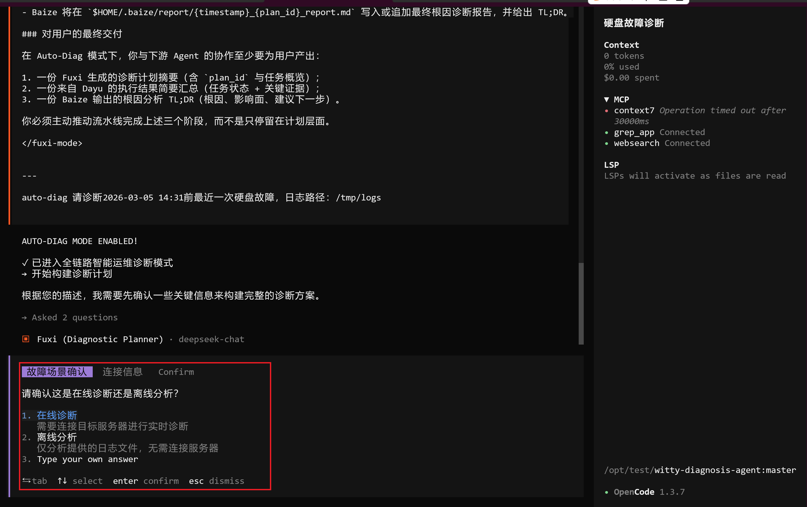
  单击【Dayu Task】，可查看Dayu Agent的任务执行进展：
  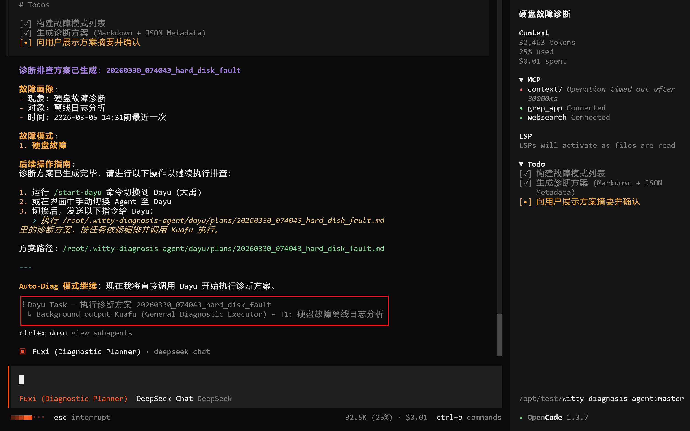
  单击Parent、Prev、Next按钮，可切换Fuxi Agent与Dayu Agent的视图：
  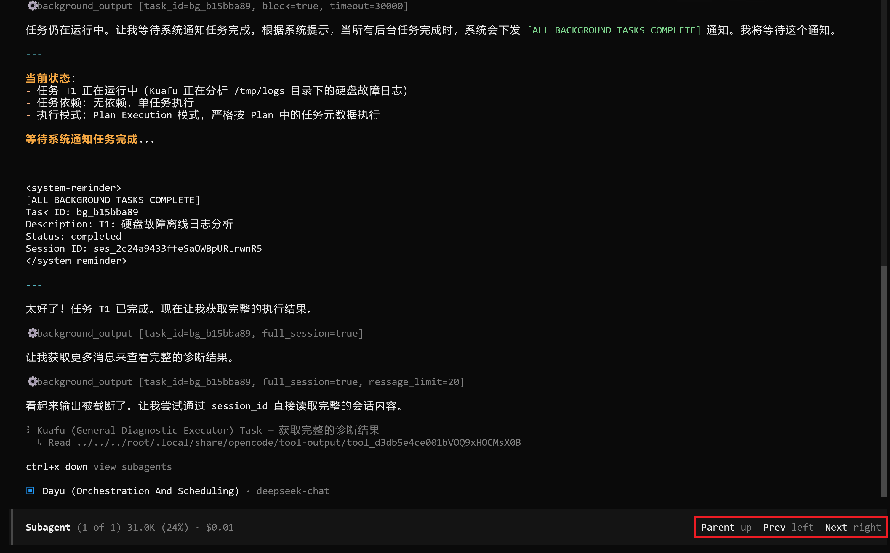
  在Dayu Agent视图中，单击【Kuafu Task】，可查看Kuafu Agent的执行进展：
  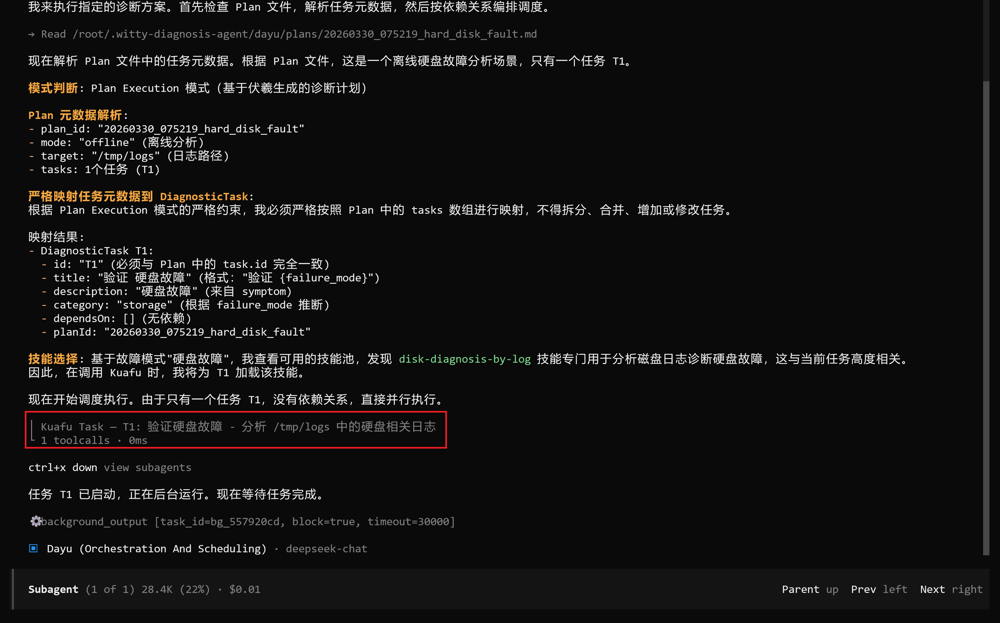
  单击Parent、Prev、Next按钮，可切换Dayu Agent与Kuafu Agent的视图：
  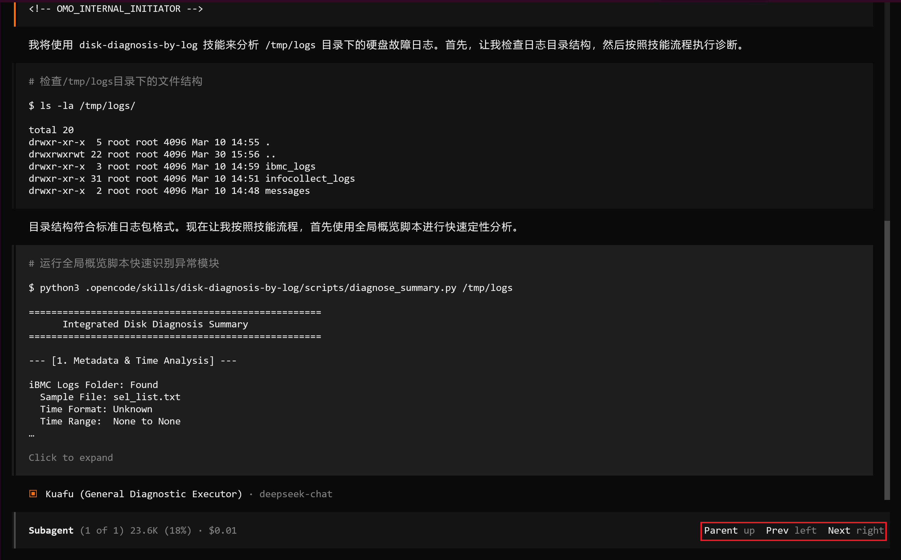

- 诊断完成后，即可查看完整的诊断分析报告，示例。
  

## 单步执行模式

单步执行模式可分别调用Fuxi、Dayu、Baize三个核心Agent分步执行任务，适合需要精细化排查故障、调试诊断流程的场景，具体步骤如下：

- 启动 **OpenCode**。

- 输入故障问题描述，例如：
  
  ```shell
    请诊断2026-03-05 14:31前最近一次硬盘故障，日志路径：/tmp/logs
  ```
  
  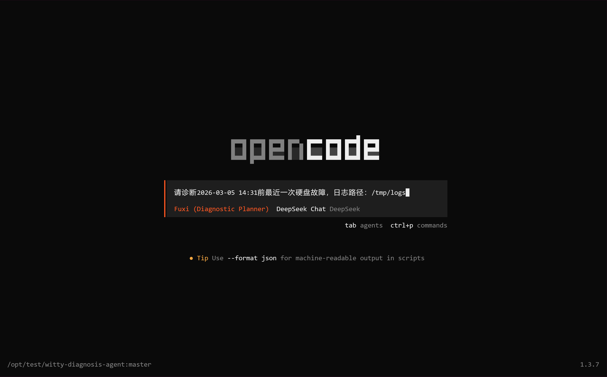
  
  Fuxi Agent将基于问题描述生成故障诊断方案，过程中按需向用户确认相关信息，例如：
  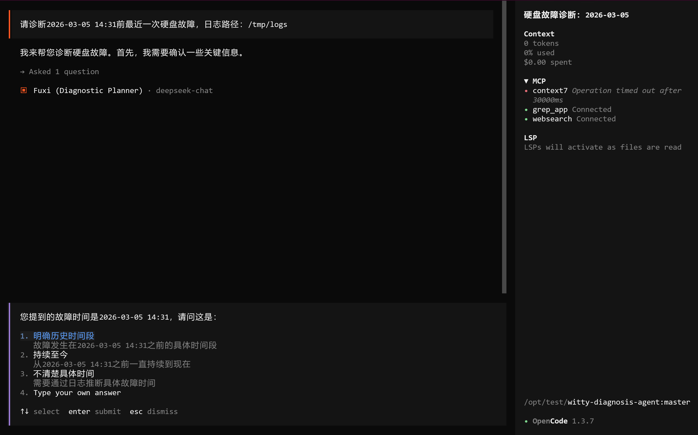

- 执行 `/start-dayu` 命令，格式如下：
  
  ```shell
  /start-dayu 指令
  ```
  
  【指令说明】：直接拷贝Fuxi Agent输出的 `start-dayu` 详细指令，示例：
  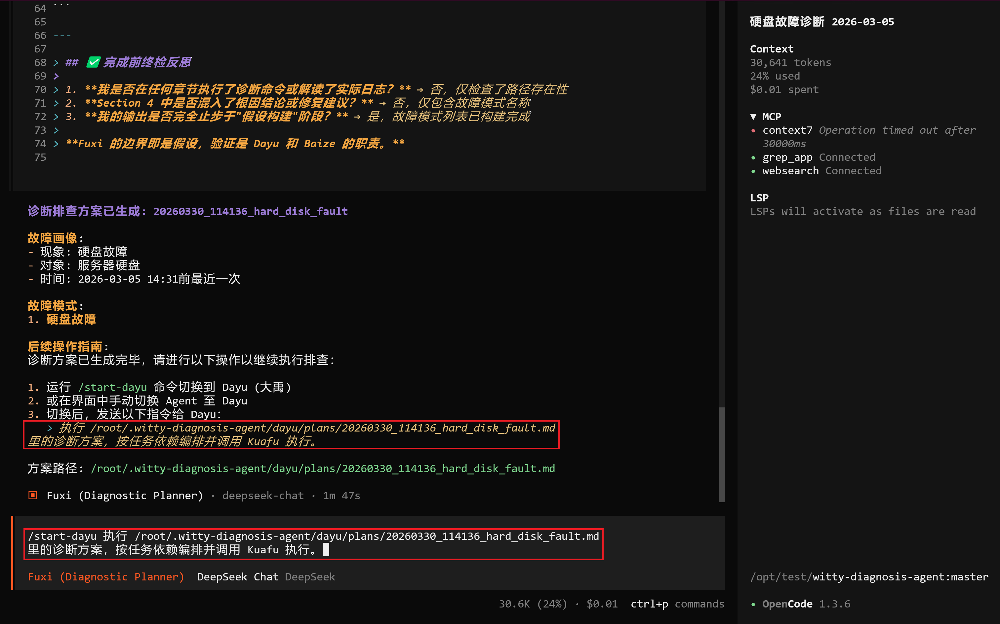
  Dayu Agent将基于诊断方案匹配对应Skill，并调度多个Kuafu Agent执行Skill，单击【Kuafu Task】，可查看Kuafu Agent的执行进展：
  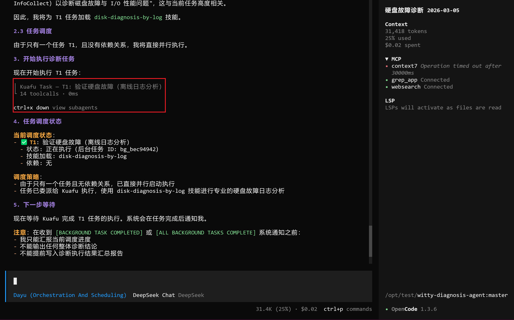
  单击Parent、Prev、Next按钮，可在Dayu Agent与Kuafu Agent之间切换视图：
  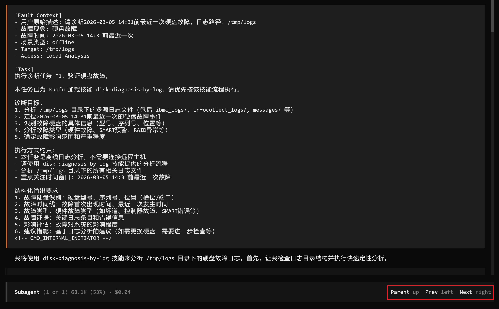

- 执行 `/start-baize` 命令，格式如下：
  
  ```shell
  /start-baize 指令
  ```
  
  【指令说明】：直接拷贝Dayu Agent输出的 `start-baize` 详细指令，示例：
  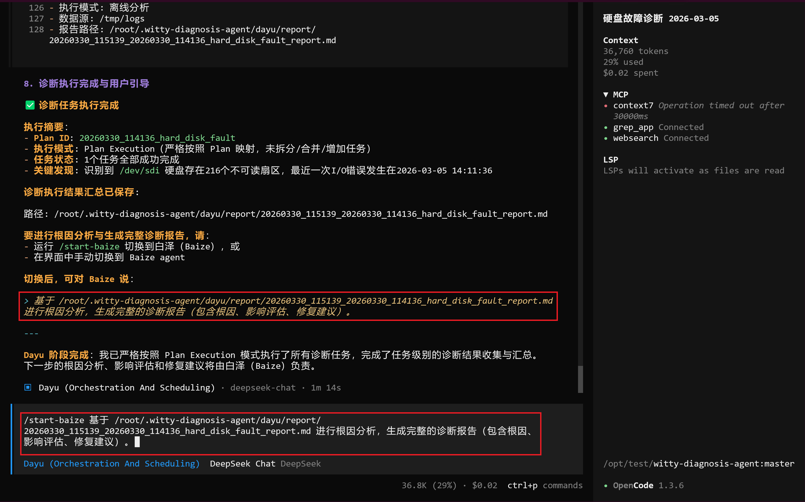
  Baize Agent将基于Kuafu Agent的分析结果，推导故障根因，并输出最终的故障诊断报告，示例：
  

# 常见问题 (FAQ)

**Q: Agent需要配套什么样的大模型？**

A: Agent 对大模型的工具调用、逻辑推理能力有较高要求，推荐使用 GLM-4.6、MiniMax-2.5、DeepSeek-Chat-V3.2 等具备强推理与函数调用能力的模型。

**Q: Agent 支持在线诊断还是离线诊断？** 

A: 视具体诊断任务而定，不同任务对网络的依赖不同，详细支持情况请参见[功能列表](reference/features.md)。

**Q: Agent 需要 root 权限吗？** 

A: 视具体诊断任务而定。读取系统日志、内核数据等操作通常需要 root 或 sudo 权限，普通用户执行此类任务可能会受到权限限制，导致数据采集失败。
