# Witty 智能诊断平台 · Web 端操作指南

> **适用版本**：v0.6.0+
> **访问地址**：`http://localhost:5173`（前端）/ `http://127.0.0.1:8787`（后端 API）

---

## 目录

- [一、服务启停](#一服务启停)
- [二、登录系统](#二登录系统)
- [三、创建诊断任务](#三创建诊断任务)
- [四、任务列表与筛选](#四任务列表与筛选)
- [五、任务详情与进度监控](#五任务详情与进度监控)
- [六、查看诊断报告](#六查看诊断报告)
- [七、任务操作：取消 / 重试 / 删除](#七任务操作取消--重试--删除)
- [八、常见问题排查](#八常见问题排查)

## 前置操作

首次使用前，需先安装项目依赖：

```bash
cd ~/witty-diagnosis-agent
bash install.sh
```

> `install.sh` 会安装项目全部依赖（包括 `@opencode-ai/sdk` 等核心包）。安装完成后即可启动服务。

默认启动为 **模拟诊断模式（mock）**。如需使用**真实诊断模式**，启动前编辑 `.env.example` 文件，将 `TASK_DRIVER=mock` 改为 `TASK_DRIVER=opencode`。


前置操作已完成（`bash install.sh`）后，启动服务：

```bash
cd ~/witty-diagnosis-agent/src/opencode/web
bash start.sh
```

`start.sh` 自动完成以下步骤：


| 步骤 | 说明                                     |
| ---- | ---------------------------------------- |
| 1/4  | 安装后端依赖（`npm install`）            |
| 2/4  | 初始化数据库（Knex migrate，幂等可重入） |
| 3/4  | 启动后端服务，监听**8787** 端口          |
| 4/4  | 启动前端开发服务器，监听**5173** 端口    |

启动成功后终端输出：

```
后端就绪：http://127.0.0.1:8787/api/health
```

> **默认账号**：`ops.zhang@demo.io` / `demo1234`（演示模式，点击「登录」即可）

### 1.2 环境变量


| 变量                       | 默认值 | 说明                                                                 |
| -------------------------- | ------ | -------------------------------------------------------------------- |
| `PORT`                     | `8787` | 后端 API 端口                                                        |
| `TASK_DRIVER`              | `mock` | 诊断模式：`mock` = 模拟诊断（默认，快速体验），`opencode` = 真实诊断 |
| `TASK_MODEL`               | （空） | opencode 使用的模型，留空走平台默认                                  |
| `SCHEDULER_MAX_CONCURRENT` | `4`    | 最大并发诊断任务数                                                   |

`.env` 文件中的 `TASK_DRIVER` 字段控制诊断模式：

- `TASK_DRIVER=mock`（默认）：模拟诊断，无需模型/opencode，快速体验全流程
- `TASK_DRIVER=opencode`：真实诊断，连接 opencode 驱动 xuanyuan 全链路

示例：切换到模拟诊断模式

```bash
TASK_DRIVER=mock bash start.sh
```

### 1.3 停止服务

在运行 `start.sh` 的终端按 **Ctrl+C** 即可同时停止前后端。

如需手动清理残留进程：

```bash
# 查找并关闭后端
lsof -ti:8787 | xargs kill 2>/dev/null

# 查找并关闭前端
lsof -ti:5173 | xargs kill 2>/dev/null
```

### 1.4 健康检查

```bash
curl http://127.0.0.1:8787/api/health
```

正常返回：

```json
{ "ok": true, "db": "sqlite" }
```

---

## 二、登录系统

### 2.1 访问首页

浏览器打开 **http://localhost:5173**，自动跳转至登录页面。

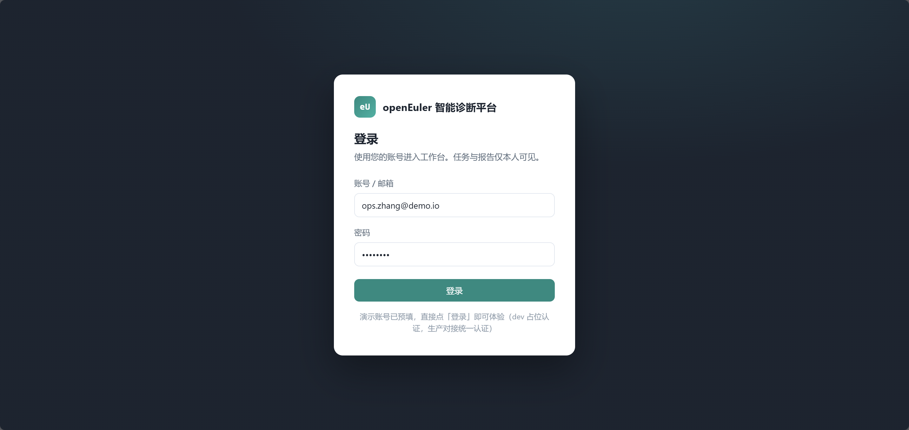

### 2.2 登录操作

1. **账号**：输入邮箱（演示模式已预填 `ops.zhang@demo.io`）
2. **密码**：输入密码（演示模式已预填 `demo1234`）
3. 点击 **「登录」** 按钮

> **说明**：当前为 dev 占位认证，生产环境将对接统一认证平台。任务与报告仅对登录用户本人可见，不同用户之间完全隔离。

登录成功后自动跳转至 **任务列表** 页面。

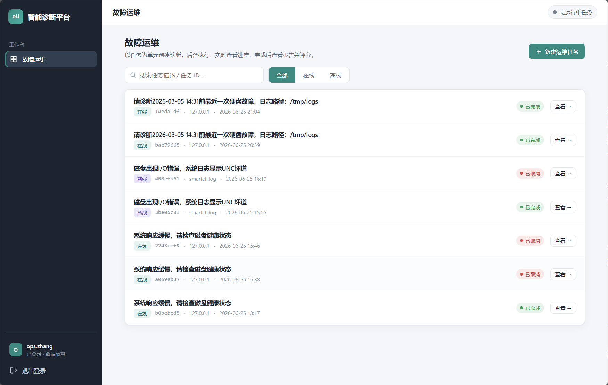

### 2.3 退出登录

侧边栏底部提供 **「退出登录」** 按钮：

1. 点击侧边栏底部的退出图标 + 「退出登录」文字
2. 系统清除当前会话，自动跳转回登录页面
3. 重新登录可查看自己的任务，不同用户之间完全隔离

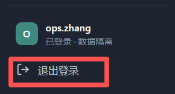

---

## 三、创建诊断任务

### 3.1 进入新建向导

在任务列表页面，点击 **「新建诊断」** 按钮，进入任务创建向导。

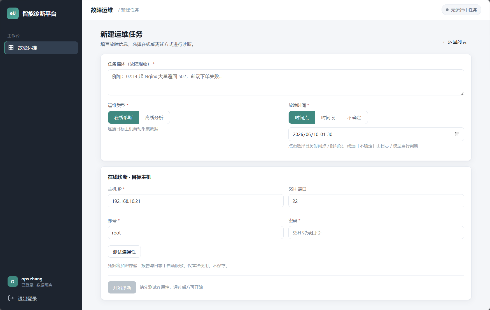

### 3.2 填写基本信息


| 字段         | 说明                                           | 必填 |
| ------------ | ---------------------------------------------- | :--: |
| **故障现象** | 简要描述本次故障（如"磁盘 IO 超时"）           |  ✅  |
| **故障时间** | 故障发生的精确时间（格式：`YYYY-MM-DD HH:mm`） |  ✅  |
| **诊断模式** | `在线诊断` 或 `离线分析`                       |  ✅  |

### 3.3 在线诊断模式

在线诊断通过 SSH 连接目标主机，自动采集系统日志和指标数据。

**填写步骤**：

1. **目标主机 IP**：填写远程服务器 IP 地址
2. **SSH 端口**：默认 `22`，按实际修改
3. **登录账号**：SSH 用户名（如 `root`）
4. **登录密码**：SSH 密码（内存加密存储，诊断结束自动擦除）
5. 点击 **「测试连通性」** 按钮

> **重要**：必须通过连通性测试后才能启动诊断。系统会验证 SSH 端口可达性 + 凭据有效性（基于 Ansible ping）。

**连通性测试结果**：


| 状态            | 含义                                           |
| --------------- | ---------------------------------------------- |
| ✅ 连通成功     | 可以开始诊断                                   |
| ❌ 连接失败     | 检查 IP / 端口 / 账号密码是否正确              |
| ❌ 端口未开放   | 目标主机 SSH 服务未启动或防火墙拦截            |
| ❌ 缺少 sshpass | **诊断主机**（运行 witty-diagnosis-agent 的机器）未安装 sshpass，执行：`sudo apt-get install sshpass` |

示例：

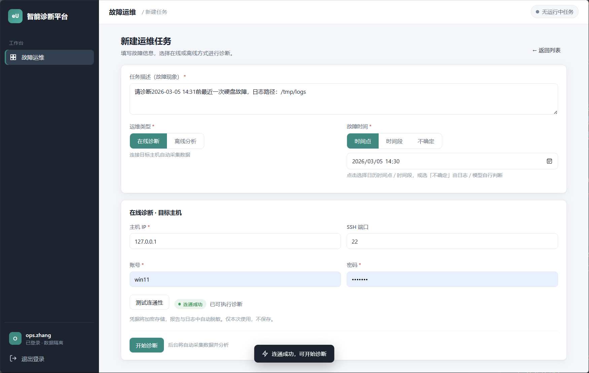

### 3.4 离线分析模式

离线分析基于已提供的日志文件进行诊断，无需 SSH 连接。

**两种日志提供方式**：

#### 方式一：上传日志文件

1. 选择「上传文件」选项
2. 点击文件选择框，选择一个或多个日志文件（支持 `.log`、`.txt`、`.zip` 等格式）
3. 文件自动上传，上传完成后显示文件名和大小

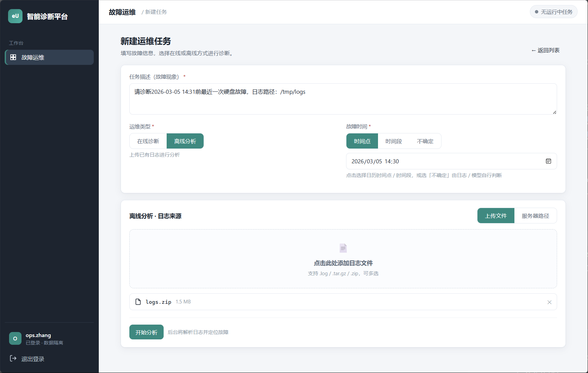

#### 方式二：指定服务器路径

1. 选择「服务器路径」选项
2. 在输入框中填写日志文件的**绝对路径**（如 `/tmp/logs`）
3. 多个路径用换行分隔

> **注意**：路径方式要求诊断服务有权限读取该路径。

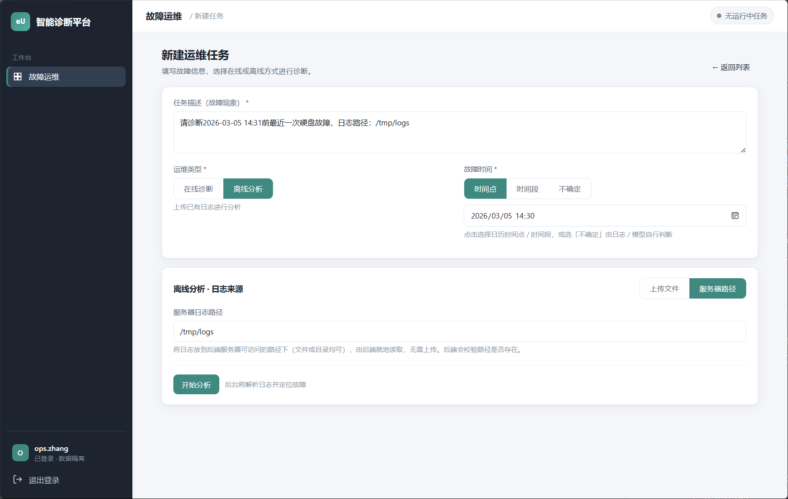

### 3.5 启动诊断

确认信息无误后，点击 **「开始诊断」**（在线）或 **「开始分析」**（离线）按钮。任务进入排队状态，系统自动调度执行。

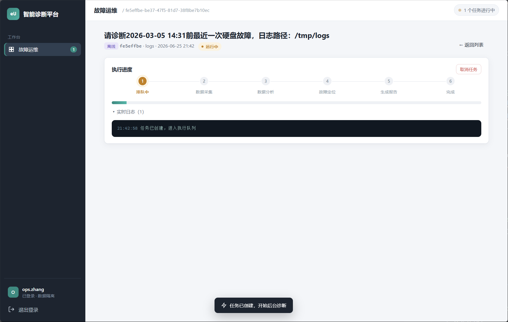

---

## 四、任务列表与筛选

### 4.1 任务列表概览

任务列表页面展示当前用户所有诊断任务的基本信息：


| 列           | 说明                                                      |
| ------------ | --------------------------------------------------------- |
| **标题**     | 任务名称（故障现象摘要）                                  |
| **模式**     | `在线` 或 `离线`                                          |
| **状态**     | 排队中 / 运行中 / 已完成 / 失败 / 已取消                  |
| **进度**     | 进度条 + 百分比                                           |
| **阶段**     | 当前执行阶段（数据采集 / 数据分析 / 故障定位 / 生成报告） |
| **创建时间** | 任务创建时间                                              |

### 4.2 任务筛选

列表顶部提供筛选选项：


| 筛选条件 | 说明               |
| -------- | ------------------ |
| **全部** | 显示所有任务       |
| **在线** | 仅显示在线诊断任务 |
| **离线** | 仅显示离线分析任务 |

### 4.3 任务状态说明

```
排队中 ──→ 运行中 ──→ 已完成
                │
                ├──→ 失败（可重试）
                │
                └──→ 已取消（可重试）
```


| 状态   | 图标 | 说明                         |
| ------ | ---- | ---------------------------- |
| 排队中 | ⏳   | 等待调度执行                 |
| 运行中 | 🔄   | Agent 正在执行诊断           |
| 已完成 | ✅   | 诊断成功，报告已生成         |
| 失败   | ❌   | 执行异常，可点击「重试」     |
| 已取消 | 🚫   | 用户主动取消，可点击「重试」 |

---

## 五、任务详情与进度监控

### 5.1 进入详情

在任务列表中点击任意任务行，进入任务详情页面。

### 5.2 进度阶段

诊断流程分为以下阶段，进度条实时更新：

```
┌──────────┬──────────┬──────────┬──────────┬──────────┐
│  排队中   │ 数据采集  │ 数据分析  │ 故障定位  │ 生成报告  │
│    0%    │   25%    │   55%    │   78%    │   92%    │
└──────────┴──────────┴──────────┴──────────┴──────────┘
                                                        ↓
                                                      完成 100%
```


| 阶段     | 说明                           | 进度 |
| -------- | ------------------------------ | ---- |
| 排队中   | 等待调度器分配资源             | 0%   |
| 数据采集 | Fuxi 规划 + Kuafu 采集系统日志 | 25%  |
| 数据分析 | Dayu 调度执行分析任务          | 55%  |
| 故障定位 | Baize 融合证据链，定位根因     | 78%  |
| 生成报告 | 生成可视化 RCA 报告            | 92%  |
| 完成     | 报告就绪，可查看               | 100% |

### 5.3 实时日志

详情页面下方的 **「执行日志」** 区域实时滚动显示诊断过程：

- 通过 **SSE（Server-Sent Events）** 实时推送
- 支持自动滚动到底部
- 切换页面后重连时自动同步快照，不丢失历史日志

### 5.4 进度保持

- 切换到其他页面后返回，进度自动恢复（通过 SSE snapshot 机制）
- 浏览器刷新后，首次加载即获取完整历史日志快照

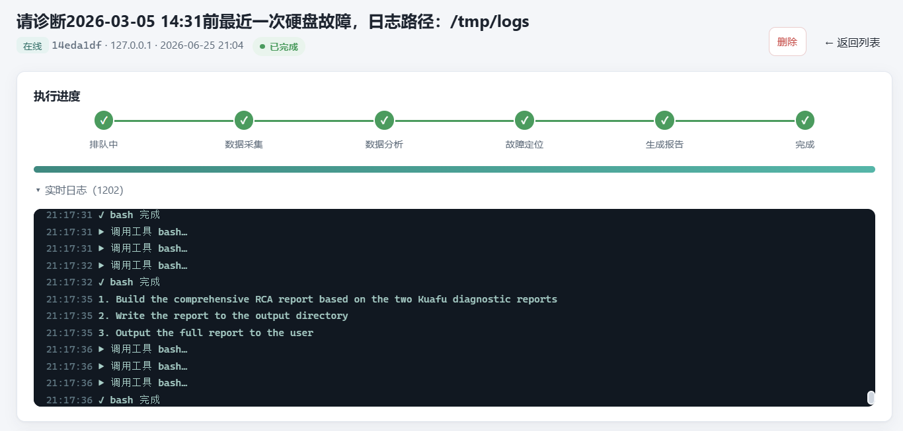

---

## 六、查看诊断报告

### 6.1 报告自动展示

诊断完成后，任务详情页**底部自动出现 HTML 诊断报告**，无需手动点击任何按钮。报告以嵌入式 HTML 渲染展示，支持交互操作。

### 6.2 报告内容结构

报告包含以下章节：


| 章节            | 内容                                   |
| --------------- | -------------------------------------- |
| 故障概述        | 故障现象、影响范围、故障时间           |
| 根因分析（RCA） | 证据链、SMART 数据、系统日志、根因结论 |
| 修复建议        | 紧急处置、长期预防                     |
| 附录            | 原始数据采集记录                       |

### 6.3 下载 HTML

点击报告区域的 **「下载 HTML」** 按钮，可将报告保存为本地 HTML 文件，离线查看。

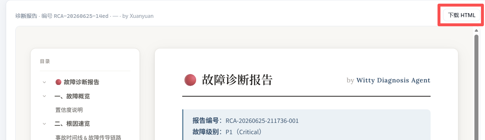

### 6.4 评分

报告底部提供评分功能：选择 **1-5 星**，可选填写备注后提交。


### 6.5 诊断报告示例

**磁盘故障诊断报告**：

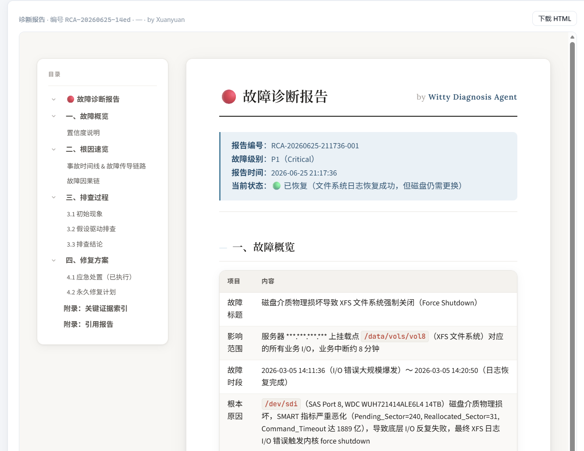

## 七、任务操作：取消 / 重试 / 删除

### 7.1 取消任务

**适用状态**：排队中、运行中

1. 在任务详情页，点击 **「取消任务」** 按钮
2. 系统立即终止诊断进程
3. 任务状态变为「已取消」

> **说明**：取消后立即释放端口资源，无需等待超时。

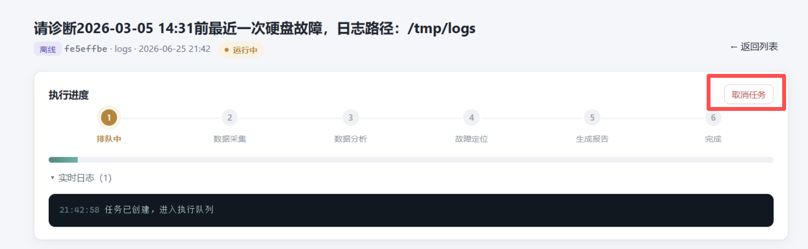

### 7.2 重试任务

**适用状态**：失败、已取消

1. 在任务详情页，点击 **「重试」** 按钮
2. 任务重新进入排队状态
3. **凭据自动复用**：在线诊断的 SSH 凭据从加密保险箱中恢复，无需重新填写

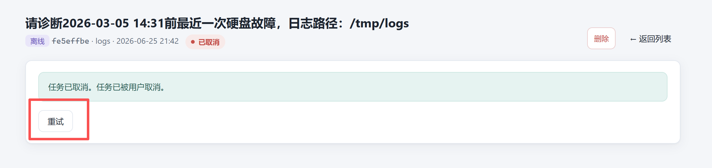

### 7.3 删除任务

**适用状态**：已完成、失败、已取消

1. 在任务详情页，点击 **「删除」** 按钮
2. 确认后永久删除任务及其关联数据

> **限制**：运行中的任务无法删除（返回 409 冲突），需先取消再删除。

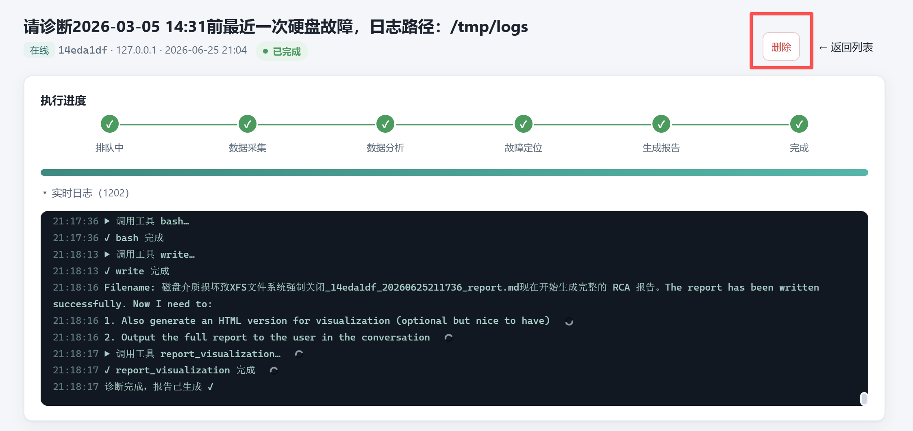
-------------------------------------------------

## 八、常见问题排查

### Q1：启动时报 "端口已被占用"

```bash
# 查找占用 8787 端口的进程
lsof -i:8787

# 关闭残留进程
lsof -ti:8787 | xargs kill
```

### Q2：连通性测试失败


| 错误信息       | 原因                    | 解决                           |
| -------------- | ----------------------- | ------------------------------ |
| SSH 端口未开放 | 目标主机未启动 SSH 服务 | 检查`sshd` 状态                |
| 无法解析主机名 | DNS 无法解析            | 使用 IP 地址而非域名           |
| 缺少 sshpass   | 诊断机未安装 sshpass    | `sudo apt-get install sshpass` |
| 认证失败       | 用户名或密码错误        | 核对凭据                       |

### Q3：诊断任务卡在"排队中"

- 检查 `SCHEDULER_MAX_CONCURRENT` 是否为 0
- 确认后端服务正常运行（健康检查通过）

### Q4：诊断失败，提示 "Insufficient Balance"

LLM API 额度不足。检查 opencode 平台的模型配额。

### Q5：页面切换后进度丢失

SSE 断线重连机制会自动恢复。如仍未恢复，刷新页面即可获取最新快照。

### Q6：在线诊断超时

默认启动看门狗 180s、任务超时由调度器控制。如目标主机网络延迟较高，可适当增大 `serverTimeoutMs` 配置。

### Q7：诊断失败，提示 "Cannot find package '@opencode-ai/sdk'"

**原因**：`@opencode-ai/sdk` 未安装。`TASK_DRIVER=opencode` 时会动态加载该包，但 web/server 目录下未安装此依赖。
**解决（二选一）**：

**方案一**：在项目根目录执行一键安装（会安装全部依赖）

```bash
cd ~/witty-diagnosis-agent
bash install.sh
```

**方案二**：单独安装 SDK 包

```bash
cd ~/witty-diagnosis-agent/src/opencode/web/server
npm install @opencode-ai/sdk
```

重新执行 `bash start.sh` 即可。
