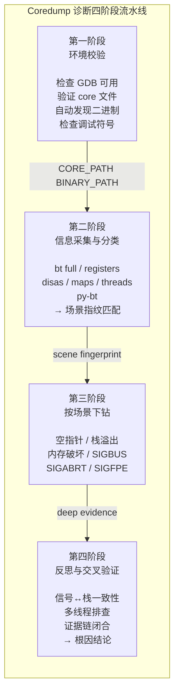

# 用户态 Coredump 诊断 Agent：当 AI 成为"侦探"

## 概述

核心业务进程突然崩溃，没有慢查询预警，没有 OOM 告警，日志里最后一行输出看起来完全正常。运维人员赶到控制台时，只看到一个几百 MB 的 core 文件躺在 `/var/crash/` 下——这是进程崩溃瞬间留下的"案发现场"。

核心业务进程的崩溃就像一桩没有目击者的案件：现场（core 文件）还在，但导致崩溃的那条执行路径已经消失了。没有监控告诉你崩溃前最后一秒发生了什么，没有日志告诉你哪个函数传入了错误参数，只有一堆寄存器值、一个调用栈、一段反汇编，等着被还原成完整的故事。

问题是：这桩"案件"的起因是什么？关键线索在哪里？如何从零零碎碎的现场信息中还原出完整的崩溃链条？

**Coredump Diagnose** 是 Witty 智能诊断 Agent 加载的一项核心技能，专门处理 Linux 用户态进程崩溃问题。当用户对 Agent 说"帮我看看这个 core，为什么进程崩了"时，Agent 加载这个 Skill，在数秒内完成从环境校验到根因定位的完整链路。

它与内核 VMcore 分析的最大区别在于：**用户态 coredump 的"肇事者"不一定是底层硬件或驱动，更多时候是开发者自己代码里的一行未做空指针检查的逻辑、一个没有验证的参数、或一条忘记释放的路径。** 这使得分析模式从"逆向取证"转向了"代码审计 + 运行时重建"。

本文从 Agent 的视角出发，拆解这个 Skill 的设计思想、执行流程和工程取舍。

## 一、背景：为什么进程崩溃诊断仍然困难？

### 1.1 问题的三个层级

一次进程崩溃（Segfault / Abort / Bus Error）看似简单——信号 + 地址 = 结论。但深入到诊断现场，你会发现三个难以逾越的层级：

**层级一：信息的不对称性。** core 文件是进程崩溃的"现场快照"，但快照只记录了崩溃瞬间的状态。你看到的是第 #0 帧的崩溃点，但真正的根因可能在 10 帧之前——一个指针在那时被赋了 NULL，直到第 #0 帧才被解引用。中间隔了 10 层调用栈、3 个函数库、毫秒级的执行时间。快照不会告诉你"崩溃过程"，只告诉你"崩溃结果"。

**层级二：场景的多样性。** 同样是 `SIGSEGV`，根因可能是空指针、栈溢出、堆越界、Use-After-Free……每种场景的排查路径截然不同。选错方向意味着浪费时间钻入死胡同。

**层级三：GDB 交互的高门槛。** 传统分析完全依赖工程师手动敲 GDB 命令：加载 core → `bt` → `frame` → `info locals` → `disas` → `info registers`……每一步都需要经验判断下一步该做什么。这就像医生做手术时不依赖监测设备，而是每测一个指标就退出手述室查看报告。

### 1.2 Agent 要解决的问题

传统人工分析的典型困境：

- 工程师敲了 20 个 GDB 命令，90% 在当前场景下是冗余的
- 分析完全依赖个人经验，"看起来像空指针"的直觉可能对，也可能错
- 排查耗时从 15 分钟到数小时不等，线上故障不等人
- 诊断报告的口语化和结构化程度完全取决于个人能力

Agent Skill 要解决的核心问题是：**把 GDB 专家排查 coredump 的方法论固化为一套可复用的自动化流程，让每个 Agent 实例都具备一致的、可追溯的诊断能力。**

## 二、设计思路：Agent 的"四阶段破案法"

### 2.1 核心架构：四阶段流水线

Coredump Diagnose 的整个设计围绕一个核心理念展开：**先验证工具可用，再采集现场证据，然后按场景深入挖掘，最后反思验证收敛结论。**

这个理念被编码为四个清晰的阶段：



**为什么这样设计？**

每个阶段都有明确的输入输出契约：

| 阶段 | 输入 | 输出 | 核心价值 |
|------|------|------|---------|
| 环境校验 | core 文件路径 | 验证通过的路径对 | 避免"工具不能用"导致后续全白做 |
| 信息采集 | core + binary | 全量 GDB 报告 + 场景标签 | 一次 GDB 加载解决所有通用采集 |
| 场景下钻 | 场景标签 + 已有日志 | 场景专项证据链 | 按场景精确挖掘，不放无关命令 |
| 反思验证 | 多场景证据 | 根因结论 + 置信度 | 避免单条证据定论 |

这个流水线的一个关键设计是：**第二阶段已经完成了 90% 的通用 GDB 数据采集，第三阶段只需要加载一次 core 执行场景特定命令。** 如果第三阶段的结论与第二阶段矛盾（比如第二阶段判定为空指针，但第三阶段发现 SIGSEGV 地址根本不是 0x0），第四阶段会标记冲突并降级置信度。

### 2.2 关键设计一：场景指纹自动分类

这是整个 Skill 最具特色的设计。在 `collect_and_classify.sh` 中，Agent 不是简单地把 GDB 输出扔给用户，而是做了一次**自动分类**：

```bash
# 从 GDB 采集日志中提取信号
SIGNAL=$(grep -m1 "Program terminated with signal" "$LOG" | sed 's/.*signal //' | sed 's/,.*//')

# SIGSEGV / SIGBUS 场景分类
if [[ "$SIGNAL" == "SIGSEGV" || "$SIGNAL" == "SIGBUS" ]]; then
    # 提取故障地址
    FAULT_ADDR=$(grep -m1 "Cannot access memory at address" "$LOG")
    # 判断是否为空指针
    if [[ "$FAULT_ADDR" == "(nil)" || "$FAULT_ADDR_LOWER" =~ ^0x0+$ ]]; then
        SCENARIO="nullptr"
    else
        # 计算主线程栈深，判断栈溢出
        STACK_DEPTH=$(awk '/^## \[2\]/{p=1} /^## \[3\]/{p=0} p && /^#[0-9]+/{c++} END{print c+0}' "$LOG")
        if [[ $STACK_DEPTH -gt 50 ]]; then
            SCENARIO="stack_overflow"
        else
            SCENARIO="memory_corrupt"
        fi
    fi
fi
```

**设计哲学：规则优先于概率。** Agent 不需要一个机器学习模型来判断故障类型。它只需要基于信号 + 故障地址 + 栈深度这三个确定性指标，就能将 7 种常见场景（空指针、栈溢出、内存破坏、SIGBUS、SIGABRT、SIGFPE、其他信号）准确分类。每条规则都有明确的 GDB 输出依据——"场景分类的推理路径是可追溯的"。

**但规则系统的局限也很明显：** 当 core 文件被截断、`$_siginfo` 不可用、或者故障地址解析失败时，分类的准确性会下降。为此，`collect_and_classify.sh` 设计了兜底机制——`classify_si_addr` 的 Python fallback：

```python
# 多路尝试解析故障地址
for _expr in ('$_siginfo.si_addr', '$_siginfo._sifields._sigfault.si_addr'):
    try:
        _si = gdb.parse_and_eval(_expr)
        break
    except Exception:
        continue
```

这种"多路尝试 + 兜底"的模式在整个 Skill 中随处可见，是设计者对"生产环境不完美"这个现实的清醒认知。

### 2.3 关键设计二：8 个脚本而非 1 个巨无霸

为什么是 8 个独立脚本（1 个前置检查 + 1 个采集分类 + 6 个场景分析），而不是一个大而全的脚本？

```text
coredump_diagnose/
├── SKILL.md                    # 技能描述 + 方法论文档
└── scripts/
    ├── pre_check.sh            # 环境校验
    ├── collect_and_classify.sh # 全量采集 + 场景分类
    ├── analyze_nullptr.sh      # 空指针专项
    ├── analyze_stack_overflow.sh  # 栈溢出专项
    ├── analyze_memory_corrupt.sh  # 内存破坏专项
    ├── analyze_sigbus.sh       # 总线错误专项
    ├── analyze_abort.sh        # 主动终止专项
    └── analyze_divzero.sh      # 除零专项
```

**设计考量：**

| 因素 | 单体脚本 | 多脚本拆分 |
|------|---------|-----------|
| 部署灵活性 | 必须全部拷贝 | 按需拷贝单脚本到隔离环境 |
| 执行效率 | 跑完所有场景命令 | 只跑匹配到的场景 |
| 可维护性 | 一个文件 1000+ 行 | 每个文件聚焦单一场景 |
| 输出冗余 | 90% 内容对当前场景无用 | 只输出当前场景需要的数据 |

**但多脚本的设计也带来了挑战：** 每个脚本都需要重复解析参数、创建日志目录、构建 GDB 临时脚本。这是"为灵活性付出的重复代价"——设计者选择了代码复用性稍低、但部署更灵活的方案。

### 2.4 关键设计三：GDB 脚本的"模板化"模式

每个分析脚本内部都遵循同一套 GDB 交互模式，这是 Skill 设计中最优雅的工程模式之一：

```bash
# 1. 创建临时 GDB 命令文件
GDB_CMD="$(mktemp)"

# 2. 写入带结构化的 GDB 命令
cat <<'GDBEOF' > "$GDB_CMD"
set pagination off
python import gdb; gdb.write('## [1] 完整调用栈\n')
bt full
python ... # 跳过信号桩帧，定位业务帧
list
info args
info locals
quit
GDBEOF

# 3. 单次执行
gdb --quiet --batch -x "$GDB_CMD" "$BINARY" "$COREFILE"

# 4. 清理
rm -f "$GDB_CMD"
```

**为什么选择 `-x` 临时脚本而不是 `--batch` stdin？**

这是一个来自实践的工程决策：在部分生产环境中，`gdb --batch` 从 stdin 读取命令的稳定性不可靠（尤其是在通过 SSH 远程执行或重定向嵌套时）。写入临时文件再通过 `-x` 执行，是经过踩坑后的稳健方案。

另外，所有日志标题都不是用 `echo` 或 shell 输出，而是用 **Python `gdb.write`** 在 GDB 会话内打印。这样做的原因是：**如果混合使用 shell echo 和 GDB 输出，在重定向到同一个日志文件时，shell 输出和 GDB 输出的顺序可能因缓冲策略不同而错乱。** 统一使用 `gdb.write` 保证了时序一致性。

### 2.5 关键设计四：Python 增强的"可选项"哲学

Skill 专门为 Python-C 混合栈程序设计了增强分析能力：

```python
try:
    gdb.write("--- 尝试获取 Python 调用栈 (py-bt) ---\n")
    gdb.execute("py-bt")
    gdb.write("\n--- 尝试获取 Python 局部变量 (py-locals) ---\n")
    gdb.execute("py-locals")
except Exception:
    gdb.write("[Python 栈不可用]\n")
    gdb.write("提示：若为 Python 进程，请安装 python3-dbg 或 python3-debuginfo\n")
```

注意这里的设计哲学：**尝试，失败，降级，但不要中断。** Python 增强是"可选项"——如果环境没有安装 `python3-dbg` 或 `python3-debuginfo`，Agent 并不会中断分析流程，而是记录"不可用"并提示用户安装。这保证了纯 C/C++ 进程的分析不会被 Python 相关代码阻塞。

## 三、实现原理：Agent 每一步在做什么

### 3.1 Step 1：环境校验——先确保"勘测工具"就绪

当 Agent 加载 Coredump Diagnose Skill 时，它做的第一件事是运行 `pre_check.sh`。这看起来简单，但包含了 4 个关键检查点：

```text
[1/4] 检查 GDB 是否安装... OK
[2/4] 检查 Core 文件... OK
[3/4] 自动发现二进制程序... 自动发现成功
[4/4] 检查调试信息... 已包含 (-g)
```

其中 **二进制自动发现** 是最有技术含量的步骤。Agent 使用了三路并行的策略：

1. **优先 `readelf -n`（最轻量）**：只读取 ELF 头附近的 PT_NOTE 段，通常可在毫秒级完成
2. **回退 `file` 命令（中等开销）**：通过 `file` 命令中的 `execfn` 字段提取路径
3. **大 core 的超时保护**：当 core 文件超过 256MB 时，`file` 命令可能长时间读盘，Agent 会先打印提示，并对 `file` 命令施加 120 秒超时

这个设计的微妙之处在于性能与可靠性的平衡。`readelf` 通常更快，但某些旧版本内核产生的 core 文件在 PT_NOTE 段中的记录不完整，此时需要 `file` 作为兜底。

### 3.2 Step 2：全量采集——一次加载解决所有通用问题

Agent 进入 `collect_and_classify.sh` 后，会构造一个包含 7 个单元的 GDB 临时脚本：

```text
## [1] 程序与信号信息
  信息: 进程与信号、退出原因，确认终止信号
  GDB: info program

## [1b] 故障地址 si_addr
  信息: 通过 $_siginfo 提取 SIGSEGV/SIGBUS 的 fault 地址
  GDB: python gdb.parse_and_eval(...)

## [2] 完整调用栈 (C 层)
  信息: 全栈帧、参数与局部变量
  GDB: bt full

## [3] 寄存器
  信息: 崩溃时通用寄存器与 PC
  GDB: info registers

## [4] 反汇编 (PC 附近)
  信息: 崩溃指令前后 60 字节的汇编
  GDB: disas $pc-20,$pc+40

## [5] 内存映射
  信息: 进程地址空间，判断访问地址是否合法
  GDB: info proc mappings

## [6] 线程信息
  信息: 各线程状态与回溯
  GDB: info threads; thread apply all bt

## [7] Python 层增强 (可选)
  信息: py-bt / py-locals（需 python3-dbg）
  GDB: python try: gdb.execute("py-bt") ...
```

**设计意图：一次加载、一次退出，不反复读取数 GB 的 core 文件。** 这些 7 个信息块足以覆盖绝大多数通用排查需求。后续的专项分析脚本虽然也会再次加载 core，但执行的命令更有针对性。

### 3.3 Step 3：场景分类——确定"侦探方向"

采集完成后，Agent 会立即执行场景分类逻辑。分类器使用的是一个**确定性规则链**，而不是概率模型：

```text
信号 = SIGSEGV?
  ├── 故障地址为 0x0? → 空指针场景
  └── 故障地址非 0x0?
      ├── 栈深度 > 50? → 栈溢出场景
      └── 栈深度 ≤ 50? → 内存破坏/野指针/越界场景
  
信号 = SIGBUS?
  └── 排除空指针和深栈 → 总线错误场景

信号 = SIGABRT?
  └── 程序主动终止（堆破坏/C++异常/断言）

信号 = SIGFPE?
  └── 算术异常（除零/取模）

信号 = 其他? → 少见信号，无专项脚本
```

**为什么 SIGBUS 要独立于 SIGSEGV 分类？**

SIGBUS 的诊断路径与 SIGSEGV 截然不同。SIGSEGV 通常是"访问了不该访问的地址"，诊断焦点在指针值和生命周期；SIGBUS 则是"CPU/内核拒绝了一次访存请求"，诊断焦点在内存对齐、mmap 映射后端、磁盘空间。将两者归为同一分析路径会导致方向性错误——这在 SKILL.md 中被反复强调。

### 3.4 Step 4：场景下钻——每个场景的"专属侦查工具"

#### 场景 1：空指针访问（最频繁的场景）

Agent 的空指针分析脚本做了两件关键事：

**第一件事：跳过信号桩帧，找到真正的业务代码帧。**

这是一个技术细节但极其重要。当进程因为 SIGSEGV 崩溃时，调用栈的顶部往往是 `<signal handler called>`、`__GI_raise`、`pthread_kill` 等 libc 信号递送帧。如果 Agent 直接停在 frame 0，它看到的只是信号处理代码，而不是真正出错的业务代码。

```python
fi = gdb.newest_frame()
lvl = 0
while fi:
    skip = (
        sigtramp
        or n == "<signal handler called>"
        or "pthread_kill" in n
        or "__GI_raise" in n
    )
    if not skip:
        break
    fi = fi.older()
    lvl += 1
# 此时 fi 指向了第一帧业务代码
```

**第二件事：结合反汇编区分读操作还是写操作。**

同样是空指针，读（`mov rax, [rdi]` 而 rdi=0）和写（`mov [rdi], rax` 而 rdi=0）的根因分析方向不同。读通常是返回值未检查就被使用，写通常是结构体成员赋值时指针未初始化。

Agent 产出的是类似这样的结构化信息：

```text
【分析 Checklist】
1. 确认空指针的名称和来源（参数/局部变量/全局变量）
2. 确认是读操作还是写操作触发的崩溃
3. 回溯指针的赋值路径，找到未初始化/置空的原因
```

#### 场景 2：内存破坏/野指针

这是最难分析的一类场景。Agent 的核心方法论是：

```text
内存破坏通常是"结果"，而不是"原因"
→ 重点关注崩溃前最近的内存写入操作
→ 区分合法区域内的非法访问 vs 完全野地址
→ 对 x86_64 的参数寄存器做内容转储判断
```

`analyze_memory_corrupt.sh` 中的三个独特设计：

1. **关键寄存器内容转储**：对 RDI/RSI/RDX（x86_64 前三个参数寄存器），只有当值落在 `0x100000 ~ 0x800000000000` 区间时才做 `x/32gx` 转储。小整数值（如 tid、fd）被过滤掉，避免无意义的输出。

2. **带机器码的反汇编**：`disas /r $pc-50,$pc+50` 除了显示汇编助记符，还显示对应的机器码字节。这帮助 Agent 确认具体是哪个操作数触发了访问异常。

3. **崩溃地址 vs 映射表对比**：崩溃地址落在堆区、栈区、映射库还是未映射区，决定了根因方向的不同。

#### 场景 3：SIGBUS 总线错误

SIGBUS 是 Agent 独立建模的场景，与 SIGSEGV 区别对待。Agent 的分析路径：

```text
SIGBUS 诊断三问：
1. 运行架构是什么？ARM 等架构有严格对齐要求
2. 崩溃地址是否落在文件映射区？mmap 的文件是否可能被截断？
3. 磁盘空间是否可能耗尽？
```

注意与 SIGSEGV 分析的区别：SIGBUS 的排查更关注**架构特性**和**文件系统状态**，而不是指针生命周期。这与 SIGSEGV 的诊断方向完全不同。

#### 场景 4：SIGABRT（程序主动终止）

`analyze_abort.sh` 的设计者预判了三种典型子路径：

```text
调用栈特征 → 判定路径
├── 含 malloc_printerr / __libc_message → 堆破坏（Double Free / Corruption）
├── 含 __cxa_throw → C++ 未捕获异常
└── 含 __GI_abort → 显式 abort() / 断言失败
```

Agent 还会尝试打印 C++ 异常类型名（如果存在）：

```python
try:
    gdb.execute("print *(char*)__cxa_current_exception_type()->name()")
except Exception:
    gdb.write("[无法获取C++异常类型]\n")
```

但这里有一个关键的局限性：**堆破坏的"案发时间"通常早于崩溃时间。** Agent 能定位到哪个函数调用了 `malloc_printerr`，但无法告诉你"谁在上一次操作中写坏了堆头"。这需要开发者对照源码审查最近的分配释放操作。

#### 场景 5：SIGFPE（除零）

这是最"简单"的场景——Agent 只需要定位 `div/idiv` 指令，确认除数是否为 0，然后向上追踪 0 的来源。但简单的场景背后有一个 Agent 无法解决的根本问题：**0 是计算得出的，还是外部参数传入的？** 这需要开发者根据上下文判断。

### 3.5 Step 5：反思与交叉验证——Agent 的"自我质疑"

这是整个流程中最**关键但最容易跳过**的步骤。Agent 在产出结论之前，会做四件事：

1. **区分症状、机制、根因**：
   - 症状：SIGSEGV @ 0x0（现象）
   - 机制：`mov rax, [rdx]` 而 rdx=0（指令级）
   - 根因：函数返回值为 NULL 但未检查（代码级）

2. **质疑当前场景**：看似野指针，是否实为截断后的空指针？SIGABRT 是否为 OOM 导致的？"不要相信第一直觉"是这个阶段的执行原则。

3. **信号与栈的一致性检查**：SIGSEGV 的故障地址是否与 `info proc mappings` 一致？SIGBUS 是否真的与未对齐访问 / 映射截断一致？

4. **多线程排查**：`thread apply all bt` 是否暴露了单线程假设之外的线索？

Agent 在反思中不做的一件事是**输出没有依据的猜测**。它会显式列出"待补证据"——符号包、复现条件、同版本二进制——让用户知道结论的置信边界在哪里。

### 3.6 统一结论模板

所有分析完成后，Agent 输出一个结构化的根因分析结论：

```markdown
## 用户态 Coredump 根因分析结论

### 1) 基本信息
- 崩溃进程：<名称>
- Core 文件：<路径>
- 分析二进制：<路径>
- 报告日志：<绝对路径>

### 2) 崩溃事件链
- C0：加载/启动/输入
- C1：首次异常条件，如空指针解引用
- C2：信号与现场，如 SIGSEGV @ 0x0
- C3：若涉及库/线程，扩大影响或二次失败

### 3) 根因链
- 直接原因：如对空指针解引用
- 中间机制：如未校验返回值即解引用
- 深层原因：如错误分支未覆盖
- 触发条件：输入/配置/竞态/特定构建

### 4) 证据清单
- 支持证据：GDB 日志片段，信号、Frame 0、地址
- 反证与排除：已排除场景 + 理由

### 5) 结论置信度
- 置信等级：高/中/低
- 置信依据：符号是否齐全、是否可复现

### 6) 修复与预防
- 即时修复：代码/配置层建议
- 长期治理：静态检查、Review 点、测试用例
- 验证方式：如何验证修复有效
```

这个模板的设计核心在于**区分了"崩溃事件链"和"根因链"**——前者是"发生了什么"，后者是"为什么发生"。这种二分法防止 Agent 把症状直接写为根因。

## 四、权衡之道

### 4.1 一次加载 vs 多次加载

Agent 的执行策略是：collect 阶段一次加载 core，analyze 阶段每个脚本又一次加载。为什么不把所有数据在 collect 阶段就采集完？

分析脚本确实会采集更多场景特定数据（如空指针场景的 `info args/locals`、内存破坏场景的参数寄存器内容转储）。将这些数据放到 collect 阶段采集，意味着无论什么场景都执行所有场景的专项命令——90% 是冗余的。

**答案是：按需加载。** 这在 core 文件特别大（数 GB）时有显著的性能优势。

### 4.2 确定性规则 vs 机器学习

为什么不训练一个 ML 模型来分类故障场景？Agent 选择规则系统的理由：

| 方面 | 确定性规则 | 机器学习 |
|------|-----------|---------|
| 可追溯性 | 每个分类都有明确的 GDB 证据 | "模型认为概率 0.94"不可解释 |
| 错误成本 | 分类错误可定位到具体规则缺陷 | 需要重新训练和部署 |
| 数据依赖 | 不需要标注数据 | 需要大量已标注的崩溃样本 |
| 覆盖范围 | 7 类常见场景精确覆盖 | 理论上覆盖更广但边界不确定 |

但规则系统的本质局限是：**它只能覆盖设计者预见到的场景。** 对于罕见的故障模式（如 SIGXCPU、SIGSYS），Agent 没有专项脚本，只能输出通用日志供人工分析。

### 4.3 结构化 vs 灵活性

每个分析脚本输出的是统一的 GDB 数据块，但这意味着什么？

**优势**：日志结构一致，Agent 可以写出通用的解析逻辑，开发者可以快速定位到所需信息。
**劣势**：过度结构化可能丢失灵活分析的空间。比如 `analyze_nullptr.sh` 固定输出 6 个信息块，但如果某个 case 需要在 frame 2 而非 frame 0 检查 `info locals`，Agent 需要额外代码来支持——目前这个检查主要依靠用户手动查看日志。

### 4.4 内置方法论 vs 外部知识

每个脚本末尾的"人工分析 Checklist"是一个有趣的设计选择。它们不是给 Agent 看的（Agent 已经执行了全部命令），而是给**阅读报告的人**看的。

```text
【人工分析 Checklist】
1. 查看日志，是否有某个函数在调用栈中反复出现（递归）
2. 检查栈顶函数的局部变量，是否有超过KB级的大数组/结构体
3. 确认是否存在数组越界写入的逻辑
```

**这实质上是一种"人机协作"的设计：Agent 做它能做的（自动化 GDB 命令执行 + 数据采集），但把需要业务上下文判断的部分（"这个 0 是计算来的还是传入的"）留给开发者。** 这不是能力的缺失，而是对"AI Agent 能力边界"的清醒认识——没有业务上下文，任何 Agent 都无法判断"这个值设为 0 是合理的业务逻辑还是一个 Bug"。

## 五、用户视角：如何在实战中使用

### 5.1 一句话触发完整诊断

当用户说"帮我看看这个 core 文件为什么崩了"时，Agent 内部发生的是：

1. **参数识别**：从对话中提取 core 文件路径
2. **加载 Skill**：加载 coredump_diagnose 技能
3. **Stage 1 环境校验**：`bash scripts/pre_check.sh --core <path>`
4. **Stage 2 采集+分类**：`bash scripts/collect_and_classify.sh --core <path> --binary <path>`
5. **Stage 3 场景下钻**：根据分类结果自动执行对应 `analyze_*.sh`
6. **Stage 4 反思验证**：构建根因链，输出结构化报告
7. **报告输出**：在终端打印报告路径，供用户查阅

### 5.2 手动分步执行

如果用户想手动跟进每一步（或者 Agent 需要分步展示），也可以按顺序执行：

```bash
# 第一步：环境校验
bash scripts/pre_check.sh --core /path/to/core
# 输出：CORE_PATH="..."  BINARY_PATH="..."

# 第二步：信息采集与分类
bash scripts/collect_and_classify.sh --core "<CORE_PATH>" --binary "<BINARY_PATH>"
# 输出：场景分类 + 报告日志路径

# 第三步：场景下钻（根据分类结果选择）
bash scripts/analyze_nullptr.sh --core "<CORE_PATH>" --binary "<BINARY_PATH>"
# 或
bash scripts/analyze_memory_corrupt.sh --core "<CORE_PATH>" --binary "<BINARY_PATH>"
# 或 ...
```

### 5.3 典型输出结构

Agent 产出两份日志：

- **collect_and_classify_<时间戳>.log**：全量 GDB 数据 + 场景分类摘要
- **analyze_<场景>_<时间戳>.log**：场景专项分析数据 + 分析方法论 + 人工分析 Checklist

两份日志统一输出到 `/tmp/core_diag/` 目录，路径在终端打印。Agent 在最终结论中会引用这两个日志中的具体证据。

### 5.4 适用边界

Agent 会告诉你它能做什么，也会告诉你不该做什么：

- **用户态 coredump**：本技能只针对用户态进程崩溃。内核崩溃（Panic / Oops）请使用 vmcore-analysis Skill
- **GDB 依赖**：环境中必须已安装 GNU gdb
- **Python 增强**：对 Python-C 混合栈程序，需要 `python3-dbg` / `python3-debuginfo` 才能获取 Python 层调用栈
- **无符号降级**：如果二进制没有 `-g` 调试信息，行号和源码上下文不可用，Agent 会在报告中标注"无调试符号，结论置信度降级"

## 六、总结

Coredump Diagnose Skill 的设计体现了几个核心工程理念：

**1. 四阶段流水线构造了清晰的推理路径。** 校验→采集→下钻→反思，每个阶段都有明确的输入输出，互不越界。这使得 Agent 的推理过程可追溯、可审计——"为什么得出这个结论"可以精确到具体阶段和具体证据。

**2. 确定性规则优于概率模型。** 7 种场景、8 条分类规则，每条都有明确的 GDB 依据。Agent 不需要"猜"故障类型，它基于信号、地址、栈深度这三个确定性指标做出判断——可解释、可验证、可改进。

**3. 人机协作的务实设计。** Agent 自动化执行 GDB 命令、采集数据、分类场景，但把"需要业务上下文判断"的部分通过 Checklist 方式留给开发者。这既不是"全自动"也不是"全手工"，而是"Agent 做它擅长的事，人做人擅长的事"。

**4. 降级但不停止。** 环境没有调试符号 → 降级行号不可用。没有 Python 增强 → 跳过 py-bt，继续分析 C 层栈。core 被截断 → 部分信息不可用，但已有的证据仍然可以被分析。Agent 不会因为某个环节的缺失就拒绝服务——它在信息不完全的条件下给出"我能力范围内最好的结论"。

**5. 报告模板设计区分了"症状"和"根因"。** 崩溃事件链记录"发生了什么"，根因链解释"为什么发生"。这种二分法防止了 Agent 最容易犯的错误：把症状写为根因。

最后，这个 Skill 的设计反映了一个更广泛的趋势：**AI Agent 与底层系统调试能力的深度融合。** 它把 GDB 专家排查 coredump 的方法论——先验工具、再采证据、按场景深挖、反思验证——固化为 Agent 可执行的技能。每一次 Agent 加载这个 Skill 诊断一个 core 文件，本质上都是一次"资深工程师的诊断经验在 AI 代理上的实例化"。
