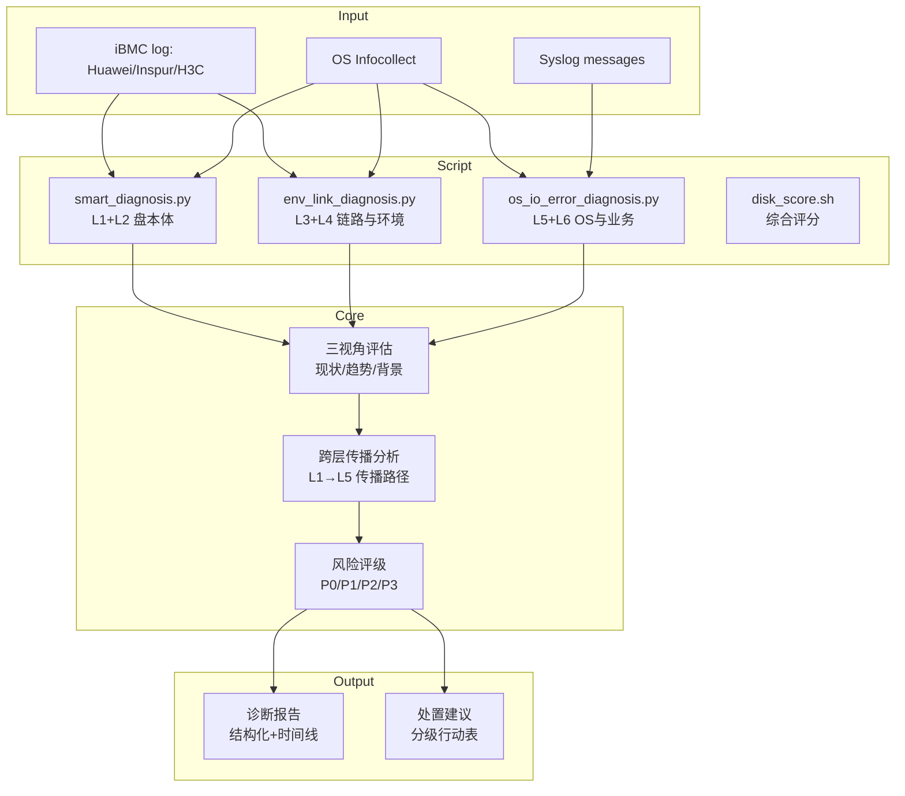
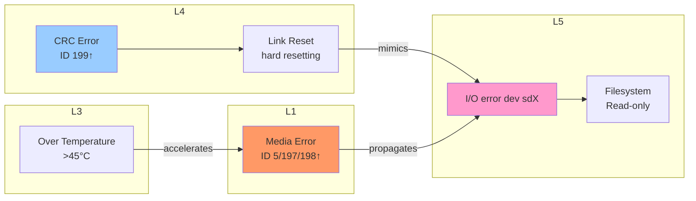
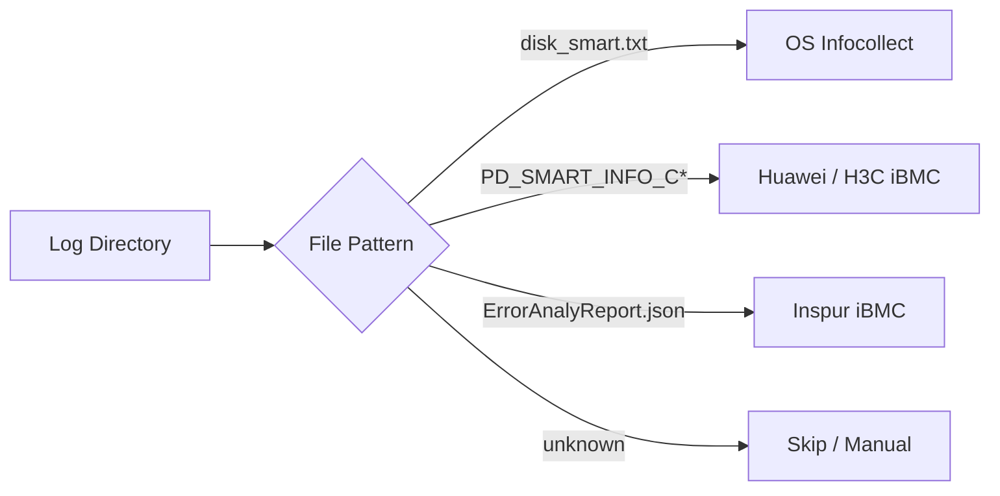

# 磁盘健康全栈诊断：一个 AI Agent 的六层穿透式故障预测方法论

## 概述

磁盘故障是数据中心最常见、破坏性最大的硬件故障之一。传统的磁盘监控往往停留在"SMART 指标告警 → 人工上机排查"的被动模式，等到告警触发时数据损坏可能已经发生。而 Witty 诊断 Agent 内置的磁盘健康诊断技能，采用了一种截然不同的思路——**不是等磁盘"坏掉"，而是预测它"正在走向坏掉"的路径和速度**。

本文将从 Agent 的视角，深入拆解这套 L1-L6 六层分层检测体系的架构设计、实现原理与设计权衡。

## 背景

### 痛点分析

在 Agent 实际的诊断工作中，我们面对的是一个残酷的现实：磁盘故障从来不是一个"二值问题"（好 vs 坏），而是一个**渐进式的熵增过程**。一块磁盘从健康到彻底故障，中间可能经历数月甚至数年的劣化期。然而，传统监控体系存在三个系统性缺陷：

1. **单层视角局限**：只盯着 SMART 指标看，忽略了链路抖动（L4）、温度异常（L3）等上游因素，导致"换盘后故障依旧"的尴尬局面
2. **缺乏趋势意识**：只看当前值不看变化率，无法区分"长期稳定的历史瑕疵"和"正在加速劣化的活跃病灶"
3. **诊断链路断裂**：硬盘、RAID 卡、操作系统、业务层的日志彼此孤立，Agent 需要手动跨系统关联信息，效率极低

### 设计目标

基于上述痛点，这套技能的设计目标可以概括为：

- **预测先行**：在故障造成业务影响之前发出预警，而非事后止损
- **分层穿透**：从介质层到业务层，六层指标交叉验证，杜绝误判
- **趋势驱动**：不仅看"当前值"，更要看"变化率"，识别加速劣化的盘
- **厂商无关**：统一华为/H3C/浪潮 iBMC 和 OS Infocollect 四种日志场景的诊断逻辑

## 设计解决方案

### 整体架构

整套诊断技能以 **L1-L6 六层检测模型**为骨架，以三视角预测法（现状 + 趋势 + 背景）为推理引擎，以自动化脚本管线为执行层：



### 六层检测体系详解

六层模型是整个诊断方法论的核心骨架。越往下越接近介质本身，越往上越接近业务影响：

| 层级 | 名称 | 检测目标 | 典型指标 |
|:---:|:---|:---|:---|
| L6 | 业务与存储服务层 | 感知故障对业务的实际影响 | OSD 退出(51001)、IO 阻塞(51036) |
| L5 | 文件系统与 OS 层 | 操作系统可见的 IO 错误 | I/O error、EXT4/XFS 报错、文件系统只读 |
| L4 | 控制器与链路层 | 区分"真盘坏"与"假盘坏" | CRC 错误(ID 199)、链路重置、RAID 降级 |
| L3 | 槽位与环境层 | 排除散热/供电导致的非盘本体问题 | 温度超限、电源丢失、风扇故障 |
| L2 | 寿命与负载层 | 评估老化背景风险 | 上电时间、启停次数、IO 利用率 |
| L1 | 盘本体 SMART 层 | 直接判断介质物理损伤 | Reallocated Sectors(5)、Pending(197)、Uncorrectable(198) |

设计这套六层模型的根本原因在于：**磁盘故障很少是孤立的"盘自己坏了"**。在实际诊断中，Agent 发现大量案例是链路抖动（L4）被误判为磁盘故障，或者高温（L3）加速了介质劣化。没有分层视角，就没办法做归因分析。

### 为什么选择"三视角预测"而非"单点阈值"

传统的 SMART 监控完全是阈值驱动的——当 Reallocated_Sector_Ct > N 时告警。这种方法简单但有两个致命缺陷：

1. **阈值难以通用**：不同厂商、不同型号的盘，正常基线差异巨大
2. **没有时间维度**：一块"ID 5 = 100但已稳定三年"的盘和一块"ID 5 从 0 暴涨到 100"的盘，风险完全不同

因此，Agent 的评估模型采用了**三维交叉验证**：

```text
┌─ 现状（Status） ───────────────────────────┐
│  当前 SMART 值是否已超厂商阈值？            │
│  WHEN_FAILED 是否已经是 FAILING_NOW？       │
└────────────────────────────────────────────┘
                          +
┌─ 趋势（Trend） ────────────────────────────┐
│  关键指标 14 天差分是否为正？               │
│  劣化速率在加速还是减速？                   │
└────────────────────────────────────────────┘
                          +
┌─ 背景（Context） ──────────────────────────┐
│  通电时间是否 > 5 年（高故障期）？          │
│  环境温度是否持续偏高？                     │
│  该槽位历史故障率是否异常？                 │
└────────────────────────────────────────────┘
```

这三个维度在 `evaluate_disk()` 函数中被显式编码为多级判断逻辑：

```python
def evaluate_disk(disk):
    level = 'P3'  # 默认背景风险
    # 1. 现状维度：ID 198 > 0 直接判 P0
    if '198' in metrics and metrics['198']['raw'] > 0:
        level = 'P0'
    # 2. 现状+趋势：ID 197 > 0 且持续增长则升级
    if '197' in metrics and metrics['197']['raw'] > 0:
        level = 'P1' if raw < 50 else 'P0'
    # 3. 背景维度：上电时间 > 50000h 增加背景风险
    if '9' in metrics and metrics['9']['raw'] > 50000:
        level = 'P3'
```

### 跨层故障传播模型

这是整套方法论中最具洞察力的部分。Agent 在诊断时需要回答一个核心问题：**如果我观察到 L5 的 IO 错误，根因在 L1（盘坏了）还是 L4（链路问题）？**

答案藏在多层指标的交叉验证中：



Agent 在实际诊断中经常遇到的典型案例是：

**假盘坏案例**：L4 链路 CRC 错误高 → L5 大量 I/O error → 运维误判为坏盘换盘 → 换盘后问题依旧。真相是线缆老化或背板接触不良。判别关键：检查 L1 介质指标是否正常，同时 L4 CRC 是否异常增高。

**真盘坏案例**：L3 高温 → L1 介质坏道增长 → L5 I/O error → 文件系统只读。判别关键：L1 的 ID 198 (Offline_Uncorrectable) > 0，这是不可逆的物理损伤。

### 多厂商 iBMC 适配策略

在真实的数据中心环境中，Agent 面对的是多厂商混部的局面。华为、H3C、浪潮的 iBMC 日志格式各不相同，甚至有些厂商（如浪潮）根本不导出 SMART 数据。

技能通过 `determine_scenario()` 函数自动检测日志场景：



这种设计的核心思路是**利用文件指纹自动识别场景**，而非要求用户手动指定。其优势在于：

1. **降低使用门槛**：用户只需要提供日志根目录
2. **统一诊断接口**：无论哪种场景，输出格式一致
3. **平滑降级**：遇到不支持的场景（如浪潮 iBMC 无 SMART），明确告知用户降级方案

## 实现原理

### 自动化诊断管线

Agent 诊断磁盘健康时，遵循一条固定的管线：

```text
输入：日志路径
  │
  ▼
Step 1: 场景识别
  │  ├─ 检查 disk_smart.txt → infocollect 场景
  │  └─ 检查 PD_SMART_INFO_C* → iBMC 场景
  │
  ▼
Step 2: 并行执行三个自动化脚本
  │  ├─ python3 smart_diagnosis.py log_path    (L1+L2)
  │  ├─ python3 env_link_diagnosis.py log_path  (L3+L4)
  │  └─ python3 os_io_error_diagnosis.py log_path (L5+L6)
  │
  ▼
Step 3: Agent 交叉分析
  │  ├─ 读取三份报告，比对故障时间线
  │  ├─ 识别跨层传播路径
  │  └─ 应用故障传播模型做归因
  │
  ▼
Step 4: 风险评级与建议输出
     ├─ P0: 立即换盘（4h内）
     ├─ P1: 计划换盘（7天内）
     ├─ P2: 提升监控（14天观察）
     └─ P3: 例行维护（纳入汰换计划）
```

### 三个脚本的职责划分

**smart_diagnosis.py**（L1+L2 盘本体诊断）：
这是最核心的脚本，负责解析 SMART 数据。它的关键设计是：

- **双场景解析器**：`parse_infocollect_smart()` 和 `parse_ibmc_smart()` 分别处理两种格式
- **去重机制**：OS Infocollect 中同一物理盘可能同时有 `/dev/sda` 和 `/dev/sg0` 两个设备名，通过序列号做去重
- **分级判定**：`evaluate_disk()` 按照"致命 > 亚健康 > 关注 > 背景"的优先级链逐级判断，一旦命中高等级就不再降级

**env_link_diagnosis.py**（L3+L4 环境与链路诊断）：
它的设计目标很明确——**防止误换盘**：

- 专门检测 ID 199 (UDMA_CRC_Error_Count)，这是链路质量的黄金指标
- 解析 `dmesg`/`messages` 中的 `reset link` / `hard resetting link`，判断链路稳定性
- 解析 RAID 控制器状态，检测 `Degraded`/`Offline`
- 解析传感器数据，确认温度、电源是否正常

**os_io_error_diagnosis.py**（L5+L6 OS 与业务层诊断）：
这个脚本的作用是**建立"系统可见的故障证据链"**：

- 使用正则表达式模式匹配精确区分不同严重程度的错误
- 自动构建时间线（Timeline），按时间排列所有事件
- 将错误分为"正常/异常/故障"三级状态，便于 Agent 快速判断演进路径

### disk_score.sh 的评分机制

作为补充，`disk_score.sh` 提供了一套**量化的综合评分体系**（0-100 分）：

| 评分维度 | 上限分值 | 关键扣分项 |
|:---|:---:|:---|
| iBMC 硬件层 | 35分 | FDM Fault(+25)、RAID Degraded(+20) |
| SMART 错误指标 | 35分 | ID 198>0(+20)、NVMe Critical(+20) |
| SMART 趋势差分 | 15分 | G-list 14天增长>100(+10) |
| OS I/O 性能 | 10分 | xfs_force_shutdown(+12) |
| 环境与寿命 | 5分 | 温度>50°C(+3) |

还有一个"一票否决"机制——如果 FDM 报告 Fault、RAID 阵列已降级、或者 NVMe 出现 `critical_warning` 且寿命 >95%，直接判为极高危，不再看总分。

### 边界情况处理

Agent 在诊断中必须处理好各种边界情况：

1. **重复设备去重**：同一物理盘通过不同路径暴露（`/dev/sda` vs `/dev/sg0`），通过序列号合并
2. **文件不存在降级**：如果某个日志文件缺失，对应脚本会明确提示缺失，Agent 可选择降级为手动分析
3. **海量日志折叠**：当错误日志超过 30 条时，自动折叠中间部分，保留最早和最晚的事件序列，避免信息过载
4. **浪潮 iBMC 无 SMART**：浪潮场景不导出 SMART 数据，Agent 会主动建议从 OS 层获取 `smartctl -a` 数据

## 设计权衡

### 广度 vs 深度

这套技能的核心权衡是：**支持 4 种日志场景 × 3 种诊断脚本 × 6 层检测体系 = 极大的组合复杂度**。追求广度（支持更多厂商和场景）的代价是每个场景的深度受限。例如，对 SAS 盘的 G-list (elem_in_grown_defect_list) 分析粒度就比 SATA 盘的 SMART 要粗。

Agent 的应对策略是采用"自动脚本优先 + 人工降级兜底"的双轨机制。自动化脚本覆盖 80% 的通用场景，遇到特殊情况时 Agent 可以降级为参考指南手动分析。

### 保守 vs 激进

在故障预测中，**假阳性（误报）和假阴性（漏报）之间存在根本性矛盾**。设计团队选择了偏保守的策略：

- ID 198 (Offline_Uncorrectable) RAW > 0 直接判 P0 — 宁可误判，不可漏判
- 对于"ID 5 非零但静止不增"的情况，降级为 P2（重点关注）而不是 P1 — 给运维人员留出观察窗口
- 一票否决机制的引入 — 某些关键指标异常时不再看总分，直接判最高危

### 规则引擎 vs 机器学习

SKILL.md 中明确提到 Backblaze 的研究数据（76.7% 的故障盘在失效前有"黄金五项"指标异常），但整套系统完全是**规则引擎驱动**的，没有使用任何机器学习模型。这是因为：

1. **可解释性要求**：运维人员需要明确知道"为什么判 P0"，规则引擎的归因链路是透明的
2. **数据分布不均**：故障盘是极少数样本（Imbalanced Data），ML 模型在这种场景下容易过拟合
3. **跨厂商泛化**：不同厂商的 SMART 基线差异巨大，规则引擎可以明确编码"ID 198 > 0"这样的普适规则，而 ML 模型需要大量标注数据

## 使用与示例

### 快速诊断

Agent 加载该技能后，用户只需要提供日志路径：

```bash
# Agent 会自动识别日志场景并执行全套诊断
python3 scripts/smart_diagnosis.py /path/to/logs
python3 scripts/env_link_diagnosis.py /path/to/logs
python3 scripts/os_io_error_diagnosis.py /path/to/logs
```

### 综合评分

```bash
bash scripts/disk_score.sh dump_info/ infocollect_logs/ /var/log/messages
```

### 理解诊断输出

Agent 输出的诊断报告包含四个核心部分：

1. **硬件健康综述**：所有磁盘的健康状态一览，标记通过/失败
2. **故障深度分析**：P0 级故障的完整时间线 + 故障传播路径 + 修复状态评估
3. **亚健康风险清单**：按 P1/P2/P3 级别分类的待关注项
4. **综合结论与行动建议**：分级行动执行表，明确每块盘的处理优先级和截止时间

## 总结

这套磁盘健康全栈诊断技能的核心设计哲学可以概括为三句话：

- **不要只看盘，要看链路**：大量"坏盘"其实是链路问题，L4 的诊断价值被严重低估
- **不要只看当前，要看趋势**：劣化速率比绝对值更有预测意义
- **不要只看单层，要看传播**：故障不会孤立发生，跨层交叉验证是精准归因的关键

从 Agent 的视角来看，这套技能的设计实际上是将**资深存储运维工程师的排查思维**固化为可重复执行的代码和规则。它不追求用炫酷的 ML 模型替代人工判断，而是通过结构化的分层检测、三维度评估和自动化的脚本管线，让 AI Agent 能够复现人类专家的分析路径，并在规模化和一致性上超越人工。

对于正在建设大规模服务器运维体系的团队来说，这套方法论的启发意义可能比具体实现更大——故障诊断的本质不是"检测异常"，而是**理解异常的传播路径和因果链条**。
