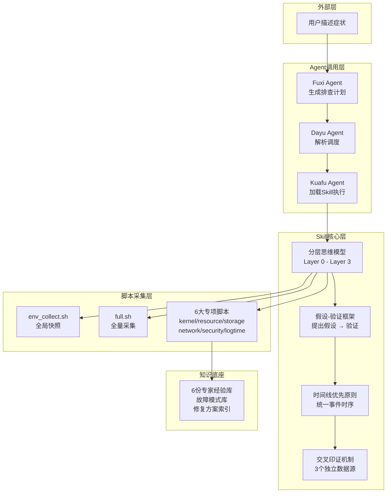

# Docker 故障分析：当 Agent 学会了专家的"第六感"

## 概述

在运维领域，Docker 容器故障是最常见却也最容易被误判的场景之一。一个容器频繁重启，表象是"应用起不来"，但根因可能是 XFS 文件系统的 `ftype=0`、SELinux 的安全上下文拦截、cgroup v2 与旧版 Docker 的兼容性问题，甚至是宿主机时间漂移导致的 TLS 证书校验失败——这些跨层的因果链，恰恰是传统运维脚本难以应对的。

Witty Diagnosis Agent 的 **Docker 故障分析 Skill** 正是为此而生：将 10 年以上 OS 专家的排查经验，封装为一个可被 Agent 加载的"认知模块"。它不只是一个脚本集，而是一套完整的**故障诊断方法论**，包含了分层思维模型、假设-验证推理框架、多源交叉印证原则，以及 6 大故障类别的专家知识库。

本文将从 Agent 的视角拆解：这个 Skill 是如何"思考"的？它的设计哲学是什么？作为用户，你又能如何利用它来 10x 加速你的故障排查？

## 背景：为什么 Agent 需要一个"专家大脑"？

### 传统排查的三大死穴

在深入设计之前，先理解一个现实问题：为什么 Docker 故障排查如此之难？

**第一，跨层因果链的伪装性。** 宿主机磁盘写满，表现却是"容器内应用写入失败"；内核 OOM Killer 触发，用户看到的是"容器退出码 137"。底层异常会以各种伪装形式传播到上层。传统脚本只能做单点检测，无法串联因果。

**第二，专家经验的门槛。** 一个资深 OS 工程师看到 "ExitCode=137" 会立刻去检查 `dmesg` 确认 OOM 事件，再检查 `cgroup memory.failcnt` 交叉印证，还能根据 `CONSTRAINT_MEMCG` vs `CONSTRAINT_NONE` 判断是容器级还是宿主机级 OOM。但普通运维人员看到 ExitCode 往往只有一句"重启试试"。

**第三，信息孤岛。** `dmesg` 的时间戳、`journalctl` 的 Docker daemon 日志、`docker events` 的容器生命周期事件、应用日志——它们分布在不同的数据源。人工排查时需要反复切换、手动对齐时间线，效率极低。

### 设计目标

Agent 需要的不是一个"执行脚本的管道工"，而是一个**内置专家思维模型**的诊断大脑。这套 Skill 的设计目标很清晰：

- **零门槛**：用户只需描述故障症状（"容器起不来"、"网络不通"），Agent 自动完成后续诊断流程
- **因果穿透**：从表层症状穿透到根因，识别伪装性异常
- **可验证**：每个结论至少 3 个独立数据源交叉印证，杜绝"我觉得"
- **标准化**：输出统一的诊断报告格式，任何人/任何系统都能理解

## 设计解析：Agent 的"诊断思维"是如何搭建的？

### 整体架构

Docker 故障分析 Skill 在设计上遵循"三层两轴"结构：



**三个关键设计决策：**

**1. 分层思维模型（Layer 0 → 3）—— 禁止跳层分析**

这是整个 Skill 的"宪法"。所有的排查必须从宿主机系统层开始，逐层向内收敛：

```text
Layer 0: 宿主机系统层（内核版本 / cgroup / namespace / sysctl / 磁盘 / 内存 / CPU / fd 限制）
Layer 1: Docker 引擎层（dockerd / containerd / runc / 存储驱动 / 网络驱动 / 日志驱动）
Layer 2: 容器运行时层（cgroup 配额 / namespace 隔离 / 卷挂载 / 端口映射）
Layer 3: 容器应用层（进程状态 / 应用日志 / 配置文件）
```

为什么这么设计？因为底层异常会以各种伪装形式传播到上层。如果 Layer 0 存在异常（如磁盘 inode 耗尽），直接分析 Layer 3 的应用日志（应用报写入失败）会完全误导方向。Agent 被要求**永远从外到内**排查，而不是从症状最明显的地方开始——这恰好是新手与专家的核心区别。

**2. 假设-验证（Hypothetico-Deductive）推理框架**

这与传统脚本"收集所有数据 → 模式匹配 → 输出结果"的线性流程有本质区别。Agent 的推理过程如下：

1. **环境快照**：先执行 `env_collect.sh` 获取全局上下文（OS版本、内核、Docker配置、系统资源）
2. **提出假设**：基于用户症状和环境快照，判断最可能的故障方向（例如：资源限制、网络冲突、存储耗尽）
3. **专项验证**：加载对应类别的诊断脚本，定向采集证据
4. **交叉印证**：确认或证伪假设，输出标准化报告

这模拟了人类专家"看了几眼就先猜是什么问题，再去找证据"的思维方式，而非机械地跑所有检查。

**3. 统一时间线 + 三源印证**

故障分析的本质是还原事件因果链。Skill 要求 Agent 在拿到数据后，第一步就是提取所有带时间戳的事件（`dmesg`、`journalctl`、`docker events`、应用日志），建立统一时间线。第一个异常最接近根因，后续事件往往是前者的级联反应。

每个结论必须有至少 3 个独立数据源印证。例如判断 OOM：

| 单一证据（不足够） | 三重证据（可信） |
|---|---|
| `docker ps` 显示 Exited | `dmesg` OOM 事件 + ExitCode=137 + `cgroup memory.failcnt > 0` |

### 六大故障类别的认知地图

Skill 将 Docker 故障划分为 6 个类别，每个类别对应一个诊断脚本 + 一份专家知识库。Agent 根据用户症状先定位故障类别，再加载对应工具：

| 类别 | 典型症状 | 诊断脚本 | 专家知识 |
|---|---|---|---|
| 内核/系统调用 | overlay 挂载失败、cgroup 找不到、容器启动失败 | `diag_kernel.sh` | `kernel_syscall.md` |
| 资源限制（OOM/CPU） | 容器频繁重启、ExitCode=137、"too many open files" | `diag_resource.sh` | `resource_oom.md` |
| 文件系统/存储 | 卷挂载失败、写入失败、I/O 卡顿 | `diag_storage.sh` | `storage_overlay.md` |
| 网络 | ping 不通、端口映射失败、容器间无法通信 | `diag_network.sh` | `network_iptables.md` |
| 权限/安全 | permission denied、SELinux 拦截、seccomp 阻断 | `diag_security.sh` | `security_selinux.md` |
| 日志/监控 | 日志写失败、时间漂移、证书校验失败 | `diag_logtime.sh` | `log_time.md` |

当症状不明确时，Agent 执行 `diag_full.sh` 全量采集，再根据输出决定分析方向。

## 实现原理：Agent 是如何"看懂"脚本输出的？

脚本本身是"笨"的——它们只是执行命令，格式化输出。真正的智能在于 Agent 如何解析、推理这些输出。以下通过核心模块的实现来展示 Agent 的"思考过程"。

### 环境采集：建立全局上下文

当用户说出"我的容器起不来了"，Agent 第一步不是直接诊断容器，而是执行环境采集脚本 `diag_env.sh`：

这个脚本在 Agent 眼中的价值：建立**基线**和**上下文**。Agent 通过输出了解：

- 操作系统版本（CentOS 7 触发 XFS ftype = SELinux 检查）
- Docker 版本（< 20.10 触发 cgroup v2 兼容检查）
- 存储驱动（overlay2 触发 overlay 模块 / XFS ftype 检查）
- 系统资源水位（磁盘满 / 内存不足 → 资源限制类转向）

这正是"分层思维模型 Layer 0"的具体体现——在分析任何容器问题之前，先确认宿主机层面是否"健康"。

### 内核模块诊断：跨越三个层级抓出伪装性异常

`diag_kernel.sh` 是设计最精妙的脚本之一，它跨越了 Layer 0（内核、cgroup、namespace）和 Layer 1（Docker daemon、containerd）。Agent 读取脚本输出时的推理链：

**场景示例：容器启动失败，报 "overlay: filesystem not supported"**

```text
Step 1: 检查 /proc/filesystems 中 overlay 是否存在
        → 不存在 → 内核模块未加载（Layer 0 问题）
        → 存在 → 继续下一层

Step 2: 检查 XFS ftype（如果 Docker Root 在 XFS 上）
        → ftype=0 → CentOS 7 经典问题，必须重新格式化
        → ftype=1 → 继续排查

Step 3: 检查 SELinux 状态和 AVC 日志
        → Enforcing + AVC denied → SELinux 拦截
        → Disabled/Permissive → 排查 dmesg 中的具体错误
```

注意这个推理链的**排除思维**——Agent 在确认根因的同时，也在积累排除项。这些排除项最终写入诊断报告，告诉运维人员"我已经查过 X、Y、Z，它们都不是问题"。

脚本中有一段 Python 代码用于解析容器 inspect 信息（第 118-136 行），Agent 会特别关注：

```python
# Agent 的核心关注点
print('ExitCode:', state.get('ExitCode'))     # 137=OOM, 139=SIGSEGV, 159=SIGSYS(seccomp)
print('OOMKilled:', state.get('OOMKilled'))    # 是否为 OOM Killer 强杀
print('SecurityOpt:', hc.get('SecurityOpt'))   # seccomp/apparmor 配置
print('CapAdd:', hc.get('CapAdd'))             # 额外赋予的 Linux Capability
```

Agent 的工作记忆中有这样一条经验规则："ExitCode=159 立即触发 seccomp 检查，ExitCode=137 立即触发 OOM 三源印证流程"——这正是专家经验固化为 Agent 决策逻辑的体现。

### 资源诊断：读取 cgroup 的"心电图"

`diag_resource.sh` 的独特之处在于它直接读取 cgroup 文件系统（而非依赖 Docker API），因为 cgroup 是"事故现场"，它记录了 OOM Killer 的每一次心跳：

```python
# 脚本中的 cgroup 读取逻辑
for base in cgroup_paths:
    mem_limit = read_file(f"{container_dir}/memory.limit_in_bytes")
    mem_usage = read_file(f"{container_dir}/memory.usage_in_bytes")
    oom_ctrl  = read_file(f"{container_dir}/memory.oom_control")
    # ...
    if "oom_kill_disable 1" in oom_ctrl:
        print(f"⚠ OOM Killer 已禁用")
```

Agent 读取这些数值后进行的推理：

1. `mem_usage > mem_limit × 0.9` + `oom_kill_disable = 0` → 即将触发 OOM
2. `memory.failcnt > 0` → 已经发生过 cgroup 内存限制触发
3. `docker inspect` 显示 Memory=0（无限制）但 `dmesg` 有 OOM 事件 → 宿主机全局 OOM

这里有一个 Agent 特有的"反常检测"能力：当 `docker inspect` 显示容器内存限制为 0（无限制），但 cgroup 的 `memory.failcnt` 非零时，Agent 会**发出矛盾信号警告**——提示数据源之间存在不一致，需要进一步验证。

### 网络诊断：重建 iptables 规则拓扑

网络故障是 Docker 运维中最"迷"的问题之一，因为 iptables 规则链的交互非常隐蔽。`diag_network.sh` 的设计思路是先重建完整的网络拓扑，再做逐层检查：

```bash
# 关键检查链
1. 宿主机网络接口（ip link show）       → veth 对是否存在
2. Docker 网络列表（docker network ls） → 网桥、overlay 网络状态
3. iptables DOCKER 链                  → Docker 注入的转发规则
4. iptables POSTROUTING MASQUERADE    → NAT 规则（容器→外网的关键）
5. 端口占用（ss -ltnp）                 → 端口冲突检查
6. veth 对应关系（Python 解析）         → 容器 eth0 ↔ 宿主机 veth
7. net namespace 数量                  → namespace 泄漏检测
```

Agent 的推理剧本中有一个高频场景："容器网络突然全局中断 → 检查 `iptables -L DOCKER -n` 是否为空 → 如果是，怀疑 `firewalld reload` 清空了规则"。这个推理链直接对应 SKILL.md 中记录的"高危场景速查表"——设计和实现在这里紧密耦合。

### 安全诊断：SELinux AVC 日志的三层解读

SELinux 拦截是最容易误判的问题之一。`diag_security.sh` 的审计日志分析分三层：

```bash
# 第一层：AVC 原文（发生了什么）
ausearch -m AVC -ts recent
# 输出示例：
# avc:  denied  { read } for  pid=1234 comm="httpd" name="config"
#   scontext=system_u:system_r:container_t
#   tcontext=system_u:object_r:admin_home_t
#   tclass=file

# 第二层：按 comm 聚合统计（谁被拦住最多）
grep "avc:.*denied" audit.log | grep -oP 'comm="\K[^"]+' | ...

# 第三层：按 tcontext 聚合统计（什么文件类型被拦住最多）
grep "avc:.*denied" audit.log | grep -oP 'tcontext=\K\S+' | ...
```

Agent 的解读：如果 `scontext=container_t` 且 `tcontext=admin_home_t`，说明 Docker 容器尝试访问宿主机上 SELinux 标签为 `admin_home_t` 的文件，这是经典的卷挂载 SELinux 冲突。修复方案是 `chcon -Rt svirt_sandbox_file_t /path` 或挂载时加 `:z`。

## 权衡与取舍

### 脚本 vs 持续监控

这套 Skill 设计为**按需诊断**而非持续监控。这是一个刻意为之的取舍：

- **放弃**：实时告警、趋势分析、基线偏差检测
- **获得**：0 资源开销、无侵入式部署、无需持久化基础设施

这意味着它最适合"故障发生后"的场景，而非"故障发生前"的预防。Agent 的定位是一个"随时召唤的专家会诊"，而非一个"24小时值班的监控护士"。

### Bash + Python 原生库 vs 第三方依赖

所有脚本仅依赖 Bash 和 Python 原生库，不引入任何第三方包。这个决策有几个现实原因：

- 故障环境可能无法访问外网（内网隔离）
- pip/apt 可能不可用（容器崩溃或环境损坏）
- 兼容 CentOS 7/8/9、EulerOS、OpenEuler 等不同发行版

**代价**：代码中缺少一些"优雅"的抽象，函数复用程度不高。例如多个脚本中都有相同的 CLI 参数解析代码（`while [[ "$#" -gt 0 ]]`），这是有意为之——每个脚本都是独立可执行的，不依赖外部库或共享模块。

### 通用性 vs 专用性

Skill 的输出格式（诊断报告）是高度标准化的，但内部的诊断逻辑是 Docker 专用的。这意味着：

- 报告格式可被 Agent 中的 Baize Agent（融合Agent）统一消费
- 但排查逻辑无法直接复用到其他容器运行时（如 containerd 原生、Podman）

Agent 通过"Skill 插件化"架构来解决这个问题——每种技术栈（Docker、Kubernetes、数据库）都可以有独立的诊断 Skill，但输出走统一格式。

## 使用指南：从用户视角看 Agent 如何工作

### 典型使用路径

用户不需要直接调用脚本。一切通过 Agent 自然语言交互完成：

**步骤 1：描述症状**

```text
用户: 我的容器频繁重启，查一下怎么回事
```

**步骤 2：Agent 自动推理**

Agent（Fuxi）内部的推理过程（用户不可见）：

```text
症状关键词: "频繁重启"
→ 定位故障类别: 资源限制类（OOM 优先级最高）
→ 生成排查计划:
  1. 执行 env_collect.sh 获取全局上下文
  2. 执行 diag_resource.sh -c <container> 定向诊断
  3. 检查 ExitCode、dmesg OOM、cgroup failcnt
  4. 交叉印证输出报告
```

**步骤 3：Agent 执行并输出报告**

Agent 按计划执行脚本，解析输出，交叉印证，最终输出标准化的诊断报告。

### 诊断报告格式

Agent 输出的诊断报告格式高度结构化（摘录自 SKILL.md）：

```text
## 故障诊断报告

**故障根因**：XFS 分区 ftype=0 不支持 overlay2 d_type 特性
**故障组件**：宿主机 /dev/sdb1 XFS → overlay2 存储驱动 → 所有容器
**故障时间**：2026-03-27 10:45:32（来源：dmesg）

**故障链时间线**：
  T1 10:44:00 → yum upgrade docker-ce 升级至 19.03
  T2 10:44:30 → dockerd 重启自动启用 overlay2 驱动
  T3 10:45:00 → Docker pull image 写入 overlay2 层失败
  T4 10:45:32 → dmesg 报 "overlay: filesystem not supported"

**已排除项**：
  - SELinux 拦截：排除依据：getenforce 返回 Disabled
  - 磁盘空间不足：排除依据：df -h 使用率 35%
  - 内核版本过低：排除依据：uname -r 5.10.0

**修复建议**：
  1. 【根治】重新格式化 XFS 分区：mkfs.xfs -n ftype=1 /dev/sdb1
  2. 【预防】升级前检查：xfs_info | grep ftype 确认 ftype=1
```

### 高级用法：微调与扩展

**自定义诊断范围**：Agent 支持在对话中指定 `-c 容器名 -k 关键字 -s 开始时间 -e 结束时间` 参数，Agent 会将其传递到诊断脚本中，精准过滤。

**脚本直连（高级用户）**：如果用户是运维工程师，也可以直接跑脚本查看原始输出：

```bash
# 环境采集
sudo bash scripts/diag_env.sh -s "1 hour ago"

# 资源限制专项排查
sudo bash scripts/diag_resource.sh -c my-container -k "error"

# 全量采集（输出到 /tmp/docker_diag_<timestamp>.txt）
sudo bash scripts/diag_full.sh -c my-container
```

## 总结

Docker 故障分析 Skill 的设计哲学可以概括为一句话：**把专家"怎么想的"而不是"怎么做的"封装给 Agent**。

它不是把命令行手册翻译成脚本，而是把专家在故障面前的思维过程——"先看什么、再看什么、怀疑什么、排除什么、哪里最容易混淆"——结构化、可编程化。分层思维模型提供诊断框架，假设-验证提供推理机制，交叉印证提供可信度保障，标准化报告提供表达语言。

对于用户而言，这套 Skill 的价值不在于它集成了多少条 Linux 命令，而在于它让 Agent 拥有了"第六感"——在看到 ExitCode=137 时直接启动 OOM 印证流程，在看到 `constraint=CONSTRAINT_MEMCG` 时立刻区分容器级和宿主机级 OOM，在排查网络问题时先问"firewalld 最近有没有 reload"。这些看似"直觉"的判断，其实是被精心设计的诊断逻辑，固化成了 Agent 的认知能力。
