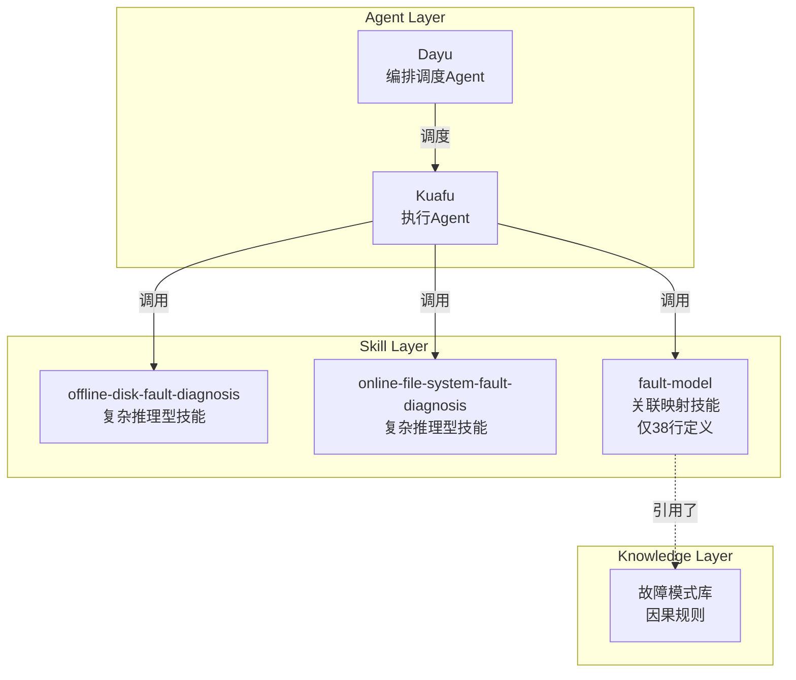
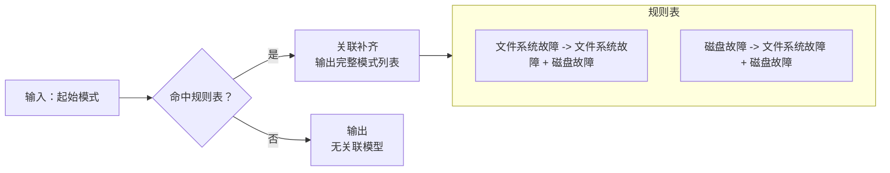
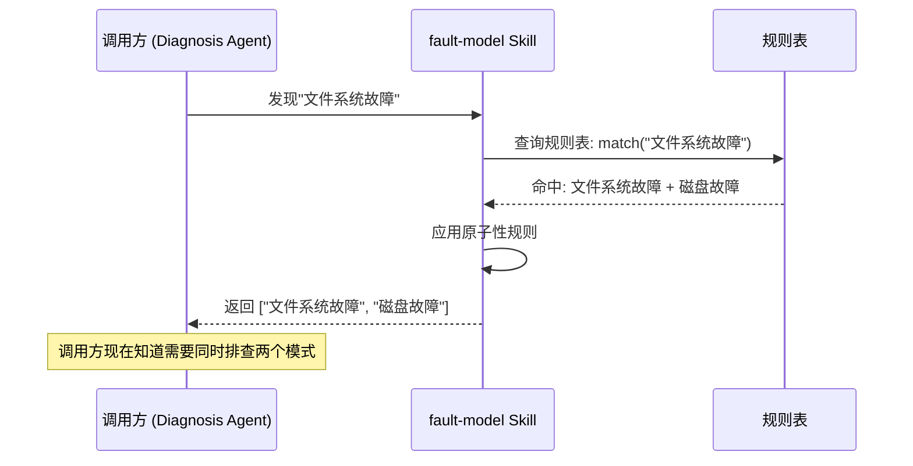

# 故障模式关联映射 Agent：AI 诊断中的"专家反射弧"

## 概述

故障模式关联映射 Agent 并不是一个复杂的存在。在 Witty 诊断 Agent 家族的所有 Skill 中，它是代码量最少、接口最简洁的那个——只有一张三行映射表、三条强制执行要求。但它的简单本身就是一种经过深思熟虑的设计选择。

该 Agent 名称为 **Fault Model**，它的工作不是诊断故障本身，而是回答一个看似简单却至关重要的问题：**"当你看到一个故障模式时，你还应该看到什么？"**

当一个 Kuafu Agent 发现了"文件系统故障"，如果它就此止步，它可能会错过一个关键事实——文件系统故障的根因往往不在文件系统，而在底层磁盘。Fault Model 的职责就是在这一刻介入，告诉执行 Agent："文件系统故障和磁盘故障是共生的，你必须同时排查它们。"这就是**存储堆栈一致性规则**——系统中最简单也最容易被忽略的专家直觉。

本文将从 Fault Model —— 一个故障模式关联映射 Agent 的第一视角，深度解析为什么一个只有 38 行定义的 Skill，会成为整个诊断流水线中不可或缺的"专家反射弧"。

## 背景：为什么需要一张"硬编码"的映射表？

### 问题和痛点

在复杂的系统故障诊断中，最昂贵的错误往往不是"不知道"，而是"知道得不完整"。

想象一个场景：一位运维工程师发现系统中有文件报 I/O 错误（`EXT4-fs error`），他的第一反应是检查文件系统。他执行了 `fsck`，修复了元数据，然后宣布问题解决。两天后同样的故障再次发生——这次他才检查磁盘，发现其实是底层磁盘有坏道，文件系统的错误只是表象。

**这就是"视野盲区"问题**：故障模式不是独立存在的。在分层架构（如存储堆栈）中，上层故障往往是下层故障的"影子"。工程师靠多年的实战经验才能建立这种"看到 A 就检查 B"的条件反射。但对于 AI Agent 来说，这种"反射弧"需要被显式编码。

传统排查方式面临三个核心挑战：

| 挑战 | 表现 | 后果 |
|:---|:---|:---|
| **确认偏误** | 工程师一旦锁定某个方向，倾向于忽略其他可能性 | 反复排查同一层，忽略下层故障 |
| **知识断层** | 存储堆栈的知识分散在不同专业领域（文件系统 / 磁盘 / 驱动） | 没人能完整看到整个链条 |
| **状态缺失** | 故障排查缺乏强制性的关联检查机制 | Agent 可能遗漏关键线索 |

### 设计目标

基于上述分析，Fault Model 的设计确立了三个核心目标：

1. **确定性**：关联映射必须是 100% 确定的，不存在"可能相关"、"概率相关"的模糊空间。在专家经验明确的地方，Agent 不需要"猜测"——它只需要"执行"。
2. **原子性**：对于已知的关联模式（如文件系统故障 ↔ 磁盘故障），必须视为不可分割的原子整体。不能输出一半的关联项。
3. **轻量性**：Fault Model 不需要做推理、不需要训练模型、不需要维护状态。Fault Model 只需要一张表和三行规则。越简单，越可靠。

## 设计思想：把"显而易见"的事情做得确定性十足

### 总体定位：最轻量的"知识节点"

Fault Model 的设计哲学可以用一句话概括：**"在一个复杂的 AI 系统中，最简单的事情也应该被显式地做好。"**

在 Witty 的四层解耦架构中，Fault Model 的位置非常特殊——既是 Skill 又是知识：



与其他需要复杂推理的 Skill 不同，Fault Model 更像是一个被固化的**专家规则节点（Expert Rule Node）**。Fault Model 不生成新知识，只是确保已有的专家知识在执行流程中不会被遗漏。

### 核心设计：专家规则的确定性编码

Fault Model 的全部逻辑只包含三部分：

1. **精准匹配** —— 输入是否命中规则表
2. **原子输出** —— 命中后输出完整关联集
3. **唯一兜底** —— 未命中的输出"无关联模型"



这个设计的关键洞察是：**在专家经验已经明确的领域，概率和模糊性不是进步，而是退化。** 一个资深工程师看到"文件系统故障"时，他的大脑中不会计算"70% 的可能性是磁盘问题"——他会直接检查磁盘。Fault Model 的映射表就是这种确定性的数字化。

### 原子性保证：存储堆栈一致性规则

这是 Fault Model 最核心的设计决策。为什么"文件系统故障"和"磁盘故障"必须被视为一个原子整体？

```text
故障传播链：

  文件系统只读 (Filesystem Read-Only)
        ↑ 由底层 I/O 错误触发
  块层 I/O 重试失败 (Block Layer I/O Retry Exhausted)
        ↑ 由 SCSI 层错误码上报
  SCSI 命令超时 (SCSI Command Timeout)
        ↑ 由物理链路异常触发
  磁盘介质损坏 (Disk Media Error)
```

在这个链条中，任何一个层级的故障症状都可能是下层故障的结果。如果你只看到了"文件系统故障"并只去修复文件系统，你实际上可能只处理了"症状"而不是"病因"。

设计存储堆栈一致性规则的背后逻辑是：

> **既然故障可以跨层传播，诊断就必须跨层覆盖。**

这就是"原子性"的本质含义：当你识别出文件系统故障时，你**必须同时**确认磁盘层是否也存在故障。反之亦然，当你发现磁盘故障时，文件系统可能已经被波及，也需要一并检查。诊断 Agent 必须**默认假设**堆栈完整性已被破坏，直到验证排除。

### 解耦原则：只映射，不推理

Fault Model 最引以为傲的设计之一是第三条规则：**"本 Skill 仅负责关联关系的静态映射，不负责后续的诊断推理或动作触发。"**

这背后是一个深刻的设计判断——

如果 Fault Model 既做关联映射，又做故障推理，就会产生两个问题：

1. **逻辑耦合**：映射逻辑和推理逻辑绑定在一起，任何一个变化都要同时修改两套逻辑。
2. **信任危机**：调用方无法区分输出中的"确定性证据"和"推断性假设"。

所以 Fault Model 的边界非常清晰：

| 负责（映射） | 不负责（推理） |
|:---|:---|
| 根据起始模式查找关联规则 | 判断关联项是否是真正的根因 |
| 输出确定的专家证据 | 建议下一步该做什么 |
| 保证输出格式一致性 | 干预调用方的执行流程 |

### 为什么是静态映射表，而不是机器学习？

这是一个绕不开的问题。为什么不做一个"智能"的故障模式关联模型，而是用一张硬编码的表？

**理由一：可审计性。** 当系统输出"文件系统故障和磁盘故障应该一起排查"时，这个结论必须有据可查。静态映射表的每一行都可以追溯到具体的专家经验和架构原理。如果换成 ML 模型，你无法解释"为什么模型认为这两者相关"。

**理由二：稳定性。** 存储堆栈的关联关系是基础设施架构决定的，不是统计规律。文件系统在磁盘之上的层级关系不会因为数据量的增加而改变。静态映射表在输入不变时输出一定不变——这对诊断系统的可靠性至关重要。

**理由三：零成本。** 一张三行表不需要训练、不需要推理 GPU、不需要更新模型。它的维护成本几乎为零。用机器学习解决一个规则表就够用的问题，属于过度工程。

## 实现原理

### 核心流程：查询表 + 原子性 + 兜底

Fault Model 的执行逻辑极其简单——实际上，它就是一个标准化的**查找-转换-输出**流水线：

```mermaid
flowchart TB
    Start[接收初始模式列表] --> Parse[解析输入\n提取起始模式]
    Parse --> Lookup[在规则表中查找]
    Lookup --> Match{命中？}

    Match -->|Yes: 文件系统故障或磁盘故障| Atomic[应用原子性规则\n输出完整关联集\n[文件系统故障, 磁盘故障]]
    Match -->|No: 未匹配| Fallback[输出兜底字符串\n无关联模型]

    Atomic --> Output[返回结果]
    Fallback --> Output
```

这个流程的关键保证是：

1. **输入输出标准化**：无论输入的是什么内容，输出只有两种格式——关联模式列表或"无关联模型"
2. **无状态性**：Fault Model 不依赖任何上下文、状态或 Session 信息。同样的输入永远得到同样的输出
3. **零副作用**：Fault Model 不会修改任何外部状态，不会触发任何操作

### 数据流：一行输入，一行输出

Fault Model 的接口设计遵循"最小惊讶原则"：

```text
输入格式：一个已识别的"起始模式"字符串
  示例输入："文件系统故障"
  示例输入："磁盘故障"
  示例输入："CPU 饱和"

输出格式（命中）：一个字符串数组
  示例输出：["文件系统故障", "磁盘故障"]

输出格式（未命中）：固定字符串
  示例输出："无关联模型"
```



### 边界处理

虽然 Fault Model 的逻辑简单，但边界情况仍需要清晰地确定义：

| 边界场景 | 处理方式 | 设计理由 |
|:---|:---|:---|
| 输入为空 | 未命中规则表 → 输出"无关联模型" | 兜底逻辑自然覆盖 |
| 输入不在规则表中 | 输出"无关联模型" | 唯一兜底原则，没有模糊空间 |
| 输入为"文件系统故障" | 输出 `["文件系统故障", "磁盘故障"]` | 原子性规则，双向补齐 |
| 输入为"磁盘故障" | 输出 `["文件系统故障", "磁盘故障"]` | 原子性规则，双向补齐 |
| 输入包含多个模式 | 每个模式独立执行映射（基于 SKILL.md"起始模式"的表述） | 保持逻辑原子性 |

## 权衡取舍

### 确定性 vs 灵活性

这是 Fault Model 面对的最核心的权衡。

**选择确定性**意味着：

- 优势：输出完全可预测，可审计，可验证
- 代价：无法覆盖规则表外的关联关系，需要人工扩展

如果选择灵活性（如使用语义匹配、模型推理），可以覆盖更广泛的关联关系，但代价是：

- 输出不再具有"确定性证据"的地位
- 可能出现假阳性关联
- 审计链断裂

**最终设计选择了确定性**，因为在 Fault Model 的使用场景中，"专家确定性证据"的定位远重于"覆盖更多关联"。调用方需要能够无条件信任 Fault Model 的输出。

### 简单 vs 丰富

为什么不做一张更大的映射表，覆盖更多的故障模式关联？

这是一个"够用 vs 完美"的判断。当前设计覆盖了存储堆栈这一最关键、最基础的耦合关系。更多关联规则的增加需要：

1. 有明确的专家经验支撑（不能凭空定义）
2. 有确定的架构依赖关系（不能是统计相关性）
3. 有清晰的原子性边界（耦合必须是对称的）

与其盲目扩展规则表，不如保持核心规则的精确性和原子性。更多关联规则将在验证后逐步添加。

### 原子耦合 vs 独立解耦

存储堆栈一致性规则要求"文件系统故障"和"磁盘故障"必须耦合输出。这本身是一个权衡：

- **好处**：确保诊断覆盖的完整性，不会遗漏跨层依赖
- **代价**：失去了精准区分"哪一层才是根因"的粒度

调用方收到 `["文件系统故障", "磁盘故障"]` 后，需要自己决定进一步的分析方向——是优先排查磁盘层还是文件系统层。这是"原子性"设计有意为之的权衡：Fault Model 的职责是**指出关联性**，而不是**做归因判断**。

## 用户视角：在诊断流程中如何使用

### 在诊断流水线中的位置

在整个 Witty 诊断流水线中，Fault Model 处于一个"承上启下"的纽带位置：

```text
诊断数据采集
  ↓
故障定位与模式识别 (Fault Localization)
  ↓
[FAULT-MODEL] ← 你在 GitHub 上创建的故障模式关联映射
  ↓
根因分析 (Root Cause Analysis)
  ↓
诊断报告生成 (Report Generation)
```

当 Kuafu Agent 执行诊断时，它按以下顺序调用相关 Skill：

1. **数据采集**：收集系统日志、指标、配置
2. **故障定位**：识别出具体的故障模式（如"文件系统故障"）
3. **fault-model**：补齐关联模式（输出 `["文件系统故障", "磁盘故障"]`）
4. **根因分析**：基于完整的模式列表进行深度推理
5. **报告生成**：输出最终诊断报告

### 典型使用场景

**场景一：文件系统只读排查**

用户报告某个应用报错"Permission denied"或"Read-only file system"。

1. Kuafu Agent 检查后发现 `EXT4-fs error` 日志，识别出"文件系统故障"
2. Kuafu Agent 调用 fault-model Skill
3. fault-model 返回 `["文件系统故障", "磁盘故障"]`
4. Kuafu Agent 获得完整排查方向：既检查文件系统（`fsck`、`dumpe2fs`），也检查磁盘层（SMART 数据、SCSI 日志、iBMC 告警）
5. 最终定位到磁盘坏道，而非文件系统本身的问题

**场景二：磁盘预失效预警**

SMART 数据上报重映射扇区数增长。

1. Kuafu Agent 识别出"磁盘故障"
2. fault-model 返回 `["文件系统故障", "磁盘故障"]`
3. Agent 意识到：虽然故障源在磁盘层，但文件系统可能已经积累了不可读数据，需要同步检查
4. 同时检查文件系统错误和磁盘健康状态，给出完整评估

### 在 OpenCode 中使用的等效操作

如果你在使用 OpenCode 手动排查，fault-model 的工作相当于你手动执行了以下步骤：

```text
# 步骤 1：初始排查（模拟 fault-model 输入）
系统表现出文件系统故障症状

# 步骤 2：应用专家关联规则（模拟 fault-model 的核心逻辑）
推理：文件系统在磁盘之上 → 磁盘故障可能导致文件系统故障
     磁盘损坏通常伴随文件系统异常 → 两者需同时排查
结论：同时检查文件系统和磁盘

# 步骤 3：并行排查（模拟 fault-model 输出的使用）
方向 A：检查文件系统
  dmesg | grep -i ext4
  dumpe2fs -h /dev/sda1

方向 B：检查磁盘
  smartctl -a /dev/sda
  cat /var/log/messages | grep -i scsi
```

而在 Witty 诊断系统中，这一切都是自动化的——fault-model 在毫秒级完成映射，Kuafu Agent 自动展开两个方向的并行排查。

## 总结

作为一个故障模式关联映射 Agent，Fault Model 的设计看起来过于简单——38 行定义，三行规则表，两个原子对。但这份简单背后是对三个核心问题的深思熟虑：

**第一，在 AI 系统中，确定性知识应该以确定性的方式编码。** 当专家经验已经明确了"文件系统故障和磁盘故障必须一起排查"时，把它写成一行映射规则比训练一个模型更可靠、更可审计、更高效。

**第二，原子性保证了诊断覆盖的完整性。** 在跨层故障传播的场景中，"只看到一半"比"什么都没看到"更具误导性。存储堆栈一致性规则确保 Agent 不会因为"视野盲区"而做出不完整的诊断。

**第三，职责边界是一种设计美德。** "只映射，不推理"让 Fault Model 成为整个诊断链条中一个干净、可信的知识节点。调用方可以无条件信任 Fault Model 的输出是确定性证据，而不是概率推测。

Fault Model 的价值不在于复杂度，而在于精确性。在一个由多 Agent 协作的智能诊断系统中，有时候最需要的不是更聪明的推理引擎，而是一个在关键时刻说"等等，还有一件事要检查"的专家提醒——这就是 Fault Model ，故障模式关联映射 Agent 的使命。
