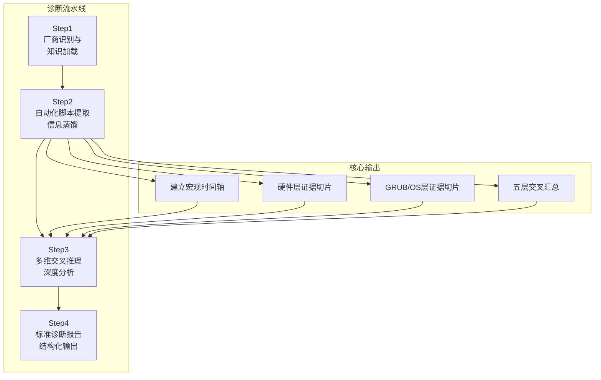
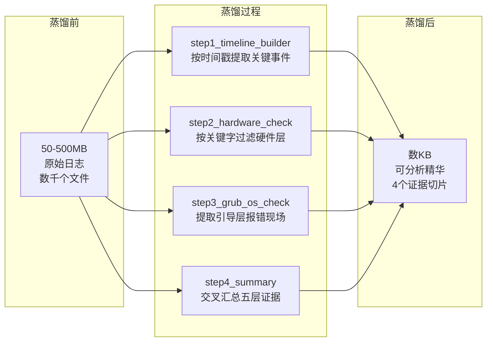
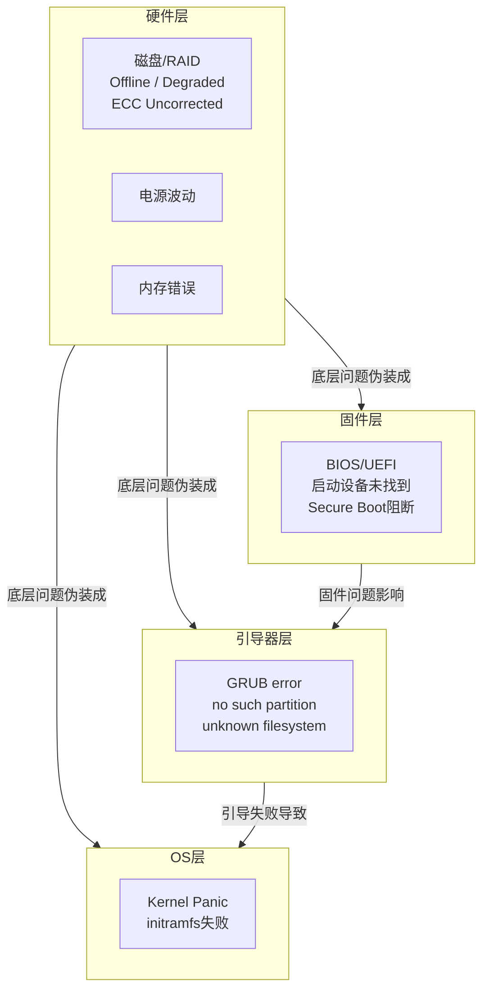

# GRUB 启动故障 iBMC 诊断技能深度解析：让 Agent 像资深专家一样思考

## 概述

服务器无法启动了。运维人员面对的往往是一个冰冷的黑屏、一段 "grub rescue>" 提示符，或是一句 "no such partition" 的报错。在这个时刻，操作系统已经完全失控——没有 dmesg，没有 journalctl，没有 SSH 入口。

但有一双眼睛一直在看着这一切：**iBMC**（智能基板管理控制器）。它是服务器的带外"旁观者"，独立于主 OS 运行，在系统崩溃时仍在忠实地记录每一个硬件事件、每一次掉电、每一行串口输出。

GRUB 启动故障 iBMC 诊断技能，正是 Witty Diagnosis Agent 中专门封装这一领域专家知识的技能。它让 AI Agent 学会了一套"从硬件到软件、从宏观到微观、从蒸馏到推理"的标准化诊断方法论，能够像一位拥有十年经验的运维专家一样，在数百 MB 的日志噪音中精准锁定根因。

## 背景

### 传统诊断的困境

在引入智能诊断 Agent 之前，GRUB 启动故障的排查长期依赖资深专家的个人经验。这种模式存在几个难以突破的瓶颈：

**现场信息极度碎片化。** 一个完整的 iBMC 日志压缩包通常包含 500~3000 个文件，总体积 50~500 MB。其中既有大量正常运行的"噪音"记录，也有分布在数十个文件中的故障线索。专家需要凭经验知道："先看 SEL，再看 FDM，再翻 RAID 状态，最后查串口日志"——这种路径知识很难文档化，更难传递给新人。

**底层故障伪装成上层症状。** 这是最典型的陷阱。磁盘掉线会让 GRUB 报 "no such partition"，初看是 GRUB 配置问题，实际根因在硬件层。如果直接去重装 GRUB，不仅浪费数小时，还会丢失硬件层的原始现场。传统诊断中，这种"被现象牵着鼻子走"的情况极为普遍。

**跨厂商日志体系差异巨大。** 华为、浪潮、H3C 三家厂商的 iBMC 日志体系几乎完全不同——目录结构不同、文件命名不同、关键诊断文件的格式不同、故障关键字的语义也不同。专家需要针对每个厂商分别积累经验，这在多厂商混合部署的数据中心几乎是不可能完成的任务。

### 为什么选择 iBMC 日志路线

设计这个技能时，面临一个根本性选择：**"当 OS 已经崩溃时，还能从哪里获取诊断信息？"**

候选方案有三个：

1. **从 GRUB rescue 环境交互式探索**——但这需要物理或远程 KVM 访问，且 rescue 环境的工具链极其有限
2. **从磁盘上获取日志**——但如果 RAID 已经 Offline，磁盘都不可达
3. **从 iBMC 带外日志**——iBMC 独立于主 OS 运行，即使 OS 崩溃、磁盘离线，iBMC 仍在正常工作

最终选择 iBMC 路线，因为它是**"故障的最后一位目击证人"**。iBMC 的日志体系天然涵盖了硬件层（SEL/SMART/RAID）、固件层（BIOS）、引导层（SOL 串口）和 OS 崩溃层（截图/dmesg），恰好完整覆盖了 GRUB 启动链的每一个环节。更重要的是，iBMC 日志的采集不需要目标服务器正常启动——这是一条**带外旁路**，对故障系统零侵入。

## 设计哲学：让 Agent 学会"专家思维"

### 问题本质的再认识

在设计这个技能之前，团队深入分析了 GRUB 启动故障诊断的本质。经过大量案例复盘，得出一个关键认知：

> GRUB 启动失败不是单一的"软件 bug"，而是一个**"症状节点"**——硬件、固件、配置、文件系统四个层面的问题，最终都可能汇聚到同一个表面现象：GRUB 报错。

基于这个认知，技能的设计没有停留在"如何修复 GRUB"，而是上升到了 **"如何系统性地重建故障传播链"** 的层面。这决定了后续所有的设计决策。

### 4-Step 工作流：一个自底向上的推理框架

技能的核心骨架是一个严格有序的 4 步工作流，每一步都有明确的目的和输出：



**为什么必须是 4 步而不是 2 步？** 这个设计背后有一个深刻的工程考量：**人的推理过程和 AI Agent 的推理过程有本质差异。**

人类专家可以"跳步"——看到 SEL 告警就直接跳到根因结论，因为多年经验已经在大脑中完成了隐式的模式匹配。但 AI Agent 没有这种直觉，它需要显式的、结构化的推理路径来保证结论的可靠性。4 步流程的本质，是把人类专家隐式的思维链显式化：

- **Step1** 对应人类的"先看看这是什么机器"
- **Step2** 对应人类的"先翻关键的几份日志"
- **Step3** 对应人类的"把线索串起来想想因果关系"
- **Step4** 对应人类的"把结论写清楚"

这四个步骤不可乱序、不可跳跃，因为每一步的输出都是下一步的输入前提。

### 信息蒸馏：不是"读日志"而是"炼日志"

在技能设计过程中，有一个数据让团队印象深刻：**一个 iBMC 日志包中，真正与故障根因相关的数据通常不到总数据量的 0.1%**。这 0.1% 散布在数十个文件中，每个文件里又有 99% 的内容是正常运行时产生的"噪音"。

如果直接让 AI Agent 读取全部日志，会面临三个致命问题：

1. **Token 窗口溢出**——没有任何 LLM 的上下文窗口能容纳数百 MB 的文本
2. **信噪比崩溃**——异常信号被淹没在海量正常记录中，注意力机制无法聚焦
3. **时序丢失**——无法跨文件建立事件因果链

**设计决策：用 shell 脚本做前端过滤，让 Python 做结构化摘要。**



这个设计体现了 **"关注点分离"（Separation of Concerns）** 原则：

- shell 脚本负责**粗过滤**——用 `grep`、`find`、`awk` 做关键字和时间窗口过滤，把数百 MB 缩小到数百 KB
- Python 脚本负责**结构化归纳**——解析 JSON、CSV 等结构化文件，做关键字匹配和分层归类
- AI Agent 负责**深度推理**——基于结构化证据切片做因果链重建和根因定界

**为什么不用纯 Python 实现全部脚本？** 这是基于实际场景的权衡。在 iBMC 日志分析场景中，90% 的过滤操作本质上是简单的文本模式匹配和文件路径操作，shell 脚本用 3-5 行就能完成，而 Python 需要 20-30 行。用 shell 做前端过滤，是"用最合适的工具做最合适的事"的工程思维。

### 跨厂商异构日志的归一化抽象

华为、浪潮、H3C 三家的 iBMC 日志体系几乎是从零开始各自设计的：

| 维度 | Huawei | Inspur | H3C |
|------|--------|--------|-----|
| 目录结构 | 10+ 模块目录 | 4 目录扁平化 | 10+ 模块目录 |
| 硬件故障判定 | `fdm_output`（Fault 条目） | `ErrorAnalyReport.json`（AI 解析） | `arm_fdm_log`（Fault） |
| 串口日志 | `OSDump/systemcom.tar` | `sollog/solHostCaptured.log` | `OSDump/systemcom.tar` |
| 硬盘 SMART | 散落文件 | 散落文件 | `PD_SMART_INFO_C*`（逐盘独立文件） |
| MCA 寄存器 | 无 | `RegRawData.json` | 无 |
| 内核黑匣子 | 无 | 无 | `RTOSDump/kbox_info` |

**归一化策略：不是统一数据格式，而是统一诊断路径。**

这是一个关键的架构决策。团队没有试图将三个厂商的日志统一成同一套数据格式——那将是一个工作量巨大且收益有限的工程。相反，设计采用了 **"适配器模式"**：

- 每个厂商有一套独立的 `step1`~`step4` 脚本（适配器）
- 所有脚本的输出格式**统一**（`timeline_xxx.txt`、`hardware_check_xxx.txt`、`grub_os_check_xxx.txt`、终端输出）
- AI Agent 的分析逻辑**不感知厂商差异**——它只消费统一后的证据切片

这样做的优势是：**新增一个厂商（如 Lenovo、Dell）只需要写一套新的适配脚本，不修改 Agent 的推理逻辑。**

### "孤证不立"原则：为什么需要双重印证

这是整个技能中最严格的约束：**每一个诊断结论必须有 ≥ 2 个不同日志来源相互印证。**

这个原则的提出源于对误报现象的统计。在真实案例复盘中发现，单一日志来源的告警可能由以下原因触发：

- **SEL 历史残留**：某些硬件告警在设备恢复后未被清除，成为"幽灵告警"
- **iBMC 时钟偏差**：NTP 同步失败导致时间戳错乱，单文件时序不可信
- **偶发性误报**：传感器瞬时波动触发的阈值越界，不一定是真实故障

双重印证的设计能够有效过滤掉这三类"伪证据"。技能中为每种结论类型定义了推荐的印证组合：

> 磁盘物理故障：SMART 异常 + SEL 硬盘告警（Predictive Fail / Drive Fault）
>
> Kernel Panic：SOL 串口 panic 信息 + dmesg / kbox_info
>
> 电源触发掉电：ps_black_box 故障记录 + SEL 上电/断电事件时序

这意味着 Agent 必须学会 **"不轻易相信任何一个文件"**——只有当两个独立来源指向同一结论时，才能做出判断。

## 实现原理

### 预处理脚本的设计思想

四个脚本的分工准确地反映了专家分析的思维过程：

```text
Step 1 - 时间轴脚本（建立时空锚点）
         ↓ 先搞清楚"什么时候出问题"
Step 2 - 硬件检查脚本（P1 层排查）
         ↓ 确认最底层是否健康
Step 3 - GRUB/OS 检查脚本（P3/P4 层排查）
         ↓ 采集故障现场的第一手证据
Step 4 - 汇总脚本（交叉分析）
         ↓ 消除单步分析的视角局限
```

**为什么 Step 2（硬件层）必须在 Step 3（GRUB 层）之前？** 这是整个技能最核心的方法论。如果 Step 2 发现 RAID 已 Offline，那么 Step 3 中 SOL 串口的 GRUB 报错就是"果"而不是"因"——不需要再去分析 GRUB 配置是否正确，因为根因已经被定位在硬件层。这种设计避免了 **"被表层现象误导"** 的最常见陷阱。

### 分层推理模型

技能将故障空间划分为 4 个层次，优先级从 P1（最高）到 P4（最低）：



**推理规则**（hard-coded into the reasoning logic）：

1. 诊断从 P1 开始，逐层向上排查
2. 如果当前层发现故障，**必须确认是否被下一层触发**（例如 P3 的 GRUB 错误是否由 P1 的磁盘 Offline 导致）
3. 只有当前层和所有下层都排除后，才能将故障定界在当前层
4. 每层发现都需要日志证据支持，不能仅凭推理

### 报告模板的证据链设计

诊断报告模板是一个被精心设计的**证据结构**。它不只是输出结论，而是要求 Agent 回答一系列问题来证明结论的可靠性：

```text
根因（Root Cause）          → 结论是什么
故障组件（Component）      → 哪个组件坏了
故障时间（Fault Time）     → 什么时候开始的
故障链（Fault Chain）      → 因果关系是什么（事件A→B→C→症状）
已排除项（Excluded）       → 为什么不是其他原因
置信度推理（Confidence）    → 三条证据链论证
```

这种设计对应了 **"假设-验证"（Hypothetico-Deductive）** 推理范式——Agent 不仅要给出结论，还要证明自己"为什么是对的"以及"为什么别人是错的"。这正是 Witty Diagnosis Agent 的核心推理模式。

## 使用视角：运维人员如何与 Agent 协作

### 典型诊断会话

这个技能的使用方式非常直观。运维人员甚至不需要知道"GRUB"或"iBMC"这些技术术语：

```text
用户：帮我分析这个日志包，服务器启动不了

Agent：[自动识别厂商 → 执行脚本 → 交叉推理 → 输出报告]

输出：
🔴 故障根因：硬件层 - Slot 2 物理磁盘发生不可纠正读错误，
   导致 RAID-1 逻辑卷标记 Offline，GRUB 无法访问 /boot 分区

🔗 故障链：
   [03-05 14:21:30] 磁盘读错误 ← SEL Drive Fault
   [03-05 14:21:35] RAID 逻辑卷 Offline ← RAID_Controller_Info
   [03-05 14:22:10] GRUB no such partition ← SOL 串口

🎯 置信度：高（SEL + RAID 日志 + 串口三层交叉印证）

🔧 修复建议：
   1. 更换 Slot 2 物理磁盘
   2. 在 RAID 控制器上将新盘加入阵列重建
   3. 重建完成后执行 grub-install 恢复引导
```

### 技能覆盖的故障模式

技能内置了高频故障模式速查表，Agent 在分析开始时就会将现象与已知模式进行快速匹配：

| 故障模式 | Agent 识别方式 | 自动采取的路径 |
|---------|--------------|--------------|
| RAID 逻辑卷 Offline | 检测 RAID_Controller_Info 状态 = Offline | 跳过 GRUB 分析，直接定位硬件层 |
| 磁盘物理坏道 | 检测 SMART #5/#197 非零 + SEL Predictive Fail | 提取 SMART 数据，确定坏盘槽位 |
| UUID 不匹配 | 比对 grub.cfg UUID vs blkid | 生成具体的修复命令 |
| Secure Boot 阻断 | 检测 security_log auth fail | 建议进入 BIOS 关闭 Secure Boot |

### 当信息不足时

技能设计了**信息完整性检查**机制。在执行脚本之前，Agent 会先检查几个关键证据文件是否存在。如果缺失，会主动告知用户需要补采，而不是在后续分析中给出"可能、或许"的模糊结论：

```text
Agent：检测到缺失关键文件 - OSDump/systemcom.tar
影响：无法分析 GRUB/内核层，置信度将降级为"中"
建议：重新触发 iBMC 一键日志采集，确保 OS Dump 选项已勾选
```

这种设计体现了 **"知道不知道什么"** 的元认知能力——Agent 知道自己的知识边界，在证据不足时不强行下结论。

## 权衡与取舍

### 自动化 vs. 灵活性

脚本提供了标准化的过滤逻辑，但代价是牺牲了对异常路径的灵活处理。例如，如果某个故障的关键字不在脚本的 grep 列表中，就可能被遗漏。这是一个有意的设计决策：**用 90% 常见场景的覆盖换取 100% 场景的可复现性**。对于长尾场景，Agent 可以在 Step 3 的深度分析中直接读取原始日志作为补充。

### shell 脚本 vs. 全 Python

如前所述，shell 脚本在前端过滤中的简洁性是以平台兼容性为代价的。当前实现假设运行环境为 Linux/bash，这在服务器诊断场景中是合理的假设。如果未来需要扩展到 Windows 环境或容器化执行，可能需要用 Python 重写所有脚本。

### 一般化 vs. 厂商深度

归一化抽象带来了扩展性，但每个厂商独有的一些"杀手锏"特性很难统一抽象。例如 Inspur 的 `ErrorAnalyReport.json` 是最直接的 AI 诊断输入，但其他厂商没有等价物。技能的解决方式是：**在统一流程中嵌入厂商特殊路径**（Inspur 的快速路径提示），而不是试图抹平差异。

## 总结

GRUB 启动故障 iBMC 诊断技能的设计，折射出了 Witty Diagnosis Agent 整个项目的方法论：

**它不是用 AI 替代专家，而是把专家的思维模式"复制"给 AI。**

从 4 步工作流的编排，到信息蒸馏的脚本设计，从分层推理的规则约束，到标准报告的模板结构——每一步都在尝试回答同一个问题：**"一个资深专家在面对这个故障时，他是怎么思考的？"**

这种设计思路带来的结果是：

- **确定性**：同样的日志包输入，每次得到相同的诊断路径，不像人类专家会受疲劳、情绪影响
- **可追溯**：每一个结论都有日志来源和推理过程，不像人类专家的"直觉"无法解释
- **可复制**：技能可以被加载到任意 Agent 实例，诊断能力可以无限复制
- **可进化**：新的故障模式可以不断补充到技能库，越用越精准

对于运维人员来说，这个技能解决的不是"读日志"的问题——而是**"知道该读什么、读完后怎么想"**的问题。当服务器启动失败、OS 完全失控时，AI Agent 能够像一位经验丰富的"数字法医"一样，从 iBMC 的"遗言"中重建故障现场，给出精准的根因分析和修复建议。

从某种意义上说，这个技能代表了智能运维的一个方向：**不是让机器自己发明诊断方法，而是让机器学会使用人类已经验证过的、最好的诊断方法。**
