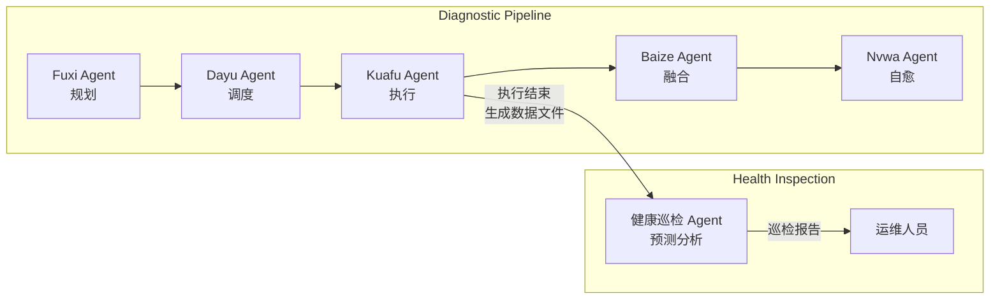
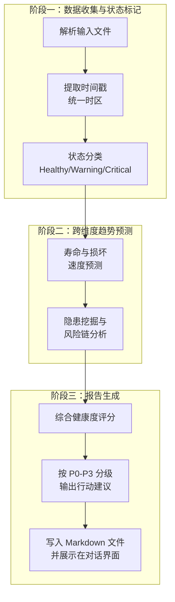

# 健康巡检报告生成 Agent 技术深度解析：当 AI 拥有"治未病"的智慧

## 概述

在 Witty 智能诊断 Agent 体系中，健康巡检报告生成（Health Inspection Report Generation）是一项理念独特的能力——它不负责"救火"，而是专注于"防火"。当其他诊断技能忙于排查已发生的故障时，健康巡检 Agent 的角色是**站在时间轴的前端，基于当前数据预测未来灾难**。

这项技能的核心思想源于中医的"治未病"理念：**在磁盘尚未发生故障时，通过多层检测手段提前识别风险**。它并非简单的数据聚合工具，而是一个具备跨维度推理能力、能够从看似正常的系统数据中嗅出灾难前兆的"预言者"。

## 背景：磁盘故障预测为何需要专属 Agent

### 当前问题与痛点

传统磁盘健康巡检存在三大结构性缺陷：

1. **单点阈值检测的局限性**：大部分监控系统仅设置简单阈值（如 `Temperature > 60°C` 告警），缺乏对趋势指标的判断能力。一块温度从 35°C 逐步爬升到 55°C 的磁盘，远比一直稳定在 55°C 的磁盘更危险，但传统系统无法区分。

2. **信息孤岛问题**：SMART 数据、RAID 控制器状态、系统日志、业务告警分散在不同系统，彼此缺乏关联。巡检人员需要手动切换多个控制台，难以形成全局判断。

3. **事后响应的被动性**：传统流程中，运维团队通常在"磁盘已故障、业务已受影响"后才介入。而此时数据丢失或服务中断已经发生，运维从"防患于未然"变成了"亡羊补牢"。

### 设计目标

健康巡检 Agent 的设计目标明确：

- **从单点检测走向趋势预测**：不只看"当前是否异常"，还要回答"是否正在走向失败，走得多快"
- **从被动响应走向主动预警**：在问题真正发生前输出报告，给运维团队充足的处理窗口
- **从人工分析走向自动化推理**：将专家经验固化为可复用的分析流程，降低对资深 SRE 的依赖

## 设计思路：一个"三层视角"的预测框架

### 整体架构

健康巡检 Agent 是 Witty 诊断体系中的"收官"节点——它接收前置技能（数据采集、故障定位、根因分析等）的输出，进行综合研判，最终生成结构化的巡检预测报告。

在整个 Multi-Agent 流水线中，它的位置如下：



### 核心设计：三视角预测模型

健康巡检 Agent 的预测逻辑围绕**三个核心问题**展开，这也是它与普通监控系统的本质区别：

| 视角 | 问题 | 分析方法 | 传统监控是否覆盖 |
|:---:|------|----------|:---:|
| **现状** | 当前健康状态是否已有异常？ | 单点值与阈值对比 | 是 |
| **趋势** | 关键指标是否在持续劣化？ | 跨文件 diff / 增长率计算 | 否 |
| **背景** | 环境、寿命、负载是否放大了风险？ | 上下文关联分析 | 否 |

举个例子：一块 SMART 状态显示 PASSED 的磁盘，传统监控系统会判定"正常"。但健康巡检 Agent 会发现——它的 G-list 坏道池在过去两周从 87 增长到 142（趋势视角），同时它的温度持续高于 45°C 且通电时间已达 4.5 万小时（背景视角）。Agent 会给出结论：**虽然当前没有故障，但该盘正处于加速劣化阶段，预计 14 天后可能触发离线**。这就是三个视角叠加所产生的"预测力"。

### L1-L6 分层检测体系

巡检覆盖 6 个层面的数据，形成一个从物理介质到业务服务的完整检测栈：

```text
┌────────────────────────────────────────────────────┐ 
│  L6  业务与存储服务层  OSD / EVS / ECS / 块存储       │ 
├────────────────────────────────────────────────────┤ 
│  L5  文件系统与OS层    dmesg / kernel / mount        │ 
├────────────────────────────────────────────────────┤ 
│  L4  控制器与链路层    RAID / HBA / SAS / CRC        │ 
├────────────────────────────────────────────────────┤ 
│  L3  槽位与环境层      Slot / 温度 / 背板 / 电源       │ 
├────────────────────────────────────────────────────┤ 
│  L2  寿命与负载层      上电时间 / 启停次数 / IO压力     │ 
├────────────────────────────────────────────────────┤ 
│  L1  盘本体 SMART 层   健康状态 / 错误计数 / 缺陷趋势   │ 
└────────────────────────────────────────────────────┘ 
            ↑  越往下越接近介质本身，越往上越接近业务影响
```

**为什么是六层？** 磁盘故障几乎从来不是单个层面的孤立事件。一次典型故障的传播链条可能是这样的：

```text
L3 超温 → L1 介质加速老化 → L1 坏道增加 → L5 内核 I/O 报错 → L5 文件系统只读 → 业务宕机
```

如果 Agent 只看 L1（磁盘 SMART），会误判为"磁盘质量缺陷"；如果只看 L5（系统日志），会误判为"文件系统异常"。只有六层的全局视图才能还原完整的因果链。

## 实现原理：从数据到报告的思维流程

### 核心流程

健康巡检 Agent 的执行流程可划分为三个阶段：



### 关键实现细节

#### 1. 跨文件时间线关联

当 Agent 收到多个巡检数据文件时，它不会单独处理每个文件，而是构建一条统一的时间线。例如：

```text
文件 A: [08:20:11] L4 链路重置 -- ata1.00 hard resetting link
文件 B: [08:20:15] L5 I/O 报错 -- blk_update_request: I/O error, dev sdb
文件 A: [08:20:26] L5 文件系统只读 -- EXT4-fs error, Remounting read-only
```

Agent 会将分散在不同文件中的事件按时间排序，识别出"链路重置 → I/O 报错 → 文件系统只读"的因果链，从而判断这是**一次从底层向上传播的故障事件**，而非三个独立异常。

#### 2. 风险传导预测

Agent 的一个核心能力是**从环境变化预测未来故障**。它的推理逻辑类似于专家系统的推断链：

```text
检测到 L3 温度持续 > 45°C
  → 推理：高温会加速磁介质老化
    → 预测：坏道增长率将上升
      → 评估：14 天内可能触发不可修复错误
        → 建议：7 天内计划换盘
```

这种推理将静态巡检数据转化为动态风险预测，是"预防"而非"诊断"的精髓所在。

#### 3. P0-P3 四级风险分级

Agent 将风险分为四个等级，每个等级对应不同的处置时效：

| 级别 | 含义 | 判定条件举例 | 响应时限 |
|:---:|:-----|:------------|:--------:|
| **P0** | 致命故障 | smart_198 > 0、文件系统只读、L5/L6 严重报错 | 立即 / 4 小时内 |
| **P1** | 高危亚健康 | G-list 持续增长、RAID 降级、链路错误频发 | 7 天内 |
| **P2** | 重点关注 | G-list 非零但稳定、轻微 CRC 错误、高温 | 14 天观察 |
| **P3** | 背景风险 | 通电时间 > 5 年、历史高负载 | 下一批次汰换 |

**为什么是四级而不是简单的"好/坏"二分类？** 运维团队需要的是**可执行的优先级排序**。P0 需要立即响应，P1 需要申请备件，P2 需要提升监控频率，P3 记录在案即可。这种分级让有限的运维资源能够聚焦在最关键的问题上。

### 边界条件处理

Agent 在处理数据时，需要应对多种边界情况：

- **嵌套或缺失的时间戳**：当某些日志缺乏精确时间时，Agent 会基于上下文推断大致时间范围，并在报告中标注"推断"标记
- **部分数据不可用**：如果某层数据完全缺失（如无 iBMC 日志），Agent 会跳过该层分析并在报告中注明，避免生成不完整结论
- **矛盾信号**：当不同指标指向相反结论时（如 SMART 正常但系统日志报错），Agent 采用"就高不就低"原则，按最高风险级别输出并详细说明矛盾点

## 设计取舍

### 性能 vs. 可解释性

健康巡检 Agent 选择了一条相对"重"的路径——生成详细的、包含完整推理链的 Markdown 报告，而非仅仅输出一个健康评分。这意味着每次巡检会产生数千字的报告内容。但这种取舍是经过深思熟虑的：

- **运维场景要求可审计**：当系统建议"换盘"这种高风险操作时，运维人员需要看到完整的证据链，而非一个黑盒评分
- **报告本身就是知识沉淀**：标准化的报告结构让新人也能快速理解巡检结论，降低团队对专家的依赖

### 规则驱动 vs. 机器学习

当前 Agent 的实现基于专家规则（阈值对比、趋势计算、逻辑推理链），而非机器学习模型。这是有意为之：

- **可解释性优先**：规则系统可以精确追踪每条结论的推导过程，这对于需要建立信任的运维场景至关重要
- **数据效率**：机器学习需要大量已标记的故障数据才能训练出可靠模型，而磁盘故障在单机房的样本量通常不足以支撑模型训练
- **确定性**：规则系统的输出是确定性的，同样的输入必然得到同样的输出，这对于需要复现问题的运维场景非常重要

> **注：** 以上推理基于 Agent 的 SKILL.md 设计文档和代码结构分析。当前版本的实现完全基于规则引擎，但设计文档中提到了多算法推理（贝叶斯网络、决策树、因果图）作为未来方向。这意味着后续版本可能会引入混合架构——规则引擎处理确定性推理，机器学习处理模糊预测。

### 通用性 vs. 深度

Agent 支持多种日志来源（华为 iBMC、浪潮 iBMC、H3C iBMC、OS Infocollect、系统日志），但牺牲了一定的深度。对于每种日志格式，Agent 需要适配不同的解析规则。这种取舍的权衡是：

- **广度优先**：先覆盖更多场景，让更多用户能用起来
- **深度迭代**：根据实际使用反馈，逐步优化特定场景下的分析精度

## 使用指南：让 Agent 为你巡检

### 前提准备

在启动健康巡检前，确保以下条件满足：

1. **网络连通**：Witty Agent 所在节点与目标服务器之间网络可达
2. **数据就绪**：已通过前置 Agent 生成巡检数据文件（SMART 数据、系统日志等）
3. **权限配置**：Agent 拥有读取数据文件的权限

### 启动巡检

在 OpenCode 中选择 **Xuanyuan Agent**，输入如下指令：

```text
请对 /tmp/inspection_data/ 目录下的巡检数据执行健康预测分析，生成巡检报告。
```

Agent 会自动完成以下工作：

1. 扫描并解析输入的巡检数据文件
2. 识别数据来源类型（iBMC / Infocollect / 系统日志）
3. 执行 L1-L6 全栈分析
4. 进行跨文件趋势预测
5. 生成包含分级行动建议的结构化 Markdown 报告

### 解读报告

一份标准的巡检报告包含四个核心部分：

- **硬件健康综述**：磁盘清单总览 + 核心组件状态，一眼看清整体健康度
- **故障深度分析**：已发生的故障及其完整的因果链、时间线
- **亚健康风险清单**：按 P0-P3 分级的风险列表，包含具体指标值和趋势
- **综合结论与行动建议**：分级行动执行表，明确"谁该做什么、何时完成"

报告的设计理念是：**一个不熟悉磁盘故障的初级运维人员，也能按照报告的指引做出正确的处置决策。**

## 生存之道：在 Agent 体系中如何"活下去"

Witty 诊断 Agent 采用了"Agent-Skill-工具-知识"四层解耦架构。健康巡检并非一个独立的 Agent 实例，而是 Kuafu Agent（执行节点）加载的一个 Skill 能力。这意味着：

1. **它不直接与用户交互**——用户的请求由 Xuanyuan Agent 接收并规划
2. **它不拥有独占资源**——数据来自前置技能的输出文件
3. **它的价值在于推理**——真正核心的竞争力不是数据采集，而是跨维度的综合研判能力

这种设计让健康巡检 Skill 成为一种"插件化"的能力，可以被其他 Agent 在需要时加载。例如，Nuwa Agent（自愈 Agent）也可以在修复执行后，调用健康巡检 Skill 来验证修复效果。

## 总结

健康巡检报告生成 Skill 最值得关注的不是它的实现技术，而是它所代表的**运维理念的转变**——从"故障驱动"走向"预测驱动"，从"事后分析"走向"事前预防"。

它为运维团队带来的核心价值是：

1. **时间窗口**：将故障发现提前到亚健康阶段，给换盘、迁移等操作留出充足的计划窗口
2. **决策辅助**：P0-P3 分级体系将复杂的健康评估转化为清晰的行动优先级
3. **知识固化**：标准化的报告结构和分析流程，让每位运维人员都能以专家的水准进行判断

对于一个正在向智能化迈进的运维体系而言，具备"治未病"能力的 Agent，远比一个只会"救火"的 Agent 更有价值。正如 SKILL.md 中所强调的：**本 skill 与故障分析（RCA）不同，其核心在于"防患于未然"**。这不仅是技术的选择，更是运维哲学的体现。
