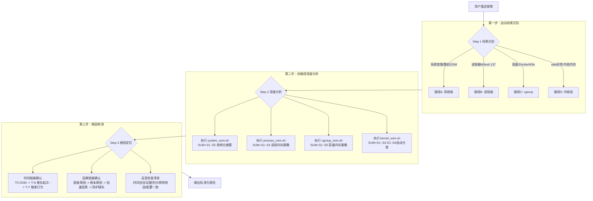
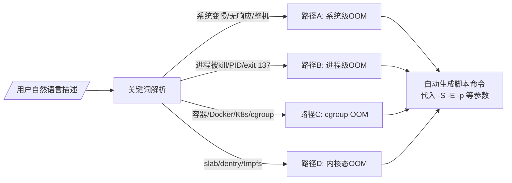
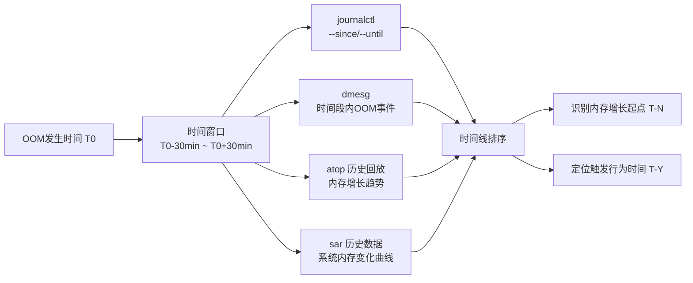

# Linux OOM 故障诊断 Agent：当 AI 学会"望闻问切"

## 概述

想象一个场景：凌晨三点，线上告警"服务不可用"，你 SSH 上机器，`free -m` 一看内存耗尽，`dmesg` 里躺着几行 "Out of memory: Kill process"。然后呢？是某个进程内存泄漏了？是容器 cgroup 限制太紧？还是内核 slab 爆了？面对十几种可能，排查往往从"猜"开始。

本文要拆解的，是封装在 Witty 智能诊断 Agent 中的 **linux-oom-analyzer Skill**——它是一个经过结构化设计、让 AI Agent 能够"像专家一样思考"的 OOM 诊断方法论。我们将从 Agent 的视角，深入分析它如何做到：拿到一句"我的 Java 进程被杀了"，就自动走完一套堪比十年内核工程师的排查流程。

## 一、背景：为什么 OOM 诊断这么难？

### 1.1 问题的复杂层级

Linux 内存子系统是操作系统中最为复杂的模块之一。一次 OOM 可能源于以下任意一层或多个层面的叠加：

| 层级 | 典型根因 | 表现形式 |
|------|----------|----------|
| 用户态进程 | Java heap 泄漏、mmap 泄漏、fd 泄漏 | 单进程 RSS 持续增长，被 OOM killer 选中 |
| cgroup/容器 | Docker/K8s memory limit 过小 | 容器内进程被 kill，exit code 137 |
| 内核 slab | dentry/inode cache 暴涨 | Slab >> MemTotal 15% |
| 内核模块 | 第三方驱动异常分配 | 未归因内存 > 512MB |
| 系统配置 | crashkernel 预留过大 | MemTotal 远小于物理内存 |
| NUMA 不均衡 | 跨节点内存分配导致某节点耗尽 | buddyinfo 高阶页为 0 |

**传统的排查方式是怎样的？**

- 工程师凭经验猜测方向（比如"Java 挂了，先看 heap dump"）
- 沿着一个方向走到黑，不对再回溯
- 每换一个方向就要重查日志、重跑命令
- 整个过程的效率严重依赖个人经验

### 1.2 为什么需要一个 Agent 来做这件事

核心矛盾在于：**OOM 问题涉及面极广，但排查窗口期极短**。系统重启后 /proc 信息消失，dmesg 环形缓冲区被覆盖，atop 历史只能保留有限天数。

一个结构化的 Agent Skill 要解决的正是：

1. **方向选择自动化**：不再靠猜，而是基于关键词自动路由正确的分析路径
2. **证据驱动而非直觉驱动**：每个结论必须至少 2 个独立数据源印证
3. **时间线锚定**：所有分析以故障时间点为基准，避免分析噪音
4. **可复现的专家思维**：把资深工程师的排查框架固化到代码逻辑中

## 二、设计思路：Agent 是如何"思考"的？

### 2.1 总体架构

linux-oom-analyzer 采用 **三层渐进式诊断架构**，对应 Agent 的三个思维阶段：



**这背后的设计哲学是**：Agent 不应当是一个命令执行器，而应当是一个"诊断推理器"。三个步骤分别对应：**问诊**（收集信息）→ **辨证**（多维分析）→ **开方**（定位根因）。

### 2.2 关键设计之一：场景自动路由

这是整个 Skill 最核心的设计决策之一。在传统的工具脚本中，使用者需要自己判断"我属于哪种 OOM 场景"，然后手动选择对应的脚本。

而 linux-oom-analyzer 的设计者选择了另一种方式：**让 Agent 根据用户描述自动路由**。



**为什么这样设计？**

- 用户描述故障时，通常不会用"我的问题是系统级 OOM"这种准确术语
- 他们会说"服务全挂了""Java 进程被杀了""容器一直在重启"
- 强制用户选择场景增加了使用门槛
- Agent 的语言理解能力可以做到关键词匹配 + 场景路由

> **补充说明**：场景路由规则定义在 SKILL.md 的 1.1 节，通过一个三列的映射表实现。当描述同时命中多个场景（如"容器内某进程 OOM"），优先级规则为：进程级 > cgroup > 系统级。

### 2.3 关键设计之二：结构化的脚本输出

传统的诊断脚本输出大量原始文本，Agent 读起来非常吃力。linux-oom-analyzer 的设计者做了一个关键决策：**每个专项脚本的输出都包含一个 `[SUMMARY]` 节，用结构化表格呈现诊断摘要**。

以 `system_oom.sh` 为例，它的 SUMMARY 包含：

- **S1** OOM Kill 事件列表：时间戳、被杀进程、score、anon-rss、total-vm
- **S2** 内存归因分类表：用户态 vs 内核态，自动标识异常项
- **S3** 内存压力指标：oom_kill 次数、allocstall、kswapd 回收量
- **S4** OOM 关键内核参数快照
- **S5** 超额提交评估（CommitLimit vs Committed_AS）

每个 S 节还附带 `cmd_info` 元数据——包含命令、用途和输出说明三行结构化信息。这使得 Agent 可以从 SUMMARY 中快速定位问题，再按需回溯源数据。

```text
▶ 命令 : awk 解析 /proc/meminfo
▶ 用途 : 量化各类型内存占比；未归因内存 > 512MB 强烈暗示内核模块泄漏
▶ 输出 : 各类型 MB 数值 + 使用率 + 自动诊断标记
```

这是 `collect_basic_info.sh` 输出中的一种常见格式：每一条重要命令前都附带用途说明，让 Agent 和人一眼就能理解这段输出的意义。

### 2.4 关键设计之三：时间锚点驱动

**故障时间点是所有分析的锚点**，这一理念贯穿整个 Skill 的设计：

- 脚本的 `-S` 参数是唯一强烈建议必填的参数
- 所有日志查询基于 `--since` / `--until`
- atop/sar 历史数据回放基于故障时间段
- 时间窗口默认取故障时间前后各 30 分钟



**为什么"时间"是核心锚点？**

因为 OOM 诊断的本质就是**还原时间线**：异常行为（部署/配置变更）→ 内存开始增长 → 超过回收阈值 → kswapd 高负荷 → 最终 OOM kill。没有时间锚点，所有的日志和指标都是散落的点，无法连成因果链。

## 三、实现原理：Agent 是如何一步步诊断的？

### 3.1 第一步：场景识别与信息收集

当用户说"我的 Java 进程被 OOM kill 了"时，Agent 内部发生了什么？

1. **关键词解析**：提取 `Java`（进程名）、`OOM kill`（场景关键词）
2. **场景路由**：匹配到路径 B（进程级 OOM）
3. **参数提取**：进程名 = `Java`，故障时间未知 → Agent 询问用户
4. **命令生成**：`bash process_oom.sh -S "2024-01-15 14:00:00" -E "2024-01-15 15:00:00" -n java`

Agent **不会**等待用户一条一条确认每个参数。它根据"已有信息直接用，缺失才询问"的原则，一次性填充所有已知参数，将需要追问的问题压缩到最少。

如果 Agent 在执行后发现进程已退出、脚本找不到 PID，它在第二步脚本中内置了兜底机制——从日志中搜索历史记录：

```bash
dmesg -T 2>/dev/null | grep -i "$SEARCH_TERM" | tail -30
journalctl --since="$START_TIME" --until="$END_TIME" --no-pager 2>/dev/null \
    | grep -i "$SEARCH_TERM" | head -100
```

`process_oom.sh` 中处理进程已退出的逻辑：在确认 PID 已不存在后，自动回退到日志搜索模式。

### 3.2 第二步：四路径深度分析

#### 路径 A：系统级 OOM 分析

当整机内存耗尽时，Agent 执行 `system_oom.sh`。这个脚本的核心能力是**内存归因**——把总内存的消耗精确分配到各个类型。

```bash
# 归因计算公式（脚本中 awk 实现）
user_space   = AnonPages + Cached + Buffers + Shmem
kernel_space = Slab + PageTables + KernelStack + VmallocUsed
unaccounted  = (MemTotal - MemFree) - (user_space + kernel_space)
```

**Agent 的诊断逻辑**：

1. 读 S1：看 OOM killer 触发了多少次、杀了哪些进程
2. 读 S2：看内存主要消耗在用户态还是内核态
3. 读 S3：看 OOM 前的内存压力级别（allocstall 次数越高压力越大）
4. 如果 S2 中 AnonPages > 50% → 用户态进程泄漏可能性高
5. 如果 Slab > 15% → 需要跳转到路径 D（内核态）继续分析

这里的关键设计是：**路径之间可以交叉引用**。Agent 在系统级分析中发现 slab 异常时，会自动补充执行 `kernel_oom.sh` 获取 D4 场景的诊断结果——这是一个诊断 Agent 区别于线性脚本的本质特征。

#### 路径 B：进程级 OOM 分析

对于进程级 OOM，Agent 关注三个核心问题：

**S1：是否真的被 OOM kill 了？**

- dmesg 中是否包含 `Killed process <PID>`？
- systemd 日志中 exit code 是否为 137（128 + SIGKILL）？
- 不能因为进程死了就断言是 OOM kill

**S2：内存分布在哪里？**

```bash
# 从 smaps_rollup 获取各段 RSS
cat /proc/$PID/smaps_rollup

# 三大泄漏指标
anon_segs=$(grep -c "^[0-9a-f].*rw-p 00000000 00:00 0 *$" /proc/$PID/maps)
fd_cnt=$(ls /proc/$PID/fd | wc -l)
heap_range=$(grep "\[heap\]" /proc/$PID/maps | awk -F'[ -]' '{...}')
```

Agent 的阈值逻辑非常具体：

- 匿名 mmap 段 > 500 → 疑似 mmap 泄漏（处于告警状态）
- fd > 1000 → 疑似 fd 泄漏（处于告警状态）
- 这两者都是量化的、可编程的触发阈值

**S3：趋势是泄漏还是正常波动？**

- 内存单调递增不回落 → 泄漏
- 内存随负载波动 → 正常

Agent 借助 atop/sar 的历史数据来判断趋势特征。

**S4：是单进程异常还是同类都高？**

- 仅特定 PID 内存异常高 → 该实例有状态泄漏（特定请求导致）
- 所有同类进程都高 → 业务负载问题或公共配置问题

#### 路径 C：cgroup OOM 分析

cgroup OOM 与系统级 OOM 的一个关键区别是：**OOM killer 只在 cgroup 范围内选择进程**，不影响 cgroup 外的其他进程。

Agent 的诊断路径：

```text
扫描所有 cgroup 的 failcnt（v1）或 oom_events（v2）
  → 过滤出 failcnt > 0 的 cgroup
  → 确认哪个 cgroup 触发了 OOM
  → 定位该 cgroup 内内存消耗最大的进程
  → 对比 memory.limit 是否过小
  → 检查 oom_kill_disable 是否被意外启用
```

下图是 `cgroup_oom.sh` 中遍历 cgroup v1 并自动标记异常项的代码：

```bash
find "$CGROOT_V1" -name "memory.failcnt" 2>/dev/null | while read f; do
    failcnt=$(cat "$f" 2>/dev/null || echo 0)
    [ "$failcnt" -eq 0 ] 2>/dev/null && continue   # 跳过没有 OOM 的
    # ... 读取 limit/usage，计算使用率，输出告警行
done
```

关键设计决策：**v1 和 v2 双兼容**。代码中同时处理了 cgroup v1（`memory.limit_in_bytes` + `memory.failcnt`）和 v2（`memory.max` + `memory.events`）两套接口，通过检测文件系统是否存在自动判断版本。

#### 路径 D：内核态 OOM 分析

这是四个路径中最复杂的一个，覆盖四个子场景：

| 场景 | 诊断指标 | Agent 决策逻辑 |
|------|----------|----------------|
| **D1** crashkernel 预留 | MemTotal vs 物理内存 | 预留 > 256MB 且内存紧张 → 建议减小 |
| **D2** 内核模块泄漏 | 未归因内存 > 512MB | 计算 total - free - 所有归因项 |
| **D3** Shmem/tmpfs 异常 | Shmem > MemTotal 10% | 定位 tmpfs 大文件所属进程 |
| **D4** Slab 膨胀 | Slab > MemTotal 15% | 按 dentry/inode/sock 对象逐项归因 |

Agent 在 S1 节中执行了一个精确的内存归因计算：

```bash
MEM_HUGEPAGES=$(( MEM_HPTOTAL * MEM_HPSIZE ))
MEM_ACCOUNTED=$(( MEM_ANON + MEM_CACHE + MEM_SLAB + MEM_SHMEM + \
                  MEM_BUF + MEM_PT + MEM_KSTACK + MEM_VMALLOC + MEM_HUGEPAGES ))
MEM_UNACCOUNTED=$(( MEM_USED - MEM_ACCOUNTED ))
```

**设计意图**：传统的 `free -m` 只能告诉你"内存用了多少"，但不能告诉你"内存用在了哪里"。而归因计算的价值在于：当 **总已知类型之和 < 已用内存** 时，说明存在未被标准计数器追踪的内存分配——这通常是内核模块泄漏的强信号。

### 3.3 第三步：根因收敛的三维验证

分析完数据后，Agent 进入根因收敛阶段。这个阶段的设计参考了**司法证据链**的思路——不依赖单一证据，而是要求交叉印证。

```text
□ 时间线是否自洽？（内存增长时间点 → OOM 时间点 是否连贯）
□ 证据是否充分？（至少 2 个独立来源印证根因）
□ 是否排除了其他可能？（逐一列举并说明排除理由）
□ 结论是否与系统配置一致？（OOM 参数、cgroup 限制等）
□ 如有源码分析，代码逻辑是否支持此根因？
```

以 Java 进程 OOM 为例，Agent 的推理过程：

```text
证据1：dmesg 显示 "Killed process 12345 (java) score 856"
        → 确认被 OOM killer 杀死 ✓
证据2：journalctl 显示该 Java 进程 exit code = 137
        → 印证 SIGKILL 杀死 ✓
证据3：atop 历史显示该进程 VmRSS 在过去 2 小时内从 512MB 增长到 3.2GB
        → 确认内存泄漏模式 ✓
证据4：smaps 分析显示 [heap] 段 RSS 占 2.8GB
        → 确认是堆内存泄漏 ✓

排除其他可能：
- 已排除 cgroup OOM（无容器）
- 已排除 slab 泄漏（Slab < 10%）
- 已排除内核模块（未归因内存 < 100MB）

根因结论：Java 应用堆内存泄漏，置信度：高
```

### 3.4 可选的第四维：源码级分析

当用户要求"源码分析"时，Agent 可以深入到内核源码层面进行追踪。这个功能是**可选的**，且**只在有明确根因假设后**才触发，避免无的放矢的源码漫游。

源码分析要求：

1. **版本对齐**：先 `uname -r`，必须使用对应版本的源码
2. **因果链完整**：从触发点到最终效果，不少于 3 层调用链
3. **数据结构联动**：展示关键数据结构的状态变化

```text
OOM killer 完整调用链：
用户态 malloc()
  → sys_brk() / sys_mmap() 系统调用
    → 缺页异常 do_page_fault()
      → __alloc_pages_slowpath()  [mm/page_alloc.c]
        → wake_all_kswapds()          第一轮：后台回收
        → __alloc_pages_direct_reclaim()  第二轮：直接回收
        → __alloc_pages_direct_compact()  第三轮：内存规整
        → out_of_memory()             最终：触发 OOM killer
          → select_bad_process()      选最高 oom_score 的进程
            → oom_badness()           score = RSS/总内存 × 1000
          → oom_kill_process()        SIGKILL

根因代码链：
进程的 oom_score = (resident_pages + swap_entries) * 1000 / total_pages
一个 3.2GB RSS 的进程在 8GB 系统中的 score = 410
如果在 oom_score_adj 中加了 500 → score = 910 → 几乎必被杀
```

## 四、权衡之道

### 4.1 主动 vs 被动

设计的核心矛盾之一：**Agent 应该在多大程度上主动决策**？

- **偏向主动**：自动识别场景、自动填入参数、自动选择分析路径——减少用户操作，提升效率
- **偏向被动**：每一步都询问用户、等待确认后再执行——减少误操作风险

linux-oom-analyzer 的选择是：**信息收集阶段主动，根因确认阶段严谨**。

在脚本执行和信息收集阶段，Agent 尽量自主决策（只要从对话中提取到了足够的参数）。但在根因输出阶段，Agent 必须通过"反思检查清单"自我校验，确认每一个结论的证据充分性。

### 4.2 脚本的粒度

另一个重要权衡：**应该有多少个脚本？**

- **极端 A**：一个巨型脚本做所有事——简单但一次性开销大，输出混乱
- **极端 B**：每个指标一个独立脚本——灵活但用户/Agent 需要多次执行

最终设计选择**两级粒度**：

- 一个 `collect_basic_info.sh` 做全量信息收集（一次性）
- 四个专项脚本（`system_oom.sh` / `process_oom.sh` / `cgroup_oom.sh` / `kernel_oom.sh`）做定向深度分析

这样既保证了"查个全貌"的高效性，又保留了"定向深挖"的灵活性。

### 4.3 脚本的"智能"分布

脚本承担了多少分析逻辑？这是一个有趣的设计点。从代码可以看出，脚本不仅仅是"数据采集器"：

- **cmd_info 元数据**：每条命令都附带了 `用途` 和 `输出` 说明，帮助 Agent 理解输出含义
- **自动诊断标记**：脚本中内置了阈值告警逻辑（如 `⚠️  >512MB，疑似内核模块泄漏`）
- **结构化 SUMMARY**：脚本不仅仅是 dump 原始数据，还做了二次加工

这种"数据 + 元数据 + 初步诊断"的输出模式，正是为了让 Agent 能够快速"理解"数据含义，而不需要从零开始分析每一行原始输出。

## 五、用户视角：如何在实战中使用

### 5.1 一句话触发诊断

用户只需用自然语言描述问题，Agent 自动路由到正确的分析路径：

```text
# 系统级故障
用户："昨晚 14:30 系统突然变慢，然后一堆服务挂了"
Agent → 执行 system_oom.sh -S "2024-06-15 14:00:00"

# 进程级故障  
用户："我的 Java 进程被杀了，PID 是 12345"
Agent → 执行 process_oom.sh -S "故障时间" -p 12345

# 容器 OOM
用户："K8s 集群中这个 Pod 一直 OOM kill"
Agent → 执行 cgroup_oom.sh -S "故障时间" -g "pod-name"

# 内核态异常
用户："Slab 内存占用越来越高，超过了 10GB"
Agent → 执行 kernel_oom.sh -S "近期时间" 
```

### 5.2 输出标准化报告

Agent 最终输出的诊断报告格式统一，包含：

```text
## 基本信息
- 故障时间：2024-06-15 14:30:00
- 影响范围：Java 进程（PID 12345）
- 故障类型：进程级 OOM

## 故障根因
**根因类型**：用户态内存泄漏
**根因描述**：Java 应用堆内存持续增长，
  在 2 小时内从 512MB 增长至 3.2GB，触发 OOM killer
**置信度**：高
**置信依据**：
1. dmesg 确认 OOM kill（[时间] Killed process 12345）
2. atop 历史确认 RSS 单调递增趋势
3. smaps 分析确认 [heap] 段占 2.8GB

## 修复建议
### 临时措施
1. 重启 Java 进程（立即恢复服务）
2. 临时增加 -Xmx 至 4GB

### 永久措施
1. 修复堆内存泄漏（请开发团队分析 heap dump）
2. 配置 -XX:+HeapDumpOnOutOfMemoryError

### 预防措施
1. 配置内存使用告警（RSS 超过 80% limit 时告警）
2. 建议使用 G1GC 替代 ParallelGC
```

## 六、总结

linux-oom-analyzer Skill 的设计体现了几个重要的工程理念：

**1. 将专家经验显性化为结构化知识**
OOM 诊断不再依赖于"哪个资深工程师在线"，而是将十年经验的排查思路编码为场景路由表、诊断路径、阈值规则和证据链验证框架。任何 Agent 实例加载这个 Skill 后，都具备了同样的诊断能力。

**2. 证据驱动的分析范式**
每个结论都要求至少 2 个独立数据源印证，必须通过"反思检查清单"的自我校验。这种设计大幅降低了误判率——Agent 不会因为看到一条 dmesg 日志就断言根因。

**3. 时间线作为核心锚点**
OOM 诊断的本质是时间线还原，而不仅仅是快照分析。通过把故障时间作为一切分析的起点，Agent 能够从散落的日志和指标中重建完整的因果链路。

**4. 渐进式诊断深度的灵活性**
从快速场景识别 → 结构化 SUMMARY → 详细数据回查 → 内核源码级追踪，Agent 按需选择分析深度，在几秒到几分钟内完成从"现象确认"到"根因定位"的完整链路。

最后，这个项目的设计也展示了一个重要趋势：**AI Agent 与操作系统内核知识的深度融合**。这不是一个简单的"脚本包装成 Skill"——它的每一层设计都围绕着"让 AI 理解操作系统"这个核心目标展开。
