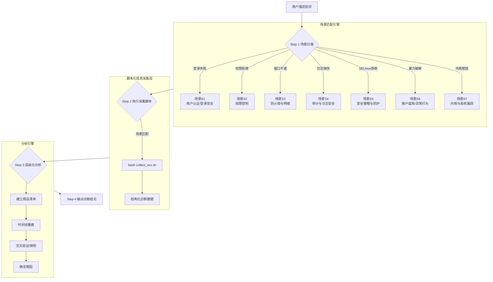
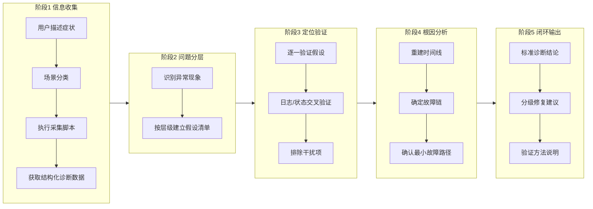

# Linux 安全故障诊断 Agent：当 AI 学会"取证式排查"

## 概述

"我的服务器登录不了"——这条看似简单的告警背后，可能是 PAM 配置被误修改导致认证链断裂，可能是 SSSD 服务 OOM 崩溃导致域用户全部无法登录，可能是攻击者暴力破解触发了 pam_faillock 全量锁定，也可能是 SELinux 策略静默拒绝了关键服务。传统排查方式下，工程师需要手动执行十几条命令、翻阅多个日志文件、在脑海中构建故障链——整个过程高度依赖个人经验，且极易遗漏关键线索。

本文要拆解的，是 Witty 智能诊断 Agent 中的 **linux-security-diagnosis Skill**——一套让 AI Agent 能够"像安全专家一样取证"的结构化诊断方法论。我们将从 Agent 的视角，深入分析它如何将 Linux 安全故障排查从"猜谜游戏"转变为"证据链闭环"。

## 一、背景：Linux 安全诊断为什么这么难？

### 1.1 问题的本质：多层安全机制叠加

Linux 的安全体系并非单一防线，而是由 **认证层 → 权限层 → 网络层 → 审计层 → 策略层 → 行为层 → 内核层** 七层机制叠加而成。一次"无法登录"的表现，可能是其中任意一层或多层联合故障的结果：

```text
用户尝试登录
    │
    ├── 认证层: PAM 链是否断裂？SSSD 是否在线？
    ├── 权限层: ~/.ssh/authorized_keys 权限是否为 600？
    ├── 网络层: 防火墙 DROP 规则是否拦截了端口？
    ├── 审计层: auditd 是否已停止？日志是否被清理？
    ├── 策略层: SELinux 是否在 Enforcing 模式拒绝访问？
    ├── 行为层: 是否正在遭受暴力破解？账户已被锁定？
    └── 内核层: 是否存在已知提权漏洞？内核参数是否安全？
```

**核心痛点在于：如果工程师不具备跨层知识，就会在错误的方向上浪费大量时间。**

### 1.2 传统排查方式的缺陷

- **线性试错**：凭经验猜测方向，猜错了就回溯，效率完全取决于个人经验
- **信息孤岛**：各安全模块的日志分散在 `/var/log/secure`、`/var/log/audit/audit.log`、`journald`、`/var/log/sssd/*.log` 等多个位置，工程师需要手动关联
- **时间压力**：安全故障往往伴随持续的攻击或系统不可用，排查窗口期极短
- **隐式知识**：资深工程师的"直觉"很难传递和复现——比如看到 `avc: denied` 就知道先 `setenforce 0` 验证，再 `restorecon` 修复，这个思维链从未被显式建模

### 1.3 Agent 的设计目标

1. **将隐性知识显式化**：把资深安全工程师的排查思维固化为可执行的五阶段流程
2. **证据链闭环**：每个结论至少源自 2 个独立数据源的交叉验证
3. **脚本化信息采集**：一次性采集完整上下文，减少执行往返
4. **跨层关联**：自动识别安全故障的跨层传播路径
5. **可复现的诊断输出**：标准化的诊断结论格式，便于运维人员直接使用

## 二、设计思路：Agent 是如何"思考"安全故障的？

### 2.1 总体架构

linux-security-diagnosis 的核心架构围绕 **"症状 → 场景分类 → 定向采集 → 分层分析 → 证据验证 → 根因结论"** 这条主线展开：



**架构特点：**

- **场景驱动**：通过用户描述的症状直接路由到对应场景，避免 Agent 在 7 个安全类别中盲目搜索
- **脚本隔离**：每个场景对应独立的采集脚本，模块化设计，可独立演进
- **数据分析与采集分离**：脚本只负责采集原始数据，分析推理由 Agent 的 LLM 能力完成——这符合"工具调用者"与"推理者"的分离原则

### 2.2 核心设计原则

#### 原则一：层级化分析（Hierarchical Analysis）

这是整个 Skill 最核心的方法论。安全故障按固定优先级层级排查：

```text
认证层   →  权限层   →  网络层   →  审计层   →  策略层   →  行为层   →  内核层
 (S1)       (S2)       (S3)        (S4)        (S5)        (S6)        (S7)
```

**为什么是这个顺序？** 因为安全故障的传播方向通常是 **上层故障向下层传导**。如果认证层（PAM）已经断裂，那么检查权限层（SELinux）或网络层（iptables）就是无效的。按此顺序排查能最大化"尽早排除"的效率。

#### 原则二：证据驱动（Evidence-Driven）

所有假设必须通过脚本采集的日志、监控或系统状态来验证。这意味着：

- Agent 不能仅凭用户描述的"登录不了"直接给出结论
- 必须执行脚本获取关键证据（如 `journalctl -u sshd` 的输出、`/etc/pam.d/sshd` 内容、`faillock --user` 结果等）
- 每个结论至少需要 2 个独立数据源交叉印证

#### 原则三：脚本优先（Script-First）

```bash
# 不好的做法：逐条命令执行（往返多、上下文碎片化）
ssh> systemctl status sshd
ssh> cat /etc/pam.d/sshd
ssh> journalctl -u sshd | tail -40

# 好的做法：一次性采集完整上下文
bash scripts/collect_auth.sh username 2>&1
# 一次性输出：账户状态 + PAM配置 + SSH状态 + SSSD状态 + 日志 + IP统计
```

**设计考量：** 每次远程执行都有网络延迟。对于 Agent 来说，"执行 1 个脚本返回 200 行结构化数据"远比"执行 10 次命令各返回 20 行"高效——前者保留了一次性关联分析所需的完整上下文，后者则因多次往返可能丢失时序关系。

#### 原则四：根因穿透（Root Cause Penetration）

要求 Agent 给出"故障链+时间线"，而非孤立结论。例如：

```text
错误输出："SSH 登录失败是因为 pam_faillock 触发了账户锁定。"

正确输出：
故障链：LDAP 响应超时 (T1) → SSSD 多次重试失败 (T2) → SSSD OOM 崩溃 (T3)
      → pam_sss 返回失败 (T4) → SSH 返回 "Permission denied" (T5)
关键证据：
  1. journalctl -u sssd 显示 "Out of memory" (T2-T3)
  2. sssctl domain-status 显示 offline (T4)
  3. /var/log/secure 中所有域用户的失败均在 T5 之后
```

#### 原则五：闭环输出（Closed-Loop Output）

诊断结论有严格的标准格式，包含：故障根因、故障组件、故障时间、影响范围、风险等级、故障链与时间线、关键证据、已排除的假设、为什么一定是此根因、修复建议（P1/P2/P3 分级）、验证方法。

> **Note:** 这种格式设计借鉴了 ITIL 事件管理的最佳实践，将诊断结果直接对接运维变更流程。

### 2.3 五阶段流程

Agent 实际执行诊断时，遵循五个阶段：



**特别说明：**

- 阶段 1 和阶段 2 可以并行（在执行脚本的同时建立初步假设框架）
- 阶段 3 的"交叉验证"是区分"资深工程师"和"初级工程师"的关键——初级工程师看到 1 条证据就下结论，资深工程师需要 2-3 条独立证据链交叉确认
- 阶段 4 的"最小故障路径"指的是：在整个故障链中，找到那个最优干预点（通常是修复成本最低的环节）

## 三、实现原理：Agent 的"工具箱"是如何工作的？

### 3.1 七场景分类引擎

Skill 定义了 7 个安全场景（S1-S7），每个场景对应一个采集脚本和一份专家参考文档。Agent 通过用户描述中的"关键词"自动路由：

| 场景 | 安全类别 | 触发关键词 | 采集脚本 | 参考文档 |
|:---:|:---------|:-----------|:---------|:---------|
| S1 | 用户认证/登录安全 | 无法登录、SSH失败、账号锁定 | `collect_auth.sh` | `references/s1_auth.md` |
| S2 | 权限控制 | 权限拒绝、服务启动失败 | `collect_permission.sh` | `references/s2_permission.md` |
| S3 | 防火墙与网络访问 | 端口不通、连接被拒 | `collect_network.sh` | `references/s3_network.md` |
| S4 | 审计/日志安全 | 日志缺失、auditd异常 | `collect_audit.sh` | `references/s4_audit.md` |
| S5 | 安全策略与防护 | SELinux拒绝、AppArmor异常 | `collect_selinux.sh` | `references/s5_selinux.md` |
| S6 | 账户滥用/异常行为 | 暴力破解、异常登录 | `collect_account_abuse.sh` | `references/s6_account.md` |
| S7 | 内核/系统漏洞 | 内核模块异常、补丁缺失 | `collect_kernel.sh` | `references/s7_kernel.md` |

**为什么是 7 个而不是更多？** 这 7 个场景覆盖了 Linux 安全从"用户入口"到"内核底层"的全链路。每个场景在安全攻防领域中都有明确的定位：

- S1-S3：**主动防御层**（认证、权限、网络），最常接触到用户的交互
- S4-S5：**被动监控层**（审计、策略），负责记录和强制策略执行
- S6-S7：**威胁检测层**（行为、内核），关注已发生的异常和底层风险

### 3.2 采集脚本的设计模式

所有 8 个采集脚本遵循统一的设计模式。以 `collect_auth.sh` 为例，其结构如下：

```bash
# ═══════════════════════════════════════
#  脚本元信息层
# ═══════════════════════════════════════
# 场景：用户无法登录、SSH失败、账号锁定、PAM/SSSD/LDAP异常
# 用法：bash collect_auth.sh [username]

# 输出结构化诊断数据...（开头带分割线标记）

# ═══════════════════════════════════════
#  数据采集层 - 按模块组织
# ═══════════════════════════════════════
# [1] 系统基础信息（hostname, OS, kernel, uptime）
# [2] 账户状态（id, chage, shadow, faillock）
# [3] PAM 配置（pam.d/sshd, system-auth, password-auth）
# [4] SSH 服务状态与配置（systemctl, sshd_config）
# [5] SSSD/LDAP 服务状态（systemctl, sssd.conf, getent）
# [6] 近期认证日志（journalctl, secure log）
# [7] 失败来源IP统计
# [8] 密码策略配置

# ═══════════════════════════════════════
#  结束标记层
# ═══════════════════════════════════════
# "采集完成 AUTH COLLECTOR END"
```

**设计要点：**

1. **模块化分段**：每个采集区域用 `── [N] 标题 ──` 分隔，便于 Agent 或人类快速定位
2. **多数据源兜底**：每条信息尝试 2-3 种获取方式（优先 journalctl，fallback 到日志文件），适应不同发行版
3. **参数化**：支持传入 `username`、`port`、`keyword` 等参数，避免采集无关数据
4. **标准头尾**：每个脚本以 `══════` 分隔线开始和结束，便于在大段输出中识别边界
5. **错误容错**：每个命令用 `2>&1` 或 `||` 处理失败情况，确保一个模块失败不影响其他模块

**一个值得注意的细节：** `collect_all.sh` 的设计。它不是简单串行执行所有脚本，而是对每个子脚本的输出用 `head -N` 做了截断：

```bash
bash "$SCRIPT_DIR/collect_auth.sh" 2>&1 | grep -v "^$" | head -80
bash "$SCRIPT_DIR/collect_audit.sh" 2>&1 | grep -v "^$" | head -60
# ...
```

这是**场景不明确时的"快速概览"策略**——先用精简模式覆盖所有安全维度，当 Agent 发现某一维度的异常后，再建议用户运行对应专项脚本进行深入采集。

### 3.3 专家参考系统（Knowledge Base）

7 个 `references/s*.md` 文件构成了 Skill 的专家知识库。每个文件包含：

- **故障模式库**：常见的故障链模型（如 SSSD 崩溃 → 域用户全部无法登录）
- **关键配置解读**：PAM control 标志含义、sshd_config 关键配置、SELinux 布尔值说明
- **日志关键字速查**：特定日志模式到根因的映射
- **诊断命令序列**：推荐的排查步骤和命令
- **根因决策树**：分层的 if-then-else 排除逻辑

以 `s1_auth.md` 中的根因决策树为例：

```text
登录失败
  ├── 只有域用户失败，本地账户正常？
  │     YES → SSSD/LDAP 问题（检查 sssd 状态和 LDAP 连通性）
  │     NO  → 继续
  │
  ├── 所有用户都失败（包括 root）？
  │     YES → PAM 配置损坏 或 sshd 配置问题
  │     NO  → 继续
  │
  ├── 特定用户失败？
  │     → 账户状态（chage -l, /etc/shadow 前缀）
  │     → faillock/pam_tally2 锁定状态
  │
  └── 失败发生在 SSH 连接阶段（not even prompt）？
        YES → 防火墙/sshd 服务/AllowUsers 问题
        NO（有密码提示但拒绝）→ PAM 认证问题
```

**Agent 如何使用这些知识？** 当 Agent 执行完 `collect_auth.sh` 拿到原始数据后，会加载 `references/s1_auth.md` 中的决策树，结合采集数据中的具体证据，沿着决策路径逐步排除，最终锁定根因。这相当于把一位资深安全工程师的"思维模型"注入了 Agent 的推理过程中。

### 3.4 故障链与时间线重建

这是 Agent 区别于"简单脚本输出"的核心能力。故障链重建需要：

1. **提取时间戳**：从多种日志源（`/var/log/secure`、`/var/log/audit/audit.log`、`journalctl`）提取带时间的事件
2. **按时间排序**：将所有事件按时间轴排列
3. **识别因果关系**：确定哪一个是初始触发事件，哪些是衍生事件
4. **排除噪声**：区分相关事件和巧合事件

在脚本层面，`collect_account_abuse.sh` 中的 Python 内联脚本展示了时间线重建的雏形：

```python
# 合并 secure + audit + messages，按时间排序
events = []
# 从 /var/log/secure 读取登录事件
# 从 audit.log 读取审计事件
events.sort(key=lambda x: x[0])  # 按时间排序
for t, src, msg in events[-100:]:
    print(f"[{t.strftime('%H:%M:%S')}][{src:6s}] {msg}")
```

**关键时间点标记：**

- 第一次出现失败登录的时间 → **攻击开始时间**
- 密集失败时间段 → **暴力破解窗口**
- 成功登录时间 → **入侵成功时间**（如有）
- sudo/su 操作时间 → **提权时间**
- 日志 gap 时间 → **可能的日志清理时间**

### 3.5 标准诊断结论模板

Skill 定义了一个强制性的诊断结论输出模板。其设计理念是——**让 AI 的输出和人类的运维流程无缝对接**：

```markdown
═══════════════════════════════════════════════════════
                  安全故障诊断结论
═══════════════════════════════════════════════════════
【故障根因】  一句话说明根本原因
【故障组件】  具体的服务/配置文件/模块名称
【故障时间】  首次异常时间戳（来源于日志）
【影响范围】  影响的用户/服务/系统功能
【风险等级】  高/中/低 + 说明

【故障链与时间线】
  T1: [时间] 事件A（来源：xxx日志）
  T2: [时间] 事件B，由A触发/导致（来源：xxx）
  T3: [时间] 故障最终表现（来源：xxx）

【关键证据】
  1. [日志/命令输出片段] → 说明含义
  2. [日志/命令输出片段] → 说明含义

【已排除的假设】
  - 假设X：排除原因（具体证据说明为何排除）
  - 假设Y：排除原因

【为什么一定是此根因】
  证据A + 证据B + 排除其他假设 → 唯一结论

【修复建议】（分级）
  P1（立即）：最紧急的修复动作
  P2（当天）：重要但非立即的修复项
  P3（计划）：长期加固建议

【验证方法】
  修复后如何验证问题解决
═══════════════════════════════════════════════════════
```

**为什么设计成"必须填写所有字段"？** 运维人员拿到诊断报告后的典型工作流是：

1. 看【故障根因】和【风险等级】—— 决定优先级
2. 看【修复建议】—— 直接执行 P1 操作
3. 看【验证方法】—— 确认修复是否有效
4. 看【已排除的假设】—— 避免走弯路

如果遗漏了任何一个字段，运维人员就需要追问，这会打破"自动化诊断→自动化修复"的期望。

## 四、设计权衡

### 4.1 脚本深度 vs 采集广度

每个采集脚本需要在"采集足够数据支持分析"和"不采集无用冗余数据"之间平衡：

| 取舍维度 | 倾向 | 原因 |
|:---------|:-----|:-----|
| 日志时间范围 | 24 小时（默认） | 足够覆盖大部分安全事件，同时避免数据过大 |
| 失败IP统计 | TOP 15-20 | 展示主要攻击源，忽略长尾 |
| 命令输出行数 | tail 20-50 | 聚焦最新事件，保留历史但限制长度 |
| 关键词过滤 | 可选参数 | 精确采集 vs 全面扫描由用户指定 |

### 4.2 自动化程度 vs 专家判断

Skill 的设计者做了一个清醒的选择——**脚本采集尽可能自动化，但分析推理交给 Agent 的 LLM 能力**。这意味着：

- **自动化采集**：脚本封装了所有命令，减少了执行往返，确保数据完整性
- **人类/LLM 推理**：假设建立、证据交叉验证、排除干扰项、根因推导——这些需要"理解"和"判断"的步骤，交给 LLM 或人类专家

这种取舍的合理性在于：**安全诊断中的"因果推理"目前仍高度依赖经验**。一个固定的规则引擎可以覆盖 80% 的常见场景，但无法处理那 20% 的复杂跨层故障。让 LLM 做推理，让脚本做采集，是当前阶段最有效的分工。

### 4.3 CentOS/EulerOS/Anolis 优先 vs 全发行版覆盖

Skill 明确声明优先兼容 CentOS/EulerOS/Anolis 等系列。这在脚本中处处可见：

- 使用 `systemctl`（而非 `service`）
- 使用 `journalctl`（而非仅读取日志文件）
- 使用 `iptables/firewalld`（而非 nftables 优先）

**对使用者的影响**：如果目标系统是 Ubuntu/Debian，部分日志路径和命令可能不同（如 `/var/log/auth.log` vs `/var/log/secure`），Agent 需要利用脚本中的 fallback 逻辑来处理差异。

### 4.4 采集脚本的静态 vs 动态策略

当前的采集策略是**静态的**——每个脚本固定采集哪些数据。在极端情况下（如 `/var/log` 达到 100GB），`journalctl --since "24 hours ago"` 仍然会输出大量数据。一个更动态的策略可能是：先检查日志大小，再决定采集时间窗口。但这会增加脚本复杂度，目前的设计倾向于保持脚本简单可靠。

## 五、使用指南：Agent 视角的典型诊断流程

### 5.1 场景一：用户无法登录

**用户输入：** "无法 SSH 登录服务器，root 账户提示 Permission denied"

**Agent 执行流程：**

1. **场景识别**：关键词"无法登录" + "SSH" + "Permission denied" → 场景 S1
2. **执行采集**：`bash scripts/collect_auth.sh root 2>&1`
3. **分析采集结果：**
   - 检查 PAM 配置中的 `pam_unix.so` 是否存在 → 确认认证链完整
   - 检查 `faillock --user root` 的失败计数 → 判断是否触发锁定
   - 检查 `journalctl -u sshd` 中的失败类型 → 区分"密码错误"与"策略拒绝"
   - 检查 `/etc/ssh/sshd_config` 中 `PermitRootLogin` 的值
4. **假设验证：**
   - **假设 A**：PAM 配置损坏 → PAM 文件存在 `pam_unix.so`，排除
   - **假设 B**：账户锁定 → `faillock --user root` 无失败记录，排除
   - **假设 C**：`PermitRootLogin no` → 配置文件中确实是 `no`，确认
5. **输出诊断结论：** PermitRootLogin 设置为 no，建议修改为 yes 或使用非 root 账户登录

### 5.2 场景二：SELinux 拒绝导致服务失败

**用户输入：** "Web 服务器启动后返回 403"

**Agent 执行流程：**

1. **场景识别**：关键词"服务启动" + "403" → 场景 S2（权限），同时检查 S5（SELinux）
2. **执行采集**：`bash scripts/collect_selinux.sh httpd 2>&1`
3. **分析采集结果：**
   - 检查 `ausearch -m avc -ts today` 中的 AVC 拒绝记录
   - 检查 `ls -laZ /var/www/html/` 的 SELinux 上下文
   - `setenforce 0` 后验证（操作后恢复）
4. **假设验证：**
   - **假设 A**：文件权限错误 → 权限是 755，排除
   - **假设 B**：SELinux 标签错误 → AVC 日志显示 `httpd_t` 试图访问 `user_home_t`，确认
5. **输出诊断结论：** 文件 SELinux 标签错误，建议 `restorecon -Rv /var/www/html/`

### 5.3 场景三：暴力破解检测

**用户输入：** "系统很慢，怀疑被攻击"

**Agent 执行流程：**

1. **场景识别**：关键词"攻击" → 场景 S6
2. **执行采集**：`bash scripts/collect_account_abuse.sh 24 2>&1`
3. **分析采集结果：**
   - 检查 `lastb` 统计失败 IP 和账户
   - 检查是否"大量失败后突然成功"（突破迹象）
   - 检查 `fail2ban-client status sshd` 判断防护是否生效
4. **假设验证：**
   - **假设 A**：普通密码错误 → 同一个 IP 失败 200 次 + 10 个不同用户名 → 暴力破解确认
   - **假设 B**：已突破防护 → `Accepted` 日志中有攻击源 IP，确认已被突破
5. **输出诊断结论：** 暴力破解已成功入侵，需要立即处理

## 六、总结

linux-security-diagnosis Skill 的设计，本质上是回答了一个问题：**"如何让一个 AI Agent 像资深安全工程师一样排查 Linux 安全故障？"**

它的答案是五个精心设计的原则：

- **层级化分析**——让排查方向有确定性，而非靠猜测
- **证据驱动**——让每个结论有数据支撑，而非空口断言
- **脚本优先**——让信息采集高效完整，而非碎片化往返
- **根因穿透**——让结论包含故障链，而非孤立的现象
- **闭环输出**——让诊断结果可直接对接运维流程，而非留下追问空间

这种设计思维不仅适用于 Linux 安全诊断。任何需要"结构化决策"的场景——网络故障排查、数据库性能优化、应用异常定位——都可以借鉴这种"从症状到根因"的显式化建模方法。毕竟，Agent 的终极价值不是替代专家，而是**让专家的思维方式可复制、可执行、可迭代**。
