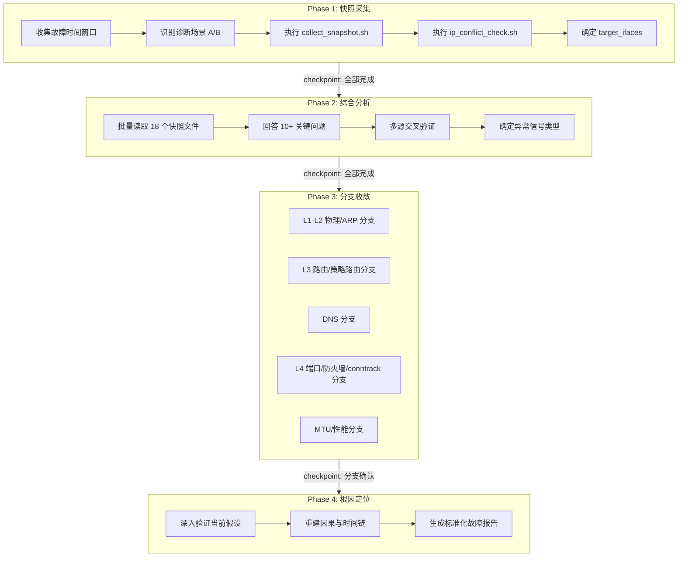
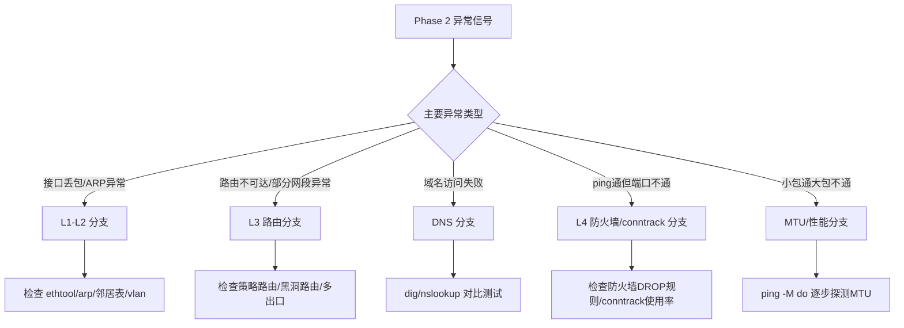

# 网络故障诊断：Agent 的四步穿透式排查方法论

## 概述

网络故障诊断是运维领域最复杂、最令人头疼的任务之一——链路层、网络层、传输层、应用层层层交织，ARP 表满、MTU 不匹配、防火墙规则误配、路由黑洞、IP 冲突……任何一个环节出问题，表象可能都是"不通"这两个字。而传统排查依赖工程师从 `ping` 开始逐层手动探测，过程冗长且容易遗漏关键线索。

Witty 诊断 Agent 内置的 network-diagnosis 技能，采用了一种**快照先行、分层收敛、证据驱动的系统化诊断方法论**——不是靠猜测，而是通过一次性采集 18 类快照数据，再逐层交叉验证，最终收敛到根因。本文将站在 Agent 视角，完整拆解这套四步诊断工作流的架构设计与实现原理。

## 背景

### 痛点分析

在实际诊断过程中，Agent 面对的最大挑战是网络问题的**非确定性与多源性**。一个"网络不通"的告警，背后可能是物理链路抖动（L1）、ARP 表满载（L2）、路由被策略路由劫持（L3）、防火墙 DROP 规则命中（L4）、MTU 导致分片丢失（L3.5），甚至是 conntrack 表溢出导致的连接无法建立。传统排查模式存在三个系统性缺陷：

1. **信息不全**：人工操作逐个命令执行，容易出现重复劳动或遗漏关键检查项（如 conntrack 使用率、ARP gc_thresh 配置）。
2. **因果混淆**：单一异常可能被多个证据推翻。例如"ping 不通"可能是防火墙 DROP 了 ICMP，也可能路由不存在，这两者的修复思路完全不同。
3. **经验依赖**：资深工程师凭直觉就能快速定位，但新手容易在错误分支上越走越远。Agent 需要将专家级排查思维固化到可复用的流程中。

### 设计目标

这套 network-diagnosis 技能的设计目标可概括为：

- **证据先行**：不假设、不猜测，通过 18 类快照数据一次性采集，杜绝"边采集边分析"的碎片化思维。
- **分层收敛**：用"快照采集 → 综合分析 → 分支收敛 → 根因定位"四步流程替代线性排查，每一阶段都有严格的完成检查点（checkpoint），确保诊断质量。
- **场景自适应**：根据用户描述自动识别"指定接口故障"和"整机异常"两种场景，诊断范围智能缩放。
- **只诊断、不修复**：不允许 Agent 自动执行修复命令，但提供标准化、风险分级的修复建议模板，确保安全红线不被突破。

## 设计方案

### 整体架构

network-diagnosis 技能的架构设计遵循**分层流水线（Pipeline）**模式，整个诊断流程被严格划分为四个串行阶段，每个阶段有明确的输入、输出和完成检查点：



**四个阶段的职责划分：**

| 阶段 | Agent 角色 | 核心产出 | 关键原则 |
|:---:|:---|:---|:---|
| Phase 1 | 数据采集者 | 时间戳快照目录 + 18 个 `.txt` 文件 | 采集与分析分离，禁止边采边分析 |
| Phase 2 | 综合分析者 | 异常信号清单 + 交叉验证结论 | 禁止早停，必须读完所有文件 |
| Phase 3 | 分支收敛者 | 故障层级定位 + 初步故障假设 | 按需深入，不做全网体检 |
| Phase 4 | 根因报告者 | 标准化故障报告 + 修复建议 | 提供风险分级建议，禁止自动执行 |

### 核心设计理念

#### 1. 时间窗口驱动的日志过滤

这是整套技能的第一个关键设计决策：**在采集任何数据之前，必须先确定故障时间窗口**。为什么？

网络设备的日志是环形缓冲区（如 dmesg）或滚动存储（如 journalctl），如果不加时间过滤，Agent 可能会将三天前的 "conntrack: table full" 告警当作当前根因。设计采用了以下策略：

- Agent 根据用户描述（"刚才"、"今天上午"、"间歇性"）映射到不同时间窗口长度，使用绝对时间输出；
- 所有日志分析命令（dmesg、journalctl）在采集时即带上 `--since` / `--until` 参数；
- 超出时间窗口的告警被明确标记为"历史告警"，不纳入诊断结论。

这背后的设计哲学是：**诊断的精确性取决于时间维度的对齐**。

#### 2. 场景自适应：场景 A 聚焦 vs 场景 B 全量

设计上明确区分两种诊断场景：

- **场景 A（指定网口）**：用户说"eth0 不通"——Agent 的使命是解释"eth0 为什么不通"，而不是转向分析其他看起来"更异常"的接口。
- **场景 B（整机异常）**：用户说"服务器网络不稳定"——Agent 必须全量覆盖所有 UP 接口，检查所有路由表和 IP 冲突。

这一设计并非技术复杂度上的挑战，而是**认知层面的设计选择**——Agent 必须严格遵循用户的关注点，而不能自作主张。SKILL.md 中花了大量篇幅定义场景 A 的错误示例（如 "enp4s0 无 IP → 跳过 → 分析 enp3s0"），本质上是在给 Agent 建立一套**注意力约束机制**。

#### 3. 多源交叉验证

Phase 2 中的交叉验证表是设计中最具"专家思维"的部分：

| 判断类型 | 必须交叉验证的数据源 |
|:---|:---|
| IP 冲突 | `ip_conflict_check.txt` ↔ `ip_addr.txt`（MAC 地址比对） |
| 防火墙阻止 | `firewall_iptables.txt` ↔ `firewall_nft.txt`（规则存在性 + pkts > 0） |
| ARP 表满 | `arp_table_status.txt` ↔ `dmesg_log.txt`（使用率 + 内核日志确认） |
| MTU 问题 | `mtu_status.txt` ↔ `ping_<dest>.txt`（路径探测 + 连通性对比） |

设计意图很明确：**单一数据源不可信**。Agent 被强制要求从多个独立数据源交叉验证同一判断，只有当证据链形成闭环时，才能输出结论。这模拟了资深工程师"看到 DROP 规则还要确认 pkts > 0"的审慎思维。

#### 4. 安全红线：只诊断不修复

network-diagnosis 在架构上做了明确的职责分离：

- **诊断阶段**（Phase 1-4）：只读操作，Agent 执行命令采集数据、分析日志、生成报告。
- **修复阶段**：Agent 仅提供修复建议，且必须标注风险等级（高危/中危/低危），高危操作必须附带回滚方案。

这一设计的深层考量是：网络配置的变更风险极高——改一条错误的路由规则可能导致整个机房断网。Agent 作为诊断工具，其核心价值在于"精准定位错误"，而非"替工程师做决策"。

### 扩展性设计

#### 故障模式库（Fault Model）的预留接口

在快照采集脚本中，可以看到三个故障模式预留标记：

- `FM_NET_003`：ARP 表满载（`arp_table_status.txt`）
- `FM_NET_006`：MTU 不匹配（`mtu_status.txt`）
- `FM_NET_007`：conntrack 表满载（`conntrack_status.txt`）

这些 `FM_NET_XXX` 标签是**故障模式库（Fault Model）的索引**。

## 实现原理

### 核心流程详解

#### Phase 1：快照采集 - Agent 如何在一分钟内获取全量网络状态？

Agent 调用 `collect_snapshot.sh`，这是整个诊断的数据基础。脚本的核心设计是**一次性获取、结构化落盘**：

```bash
# Agent 实际执行的命令示例（场景 B：整机异常）
bash scripts/collect_snapshot.sh \
  --out /tmp/net_diag \
  --since "2026-03-23 10:00" \
  --until "2026-03-23 10:30" \
  --dest 8.8.8.8
```

脚本内部的核心机制是两个辅助函数 `run()` 和 `run_sh()`：

```bash
run() {
  local name="$1"
  shift
  local file="${out_dir}/${name}.txt"
  {
    echo "## cmd: $*"              # 记录执行的命令
    echo "## time: $(date -Is)"     # 记录采集时间
    echo "## host: $(hostname)"     # 记录主机名
    echo
    "$@"                           # 执行命令，输出重定向到文件
  } >"${file}" 2>&1
}
```

**设计考量**：每个 `.txt` 文件头部都包含 `cmd`、`time`、`host` 元信息，这使得：

- Agent 在 Phase 2 读取时可以明确知道每份数据的来源和时间
- 跨主机诊断时，通过 `host` 字段区分不同机器的数据
- 时间戳可用于验证数据是否在故障时间窗口内采集

**IP 冲突检测**是单独执行的，因为 `arping` 需要主动发送探测包，和被动采集快照是两种不同的数据获取模式：

```bash
# Agent 执行 IP 冲突检测
SNAPSHOT_DIR=$(ls -td /tmp/net_diag/snapshot_* | head -1)
bash scripts/ip_conflict_check.sh --iface eth0 > ${SNAPSHOT_DIR}/ip_conflict_check.txt 2>&1
```

`ip_conflict_check.sh` 的核心逻辑：

1. 遍历目标 IP 列表（指定接口 IP 或所有全局 IP）
2. 对每个 IP 执行 `arping -D -c 2 -w 2` 发送重复地址探测
3. 如果收到响应，将响应 MAC 与本机所有接口 MAC 比对
4. 若响应 MAC 不在本机 MAC 列表中 → 确认 IP 冲突

#### Phase 2：综合分析 - Agent 如何避免"只见树木不见森林"？

这是整个诊断流程中最具认知科学色彩的一步——**强制"先读完全文、再开始推理"**。

```text
# Agent 的执行逻辑伪代码
function phase2_analysis() {
    # Step 1: 只读不分析
    files = read_all([
        "ip_link_stats.txt",
        "iface_<iface>_details.txt",
        "ip_route_main.txt",
        "arp_table_status.txt",
        "firewall_iptables.txt",
        "conntrack_status.txt",
        // ... 共 18 个文件
    ])
    
    # Step 2: 所有文件读取完成前，禁止任何分析
    wait_for_all(files)
    
    # Step 3: 统一分析
    anomalies = []
    for each file in files:
        anomalies += extract_anomalies(file)
    
    # Step 4: 交叉验证
    for each finding in anomalies:
        cross_validate(finding)
    
    return conclusions
}
```

**设计意图**：人类工程师在排查时，经常因为"先看到一个可疑信号"而过早锚定结论（confirmation bias）。Agent 被编程为必须在读完所有 18 个文件后才能开始分析，这一限制是设计上刻意引入的**认知防偏机制**。

以 ARP 表满为例，Agent 的分析链路是：

1. 从 `arp_table_status.txt` 读取使用率（如 195%）
2. 从 `ip_link_stats.txt` 读取目标接口的 `RX dropped`（如 356190）
3. 从 `dmesg_log.txt` / `journal_kernel.txt` 在时间窗口内搜索 ARP 相关告警
4. 交叉验证：ARP 使用率 >= 90% + RX dropped 异常 + 内核日志中有邻居表相关告警
5. **只有三者同时成立**，Agent 才能判定"ARP 表满是该接口丢包的根本原因"

#### Phase 3：分支收敛 - Agent 如何选择正确的排查路径？

分支收敛是设计中最体现"假设-验证"范式（Hypothetico-Deductive）的环节。Agent 根据 Phase 2 中识别出的异常信号，选择最可能的分支深入：



设计上刻意限制每个分支只执行少量高价值检查，而非在该层级做全面扫描。这一"节俭探针"策略的出发点是：

- 网络诊断中 80% 的问题集中在 20% 的常见故障模式（ARP 表满、防火墙规则误配、路由配置错误）
- 过早进入深度排查可能导致资源浪费在错误的分支上
- Agent 可以快速验证/排除最可能的假设，如果该分支无法解释所有现象，则回溯到决策点重新选择

#### Phase 4：根因定位 - Agent 如何生成标准化报告？

最终输出的故障报告被设计为结构化的模板，每一部分都有明确的产出要求：

```markdown
## 1. 总结
| 故障时间窗口 | <故障发生的开始时间 - 结束时间> |
| 诊断执行时间 | <执行诊断的时间点> |
| 影响范围 | <受影响服务/功能/用户范围> |
| 根因 | <一句话根因结论> |
| 等级 | <严重/高/中/低> |

## 2. 故障路径分析
<节点A> -> <中间故障节点> -> <上游影响> -> <用户侧影响>

## 4. 修复建议
**建议 N：<简短描述>**
- 风险等级：🔴/🟡/🟢 <等级文字>
- 风险提示：<具体风险说明>
- 操作命令：<建议执行的命令>
- 回滚方案：<高危操作必须提供>
```

报告中修复建议的风险分级是安全设计的核心体现：

| 等级 | 标识 | 示例操作 | 回滚方案要求 |
|:---|:---:|:---|:---:|
| 高危 | 🔴 | 重启网络服务、修改核心路由、关闭防火墙 | 必须提供 |
| 中危 | 🟡 | 修改单条防火墙规则、添加静态路由 | 推荐提供 |
| 低危 | 🟢 | 查看配置、清理过期连接 | 可选 |

### 状态管理

network-diagnosis 的状态管理体现在检查点（checkpoint）机制上：

```text
Phase 1 完成检查点 → Phase 2 完成检查点 → Phase 3 完成检查点 → Phase 4 报告输出
     ↓                    ↓                    ↓
  必须满足 5 个条件     必须满足 4 个条件     必须满足 4 个条件
```

Agent 在进入下一阶段前，必须显式验证当前阶段的检查点全部通过。这一机制起到了两个作用：

1. **保证诊断质量**：防止跳过关键步骤导致的误诊
2. **提供可审计性**：Agent 在任何时刻都可以明确知道自己处于诊断流程的哪个节点

### 边界处理

设计中针对多种边界情况有明确的处理策略：

- **arping 未安装**：`ip_conflict_check.sh` 输出 `SKIP` 标记并退出，Phase 2 中 Agent 将该检查标注为"未执行"而非"未发现冲突"
- **dmesg 日志被覆盖**：环形缓冲区可能已丢失历史记录，Agent 优先使用 `journalctl` 的时间窗口过滤能力
- **无 IPv4 地址可检查**：脚本输出 `NO_IPV4_ADDR_TO_CHECK`，Agent 判断该接口未配置 IP，但仍通过 ARP 表满等机制解释"不通"的原因
- **当前状态与日志矛盾**：如 conntrack 当前使用率 0% 但日志有 "table full" —— Agent 检查日志时间戳是否在时间窗口内，若日志是 3 天前的则标记为"历史告警"

## 设计权衡

### 快照完整性 vs 采集性能

Agent 的快照脚本在单次执行中串行采集 18 类数据。这是一种有意为之的**可移植性优先于性能**的设计选择——脚本中包含并行调用模板（`run_sh "name" "cmd" &`），但默认并未启用。

- **选择串行的理由**：确保在所有环境中都能稳定运行，避免并发导致的数据竞争（如某命令输出被另一命令截断）
- **代价**：采集耗时增加（通常在 10-30 秒，取决于接口数量和日志量）
- **适用场景**：运维场景中，30 秒的采集时间相比于数小时的人工排查，是可以接受的

### 规则刚性 vs 诊断弹性

SKILL.md 中充斥着"强制要求"、"绝对禁止"、"必须完成"等强约束语言。这种设计风格与通常的 AI Agent 指令（倾向于给予自由度）形成了鲜明对比。

- **选择的理由**：网络诊断的后果严重——错误结论可能导致工程师误操作。刚性规则确保 Agent 在安全边界内运作。
- **代价**：Agent 的诊断灵活性受限，无法应对未预定义的故障模式。
- **权衡点**：设计者选择了"可预测的确定性结论"而非"可能遗漏的全面覆盖"。

### 场景聚焦 vs 全局排查

场景 A 聚焦原则要求 Agent 严格锁定用户指定的接口，即使其他接口有更严重的异常也不能转移焦点。

- **选择的理由**：用户的问题必须被优先回答，转移焦点会破坏用户对 Agent 的信任。
- **代价**：可能遗漏其他接口存在的潜在风险，导致用户"修好了 A 问题，B 问题又爆发"。
- **缓解措施**：其他接口的异常作为"辅助参考"和"潜在风险提示"在报告中提及，但不作为诊断结论主体。

## 从 Agent 视角看：如何用这套技能完成一次诊断？

以下是 Agent 实际执行一次完整的 network-diagnosis 时的决策路径：

### 场景：用户说"服务器 192.168.1.100 的 eth0 接口间歇性断网"

**Step 1 — 确定时间窗口：**

```text
当前时间: 2026-03-23 17:13:00
用户描述: "刚才"
故障时间窗口: 2026-03-23 16:43 - 2026-03-23 17:13
```

**Step 2 — 场景识别 → 场景 A（指定网口 eth0）：**
Agent 明确锁定 eth0 为主要诊断对象。

**Step 3 — 采集快照 + IP 冲突检测：**

```bash
bash scripts/collect_snapshot.sh \
  --out /tmp/net_diag \
  --since "2026-03-23 16:43" \
  --until "2026-03-23 17:13" \
  --iface eth0 \
  --dest 192.168.1.100

bash scripts/ip_conflict_check.sh --iface eth0 > /tmp/net_diag/snapshot_*/ip_conflict_check.txt
```

**Step 4 — 综合分析：**
Agent 逐一读取 18 个快照文件，重点关注 eth0 相关数据。发现：

- `arp_table_status.txt`：ARP 使用率 195%（超过 gc_thresh3 硬上限 1024）
- `ip_link_stats.txt`：eth0 的 RX dropped = 356,190（异常）
- `dmesg_log.txt`：在故障时间窗口内发现 "neighbour: arp_cache: neighbor table overflow!"
- `ip_conflict_check.txt`：无 IP 冲突

**Step 5 — 交叉验证：**
Agent 确认：ARP 使用率 >= 90% + RX dropped 异常 + 内核日志确认 → **ARP 表满导致 eth0 丢包**。

**Step 6 — 分支收敛 → L1-L2 分支：**
Agent 进一步检查 ARP 表满的根因：`gc_thresh3` 配置过低（1024），而服务器运行了大量容器/虚机，ARP 条目远超预期。

**Step 7 — 故障报告输出：**

```markdown
# 故障报告

| 项目 | 内容 |
| ---- | ---- |
| 故障时间窗口 | 2026-03-23 16:43 - 2026-03-23 17:13 |
| 根因 | eth0 因 ARP 表满载（195%）导致入站数据包大量丢弃 |
| 等级 | 高 |

**建议 1：临时增大 ARP 表上限**
- 风险等级：🔴 高危
- 操作命令：`sysctl -w net.ipv4.neigh.default.gc_thresh3=2048`
- 回滚方案：`sysctl -w net.ipv4.neigh.default.gc_thresh3=1024`
```

这七步完整展现了 Agent 如何从模糊的用户描述出发，经过系统化的数据采集、分层分析、交叉验证，最终输出标准化的诊断结论。

## 总结

network-diagnosis 技能的设计体现了几个核心思想：

1. **数据驱动**：不依赖 Agent 的直觉或猜测，18 类快照数据是诊断的唯一依据。
2. **流程固化**：四步流水线 + 强制检查点 + 安全红线，将专家级排查思维编码为可执行的工作流。
3. **认知防偏**：禁止边采边分析、禁止早停、强制交叉验证——这些规则的存在是为了补偿 AI Agent 可能存在的"确认偏误"。
4. **安全内置**："只诊断不修复"的边界划分是架构层面的设计决策，而非后期补丁。

这套技能不是让 Agent 替代资深网络工程师，而是将工程师的排查方法论标准化、自动化，让 Agent 能在数分钟内完成原本需要数小时的系统化排查——说到底，**Agent 最大的价值不是比人类聪明，而是比人类更有纪律**。
