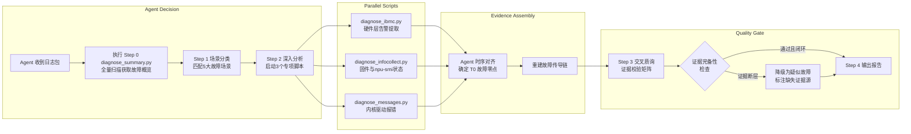

# 离线 NPU 故障诊断：昇腾服务器的"芯片法医"

## 概述

NPU（神经网络处理器）是 AI 训练的"心脏"。华为昇腾 Ascend 系列 NPU 承载着大规模 AI 集群中最密集的计算负载。当一颗 NPU 在运行中突然"掉卡"——设备状态变为 Offline、HBM 显存报出 Uncorrectable ECC Error、或者 PCIe 链路彻底断裂——运维工程师面临的往往是一场艰难的"数字刑侦"。故障痕迹散落在三个独立的日志孤岛中：iBMC 带外管理日志（硬件传感器与 SEL 事件）、OS Messages/dmesg（内核驱动栈）、InfoCollect 工具包（npu-smi 状态快照与固件信息）；每份日志都只能看到因果链的一个局部。

**离线 NPU 故障诊断**（Offline NPU Fault Diagnosis）是 Witty 智能诊断 Agent 体系中的一项专项技能，将资深硬件工程师排查 NPU 故障的完整方法论——包括多源日志时序对齐、PCIe/HBM 故障传导链重建、T0 故障零点定位、三级交叉质询——编码为一套可强制执行的诊断流水线。本文将从 Agent 的第一视角，深度解析 NPU 诊断的设计思想：**一张 NPU 卡突然"消失"，Agent 如何在 iBMC 的硬件告警、dmesg 的驱动报错、npu-smi 的状态快照之间重建因果链？如何区分"物理性硬件死亡"和"驱动层假死"？又如何在信息不全时守住"不知道就是不知道"的职业底线？**

## 背景：NPU 诊断，比 GPU 更难

### 当前挑战与痛点

**NPU 是一个比 GPU 更复杂的"黑盒子"。** 不同于 NVIDIA GPU 有标准化的 XID 错误代码和成熟的工具生态，华为昇腾 NPU 的诊断生态相对封闭，故障现象更加错综复杂。一张 NPU 的"消失"，其根因可能是以下五种截然不同的路径之一，而 Agent 必须在信息不全的情况下（离线日志包可能缺失某一层）快速缩小范围：

**HBM 显存物理击穿（NPU_HBM_PERFORMANCE）。** 这是最"沉默"的杀手。HBM（High Bandwidth Memory）直接堆叠在 NPU Die 旁边，其 ECC（Error Correcting Code）机制会在初期"掩盖"问题——单比特错误可以被自动纠正，直到不可纠正的多比特错误（UE）瞬间击穿整个计算任务。Agent 面临的挑战是：如何在 iBMC SEL 和 dmesg 中发现那些零星的 CE（Correctable Error）计数增长，将其与 T0 时刻的 UE 暴增关联起来，而这往往是运维报告中被忽略的"早期信号"。

**PCIe 链路故障（NPU_PCIE_LINK_ISSUE）。** NPU 通过 PCIe 4.0/5.0 与 CPU 通信，链路本身就是一个复杂的子系统。AER（Advanced Error Reporting）报错、Link Training 失败、设备 Missing——这些现象既可能是 NPU 金手指氧化或 Riser 卡虚接导致，也可能是 CPU Root Port 侧的 PCIe 控制器本身出了问题。Agent 需要区分"是 NPU 坏了"还是"是插 NPU 的槽坏了"——这对备件更换决策至关重要。

**NPU 核心硬件故障（NPU_HARDWARE_FAILURE）。** NPU Die 内部的计算核心、缓存、控制逻辑可能因物理缺陷或长时间高负载产生不可逆损坏。这种场景下，iBMC SEL 通常会直接报出 `Unrecoverable Hardware Error`，且 npu-smi 返回设备状态为 Offline。但 Agent 必须通过交叉验证排除 PCIe 链路误报的可能性，才能最终定性为"核心硬件故障"。

**驱动与软件栈不匹配（NPU_DRIVER_SW_STACK）。** 昇腾 NPU 依赖 CANN（华为 AI 计算框架）、Driver 和 Firmware 三者的版本精确匹配。运维操作中常见因驱动升级不完整、内核版本变更或固件版本不一致导致的"软故障"——NPU 物理在位且 PCIe 链路正常，但驱动加载失败或 Acl Error 持续报出。Agent 需要通过 InfoCollect 中截取的驱动版本包与 OS 内核日志比对，识别出这种"假硬件故障"。

**热电异常导致自我保护（NPU_THERMAL_POWER）。** 液冷或风冷散热异常、机柜 PDU 供电波动，都可能导致 NPU 触发 Thermal Throttling 降频甚至断电保护。这类故障的特征是：故障发生前 iBMC 温度传感器曲线急剧上升或供电电压出现异常波动，降温/恢复供电后设备可能自动恢复正常。Agent 需要精确对齐温度时间轴与故障 T0，才能做出"不是 NPU 坏了，是它太热了/没吃饱电"的判断。

### 设计目标

基于上述五大故障场景的差异化需求，离线 NPU 诊断技能确立了以下核心设计目标：

| 目标 | 说明 |
|:---|:---|
| **五场景精准分类** | 将混乱的故障现象映射到 5 种标准故障场景，为 Agent 提供明确的推理起点 |
| **T0 故障零点确定** | 从多源日志中找到最早的可观测异常时间戳，作为因果链重建的锚点 |
| **物理级精确定位** | 结论必须精确到 PCIe Slot ID + NPU ID，严禁模糊的"NPU 掉卡"论断 |
| **多源强制交叉质询** | 每个结论必须有 iBMC（硬件层）+ OS（内核层）+ InfoCollect（应用层）中至少两层的独立证据支撑 |
| **防发散保守机制** | 证据链断裂时强制降级为"疑似故障"，严禁基于不完整信息的确定性断言 |

## 设计思想：Agent 如何像芯片专家一样思考？

### 总体架构

离线 NPU 诊断技能遵循 Witty 诊断 Agent 体系的"Agent - Skill - Tool - Knowledge"四层解耦架构：

```mermaid
flowchart TB
    subgraph Agent Orchestration
        Scheduler[调度Agent\n任务编排与分发]
        Executor[执行Agent\n技能加载与执行]
        Fusion[融合Agent\n多技能结果汇总]
    end

    subgraph Skill Entry
        NPUSkill[offline-NPU-fault-diagnosis\nNPU故障诊断技能\nSKILL.md]
    end

    subgraph Diagnostic Tools
        Summary[diagnose_summary.py\nStep 0 故障日志采集]
        Ibmc[diagnose_ibmc.py\nStep 2 iBMC硬件分析]
        InfoCollect[diagnose_infocollect.py\nStep 2 InfoCollect分析]
        Messages[diagnose_messages.py\nStep 2 OS消息分析]
    end

    subgraph Knowledge Base
        Scenarios[NPU 故障场景库\n5大场景分类]
        ScenarioAnalysis[NPU 场景专项分析\n根因推理框架]
        VendorGuides[厂商 iBMC 指南\n华为/H3C/浪潮]
        MessagesGuide[OS 消息指南\ndmesg/messages 分析]
    end

    Scheduler -->|分发诊断子任务| Executor
    Executor -->|加载| NPUSkill
    NPUSkill -->|强制执行 5步流水线| Summary
    NPUSkill -->|Step 2 深入分析| Ibmc
    NPUSkill -->|Step 2 深入分析| InfoCollect
    NPUSkill -->|Step 2 深入分析| Messages
    NPUSkill -->|参考推理框架| Knowledge Base
```

这一架构的设计哲学是：**Agent 不做"日志爬虫"，Agent 做"推理决策者"**。Python 脚本是精确的"证据开采工具"——从海量日志中提取带时间戳的结构化异常事件。SKILL.md 中定义的强制执行流程和交叉质询规则是"证据裁判规则"——确保 Agent 不会在证据不全时跳跃到结论。知识库中的参考文档是"领域辞典"——帮助 Agent 理解 HBM ECC、PCIe AER、npu-smi 状态码等专业信号的准确含义。

### 核心设计：五步强制流程

NPU 诊断技能最核心的设计决策是：**将诊断流程编码为一套不可跳过的五步流水线（Step 0 → Step 1 → Step 2 → Step 3 → Step 4），每一步都有明确的"完成标志"**，Agent 必须完成当前步骤并验证通过后才能进入下一步。这个设计并非为了增加复杂度，而是针对 Agent 的"模型天性"——大语言模型在面临大量异构信息时天然倾向于"跳跃式推理"，可能跳过基础证据直接给出"看起来合理"的结论。

强制流程从根源上解决了三个关键问题：

- **避免"先入为主"的推理偏见。** 如果 Agent 直接看到 dmesg 中一个"NPU PCIe AER Error"，它可能会瞬间锁定"PCIe 链路故障"的结论，而忽略了 Step 0 中 iBMC 已经记录了"IERR 硬件致命错误"这一更早的证据。强制流程确保 Agent 先做"全面扫描"（Step 0），再做"场景分类"（Step 1），最后才做"深入取证"（Step 2）。

- **防止"盲人摸象"的片面报告。** 离线诊断中，用户提供的日志包可能只包含 messages 而没有 iBMC。如果 Agent 仅凭 messages 中一个 "Acl Error" 就下结论，就会发生典型的"孤证误判"。强制流程中的 Step 3（交叉质询）强制 Agent 检验每个结论的证据完整性，缺少某一层时自动降级。

- **确保"物理级精度"的强制标准。** Step 2 的完成标志明确要求输出"PCIe Slot ID + NPU ID"而非模糊的"NPU 故障"。这个约束迫使 Agent 在日志中寻找精确的物理坐标证据（如通过 BDF 地址或 iBMC SEL 中的 Slot 编号），而不是停留在表面描述上。

### 为什么选择"假设-验证"而非"模式匹配"？

业界常见的故障诊断 AI 方案多采用"模式匹配"思路：构建一个大规模故障案例库，将新问题与历史案例做相似度匹配后输出结论。这种方案的局限性在于：NPU 故障的"现象-根因"并非一一映射，同一个"NPU Offline"表象可能是 HBM 损坏、PCIe 断链、驱动崩溃或过温保护这四个完全不同根因的结果。

Witty 选择了**假设-验证（Hypothetico-Deductive）**范式，它的核心是：**不是让 Agent 从现象猜答案，而是让 Agent 先提出所有可能的候选假设，然后逐条验证并排除。**

在 NPU 诊断中，Step 1 完成后 Agent 会输出一个候选根因矩阵，每个假设标注了待验证的证据点：

```text
| 场景标签 | 候选根因 | 需验证的证据 |
|:---|:---|:---|
| NPU_PCIE_LINK_ISSUE | ① Riser卡虚接 ② CPU侧PCIe控制器异常 | ① 同Riser的其他设备是否正常 ② AER报错的BDF是否指向Root Port |
| NPU_HBM_PERFORMANCE | ① 显存颗粒物理损坏 ② 持续高负载引发ECC累积 | ① CE/UE ECC计数趋势 ② 故障前HBM带宽利用率 |
| ... | ... | ... |
```

Agent 随后在 Step 2 中精确收集每项假设所需的证据，在 Step 3 中对每个假设逐一标注 ✅ 已证实 / ❌ 已排除 / ❓ 证据不足。这种"先列举、再排除"的模式，利用了大语言模型在"假设生成"上的创造力优势，同时通过"逐条验证"约束来弥补其在"严谨求证"上的天生不足。

### 扩展性设计：Multi-Vendor 支持

NPU 诊断技能内置了厂商适配层，支持华为、H3C、浪潮三种主流服务器的 iBMC 日志体系。这个设计对应了现实中的残酷事实：同一个数据中心可能同时使用不同厂商的服务器，每种服务器的 iBMC 日志路径、文件命名、事件格式各不相同。华为的 SEL 存储在 `sel.tar/sel.db` 中，而浪潮使用结构化的 CSV 文件 `selelist.csv`；H3C 额外提供了 `fdm_pfae_log`（FDM 预告警日志）这一预防性维护工具。

Agent 通过识别日志目录结构来自动匹配厂商，无需用户指定。这种"自动适配"的扩展性设计，让新增厂商支持只需要添加参考文档和调整文件匹配规则，而不需要修改核心推理逻辑。

## 实现原理

### 五步流水线的执行细节

#### Step 0：故障日志采集

这是 Agent 对整个"犯罪现场"的**首次全景扫描**。执行 `diagnose_summary.py` 高效扫描 ibmc_logs、infocollect_logs 和 messages 三个目录，输出：

1. **时间范围与文件统计**：每类日志的时间跨度、文件列表，帮助 Agent 确认日志完整性
2. **错误关键词概览**：NPU 专属的关键词命中统计——Acl Error、HBM、ECC、PCIe AER、Offline 等
3. **时间尺度特征**：是否有特定的时间窗口集中出现报错

在 Agent 的执行逻辑中，Step 0 的核心价值不在于"发现根因"——实际上它几乎不可能在 Step 0 就确定根因——而在于**建立全局的时间边界和异常密度分布**。Agent 会根据 Step 0 的输出做出三个关键决策：确定需要聚焦的时间窗口、识别最值得优先分析的日志源、初步设定需要传递给 Step 1 的场景候选标签。

#### Step 1：场景分类

Step 1 中，Agent 基于 Step 0 的采集结果进行**结构化推理**，将混乱的故障现象映射到 5 种标准场景之一。这一步的关键在于 Agent 不是在做"单选"，而是在做一个"多假设矩阵"——它必须为每个场景标签列出至少一个候选根因假设，并标注待验证的关键证据。

Agent 会参考 `references/NPU_fault_scenarios.md` 中的场景定义与特征表格，进行"症状-场景"的模式匹配：

| 场景标签 | 中文描述 | Agent 的判定依据 |
|:---|:---|:---|
| NPU_HARDWARE_FAILURE | NPU 核心硬件故障 | iBMC SEL 明确报出 `Hardware Error`/`Unrecoverable` 且 npu-smi 返回 Offline |
| NPU_PCIE_LINK_ISSUE | PCIe 链路与拓扑故障 | dmesg 中存在大量 `AER: Uncorrected (Fatal) Error`、`link down` |
| NPU_DRIVER_SW_STACK | 驱动与软件栈报错 | 存在 `Acl Error`、CANN 版本不匹配、驱动 Panic Call Trace 但硬件层无明显异常 |
| NPU_HBM_PERFORMANCE | HBM 与显存故障 | iBMC SEL 上报 `ECC Uncorrectable Error`，内存错误计数非零 |
| NPU_THERMAL_POWER | 热电与功耗异常 | iBMC 传感器在 T0 前有温度急剧上升曲线或 PSU 供电报警 |

Step 1 的完成标志是：Agent 确定了一个主要故障场景标签，并输出了候选根因假设矩阵——此时 Agent 仍然保持"怀疑"态度，它只是在说"基于目前的信息，最可能是这五个方向中的某一个，以下是需要逐一验证的假设"。

#### Step 2：深入分析与传导链重建

Step 2 是 NPU 诊断中技术含量最高的环节。在完成场景分类后，Agent 启动三个专项诊断脚本 —— `diagnose_ibmc.py`、`diagnose_infocollect.py`、`diagnose_messages.py` —— 并执行最关键的操作：**时序关联与传导链重建**。

##### 故障零点 T0 的确定

T0 是时序分析的基准锚点，定义为**最早可观测到异常的时间戳**。Agent 按照严格的优先级确定 T0：

```text
P1 硬件错误日志 (iBMC/SEL) ─── 最底层、最准确，如 PCIe Fatal Error、Over Temperature
P2 内核感知层 (dmesg/messages) ─── PCIe AER、ECC Uncorrectable Error、NPU Driver 初始化失败
P3 驱动与组件层 (npu-smi/syslog) ─── 服务状态异常、调度卡死
P4 应用感知层 ─── Acl Error、HCCP Timeout（通常滞后最严重）
```

这个优先级设计很关键：应用层最早感知到"训练中断"，但它的时间戳反而是最不可靠的 T0 锚点——因为从底层硬件故障发生到应用层感知之间，隔着驱动超时、内核重试、调度器退避等多层延迟。

##### 多维日志时间轴矩阵

确定 T0 后，Agent 将三类日志的事件统一映射到绝对时间轴上，构建一个结构化的**事件序列矩阵**：

```text
T0-5m   ├─ [OS dmesg]    系统检测到个别可修正的 HBM ECC Error，系统尝试后台修正。
T0      ├─ [iBMC SEL]    上报 NPU Slot 4 `Uncorrectable ECC Memory Error` -> 致命故障零点 T0。
T0+1s   ├─ [OS dmesg]    内核捕获 NMI，NPU 驱动上报设备状态变为异常（Abnormal/Offline）。
T0+5s   ├─ [OS syslog]   正在执行的训练进程抛出 `Device Unreachable` 异常。
T0+1m   ├─ [App Log]     上层框架（如 MindSpore/PyTorch）级联报错退出（Acl Error）。
```

这个矩阵在 Agent 的推理流程中有两个作用：一是让 Agent 直观地看到"哪一层先出问题"——如果 iBMC 的时间戳最早，说明是硬件层主导的故障；如果应用层先报错而后追加上驱动和硬件的告警，则可能是应用或驱动 Bug 触发了硬件的保护机制。二是让 Agent 评估时钟偏差——多节点场景下 iBMC 和 OS 的 NTP 可能存在偏移，需要在校准后方可对齐。

##### 故障传导链推断

基于对齐的时间轴矩阵，Agent 应用两条推断规则：

- **规则一：自底向上（硬件主导损坏）**：HBM ECC 物理击穿 (T0) → 触发 iBMC 及 dmesg 硬件报错 → NPU Driver 重置设备 → 上层应用抛出报错退出。这种传导链中，iBMC SEL 的时间戳必定早于或同步于驱动报错时间。

- **规则二：环境向硬件传导（散热/链路主导）**：机房空调故障/散热不良 → iBMC 检测 NPU Die 过温告警 (T0) → NPU 触发 Thermal Throttling 降频 → 最终导致驱动超时。这种传导链中，Agent 需要从 iBMC 传感器读数中找到温度曲线开始爬升的"拐点"。

##### 脚本工具如何辅助 Agent

三组脚本在技术实现层面上采用了统一的设计模式：

1. **`diagnose_summary.py`**：作为"总控扫描脚本"，负责遍历三层日志目录，提取时间范围、错误关键词统计。它的 `-k`（关键词）、`-d`（日期）、`-s/-e`（时间范围）参数让 Agent 可以通过传递参数实现精准的定点扫描。

2. **`diagnose_ibmc.py`**：专注于 iBMC 硬件层日志的解析。它实现了对 SEL（System Event Log）数据库的扫描，搜索 `Asserted`、`Critical`、`Uncorrectable` 等硬件级告警关键词。另一个关键功能是 `show_overview` 模式——Agent 可以先用 `-o` 参数获取硬件层的时间范围和错误概要，再用精确定位参数深入搜索具体事件。

3. **`diagnose_infocollect.py`**：专注于 InfoCollect 日志包的分析。在 NPU 诊断中，这个脚本最核心的功能是从 `npu-smi` 快照中提取设备状态（On-line/Offline）、HBM ECC 错误计数、固件版本号。Agent 通过分析这些数据可以确认：NPU 是否在物理上可以识别、HBM 是否存在持续的 ECC 错误、驱动与固件版本是否匹配。

4. **`diagnose_messages.py`**：专注于 OS 侧 messages/dmesg 日志的解析。搜索的关键词包括 `davinci`（昇腾驱动）、`ACE`、`Acl Error`、`PCIe AER`、`ECC` 等 NPU 相关的内核输出。它也具备 kernel panic 检测功能，可以识别 NPU 驱动层触发 Oops/Panic 的场景。



#### Step 3：交叉质询机制

这是 NPU 诊断中最具"Agent 特色"的设计，也是 Witty 团队防止 Agent "幻觉"的杀手锏。它的灵感来自于法庭上的"交叉质询"制度——在证据链没有闭环之前，任何单点证据都不能作为定案依据。

NPU 诊断定义了三个强制校验维度：

**E1：时序连续性（Temporal Continuity）。** Agent 必须检查：硬件级告警的时间戳是否早于或同步于驱动和应用层的崩溃时间？如果 dmesg 在 T0 时刻报出 "PCIe AER Fatal Error"，但 iBMC SEL 中没有任何对应时间的事件——这意味着 AI 模型需要谨慎：要么是日志包缺失了 iBMC 日志导致证据断层，要么是驱动层误报了这个 AER。

**E2：物理同一性（Physical Identity）。** Agent 必须验证：iBMC SEL 指向的物理槽位（如 "Slot 4"）和 dmesg 中报错的 PCIe BDF 地址是否对应同一个 NPU 设备？在复杂拓扑中（如 PCIe Switch 级联的场景），不同的日志源可能使用不同的命名体系来指代同一个设备。Agent 需要建立起 "Slot ID ↔ BDF ↔ OS Device Name (davinciX)" 的映射关系，确保指控的一致性。

**E3：现象排他性（Phenomenon Exclusivity）。** Agent 必须排除"非硬件故障"的干扰因素：是否发生了内核 OOM Kill 导致 NPU 驱动进程被强制终止？是否是运维人员手动重启触发了 NPU 复位？是否因为同 Riser 卡上的其他设备故障连带影响了 NPU？这一步要求 Agent 检查更广泛的系统日志上下文，而不是只看 NPU 相关的错误行。

Agent 以结构化表格输出校验结果，每项都附带原始日志证据片段：

```text
| 校验维度 | 结果 | 说明 |
|:---|:---|:---|
| E1 时序连续性 | ✅ 通过 | T0 为 iBMC SEL 2026-03-10 08:12:33 `Uncorrectable ECC Memory Error`，dmesg 在 T0+1.2s 报出 `davinci0: device error` |
| E2 物理同一性 | ✅ 通过 | iBMC SEL 指向 Slot 4，dmesg PCIe BDF 为 83:00.0（映射到 /dev/davinci0），InfoCollect 中 npu-smi 同样确认 NPU ID 0 |
| E3 现象排他性 | ✅ 通过 | T0 前后无 OOM Kill 记录，无运维操作日志，同一 Riser 卡上没有其他设备，排除共因 |
```

#### Step 4：界面输出分析报告

最后的"收官"阶段，Agent 将前三步的成果整合为一份结构化的诊断报告，直接在对话界面输出。报告包含四个部分：Executive Summary（一句话说清故障）、Fault Chains（故障时间链 + 故障传播链）、Technical Analysis & Root Cause（技术分析与根因）、Recommendations（修复建议）。

这个阶段的设计原则是：**结论必须可追溯**。报告中的每一个结论点都附带了对应的原始日志引用，让用户可以（也鼓励用户）直接查看证据原文。

## 关键设计权衡

### 严谨流程 vs. 诊断效率

五步强制流程带来了无与伦比的结果可靠性，但代价是效率。一个经验丰富的工程师可能只需要 10 分钟就能判断"这是 NPU 核心硬件故障"——在看到 iBMC 的 Critical 告警后直接跳到最后结论。但 Agent 必须先定义 T0、构建时间轴、执行三层脚本、再逐条校验证据。

这个权衡是有意为之的。在 NPU 诊断场景中，**错误备件更换的成本远远高于多花 10 分钟做交叉验证的成本**。一个错误的"NPU 损坏"结论可能导致数万元的备件采购和停机更换，而实际故障只是 Riser 卡虚接。强制流程的价值不在于"快"，而在于"在快节奏的运维压力下，守住不跳步、不臆断的工程底线"。

### 脚本精度的边界

NPU 诊断技能的脚本使用了基于正则关键词匹配的方式而非复杂的日志解析器。这个选择也是刻意的：**用 80% 的精度覆盖 95% 的场景，剩余的 5% 交给 Agent 的推理能力去处理**。关键词匹配可能会产生误报（false positive），但 Agent 在 Step 3 的交叉质询中能通过多源验证自动过滤掉大多数误报。更复杂的日志解析引擎（如 AST 解析或机器学习分类器）会带来额外的维护成本和更低的跨厂商通用性，这个代价在目前阶段不值得支付。

### 离线诊断的"天花板"

这个技能被设计为"离线"模式——它只能分析已经采集好的日志快照，无法像在线诊断那样通过交互式命令实时探查系统状态。这个限制导致了一个不可忽视的"诊断盲区"：某些故障在日志采集时刻可能已经"自愈"（如瞬时供电波动后 NPU 重建了 PCIe 链路），且不会在日志中留下足够清晰的痕迹。Agent 在这种情况下只能诚实标注"证据不足，疑似故障"——这既是专业技能的要求，也是工程伦理的体现。

## 使用与示例

### 用户视角：我需要做什么？

用户（服务器运维工程师）需要提供给 Agent 的只有一样东西：**标准的服务器日志收集包**。这个日志包由数据中心常见的日志收集工具（如华为的 InfoCollect、浪潮的一键日志、或手动收集）生成，通常包含三个子目录：

```text
<日志根目录> (例如: 10.120.6.76)
├── ibmc_logs/              # iBMC 带外硬件管理日志
│   └── sel.db, current_event.txt, fdm_output ...
├── infocollect_logs/       # InfoCollect 工具生成的系统信息
│   ├── npu/                # npu-smi 状态快照、固件信息
│   └── system/             # 系统配置、性能数据
└── messages/               # OS Messages 系统日志
    └── messages, dmesg, syslog ...
```

用户只需将这个日志包的根目录路径提供给 Witty Agent，然后说出故障现象——"NPU 掉卡"、"HBM ECC 报错"、"Acl Error" 或 "训练任务中断"。Agent 会自主完成从 Step 0 到 Step 4 的全部诊断流程，最终在对话界面输出结构化的诊断报告。

### Agent 视角：我内部在做什么？

从 Agent 的"内部认知"来看，整个诊断过程是一个不断收窄的推理漏斗：

1. **全景感知**：Step 0 中我看到日志包的完整面貌——时间跨度、文件完整性、异常关键词分布。我知道哪些日志层是完整的，哪些层可能缺失。

2. **定位方向**：Step 1 中我基于收集到的现象特征，判断最符合哪个故障场景。我同时记下"这个场景下需要查找的关键证据清单"。

3. **精细取证**：Step 2 中我执行三个脚本，获取结构化的证据点。我像拼图一样将 iBMC 的硬件告警、dmesg 的驱动报错、npu-smi 的状态快照拼接在一起。最关键的时刻是确定 T0——那个"第一块倒下的多米诺骨牌"。

4. **审慎定案**：Step 3 中我对每个候选假设进行交叉质询。如果我找不到足够的证据来完全闭环证据链，我会"降级"结论，明确告知用户"证据不足以 100% 确定，目前高度怀疑是 X"。

5. **输出报告**：Step 4 中我将完整的分析过程、证据矩阵和结论以结构化形式呈现给用户，每一个结论点都附带可以回溯的原始日志行引用。

### 典型使用命令

```bash
# 用户将日志包路径交给 Agent 即可
# 以下为 Agent 在后台自动执行的命令示例

# Step 0: 全量扫描，快速获取故障概览
python3 scripts/diagnose_summary.py /path/to/logs

# Step 2: iBMC 硬件层专项分析
python3 scripts/diagnose_ibmc.py /path/to/logs/ibmc_logs -o
python3 scripts/diagnose_ibmc.py /path/to/logs/ibmc_logs -k "ECC" "Uncorrectable"

# Step 2: InfoCollect 专项分析（firmware/npu-smi）
python3 scripts/diagnose_infocollect.py /path/to/logs/infocollect_logs -o
python3 scripts/diagnose_infocollect.py /path/to/logs/infocollect_logs -k "Offline" "HBM"

# Step 2: OS Messages 专项分析（内核态驱动日志）
python3 scripts/diagnose_messages.py /path/to/logs/messages -o
python3 scripts/diagnose_messages.py /path/to/logs/messages -k "davinci" "AER" "ECC"
```

## 总结

离线 NPU 故障诊断技能的设计，本质上是**将人类硬件工程师在数十年运维中积累的"芯片排查直觉"，显式化为 Agent 可执行的推理框架**。它不是简单的"关键词搜索 + 规则匹配"，而是一套完整的因果推理引擎——从"日志扫描"到"场景分类"，从"T0 定位"到"传导链重建"，从"交叉质询"到"结构化报告"。

在这个设计中，最有价值的不是那些 Python 脚本本身（它们只是简单的关键词 grep），而是包裹在脚本之外的"推理约束"——强制流程、候选假设矩阵、交叉质询规则、防发散机制。这些约束弥补了大语言模型在严谨推理上的固有短板，同时发挥了其在创造性假设生成和多源信息整合上的独特优势。

NPU 诊断技能的最终设计哲学可以归结为一句话：**让 Agent 像专家一样思考，但比专家更严谨地举证。** 它不追求"一次猜中答案"的运气，而是追求"每一次都有据可查、可回溯、可验证"的工程确定性。
