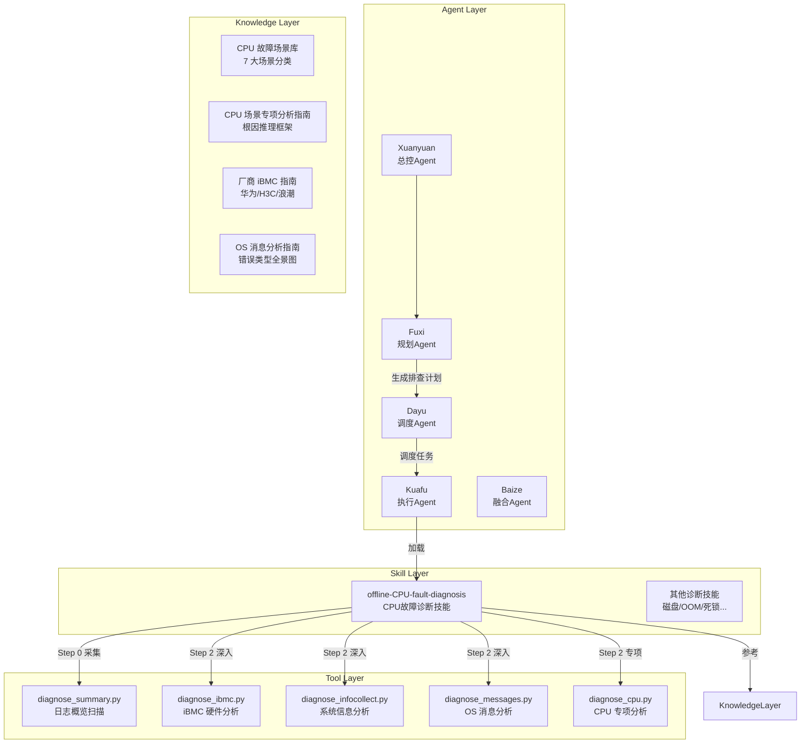
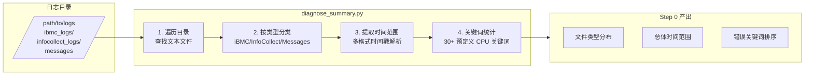

# 离线 CPU 故障诊断：当 AI Agent 学会"听"服务器的心跳

## 概述

CPU 是服务器的心脏。当一颗 CPU 开始出现高温、降频、缓存错误甚至物理损坏时，服务器的"心电图"——iBMC 硬件日志、内核 MCE 记录、系统 messages——会留下大量的异常信号。问题是：这些信号散布在三个独立的日志层，时间戳格式各异，关键信号淹没在噪音之中。

**离线 CPU 故障诊断**（Offline CPU Fault Diagnosis）是 Witty 智能诊断 Agent 体系中的一项核心技能。它将资深硬件工程师的 CPU 故障排查方法论编码为可执行的诊断流水线，让 AI Agent 能够像一位经验丰富的运维专家一样，仅通过分析服务器离线日志包，自动完成从"现象感知"到"物理级根因定位"的完整推理闭环。本文将从 Agent 的第一视角，深度解析这一技能的设计思想、核心机制和为什么它被这样构建。

## 背景：为什么 CPU 故障诊断如此棘手？

### 当前挑战与痛点

**CPU 故障是一条"沉默的因果链"。** 与磁盘故障不同，CPU 问题的传播路径更加隐蔽且跨层。一颗 CPU 的内部缓存错误（Cache Error）可能先表现为可纠正错误（CE），被硬件纠错机制默默掩盖；当不可纠正错误（UCE）积累到临界值，才会触发的机器检查异常（MCE），进而引发内核 Panic 导致宕机。从"硬件出问题"到"业务受影响"，中间可能跨越数小时甚至数天，而传统排查往往只看到了最终的系统崩溃。

具体而言，离线 CPU 诊断面临三个核心难题：

**多源日志的"三角对齐"困境。** CPU 故障的痕迹分布在三个独立数据源：iBMC（带外管理，记录硬件温度、电压、SEL 事件）、InfoCollect（系统信息采集，记录 CPU 型号、微码、dmesg）、OS Messages（操作系统日志，记录 MCE、Panic、Soft Lockup）。这三类日志的时间戳格式不同（`MMM D HH:MM:SS` / `YYYY-MM-DD HH:MM:SS` / `MM/DD/YYYY HH:MM:SS`），且 iBMC 时间与 OS 时间可能存在时钟偏差。要重建故障时间轴，Agent 必须像考古学家一样，在不同的"地质层"中找到同一时刻的痕迹。

**MCE 解码的专业门槛极高。** Machine Check Exception (MCE) 是 CPU 故障最核心的证据，但它以十六进制寄存器值形式存在。例如 `MCE: [18/00/00]` 的 `[18]` 表示 Bank 编号指向 CPU 内部执行单元，`[00]` 表示错误状态码。没有 3-5 年硬件经验的工程师很难直接解读这些信息的物理含义。

**传导链的跨层验证要求。** 一个典型的 CPU 故障传导链是：`CPU 核心触发 UCE -> 硬中断触发内核 Panic -> 触发 IERR 系统重启`。要 100% 确认根因是 CPU 硬件损坏而非软件 Bug，Agent 必须同时从 iBMC SEL 中找到硬件报错证据、从 dmesg 中找到 MCE 寄存器值、从 messages 中找到 Panic 触发时间——**三层证据缺一不可**。

### 设计目标

基于上述挑战，离线 CPU 诊断技能确立了明确的核心目标：

| 目标 | 说明 |
|:---|:---|
| **物理级精确定位** | 结论必须精确到 Socket/Core，而非模糊的"CPU 故障" |
| **严格的多源交叉验证** | 每个结论必须有 iBMC（带外）+ OS（带内）的双向证据支撑 |
| **时序驱动的因果重建** | 从混乱的时间戳中重建故障事件序列，找到 T0（故障零点） |
| **可审计的推理过程** | 所有判断都必须附带原生日志片段，确保结论可复核 |

## 设计思想：Agent 如何像硬件专家一样思考？

### 总体架构：四层解耦的 Skill 设计

离线 CPU 故障诊断技能不是一段孤立的 Python 脚本，而是 Witty 诊断 Agent 四层架构中的一个 Skill 组件：



这一设计的核心哲学是：**让工具做精确的事，让 Agent 做判断的事**。Python 脚本负责从海量日志中提取结构化证据（温度、频率、MCE 错误），而 SKILL.md 中的推理框架负责将这些证据组装成因果链。

### 推理框架：为什么是"假设-验证"？

CPU 故障诊断的推理框架采用了经典的 **Hypothetico-Deductive（假设-演绎）模型**，而非简单的"扫描-匹配"模式。这是有意为之的设计决策：

- **扫描-匹配模式的局限性**：如果只做关键词匹配（如搜索"error"），Agent 会被海量噪音淹没。一次正常服务器巡检可能在 messages 中找到数百个 INFO 级别的"error"字符串——但它们 99% 是正常的运行时信息。

- **假设-验证模式的优势**：Agent 先根据初步现象（如"系统 Panic"）提出候选假设（如 CPU_HARDWARE_FAILURE、CPU_OVERHEATING），然后针对性地收集证据来验证或排除每个假设。这正是人类专家解决问题的思维方式——先缩小怀疑范围，再精确取证。

### 核心设计：强制五步流水线

SKILL.md 中定义了一套**不可跳过的五步强制流程**：

```text
Step 0 (故障日志采集) -> Step 1 (场景分类) -> Step 2 (深入分析) -> Step 3 (根因校验) -> Step 4 (界面输出)
```

为什么必须严格按顺序执行？因为每个步骤的输出是下一步的输入约束：

1. **Step 0（日志采集）确定"有什么"**——扫描日志目录，统计文件类型、时间范围、错误关键词概览。这一步的核心产出是**关键词统计**和**时间范围**。Agent 在此阶段不做任何诊断判断，只是建立"证据地图"。

2. **Step 1（场景分类）确定"是什么"**——将 Step 0 的统计结果映射到 7 个预定义故障场景（如 CPU_HARDWARE_FAILURE、CPU_OVERHEATING）。这一步的核心产出是**场景标签**和**候选根因假设矩阵**。如果 Step 0 发现大量 MCE 关键词且温度正常，Agent 会优先考虑 CPU_HARDWARE_FAILURE 而非 CPU_OVERHEATING。

3. **Step 2（深入分析）确定"为什么"**——这是关键技术难度最高的环节。Agent 需要重建故障时间轴，确定 T0（故障零点），构建事件序列矩阵和传导链。这一步的产出是**物理级精确定位**（如 "Socket 1 -> Core 8 -> L2 Cache"）。

4. **Step 3（根因校验）确认"可信吗"**——通过"交叉质询铁律"对 Step 2 的结论进行严厉的自我质疑。这是一道内置的**防幻觉屏障（Anti-Hallucination Mechanism）**。如果 iBMC SEL 中没有 CATERR/IERR 但 OS 层有 MCE，Agent 不能断定是 CPU 硬件损坏，只能给出"疑似"结论。

5. **Step 4（界面输出）呈现"结论是什么"**——严格的结构化报告格式，严禁生成独立文件，确保 Agent 在对话界面以统一格式呈现诊断结论。

### 防幻觉设计：为什么需要"交叉质询铁律"？

CPU 诊断中最大的风险不是"无法诊断"，而是"误诊断"。一个错误的 CPU 损坏结论可能导致数十万元的备件更换成本和数小时的停机时间。为此，SKILL.md 中设计了三道**交叉质询铁律**：

1. **孤证不立原则**：任何物理级 CPU 故障判定，绝对不能仅凭系统层的一个报错。必须同时找到 iBMC 硬件层或 MCE 寄存器的第二独立证据源。例如，仅凭 OS Panic 不能判定 CPU 损坏——必须配合 iBMC SEL 中的 CATERR 记录。

2. **逻辑闭环原则**：从 T0 到最终业务故障结果，传导链不允许出现跳跃。例如"温度异常"不能直接推断导致"UPI 链路故障"，除非建立能量/物理链接逻辑（高温导致引脚膨胀、电气特性改变）。

3. **互斥排异原则**：判定 CPU 损坏前，必须排除 VRM（供电模块）、风扇、环境温度等外部诱因。如果电源模块异常导致的电压波动引发了假性 MCE，更换 CPU 毫无意义。

### 时序理论框架：为什么 T0 如此关键？

多源日志分析的核心挑战是**时间同步**。一个被忽视但极为实用的设计是**故障零点（T0）的优先级模型**：

| 优先级 | 来源 | 说明 |
|----|----|----|
| **P1** | 硬件错误日志（iBMC / SEL） | 底层致命报错时间最准确 |
| **P2** | 内核感知层（dmesg / mcelog） | 最早的 MCE 或温度阈值告警 |
| **P3** | 系统调度层（syslog / messages） | Soft Lockup、降频等系统级事件 |
| **P4** | 应用感知层 | 进程崩溃、业务超时，滞后性较大 |

这一优先级设计的合理性在于：**硬件层距离物理故障最近，延迟最小**。iBMC 的 SEL 记录在微秒级即可响应硬件事件，而内核感知需经过中断处理、日志写盘等环节，应用层感知则在数十毫秒甚至秒级之后。

## 实现原理：Agent 的五步诊断引擎

### Step 0：诊断从"全貌扫描"开始

当 Kuafu Agent 收到诊断任务后，首先启动的是 `diagnose_summary.py`。它的职责不是诊断，而是**建立证据地图**。

核心流程如下：



`diagnose_summary.py` 的设计有几个巧妙之处：

**文本文件的智能分类**：脚本根据文件名和所在目录路径双重判断日志类型（`classify_file_type()` 函数）。如果一个文件名包含 "ibmc" 或在 ibmc/ 目录下，归入 iBMC 类别。这种"双重判定"策略可以有效处理不同厂商的日志打包命名习惯差异。

**多格式时间戳的鲁棒解析**：`TIME_PATTERNS` 定义了三种正则表达式覆盖常见的日志时间戳格式（Syslog、ISO、SEL），`get_time_info()` 函数通过"文件头 500 行找最早时间 + 文件尾 500 行找最晚时间"的策略来估算文件时间范围。这种做法的精妙之处在于——**无需逐行解析所有日志**，在 O(1) 时间内即可获得时间范围概览。

**用户交互式过滤**：脚本支持 `-k`（关键词过滤）、`-d`（日期过滤）、`-s/-e`（时间范围过滤）参数。这意味着如果用户已经知道故障发生在某个时间段（如 "Mar 16 10:00"），Agent 可以直接将扫描范围缩小到该时间段周围，极大提升效率。

```bash
# Agent 执行全量扫描
python3 scripts/diagnose_summary.py /path/to/logs

# Agent 执行定点扫描（知道故障在 "Mar 16"）
python3 scripts/diagnose_summary.py /path/to/logs -d "Mar 16"
```

### Step 1：场景分类——从"症状"到"假设"

有了 Step 0 的证据地图，Agent 进入场景分类阶段。这不是简单的 if-else 规则匹配，而是**多证据综合判断**。

场景分类的逻辑在 SKILL.md 中以"特征矩阵"的形式定义，包含 7 个标准场景。每个场景都有明确的**证据指纹（Fingerprints）**：

| 场景 | 核心证据指纹 |
|:---|:---|
| CPU_HARDWARE_FAILURE | iBMC SEL 中 CATERR/IERR + 内核 MCE #18 |
| CPU_OVERHEATING | iBMC Thermal Trip + 温度持续 >95°C + 风扇转速异常 |
| CPU_MICROCODE_ERROR | microcode update failed + Soft Lockup on pure computation |
| CPU_CACHE_ERROR | L1/L2/L3 ECC UCE + CE 风暴 |
| CPU_INTERCONNECT_ERROR | UPI/QPI Link Error + CRC 同步错误 |
| CPU_VOLTAGE_REGULATION | VRM Fault + CPU 供电电压波动 |

例如，如果 Step 0 发现 `diagnose_ibmc.py` 在 iBMC SEL 中找到了 "CATERR"，且 `diagnose_messages.py` 在 messages 中找到了 "MCE: [18/00/00]"，Agent 应该优先选择 CPU_HARDWARE_FAILURE 作为候选场景。

场景分类完成后，Agent 会生成一个**候选根因假设矩阵**，每个假设对应 Step 2 中需要验证的证据点：

```text
CPU_HARDWARE_FAILURE 候选根因（需 Step 2 验证）：
  - CPU 物理损坏引发 MCE 导致 Panic 宕机 [❓ 待验证]
  - CPU 插座接触不良 [❓ 待验证]
  - 主板总线故障 [❓ 待验证]
```

### Step 2：深入分析——从"证据"到"因果"

这是整个诊断引擎的技术核心。Step 2 要求 Agent 完成两项关键任务：

#### 时序关联与传导链重建

Agent 需要将 iBMC 传感器读数、dmesg 报错、微码状态和 OS 日志统一映射到绝对时间轴上，构建事件序列矩阵。这听起来简单，但实际上是一个不小的挑战——不同日志源的时间戳格式不同，需要先进行格式统一和时间归一化。

`diagnose_messages.py` 对时间戳的处理展示了这种精细度：它通过 `parse_timestamp()` 函数尝试 4 种日期格式（`%b %d %H:%M:%S` / `%Y-%m-%d %H:%M:%S` / `%Y-%m-%dT%H:%M:%S` / `%m/%d/%Y %H:%M:%S`），对 `%b %d %H:%M:%S` 格式自动补全年份。第 25-30 行的 `TIME_PATTERNS` 设计和第 97-112 行的多格式 fallback 解析策略，使得脚本可以兼容不同厂商的日志格式。

Agent 构建的时间轴示例：

```text
T0-30m  ├─ [InfoCollect] 环境温度与 CPU 温度传感器记录开始持续升高
T0-5m   ├─ [iBMC SEL]    检测到 CPU 风扇转速过低或转子锁定告警
T0-1m   ├─ [OS dmesg]    Core temperature above threshold, cpu clock throttled
T0      ├─ [iBMC SEL]    记录 Thermal Trip 硬件断电保护 ← 故障零点
```

#### 四引擎并行取证

为实现"多源交叉验证"，Step 2 会并行执行四个分析脚本，每个脚本对应一个日志源：

```bash
# 硬件层取证
python3 scripts/diagnose_ibmc.py <log_dir> -k "CATERR" "IERR"
# 系统信息层取证
python3 scripts/diagnose_infocollect.py <log_dir>
# 操作系统层取证
python3 scripts/diagnose_messages.py <log_dir> -s "2026-03-10 08:00:00" -e "2026-03-10 12:00:00"
# CPU 专项深入
python3 scripts/diagnose_cpu.py <log_dir> --hardware
```

`diagnose_cpu.py` 是四个脚本中最具深度的。它被设计为一个多功能的"瑞士军刀"，通过 `--hardware`、`--temperature`、`--frequency`、`--cache`、`--microcode`、`--interconnect`、`--voltage` 等参数支持场景专项分析。其 `CPUAnalyzer` 类封装了完整的分析能力：

- **analyze_cpu_info()**: 从 cpuinfo 文件中提取处理器数量、型号、频率、缓存、微码版本，并**自动推算 Socket 数量**（`processors // cores_per_socket`）。这种"推算"策略的价值在于——多路服务器的 Socket 计数通常不会直接写在一个字段里，但可以从处理器数量和每个处理器的核心数反推。

- **analyze_temperature()**: 采用三级温度判定模型（正常 < 80°C → 注意 80-90°C → 警告 90-100°C → 危险 > 100°C）。这与 Intel/AMD CPU 的官方 TCC（Thermal Control Circuit）激活阈值保持了一致。

- **analyze_errors()**: 使用 12 种错误正则模式（从 "CPU.*error" 到 "VRM.*error"）覆盖了从硬件故障到电压调节的完整场景空间。

- **analyze_frequency()**: 当平均频率低于 1GHz 时触发告警——这是一个经过实践验证的经验阈值。现代服务器 CPU 空闲时也会维持在 1.5GHz 以上，低于 1GHz 通常意味着硬件降频保护或电源策略异常。

- **analyze_hardware()**: 专门针对 MCE、缓存错误、总线错误、电压错误进行专项聚合分析。

#### 脚本间共享机制

几个脚本通过 `/tmp/cpu_analysis_results.json` 共享中间分析结果：

```python
# diagnose_ibmc.py 的 save_results() 函数
existing_data = {}
if os.path.exists(output_file):
    with open(output_file, 'r') as f:
        existing_data = json.load(f)  # 加载之前脚本的结果

# 合并本次结果到已有数据
temp_summary = existing_data.get('temperature_summary', {'high_temps': [], ...})
temp_summary['high_temps'].extend(new_data)
```

这意味着四个脚本可以按任意顺序执行，每次执行都会"贡献"自己的证据到共享的 JSON 文件中。最终的分析摘要可以聚合所有脚本的发现。这是对传统"一个大脚本跑到底"模式的有意改进——**支持增量分析和断点续查**。

### Step 3：根因校验——Agent 的"自我质疑"

Step 3 是整个引擎中最具独特设计的部分。它要求 Agent 对自己的推理结果进行**严厉的交叉质询**，通过一个结构化的**根因证据校验表（Evidence Validation Matrix）**来执行：

| 校验维度 | 校验标准 | Agent 的自我检查 |
|:---|:---|:---|
| **E1: 时序连续性** | 硬件告警时间是否早于或同步于系统层报错？ | `[timestamp check] iBMC SEL = Mar 16 10:00:12, OS Panic = Mar 16 10:00:15 → 时序合理` |
| **E2: 物理同一性** | 逻辑核心 ID 与物理 Socket ID 是否对应？ | `[mapping] CPU 0 → Socket 0, Core 0; CPU 8 → Socket 1, Core 0` |
| **E3: 现象排他性** | 是否排除了 OS 配置、微码 Bug 等软性干扰？ | `[elimination] 微码版本已验证为最新，非已知缺陷版本` |

这道校验的核心价值在于**防幻觉**。如果 E1 时序验证发现 OS Panic 的时间早于 iBMC SEL 的事件，那么 CPU 硬件损坏的假设就不成立——更可能是软件 Bug 或其他原因导致的系统崩溃，硬件事件只是"躺枪"。

校验不通过时的降级策略也体现了设计上的务实：

- **断链阻断**：若无法从日志中找到因果传导片段，强制回溯到 Step 2 重新收集
- **降级处分**：若确实缺乏某层日志（如无 iBMC），结论声明为"**疑似故障 (Suspected)**"并标注证据断层位置
- **严禁用词限制**：证据链未完全闭环前，严禁使用"肯定""必然""CPU 绝对已坏"等决定性断言

### Step 4：报告输出——结构化的诊断结论

Step 4 要求 Agent 在对话界面中直接输出格式化的诊断报告，**禁止生成独立文件**。这一规定的设计意图是：所有诊断结论都应在 Agent 交互的上下文中呈现，避免孤立文件导致的信息断层。

报告的结构严格固定为四部分：

1. **Executive Summary（故障摘要）**— 故障位置（Socket ID）、直接原因、后果概述
2. **Fault Chains（故障链条分析）**— 包含故障时间链和故障传播链两个子维度
3. **Technical Analysis & Root Cause（技术分析与根因）**— 基于 E1/E2/E3 证据链支撑
4. **Recommendations（修复建议）**— 立即操作、备件更换建议及预防性检查

## 知识底座：如何构建专家级的"故障指纹库"？

诊断引擎的"智慧"不仅来自推理框架，更来自精心设计的知识底座。CPU 诊断技能包含了 7 个参考文档，覆盖三个知识维度：

### 场景知识

**CPU_fault_scenarios.md** 定义了 7 大故障场景的**核心证据与指纹**。每个证据指纹都精确到日志关键字级别，例如 CPU_HARDWARE_FAILURE 的核心指纹是 `CATERR` / `IERR` / `MCE #18`。这为 Agent 的"场景匹配"提供了精确的匹配模板。

### 分析知识

**CPU_scenario_analysis.md** 为每个场景提供了**根因推理框架**（Reasoning Framework）。以 CPU 过热为例，它构建了完整的传导链模型：

```text
[风扇转子锁定 / 负载瞬间爆发] -> [CPU 温度升高至阈值 95°C+] -> 
[频率持续 Throttled 并伴随 I/O 延迟] -> [触发 Thermal Trip 硬件断电保护 T0]
```

并且明确要求 Agent 在 T0 前 15 分钟的 sensor 数据中，确认温度线性增长与风扇转速低下的耦合关系。这种"前因后果"的约束直接转化为 Agent 在 Step 2 中的取证方向。

### 厂商知识

支持华为、H3C、Inspur 三个主流服务器厂商的 iBMC 日志格式。以 **huawei_ibmc.md** 为例，它详细定义了 7 大类日志文件（硬件故障类、系统运行类、存储类等），以及每个文件的分析优先级矩阵（从 ⭐⭐⭐⭐⭐ 的 `current_event.txt` / `fdm_output` 到 ⭐ 的参考日志）。

## 设计权衡

### 通用性 vs. 特异性

脚本的诊断脚本库涵盖了最常见的 CPU 故障场景，但不可避免地存在盲区。例如，某些特殊的微码缺陷可能需要特定的内核版本组合才能触发，而诊断引擎的 7 大场景分类可能无法覆盖这类"交叉场景"。

设计者的权衡是：**优先覆盖 80% 的高频场景**，为剩余 20% 的罕见场景保留通过 `-k` 参数自定义关键词的扩展能力。这是一个务实的工程决策。

### 诊断精度 vs. 执行速度

`diagnose_cpu.py` 的 `analyze_errors()` 对每个文件逐行匹配 12 种错误正则模式，`analyze_temperature()` 对温度数据逐行提取。这种逐行扫描策略确保了精度，但在大型日志包（如数 GB 的 messages）上可能较慢。

权衡的结果是**文件数量上限 + 行数限制**：每个类型最多分析 5-10 个文件，每个文件只检查前 500 行时间戳。在精度和速度之间取得了工程上的平衡。

### 确定性 vs. 概率性

Step 3 的"交叉质询铁律"倾向于**保守诊断**——宁可给出"疑似"结论，也不冒然下"肯定"的断言。这种保守策略避免了误判导致的错误备件更换，但也意味着某些情况下 Agent 无法给出 100% 确定的根因。

这是面对不完整日志数据时的合理选择：**在不确定性面前的诚实，比虚假的确定性更有价值**。

## 使用示例

以下是 Agent 在典型 CPU 硬件故障诊断中的完整执行过程：

### 场景：服务器突发宕机，用户怀疑 CPU 问题

**Step 0 - 故障日志采集：**

```bash
# Agent 执行全量扫描
python3 scripts/diagnose_summary.py /path/to/logs

# 输出：找到 MCE 相关关键词 127 次，时间范围 2026-03-10 08:00 ~ 12:00
# 关键词 Top 3: "MCE" (47次), "error" (89次), "CPU" (156次)
```

**Step 1 - 场景分类：**

Agent 分析 Step 0 结果：MCE 高频出现 + 温度关键词极少 + 大量"hardware error"关键词 → 排除 CPU_OVERHEATING → 选择 CPU_HARDWARE_FAILURE。

**Step 2 - 深入分析：**

```bash
# Agent 执行定点扫描，聚焦 MCE 事件
python3 scripts/diagnose_messages.py /path/to/logs -s "2026-03-10 10:00:00" -e "2026-03-10 10:05:00" -k "MCE" "machine check"

# 发现 MCE #18，指向 CPU Socket 1，Core 8

python3 scripts/diagnose_ibmc.py /path/to/logs -k "CATERR" "IERR"

# iBMC SEL 发现 CATERR 记录时间 10:00:12，与 OS MCE 时间 10:00:15 对齐
```

**Step 3 - 根因校验：**

- E1 时序连续性：✅ iBMC CATERR (10:00:12) < OS MCE (10:00:15)，时序合理
- E2 物理同一性：✅ MCE 报告 Socket 1，iBMC SEL 确认 Socket 1 错误
- E3 现象排他性：✅ 微码版本非已知缺陷，VRM 状态正常

**Step 4 - 报告输出：**

Agent 在对话界面输出：

```text
Diagnosis Report: CPU Hardware Failure
======================================

[Executive Summary]
- Location: Socket 1, Core 8, L2 Cache
- Root Cause: Uncorrectable L2 Cache Error → MCE #18 → Kernel Panic
- Impact: Server crash at 2026-03-10 10:00:15

[Fault Chains]
- Time Chain:
  10:00:12  iBMC SEL: CATERR asserted on Socket 1
  10:00:15  OS dmesg: MCE #18 on CPU 8, Bank 3
  10:00:16  OS messages: Kernel panic - not syncing: Fatal machine check

- Propagation Chain:
  Cache UCE on Socket1/Core8 → MCE raised → NMI handler → Panic → IERR

[Technical Analysis]
- E1 (Timeline): Consistent ✅
- E2 (Physical Unity): Socket 1 confirmed by both iBMC and OS ✅
- E3 (Exclusion): VRM normal, microcode verified, fan speed normal ✅

[Recommendations]
1. Immediate: Replace CPU on Socket 1
2. Preventive: Check Socket 1 pin condition on motherboard
```

## 总结

离线 CPU 故障诊断技能的设计体现了几个核心原则：

**专业化**。它不是一段简单的日志搜索脚本，而是一套封装了硬件工程师专家经验的推理框架。从多源日志的时序对齐到 MCE 错误的物理映射，从候选假设的生成到交叉质询的校验，每一步都对应着人类专家的思考过程。

**工程化**。通过五步强制流水线、共享的中间结果文件（`/tmp/cpu_analysis_results.json`）、模块化的脚本设计，它将复杂诊断任务拆分为可单独执行、可增量叠加、可任意组合的独立单元。这种架构不仅易于调试，也支持诊断流程的半自动化——用户可以在 Agent 完成 Step 0 后介入，手动调整过滤参数再执行 Step 2。

**可审计**。任何结论都必须附带原始日志证据，通过 E1/E2/E3 三级校验才能被认定为"已证实"。在证据不足时，Agent 必须诚实标注"疑似"。这种严谨性确保了诊断结论的可信度和可追溯性。

**防幻觉**。三道交叉质询铁律、断链阻断机制、结论降级处分、严禁用词限制——这一系列约束共同构成了一个"保守诊断"的安全网。在 CPU 诊断这样的高风险领域，"不做错误判断"比"做出判断"更重要。

离线 CPU 故障诊断技能展示的，正是一种"**让 Agent 像资深专家一样严谨思考**"的设计哲学：不是取代专家，而是将专家的思考方式编码为可执行的诊断流水线，让每一台服务器都能拥有一个"7×24 小时不休息的 CPU 硬件专家"。
