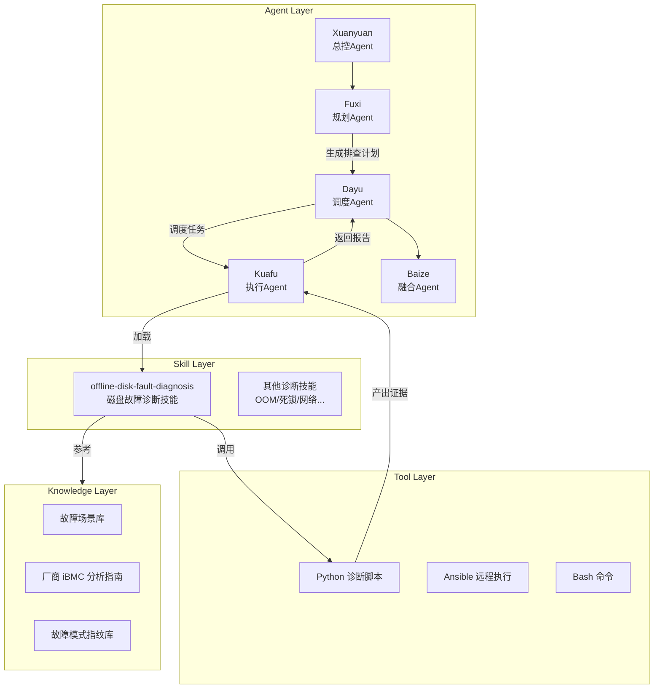
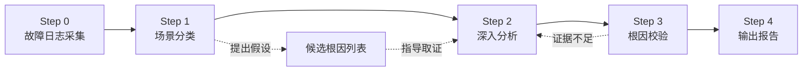
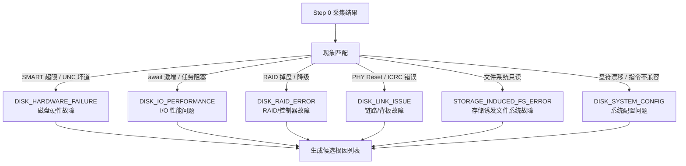
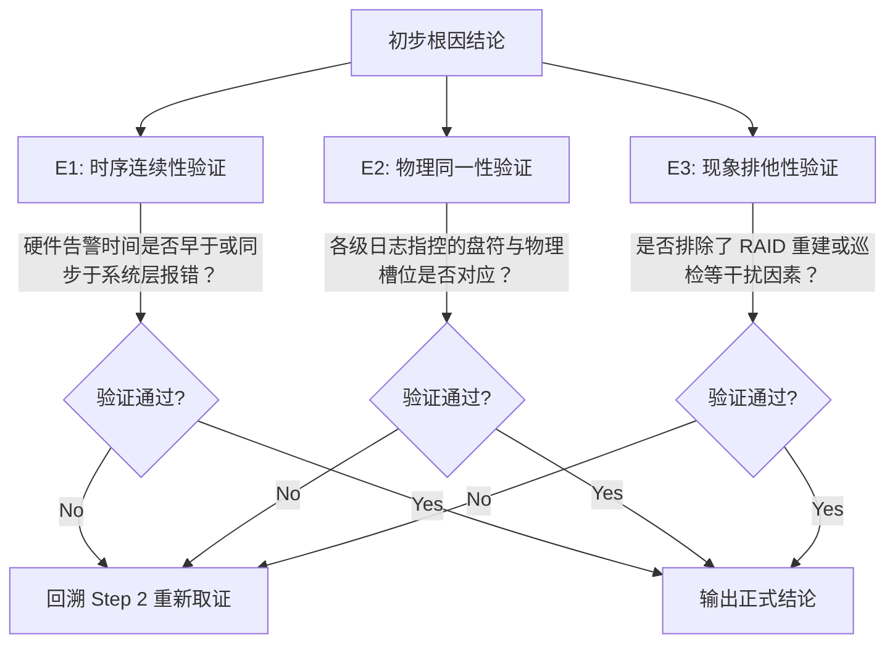

# 离线磁盘故障诊断：当 AI Agent 成为你的存储运维专家

## 概述

在数据中心运维中，磁盘故障是最常见也最棘手的问题之一。一块硬盘的"死亡"往往不是瞬间发生的——它可能先表现为零星 I/O 超时，然后是文件系统只读，最后才是彻底掉盘。传统排查依赖资深工程师手动翻阅 iBMC 日志、系统 messages、SMART 数据等多源信息，在时间轴上拼凑因果链条，整个过程耗时数小时甚至数天。

**离线磁盘故障诊断**（Offline Disk Fault Diagnosis）是 Witty 智能诊断 Agent 体系中的一个核心技能。它将存储专家的排查方法论编码为可执行的诊断流水线，让 AI Agent 能够像资深运维工程师一样，"翻阅"服务器离线日志包，自动完成从"现象"到"根因"的推理闭环。本文将从 Agent 的第一视角，深度解析这一技能的设计思想、核心机制和实现原理。

## 背景：为什么需要"会思考"的磁盘诊断？

### 当前挑战与痛点

磁盘故障诊断面临三个核心难题：

**多源日志的时间对齐困境**。一次典型的磁盘故障会同时在多个日志层留下痕迹：iBMC（带外管理）记录硬件事件、内核 dmesg 记录 SCSI 错误、系统 messages 记录 I/O 超时、SMART 记录介质健康度。这些日志的时间戳格式各异（Syslog 的 `MMM D HH:MM:SS`、ISO8601、SEL 的 `MM/DD/YYYY`），且 iBMC 时间与 OS 时间可能存在时钟偏差。人工对齐这些分散的信息就像拼一幅没有参考图的拼图。

**因果链的断裂风险**。磁盘故障的传播路径往往是链式的：`链路抖动 -> I/O 重试 -> 性能劣化 -> 文件系统只读`。中间任何一个环节的证据缺失都可能导致误判。例如，看到文件系统只读就直接判定为"磁盘损坏"，可能忽视了背后的链路背板供电问题——而更换背板与更换硬盘的成本天差地别。

**专家经验的不可复制性**。一个资深的存储工程师需要 3-5 年实战才能建立"故障指纹"识别能力：看到 `log_info(0x31110e03)` 就知道是 ICRC 链路错误，看到 `PHY Reset` 就能联想到 SAS 线缆接触不良。这种经验难以文档化，更难以规模化复用。

### 设计目标

基于上述挑战，离线磁盘故障诊断技能确立了四个核心目标：

| 目标 | 说明 |
|:---|:---|
| **分钟级诊断** | 将传统小时级的日志分析压缩到分钟级 |
| **物理级精准** | 结论必须精确到槽位号（Slot ID），而非模糊的"磁盘故障" |
| **证据链闭环** | 每个结论必须有至少两个独立证据源支撑 |
| **可复制可审计** | 诊断推理过程完全透明，每一步都可以追溯验证 |

## 设计思想：让 Agent 像专家一样思考

### 总体架构：Agent-Skill-工具-知识四层解耦

离线磁盘故障诊断不是一段孤立的 Python 脚本，而是 Witty 诊断 Agent 四层架构中的一个 Skill 组件：



这一设计的关键在于**职责分离**：

- **Fuxi Agent** 负责分析现象、制定计划，但**禁止执行**任何技能——它只做规划
- **Dayu Agent** 负责将计划拆解为可并行执行的任务，并为每个任务注入对应的 Skill
- **Kuafu Agent** 是真正的执行者，被注入 Skill 后按照标准流程操作
- **Baize Agent** 后续将多个 Kuafu 的报告融合为最终根因报告

> **Note:** 每个 Agent 的职责边界通过身份约束（Identity Constraints）严格限定。例如 Fuxi 的身份提示中明确规定"禁止执行诊断脚本"，这从根本上防止了 Agent 跳过计划直接执行的风险。

### 核心范式：假设-验证（Hypothetico-Deductive）

这是整个诊断技能最核心的设计思想。它模拟了人类专家的推理方式：

```text
观察现象 → 提出假设 → 收集证据 → 验证假设 → 得出结论
```

具体到离线磁盘诊断中，这一范式被实例化为五步流水线：



每一步都有明确的**完成标志**（Completion Criteria），不满足则无法进入下一步。这种设计确保了诊断过程的严谨性，也使得 Agent 的行为是可预测、可审计的。

> **Note:** 这一设计借鉴了医学诊断中的"鉴别诊断"方法论。就像医生不会直接下结论"你发烧了是因为感染"，而是先假设几种可能（病毒性/细菌性/无菌性），然后通过检查逐一排除。

### 为什么选择"离线"诊断？

一个自然的问题是：为什么不直接连到服务器上实时诊断？

这是经过权衡的设计决策：

```text
在线诊断（Online）
- 优势：可以实时执行 smartctl、iostat 等命令，获取最新状态
- 劣势：需要目标服务器可达；诊断过程可能对生产系统产生影响
  
离线诊断（Offline）
- 优势：基于日志包分析，对生产系统零侵入；日志包可归档、可复现
- 劣势：数据是历史快照，无法获取故障发生后新产生的信息
```

对于大规模的服务器集群运维，离线诊断的实际收益远大于限制。首先，故障服务器的 OS 可能已经 hang 死，无法执行在线命令；其次，日志包可以通过带外管理（iBMC）一键收集，无需进入机房；最后，离线诊断的能力可以沉淀为标准化知识，让初级运维人员也能独立使用。

## 核心实现原理：Agent 的"思考"过程

### 诊断流水线深度解析

#### Step 0：故障日志采集——建立全局视图

当 Agent 接收到日志目录后，首先执行的是 **全局扫描**。这相当于人类专家先"翻一遍"所有日志，建立时间、空间和事件三个维度的全景视图。

```bash
# 全量扫描，获取全景概览
python3 scripts/diagnose_summary.py /path/to/logs -o
```

脚本的输出包含：

- **时间范围**：各日志文件的最早和最晚时间戳，判断故障是否在日志覆盖窗口内
- **文件统计**：iBMC 日志、InfoCollect、messages 三类日志的完整性和数量
- **错误概览**：各类错误关键词的出现频率，识别高频错误模式

Agent 在这一步不急于下结论，而是回答三个问题：

1. "日志数据是否完整？"（缺少哪一层？）
2. "故障的大致时间窗口是什么？"（T0 可能在什么范围？）
3. "哪些错误模式频繁出现？"（可能是哪个场景？）

#### Step 1：场景分类——提出诊断假设

有了全局视图后，Agent 进入**场景分类**阶段。这一步是假设-验证范式的"假设"环节。

Agent 会将观测到的现象映射到六大预设场景之一：



分类完成后，Agent 会生成一个**候选根因假设矩阵**，每个假设都需要在后续步骤中标注：✅ 已证实 / ❌ 已排除 / ❓ 证据不足。

这背后的设计思想是：**不要把鸡蛋放在一个篮子里**。即使初步现象强烈指向"磁盘硬件故障"，Agent 也必须同时考虑链路和 RAID 的可能性，避免确认偏差（Confirmation Bias）。

#### Step 2：深入分析——多源取证

这是整个诊断过程中最关键的环节。Agent 的核心任务是**重建故障时间轴**和**定位物理坐标**。

##### 故障零点 T0 的确定

T0 是时序分析的基准锚点，定义为**最早可观测到异常的时间戳**。Agent 按照优先级从高到低寻找 T0：

```text
P1：iBMC SEL（硬件错误日志）——最底层，时间最准确
  ↓
P2：内核 dmesg（SCSI Error / I/O Error）——驱动层感知
  ↓
P3：系统 messages（文件系统只读 / 任务阻塞）——系统层表现
  ↓
P4：应用层日志（业务超时 / 写入失败）——滞后最大
```

Agent 会同时扫描三个日志目录，并通过时间戳解析引擎统一转换为标准时间格式：

```text
iBMC SEL:  03/05/2026 14:31:22  →  2026-03-05 14:31:22
OS dmesg:  Mar  5 14:31:25     →  2026-03-05 14:31:25
messages:  Mar  5 14:32:10     →  2026-03-05 14:32:10
```

> **Note:** 时间格式解析引擎硬编码了三种常见格式（Syslog、ISO8601、SEL），通过逐个尝试匹配。对于缺失年份的 Syslog 格式（如 `Mar 5 14:31:25`），默认使用当前年份，这在日志时效性较短（通常数月内）的场景下是合理的。

##### 事件序列矩阵

以 T0 为基准，Agent 构建出结构化的事件序列矩阵。下面是一个**背板供电异常**导致的连锁故障示例：

```text
T0-5m   ├─ [iBMC SEL]    背板供电电压瞬间短幅跌落告警
T0-1m   ├─ [OS dmesg]    SAS 链路频繁重置 (PHY Reset)
T0-30s  ├─ [OS iostat]   I/O await 严重阻塞，请求堆积
T0      ├─ [iBMC SEL]    Drive 8 Fault → 硬盘离线（故障节点 T0）
T0+1m   ├─ [OS messages] 内核触发 Remount read-only
```

这个序列矩阵是 Agent 后续推理的基础。两条关键的推理规则驱动着传导链的构建：

- **规则一（硬件损坏主导）**：`磁盘物理损坏 (T0) → 驱动报错 → I/O Error → 文件系统只读`
- **规则二（链路/压力主导）**：`业务高负载 (T0) → SAS 链路重置 → RAID 性能下降 → 应用超时`

##### 存储数据流拓扑重建

Agent 还有一个关键动作：**重建从业务挂载点到物理磁盘的完整拓扑映射**。这是为了确定"这个故障影响了谁"：

```text
挂载点（用户入口）
  → /data/vols/vol13/phenix_data
  → 文件系统：ext4
  → 逻辑卷：/dev/mapper/vg_data-lv13
  → 物理磁盘：/dev/sdb（对应 Slot 4, Disk Index 8）
```

有了这个映射，Agent 才能回答运维人员最关心的问题："这个磁盘故障会影响哪些业务？"

#### Step 3：根因校验——交叉质询与防幻觉

这是 Witty 诊断体系最独特的设计——**Agent 需要对自己的结论进行自我审查**。设计灵感来源于司法领域的交叉质询（Cross-Examination）机制。

Agent 必须逐条验证三个核心维度：



**孤证不立原则**是校验的核心：任何物理级磁盘故障（如磁盘坏道），绝对不能仅凭系统层的一个 `I/O Error` 就下断言。Agent 必须找到硬件层（如 SMART 或 iBMC SEL）的第二独立证据源。

**结论防发散拦截机制**（Anti-Hallucination Mechanism）是这一环节的另一亮点：

- **断链阻断**：如果无法从日志中找到证明因果传导的片段，强制触发流程拦截，回溯重新收集
- **降级处分**：如果确实缺乏某一层关键日志（如无 iBMC），报告必须声明为"疑似故障"并标注证据断层位置
- **严禁用词限制**：在证据链未完全闭环前，禁止使用"肯定"、"必然"、"磁盘绝对已坏"等决定性断言

> **Note:** 这一机制的设计意图非常明确：在大模型时代，AI Agent 最容易被诟病的就是"幻觉"——自信地给出错误结论。通过硬编码的校验规则和用词限制，Agent 被迫保持"不确定"的诚实态度，这在严肃的运维场景中是至关重要的品质。

#### Step 4：输出报告——结构化的诊断结论

最终报告不是自由文本，而是**强制结构化输出**，包含五个固定章节：

1. **Executive Summary（故障摘要）**：设备 + 根因 + 业务后果三要素
2. **Storage Data Flow（存储拓扑）**：从业务到物理的完整映射
3. **Fault Chains（故障链条）**：时间链 + 传播链
4. **Technical Analysis & Root Cause（技术分析）**：多源证据链，每条证据必须标注 `[绝对路径 : 行号]`
5. **Recommendations（修复建议）**：操作步骤、备件更换建议

### Python 诊断脚本：Agent 的"感官"

四组 Python 脚本是 Agent 与日志数据交互的核心工具。它们的设计体现了"**工具为人服务，而非人为工具服务**"的理念——脚本不追求面面俱到，而是聚焦于高效提取关键证据。

| 脚本 | 对应日志 | 核心功能 | 关键输出 |
|:---|:---|:---|:---|
| `diagnose_summary.py` | 全部 | 全局扫描、时间范围、错误概览 | 全景视图 |
| `diagnose_ibmc.py` | iBMC SEL | 硬件事件解析、SEL 告警提取 | 槽位离线、Drive Fault |
| `diagnose_infocollect.py` | InfoCollect | SMART 健康、RAID 状态、I/O 性能 | 重映射扇区数、阵列状态 |
| `diagnose_messages.py` | OS Messages | 内核 I/O 错误、文件系统报错 | SCSI Error、Remount RO |

以 `diagnose_infocollect.py` 为例，它承担了最复杂的分析任务：同时解析 SMART 健康数据、RAID 控制器日志和 I/O 性能指标。其中对 RAID 日志的解析展示了典型的"去噪"策略：

```python
# RAID 日志中充满了"正常"的噪声行，必须过滤掉
# 例如 "Media Error Count = 0" 是有害噪声，不是有效告警
if "Count = 0" in issue: continue      # 跳过零值计数
if "Media Error:       0" in issue: continue  # 跳过零值统计
if "Cachevault is absent" in issue: continue  # 跳过非告警配置信息
```

这段代码体现了 Agent 工具设计的一个重要原则：**工具的产出应该是"精华"而非"原料"**。如果脚本把原始日志的噪声也传给 Agent，大模型的处理能力和 token 预算都会被浪费。

### 厂商 iBMC 知识：Agent 的"领域经验"

不同厂商的 iBMC 日志格式和目录结构差异巨大。Agent 内置了三大主流厂商的深度分析指南：

- **华为 iBMC**：7 大类日志、6 步标准分析流程（SOP）
- **H3C iBMC**：10 大模块目录（含 Apache 日志、PHY 误码日志、FDM 预告警等 H3C 独有能力）
- **浪潮 Inspur iBMC**：4 目录扁平化结构、独有 `ErrorAnalyReport.json`（AI 自动故障解析报告）

Agent 在加载技能时会自动识别日志来源，选择对应的分析指南。这意味着即使运维人员面对不同厂商的服务器，Agent 的表现是一致的——这背后是专家知识的结构化和系统化沉淀。

## 权衡与取舍

### 自动化程度 vs 诊断准确性

离线磁盘故障诊断技能选择了**"半自动化 + 强校验"**的路线，而非完全自动化。

```text
完全自动化                   完全人工
  │                           │
  │    本技能的设计位置          │
  │    ┌───┐                    │
  │    │   │                    │
  │    ▼   │                    │
  ├─────── X ───────────────────┤
  │  自动化 + 强制校验        依赖专家经验
```

自动化脚本负责"跑腿"（采集数据、执行 grep），但推理和校验交给 Agent 的 LLM 能力。这样做的原因是磁盘故障诊断的"最后一公里"——从证据到结论的飞跃——仍然需要理解物理含义和因果关系，纯规则引擎在此处力不从心。

### 泛化性 vs 深入度

日志包结构因厂商和收集工具而异。技能的参考文档覆盖了华为、H3C、浪潮三种主流服务器，但对于未覆盖的厂商（如 Dell iDRAC、HP iLO），Agent 会降级使用通用分析策略。

这是刻意的取舍：与其为所有厂商提供浅层覆盖，不如为几家主流厂商提供深度分析能力。毕竟，数据中心的服务器品牌通常是集中的，一个团队通常只维护 1-2 个品牌的服务器。

### 脚本 vs 全 Agent 自主

一个值得探讨的设计决策是：为什么要使用 Python 脚本，而不是让 Agent 直接用 `grep` 命令分析日志？

原因有两点：

1. **效率**：Python 脚本可以一次扫描数百个文件，批量提取关键信息。如果让 Agent 逐文件使用 `grep`，不仅速度慢，而且 token 消耗巨大。
2. **确定性**：脚本的输出是可预测的，不依赖模型能力。SMART 的 `Reallocated_Sector_Ct` 非零就是非零，没有"模型幻觉"的空间。

脚本负责"确定性的信息提取"，Agent 负责"非确定性的因果推理"——这是人机协作的最佳分工。

## 用户使用视角

### 触发场景

用户无需手动加载技能。在 Witty 诊断 Agent 中，一切由"现象"驱动：

```text
用户输入（自然语言）：
  "请诊断 2026-03-05 14:31 前最近一次硬盘故障，
   日志路径：/tmp/logs"

Agent 内部流程：
  Fuxi Agent 分析现象 → 识别为磁盘故障 →
  计划中包含 "offline-disk-fault-diagnosis" 技能 →
  Dayu Agent 调度 → Kuafu Agent 加载技能 → 执行诊断
```

### 诊断体验

用户只需要提供日志路径和故障描述，Agent 全权负责后续工作：

```bash
# 用户只需要发起诊断请求
请诊断最近一次硬盘故障，日志路径：/tmp/logs

# Agent 自动完成：
# Step 0: 扫描日志 → 发现 iBMC 有 Drive Fault 事件
# Step 1: 分类为 DISK_HARDWARE_FAILURE
# Step 2: 深入分析 → 确认 Slot 4 磁盘 SMART 故障
# Step 3: 交叉验证 → iBMC + SMART 双重证据支撑
# Step 4: 输出结构化诊断报告
```

### 报告解读

诊断报告不是晦涩的技术文档，而是面向运维人员的可操作指南：

```text
Executive Summary:
- 设备：Slot 4 (Disk Index: 8), /dev/sdb, 型号 HUS724040ALS640
- 根因：物理介质老化导致 UNC 坏道，SMART Reallocated_Sector_Ct 超阈值
- 影响：该磁盘对应挂载点 /data/vols/vol13，已触发文件系统只读

Recommendations:
1. 立即：备份 /data/vols/vol13 数据
2. 备件：更换 Slot 4 硬盘（建议同型号 HUS724040ALS640）
3. 预防：对该批次硬盘建立 SMART 定期巡检
```

## 总结

离线磁盘故障诊断技能的设计，本质上回答了一个问题：**如何让 AI Agent 在严肃的运维场景中做出可靠的专业判断？**

答案是：不要依赖 Agent 的"自由意志"。通过硬编码的流水线步骤、强制性的证据校验、结构化的输出格式和严格的用词限制，Agent 被约束在一个精心设计的推理框架内。在这个框架内，Agent 可以充分发挥 LLM 的语义理解和推理能力；而在框架之外，规则系统确保了诊断过程的基本盘——不遗漏关键证据、不跳过必要步骤、不做出未经证实的断言。

这种**规则驱动 + LLM 增强**的混合范式，可能是专业领域 AI Agent 落地的最可行路径。它既不是简单的"if-else"专家系统，也不是完全放权的"让大模型自己看着办"，而是在两者之间找到了一个务实的平衡点。

对于运维人员而言，这意味着：你不需要成为存储专家，也能获得专家级的诊断结论——因为 Agent 已经"学会了"专家的思考方式。
