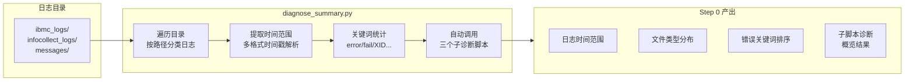

# 离线 GPU 故障诊断：当 AI Agent 学会"破译"显卡的 SOS 信号

## 概述

GPU 是 AI 时代的算力引擎。一次 GPU 故障可能意味着数百万元的训练集群停机、数千小时的算力损失。然而，离线 GPU 诊断是业界公认的"脏活累活"——故障痕迹横跨带外硬件日志（iBMC）、操作系统内核日志（dmesg/messages）和 GPU 专属状态快照（nvidia-smi），且被海量噪音信号所淹没。更棘手的是，GPU 故障的"表象"极具欺骗性：一个 XID 79 掉卡错误，既可能是 GPU 物理烧毁，也可能是内核 OOM 导致的"假掉卡"。

**离线 GPU 故障诊断**（Offline GPU Fault Diagnosis）是 Witty 智能诊断 Agent 体系中的一项关键技能。它将资深硬件工程师排查 GPU 故障的方法论——包括多源日志比对、XID 错误解码、故障传导链重建、三层交叉验证——编码为一套可复现的诊断流水线。本文将从 Agent 的第一视角，深度解析这个技能的设计思想：**为什么 GPU 诊断需要一套独立的推理框架？Agent 如何在混乱的日志碎片中重建因果链？又如何防止自己"误判"导致数万元的错误备件更换？**

## 背景：为什么 GPU 故障诊断如此复杂？

### 当前挑战与痛点

**GPU 故障是一条"三岔路口的因果链"。** 不同于 CPU 或磁盘——它们有明确的"症状-根因"映射——GPU 故障的源头可以是三个完全不同的物理层次：硬件（GPU 核心/显存/供电）、软件（驱动/CUDA 版本/内核态异常）或通信（PCIe 链路/NVLink）。同一个现象（"GPU 不见了"）可能是三种截然不同的原因导致的。

具体而言，离线 GPU 诊断面临四大核心挑战：

**XID 错误代码的"双面性"。** NVIDIA 驱动通过 XID 错误代码向系统日志上报故障。但 XID 的解读远非数字与含义的简单映射。XID 79 被标记为"Fallen off the bus"，听起来 100% 是硬件故障——但实践中，当内核发生 soft-lockup 或 OOM 导致无法响应 GPU 中断请求时，驱动也会被迫上报 XID 79。在 Agent 看来，**同一个 XID 代码，在不同的日志上下文中，可能指向完全不同的根因**。这是 GPU 诊断区别于其他硬件诊断的核心难点。

**多源日志的复杂三角对齐。** GPU 故障痕迹分布在三层独立数据源：iBMC（带外管理，记录 GPU 供电故障、温度告警、SEL 事件）、OS Messages（内核态日志，记录 XID、NVRM 驱动报错、PCIe AER）、InfoCollect/nvidia-smi（用户态快照，记录 ECC 计数、时钟频率、链路宽度）。这三层日志不仅时间戳格式各异（Syslog `MMM D HH:MM:SS` / ISO `YYYY-MM-DD HH:MM:SS` / SEL `MM/DD/YYYY HH:MM:SS`），其时间基准也可能存在偏差。Agent 必须像刑侦专家一样，将这些"不同时钟下的证词"对齐到同一条时间线上。

**故障传导链的跨层特性。** GPU 故障的传播路径往往是"硬件问题 -> 软件感知 -> 业务崩溃"。例如：GPU 供电模块的电压波动（硬件层）-> PCIe 链路 CRC 错误增多（总线层）-> 驱动超时上报 XID 79（驱动层）-> NCCL 通信异常导致训练中断（应用层）。每一层都留下了独立的证据，但只有将所有碎片拼接起来，才能得到完整的因果画像。

**证据矩阵的"盲区"风险。** 离线诊断意味着 Agent 只能拿到"案发现场的照片"（日志），而无法"回到现场做实验"。用户提供的日志包可能缺失某几层（如缺少 iBMC 日志），或者 nvidia-smi 快照是在故障之后才采集的（此时 GPU 可能已经恢复正常状态）。Agent 必须清醒地知道"自己不知道什么"，避免在信息不全时给出过度确定的结论。

### 设计目标

基于上述挑战，离线 GPU 诊断技能确立了明确的核心目标：

| 目标 | 说明 |
|:---|:---|
| **五场景精准分类** | 将混乱的故障现象映射到 5 种标准故障场景，确保 Agent 有明确的推理起点 |
| **T0 故障零点定位** | 从多源日志中重建精确的时间轴，找到最早发生的异常事件 |
| **物理级精确定位** | 结论必须精确到 BDF（总线:设备:功能号）+ Slot ID，而非模糊的"GPU 出错" |
| **三层交叉验证** | 每个结论必须有 iBMC（硬件层）+ OS（驱动层）+ nvidia-smi（用户态层）中至少两层的独立证据支撑 |
| **防幻觉保守诊断** | 证据不足时诚实标注"疑似"，严禁基于不完整信息做出确定性断言 |

## 设计思想：Agent 如何像 GPU 专家一样思考？

### 总体架构

离线 GPU 故障诊断技能延续了 Witty 诊断 Agent 体系的 Skill 架构设计——它是整个 Agent 生态中的一个可插拔组件：

```mermaid
flowchart TB
    subgraph Agent Layer
        Scheduler[调度Agent\n任务编排与分发]
        Executor[执行Agent\n技能加载与执行]
        Fusion[融合Agent\n多技能结果汇总]
    end

    subgraph Skill Layer
        GPUSkill[offline-GPU-fault-diagnosis\nGPU故障诊断技能]
        OtherSkill[其他诊断技能\nCPU/磁盘/OOM...]
    end

    subgraph Tool Layer
        Summary[diagnose_summary.py\nStep 0 日志采集汇总]
        Ibmc[diagnose_ibmc.py\niBMC 硬件分析]
        InfoCollect[diagnose_infocollect.py\nInfoCollect 分析]
        Messages[diagnose_messages.py\nOS 消息分析]
    end

    subgraph Knowledge Layer
        Scenario[GPU 故障场景库\n5 大场景分类]
        XID[XID 错误代码表\n核心解码字典]
        ScenarioAnalysis[GPU 场景专项分析\n根因推理框架]
        VendorGuide[厂商 iBMC 指南\n华为/H3C/浪潮]
        MessagesGuide[OS 消息分析指南\n错误类型全景图]
    end

    Scheduler -->|分发诊断任务| Executor
    Executor -->|加载| GPUSkill
    GPUSkill -->|Step 0| Summary
    GPUSkill -->|Step 2 深入| Ibmc
    GPUSkill -->|Step 2 深入| InfoCollect
    GPUSkill -->|Step 2 深入| Messages
    GPUSkill -->|参考| Knowledge Layer
```

这一架构的设计哲学是：**工具层做精确的"证据开采"，知识层做系统的"证据解读"，Agent 做审慎的"判断决策"**。Python 脚本负责从海量日志中提取结构化的异常事件（时间戳、关键词、计数），而 SKILL.md 中的推理框架和参考文档中的知识库负责将这些离散的"证据点"组装成可验证的"因果链"。

### 推理框架：为什么选择"假设-验证"而非"端到端"？

GPU 故障诊断采用了 **假设-演绎（Hypothetico-Deductive）推理模型**。这意味着 Agent 的推理过程分为两步：

1. **假设阶段**：基于初步现象（Step 0 的宏观扫描结果）提出一组候选故障场景和根因假设
2. **验证阶段**：针对每个假设，规划证据采集计划，然后通过 Step 2 的深入分析来验证或排除

为什么不是端到端的"输入日志 -> 输出结论"？原因如下：

首先，GPU 故障的"数据倾斜"极其严重。在一个 8 卡 A100 集群中，一次完整的日志采集可能包含数万行日志，其中 GPU 相关的噪音（如定期的 ECC 扫描报告、正常的温度波动）占据了 90% 以上。端到端模型在这种噪音环境下容易产生幻觉——它可能在海量正常数据中"发现"并不存在的故障模式。

其次，假设-验证模式为 Agent 提供了一个**可审计的推理路径**。Agent 的每个结论都可以回溯到具体的假设和验证证据——"我最初认为可能是 GPU 硬件故障，然后我在 iBMC 中找到了 GPU Fault 记录，在 dmesg 中找到了 XID 79，两者时间对齐，所以我判定为 GPU_HARDWARE_FATAL"。这种透明性在诊断领域至关重要。

### 核心设计：强制五步流水线

SKILL.md 中定义了一套**不可跳过、不可乱序的五步强制流程**：

```
Step 0 (故障日志采集) -> Step 1 (场景分类) -> Step 2 (深入分析) -> Step 3 (根因校验) -> Step 4 (界面输出)
```

每个步骤的输出是下一步的输入约束：

1. **Step 0（日志采集）—— "有什么"**。`diagnose_summary.py` 扫描日志目录，统计文件类型、时间范围、错误关键词分布。Agent 在此阶段不做任何诊断判断，只是建立"证据地图"——知道哪些日志存在、时间跨度多少、哪些关键词出现最频繁。

2. **Step 1（场景分类）—— "是什么"**。将 Step 0 的统计结果映射到 5 个预定义故障场景（GPU_HARDWARE_FATAL / GPU_DRIVER_CRASH / GPU_MEMORY_ECC / GPU_THERMAL_POWER / GPU_PCIE_LINK）。Agent 需要做出一个关键决策：**选择主要场景标签**，并输出一组候选根因假设矩阵。

3. **Step 2（深入分析）—— "为什么以及在哪里"**。这是技术难度最高的环节。Agent 需要完成两件事：**时序关联与传导链重建**（找到 T0 故障零点，构建事件序列矩阵）和 **三维精确物理定位**（确定 BDF + Slot ID）。三个诊断脚本并行执行，从不同日志层采集证据。

4. **Step 3（根因校验）—— "可信吗"**。通过结构化的"根因证据校验表"对 Step 2 的结论进行交叉质询。这是内置的**防幻觉屏障**——如果硬件层（iBMC）和驱动层（dmesg）的证据在时间上不吻合，或者无法排除 OS 死锁导致的"假掉卡"，Agent 必须降级结论的置信度。

5. **Step 4（界面输出）—— "结论是什么"**。严格按照 Executive Summary → Fault Chains → Technical Analysis & Root Cause → Recommendations 的四段结构输出诊断报告。

### 多源优先级的递进模型

GPU 诊断中一个精妙的设计是**故障零点（T0）的优先级模型**。不同的日志源具有不同的时间精度和因果权重：

| 优先级 | 来源 | 说明 |
|:---|:---|:---|
| **P1** | 硬件错误日志（iBMC/SEL） | CPU DIMM CATERR、GPU 供电故障、温度超限——独立监控，时间最准确 |
| **P2** | 系统底层中断（PCIe AER） | dmesg 记录的 PCIe 总线底层报错 |
| **P3** | GPU 驱动日志（NVRM XID） | 驱动层抛出的首个 XID，特别是 XID 31/79/44/119 |
| **P4** | 业务感知层日志 | 算力下降、CUDA 分配失败、NCCL 异常——滞后性最大 |

这一优先级的设计逻辑是：**物理层距离故障最近，传递路径最短，时间精度最高**。iBMC 的 SEL 记录在硬件事件发生的微秒级即可写入，而驱动层需要经过中断处理、日志格式编排、写盘等多个环节，时间滞后可达秒级。因此，当多源日志的时间戳出现冲突时，**以 P1（iBMC/SEL）的时间为准**。

### 防幻觉设计：为什么 GPU 诊断需要"交叉质询铁律"？

GPU 诊断中最大的风险不是"诊断不出"，而是"错误诊断"。一个假的 GPU 硬件故障结论可能导致数十万元的更换成本和数天的停机时间。为此，SKILL.md 中定义了三道**交叉质询铁律**：

**1. 孤证不立原则**。指控 GPU 硬件损坏（如 XID 79 掉卡），绝对不能仅凭驱动层的一个 XID 报错就下定论。必须具备独立于驱动的第二证据源——要么是 iBMC SEL 中的 GPU Fault 硬件记录，要么是 PCIe AER 总线错误日志。如果只有 NVRM 驱动自己的报错，那可能是驱动本身的 Bug 而非硬件损坏。

**2. 互斥排异原则**。判定 GPU 硬件故障前，必须排除 OS 层的干扰因素。实践中最常见的"误判陷阱"是：CPU 被 OOM Killer 或 soft-lockup 锁死后，无法响应 GPU 的心跳请求，驱动超时报 XID 79。这是"假掉卡"——GPU 本身没有坏，是宿主机的资源枯竭导致了通信超时。Agent 必须去检查 dmesg 中是否存在 OOM 或 soft-lockup 的记录，才能做出正确的定性。

**3. 拓扑关联查验**。如果发现 PCIe 链路异常（如 XID 61、Link Width Reduction），必须同步检查同一 PCIe Switch 或同一 CPU Root Node 下的其他 GPU 是否存在同样的报错。如果多张 GPU 同时出现 PCIe AER 错误，那问题更可能出在公共上游（主板 PCIe 控制器、Switch 芯片），而非单张 GPU 的个体故障。

## 实现原理：Agent 的五步诊断引擎

### Step 0：诊断从"证据地图"开始

当 Agent 收到 GPU 诊断任务后，首先执行 `diagnose_summary.py`。它的核心职责不是诊断，而是**勘探**——建立一份完整的"证据地图"，告诉 Agent：我们有哪些日志？时间范围是什么？哪些错误关键词出现最频繁？



`diagnose_summary.py` 的编排策略体现了模块化解耦的设计思路：

```python
# 自动发现日志目录并分派到对应的子脚本
sub_dirs = {
    "iBMC Logs": os.path.join(root_dir, "ibmc_logs"),
    "InfoCollect": os.path.join(root_dir, "infocollect_logs"),
    "OS Messages": os.path.join(root_dir, "messages")
}

# 对每个存在的子目录，调用对应的诊断脚本
if os.path.exists(sub_dirs["iBMC Logs"]):
    run_diagnose_script("diagnose_ibmc.py", sub_dirs["iBMC Logs"], pass_args)

if os.path.exists(sub_dirs["InfoCollect"]):
    run_diagnose_script("diagnose_infocollect.py", sub_dirs["InfoCollect"], pass_args)

if os.path.exists(sub_dirs["OS Messages"]):
    run_diagnose_script("diagnose_messages.py", sub_dirs["OS Messages"], pass_args)
```

这里有一个值得注意的设计细节：`run_diagnose_script()` 通过 `subprocess.run()` 调用子脚本，而非直接 import 函数调用。这意味着三个子脚本是完全独立的进程，各自有独立的运行时环境和错误边界。如果一个子脚本崩溃（如日志格式异常导致的 crash），不会影响其他脚本的执行——这在处理来自不同厂商、格式参差不齐的日志包时是一种防御性的工程实践。

Agent 在这一步获取的信息直接决定了后续的过滤策略。例如：

```bash
# 如果 Step 0 发现故障时间集中在 "Mar 16"
python3 scripts/diagnose_summary.py /path/to/logs -d "Mar 16"

# 如果已知具体故障窗口
python3 scripts/diagnose_summary.py /path/to/logs \
  -s "2026-03-10 08:00:00" -e "2026-03-10 12:00:00"
```

### Step 1：场景分类——从"症状"到"假设"

有了 Step 0 的证据地图，Agent 进入关键的"分诊"阶段。场景分类的决策逻辑不是简单的关键字计数匹配，而是**多证据综合加权判断**。

5 个标准场景及其核心证据指纹构成了 Agent 的"鉴别诊断清单"：

| 场景标签 | 中文描述 | 核心证据指纹 |
|:---|:---|:---|
| `GPU_HARDWARE_FATAL` | 硬件致命故障 | XID 79 + iBMC GPU Fault + Fallen off the bus |
| `GPU_DRIVER_CRASH` | 驱动与软件层故障 | NVRM API mismatch + XID 62 + rm_init_adapter failed |
| `GPU_MEMORY_ECC` | 显存 ECC 错误 | XID 31/48 + Uncorrectable ECC > 0 + Page Retirement |
| `GPU_THERMAL_POWER` | 散热与功耗限制 | HW Slowdown + iBMC 过温告警 + Clocks Throttle |
| `GPU_PCIE_LINK` | PCIe 链路异常 | XID 61 + Link Width Reduction + PCIe AER |

Agent 的分类逻辑大致如下：

```
if "XID 79" in dmesg and "GPU Fault" in iBMC SEL:
    → GPU_HARDWARE_FATAL（高置信度）
elif "XID 79" in dmesg but no iBMC hardware evidence:
    → 优先检查 OS 层 OOM/soft-lockup（可能是假掉卡）
elif "Uncorrectable ECC > 0" in nvidia-smi and "XID 31" in dmesg:
    → GPU_MEMORY_ECC
elif "HW Slowdown" in nvidia-smi and "Over Temperature" in iBMC:
    → GPU_THERMAL_POWER
elif "Link Width" mismatch or "XID 61":
    → GPU_PCIE_LINK
elif "API mismatch" or "XID 62":
    → GPU_DRIVER_CRASH
```

场景分类完成后，Agent 输出一个**候选根因假设矩阵**，每个假设标注"待验证"状态：

```text
GPU_HARDWARE_FATAL 候选根因（需 Step 2 验证）：
  - GPU 供电异常或物理元件烧毁 [❓ 待验证]
  - CPU Socket 端引脚异常导致 PCIe 链路中断 [❓ 待验证]
  - 内核 OOM/deadlock 导致的假掉卡 [❓ 待验证]
```

### Step 2：深入分析——重建因果链并进行物理定位

这是整个诊断引擎的技术核心。Step 2 要求 Agent 完成两项关键任务：**时序关联与传导链重建**，以及**三维证据并行采集**。

#### 2.1 时序关联与传导链重建

Agent 需要将 iBMC、dmesg、nvidia-smi 三个维度的事件统一映射到绝对时间轴上。以"因底板供电不稳引发的 GPU 掉卡"为例，Agent 构建的事件序列矩阵应如下所示：

```text
T0-2m   ├─ [OS dmesg]    PCIe AER Correctable Error (BDF 0000:ca:00.0)
         │                → 早期信号：PCIe 链路已经开始出现传输异常
T0      ├─ [iBMC SEL]    底板供电瞬间异常中断
         │                → 故障零点：物理层的事件触发点
T0+1s   ├─ [OS dmesg]    NVRM: GPU at PCI:0000:ca:00 fallen off the bus
         │                → 致命点：驱动感知到 GPU 已从 PCIe 总线消失
T0+2s   ├─ [OS dmesg]    NVRM: XID 79, GPU has fallen off the bus
         │                → 确认点：XID 79 上报，确认掉卡事件
T0+30s  ├─ [App Log]     训练任务 NCCL Error，Tensor Core 中断
         │                → 影响点：业务层面最终感知到 GPU 不可用
```

这一时间轴的构建遵循"硬件引发软件"的传导规则——硬件层供电异常（T0）-> 触发 PCIe 链路超时（T0+1s）-> NVRM 报 XID 79（T0+2s）-> 业务崩溃（T0+30s）。任何违背这一传导方向的时序序列（如"业务先崩溃，然后驱动才报错"）都意味着因果关系可能被颠倒。

反之，对于"软件导致假掉卡"的传导链，重建如下：

```text
T0      ├─ [OS dmesg]    Kernel: OOM killer started (CPU 内存耗尽)
         │                → 故障零点：OS 侧资源枯竭
T0+500ms├─ [OS dmesg]    NVRM: XID 119, GPU timeout
         │                → GPU 因 CPU 无响应而超时
T0+1s   ├─ [App Log]     CUDA error: out of memory
         │                → CUDA API 调用失败
```

注意这里的**关键区别**：在"软件假掉卡"场景中，T0 是 OS 层的 OOM 事件，而非硬件层的供电异常；且 XID 是 119（超时），而非 79（掉卡）。这是 Agent 区分"真掉卡"和"假掉卡"的核心判断依据。

#### 2.2 三维并行证据采集

为实现"三层交叉验证"，Step 2 会并行执行三个独立的诊断脚本，每个脚本对应一个日志维度视角：

```bash
# 维度一：硬件带外层（iBMC）
python3 scripts/diagnose_ibmc.py /path/to/ibmc_logs -k "GPU" "Fault" "Voltage"

# 维度二：GPU 用户态层（nvidia-smi / InfoCollect）
python3 scripts/diagnose_infocollect.py /path/to/infocollect_logs

# 维度三：OS 驱动层（dmesg / messages）
python3 scripts/diagnose_messages.py /path/to/messages \
  -k "XID" "NVRM" "Fallen off" "PCIe"
```

**`diagnose_ibmc.py`——硬件带外的"第一目击者"。** 该脚本聚焦于 iBMC SEL（系统事件日志）和 alarm/fault 日志中的硬件告警。其 `check_ibmc_sel()` 函数使用 "Asserted"、"Critical"、"Non-recoverable"、"Drive Fault"、"Uncorrectable" 等关键词扫描 SEL CSV/TXT 文件——这些都是 iBMC 在检测到硬件级故障时写入 SEL 的标准格式关键字。

该脚本的另一个关键作用是**物理坐标提供**。iBMC 的 SEL 事件通常包含槽位信息（如 "Slot 8 GPU Fault"），而 OS 层的 dmesg 使用 BDF 地址（如 "0000:ca:00.0"）。Agent 需要将两者关联——`Slot 8 → BDF 0000:ca:00.0`——才能精确锁定故障 GPU 的物理位置。这正是"拓扑关联查验"的证据基础。

**`diagnose_infocollect.py`——GPU 状态的"现场照片"。** 该脚本分析 InfoCollect 工具采集的系统快照文件，其中包含 nvidia-smi 的输出。对于 GPU 诊断，最关键的字段包括：

- **ECC Errors**: `Aggregate Uncorrectable` > 0 是显存硬件损坏的直接证据
- **Clocks Throttle Reasons**: `HW Slowdown` 状态指示散热或功耗限制
- **Max Link Width vs Current Link Width**: 如 x16 降为 x8 指示 PCIe 链路异常

脚本通过逐行扫描 `disk_smart.txt`（SMART 健康状态）来实现这些检查。需要指出的是，该脚本的热点检查函数——`check_smart()`、`check_raid()`、`check_io_performance()`——原本面向磁盘诊断场景，但在 GPU 诊断中，`check_smart()` 的 SMART 属性检查部分可以被忽略，关键是其中对 `nvidia-smi` 输出的逐段扫描逻辑。

**`diagnose_messages.py`——系统内核的"黑匣子"。** 该脚本分析 OS 的系统消息日志（messages、dmesg、syslog），重点关注 GPU 驱动报错和内核状态。其两个核心检查函数覆盖了 GPU 诊断所需的关键证据：

- `check_os_storage_errors()`：扫描 I/O error、SCSI error 等——这些在 GPU 诊断中用于检测 PCIe 总线错误。当 GPU 通过 PCIe 与系统通信时，PCIe AER 错误有时在日志中表现为 I/O error。
- `check_kernel_panics()`：扫描 Kernel panic、BUG: soft lockup、Oops:、Call Trace:——这些是判断"软件假掉卡"的关键证据。如果在 XID 79 前后发现了 soft-lockup 或 OOM 记录，Agent 应重新评估是否为"假掉卡"。

三个脚本共享同一套时间过滤基础设施——`TIME_PATTERNS` 多格式时间戳解析、`parse_time()` 多格式 fallback 解析策略、`is_in_time_range()` 时间范围过滤——确保跨脚本的时间处理一致性。

### Step 3：根因校验——Agent 的"自我质疑"

Step 3 是整个引擎中最具独特设计价值的环节。它要求 Agent 对自己的推理结果进行**结构化的交叉质询**，通过**根因证据校验表（Evidence Validation Matrix）**的形式执行：

| 校验维度 | 校验标准 | Agent 的自我检查示例 |
|:---|:---|:---|
| **E1: 时序连续性** | iBMC 硬件告警时间是否早于或同步于 OS 驱动报错？ | `[timestamp check] iBMC GPU Fault = Mar 16 10:00:12, XID 79 = Mar 16 10:00:13 → 时序合理` |
| **E2: 物理同一性** | OS 层的 BDF 地址与 iBMC 的 Slot ID 是否映射到同一 GPU？ | `[mapping] dmesg BDF 0000:ca:00.0 ↔ iBMC Slot 8 → 已对应` |
| **E3: 现象排他性** | 是否已排除 OOM/soft-lockup 导致的"假掉卡"？ | `[elimination] 已检查 dmesg 前后各 5 分钟 → 无 OOM/soft-lockup 记录 → 排除` |

校验不通过时，Agent 执行以下**降级策略**：

- **断链阻断**：若 E1 时序验证失败（如 iBMC SEL 的事件在 XID 79 之后），硬件损坏假设不成立。Agent 需要回溯到 Step 2，重新检查是否有 OS 死锁或驱动 Bug 的原因。
- **缺失降级**：若某层日志缺失（如用户未提供 iBMC 日志），结论必须声明为 **"疑似故障 (Suspected)"** ，并标注缺失的证据层。
- **严禁断言**：证据链未闭环前，严禁使用"肯定"、"必然"、"GPU 已损坏"等决定性断言。

### Step 4：结构化的诊断报告输出

Step 4 要求 Agent 在对话界面中直接输出格式化的诊断报告。报告结构严格固定为四部分：

1. **Executive Summary**——故障摘要：涉及的物理槽位/BDF、直接表象、结果简述
2. **Fault Chains**——故障链条，包含两个子维度：
   - **故障时间链**：按精确时间序列排出关键异常事件
   - **故障传播链**：呈现因果传导关系（如 `PCIe Link Lost -> NVRM Error -> XID 79 -> Application Abort`）
3. **Technical Analysis & Root Cause**——细致的根因讨论和 E1/E2/E3 校验证据
4. **Recommendations**——修复建议（更新驱动、换卡验证、检查 PCIe 插槽等）

## 知识底座：Agent 的"GPU 故障词典"

诊断 Agent 的智慧不仅来自推理框架，更来自精心设计的领域知识库。GPU 诊断技能包含 8 个参考文档，构成四个知识维度：

### XID 错误代码——诊断的核心解码器

**XID_error_codes.md** 是 Agent 解读 NVIDIA 驱动报错的"罗塞塔石碑"。它定义了最常见 XID 代码的倾向性（硬件 vs 软件）和建议动作：

| XID | 错误名称 | 倾向 | 诊断意义 |
|:---|:---|:---|:---|
| **31** | GPU Memory Error | 硬件 | 显存不可纠正错误，换卡的主要指标 |
| **32** | Invalid Address Space | 软件/驱动 | CUDA 或业务代码问题 |
| **43** | GPU Stopping | 硬件/驱动 | 常见于 ECC 错误后的强制终止 |
| **61** | Internal Microcontroller Error | 硬件/固件 | PCIe 或固件死锁 |
| **62** | Internal Microcontroller Halt | 软件/驱动 | 调度器挂起，检查驱动版本 |
| **79** | GPU Fallen Off the Bus | 硬件 | 最严重故障，GPU 从 PCIe 完全消失——但也需排除"假掉卡" |
| **92** | Full RPC Error | 驱动 | RPC 超时，检查 CPU 负载 |

Agent 使用 XID 代码时遵循"**首发原则**"——当日志中出现大量 XID 报错时，必须找到时间最早的第一个 XID（T0），它是因果链的源头。后续的 XID 可能只是连锁反应。

### 场景知识——五类故障的"指纹库"

**GPU_fault_scenarios.md** 定义了 5 种故障场景的核心证据指纹。**GPU_scenario_analysis.md** 则进一步为每个场景提供了**专项分析流程**和**根因推理框架**。例如，对于 MEMORY_ECC 场景，它构建了如下诊断逻辑：

```
显存错误分为 CE（可纠正）和 UE（不可纠正）：
- UE → XID 31 → 业务中断 → 换卡指标
- CE → ECC Storm → 性能损失 → Page Retirement
```

并且明确要求 Agent 检查 `nvidia-smi` 中的 `Aggregate Uncorrectable` 计数——如果 > 0，说明之前发生过不可纠正的显存错误，即使当前未复现，也需要警告用户。

### 厂商知识——跨平台的 iBMC 分析能力

涵盖华为（huawei_ibmc.md，595 行）、H3C（h3c_ibmc.md，1012 行）、浪潮（Inspur_ibmc.md，735 行）三个主流服务器厂商的 iBMC 日志分析指南。每一份指南都定义了：

- **日志体系全景**：对应厂商的 iBMC 目录结构、文件类型、日志格式
- **错误类型分类**：硬件故障、存储、网络、安全等类别的关键字对照
- **分析 SOP**：6 步标准流程和典型故障场景速查
- **分析优先级矩阵**：哪些日志文件最值得优先查看

这三份 iBMC 指南反映了 GPU 故障诊断的一个重要现实：**同一个 GPU 型号可能部署在不同厂商的服务器上，每个厂商的 iBMC 日志格式和管理模型都不同**。Agent 必须能"读得懂"不同厂商的硬件日志语言。

## 设计权衡

### 通用性 vs. 特异性

诊断脚本库中的三个子脚本（`diagnose_ibmc.py`、`diagnose_infocollect.py`、`diagnose_messages.py`）采用了**通用日志分析框架**——它们独立于 GPU 诊断场景，原本面向磁盘/存储诊断。这种设计的优势是**复用性**：同样的代码可以支持 CPU、GPU、磁盘、网络等多种诊断场景。代价是特异性不足：`diagnose_infocollect.py` 的 `check_smart()` 函数在 GPU 诊断中大部分输出是噪音，Agent 需要额外的心智负担来过滤不相关内容。

### 确定性 vs. 概率性

Step 3 的"交叉质询铁律"倾向于**保守诊断**——宁可给出"疑似"结论，也不冒然断言"肯定"。这种保守策略避免了误判导致的上百万错误备件更换，但也意味着某些情况下 Agent 无法给出 100% 确定的根因。这在面对不完整日志数据（如缺少 iBMC 日志）时是合理的选择：**在不确定性面前的诚实，比虚假的确定性更有诊断价值**。

### 自动化 vs. 人工判断

技能的设计明确区分了**机器擅长的部分**和**人类擅长的部分**。Python 脚本做精确但机械的工作——模式匹配、时间戳解析、关键词计数、统计汇总。Agent（LLM）做需要理解和推理的工作——因果链重建、假设排序、排他性判断、结论定性。这种分工避免了 LLM 在处理精确数字任务时的幻觉，也避免了硬编码规则在面对未知场景时的僵化。

### 诊断精度 vs. 执行性能

三个诊断脚本都采用**逐行扫描 + 正则匹配**的策略。这种"暴力"方法确保了捕获率（不会漏掉任何匹配行），但在大型日志包（数 GB 的 messages）上性能开销较大。脚本在设计上采取了**文件大小自适应**策略：`get_file_time_range()` 对大文件（>100KB）直接 seek 到尾部读取最后一段，而非全量加载。但在关键词搜索上，`grep_file()` 仍是全量逐行扫描——这是精确度与性能之间的取舍。

## 使用示例：Agent 诊断 GPU 掉卡的完整流程

以下展示 Agent 在典型 GPU 硬件故障诊断中的完整执行过程：

### 场景：AI 训练集群中某节点 GPU 离线，用户怀疑硬件故障

**Step 0 - 故障日志采集：**

```bash
# Agent 执行全量扫描
python3 scripts/diagnose_summary.py /path/to/logs

# 输出摘要：
# 发现 XID 相关关键词 23 次，时间范围 2026-03-16 09:00 ~ 11:00
# 关键词 Top 5: "error" (156次), "XID" (23次), "NVRM" (18次),
#   "Fallen" (3次), "GPU" (45次)

# Agent 进一步定位精确窗口
python3 scripts/diagnose_summary.py /path/to/logs \
  -k "XID" "Fallen" "NVRM"
# 确认 XID 79 出现在 10:00 ~ 10:01 之间
```

**Step 1 - 场景分类：**

Agent 分析 Step 0 结果：

- 检测到 XID 79 + "Fallen off the bus" → 主要场景为 GPU_HARDWARE_FATAL
- 但部分 dmesg 中也存在 OOM 记录 → 不能排除"假掉卡"
- 输出根因假设矩阵：

```text
候选根因：
  1. GPU 供电异常导致物理掉卡 [❓ 待验证]
  2. OOM/deadlock 导致的假掉卡 [❓ 待验证]
```

**Step 2 - 深入分析：**

```bash
# 维度一：iBMC 硬件证据
python3 scripts/diagnose_ibmc.py /path/to/ibmc_logs -k "GPU" "Fault" "Voltage"
# 输出：找到 GPU Fault 记录，时间 10:00:12，Slot 8

# 维度二：nvidia-smi 状态快照
python3 scripts/diagnose_infocollect.py /path/to/infocollect_logs
# 输出：nvidia-smi 显示 GPU 0 (BDF 0000:ca:00.0) 状态 "ERR!"

# 维度三：OS 驱动日志
python3 scripts/diagnose_messages.py /path/to/messages \
  -s "2026-03-16 09:55:00" -e "2026-03-16 10:05:00" \
  -k "XID" "NVRM" "Fallen off"
# 输出：XID 79 在 10:00:13, BDF 0000:ca:00.0
# 同步检查 OOM:
python3 scripts/diagnose_messages.py /path/to/messages \
  -s "2026-03-16 09:55:00" -e "2026-03-16 10:05:00" \
  -k "oom" "kill" "soft lockup"
# 输出：未发现 OOM/soft-lockup 记录
```

Agent 构建时间链：

```text
T0     10:00:12  iBMC SEL: GPU Fault on Slot 8 (供电异常中断)
T0+1s  10:00:13  OS dmesg: NVRM XID 79, GPU fallen off the bus (BDF ca:00.0)
T0+30s 10:00:42  App: NCCL timeout, training job aborted
```

**Step 3 - 根因校验：**

- E1 时序连续性：✅ iBMC (10:00:12) < XID 79 (10:00:13)，时序合理
- E2 物理同一性：✅ OS BDF 0000:ca:00.0 ↔ iBMC Slot 8，已对应
- E3 现象排他性：✅ 已检查 T0 前后 5 分钟 dmesg，无 OOM/soft-lockup，排除"假掉卡"

**Step 4 - 报告输出：**

```text
Diagnosis Report: GPU Hardware Fatal
======================================

[Executive Summary]
- Location: Slot 8, BDF 0000:ca:00.0 (GPU UUID: GPU-xxxxxxxx)
- Root Cause: GPU power supply fault → PCIe link lost → XID 79
- Impact: GPU offline at 2026-03-16 10:00:13, training interrupted

[Fault Chains]
- Time Chain:
  10:00:12  iBMC SEL: GPU Fault on Slot 8, voltage abnormal
  10:00:13  OS dmesg: NVRM XID 79, fallen off the bus (ca:00.0)
  10:00:42  App: NCCL timeout, job aborted

- Propagation Chain:
  Power Supply Abnormal on Slot 8 → PCIe Link Lost →
  NVRM Timeout → XID 79 → Application NCCL Error

[Technical Analysis & Root Cause]
- E1 (Timeline): Consistent ✅
- E2 (Physical Unity): BDF ca:00.0 ↔ Slot 8 confirmed ✅
- E3 (Exclusion): OOM/soft-lockup excluded ✅
- Conclusion: Confirmed GPU hardware fault (power-related)

[Recommendations]
1. Immediate: Power cycle the server and reseat GPU in Slot 8
2. Verify: Check PCIe power cable connection on Slot 8
3. Replace: If fault persists, replace GPU or Riser card
4. Monitor: Review PSU health on the same power rail
```

## 总结

离线 GPU 故障诊断技能的设计体现了几个核心原则：

**认知对齐。** 它不是一套死板的规则引擎，而是一套**将专家思维编码为可执行推理框架**的诊断体系。从 XID 错误代码的"双面性"解读到 T0 故障零点的优先级模型，从"真掉卡 vs 假掉卡"的鉴别逻辑到三层交叉验证的防幻觉设计，每一步都是对人类诊断思维的工程化建模。

**结构化严谨。** 五步强制流水线确保了诊断过程的完整性和可审计性。证据地图（Step 0）→ 场景分诊（Step 1）→ 因果重建（Step 2）→ 交叉质询（Step 3）→ 结论呈现（Step 4），每个阶段都有明确的输入输出约束，Agent 不能"跳步"，不能"混步"——这正是专业的诊断方法论在工程层面的体现。

**诚实且保守。** 在 GPU 诊断这个"高错误成本"的领域，"不做错误判断"比"快速做出判断"更重要。三道交叉质询铁律、缺失日志的降级策略、严禁断言的安全约束——这些设计共同构成了"保守诊断"的安全网，确保 Agent 的每条结论都是可追溯、可复核、有证据支撑的。

**生态融合。** 作为 Witty 诊断 Agent 体系中的一员，离线 GPU 诊断技能并非孤立的诊断工具。它共享了同一套日志解析基础设施，引用了同一份厂商 iBMC 知识库，输出了与其他诊断技能一致的报告格式。这意味着 Agent 可以在一次诊断会话中同时调用 CPU、GPU、OOM 等多个技能，为用户的每一个异常信号给出完整的"诊断全景图"。
