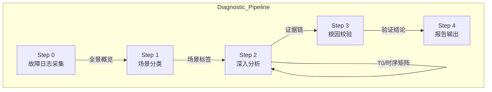
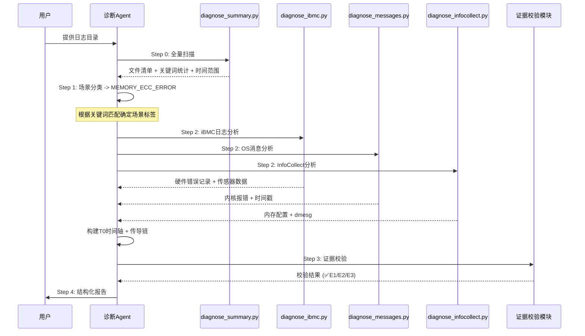

# 离线内存故障诊断 Agent

## 概述

服务器内存故障是数据中心最常见的硬件问题之一。当物理内存颗粒老化、内存条接触不良或系统内存资源耗尽时，可能导致业务进程崩溃、系统挂死甚至数据损坏。然而在实际运维场景中，运维人员面对的不是"内存坏了"这个简单结论，而是散落在 iBMC 硬件日志、OS messages 系统日志、InfoCollect 系统快照中的碎片化线索——一条 ECC 告警、一段 OOM 记录、一行 segfault 报错。

本文解析的离线内存故障诊断 Agent 正是为解决这个问题而生。它是一个**以诊断方法论为核心、以工具链为支撑的智能分析系统**，能够接收服务器离线日志包，自动完成从"日志采集 → 场景分类 → 深度分析 → 证据校验 → 结论输出"的完整诊断闭环。其独特之处在于：它不是一个简单的日志关键字匹配工具，而是一个**内置了诊断思维框架**的 Agent，具备时序推理、多源证据交叉质询、物理级精准定位等类人推理能力。

## 背景

### 当前痛点与挑战

在实际的服务器内存故障诊断中，运维人员面临以下困境：

**信息碎片化严重。** 一次内存故障的线索可能分布在三个不同来源的日志中：iBMC 带外管理日志记录硬件传感器告警（如 `Correctable error, logging limit reached`），OS messages 日志记录内核态异常（如 `Machine Check Exception`、`Out of memory`），InfoCollect 快照记录系统资源快照（如 `MemAvailable` 骤降、`Slab` 异常增长）。单一的日志视角无法还原故障全貌。

**结论容易"发散"。** 如果仅看到一条 `segfault` 或 `OOM killer` 就下结论，很容易误判根因。例如一个 `OOM` 事件可能由物理内存颗粒故障引发的 UCE 数据损坏间接导致，而非简单的业务进程内存泄漏——两者修复路径完全不同。缺乏交叉验证机制的诊断就像没有证据链的指控。

**物理定位精度要求高。** 内存诊断的最终目标不是"内存有问题"，而是精确到"DIMM 010 (Socket 0, Channel A) 第 3 颗粒出现不可纠错 UCE"。运维人员需要这个精度才能精准更换备件。而要从日志中提取这个信息，需要理解不同厂商 iBMC（华为、H3C、浪潮）SEL 日志的编码格式、内核 EDAC 子系统的报错格式、以及物理地址到 DIMM 槽位的映射关系。

### 设计目标

离线内存故障诊断 Agent 的设计围绕三个核心目标展开：

- **让诊断过程可复现、可验证**：通过结构化的步骤流程（Step 0→4）和强制性的证据校验表，确保每一次诊断结论都有明确的多源日志支撑，杜绝"猜测式诊断"。
- **将专家经验编码为 Agent 的推理规则**：将资深内核工程师的排障思维——"先找 T0 故障零点、再构建时序矩阵、最后交叉质询"——转化为 Agent 可以严格执行的规则系统。
- **实现物理级精度的根因定位**：不满足于"内存故障"这类模糊结论，强制 Agent 追踪到 DIMM 槽位号、物理地址或具体泄漏进程。

## 设计思路

### 整体架构：五层诊断管线

Agent 的架构设计采用**严格的管线（Pipeline）模式**，每一层都有明确的输入输出和完成标志，前一层未完成则后一层无法启动：



这种流水线设计的核心思想是**控制诊断发散**：Step 1 确定的场景标签会约束 Step 2 的分析范围，Step 2 产出的初步结论必须经过 Step 3 的多源交叉验证才能进入最终报告。这与人类专家的诊断习惯完全一致——先定性、再定位、最后验证。

### 核心设计：Agent 如何"思考"

Agent 的诊断能力根植于三个核心推理框架：

#### 故障零点（T0）理论

Agent 不盲目搜索所有日志行，而是以**故障零点（T0）** 为锚点构建时间轴。T0 定义为"最早可观测到异常的时间戳"，Agent 按以下优先级确定 T0：

| 优先级 | 来源 | 说明 |
|:---:|:---|:---|
| P1 | 硬件错误日志（iBMC/SEL） | 底层硬件报错，时间点最准确 |
| P2 | 内核感知层（dmesg/mcelog） | 最早出现的 MCE、ECC 纠错报警 |
| P3 | 系统调度层（syslog/messages） | Swap 激增、OOM Killer 调用点 |
| P4 | 应用感知层 | 业务中断日志，通常滞后较大 |

确定了 T0 之后，Agent 以 T0 为基准，向前追溯早期征兆、向后追踪影响传导，构建完整的**事件序列矩阵**。这个矩阵是后续所有推理的基础。

#### 故障传导链推理规则

Agent 内置了两条核心传导链推理规则：

- **规则一（硬件损坏主导）**：`物理内存故障 → ECC 中断(CE/UCE) → 内核 EDAC 感知 → 关键进程段错误/系统 Panic`
- **规则二（泄漏/负载主导）**：`业务高负载/代码漏洞 → 内存逐级耗竭 → Swap 换入换出 → I/O 及 CPU 调度延迟 → OOM Killer 强杀进程`

Agent 会根据 Step 1 的场景分类自动选择合适的推理规则方向，然后结合时序矩阵中的实际日志证据进行传导链重构。

#### 交叉质询（Cross-Examination）机制

这是 Agent 防止"幻觉"最关键的机制。Agent 在得出结论前必须回答三个问题：

1. **时序连续性（E1）**：硬件告警时间是否早于或同步于系统层报错？
2. **物理/逻辑同一性（E2）**：各级日志指控的逻辑错误地址与物理槽位是否对应？
3. **现象排他性（E3）**：是否排除了 BIOS 设置或压力测试干扰？

如果某条证据链无法通过上述校验，Agent 会启动**断链阻断**——回溯重新收集证据，而非强行得出结论。如果确实某一层日志缺失（如无 iBMC 日志），Agent 会**降级**结论为"疑似故障"并标注证据断层位置。

### 扩展性设计：多厂商适配

内存诊断面临的一个现实问题是：不同服务器厂商的 iBMC 日志格式和路径完全不同。华为使用 `sel.db` / `CpuMem_dfl.log`，H3C 使用 `sel.tar` / `kbox_info`，浪潮使用 `selelist.csv` / `ErrorAnalyReport.json`。

Agent 的扩展性策略是**参考资料驱动**：不将厂商特定知识硬编码在诊断脚本中，而是通过独立的参考文档（`references/huawei_ibmc.md`、`references/h3c_ibmc.md`、`references/Inspur_ibmc.md`）为 Agent 提供分析指南。Agent 在诊断时先识别日志包所属厂商，然后加载对应的参考知识进行针对性分析。

## 实现原理

### 核心流程详解

以"服务器出现内存 ECC 告警"为典型场景，Agent 的诊断流程如下：



### 日志采集与场景分类（Step 0 → Step 1）

Agent 启动诊断的第一步是运行 `diagnose_summary.py` 对日志目录进行全量扫描。这个脚本的核心能力不是简单的 grep，而是：

1. **文件类型感知**：根据文件路径和内容自动分类日志为 iBMC / InfoCollect / Messages 三类，识别不同厂商的日志格式
2. **时间范围推断**：从不同格式的时间戳（Syslog 格式 `Mar 16 10:00:00`、ISO 格式 `2026-03-16T10:00:00`、SEL 格式 `03/16/2026 10:00:00`）中提取并对齐时间
3. **内存故障关键词匹配**：覆盖硬件错误（ECC/CE/UCE）、资源耗竭（OOM/Killer）、内存损坏（corruption/segfault）、性能异常（Swap/NUMA）四大类

Step 1 的要点在于场景标签必须精确匹配一种预设场景。这是 Agent 的"分类器"设计——预设了 7 种标准场景（ECC_ERROR、OOM_KILLER、LEAK、CORRUPTION、HARDWARE_FAILURE、CONFIG_ISSUE、PERFORMANCE），每种场景都关联了候选根因假设列表。Agent 在 Step 2 结束后必须逐一标注每个候选根因是 ✅ 证实 / ❌ 排除 / ❓ 证据不足。

### 多源对齐与物理定位（Step 2）

这是 Agent 最核心的分析步骤。关键实现逻辑是 `diagnose_memory.py` 中的 `MemoryAnalyzer` 类：

```python
class MemoryAnalyzer:
    def __init__(self, log_dir):
        self.log_dir = log_dir
        self.results = []
        self.error_data = []
    
    def analyze_memory_info(self):
        # 从 meminfo 提取内存总量、HugePages、Slab
        # 建立系统级内存配置基线
    
    def analyze_errors(self, scenario=None, keywords=None, date_filter=None):
        # 跨 messages/syslog/dmesg/sel/ibmc 多源搜索
        # 每条错误记录打上 timestamp + file + description 标签
        # 为后续时间轴对齐提供结构化数据
```

Agent 在分析时需要处理一个现实问题：**时钟偏差**。iBMC 的时间与 OS 时间（NTP）可能存在偏移，Agent 需要在多源对齐时留意并修正这个偏差量。

物理定位的精度来自于对不同日志源的分析融合：

```text
iBMC SEL: "Correctable error, logging limit reached" → 严重告警
内核 EDAC: "EDAC MC0: 1 CE on DIMM_A1"               → 物理槽位定位
OS dmesg: "Memory failure: ... Isolated"              → hwpoison 隔离
```

Agent 将这三层信息对齐后即可确定：T0 时间、受损物理槽位（DIMM_A1）、错误类型（CE 风暴）、当前状态（部分页面已隔离）。

### 证据校验与反幻觉机制（Step 3）

Step 3 是整个管线中最体现 Agent 设计哲学的一个步骤。它不仅仅是验证结论，更是**防止 Agent 产生虚假诊断**的防火墙。

关键实现逻辑是证据校验表的三维验证：

| 校验维度 | 校验逻辑 | 反例 |
|:---|:---|:---|
| E1 时序连续性 | 硬件告警时间必须早于或同步于系统层报错 | 如果 iBMC 无记录但 OS 有 segfault，不能判定硬件故障 |
| E2 物理/逻辑同一性 | 日志中的物理地址应映射到同一 DIMM 槽位 | 如果 A 日志和 B 日志指控的槽位不一致，需要排查映射关系 |
| E3 现象排他性 | 排除 BIOS 配置错误或压力测试等人为因素 | 如刚执行了 `stress --vm` 测试，OOM 可能是测试所致 |

Agent 使用一个精妙的**防发散规则**：在证据链未能满足完全闭环标准前，**严禁使用**"肯定"、"必然"、"内存绝对已坏"等决定性断言。这个规则在代码层面虽然没有硬编码，但在 SKILL.md 中作为 Agent 的"元指令"明确约束了输出行为。

### 多源日志格式统一处理

Agent 的脚本需要处理三种截然不同的时间戳格式：

```python
TIME_PATTERNS = [
    (r'(\w{3}\s+\d+\s+\d{2}:\d{2}:\d{2})', "MMM D HH:MM:SS (Syslog)"),
    (r'(\d{4}-\d{2}-\d{2}[T ]\d{2}:\d{2}:\d{2})', "YYYY-MM-DD HH:MM:SS (ISO)"),
    (r'(\d{2}/\d{2}/\d{4}\s+\d{2}:\d{2}:\d{2})', "MM/DD/YYYY HH:MM:SS (SEL)"),
]
```

这种格式统一是 Agent 实现多源对齐的基础。所有注入 `error_data` 的记录都携带统一的 timestamp 字段，使得后续的时序排序和对齐可以在统一的时间轴上完成。

## 权衡与取舍

### 严格管线 vs. 灵活跳过

Agent 要求"必须严格按 Step 0→1→2→3→4 顺序执行"，这在实践中是一把双刃剑。

**优势**：防止 Agent 跳过关键验证步骤直接得出结论。如果用户只提供了一个 messages 日志包，Agent 在 Step 0 扫描后会自动降级分析策略（规则 4），但仍必须经历场景分类（Step 1）才能进入深入分析（Step 2）。

**代价**：在某些极简场景下（如用户已经知道是内存 ECC 问题，只想快速定位 DIMM 槽位），管线可能显得冗余。Agent 为此提供了参数化的快速路径，如 `diagnose_memory.py --ecc` 可以直达 ECC 专项分析。

### 诊断精度 vs. 证据完整性

Agent 的设计倾向是**宁可降级结论也不做出无证据支撑的判断**。当某一层日志缺失时，Agent 会声明为"疑似故障"而非强行得出结论。这在实践中意味着：

- 如果有 iBMC + OS 双重证据：结论为"已证实"
- 如果仅有 OS 层日志（无 iBMC）：结论为"高度疑似"
- 如果仅有单条 segfault 一行日志：结论为"证据不足，无法定位"

这种保守策略在要求高可靠性的企业级场景中更为合适，但也意味着 Agent 在某些缺乏完整日志包的场景中能力受限。

### 通用框架 vs. 厂商深度适配

Agent 采用"通用分析框架 + 厂商参考文档"的策略来平衡这两个矛盾。通用脚本（`diagnose_ibmc.py`）覆盖华为、H3C、浪潮三家的存储管理接口，而厂商特有的日志格式分析则通过参考文档来扩展。这种设计的优点是不需要为每个厂商维护一套独立的诊断脚本，缺点是当遇到厂商特有的日志格式时，Agent 需要依赖参考文档中的知识来人工解析，而不是自动完成。

## 使用体验：与 Agent 的协作流程

### 典型诊断会话

用户与 Agent 的协作通常分为以下步骤：

**1. 准备日志包**

用户将服务器离线日志包整理为标准结构：

```text
<日志根目录>/
├── ibmc_logs/                  # iBMC 硬件带外管理日志
├── infocollect_logs/           # 系统信息收集工具生成的分类日志
└── messages/                   # 操作系统层面的系统日志
```

如果日志包不完整（如仅有 messages），Agent 会自动降级分析策略。

**2. 发起诊断**

用户只需提供日志目录路径，Agent 自动执行全流程：

```bash
# 场景：未明确过滤条件（全量扫描）
python3 scripts/diagnose_summary.py <log_dir>

# 场景：已知故障关键词（精确过滤）
python3 scripts/diagnose_summary.py <log_dir> -k "DIMM010" "ecc error"

# 场景：已知故障发生时间（时间窗过滤）
python3 scripts/diagnose_summary.py <log_dir> -s "2026-03-10 08:00:00" -e "2026-03-10 12:00:00"
```

**3. Agent 输出诊断结论**

诊断完成后，Agent 在界面直接输出结构化报告，包含：

```text
1. Executive Summary
   - 故障对象: DIMM 010 (Socket 0, Channel A)
   - 根因类型: 内存颗粒老化（CE 风暴 → UCE）
   - 置信度: 已证实（iBMC + MCE 双重证据）

2. Fault Chains
   - 时间链: [T0-2h CE风暴] → [T0-10m 告警阈值] → [T0 UCE] → [T0+30s 系统Panic]
   - 传播链: DIMM_A1 颗粒老化 → CE 频繁触发 → 日志阈值满 → UCE 位反转 → 
             CPU CATERR → 系统 Panic → 重启

3. Evidence Matrix
   - ✅ E1 时序一致: iBMC 告警早于 OS 报错
   - ✅ E2 槽位一致: iBMC + EDAC 均指向 DIMM_A1
   - ✅ E3 排除干扰: 无近期压力测试记录

4. Recommendations
   - 立即: 替换 DIMM 010
   - 预防: 检查同批次其他 DIMM 的 CE 计数趋势
```

### 参数化灵活控制

Agent 提供了丰富的命令行参数来适应不同场景：

```bash
# 快速查看所有脚本支持
python3 scripts/diagnose_memory.py --help

# ECC 专项分析
python3 scripts/diagnose_memory.py <log_dir> --ecc

# OOM/泄漏专项分析
python3 scripts/diagnose_memory.py <log_dir> --oom

# 自定义关键词 + 时间窗
python3 scripts/diagnose_ibmc.py <log_dir> -k "ECC" "DIMM" -d "2025-07-21"
```

### 典型适用场景

Agent 在以下场景中能充分发挥能力：

- **服务器宕机后根因追溯**：服务器因内存问题重启后，运维人员收集日志包让 Agent 分析，快速确定是否需要更换 DIMM
- **内存告警分级处理**：iBMC 上报 `Correctable error, logging limit reached`，Agent 判断是连续 CE 风暴（需换 DIMM）还是偶发事件（可观察）
- **OOM 事件源头排查**：区分是业务进程内存泄漏还是底层硬件故障导致的二次效应
- **多厂商统一诊断**：同一个诊断框架覆盖华为、H3C、浪潮等多种服务器，运维人员不需要切换分析工具

## 总结

离线内存故障诊断 Agent 的设计核心可以概括为：**将专家诊断思维以可执行规则的形式嵌入 Agent 的推理管线中**。

从技术角度看，它最值得借鉴的设计包括：T0 故障零点理论驱动的时序分析、交叉质询机制构成的反幻觉防线、以及"证据完整性决定结论置信度"的保守诊断策略。这些设计使得 Agent 在面对不完整、多源异构的服务器日志时，能够保持诊断结论的严谨性和可追溯性。

从使用体验看，Agent 提供了一个结构化的诊断流水线，运维人员只需提供日志包路径，即可获得从时序矩阵到物理定位再到修复建议的完整诊断报告。参数化的快速路径设计也兼顾了有经验的用户绕过冗余步骤直接获取所需信息的需求。

值得注意的是，Agent 的能力仍有边界：它无法处理实时在线诊断（需要带外数据通道）、无法覆盖所有厂商的日志格式（需要补充参考文档）、且在日志包严重不完整时会降级诊断结论。理解这些边界对于在真实运维场景中正确使用 Agent 至关重要。
