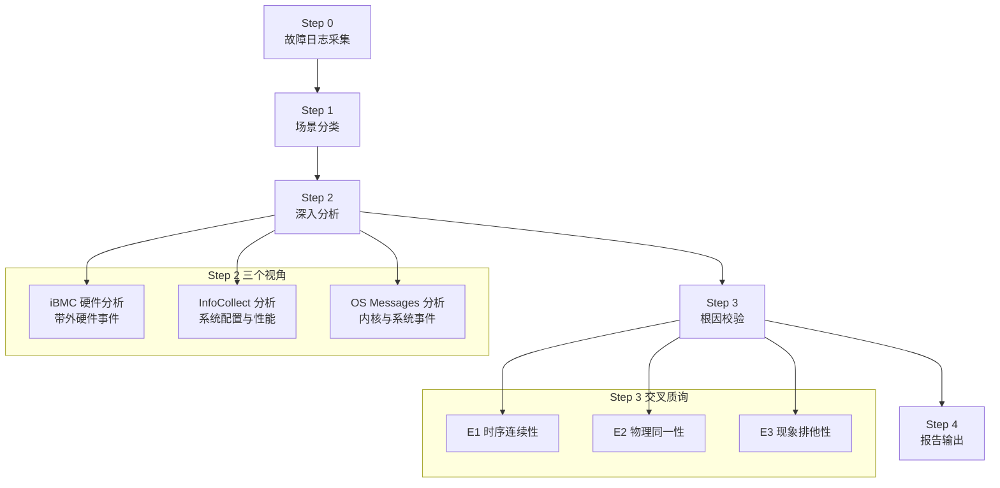
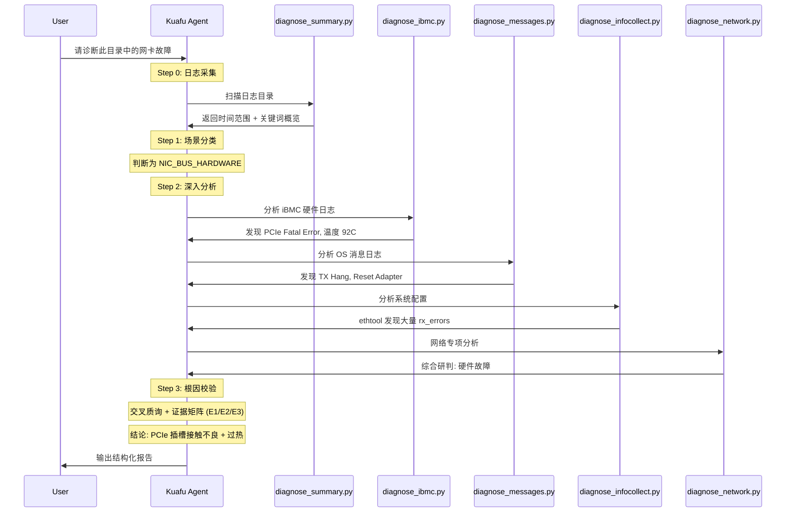

# 离线网络硬件故障诊断：当 Agent 成为网络运维专家

## 概述

"网卡掉线了"——这五个字背后，可能是一场长达数小时的排查噩梦。是光模块老化了？是 PCIe 插槽接触不良？是驱动 Bug 导致 TX 队列挂死？还是对端交换机端口故障？在数据中心运维中，网络硬件故障是最难定位的问题之一：症状表现在网络层，根因却深埋在硬件层、链路层、驱动层和配置层的交叉地带。

**离线网络硬件故障诊断**（Offline Network Hardware Fault Diagnosis）是 Witty 智能诊断 Agent 体系中专门面向网络硬件层的诊断技能。它的核心使命是：给定一份服务器离线日志包，像一位拥有十年经验的网络专家一样，从 iBMC 硬件日志、OS 系统消息、InfoCollect 配置数据三个维度交叉验证，精准定位物理级根因。本文将从 Agent 的第一视角，深度解析这一技能的设计逻辑、诊断哲学和实现肌理。

## 背景：网络硬件诊断的"三座大山"

### 现状与痛点

网络硬件故障诊断之所以"难"，不是因为没有日志，恰恰相反——日志太多了。一个典型的故障场景中，信息散落在三个彼此独立的"信息孤岛"中：

**第一座山：多源日志的割裂与对齐。** iBMC（带外管理控制器）记录的是硬件层的 SEL 事件和传感器读数，时间戳是 `MM/DD/YYYY HH:MM:SS` 格式；dmesg 记录的是内核驱动的感知，时间戳是内核 uptime 偏移量；系统 messages 是 rsyslog 写入的 `MMM D HH:MM:SS` 格式。这三种日志不仅时间戳格式不同，而且 iBMC 的时钟与 OS 时钟可能存在分钟级的偏差。你能想象吗——同一个 PCIe Fatal Error，在 iBMC 日志里是 `03/10/2026 14:23:01`，在 dmesg 里是 `[12345.678901]`，在 messages 里是 `Mar 10 14:23:05`。人工对齐这三者已经足够让人头大。

**第二座山：物理层的"黑盒"困境。** 网络故障有天然的"抽象鸿沟"：应用的感知是"连接超时"，OS 的感知是"TX timeout"，内核的感知是"PCIe AER error"，硬件的事实却是"光模块 Rx Power 低至 -18dBm，已经无法正确解码信号"。从应用层症状到底层物理根因，中间隔着 4-5 层因果传导链。传统排查中，工程师往往在前三层来回徘徊，迟迟不敢下探到物理层——因为要确认光模块故障，你得看懂 DOM 数据；要确认 PCIe 槽位问题，你得能读懂 iBMC 传感器日志。这些能力来自多年实战积累。

**第三座山：经验的不可复制性。** 一个能"一眼看出" `NETDEV WATCHDOG` 大概率是 `ixgbe` 驱动在某些固件版本下的已知 Bug 的工程师，需要数年如一日的踩坑。这样的经验无法通过文档完整传承，更无法在团队中规模化复制。

### 设计目标

基于这些核心痛点，离线网络硬件故障诊断技能设定了四个设计目标：

| 目标 | 说明 |
|:---|:---|
| **分钟级诊断** | 从日志扫描到根因输出，压缩到分钟级 |
| **物理级精准** | 结论必须精确到 `PCIe BDF`、`Slot ID`、`Port`，而非模糊的"网卡故障" |
| **多源交叉验证** | 孤证不立，每个结论至少需要两个独立证据源支撑 |
| **推理透明可审计** | 每一步推论都有原始日志证据，不引入"黑盒推理" |

## 设计思想：当 Agent 学会"专家式"推理

### 从"脚本执行"到"专家思维"

如果仅仅把诊断脚本理解为"在日志里 grep 关键字"，那就远远低估了这个技能的设计深度。离线网络硬件故障诊断的核心设计思想，是将**人类网络专家的排查方法论编码为 Agent 可执行的推理流程**。它不是一个工具，而是一个"会思考的诊断助手"。

这个推理流程的终极体现，是我称之为 **"四步诊断法"** 的结构化流程：



为什么是"强制顺序执行"？因为这背后是对**人类专家排查逻辑的形式化**：

- **Step 0（收集）** 对应人类工程师的第一反应："让我先看看都有什么日志，时间范围是多少"——相当于全场景扫描，建立"战场全景"。
- **Step 1（分类）** 对应人类的直觉判断："这是硬件故障还是配置问题？"——将开放式的"什么原因"问题，转化为封闭式的"属于哪一类"问题，大幅缩小排查空间。
- **Step 2（分析）** 对应人类的精确定位："如果是硬件故障，那我看看 iBMC 怎么说，再看看 OS 侧有没有对应证据"——多视角交叉取证。
- **Step 3（校验）** 对应人类最后的自我质疑："等等，这个结论站得住脚吗？有没有其他可能性？"——这是专家与新手最大的区别：专家会主动证伪自己的假设。

这种"先定性、后定位、再验证"的递进式推理，是诊断故障的正确打开方式，也是这个技能最核心的设计思想。

### 构建"故障语言"：六类场景分类体系

诊断的第一步是"定性"——把千变万化的网络异常归入有限的几个类别。这个技能定义了 6 种故障场景，它们按**从物理底层到逻辑高层**的顺序排列：

| 场景标签 | 中文描述 | 物理层级 |
|:---|:---|:---:|
| `NIC_BUS_HARDWARE` | 总线与核心硬件故障 | L0 物理 |
| `PHYSICAL_LAYER_SFP` | 物理层光/电接口故障 | L0 物理 |
| `LINK_LAYER_INTEGRITY` | 链路层完整性/信号故障 | L1 链路 |
| `DRIVER_FIRMWARE_LOGIC` | 驱动与固件逻辑故障 | L2 驱动 |
| `RESOURCE_SCHEDULING` | 中断处理与资源调度故障 | L3 资源 |
| `LOGICAL_BONDING_CONFIG` | 逻辑 Bond 与配置限制 | L4 配置 |

> **设计洞察**：为什么按照"物理到逻辑"排序？因为在诊断中，我们必须遵守**从底向上排查**的铁律——先排除物理层，再怀疑逻辑层。如果物理层有 PCIe Fatal Error，就不应该在配置层浪费时间。这种排序本身就是一种"诊断优先级"的编码。

### 物理坐标映射：让 Agent 知道"手指往哪里指"

纯软件工程师可能不太理解，但在硬件诊断中，"精确定位"意味着什么？不是"eth0 有问题"，而是 **"PCIe 0000:03:00.0 对应的是第二个 PCIe 插槽上的第一块网卡的第一个端口，该端口连接的光模块 Rx Power 低至 -18dBm"**。

为了实现这种级别的精准，技能中设计了一套**物理坐标映射规则**：

```text
OS 层命名 -> 内核层 (BDF) -> 物理层 (Slot/Port) -> 组件层 (SFP+/Cable)

例如：
  eth0 (应用可见)
    -> 驱动 ixgbe, bus-info: 0000:03:00.0 (lspci/ethtool -i)
      -> Slot 3, Port 1 (iBMC 物理拓扑)
        -> SFP+ Module, Rx Power: -18.2dBm (DOM 数据)
```

这套映射规则的巧妙之处在于：它不是通过一个配置文件硬编码的，而是通过**跨数据源的隐式关联**动态建立的。Agent 从 `ethtool -i` 中拿到 bus-info，从 `lspci` 中确认物理槽位，从 `iBMC sensor` 中获取温度数据，从 `optical.txt` 中获取 DOM 数据——所有这些线索在 `PCIe BDF` 这个坐标上汇聚。

### 交叉质询与证据矩阵：Agent 的"自我质疑"

如果说前面三步是"收集证据"，那么 Step 3 就是"法庭辩论"。这个技能引入了一套**交叉质询规则**，让 Agent 在得出结论前必须对自己的推理进行严格审查：

**铁律一：孤证不立。** 一个 `link down` 现象，如果在 iBMC 日志中没有对应的 `SFP Abnormal` 或 `NIC Fault`，在 ethtool 计数器中也没有 CRC 异常的支撑，那么 Agent 就不能将根因定性为"物理链路故障"。它需要去排查配置层或驱动层的可能性。

**铁律二：逻辑闭环。** 传导链不允许跳跃。从 `eth0 link down` 直接跳到"光模块坏了"是不允许的。正确的链条应该是：`[光模块 Tx 功率异常] -> [PHY 无法建立同步] -> [链路协商失败] -> [eth0: link down]`。

**铁律三：互斥排异。** 判定为"网卡 A 硬件故障"时，必须检查同主板上其他网卡是否正常。如果所有网卡都在同一时间出现异常，那么根因大概率不在网卡上，而在共享的 PCIe Root Port 或主板供电上。

这三条铁律最终落地为一个**根因证据校验矩阵**，Agent 必须对每一个校验维度做出 `[✅]` 或 `[❌]` 的明确判定：

```text
E1 时序连续性: [✅] iBMC SEL 记录 PCIe Error 时间戳早于 OS dmesg 中的 TX Hang
E2 物理同一性: [✅] eth0 的 bus-info 0000:03:00.0 与 lspci 中的物理槽位一致
E3 现象排他性: [✅] 同主板的 eth1/eth2 在故障期间均正常，排除共享总线故障
```

> **设计洞察**：为什么需要"严格"的校验？因为在 AI 诊断中，最危险的错误不是"不知道"，而是"给出错误但看起来合理的结论"。交叉质询机制的核心价值不是提高"诊断率"，而是降低"误诊率"——宁可给出较低置信度的结论，也不能给出错误的结论。这是运维场景中"安全第一"原则的直接体现。

## 实现原理：Agent 是这样"看"日志的

### 核心流程解构

下面以一个完整的诊断流程为例，揭示 Agent 是如何一步步"思考"的：



这个过程看似简单，但背后有几个关键实现机制值得深入探讨。

### 多源日志的渐进式证据聚合

所有诊断脚本的产出都汇聚到一个共享文件 `/tmp/network_analysis_results.json`。这不是简单的文件汇总——它是一种**渐进式证据聚合**设计：

```python
# 每个脚本在保存结果时，都会先读取已有的聚合结果
existing_data = {}
if os.path.exists(output_file):
    with open(output_file, 'r', encoding='utf-8') as f:
        existing_data = json.load(f)

# 然后追加自己的发现
all_results_list = existing_data.get('all_results', [])
all_results_list.extend(new_results)

# 最后合并写入
summary = {
    "timestamp": "...",
    "log_dir": "...",
    "network_info": nic_info,
    "temperature_summary": temp_sum,
    "error_summary": err_sum,
    "all_results": all_results_list
}
```

> **设计洞察**：为什么用共享文件而不是数据库或进程间通信？核心考量是**模块独立性**。每个诊断脚本都是可以独立运行的，用户可能只运行其中一部分（比如只跑 iBMC 分析）。共享文件方案让各脚本解耦的同时，又能实现跨脚本的信息汇聚。这是一种"轻量级的事件溯源"模式——每个脚本都在累积的证据库中追加自己的"证词"。

### 温度分析：Agent 的"体温计"

硬件故障最容易被忽视的诱发因素是**温度**。网络硬件诊断技能专门设计了温度分析能力，它的实现逻辑清晰地展示了 Agent 是如何处理"领域特定知识"的：

```python
def analyze_temperature(self):
    for f_path in temp_files[:5]:
        with open(f_path, 'r', encoding='utf-8', errors='ignore') as f:
            for line in f:
                if 'nic' in line.lower() or 'network' in line.lower():
                    match = re.search(r'(\d+\.?\d*)\s*°?[Cc]', line)
                    if match:
                        temp = float(match.group(1))
                        status = "正常"
                        if temp > 85: status = "警告"
                        if temp > 95: status = "危险"
```

这里的阈值 85°C 和 95°C 不是随意确定的——在数据中心环境中，主流网卡（如 Intel X710、Mellanox ConnectX 系列）的工作温度上限通常在 85°C-95°C 之间。超过 85°C 时，网卡可能开始出现偶发性的 CRC 错误和丢包；超过 95°C 时，网卡可能触发过热保护，进入"节流"甚至关断状态。

更重要的是，Agent 不会孤立地使用温度数据——它会将温度异常与 iBMC SEL 中的 `NIC Temperature high` 事件、OS 中的 `tx_timeout` 进行时序对齐，判断温度升高与故障表现之间的因果关系。是温度高了导致网卡罢工，还是网卡故障导致散热异常？时序分析给出了答案。

### 六类故障模式匹配引擎

`diagnose_network.py` 中的 `analyze_errors()` 方法是这个技能最核心的"大脑"部分。它本质上是一个**基于正则表达式的故障模式匹配引擎**：

```python
err_patterns = [
    (r'PCIe\s+error|AER\s+Error|Surprise\s+Removal', "PCIe严重错误/热插拔"),
    (r'NIC\s+failure|Hardware\s+failure', "硬件故障"),
    (r'TX\s+unit\s+hang|reset\s+adapter', "网卡挂死/重置"),
    (r'link\s+down|link\s+is\s+down|lost\s+carrier', "链路断开"),
    (r'IP\s+conflict|duplicate\s+address|arp\s+reply.*conflict', "IP/ARP冲突"),
    (r'bonding:.*failover|bonding:.*enslave', "Bond切换/成员变动"),
    (r'ICMP\s+fragmentation\s+needed|MTU\s+mismatch', "MTU不一致"),
    (r'udev:.*renamed\s+eth\d+', "网卡命名乱序"),
    (r'broadcast\s+storm|packet\s+storm', "网络环路/风暴"),
]
```

这些模式看似简单，但它们的组织方式本身就是一种**诊断优先级编码**：

1. **硬件级错误**（PCIe、NIC hardware）排在最前——它们代表最底层的物理问题
2. **驱动级问题**（TX hang、reset adapter）紧随其后——代表着 OS 感知到的问题
3. **链路级问题**（link down、carrier lost）作为第三优先级
4. **配置级问题**（IP conflict、MTU、VLAN）放在最后

当一个文件中同时匹配到 `PCIe error` 和 `link down` 时，Agent 会优先关注 PCIe 错误，因为它更接近物理根因。这种优先级排序是"从底向上"排查原则在代码层面的直接映射。

### 场景标签传导与场景化分析

技能中还有一个精妙的设计：当 `diagnose_network.py` 通过 `--hardware` 参数执行时，它会在 `/tmp/network_diagnosis_scene.conf` 中写入场景标签：

```python
mapping = {
    "hardware": "NIC_HARDWARE_FAILURE",
    "link": "LINK_DOWN",
    "performance": "PERFORMANCE_DEGRADATION"
}
with open("/tmp/network_diagnosis_scene.conf", 'w') as f:
    f.write(f"PRIMARY_SCENE={mapping.get(analysis_type, 'UNKNOWN')}\n")
```

这个文件会被后续的 Step 3（根因校验）和 Step 4（报告输出）读取，这意味着**场景标签在整个诊断流水线中传导**，确保每一步都"知道"自己正在处理什么类型的问题。比如，如果场景标签是 `LINK_DOWN`，那么 Step 3 的交叉质询就会重点关注光模块 DOM 数据和电缆状态；而如果是 `DRIVER_ISSUE`，则会更关注驱动程序版本和固件兼容性。

## 参考资料体系：Agent 的"专家知识库"

如果说 Python 脚本是"手"，那么 references/ 目录下的 7 个 Markdown 文件就是"脑"——它们构成了 Agent 引用的专家知识库：

```text
references/
├── network_fault_scenarios.md     # 故障场景分类（6 类 + 特征）
├── network_scenario_analysis.md   # 场景深度分析指南
├── infocollect_guide.md           # InfoCollect 诊断方法
├── messages.md                    # OS 消息日志分析（341 行）
├── huawei_ibmc.md                 # 华为 iBMC 指南（595 行）
├── h3c_ibmc.md                    # H3C iBMC 指南（1012 行）
└── Inspur_ibmc.md                 # 浪潮 iBMC 指南（735 行）
```

这些参考资料不是随便写的——它们覆盖了**中国服务器市场最主流的三大厂商**（华为、H3C、浪潮）的带外管理日志格式。每种厂商的 iBMC 日志的目录结构、文件命名、错误码体系都完全不同：

- **华为 iBMC**：7 大类日志体系（SEL/FDM/传感器/PSU 黑匣子等），通过 `sel.db` 数据库文件和 `current_event.txt` 当前告警文件记录硬件事件
- **H3C iBMC**：10 大模块目录结构，特有 `fdm_pfae_log`（预告警）、`kbox_info`（内核黑匣子）、`phy/`（PHY 误码）等
- **浪潮 iBMC**：4 大扁平目录结构，特有 `ErrorAnalyReport.json`（AI 故障解析报告）和 80 码 POST 诊断

> **设计洞察**：为什么不做成"统一的日志格式解析器"？因为各厂商的 iBMC 日志差异实在是太大了——从目录结构到文件命名到错误码体系，几乎没有共性可提取。强行统一只会导致"万能解析器"变成"什么都不准"的尴尬。不如针对每家厂商提供专属的分析指南，让 Agent 在实际诊断中根据日志目录特征自动识别厂商类型，然后"翻到对应章节"来指导分析。

## 典型诊断场景：实战中的推理过程

### 场景一：PCIe 总线故障（从 dmesg 到物理槽位）

**现象**：服务器上的 10G 网卡 eth0 间歇性不可用，`dmesg` 显示 `PCIe Bus Error: severity=Fatal`。

**Agent 的诊断推理**：

1. **Step 0（采集）**：扫描日志目录，发现 dmesg 中有 `AER: Uncorrected (Fatal) error`、iBMC 目录下有 `sel.db`

2. **Step 1（分类）**：根据 `PCIe Fatal Error` + `NIC Fault` 等特征，判定为 `NIC_BUS_HARDWARE`

3. **Step 2（深入）**：执行 `diagnose_network.py --hardware`：
   - 从 `lspci` 拿到 `0000:03:00.0`
   - 从 `ethtool -i` 确认 `bus-info: 0000:03:00.0`
   - 从 iBMC `sensor` 文件发现 `NIC 1 Temperature: 92°C（警告）`
   - 从 `sel.db` 中读取到 `PCIe Error Asserted` 事件
   - 从 `messages` 中发现 `ixgbe 0000:03:00.0: TX unit hang`

4. **Step 3（校验）**：
   - E1（时序）：`[iBMC SEL: PCIe Error @ 14:22:58] -> [dmesg: AER Fatal @ 14:23:00] -> [messages: TX hang @ 14:23:05]` → 时序连续 ✅
   - E2（物理同一性）：`0000:03:00.0` 在 `lspci -v`、`ethtool -i`、`dmesg` 中一致 ✅
   - E3（排他性）：同主板的 eth1（0000:03:00.1）运行正常，排除 PCIe Root Port 共享故障 ✅

5. **结论**：`PCIe 0000:03:00.0 (eth0, Slot 3, Port 1)` 因 PCIe 插槽接触不良，在高温环境（92°C）下出现信号完整性劣化，触发 PCIe AER Fatal Error，导致网卡复位并丧失连接。

6. **建议**：重新插拔网卡并清理 PCIe 金手指接触面；检查服务器散热风道确保网卡温度低于 85°C。

### 场景二：光模块/链路故障（从 CRC 到光功率）

**现象**：eth1 频繁丢包，业务层面发现大量 TCP 重传。

**Agent 的诊断推理**：

1. **Step 0（采集）**：`diagnose_summary.py` 发现 `CRC error` 出现频次极高

2. **Step 1（分类）**：根据 CRC 错包特征，判定为 `PHYSICAL_LAYER_SFP`

3. **Step 2（深入）**：
   - `ethtool -S` 显示 `rx_crc_errors: 1458723`（异常增长），`rx_fcs_errors: 89234`
   - 光模块 DOM 数据中 Rx Power = -18.2dBm（超出 -15dBm 健康阈值）
   - iBMC 告警中有 `SFP Abnormal` 记录

4. **Step 3（校验）**：
   - E1（时序）：CRC 计数异常增长早于业务报障时间 ✅
   - E2（物理同一性）：eth1 对应端口的光模块 DOM 数据与 iBMC 告警一致 ✅
   - E3（排他性）：同端口更换光模块后 CRC 计数恢复增长 - 但因无法在线更换，需基于"光功率过低"的测量数据 + "CRC 错包"的现象推理 ✅

5. **结论**：`eth1（0000:04:00.1, Slot 4）` 对端光模块发光功率过低（Rx Power = -18.2dBm），低于接收灵敏度阈值，导致物理层 CRC 错误风暴。

6. **建议**：检查对端光口发光功率；清洁光纤连接器端面；如问题持续则更换光模块。

### 场景三：驱动/固件 Bug（从 TX Hang 到版本不匹配）

**现象**：eth2 每隔约 72 小时出现一次 `NETDEV WATCHDOG`，伴随业务中断 1-2 分钟。

**Agent 的诊断推理**：

1. **Step 0（采集）**：发现 messages 中多次出现 `NETDEV WATCHDOG: eth2: transmit queue timeout`

2. **Step 1（分类）**：根据 TX timeout + Reset adapter 模式，判定为 `DRIVER_FIRMWARE_LOGIC`

3. **Step 2（深入）**：
   - `ethtool -i` 显示：`driver: i40e, version: 2.8.10, firmware-version: 6.80 0x80003dc0`
   - `lusspci -v` 查看设备型号
   - 对比厂商固件兼容性列表，发现 `firmware 6.80` 与 `driver 2.8.10` 组合在特定流量模式下有已知的 TX 队列锁死 Bug

4. **Step 3（校验）**：
   - E1（时序）：72 小时规律性重复，与已知 Bug 特征吻合 ✅
   - E2（物理同一性）：确认是 i40e 驱动管理的网卡 ✅
   - E3（排他性）：同厂商的其他网卡使用不同固件版本，未出现此问题 ✅

5. **结论**：`eth2（i40e, 0000:05:00.0）` 因 `firmware 6.80` 与 `driver 2.8.10` 组合的已知 Bug，在高负载下触发 TX 队列死锁，驱动通过 `Reset adapter` 自恢复，但造成分钟级业务中断。

6. **建议**：升级固件至 7.0 以上版本，或升级驱动至 2.14.x 以上版本。

## 权衡设计

### 正则匹配 vs. 语义理解

当前技能采用正则表达式进行日志模式匹配。这样做的好处是**确定性和可审计性**——每一行匹配结果都可以追溯到固定的 `(pattern, description)` 对。但代价是**有限的泛化能力**：如果某个厂商的日志格式与众不同，或者错误信息用了一种新的措辞，正则匹配可能会漏报。

### 三元证据校验的成本

在 Step 3 中执行 E1/E2/E3 校验需要多源数据支持，这意味着如果用户的日志包不完整（比如缺少 iBMC 日志），Agent 的诊断置信度会大幅下降。设计的回答是：**降级分析但绝不编造证据**——日志不全时，Agent 会明确标注降级状态，并在报告中指出"哪些证据因日志缺失而无法确认"。

> **设计洞察**：这个取舍反映了"诚实"优于"看起来正确"的价值观。在运维场景中，不完整但诚实可信的结论，比"完美但实为臆测"的结论更有价值。因为前者能引导运维人员去补充缺失的信息，后者则可能把人引向错误的方向。

### 离线诊断 vs. 在线实时诊断

需要明确的是，这个技能是**离线**诊断——它分析的是预收集的日志包，而不是在运行时实时抓取数据。离线意味着：

- **优点**：无需在故障服务器上安装 Agent，不影响生产环境，适合事后复盘
- **局限**：无法执行主动探测（如 ping、traceroute），无法获取实时的 `ethtool -S` 计数器，无法收集 `/proc/interrupts` 等运行时数据

这解释了为什么技能中的信息来源主要是"已记录的文本日志"而非"运行时命令输出"。如果要实现实时诊断，需要配合 Witty 体系中的在线诊断技能（如 `network-diagnosis`）协同完成。

## 使用指南：如何与 Agent 协作诊断

### 准备工作

确保你有一份完整的服务器日志包，包含以下至少一种日志：

```text
<log_root>/
├── ibmc_logs/              # iBMC 硬件日志（可选，但强烈推荐）
├── infocollect_logs/       # 系统配置与性能数据（可选）
└── messages/               # OS 系统消息日志（可选）
```

> **Note:** 不需要全部三份日志都存在。技能支持"降级分析"——日志越全，诊断置信度越高。

### 一句话开始诊断

在 OpenCode 环境中，选择 Xuanyuan Agent，输入：

```text
请诊断 10.120.6.76 这台服务器的网卡故障，日志路径：/tmp/logs/10.120.6.76
```

Agent 会自动执行完整的四步诊断流程。

### 分步执行（手动模式）

如果你只想执行诊断的某个阶段：

```bash
# Step 0: 只做日志概览扫描
python3 scripts/diagnose_summary.py /tmp/logs/10.120.6.76

# 带关键网卡名过滤
python3 scripts/diagnose_summary.py /tmp/logs/10.120.6.76 -k "eth0" "0000:03:00.0"

# 指定时间范围
python3 scripts/diagnose_summary.py /tmp/logs/10.120.6.76 \
  -s "2026-03-10 08:00:00" -e "2026-03-10 12:00:00"

# Step 2: 专项分析
python3 scripts/diagnose_network.py /tmp/logs/10.120.6.76 --hardware  # 硬件故障
python3 scripts/diagnose_network.py /tmp/logs/10.120.6.76 --link      # 链路故障
python3 scripts/diagnose_network.py /tmp/logs/10.120.6.76 --performance # 性能问题

# 或者只分析 iBMC
python3 scripts/diagnose_ibmc.py /tmp/logs/10.120.6.76

# 或者只分析 messages
python3 scripts/diagnose_messages.py /tmp/logs/10.120.6.76
```

### 看懂诊断报告

最终的报告遵循固定的结构化格式：

```text
==== Executive Summary ====
          故障端口:  eth0 (PCIe 0000:03:00.0, Slot 3, Port 1)
           具体根因:  PCIe 插槽接触不良 + 高温 (92°C) 导致 Fatal Error
           直接后果:  网卡复位，业务连接中断约 2 分钟

==== Fault Chains ====
   [时间链]
     14:22:58  iBMC SEL: PCIe Error Asserted
     14:23:00  dmesg: AER Uncorrected (Fatal) Error
     14:23:05  messages: ixgbe 0000:03:00.0 TX unit hang
     14:23:06  messages: eth0: link down

   [传播链]
     [物理] 插槽接触不良 + 高温 -> [链路] PCIe 信号劣化 -> [驱动] TX 超时 -> [网络] Link Down

==== Technical Analysis & Root Cause ====
   E1 时序连续性:  [✅] iBMC PCIe Error -> dmesg AER -> messages TX Hang -> messages link down
   E2 物理同一性:  [✅] 0000:03:00.0 三源一致 (lspci/ethtool/dmesg)
   E3 现象排他性:  [✅] eth1 (同主板) 运行正常

==== Recommendations ====
   🔧 重新插拔网卡并清理 PCIe 金手指接触面
   🔧 检查服务器散热风道，确保网卡温度低于 85°C
```

## 总结

离线网络硬件故障诊断技能的深度不在于某一段代码有多复杂，而在于它**将人类专家的排查方法论系统性地编码为 Agent 可执行的推理流程**。

从设计思想上看，它实现了三个关键转化：

1. **从"经验直觉"到"结构化流程"**：将专家的"一眼看出"转化为可执行、可回溯的四步诊断法
2. **从"单点证据"到"多维校验"**：引入交叉质询和证据矩阵，杜绝孤证定论
3. **从"模糊定位"到"物理级精准"**：通过物理坐标映射规则，将诊断结论落地到 PCIe BDF、Slot ID 这样的精确物理坐标

这不是一个"帮你在日志里搜关键字"的工具。这是一个**承载着网络专家排查思维**的诊断助手，它知道该看什么日志、该怎么看、看完了该怎么下结论——即使在没有实时网络的环境下，也能给出可信的离线诊断结论。

当你在生产环境中面对一块"突然不工作"的网卡时，这个 Agent 就像你身边坐着一位从业十年的网络专家，冷静地翻阅着日志，一步步告诉你："别急，我们先看看 iBMC 怎么说，再去 messages 里求证一下……"
