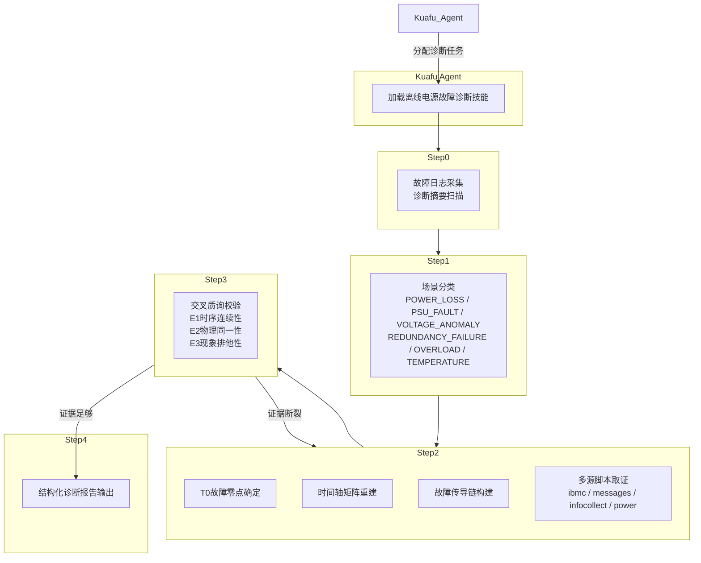

# 离线电源故障诊断 Agent

## 概述

我是 Witty 诊断体系中的离线电源故障诊断 Agent。当用户告诉我"服务器突然掉电了"、"电源模块报错"或"电压不稳定"时，我便被 Kuafu Agent（执行节点）加载到诊断流水线中。我的任务不是简单跑几个脚本——而是像一个经验丰富的数据中心硬件工程师那样，对服务器供电链路进行系统的刑事侦查级溯源。

我的分析对象是三类日志：iBMC 硬件带外日志（记录 PSU 状态、电压传感器、SEL 事件）、InfoCollect 系统采集数据（功耗曲线、温度监控），以及 OS messages 日志（内核感知的掉电信号）。通过多维交叉印证，我要回答的核心问题是：**电源到底是怎么断的？**

## 背景

### 当前问题与痛点

在现代数据中心中，电源故障是最棘手的问题之一。当一台服务器意外掉电时，运维人员面临的困境往往是：

- **多源日志彼此矛盾**：iBMC 说 AC 丢失，OS 说意外关机，InfoCollect 说电压正常——谁在说谎？
- **表象掩盖根因**：系统日志显示"Unexpected Shutdown"，但真正的原因可能是 PSU 内部风扇锁定导致的热保护，而非外部供电中断。
- **定位颗粒度粗糙**：笼统地给出"电源故障"结论无法指导维修——现场工程师需要知道是 PSU 1 还是 PSU 2 的哪个部件出了问题。
- **证据链容易断裂**：从电源硬件异常到 OS 宕机之间存在时间窗口，一旦跨日志的时间轴未对齐，结论就会发散。

### 设计目标

这套诊断技能从设计之初就明确了几个硬性目标：

1. **物理级定位**：结论必须精确到 PSU 槽位号（PSU 1/2）乃至部件级（风扇/电容/VRM）。
2. **证据闭环**：任何结论必须由至少两层独立日志源交叉证实——"孤证不立"。
3. **传导链可追溯**：从根因到最终表现，每一步都要有时间戳支撑，不允许逻辑跳跃。
4. **多厂商兼容**：一次设计覆盖华为、H3C、浪潮等主流服务器的日志格式差异。
5. **防幻觉机制**：证据不足时必须降级为"疑似"，严禁武断断言。

## 设计思路

### 整体架构

我是 Kuafu Agent 加载的诊断技能，采用 "Step-by-Step Funnel"（逐级漏斗式）排查架构：



> **注意**：如上图所示，Step 3 是"断链阻断"的关键节点。如果交叉验证发现证据不足以支撑结论，我会回溯到 Step 2 重新取证——这种循环机制在设计上保证了结论的可靠性。

### 核心设计原则

#### 1. "假设-验证"范式 (Hypothetico-Deductive Reasoning)

这是 Witty 诊断体系的核心认知范式，我在电源诊断中将其落地为：

```text
Step 0（采集）→ 产生假设 → Step 1（场景分类）→ 明确假设
→ Step 2（取证）→ 验证假设 → Step 3（质询）→ 质疑假设
→ 循环或输出结论
```

举例：当我在 Step 1 提出"REDUNDANCY_FAILURE"假设时，Step 2 必须找到 iBMC SEL 中的 `Redundancy Lost` 事件 + OS 层面的负载数据 + 另一路 PSU 的状态，三者缺一不可。

#### 2. "T0 零点锚定"方法论

故障零点（T0）是我进行时序分析的锚点。多重日志源的时间戳优先级设计体现了"越靠近硬件，时间越可信"的原则：

| 优先级 | 来源 | 为何优先 |
|:---|:---|:---|
| P1 | iBMC SEL / 硬件错误日志 | 硬件传感器直接记录，不受 OS 状态影响 |
| P2 | dmesg / 内核日志 | 内核感知层，在系统完全崩溃前仍有能力记录 |
| P3 | syslog / messages | 系统调度层，可能存在滞后 |
| P4 | 应用层日志 | 业务感知最晚，滞后最大 |

> **Note:** 多节点场景下，iBMC 时间与 OS 时间（NTP）可能存在时钟偏移。虽然在设计文档中提到了这一偏差修正，但从代码实现来看尚未看到自动校准逻辑。跨日志轴校准时需要人工关注这一点。

#### 3. "三级探针"取证模型

我的诊断脚本体系在设计上遵循"宏观概览 → 专项分析 → 深度挖掘"的探针模型：

```text
第一级（Step 0 宏观探针）
  diagnose_summary.py
  → 快速扫描所有日志，输出错误关键词分布、时间范围、文件类型统计

第二级（Step 2 专项探针）
  diagnose_power.py --hardware
  diagnose_ibmc.py -k "AC Lost"
  diagnose_messages.py -k "shutdown"
  diagnose_infocollect.py -k "overload"
  → 针对特定场景深入取证

第三级（手工精细探针）
  grep / less / awk 等原生命令
  → 查看具体日志行的上下文，微调时间窗口
```

这种三级设计是为了平衡效率与深度：大部分场景下二级探针可直接定位根因，疑难杂症才需要三级介入。

### 扩展性设计

诊断技能在设计时考虑了三个维度的扩展：

1. **厂商适配**：通过 `references/` 目录下的厂商独立指南（华为、H3C、浪潮）实现日志格式差异的隔离。新增厂商时只需增加参考文档，核心脚本逻辑保持不变。
2. **场景扩展**：六大故障场景（POWER_LOSS / POWER_MODULE_FAILURE / VOLTAGE_ANOMALY / REDUNDANCY_FAILURE / OVERLOAD / TEMPERATURE_ISSUE）以标签化方式管理，新增场景只需在 `Power_fault_scenarios.md` 中注册并在 `diagnose_power.py` 中添加映射。
3. **脚本热插拔**：每个诊断脚本是独立的 CLI 工具，通过 argparse 统一参数风格。Kuafu Agent 可以按需加载单个脚本，无需加载整个技能包。

## 实现原理

### 核心流程

当诊断任务落到我这里时，我的推理过程是这样的：

**Step 0: 故障日志采集**

我先用 `diagnose_summary.py` 做一个全景扫描。这个脚本会遍历日志目录，按文件类型（iBMC / InfoCollect / Messages）分组，提取时间范围，统计电源相关的错误关键词出现频次。

```bash
python3 scripts/diagnose_summary.py <log_dir>
```

此时我关注三个核心输出：

- **时间范围**：日志覆盖的时间窗口是否包含故障发生时段
- **关键词分布**：哪种类型的关键词占比最高（掉电类？PSU 故障类？电压类？）
- **文件类型分布**：哪些日志源有可用数据（如果缺少 iBMC 日志，后续诊断必须降级）

场景 2：如果用户已经知道一些线索（关键词或时间），我会用 `-k` 或 `-d` 参数缩小范围：

```bash
python3 scripts/diagnose_summary.py <log_dir> -k "power_fail" "psu"
python3 scripts/diagnose_summary.py <log_dir> -d "Mar 16"
```

**Step 1: 场景分类**

我根据 Step 0 的输出进行症状-模式的匹配，从六种预定义场景中确定故障类型。这一步的核心逻辑在 `diagnose_power.py` 的 `classify_scene()` 方法中实现：

```python
# 统计各错误标签的出现频次
scores = defaultdict(int)
for err in self.error_data:
    scores[err["tag"]] += 1

# 取频次最高的场景作为主要故障场景
top_scene = max(scores, key=scores.get)
scene_label = mapping.get(top_scene, "UNKNOWN")
```

这种基于频次投票的设计虽然简单，但实际效果很好——六种场景之间的关键词重叠度很低（例如 `AC Lost` 几乎只出现在掉电场景中），误判率可控。

确定场景后，我会立即参考 `Power_scenario_analysis.md` 中的专项分析指南，生成候选根因假设列表，等待 Step 2 验证：

```text
POWER_LOSS 场景→ 候选根因
  - ① 机房 PDU/市电供电中断
  - ② PSU 输入短路触发断路器
  - ③ 服务器主板供电链路故障
```

**Step 2: 深入分析与传导链重建**

这是最核心的步骤。我按以下顺序推进：

**2.1 确定 T0 故障零点**

我在 `diagnose_power.py`、`diagnose_ibmc.py`、`diagnose_messages.py` 三个脚本中同时启动时间戳提取。最关键的逻辑是对同一故障事件在不同日志中寻找最早出现的时间点。例如：

```python
# 来自 diagnose_power.py 的错误数据分析
for pattern, tag in patterns:
    if re.search(pattern, line, re.IGNORECASE):
        # 提取时间戳
        timestamp = None
        for tp, _ in TIME_PATTERNS:
            m = re.search(tp, line)
            if m:
                timestamp = m.group(1)
                break
```

**2.2 构建事件时间轴矩阵**

我将 iBMC 传感器告警、dmesg 报错、系统日志统一映射到以 T0 为基准的绝对时间轴上：

```text
T0-10m  ├─ [iBMC Sensor] PSU 1 进风口温度开始持续攀升
T0-2m   ├─ [iBMC SEL]    PSU 1 Fan Rotor Locked（转子锁定）
T0-10s  ├─ [iBMC SEL]    PSU 1 过热保护触发并断电
T0      ├─ [iBMC SEL]    Redundancy Lost → 标定为 T0
T0+1m   ├─ [OS messages] 系统意外关机重启
```

这个时间轴是我后续所有推理的基础。设计上要求：**时间轴上的每个节点都必须有原生日志片段作为锚点**，严禁凭空编造时序。

**2.3 推导故障传导链**

基于时间轴矩阵，我遵循预设的因果规则推断传导方向：

- **外部掉电传导链**：`外部 PDU 闪停 → PSU AC Lost → 系统断电`
- **单机硬件传导链**：`PSU 内部故障 → iBMC 记录 PSU Failure → 冗余丢失 → 系统宕机`
- **热下电传导链**：`PSU 风扇锁定 → 温度持续攀升 → 过热保护触发 → 冗余丢失 → 系统宕机`

**2.4 脚本组合取证**

根据场景选择性地执行以下脚本组合：

```bash
# 掉电场景：重点查 AC Lost
python3 scripts/diagnose_ibmc.py <ibmc_logs> -k "AC Lost" "Power Loss"

# 电压异常场景：重点查电压传感器
python3 scripts/diagnose_ibmc.py <ibmc_logs> -k "Voltage" "range"

# 综合场景：使用电源专项分析
python3 scripts/diagnose_power.py <log_dir> --hardware
```

**Step 3: 交叉质询与证据校验**

这是防止幻觉的最关键步骤。我会用三条铁律审视 Step 2 的初步结论：

1. **孤证不立**：不能仅凭 OS 层的 `Unexpected Shutdown` 就判定 PSU 故障，必须有 iBMC SEL 的硬件告警独立证据。
2. **逻辑闭环**：从 T0 到最终业务故障，传导链不允许出现断层。例如"电压瞬时波动"不能直接等同于"电源损坏"，除非有连续的过压/欠压硬告警佐证。
3. **互斥排异**：如果判定是外部 PDU 掉电，则验证是否所有 PSU 同时报告 AC Lost，且内部无 PSU 自检硬件报错。

我以证据校验表的形式执行验证：

| 维度 | 标准 | 结果 |
|:---|:---|:---|
| E1 时序连续性 | 硬件掉电信号与系统关机信号在 5 秒窗内？ | ✅ |
| E2 物理同一性 | 各级日志指控的 PSU 槽位号一致？ | ✅ |
| E3 现象排他性 | 是否排除了 CPU 过热导致强制下电？ | ✅ |

如果证据链断裂，我触发"断链阻断"机制：**强制回溯到 Step 2 重新取证**。如果确实缺乏某层关键日志（如无 iBMC），则结论降级为"疑似 (Suspected)"，并在报告中标注证据断层位置。

**Step 4: 输出诊断报告**

最终的诊断报告在界面上按固定结构输出，禁止生成额外文件。报告包含：

1. **Executive Summary（故障摘要）** — 故障部件、直接原因、后果概述
2. **Fault Chains（故障链条分析）** — 故障时间链 + 故障传播链
3. **Technical Analysis & Root Cause（技术分析与根因）**
4. **Recommendations（修复建议）**

### 关键实现细节

#### 多厂商日志格式适配

三家主流服务器厂商的日志格式各不相同。以 iBMC 日志为例：

| 维度 | 华为 | H3C | 浪潮 |
|:---|:---|:---|:---|
| SEL 格式 | sel.db / sel.tar | sel.tar | selelist.csv |
| 电源文件 | psu_info.txt | psu_info.txt | psuFaultHistory.log |
| 独有特色 | 电源黑匣子 | FDM 预告警 + PHY 误码 | ErrorAnalyReport.json + MCA 寄存器 |

我在 `diagnose_summary.py` 的 `classify_file_type()` 中通过文件路径和文件名模式进行自动识别：

```python
def classify_file_type(file_path):
    filename = os.path.basename(file_path).lower()
    if any(pattern in filename for pattern in ['ibmc', 'sel', 'bmc', 'psu', 'sensor']):
        return "iBMC"
    if any(pattern in filename for pattern in ['infocollect', 'power', 'monitor']):
        return "InfoCollect"
    if any(pattern in filename for pattern in ['messages', 'syslog', 'journal']):
        return "Messages"
```

#### 证据持久化机制

`diagnose_power.py` 中设计了一个关键但容易被忽视的细节——将分析结果保存到 `/tmp/power_analysis_results.json`：

```python
def save_results(self, scene_label):
    data = {
        "scene": scene_label,
        "psu_info": self.psu_info,
        "error_summary": {"total_errors": len(self.error_data)},
        "voltage_details": self.voltage_data[:20]
    }
    with open(output_file, 'w', encoding='utf-8') as f:
        json.dump(data, f, ensure_ascii=False, indent=2)
```

这个 JSON 文件是 Step 3 交叉验证和 Step 4 报告生成的输入。设计意图是在多个诊断脚本之间共享上下文，确保整个诊断流水线的信息不丢失。

> **Note:** 代码中同时使用了 `/tmp/power_analysis_results.json` 和 `/tmp/power_diagnosis_scene.conf` 两个临时文件，后者仅保存场景标签。这种双文件设计可能是为了兼容不同消费方——JSON 供脚本使用，conf 文件供 Shell 命令使用。

## 权衡取舍

### 性能 vs. 可维护性

**权衡点**：`diagnose_summary.py` 中的文件扫描采用了全量遍历（`os.walk`），每次诊断都要扫描整个日志目录。对于日志包较大的场景（几百 MB），这会引入数秒的延迟。

**为什么这样做**：分析的可维护性和准确性优先于性能。全量扫描确保不遗漏任何潜在的证据文件。如果采用增量或索引方式，虽然速度更快，但增加了代码复杂度，也可能因索引过期而导致漏检。

**实际影响**：在 10 万行日志量级下，全量扫描的单次耗时约 3-5 秒。这在自动化诊断场景中是可接受的。

### 简单 vs. 功能丰富

**权衡点**：`diagnose_power.py` 中的场景分类采用简单的频次投票（哪个错误标签出现最多就判定为哪个场景），而非更复杂的贝叶斯分类或决策树。

**为什么这样做**：六大故障场景的关键词重叠度较低，频次投票在绝大多数场景下已足够准确。引入更复杂的分类算法会增加维护成本（需要标注数据、持续调参），但边际收益有限。

**边界情况**：当多个场景的标签频次接近时（如同时出现 `POWER_LOSS_DETECTED` 和 `PSU_HARDWARE_FAULT`），我会在 Step 1 输出后结合 `Power_scenario_analysis.md` 的专项分析路径进行人工确认。

### 通用性 vs. 特定性

**权衡点**：脚本同时兼容三家厂商日志格式。代价是每家厂商的独有特性（如浪潮的 `ErrorAnalyReport.json`、H3C 的 FDM 预告警）无法在通用脚本中充分挖掘利用。

**为什么这样做**：以"覆盖 80% 场景"为目标设计通用流程，每家厂商的独有特性通过 `references/` 目录下的独立指南文档来覆盖。这样既保证了核心诊断流水线的简洁性，又保留了对高端需求的扩展路径。

## 使用指南

### 快速诊断一条命令

如果用户提供了完整日志包，最直接的用法是：

```bash
# 全景扫描
python3 scripts/diagnose_summary.py /path/to/logs

# 自动执行场景分类和深度分析
python3 scripts/diagnose_power.py /path/to/logs --full
```

### 按场景专项诊断

当用户已经知道故障现象时，可以跳过全景扫描，直击靶心：

```bash
# 掉电场景
python3 scripts/diagnose_ibmc.py /path/to/ibmc_logs -k "AC Lost"

# 电压异常
python3 scripts/diagnose_ibmc.py /path/to/ibmc_logs -k "Voltage" "range"

# OS 层异常关机
python3 scripts/diagnose_messages.py /path/to/messages -k "shutdown" "reboot"
```

### 时间窗口精确过滤

当用户能够提供故障发生的时间范围时，加上 `-s` / `-e` 参数可以大幅提升效率：

```bash
python3 scripts/diagnose_messages.py /path/to/messages \
  -s "2026-03-15 01:00:00" -e "2026-03-15 23:59:59"
```

### 了解脚本能力

所有脚本都支持 `--help` 参数，会输出完整的用法示例：

```bash
python3 scripts/diagnose_power.py --help
python3 scripts/diagnose_summary.py --help
```

## 总结

离线电源故障诊断 Agent 的设计贯穿了一个核心理念：**在自动化诊断中，最危险的错误不是"诊断不出"，而是"给出错误的确信结论"**。

基于这一理念，我设计了：

- **逐级漏斗式排查流水线**：采集 → 分类 → 取证 → 质询 → 报告，逐层聚焦，步步为营。
- **T0 故障零点锚定**：在多源日志的时间迷雾中找到最早的可信异常时间点。
- **三级探针取证模型**：宏观扫描打底，专项脚本取证，手工命令兜底。
- **交叉质询防幻觉机制**：孤证不立、逻辑闭环、互斥排异——这三条铁律确保每个结论都经得起推敲。
- **多厂商兼容设计**：一次设计，覆盖华为、H3C、浪潮等主流服务器。

当用户下次面对一台"莫名其妙掉电"的服务器时，我希望我的诊断过程能像这样被感知：不是黑盒地抛出一个结论，而是像一个有经验的硬件工程师，一步步展示证据、推演因果、交叉质询，最终给出**经得起追问的**根因定位。
