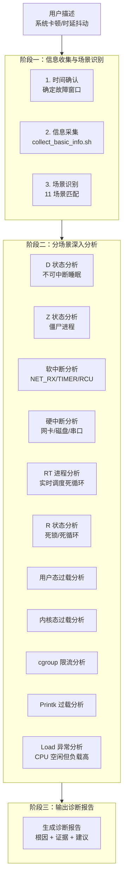

# 在线 CPU 调度诊断：当 AI Agent 学会"望闻问切"

## 概述

CPU 是服务器的大脑，而 CPU 调度器（Scheduler）是这颗大脑的"操作系统"。它负责决定哪个进程在哪个时刻运行在哪个 CPU 核上，是系统响应速度和吞吐量的最终仲裁者。当调度出现问题时——进程卡在 D 状态无法唤醒、软中断风暴吞噬所有 CPU 时间片、RT 进程死循环导致普通进程饿死、cgroup 限流引发业务时延抖动——整个系统会陷入一种"看起来还活着，但实际上已经无法正常服务"的亚健康状态。

**在线 CPU 调度诊断**（Online CPU Scheduling Diagnosis）是 Witty 诊断 Agent 体系中的另一项核心技能。它在"离线 CPU 硬件故障诊断"（分析日志找根因）的基础上，补全了"在线实时诊断"的能力拼图：Agent 直接接入目标系统，通过非侵入式的信息采集和结构化推理，在几分钟内完成从"用户说系统卡"到"定位到具体进程和内核瓶颈"的完整诊断闭环。

本文将深度解析这一技能的设计思想——**Agent 如何像一位精通内核调度原理的资深运维专家，通过"望闻问切"的方式诊断 CPU 调度问题**。

## 背景：调度诊断为什么比硬件诊断更"烧脑"？

### 当前挑战与痛点

**CPU 调度问题是"活的"。** 与硬件故障不同，调度问题往往是动态的、瞬态的、与环境耦合的。一个进程刚还在 R 状态占用 99% CPU，下一刻可能就进入 D 状态等待 I/O。这种动态性意味着：

**现象与根因之间存在巨大的"认知鸿沟"。** 用户会说"系统好卡"，但这可能指向 11 种完全不同的根因：可能是 I/O 阻塞导致 D 状态进程堆积（Load 高但 CPU 空闲），可能是软中断过载（si% 高但 us% 低），可能是 cgroup 限流（throttled_time > 0），甚至可能是内核日志洪泛（printk 风暴拖慢系统）。用户描述的"卡"只是最终症状，根因隐藏在多层抽象之下。

**诊断工具碎片化。** 要完整诊断一个调度问题，运维专家需要交叉使用 `top`、`vmstat`、`mpstat`、`ps`、`iostat`、`pidstat`、`perf`、`strace`、`journalctl`、`dmesg`、`atop`、`sar` 等十余种工具，并理解每个工具输出中哪些指标是关键的。例如，`/proc/loadavg` 的输出需要结合 CPU 核数计算 `Load/Cores` 比值，`/proc/softirqs` 的 NET_RX 和 TIMER 行需要跨 CPU 核求和才能判断是否存在中断不均衡。这对普通运维人员来说是一个极高的学习门槛。

**问题具有"时间窗口敏感性"。** 调度问题往往是间歇性的——RT 进程可能每 30 秒触发一次死循环，cgroup 限流可能在高峰期才显现。没有精确的时间窗口，Agent 就像在黑暗中追一个时而出现、时而消失的幽灵。

### 设计目标

基于上述挑战，在线 CPU 调度诊断技能确立了以下核心目标：

| 目标 | 说明 |
|:---|:---|
| **非侵入式诊断** | 所有信息采集必须是只读的，不执行任何修复命令 |
| **多线索关联推理** | 从 Load、CPU 使用率、进程状态、中断分布等多维度综合判断 |
| **时间窗口驱动** | 以精确时间窗口为约束，避免被无关历史数据干扰 |
| **场景化举证** | 将现象映射到 11 个标准场景，每个场景有明确的证据清单 |
| **可操作的修复建议** | 只给出建议，不自动执行，用户确认后方可操作 |

## 设计思想：Agent 如何像内核专家一样"望闻问切"？

### 总体架构：三阶段诊断流水线

在线 CPU 调度诊断技能的设计哲学可以用一个比喻来概括：**它不是一个"自动化的 top 命令"，而是一套完整的"中医四诊"系统**。



这一设计的核心哲学是：**先用全量信息采集建立"全景图"，再用场景分类缩小"可疑范围"，最后用专项分析确定"精确根因"**。这与医生诊断的逻辑完全一致——先做全身检查，再根据结果锁定专科，最后进行精确诊断。

### "望闻问切"：Agent 的信息采集方法论

在线诊断不像离线分析那样有"现成的日志包"可以读。Agent 面对的是一个正在运行的、动态变化的系统。为此，技能设计了一套与中医"四诊"高度对应的信息采集策略：

**"望"——观测系统状态（`collect_basic_info.sh`）。** 这是 Agent 的"眼睛"。脚本以全量采集的方式，从 `/proc` 文件系统、`sysctl`、`journalctl`、`dmesg`、`mpstat`、`vmstat`、`atop`、`sar` 等 10+ 个信息源获取系统快照。这些信息不是简单的数据转储，而是经过了**结构化处理**——进程状态有统计（D/Z/R 状态计数）、中断有排序（Top 10 中断源）、负载有自动诊断（Load/Cores 比值 + 异常标记）。

```mermaid
flowchart LR
    subgraph Agent[Agent 诊断引擎]
        AgentBrain[推理决策]
    end

    subgraph Script[收集脚本]
        SH[collect_basic_info.sh\n658行 Bash]
    end

    subgraph Sources[信息源]
        ProcFS[/proc 文件系统\nloadavg/stat/softirqs]
        Sysctl[内核参数\nsched/printk/rt]
        Journal[systemd journal\n内核日志]
        Dmesg[内核环形缓冲区\ndmesg]
        Sysstat[系统统计\nmpstat/vmstat]
        History[历史监控\natop/sar]
    end

    subgraph Outputs[脚本输出]
        Terminal[终端输出\n摘要信息 + 诊断标记]
        Files[文件输出\n完整日志/中断/cgroup 详情]
    end

    AgentBrain -->|调度执行| SH
    SH -->|采集| ProcFS
    SH -->|读取| Sysctl
    SH -->|提取| Journal
    SH -->|读取| Dmesg
    SH -->|调用| Sysstat
    SH -->|回放| History
    SH -->|产出| Terminal
    SH -->|保存| Files
    Terminal -->|传回| AgentBrain
```

**"闻"——倾听用户描述（时间确认）。** 这是 Agent 的"耳朵"。Agent 通过交互式对话确定故障时间窗口，并根据用户描述的精确度动态调整采样范围。这个看似简单的步骤实际上极为关键——**没有时间窗口的信息采集就像没有靶子的射击**。

**"问"——场景分类推理。** 这是 Agent 的"思考"。采集到的原始数据经过组合推理，映射到预定义的 11 个标准场景。推理逻辑被设计为"**由粗到细的多层筛选**"：

1. **第一层：看 Load 与 CPU 的关系。** Load 高 + CPU 空闲 → 关注 D/Z 状态（I/O 阻塞）；Load 高 + CPU 忙 → 关注 us/sy/irq 分布。
2. **第二层：看 CPU 使用率细分。** wa% 高 → D 状态分析；si% 高 → 软中断分析；irq% 高 → 硬中断分析；us% 高 → 用户态分析；sy% 高 → 内核态分析。
3. **第三层：检查特殊进程。** D 状态看堆栈、Z 状态看父进程、RT 进程看 CPU 占用率、R 状态看自愿切换。
4. **第四层：检查 cgroup 限流。** throttled_time > 0 → 容器被限流。

**"切"——专项深入分析。** 这是 Agent 的"确诊"。针对每个场景，SKILL.md 中定义了详细的诊断指标表和深入取证命令。例如对于"软中断过载"场景，Agent 会先确认 NET_RX/TIMER/RCU 的计数，再通过 `watch -n 1 "cat /proc/softirqs"` 观察变化趋势，最后给出启用 RPS/RFS、优化网络参数等具体建议。

### 核心设计：为什么是"只读不修"？

在线 CPU 调度诊断技能有一个明确的安全边界：**仅进行信息收集和分析诊断，不执行任何修复命令**。这是一个经过深思熟虑的设计决策。

在离线硬件故障诊断中，Agent 面对的是"已发生"的事实——日志不会因为操作而变化。但在线诊断面对的是"正在运行"的系统——执行一个 `pkill -9` 或 `systemctl restart` 可能会直接导致业务中断。

因此，技能的设计原则是：**Agent 做诊断，用户做决策**。所有修复建议都以"可操作"的格式呈现（如"运行 `chrt -p <PID>` 检查 RT 进程调度策略"），但决不自动执行。这种安全边界确保了 Agent 在诊断阶段可以大胆探索，而不会带来意外风险。

### 11 场景分类：为什么设计这么多场景？

可能有读者会问：为什么不直接用"Load 高"或"CPU 高"作为唯一分类标准？答案是：**调度问题的多样性远超想象**。

11 个场景的划分遵循 MECE（相互独立、完全穷尽）原则：

| 场景编号 | 场景名称 | 核心判据 | 对应维度 |
|:---:|:---|:---|:---:|
| 1 | D 状态阻塞 | Load 高 + CPU 空闲 + D 状态多 | 进程状态 |
| 2 | Z 状态堆积 | 父进程未回收 | 进程状态 |
| 3 | 软中断过载 | si% > 10% | CPU 使用率 |
| 4 | 硬中断过载 | irq% > 5% | CPU 使用率 |
| 5 | RT 进程死循环 | RT 进程 100% CPU + sched_rt_runtime_us = -1 | 调度策略 |
| 6 | R 状态死锁 | CPU 高 + 自愿切换低 | 进程状态 |
| 7 | 用户态过载 | us% 高 + 单进程 CPU 高 | CPU 使用率 |
| 8 | 内核态过载 | sy% 高 + 无明显进程 | CPU 使用率 |
| 9 | cgroup 限流 | throttled_time > 0 | 容器 |
| 10 | Printk 过载 | printk: messages suppressed | 内核日志 |
| 11 | Load 异常 | Load 高 + CPU 空闲 + 无 D/Z | 复合 |

注意**场景 3 和 4 的细微差别**：si% 高指向软中断（通常与网络收包/定时器相关），irq% 高指向硬中断（通常与网卡/磁盘硬件相关）。虽然都表现为"CPU 被中断吃掉"，但根因和修复方案完全不同。这种精细度正是人类专家经验的体现。

## 实现原理：Agent 的三阶段诊断引擎

### 阶段一：信息收集与场景识别

#### 第一步：时间确认——诊断的"锚点"

当用户说"系统刚才卡了一下"时，Agent 需要把这个模糊描述精确化为时间窗口。SKILL.md 中设计了一套实用的换算规则：

| 用户描述 | 时间窗口设定 |
|---------|-------------|
| "下午 2 点 10 分开始" | `[故障时间 - 5分钟, 故障时间 + 持续时间 + 5分钟]` |
| "刚才/刚刚" | `[当前时间 - 30分钟, 当前时间]` |
| "间歇性/偶尔" | `[当前时间 - 2小时, 当前时间]` |
| "不知道什么时候" | `[当前时间 - 1小时, 当前时间]` |

这套规则的巧妙之处在于**自适应性**——用户描述越模糊，Agent 自动扩大搜索范围以覆盖可能的故障窗口。同时，输出的时间格式统一为 `YYYY-MM-DD HH:MM:SS`，确保后续与日志时间戳的精确对齐。

#### 第二步：collect_basic_info.sh——Agent 的"多模态传感器"

这个 658 行的 Bash 脚本是整个诊断引擎的"硬件层"。它不是简单地把十几个命令的输出拼在一起，而是经过精心设计的结构化采集系统。

**脚本的 11 个信息采集模块**：

```text
Part 1  - 系统基础信息      (uname/uptime/os-release)
Part 2  - 负载与 CPU 使用率  (loadavg/mpstat/vmstat + 自动负载诊断)
Part 3  - 进程状态统计       (D/Z/R 状态计数 + 过阈值检测)
Part 4  - 关键配置参数       (sched/printk/rt 内核参数)
Part 5  - 中断统计           (/proc/interrupts + /proc/softirqs)
Part 6  - 进程详情           (D/Z/R 状态进程 + 高 CPU 进程)
Part 7  - RT 进程            (实时调度进程检测 + 高 CPU 告警)
Part 8  - cgroup CPU 统计    (v1 + v2 双版本兼容)
Part 9  - 内核日志分析       (journalctl + dmesg + 时间段过滤)
Part 10 - 目标进程详细信息   (status/sched/stack/fd/chrt)
Part 11 - 历史监控数据       (atop + sar 回放)
```

几个特别值得关注的设计细节：

**智能的负载诊断**（Part 2）。脚本不仅仅是输出 `/proc/loadavg` 的值，而是自动计算 `Load/Cores` 比值，并进行分级预警（>2 黄色预警，>4 红色预警）。这意味着 Agent 拿到输出后不需要自己算一遍——**诊断信息已经被"预加工"了**。

```bash
# 脚本中的自动诊断逻辑
printf "%-25s %6.2f  %s\n", "Load/Cores (1min):", ratio1, \
    (ratio1>4)?"严重过载":(ratio1>2)?"存在压力":"正常"
```

**进程堆栈的逐 PID 追踪**（Part 6.1）。对于 D 状态进程，脚本不是只列个 PID 列表，而是逐个读取 `/proc/$pid/stack`——这是 Agent 判断"进程在等什么"的关键证据。堆栈中的 `io_schedule + submit_bio` 提示等待磁盘 I/O，`nfs_` 提示 NFS 服务器超时，`mutex_lock` 提示内核锁竞争。

**RT 进程的高 CPU 检测**（Part 7）。脚本会遍历所有 RT 进程，对 CPU 使用率 > 80% 的进程单独标记告警。这一检测的工程意义在于：一个 RT 进程如果长期占用 100% CPU，会直接导致普通 SCHED_OTHER 进程无法获得任何时间片——这也是"系统卡"的隐蔽原因之一。

**cgroup v1/v2 双版本兼容**（Part 8）。Linux cgroup 接口从 v1 到 v2 有较大变化（`cpu.stat` vs `cpu,cpuacct`，`throttled_usec` vs `throttled_time`）。脚本同时检查两个版本的路径和字段名，确保在 openEuler、Ubuntu、CentOS 等不同发行版上都能正确采集。这一设计体现了对生产环境多样性的深刻理解。

**历史监控数据回放**（Part 11）。脚本会尝试从 `/var/log/atop/` 和 `/var/log/sa/` 读取故障时间段的历史监控数据。这个设计的关键洞察是：**当前快照只能反映"这一刻"的状态，而调度问题是动态的**。通过 atop/sar 的历史记录，Agent 可以看到 CPU 使用率的趋势变化，而不仅仅是一个截片（Snapshot）。

#### 第三步：场景识别——多线索推理引擎

信息采集完成后，Agent 进入推理阶段。这一步不是简单的阈值匹配，而是**多线索交叉验证**。

以"Load 高但 CPU 空闲"这个常见的矛盾现象为例：

```text
Agent 的推理过程：
1. 观察：Load/Cores = 5.2（严重过载），但 %idle = 85%（CPU 很闲）
2. 第一层推断：Load 高 + CPU 空闲 → 大概率是 D 状态或 Z 状态进程导致
3. 检查 D 状态：ps 统计显示 D 状态 15 个 → 确认 I/O 阻塞方向
4. 检查 D 状态堆栈：发现 cluster/raid5 等磁盘 I/O 相关函数
5. 最终判断：场景 11（Load 异常，CPU 空闲）+ 场景 1（D 状态阻塞）
```

这种"逐步收窄"的推理链在 SKILL.md 中被编码为明确的决策树：

```text
1. 先看负载与 CPU 的关系
   - Load 高 + CPU 空闲 → 关注 D 状态、Z 状态
   - Load 高 + CPU 忙 → 关注 us/sy/irq 分布

2. 再看 CPU 使用率分布
   - wa% 高 → D 状态进程堆栈 + 磁盘 I/O 确认
   - si% 高 → 软中断类型分析（NET_RX/TIMER/RCU）
   - irq% 高 → 硬中断来源确认（网卡/磁盘/串口）
   - us% 高 → perf top 热点函数分析
   - sy% 高 → 系统调用分布分析

3. 检查特殊进程状态
   - D 状态 → 查看堆栈确认阻塞原因
   - Z 状态 → 查看父进程状态
   - RT 进程 → 检查是否独占 CPU
   - R 状态长期存在 → 检查是否死循环

4. 检查 cgroup 限流
   - throttled_time > 0 → 容器被限流
```

### 阶段二：每个场景的"精准活检"

场景识别完成后，Agent 进入"专科医生"模式——根据场景标签执行对应的深入分析。每个场景的诊断逻辑都包含两个层面：

**终端输出诊断**——直接解读 `collect_basic_info.sh` 已收集的数据。例如场景 3（软中断过载）：

| 线索来源 | 诊断结论 |
|:---|:---|
| Section 3 - si% > 10% | 软中断消耗过多 CPU |
| Section 5 - NET_RX 计数最高 | 网络收包过载为根因 |
| Section 5 - 中断集中在 CPU 0 | 单核软中断不均衡加剧问题 |

**深入取证命令**——Agent 建议用户执行的操作（仍在只读范围内）。继续上面的软中断场景：

```bash
# Agent 建议用户执行（注意：只是建议，不自动执行）
watch -n 1 "cat /proc/softirqs"       # 实时观察软中断变化
ethtool -l eth0                        # 检查网卡队列数
```

这种"先读已采集数据 → 再建议深入取证"的设计确保了两点：① 大多数常见场景仅通过 `collect_basic_info.sh` 的输出即可诊断（高效）；② 复杂场景有"后手"可以继续深挖（完备）。

#### 场景 1 深入分析示例：D 状态进程诊断

D 状态（不可中断睡眠）是调度诊断中最常见也最容易被误解的场景。一个进程进入 D 状态意味着它在等待某个内核操作完成——通常是磁盘 I/O 或 NFS 网络 I/O。

Agent 的诊断逻辑：

```text
观察现象：
  - Section 2: Load/Cores = 8.5（严重过载）
  - Section 3: wa% = 35%（I/O 等待极高）
  - Section 6.1: D 状态 22 个进程

深入分析：
  - 读取 D 状态进程堆栈（Section 6.1 已采集）
    → io_schedule + submit_bio → 确认是磁盘 I/O 阻塞
  - 读取内核日志（Section 9.1 已采集）
    → "blocked for more than 120 seconds" → 确认超时
  - 建议 iostat -x 1 5 → 确认是哪个磁盘设备的问题

诊断结论：
  - 根因：/dev/sda I/O 队列深度过大，导致进程大量阻塞
  - 置信度：高（已有堆栈证据 + 内核日志 + wa% 指标三重确认）
  - 建议：
    1. 临时：iotop 定位 I/O 源头进程
    2. 根治：优化应用 I/O 模式（异步化/限流），或升级存储硬件
```

#### 场景 5 深入分析示例：RT 进程死循环

RT（实时调度）进程是调度诊断中的"暗流"——它们通常在后台静默运行，当它们出问题时，其他进程可能突然"卡死"。

```text
观察现象：
  - 用户说：系统偶尔卡顿，但看不出来是谁占 CPU
  - Section 2: Load 正常，CPU 空闲
  - Section 7: 发现 PID 12345 为 SCHED_FIFO 策略，CPU 100%
  - Section 4: sched_rt_runtime_us = -1（RT 无限制！）

深入分析：
  - chrt -p 12345 → 确认策略为 SCHED_FIFO，优先级 99
  - 查看进程命令行 → /usr/bin/realtime_worker
  - 查看进程堆栈 → 卡在 while(1) 循环，没有 sched_yield

诊断结论：
  - 根因：RT 进程死循环 + RT 无时间限制 → 饿死所有普通进程
  - 置信度：高（完全符合 RT 死循环特征）
  - 建议：
    1. 立即：设置 sched_rt_runtime_us = 950000（限制 RT 为 95%）
    2. 根治：排查 RT 进程的业务逻辑（为什么会死循环）
```

### 输出设计：如何让诊断结论"可操作"？

阶段三的输出采用标准化 Markdown 报告格式，包含五个核心部分：

1. **基本信息**：诊断时间、故障窗口、严重级别
2. **问题确认**：报错信息、影响范围
3. **场景识别结果**：识别的场景 + 判断依据（含具体指标值）
4. **深入分析**：分析过程 + 关键证据（含原始日志片段）
5. **故障结论**：根因描述 + 置信度 + 修复建议

这种"结构化报告 + 证据引用 + 可操作建议"的设计，确保了诊断结论不仅告诉用户"出了什么问题"，更告诉用户"为什么得出这个结论"和"接下来该怎么做"。

## 设计权衡

### 采集完整性 vs. 系统负载

`collect_basic_info.sh` 被设计为"尽全力采集"，但没有任何一个采集动作是"非做不可"的。脚本中大量使用了 `2>/dev/null` 和 fallback 逻辑：

- `mpstat -P ALL 1 1 2>/dev/null || echo "mpstat 不可用，跳过"`
- `atop` / `sar` 历史文件不存在时直接跳过
- `/proc/$PID/stack` 无法读取时跳过（进程可能已退出）

这种"尽力而为"（Best-effort）的设计防止了因某个工具未安装或某个文件不可读而导致的整条诊断链路断裂。**Agent 诊断的基本原则是：永远不要让"信息缺失"变成"诊断失败"**。

### 终端输出 vs. 文件输出

脚本将信息分为两类：

- **终端直接输出**：摘要性的、可直接用于判断的信息（系统基础信息、负载、进程状态、关键配置），附带自动诊断标注
- **文件输出至 `/tmp/cpu_diag_*/`**：大块原始数据（完整内核日志、完整中断统计、cgroup 详情）

这种分层设计的意图是：Agent 的注意力是有限的，不应该被数万行的原始日志淹没。终端输出的"摘要 + 诊断标注"设计，让 Agent 能在 100-200 行输出内完成场景识别。只有在需要精确证据时，才去读文件中的原始数据。

### 通用诊断 vs. 专病专治

11 个场景的划分在"覆盖广度"和"诊断精度"之间取得了平衡。这个设计的明智之处在于：

- **常见场景（D 状态、软中断、cgroup 限流）**有详细的诊断指引，确保 Agent 能快速给出精确结论
- **罕见或复合场景**通过"场景组合"来覆盖。例如"D 状态 + cgroup 限流"同时出现时，Agent 可以分别查找两个场景的证据，再综合判断

### 确定性推理 vs. 概率推测

与离线 CPU 硬件诊断不同，在线调度诊断不强制要求"三层证据交叉验证"。这是因为在线诊断面对的数据源本身就有限——没有 iBMC 日志、没有 InfoCollect 归档。Agent 必须在信息不完整的情况下快速给出结论。

设计上的权衡是：**每个场景的结论都附带置信度标注**（高/中/低）+ **可验证的执行建议**。即使是"高置信度"的结论（如 RT 进程 100% CPU 占用），Agent 也不自动修复，而是建议用户执行检查命令确认后手动操作。这种"建议但不执行"的模式，是**在"快速给出结论"和"确保操作安全"之间的最佳平衡点**。

## 使用示例：Agent 如何诊断一次"系统卡顿"

### 场景：用户报告"系统响应非常慢，SSH 都卡"

**阶段一：信息收集与场景识别**

```text
用户：系统从上午 10 点左右开始变得很卡，SSH 敲命令都要等好几秒。

Agent 推理：
  1. 时间确认 → 10:00 ~ 当前时间
  2. 执行收集脚本 → bash collect_basic_info.sh -S "2026-03-15 10:00:00"
  3. 分析输出 →

  --- 场景推理过程 ---
  观察 1: Load/Cores (1min) = 12.5 → 严重过载
  观察 2: CPU %idle = 92% → CPU 很空闲！
  观察 3: D 状态进程 = 28 个 → 数量异常
  观察 4: D 状态堆栈 → 大量进程堆栈显示 submit_bio + io_schedule
  观察 5: wa% = 38% → I/O 等待极高
  → 场景判定：场景 11（Load 异常）+ 场景 1（D 状态 I/O 阻塞）
```

**阶段二：深入分析**

```text
Agent 深入分析：
  - wa% 高 + D 状态 28 个 + 堆栈 submit_bio → 明确指向磁盘 I/O 瓶颈
  - 内核日志搜索 "blocked for more than" → 发现 /dev/sdb 的超时事件
  - 建议用户执行：iostat -x 1 5 → 确认 sdb 的 avgqu-sz 达到 1.2K（远高于正常值 10）

诊断结论：
  - 根因：/dev/sdb 磁盘 I/O 性能瓶颈，I/O 请求排队深度过大
  - 影响范围：所有需要读写 sdb 的服务（包括 SSH 的日志写入）
  - 置信度：高
  - 修复建议：
    1. 临时措施：排查 I/O 源头进程（iotop），对非关键 I/O 进行限速
    2. 永久措施：评估存储性能需求，考虑升级磁盘或优化 I/O 路径
```

**阶段三：输出报告**

Agent 输出结构化诊断报告，包含精确的指标值和证据引用，确保用户不仅能"修好"，还能"理解为什么出问题"。

## 总结

在线 CPU 调度诊断技能的设计体现了几个核心原则：

**安全第一**。"只读诊断，建议不执行"的设计原则是贯穿整个技能的"红线"。Agent 可以大胆地采集、分析、推理，但所有修复操作的决定权都在用户手中。这种安全边界让 Agent 在诊断阶段拥有充分的探索自由，同时将操作风险控制在零。

**结构化推理**。采集脚本输出的信息不是原始数据的堆砌，而是经过"预诊断"的结构化信息（Load/Cores 自动计算、进程状态自动告警、RT 进程高 CPU 标记）。这种"智能传感器"的设计让 Agent 可以直接进行高级推理，而不必纠缠于原始数据解析。

**场景化举证**。11 个标准场景覆盖了 90% 以上的 CPU 调度故障模式。每个场景都有明确的证据指纹（特征指标组合）、诊断表格（阈值的工程意义）和深入取证命令（进一步验证的手段）。这种"模板化"诊断思路确保了诊断的一致性和可重复性。

**用户视角的输出**。诊断报告不是技术堆砌，而是"根因描述 + 证据链 + 可操作建议"。Agent 不仅要告诉用户"发生了什么"，更要告诉用户"为什么发生"和"怎么办"。这是 Agent 作为"智能诊断助手"而非"技术工具"的核心价值。

**与离线 CPU 硬件诊断的互补**。离线 CPU 硬件故障诊断（offline-CPU-fault-diagnosis）分析的是"过去的故事"——从日志中重构硬件故障的时间链。而在线 CPU 调度诊断分析的是"正在发生的故事"——通过实时采集和结构化推理定位动态调度问题。两者构成了 Witty 诊断 Agent 的 CPU 领域完整能力矩阵：**离线看"损"，在线看"乱"**，一静一动，互为补充。

在线 CPU 调度诊断技能展示的，正是一种"**让 Agent 像资深运维专家一样精准诊断**"的设计哲学：不是用 AI 取代运维人员，而是将运维专家的系统思维和排查方法论编码为可执行的诊断流水线，让每一个系统都能拥有一个"7×24 小时在线的内核调度专家"。
