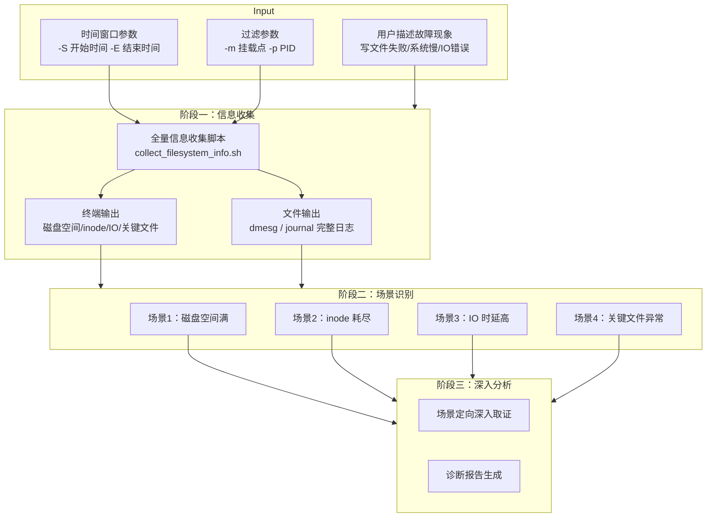
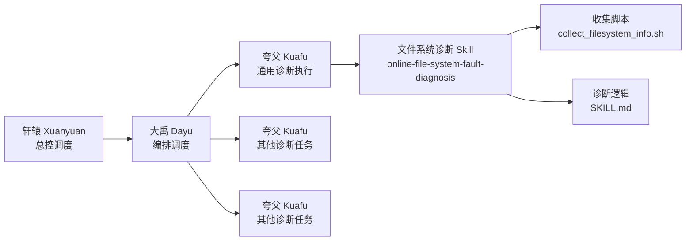
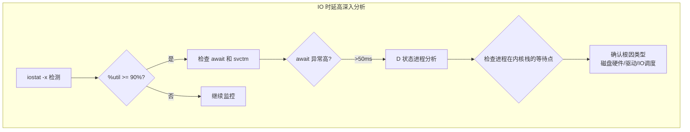
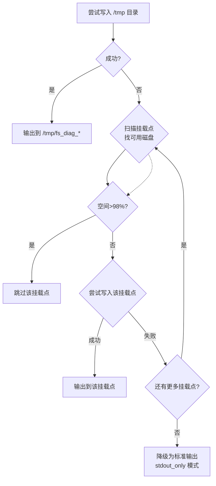

# 文件系统故障在线诊断 Agent：当 AI 学会"四维探诊"

## 概述

想象一个场景：某天深夜，你的手机突然被告警轰炸——核心业务的日志写入全部失败，API 响应超时，数据库连接池被耗尽，一连串的"滚雪球效应"正在把整个系统推向不可用。你 SSH 登录服务器，`df -h` 一看，发现 `/data` 分区使用率 98%。你正准备清理日志，却收到新的告警：文件删除失败，`rm` 命令返回"设备空间不足"——等一下，明明删了文件为什么空间没释放？

这是文件系统故障中最经典也最令人困惑的场景之一：**"空间已满，但找不到大文件"**。根因往往深藏不露——可能是一个已删除但仍被进程持有的日志文件，可能是 inode 耗尽而非 block 耗尽，也可能文件系统已被内核自动 remount 为只读。

**Online File System Fault Diagnosis** 正是 Witty 智能诊断 Agent 用来应对这类场景的核心技能。它封装了一套"四维分类 x 三阶段流水线"的排查方法论——将庞杂的文件系统诊断空间拆解为四个正交场景，通过一个全量信息收集脚本获取系统快照，再按场景逐步推进深入分析。Agent 加载这个 Skill 后，面对一个"写不了文件"的模糊现象，能够在分钟级完成"现象确认 → 场景识别 → 根因定位"的完整链路。

本文将从 Agent 的视角出发，拆解这套技能的设计思想、实现原理和工程权衡——它不是一个简单的脚本集合，而是一套**专家级排查框架的程序化表达**。

## 背景

### 问题和痛点

在 Agent 的实际诊断工作中，文件系统故障是出现频率最高、但也是最容易被误判的故障类型之一。原因在于：

**痛点一：表象与根因之间隔着多层抽象。** 用户描述"写文件失败"时，可能的根因可能来自四个完全不同的层面：磁盘 block 耗尽、inode 耗尽、文件系统被 remount 为只读、或者仅仅是权限错误。每一种的修复方案截然不同——选错方向不仅浪费时间，还可能造成二次破坏。

**痛点二：系统已经故障时，信息收集本身就是一个难题。** 当磁盘空间已满或文件系统只读时，常规的日志写入机制会失效。Agent 执行诊断脚本时，脚本的输出日志可能根本写不进去——这时候需要一种"自感知的"输出回退机制。

**痛点三：IO 故障的间歇性导致"证据灭失"。** IO 时延高往往是间歇性的。当 Agent 开始诊断时，故障可能已经过去，现场已经丢失。需要一种"时间窗口感知"的诊断方式——在指定的时间段内去搜索日志线索，而不是只看当前状态。

**痛点四：多维度指标的关联分析门槛高。** 单看 `df -h` 不够，需要同时看 `df -i`（inode）、`iostat -x`（IO 性能）、`dmesg`（内核日志）、`lsof`（文件句柄）等多个维度的数据，并且要能交叉验证。

### 设计目标

基于上述痛点，这套技能的设计目标可以概括为：

- **只读安全**：严格遵守"诊断不修复"原则，所有操作均为信息收集，不出执行修复命令
- **全量快照**：一次执行收集所有维度的文件系统状态，不分两次
- **场景覆盖**：通过四类正交场景穷举文件系统常见故障模式
- **自适应输出**：当系统已经不可写时，自动降级到标准输出模式，不丢失诊断信息
- **时间窗口**：支持指定故障时间段，在特定时间窗口内搜索日志

## 设计解决方案

### 整体架构

整套诊断技能以 **"四维场景分类"** 为骨架，以 **三阶段诊断流水线** 为流程引擎，以 **全量信息收集脚本** 为执行层：



### 在 Multi-Agent 体系中的位置

在 Witty 诊断 Agent 的六 Agent 协作体系中，这套 Skill 被 Kuafu Agent（夸父——通用诊断执行者）加载调用：



当用户描述文件系统相关故障时，大禹（Dayu）将排查计划拆解为多个子任务，其中一个子任务分配给一个夸父（Kuafu）实例。该夸父加载本 Skill，先执行信息收集脚本，再根据 SKILL.md 中定义的诊断逻辑进行场景识别和深入分析。

**核心设计原则：假设驱动 vs 数据驱动。** 与传统"先猜测再验证"的排查思路不同，本 Skill 选择了一个关键的折中设计：**先用数据收集脚本全面打底，再用规则引擎做场景匹配。** 这意味着无论用户描述多么模糊，Agent 都能先拿到一份全量的系统状态，避免了"猜错方向就白跑一趟"的问题。

### 四维场景分类的设计逻辑

这是整套技能最核心的设计决策。文件系统故障千变万化，但设计者将其归纳为四个正交场景：

| 场景编号 | 故障模式 | 核心指标 | 排查入口 |
|:---:|:---|:---|:---|
| 场景 1 | 磁盘分区空间满 | `df -h` 使用率 >= 95% | Section 1 磁盘空间使用 |
| 场景 2 | inode 耗尽 | `df -i` 使用率 >= 95% | Section 2 inode 使用 |
| 场景 3 | 系统 IO 时延高 | `iostat -x` %util >= 90% | Section 3 IO 性能 |
| 场景 4 | 关键文件异常 | 文件不存在/权限错误 | Section 4 文件完整性 |

这四种场景的设计遵循了 **MECE 原则（Mutually Exclusive, Collectively Exhaustive）**：

- **相互独立**：空间满、inode 耗尽、IO 时延、文件异常是四个不同的故障域，各自有独立的检测指标和修复手段
- **整体穷尽**：涵盖了文件系统从"容量"（场景 1/2）到"性能"（场景 3）到"完整性"（场景 4）的所有可能异常维度

> **Note:** MECE 原则的命名参考了 SKILL.md 中四场景互斥的设计，以及架构文档中提及的诊断模型构建原则。该分类方式的"穷尽性"推断自覆盖范围的完整性——同时覆盖了容量、性能、完整性三个维度，在实践中可以覆盖绝大多数文件系统故障场景。

### 信息收集脚本的设计哲学

`collect_filesystem_info.sh` 是整个 Skill 的执行核心。它的设计体现了几个重要的工程决策：

**为什么是 Bash 脚本？** 这是一个重要的设计权衡。在 Python/Go 等更现代的语言也能完成同样功能的情况下，设计者选择了 Bash，原因至少包括：

- **零依赖**：Bash 在任何 Linux 发行版中都预装，Agent 不需要先安装 Python 解释器或依赖包
- **原生系统集成**：文件系统诊断需要调用大量系统命令（`df`、`iostat`、`dmesg`、`ldconfig` 等），Bash 可以直接调用这些命令并捕获输出
- **与 Ansible 天然集成**：运维场景中 Ansible 是最主流的远程执行框架，Bash 脚本可以无缝嵌入 Ansible Playbook

**输出的双通道设计：**

- **终端输出**：核心诊断结果（空间/inode/IO 统计），附带阈值判断和诊断说明，供 Agent 直接读取
- **文件输出**：完整的内核日志（dmesg）和 systemd 日志（journalctl），这些数据量大但需要时才有用

**过滤参数的可组合性：**

```bash
bash collect_filesystem_info.sh -S "2024-01-15 14:00:00" -E "2024-01-15 15:00:00" -m /data -p 12345
```

-S（时间起点）、-E（时间终点）、-m（挂载点）、-p（PID）四个参数可以任意组合，使得 Agent 能灵活适配不同粒度的诊断需求。

## 实现原理

### 三阶段诊断流水线

Agent 执行一次文件系统诊断的完整流程分为三个阶段：

#### 阶段一：信息收集与场景识别

**步骤 1：时间确认**

Agent 首先与用户交互，确定故障时间窗口。时间窗口的精度直接影响后续日志搜索的效果——窗口太宽会引入噪声，太窄可能遗漏关键证据。

SKILL.md 定义了一套时间窗口映射规则：

| 用户描述 | 时间窗口 | 设计考量 |
|:---|:---|:---|
| "刚才/刚刚" | `[当前时间 - 30min, 当前时间]` | 在线故障，窗口窄，快速定位 |
| "间歇性发生" | `[当前时间 - 2h, 当前时间]` | 间歇性问题需要更长的观察窗口 |
| "具体时间点" | `[故障时间 - 5min, 故障时间 + 持续时间 + 5min]` | 精确时间点前后留缓冲，防止时钟偏差 |
| "不确定" | `[当前时间 - 1h, 当前时间]` | 保守默认值 |

**步骤 2：执行信息收集脚本**

Agent 构造命令行参数，在目标系统上执行 `collect_filesystem_info.sh`。脚本执行后产生两个信息源：

1. **终端直接输出**：包含 5 个 Section 的结构化诊断信息
2. **文件输出**：完整的内核日志和 journal 日志（写入自动检测的可写目录）

**步骤 3：模式匹配场景识别**

这是整个诊断流程中 Agent 的"智能"所在。Agent 不是机械地看单个指标，而是进行多维度线索的交叉匹配：

```text
先看错误日志 → 再看资源使用 → 最后检查关键文件状态
```

例如，Agent 识别"inode 耗尽"场景的判断链路：

```text
日志中出现 "No space left on device" ？
  ├─ 是 → 检查 df -h 空间使用率
  │     ├─ >= 95% → 场景 1（磁盘空间满）
  │     └─ < 95% → 继续检查 df -i inode 使用率
  │           ├─ >= 95% → 场景 2（inode 耗尽）
  │           └─ < 95% → 组合故障，继续分析
  └─ 否 → 继续检查其他日志模式
```

#### 阶段二：分场景深入分析

每个场景一旦被识别，Agent 进入该场景的深入取证流程。以场景 3（IO 时延高）为例：



这一阶段的深度取决于 Agent 收集到的数据粒度。如果 iostat 数据显示磁盘的 `svctm`（服务时间）也大幅上升，那么根因更可能是磁盘硬件本身的问题；如果只有 `await` 高而 `svctm` 正常，则更可能是 IO 调度或队列深度的问题。

#### 阶段三：输出诊断报告

Agent 汇总所有发现，输出结构化的诊断报告，包含：

- 诊断时间和故障窗口
- 场景识别结果及判断依据
- 深入分析过程和关键证据
- 故障结论和置信度
- 修复建议（仅建议，不执行）

### 日志输出自动回退机制

这是一个值得重点分析的工程亮点。当文件系统本身已经出问题时（空间满、只读等），脚本的输出文件可能无法写入。设计者设计了一个三级回退策略：



这个机制的实现代码位于 `collect_filesystem_info.sh` 的 `try_write_dir` 函数中：

```bash
try_write_dir() {
    local dir="$1"
    local base_dir=$(dirname "$dir")
    
    if [ -d "$base_dir" ] && [ -w "$base_dir" ]; then
        if mkdir -p "$dir" 2>/dev/null; then
            if touch "$dir/.write_test" 2>/dev/null && rm -f "$dir/.write_test" 2>/dev/null; then
                OUTPUT_DIR="$dir"
                return 0
            fi
        fi
    fi
    return 1
}
```

**为什么需要先 touch 再 rm？** 仅仅 `mkdir -p` 成功并不代表目录真正可写——如果文件系统已满（ENOSPC），创建目录可能成功（目录项本身只需要 inode），但写入文件内容会失败。设计者用 `touch .write_test` 做了双重验证：写一个小文件并删除它，确认写入路径完全可用。

当所有磁盘均不可写时，脚本自动降级为标准输出模式。此时通过 Ansible 的 `register` 机制或 SSH 的标准输出捕获，Agent 仍能获取完整的诊断信息。

### 阈值驱动的诊断引擎

脚本中的很多诊断结论不是简单打印数据，而是通过内置的阈值引擎自动计算风险等级：

| 维度 | 安全区 | 关注区 | 告警区 | 阈值来源 |
|:---|:---:|:---:|:---:|:---|
| 磁盘空间 | < 70% | 70-95% | >= 95% | 通用运维经验 |
| inode 使用 | < 70% | 70-95% | >= 95% | 行业实践 |
| IO 利用率 | < 70% | 70-90% | >= 90% | 存储性能规范 |
| IO 等待时间 await | < 10ms | 10-50ms | > 50ms | 存储性能规范 |

这些阈值的输出对 Agent 来说是"诊断注记"——脚本输出的不仅仅是风险等级，还包含了定量指标值（如"使用率 98%"）。Agent 在读取这些定量数据时，可以结合具体场景做二次判断。例如，同样 80% 的 IO 利用率，对于 HDD 可能处于关注区，但对于 NVMe SSD 则可能已经偏高，Agent 可以根据上下文灵活调整判断标准。

> **Note:** 脚本本身使用固定阈值判断（如 90%、70%），并未根据磁盘类型动态调整。这里描述的"Agent 二次判断"是指 LLM Agent 在读取脚本输出的定量数值后，结合自身知识做进一步推理的能力。

### 四类场景的深度检测逻辑

**场景 1：磁盘空间满（非根分区）**

Agent 不仅仅检测使用率，还会进一步追查：

- 已删除但仍占用空间的文件（通过 `lsof | grep deleted`）
- 最近一天内创建/修改的大文件（可能指向日志写入风暴）
- 各子目录的空间分布（定位"空间黑洞"）

**场景 2：inode 耗尽**

inode 耗尽是一种比空间满更隐蔽的故障——`df -h` 显示仍有剩余空间，但无法创建任何新文件。Agent 的检测逻辑包括：

- 识别 inode 使用率超过 95% 的分区
- 统计各目录的文件数量，定位"小文件堆积"的源头
- 区分 inode 耗尽是因为容量规划不足还是临时文件泄漏

**场景 3：IO 时延高**

IO 时延的检测涉及四个指标的联合分析：

- `%util`：磁盘是否处于忙碌状态
- `await`：IO 请求的平均等待时间
- `svctm`：IO 请求的实际服务时间
- D 状态进程数：当前有多少进程在等待 IO

```bash
# 检测逻辑的代码实现
iostat -x 2>/dev/null | awk 'NR>3 && $1 ~ /^(sd|vd|nvme|hd|dm)[a-z]*[0-9]*$/ {
    util=$NF; gsub("%","",util); util=util+0;
    if (util >= 90) {
        print "CRITICAL: 磁盘 " $1 " 利用率 " util "%，IO 瓶颈！"
    }
}'
```

**场景 4：关键文件/配置异常**

这是一个常被忽视的故障场景——文件系统本身没有问题，但关键的系统文件（如动态库、配置文件）损坏或权限异常，导致应用无法正常运行。Agent 的检测包括：

- 检查 `/etc/passwd`、`/etc/shadow` 等关键配置文件的权限
- 检查 `libc.so.6` 等核心动态库的存在性和权限
- 测试 `ls`、`cat` 等基本二进制是否能正常执行

## 设计权衡

### Bash 脚本 vs 编译型语言

| 维度 | Bash 脚本 | 编译型语言（Go/Rust） |
|:---|:---|:---|
| 部署复杂度 | 零依赖，自带 | 需预装运行时或编译发布 |
| 系统调用 | 原生集成，直接调用 | 需要 os/exec 封装 |
| 错误处理 | 弱类型，易遗漏 | 强类型，编译期检查 |
| 可维护性 | 随复杂度上升快速恶化 | 模块化更自然 |
| 远程执行 | Ansible shell 模块无缝调用 | 需先传输二进制 |

**权衡结论**：对于文件系统诊断这个特定场景，Bash 脚本的"零依赖"优势超过了其可维护性缺陷。设计者通过将脚本输出标准化（固定 Section 格式和诊断注记）来缓解 Bash 的维护问题。

### 信息全面性 vs 执行效率

全量收集脚本会执行数十个系统命令，包括：

- 磁盘空间：`df -hT`
- inode 使用：`df -i`
- IO 性能：`iostat -x 1 3`
- D 状态进程：`ps -eo pid,stat,cmd` + `/proc/*/stack`
- 关键文件：多个文件 stat + ldconfig + ldd
- 内核日志：`dmesg -T`
- journal 日志：`journalctl --since...`

权衡结果是：**优先保证信息完整性。** 设计者的预设是"一次诊断，数据必须足够"。对于 IO 性能检测中的 `iostat -x 1 3`（采样 3 次，间隔 1 秒），设计者认为 3 秒的等待对诊断来说是可接受的——远比"数据不够再跑第二次"要快。

### 只读原则 vs 修复能力

这是最严格的设计约束。SKILL.md 开篇即明确：

> **重要原则**：本 skill 仅进行信息收集和分析诊断，**不执行任何修复命令**，只给出修复建议。

这个原则的深远影响：

- 脚本中不存在 `rm`、`umount`、`fsck` 等写操作命令
- 所有取证命令都是只读的（`df`、`cat`、`ls`、`stat`、`lsof`）
- 即使检测到"大量 `.log` 文件可清理"，Agent 也只输出建议，不自动执行

### 通用性 vs 发行版特定优化

脚本在设计时尽可能保持通用性，但也做了必要的发行版适配：

- 内核日志优先使用 `dmesg -T`（支持时间戳）
- fallback：如果 `dmesg` 不可用，回退到 `/var/log/messages`、`/var/log/kern.log`、`/var/log/syslog`
- 动态库路径兼容 x86_64 和 aarch64 架构
- 使用 `command -v` 检查命令可用性，避免因缺少某个工具而全盘失败

## 使用指南

### 用户发起诊断的链路

用户在 OpenCode 中输入故障问题（例如："请诊断磁盘空间满"），Agent 自动解析并启动诊断流程：

```text
用户输入 → 轩辕总控识别 → 大禹拆解任务 → 夸父加载 Skill → 执行脚本 → 分析诊断 → 输出报告
```

### 关键脚本参数

```bash
# 系统级全量分析（推荐用于模糊故障）
bash collect_filesystem_info.sh -S '2024-01-15 14:00:00'

# 指定挂载点（适用于已知受影响分区）
bash collect_filesystem_info.sh -S '2024-01-15 14:00:00' -m /data

# 指定进程（适用于怀疑特定进程引发 IO 问题）
bash collect_filesystem_info.sh -S '2024-01-15 14:00:00' -p 12345
```

### 与 Ansible 集成

在自动化运维场景中，Agent 可以借助 Ansible 将脚本分发到多台目标主机：

```yaml
- name: 收集文件系统故障信息
  shell: bash /path/to/collect_filesystem_info.sh -S "2024-01-15 14:00:00"
  register: fs_diag_result

- name: 保存诊断日志到控制端
  local_action:
    module: copy
    content: "{{ fs_diag_result.stdout }}"
    dest: "./logs/{{ inventory_hostname }}_fs_diag_{{ ansible_date_time.iso8601_basic_short }}.log"
```

> **技巧**：当所有磁盘不可写、脚本降级为标准输出模式时，Ansible 的 `register` 机制恰好能捕获这些输出，不会丢失信息。这种设计形成了"脚本输出降级 + Ansible 捕获"的互补关系。

> **Note:** 脚本与 Ansible 的互补关系是基于两者机制的推理：脚本的 stdout_only 模式将诊断数据输出到标准输出，而 Ansible 的 register 恰好捕获标准输出。

### 如何解读诊断报告

Agent 最终输出的诊断报告格式如下：

```markdown
## 问题确认
**报错信息**：No space left on device
**影响范围**：/data 分区

## 场景识别结果
**识别场景**：场景 1 - 磁盘分区空间满
**判断依据**：
- /data 使用率: 98% (阈值: >= 95%)
- 内核日志: ENOSPC errors detected

## 故障结论
**根因描述**：/data 分区 /var/log/app/ 下日志文件持续增长未轮转
**置信度**：高

## 修复建议
### 临时措施
1. 清理 /var/log/app/ 下 7 天前的日志文件
2. 重启应用日志轮转服务
```

## 总结

**Online File System Fault Diagnosis** 技能的设计，本质上回答了一个问题：**如何将一位资深 SRE 的文件系统排查经验，转化为一个 AI Agent 可以理解并执行的标准化诊断框架？**

设计者的答案是一个三层次的设计：

1. **在战略层**，用"四维场景分类"将庞杂的文件系统诊断空间简化为四个正交场景，使得 Agent 能够通过模式匹配快速收敛排查方向
2. **在战术层**，用"三阶段流水线"（收集 → 识别 → 深入）构建了一个可重复、可观测的诊断流程，每个阶段有明确的输入和输出
3. **在执行层**，用 Bash 脚本实现了零依赖的全量信息收集，并设计了三级的日志回退机制，确保即使故障系统本身已经"半死不活"，Agent 仍能带回诊断数据

这套设计的最大亮点不是某个具体的检测算法，而是**"对诊断边界的清醒认识"**——它清楚地知道什么该做（全面收集、精准判断、输出建议），什么不该做（自动修复），并通过严格的只读原则和明确的输出格式来维持这个边界。

在未来，这个 Skill 与其他诊断技能（如磁盘健康诊断、内核崩溃分析）的组合诊断将是一个值得期待的方向——当文件系统出现 IO 错误时，能否自动并联磁盘健康诊断技能，从链路层和介质层定位根因？这种跨技能的 Agent 协同，正在逐步成为现实。

> **文档信息**
> 本文档基于 Witty Diagnosis Agent v0.3.1-beta 的源码和设计文档编写。
> 技能路径：`skills/online-file-system-fault-diagnosis/`
