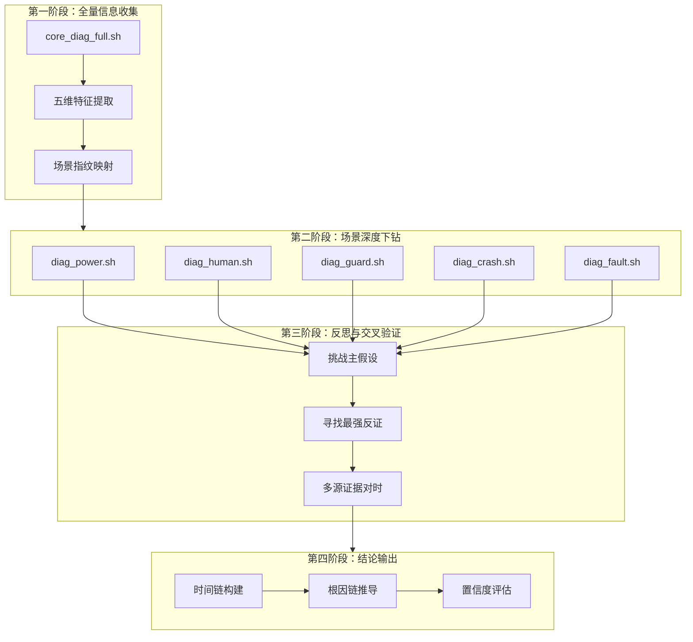
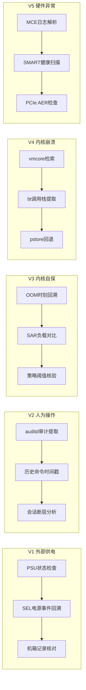
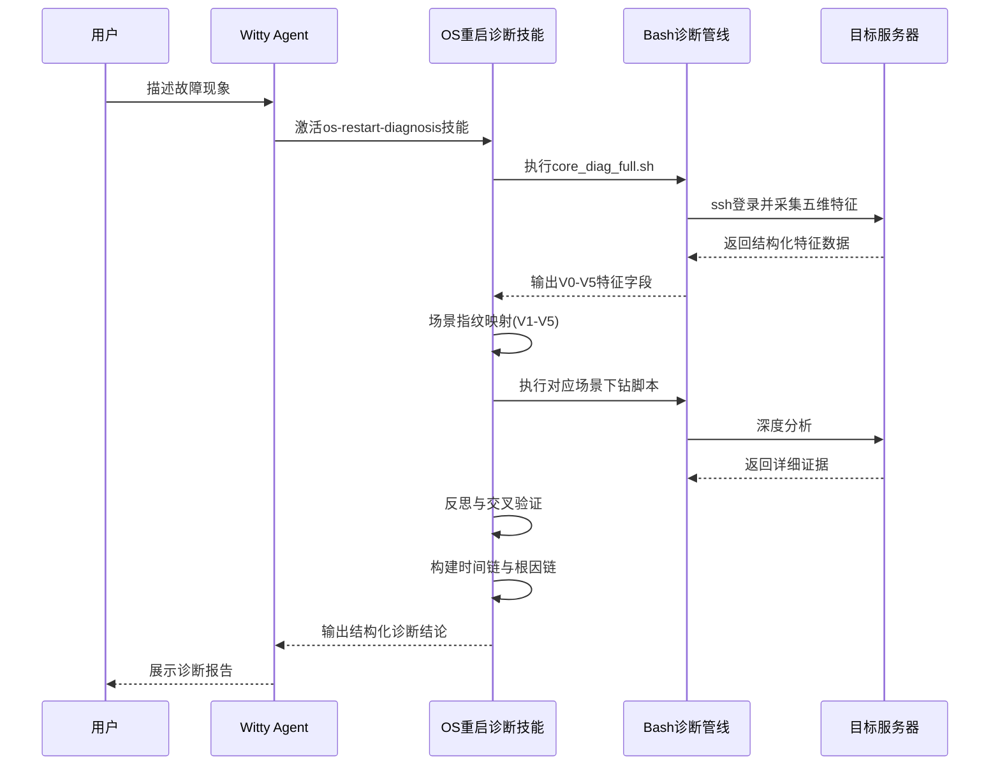
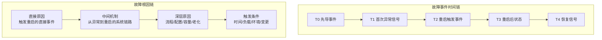

# 操作系统异常重启诊断：一个 AI Agent 的四阶段推理方法论

## 概述

服务器突然重启了。业务中断、告警风暴、运维人员手忙脚乱地登录查看——这是每家企业 IT 运维团队都不陌生的场景。操作系统重启故障的排查，表面上是一个"找原因"的问题，但实际上它面对的是**信息碎片化、场景多样化、时间链断裂、故障跨层级传播**四个系统性困境。

Witty 诊断 Agent 内置的 OS 重启诊断技能，采用了一种截然不同的思路——**不是从单一日志入手做线性排查，而是通过"全量指纹采集 → 场景下钻 → 反思交叉验证 → 结论输出"的四阶段推理链路，将一次原本需要数小时甚至数天的排查过程，压缩到分钟级的自动化诊断流程**。

本文将从 Agent 的视角，深入拆解这套四阶段诊断体系的设计哲学、实现原理与关键权衡。

## 背景

### 痛点分析

在 Agent 实际面对的上百个重启案例中，我们发现 OS 重启诊断存在四个深层次的结构性困境：

**1. 证据碎片化，关联成本极高**

一次重启可能留下"足迹"的地方包括：系统日志（journald）、带外管理日志（IPMI/BMC SEL）、内核崩溃转储（vmcore）、硬件错误记录（MCE/rasdaemon）、审计日志（auditd）、历史命令记录（bash_history）、性能监控数据（SAR）……这些来源的格式各异、时间基准不同（BMC 时钟 vs OS 时钟可能有偏差），传统人工排查光"对时"就要花掉大量精力。

**2. 场景多样性，线性排查效率低下**

操作系统重启的可能原因横跨五个完全不同的领域：外部供电波动、人为操作失误、内核自保机制触发（OOM/Softlockup）、内核崩溃（Panic/Oops）、硬件底层失效（MCE/ECC/PCIe）。不同场景需要完全不同的排查方法和工具链。传统排查往往靠个人经验"猜"方向，猜错了再回溯，走的是串行的试错路径。

**3. 时间链断裂，因果关系无法还原**

重启后系统状态被重置，OOM 发生时的内存快照、panic 前的最后几条日志、硬件报错的精确时序——这些关键信息极容易被覆盖或丢失。如果不能重建从"先导事件 → 异常信号 → 触发重启 → 恢复后状态"的完整时间链，根因判断就只能是猜测。

**4. 单维度分析，跨层级故障无法穿透**

很多重启不是单一原因导致的。例如：硬件 MCE 错误触发内核 panic → panic 触发 kdump → kdump 过程中内存压力加剧 → 二次触发 OOM。如果只盯着 vmcore 分析，可能会漏掉最初的硬件触发器。需要跨硬件层、内核层、系统服务层的多源交叉验证。

### 设计目标

基于上述痛点，这套重启诊断技能的设计目标可以概括为：

- **最短路径收敛**：在一次全量采集中完成五维场景指纹提取，直接映射到最可能的场景，避免线性试错
- **可复现的诊断逻辑**：每个结论都必须有可追溯的证据支撑，而非"经验主义"的猜测
- **完整的时间链重建**：从先导事件到恢复信号，构建分钟级精度的故障时间演进链条
- **多源交叉验证**：至少从三类独立证据源（系统日志、带外管理、硬件指标）验证同一结论

## 设计解决方案

### 整体架构：四阶段推理管道

整套诊断技能以"四阶段"推理管道为核心骨架，以 Bash 脚本管线为执行层，以 SKILL.md 中定义的元知识为推理规则引擎：



这种四阶段设计体现了诊断思维中最重要的原则——**先宽后深，先假设后验证**。第一阶段做宽口径的特征采集，不遗漏任何可能性；第二阶段基于假设做定向深挖；第三阶段用反证思维过滤误判；第四阶段用结构化模板输出可消费的结论。

### 五维场景指纹体系：一次采集，精准归类

这套体系最核心的设计创新在于 **"五维场景指纹"** 的构建。传统的故障排查方式是"有了症状 → 猜测原因 → 翻日志验证"，而这里采用了类似"临床诊断"的思路——先做全量检查（血常规、CT、心电图），根据关键指标的组合模式直接映射到最可能的疾病类型。

具体来说，`core_diag_full.sh` 在一次执行中同时采集五大维度的特征：

| 维度 | 关键采集字段 | 数据来源 |
|:---|:---|:---|
| V0 时间上下文 | Current_Time, System_Boot_Time, Uptime_Duration | `date`, `uptime` |
| V1 外部供电 | PSU_Status, Chassis_Power_Event | `ipmitool sdr`, `ipmitool chassis status` |
| V2 人为操作 | Last_Shutdown_User, Bash_History_Modify, Reboot_History | `ausearch`, `last -x`, `stat .bash_history` |
| V3 内核自保 | OOM_Events_Found, Softlockup_Events, Panic_Policies | `journalctl --boot=-1`, `sysctl` |
| V4 内核崩溃 | Kdump_Dir, Panic_Signature | `ls /var/crash`, `journalctl -k` |
| V5 硬件异常 | MCE_Runtime_Errors, Fatal_HW_Events | `dmesg`, `ipmitool sel` |

每个维度的输出字段都被精心设计为**具有强判别力的"分类特征"**。例如，通过 `Chassis_Power_Event` 是否包含 `Lost` 或 `Cycle`，可以直接区分"外部掉电"和"内部触发"；通过 `OOM_Events_Found > 0` 且 `Panic_Policies` 中 `panic_on_oom=1`，可以直接判定内核自保触发的可能性。

这种"指纹映射"的设计使得 Agent 能在**几秒内**完成一次全量扫描，输出结构化的场景归类结论——这在传统人工排查中至少需要 15-30 分钟的分散查阅。

### 为什么选择 Bash 脚本而非 Python/Go 作为执行层

这是一个经过深思熟虑的权衡：

- **零依赖部署**：诊断的目标机器可能是最小化安装的服务器，可能没有 Python 运行时或缺少各种依赖库。Bash 是 POSIX 标准的一部分，100% 的 Linux 发行版都预装。
- **系统命令原生调用**：诊断需要大量调用 `ipmitool`、`journalctl`、`ausearch`、`sysctl`、`dmesg`、`smartctl` 等系统命令，Bash 是这些命令最自然的 glue language。
- **原子化执行**：每个脚本都是独立的可执行单元，可以在目标机器上单独运行，方便分段排查和结果缓存。

### 第二阶段设计：五条独立的下钻路径

一旦第一阶段完成场景指纹映射，Agent 会将主场景 + 备选场景作为输入，执行对应的第二阶段脚本。每条路径都遵循"先验证假设是否成立，再解释为何成立，最后给出影响范围"的三段式方法论：

**V1 外部供电（diag_power.sh）**
侧重"链路稳定性校验"——检查 PSU 实时状态、回溯 SEL 中的掉电/恢复事件、核对机箱开启记录。核心逻辑是：如果断电事件与重启时间高度吻合，且 OS 无先行异常，则供电故障成立。

**V2 人为操作（diag_human.sh）**
侧重"行为轨迹还原"——通过 `ausearch` 提取精确到纳秒的关机/启动审计记录，结合 `.bash_history` 的文件修改时间与内容快照，比对 `last -x` 中的会话断层。一个关键的诊断逻辑是：如果人为操作时刻早于启动时刻不足 2 分钟，则高度怀疑为人为触发重启。

**V3 内核自保（diag_guard.sh）**
侧重"资源饱和度与策略触发回溯"——使用 `journalctl --boot=-1` 回溯上一次启动的 OOM/Softlockup 事件精确时刻，结合 SAR 历史负载数据复原事故窗口，最后核对 `sysctl` 中 panic 相关策略是否开启。判定标准是：OOM 事件时间戳是否在系统重启时间之前的 30 秒内。

**V4 内核崩溃（diag_crash.sh）**
侧重"代码级陷阱定位"——自动检索最新的 vmcore 转储文件，调用 `crash` 工具自动化执行 `bt` 命令提取函数调用栈。如果 vmcore 不存在，则回退到读取 pstore 中的 console-ramoops 离线记录。

**V5 硬件异常（diag_fault.sh）**
侧重"物理部件映射"——通过 `ras-mc-ctl` 提取 MCE 摘要和详细错误记录，执行 `smartctl` 健康检查扫描关键存储介质，最后检查 `dmesg` 中的 PCIe AER 总线异常。



### 第三阶段的反思机制：诊断中的"反事实思维"

这是一个在传统诊断工具中极少见的设计——**主动挑战自己的结论**。第三阶段不是简单的"再检查一遍"，而是结构化地应用反事实思维：

- 严格区分"症状、触发机制、根因"三层，不允许将日志现象直接当作根因
- 主动寻找最强反证：如果当前的结论是"外部掉电"，那就要去找"有没有可能是 OOM 先发生，掉电只是结果？"
- 对互斥场景执行最小代价复验：例如通过短窗观测、单项配置回滚等方式降低不确定性
- 关键时间点必须跨来源对时：NTP 偏差、日志时区、BMC 与 OS 时钟的差异必须校正

这套机制借鉴了医学诊断中的**鉴别诊断（Differential Diagnosis）** 方法，显著降低了单一路径的误判风险。

## 实现原理

### 核心流程：从用户输入到诊断结论的完整链路

当用户通过 Witty 诊断 Agent 提交一个重启故障时，背后的执行链路是这样的：



### 关键实现细节

**第一阶段的时间增强设计**

`core_diag_full.sh` 中一个精妙的设计是 V0 时间上下文的引入。它不仅记录了当前时间和系统启动时间，更重要的是为每个维度的采集结果都附加了时间信息。例如，OOM 事件不是只记录"有/没有"，而是记录了 `Latest_OOM_Time: 2026-03-15 14:31:22` 这样的精确时刻。这为后续的时间链重建提供了毫米级的精度基础。

**V3 诊断的 30 秒窗口规则**

在 `diag_guard.sh` 的最后，有一段明确的诊断逻辑：

```bash
echo "分析方法：对比 [OOM_EVENT] 的时间戳是否在 [System_Boot_Timestamp] 之前的 30 秒内。"
echo "如果是，则重启原因是：内存耗尽触发了 panic_on_oom 强制复位。"
```

这里的"30 秒"是一个经过工程权衡的经验值——太短会漏掉真实 OOM 触发的场景，太长会引入噪音（OOM 发生在 5 分钟前，期间系统可能因其他原因重启）。从内核行为来看，OOM Killer 触发后如果 `panic_on_oom=1`，内核会在数秒内执行 panic 并触发重启，30 秒的窗口已经足够宽松以覆盖日志时间戳的精度误差。

**V2 的文件修改时间技巧**

`diag_human.sh` 中一个有趣的设计是通过 `.bash_history` 的 `stat mtime` 来推断操作时刻：

```bash
HIST_MTIME=$(stat -c %y /root/.bash_history 2>/dev/null | cut -d. -f1)
```

原理是：当用户在 shell 中执行 `reboot` 或 `shutdown` 命令时，这些命令会被写入 `~/.bash_history`。如果重启前最后一个操作是手动敲了重启命令，那么 `.bash_history` 的修改时间会精确地"冻结"在重启前的那个瞬间。通过对比这个时间与 `uptime -s` 的启动时间，Agent 可以快速判定是否有人为操作。

> **Note:** 这种方法的可靠性取决于 bash 的 `history` 写入时机（默认是 shell 退出时写入）。如果服务器直接掉电而非正常关机，历史记录可能不会被写入。这是该方法的固有局限，也是为什么脚本同时支持 `ausearch` 和 `last -x` 两条补充路径。

### 时间链与根因链的构建

诊断结论中最具有区分度的输出是两个链式结构：

**故障事件时间链**以故障演进为线索，从 T0（先导事件）到 T4（恢复信号），每个时间点都附带精确的时间戳和事件描述。例如：

- T0 09:45:00：机房 PDU 供电波动
- T1 09:45:03：BMC 记录 Power Lost 事件
- T2 09:45:05：系统掉电，所有服务中断
- T3 09:46:30：供电恢复，系统自动上电启动
- T4 09:48:00：所有服务自愈完成

**故障根因链**则从直接原因到深层原因进行分层推导，区分"直接触发点"、"中间系统机制"和"深层根因"，让用户不仅知道"是什么坏了"，更知道"为什么坏了"以及"什么条件下坏掉的"。



时间链解决了"什么时间发生了什么"，根因链解释了"为什么会发生"——两者结合构成了完整的故事情节。

## 关键设计权衡

### 自动化 vs 人工判断

这是一对贯穿始终的权衡。脚本驱动的自动化诊断在速度和可重复性上有巨大优势，但在处理"模糊场景"（例如多个场景特征同时出现，或者日志信息不完整）时，纯自动化的规则引擎可能给出错误的结论。

这套系统的平衡方案是：**脚本负责证据采集和初步推论，Agent 负责推理和决策**。脚本输出结构化的证据字段，Agent 根据 SKILL.md 中定义的元知识（包括判定标准、反证规则、置信度调整规则）进行最终的推理判断。这种"采集与推理分离"的架构兼顾了执行效率和决策灵活性。

### 采集深度 vs 执行风险

诊断脚本设计中的另一个核心权衡是"要采集多少信息"。理论上，`core_diag_full.sh` 可以采集上百个字段，但每个额外的采集命令都增加了执行时间和被排查机器的负载（特别是在生产环境的高负载服务器上）。

设计选择是：**优先采集具有强判别力的特征，确保采集命令都是只读的**。只读确保了安全性，强判别力确保了信息密度。

### 时间精度 vs 来源可靠性

跨来源对时一直是根因分析中的老大难问题。BMC 的时钟可能与 OS 时钟有数秒甚至数分钟的偏差，journald 的时间戳使用的是系统时间，而 IPMI SEL 时间戳使用的是 BMC 本地时间。

目前的设计策略是：**在第三阶段明确要求跨来源对时，并将时间偏差作为置信度调整因子**。如果 BMC 与 OS 的时钟偏差超过 30 秒，相关的结论置信度自动下调一级。

## 使用流程示例

当用户通过 Witty 诊断 Agent 提交一个重启故障时，典型的交互流程如下：

```text
用户：服务器在今天上午 10:30 左右突然重启，业务中断约 5 分钟，请帮我分析根因。
```

Agent 内部的执行过程：

1. **激活技能**：Agent 识别到"重启"关键词，激活 os-restart-diagnosis 技能
2. **全量采集**：Ansible 连接到目标服务器，执行 `core_diag_full.sh`，在 3-5 秒内完成五大维度的特征采集
3. **场景归类**：Agent 分析特征数据，假设 `Chassis_Power_Event` 包含 `Lost`，`OOM_Events_Found = 0`，`Kdump_Dir = MISSING`，输出主场景 V1（外部供电）+ 备选场景 V5（硬件异常）
4. **深度下钻**：执行 `diag_power.sh` 确认供电链路异常，执行 `diag_fault.sh` 排查是否有硬件底层信号
5. **交叉验证**：对比 BMC SEL 时间与系统日志时间，确认吻合；检查是否有其他场景反证
6. **输出结论**：Agent 生成结构化的根因分析报告

## 总结

操作系统重启诊断是一个典型的"信息丰富但知识贫乏"的问题——日志数据不缺，缺的是将数据转化为结论的推理框架。Witty 诊断 Agent 的 os-restart-diagnosis 技能通过四阶段推理管道回答了这个问题：

- **第一阶段**用五维指纹体系解决了"证据碎片化"问题，一次采集完成场景归类
- **第二阶段**用五条独立下钻路径解决了"场景多样化"问题，每条路径都有精确的验证标准
- **第三阶段**用反思与交叉验证解决了"误判风险"问题，通过反事实思维过滤假阳性
- **第四阶段**用时间链 + 根因链的双链结构解决了"因果关系模糊"问题

这套设计最值得借鉴的不仅是具体的技术实现，而是它背后的诊断哲学——**不是靠运气猜对方向，而是靠系统化的方法论保证在最短路径上收敛到正确答案**。在一个需要快速恢复业务的高压场景下，这种方法论带来的确定性本身就是最大的价值。
