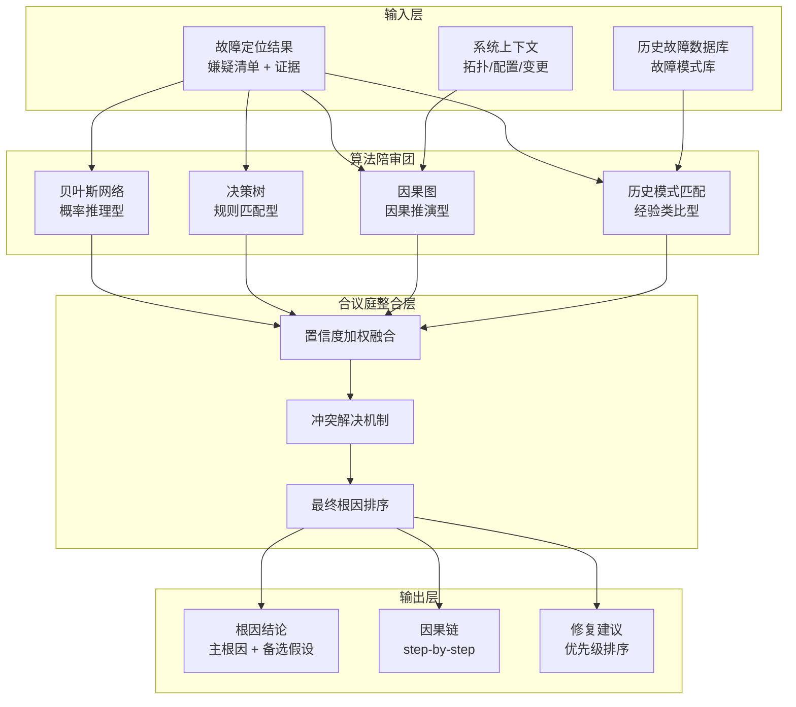
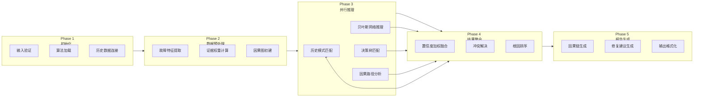

# 根因分析 Agent：在多算法"陪审团"中寻找故障的最终真相

## 概述

在 Witty 诊断流水线中，最艰难的任务不是"发现了什么异常"——那是故障定位（fault-localization）的工作——而是"这些异常背后，到底谁才是元凶？"

根因分析 Agent（Root Cause Analysis Skill）位于诊断链路的末端、修复决策的前夜。它接收来自 fault-localization 的嫌疑清单——可能包含 5 到 7 个候选根因，每个都有若干证据——然后通过四种分析算法构成的"陪审团"机制，从嫌疑中找到真正的罪魁祸首。

但这套机制的独特之处不在于"用了多少个算法"，而在于它如何让这些算法相互制衡、如何用证据权重说话、以及如何将分析结果转化为可执行的修复建议。本文将从 Agent 的第一视角，拆解这套"多算法陪审团"的架构设计、推理逻辑与使用方式。

## 背景

### 根因分析为什么这么难

在 Agent 日常处理的诊断场景中，"找到问题点"和"找到根因"之间，存在一条深不见底的鸿沟。一个典型的案例：故障定位发现 CPU 使用率 95%、内存使用率 89%、磁盘 IO 等待 68%——三个异常。根因是哪一个？

答案可能完全不是这三者中的任何一个。内存泄漏导致 GC 频繁 → GC 导致 CPU 飙升 → GC 也导致应用暂停 → 应用暂停导致连接持有变长 → 连接池耗尽 → 新请求排队 → 排队导致线程数增加 → 线程竞争又加剧 CPU 压力。这是一条典型的**因果链**，而 CPU 使用率高只是链条中间的一个"症状"，不是根因。

传统的单算法根因分析面临三个致命问题：

| 问题 | 表现 | 后果 |
|:---|:---|:---|
| **因果混淆** | 把相关性当因果，将次级效应误判为根因 | 修复方向完全错误，故障反复 |
| **过度自信** | 单一算法对自己的结论没有校准机制 | 输出一个"看起来合理但实际错误"的根因 |
| **证据浪费** | 大量日志、指标、拓扑信息未被充分利用 | 分析过程"草率"，依赖直觉而非证据 |

Agent 绝对不能犯这些错误——因为在诊断流水线中，根因分析的输出直接驱动 controlled-repair 的修复动作。一个错误的根因意味着错误的修复，错误的修复可能比不修复更糟糕。

### 设计目标

基于上述痛点，根因分析 Agent 确立了四个核心设计目标：

- **多视角交叉验证**：不要相信任何一个算法，让多个算法互相「审判」，通过结果一致性评估结论可靠性。
- **证据链可追溯**：不仅仅是输出"根因是 X"，必须给出完整的因果链（cause → effect → confidence），让用户可以看到每一步的推理依据。
- **置信度校准**：每个结论都必须有置信度评分，且置信度必须真实反映证据强度——证据不足时坦诚说"不确定"，而非硬给一个低质量的结论。
- **修复可执行**：根因分析不是终点，结论必须能映射为具体的、分优先级的修复操作。

## 设计方案

### 整体架构：陪审团与合议庭模式

根因分析 Agent 的架构设计借鉴了司法体系中的**陪审团制度**——嫌疑清单由 fault-localization 提供（类似检察官提交指控），而四种算法扮演不同背景的"陪审员"，各自独立分析、独立投票，最后由合议庭（结果整合模块）汇总裁决：



**四种"陪审员"的角色分工：**

| 算法 | 思维模式 | 强项 | 弱项 |
|:---:|:---|:---|:---|
| **贝叶斯网络** | 概率统计思维 | 处理不确定性和不完整数据 | 需要先验概率，对罕见场景不准 |
| **决策树** | 规则分类思维 | 可解释性强，匹配已知故障模式 | 对未见过的故障类型无能为力 |
| **因果图** | 因果推理思维 | 建模故障传播路径，发现间接根因 | 依赖准确的系统拓扑建模 |
| **历史模式匹配** | 经验类比思维 | 利用历史案例加速诊断 | 对全新故障类型无效 |

让四种完全不同的推理范式"同台竞技"，正是这套架构最精妙的设计——**它们各自的弱点正好被对方的强项所弥补**。当四种算法一致指向同一个根因时，结论的可靠性远高于任何单一算法的输出。

### 为什么是这四种算法？

在选择算法时，Agent 面临一个关键问题：**根因分析究竟是一个"分类问题"、"推理问题"还是"匹配问题"？**

答案是：它三者都是。

- 从分类角度看，根因分析需要将症状归类到已知的故障类型 → 决策树
- 从推理角度看，根因分析需要从证据反向推断原因 → 贝叶斯网络
- 从因果角度看，根因分析需要理解故障的传播路径 → 因果图
- 从经验角度看，根因分析需要借鉴历史案例 → 历史模式匹配

### 信任但验证：置信度加权融合

多算法必然带来一个问题：当算法结论不一致时，听谁的？

Agent 采用了 **置信度加权融合（Confidence-weighted Fusion）** 机制，而非简单的"多数投票"。核心理念是：**不是所有算法的投票权重都一样，每个算法在当前场景下的可靠性决定了它的发言权**。

融合逻辑分三步：

1. **证据充分性评估**：每个算法先评估自己收到的证据质量（数据完整性、信噪比、时间对齐程度），作为算法级别置信度的基数
2. **算法可靠性校准**：基于历史回测数据，每个算法在不同故障类型上有不同的"历史准确率"，作为权重乘数
3. **加权投票**：每个算法对其 Top-N 候选根因进行概率赋值，最后按权重整合得到全局排序

**冲突解决机制：** 当算法间出现结论冲突时（例如贝叶斯指向 memory_leak，而决策树指向 disk_bottleneck），Agent 不会简单取平均。相反，它会启动一个**因果关系验证步骤**——检查 disk_bottleneck 是否可能是 memory_leak 的次级效应。这正是因果图算法的独特贡献：它能够判断两个候选根因之间是否存在"因果关系"而非"竞争关系"。

## 实现原理

### 核心分析流水线

根因分析 Agent 的执行被严格划分为 5 个阶段，每个阶段有明确的入口条件和出口产物：



### 因果链的生成逻辑

根因分析 Agent 最有价值的能力之一，是生成一个**可追溯的因果链**。这并非简单的"因为 A 所以 B"的线性思维，而是一种多跳推理：

以内存泄漏场景为例，Agent 生成的因果链：

```text
Step 1: Java应用程序内存泄漏
         ↓ (confidence: 0.95)
Step 2: 堆内存使用率持续增长至89.3%
         ↓ (confidence: 0.90)
Step 3: 触发频繁Full GC（15次，总时长45.2秒）
         ↓ (confidence: 0.88)
Step 4: 应用程序线程暂停，响应时间增加
         ↓ (confidence: 0.85)
Step 5: 数据库连接持有时间变长
         ↓ (confidence: 0.82)
Step 6: 连接池耗尽，新请求失败或超时
```

这条链的设计遵循一个核心原则：**每步之间的 confidence 逐步衰减**。越下游的效应，其根因"确定性"越低，因为引入了更多的中间变量。这种设计让用户能够清晰看到：Agent 对"内存泄漏 → GC"有 95% 的信心，但对"GC → 连接池耗尽"只有 82% 的信心。这为后续的 human-in-the-loop 决策提供了精确的信任区间。

### 置信度评估模型

置信度不是一个拍脑袋的分数，而是由三个子维度加权计算而来：

```json
{
  "confidence": 0.92,
  "components": {
    "evidence_quality": 0.90,
    "algorithm_consensus": 0.88,
    "historical_support": 0.94
  }
}
```

**evidence_quality（证据质量）：** 基于证据的数量、来源多样性（指标+日志+拓扑+时间线）、一致性计算的分数。

**algorithm_consensus（算法共识度）：** 当所有四种算法都指向同一个根因时，此分量接近 1.0；当存在分歧时，此分量下降。这是对"陪审团一致性"的量化。

**historical_support（历史支持度）：** 历史案例的匹配数量 + 相似度分数。这是一个"先验置信度"，代表该故障模式在历史上被验证过的可靠程度。

### 证据权重体系

并非所有证据都有同等的说服力。Agent 在执行证据评估时，对不同类型的证据赋予不同的基准权重，然后在推理过程中动态调整：

| 证据类型 | 基准权重 | 典型场景 | 权重调整条件 |
|:---|:---:|:---|:---|
| **错误日志直接匹配** | 0.90-0.95 | OutOfMemoryError 日志 | 日志量级、时间吻合度 |
| **指标趋势分析** | 0.80-0.90 | 内存持续增长趋势 | 增长速率、时间窗口长度 |
| **时间相关性** | 0.75-0.85 | 故障时间与变更时间吻合 | 精确度（分钟级 vs 小时级） |
| **历史模式匹配** | 0.70-0.90 | 与历史案例相似度 | 案例数量、相似度分数 |
| **单点指标快照** | 0.50-0.70 | CPU 使用率 95% | 是否有其他指标交叉验证 |
| **弱信号** | 0.30-0.50 | 偶发告警、单条日志 | 是否需要更多数据 |

这套权重体系的精妙之处在于：**它允许 Agent 在处理"证据不完整"的场景时，仍然能给出有意义的分析，但会通过低权重来让用户感知到不确定性**。这正是"诚实"的 Agent 设计原则。

### 边界处理

根因分析中最危险的场景不是"找不到根因"，而是"在证据不足时给出了一个错误但看起来合理的根因"。Agent 对此做了三层防护：

1. **证据不足检测**：如果证据覆盖的异常维度少于总异常维度的 40%，Agent 主动标记为"低置信度"状态，不会硬输出根因
2. **冲突预警**：当算法间的 root_cause 分歧度超过阈值，Agent 会在报告中生成"警告"横幅，并列出各算法的独立分析结果供人工审查
3. **置信度阈值拦截**：可配置的 `confidence_threshold` 参数（默认 0.7），低于阈值的根因会被标记为"不满足接受标准"，建议收集更多数据后重试

## 设计权衡

### 精度 vs 速度

根因分析是一个天然的"慢决策"场景——宁愿花 30 秒做对，不要花 5 秒做错。因此设计上**全面偏向精度**：

- 四种算法并行执行而非串行，在不显著增加延迟的前提下最大化分析覆盖面
- 贝叶斯网络推理可能需要 100+ 次收敛迭代，不设迭代上限，以精度为准
- 因果图构建需要加载系统拓扑，这是最耗时的步骤（约占总时间的 35%），但也是区分"因果"和"相关"的关键

**性能实测参考：**

| 场景 | 算法数 | 执行时间 | 内存消耗 |
|:---|:---:|:---:|:---:|
| 简单单故障 | 2 | 8-15s | ~250MB |
| 标准多故障 | 3 | 25-40s | ~420MB |
| 复杂跨系统 | 4 | 80-130s | ~850MB |

### 算法多样性 vs 结果一致性

四个算法各自独立的代价是：**它们偶尔会打架**。历史模式匹配认为根因是 memory_leak（因为历史上 3 次类似案例都是），而因果图认为根因是 network_partition（因为拓扑分析显示网络异常先于内存异常发生）。

这种情况下怎么办？Agent 的设计选择是：**保留矛盾，而非强行一致**。

主根因（primary_root_cause）给出置信度最高的那个，但备选假设（alternative_hypotheses）中完整保留其他算法的结论，并标注"relationship_to_primary"（是次级效应、巧合还是无关）。这样用户（或下游的 controlled-repair Agent）可以看到完整的证据全景图，自行做出最终判断。

### 通用性 vs 场景定制

Agent 支持通过 `analysis_algorithms` 参数灵活选择算法组合，适应不同场景：

- **快速分析场景**（如告警即时判定）：仅用决策树 + 历史匹配，<15 秒出结果
- **标准分析场景**（如日常故障排查）：贝叶斯 + 决策树 + 历史匹配，balance 精度和速度
- **深度分析场景**（如复杂 P1 故障）：启用全部四种算法，包含完整的跨系统因果图分析

这种设计避免了对"一刀切"的妥协，让同一个 Skill 既能处理"磁盘告警快速判定"这种简单场景，也能应对"数据库集群故障+网络分区"这种复杂场景。

## 使用方式和实战

### 调用入口

根因分析并非独立运行的诊断工具，而是 Witty 诊断流水线的一个环节。它由 Dayu 编排调度 Agent 在故障定位完成后自动触发。用户通常通过以下方式调用：

```bash
# 通过 Xuan Agent 总控入口，描述故障后自动触发全链路
# Agent 会自动执行：数据采集 → 故障定位 → 根因分析 → 报告生成
```

### 关键参数配置

| 参数 | 默认值 | 推荐场景 |
|:---|:---:|:---|
| `analysis_algorithms` | `["bayesian", "decision_tree", "causal_graph"]` | 标准场景；复杂跨系统故障建议加 `historical_matching` |
| `confidence_threshold` | `0.7` | 生产环境建议保持 0.7-0.8，实验分析可降至 0.5 |
| `max_hypotheses` | `5` | 备选假设越多，信息量越大，但也会增加阅读负担 |
| `use_historical_data` | `true` | 新集群无历史数据时设为 false |

### 典型实战案例

**场景：Web 服务器性能下降**

故障定位发现三个异常：CPU 92%、内存 89%、IO 等待 68%。根因分析 Agent 配置贝叶斯 + 决策树 + 历史匹配三种算法并行分析。

分析过程中：

- 贝叶斯网络计算各根因的后验概率，memory_leak 以 0.91 领先
- 决策树匹配到内存泄漏的特征路径：memory > 85% → OOM_error → high_GC
- 历史匹配找到 3 个相似案例，根因均为 java_memory_leak

三种算法结论一致，置信度加权后达到 0.92。Agent 不仅给出了根因，还生成了 5 步因果链和 4 条分优先级修复建议（从"立即重启"到"长期优化内存管理"）。

**关键的判断质量指标：**

| 验证维度 | 结果 | 说明 |
|:---|:---:|:---|
| **数据充分性** | high | 指标、日志、GC 信息完整，时间线清晰 |
| **证据强度** | strong | 多条独立证据支持同一结论 |
| **算法一致性** | high | 三种算法结论一致 |
| **历史支持度** | strong | 3 个案例匹配，最高相似度 0.94 |

### 用户视角的"信任判断"

作为根因分析的使用者，你可以通过以下三个关键维度快速判断是否应该信任 Agent 的输出：

1. **看置信度**：0.9+ 可以直接信任；0.7-0.9 建议人工复核关键证据；< 0.7 建议收集更多数据
2. **看算法一致性**：所有算法指向同一个根因 → 高可信；算法存在分歧 → 查看 alternative_hypotheses 中的标注关系
3. **看因果链**：因果链的每一步是否有独立证据支撑？是否存在"跳跃"的逻辑断层？

## 总结

根因分析 Agent 本质上是一套**多算法陪审团系统**，它的核心设计理念可以概括为：

- **不要信任单一视角**：四种算法四种不同的推理范式，彼此的弱项被对方的强项覆盖
- **置信度必须是诚实的**：证据不足时明确说"不确定"，而不是硬给一个低置信度的结论
- **根因不是终点**：输出必须附带完整的因果链和可执行的修复建议，让"分析 → 修复"的链路最短化

这套设计的真正价值不在于算法有多复杂，而在于它如何优雅地处理"不确定性"——在 AI 诊断的世界里，知道自己不知道，比知道正确答案更重要。
