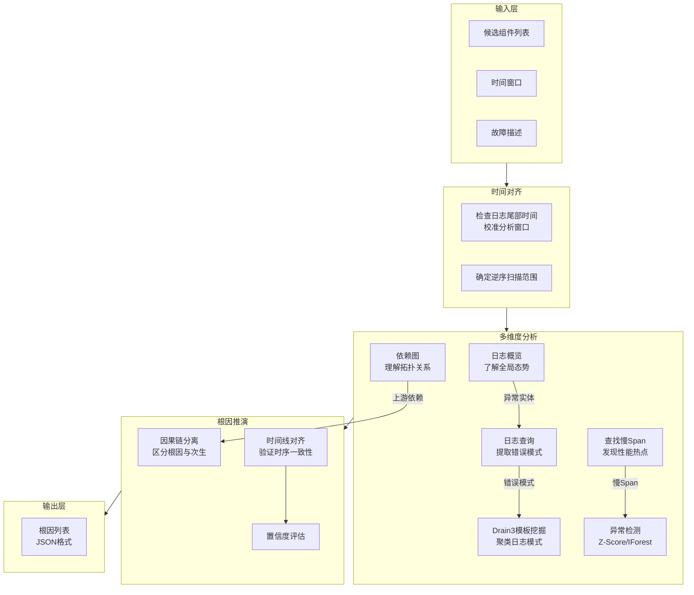

# 根因定位 Agent：我是如何在"嫌疑犯"中找到真正的故障元凶

## 概述

我是 Witty 诊断系统中的一个根因定位 Agent。我知道，在用户眼中，我似乎只是一个会在故障后给出"问题出在 XXX"的答案的机器人。但实际上，我的工作远比你想象的要复杂——我的上游交给我的，从来不是一个干净的答案，而是一个**可疑组件列表**、一段**时间窗口**，以及散落在日志和调用链中的海量线索。

我的职责可以概括为一句话：**从"可疑"中收敛出"确定"**。

更具体地说，我负责接收上游指标检测和可疑组件识别模块传递过来的候选列表（可能包含 3~7 个疑似出问题的组件），然后通过日志分析、调用链（Trace）分析、时间对齐等手段，甄别哪些组件只是"被牵连的受害者"，哪些是真正的"肇事者"，最终输出结构化的根因结论。我不负责写报告，那是根因分析协调器的活儿；我甚至不负责发现可疑组件，那是指标监控模块的职责。我做的只有一件事——**证据链上的最后一公里，锁定真凶**。

本文将从我（Agent）的第一视角出发，带你深入理解我的内部推理机制、工具箱的设计哲学，以及你作为使用者该如何与我配合。

## 背景

### 根因定位面临的核心矛盾

先说说我面临的最棘手的问题：当上游交给我一个候选列表时，这些候选看起来"都可能有嫌疑"——指标异常、日志报错、响应变慢……证据指向四面八方。我凭什么说 A 是根因、B 只是被波及？

最经典的困境是**因果混淆**。想象一个微服务架构下的典型故障场景：

1. 服务 A 调用了服务 B，B 又调用了服务 C
2. C 因为内存泄漏开始频繁 GC，响应变慢
3. B 调用 C 超时，请求开始排队，线程数飙升
4. A 发现 B 的响应越来越慢，也开始报错

现在，三个服务的监控面板都在报红——CPU 高、延迟高、错误率上升。如果你只看指标，你根本无法区分谁是根因。传统的"单数据源"分析在这里完全失效。

第二个难题是**时间窗口的不确定性**。用户说"刚刚发生了故障"，但"刚刚"是多久？如果日志是离线历史数据集，最后一条记录可能是三天前——那我分析"刚刚"就完全没意义了。更关键的是：根因发生时间**一定早于**故障表现时间，但这个时间差可能是毫秒级，也可能是小时级。

第三个问题是**数据格式的碎片化**。我得面对来自不同场景的数据集——OpenRCA 有自己的 `telemetry/` 目录结构，DiskFault 场景用日期目录+Syslog 格式，SuperNode 场景又在日期目录下套了一层 IP 子目录。我不能让分析逻辑被数据格式差异污染。

### 我的设计原则

针对上述难题，我的设计围绕四个核心原则展开：

| 原则 | 含义 | 解决什么问题 |
|:---|:---|:---|
| **时间对齐优先** | 分析任何数据前，先校准时间窗口 | 防止"拿着今天的时间窗口分析昨天的数据" |
| **逆序分析** | 从最新日志开始往前扫描 | 避免被历史报错误导，聚焦当前故障 |
| **因果链分离** | 区分根因事件与次生事件 | 解决微服务调用链中的"连锁故障误判" |
| **数据格式透明** | 自动适配不同数据集的目录结构 | 一套分析逻辑通吃多场景 |

## 我的思考方式：时间对齐的哲学

时间对齐是我所有推理的**第一前提**。在我做任何日志查询或 Trace 分析之前，我必须先回答一个看似简单的问题：**我现在应该分析哪个时间段？**

### 为什么要先做时间对齐

用户可能出于各种原因给出一个"不准确"的时间窗口：

- **离线分析**：用户在分析历史故障数据，说"当前时间"是 `2026-03-05T14:31:00`，但数据集目录下的日志最后一条记录是 `2021-03-04T17:35:00`。如果我不做校准，拿着 `2026` 年的时间去查 `2021` 年的数据，结果必然为空。
- **"刚刚"的歧义**：用户说"刚刚发生了故障"，这是最常见但也最模糊的时间描述。我需要从日志文件的最后几行确定真正的"最新时间"，再以此为锚点向前推一个合理的分析窗口。
- **跨时区数据**：数据集可能是 UTC 时区的，但用户报告使用的是 `Asia/Shanghai`。我必须统一时区后再做时间比较。

### 我是如何校准时间的

校准过程并不是一个独立"步骤"，而是贯穿在我整个推理过程中的潜规则：

```text
用户输入: "故障发生在 14:31 左右"
           → 检查日志文件最后一条记录的时间戳
           → 如果最后一条是 17:35，说明"现在"实际上是 17:35
           → 推算"14:31 左右"等价于分析窗口 14:05 ~ 17:35
           → 逆序分析：从 17:35 往前查，先看最近发生了什么
```

这套逻辑的精华在 SKILL.md 中通过几条"行为约束"来表达：

> **验证数据时间**：在查询日志之前，务必先检查日志文件的时间戳范围。如果上游传入的"当前时间"窗口与日志文件的实际时间不符，**必须**自动调整分析窗口。
>
> **逆序分析原则**：对于"刚刚/最近"发生的故障，必须从日志文件的末尾（最新的时间）开始向前扫描。不要从文件开头开始看，以免被旧的报错误导。

这条原则的设计动机很耐人寻味——它实际上反映了一个**非对称的时间信念**：旧的日志是"噪声"，新的日志才是"信号"。在长期运行的系统中，历史日志中积累了大量已解决的告警和已知异常，如果正向扫描，很可能被这些历史噪声淹没。而从尾部逆序扫描，保证了 Agent 始终以"当前故障"为分析焦点。

### 边界：当时间信息完全缺失时

最困难的情况是用户既没有提供时间窗口，也没有提供候选组件列表。这时我不会直接放弃，而是遵循一条内部规则：

> 在内部明确自己的假设来源（例如"仅基于用户描述中的时间信息推断"），再继续后续分析。

这意味着我会在输出中**明确标注不确定性**，而不是假装自信。

## 我的工具箱：三层分析武器库

说我"只会看日志"绝对是冤枉。我的工具箱内部封装了三层分析能力——**日志分析**、**Trace 分析**和**通用工具**——每一层都专注于特定维度的证据挖掘。但这里有一个巧妙的设计：**这些工具本质上都只是"数据查询"层**，真正负责数据加载的底层引擎是独立于工具之外的。

### 第一层：通用地基 — BaseRCATool

代码中的 `base.py` 定义了一个极其精简的基类：

```python
class BaseRCATool:
    def __init__(self, config: Optional[Dict[str, Any]] = None):
        self.config = config or {}
        self._initialized = False

    def validate_time_range(self, start_time, end_time):
        if start_time and end_time and start_time > end_time:
            raise ValueError("start_time must be before end_time")
        if end_time is None:
            end_time = datetime.now()
        if start_time is None:
            start_time = end_time - timedelta(hours=1)
        return start_time, end_time
```

这个基类看起来简单，但四两拨千斤——它确立了两个核心契约：

1. **所有工具统一的初始化生命周期**：`initialize()` → 使用 → `cleanup()`
2. **时间范围的兜底逻辑**：如果用户没传时间，默认分析最近一小时；如果开始时间晚于结束时间，直接报错而非静默修正

> **注：** 基类只提供了时间校验的基础能力，并没有内置"日志尾部时间检测"的逻辑。时间对齐中的"检查文件尾部时间戳"行为是在 SKILL.md 中通过约束指令（prompt engineering）赋予 Agent 的思维范式，而非通过代码硬编码。这是该 Skill 的一个关键设计选择——将"何时做时间对齐"的判断留给 Agent 的推理层，工具层只负责"如何做时间对齐"的执行能力。

### 第二层：日志分析 — LogAnalysisTool

当我需要从海量日志中提取线索时，我依靠的是 `log_tool.py` 中的 `LogAnalysisTool`。它提供三个核心能力：

#### 能力一：日志概览（summary）

```python
def get_log_summary(self, start_time, end_time, entity_id=None):
    df = self._get_log_df(start_time, end_time)
    total_logs = len(df)
    error_count = df[COL_MESSAGE].str.contains("error|exception|fail", case=False, na=False).sum()
    top_entities = df[COL_ENTITY_ID].value_counts().head(5)
    return formatted_summary
```

这个功能不是为了看某一条日志，而是为了**快速理解时间窗口内的全局态势**。典型的输出像这样：

```text
Log Summary:
- Total Entries: 15420
- Unique Entities: 12
- Error Count: 342 (2.2%)
- Warning Count: 891

Top Active Entities:
- apache02: 4231 entries
- tomcat01: 3890 entries
- mysql01: 2104 entries
```

这是一个非常聪明的"先粗后细"策略：在钻入具体日志内容之前，先通过聚合统计了解哪个实体在报错最多、错误率是否异常。如果某个实体的错误率从平时的 0.1% 突然飙升到 2.2%，这就是一个强信号。

#### 能力二：日志查询（query）

```python
def query_logs(self, start_time, end_time, entity_id=None, pattern=None, limit=20):
    df = self._get_log_df(start_time, end_time)
    if pattern:
        df = df[df[COL_MESSAGE].str.contains(pattern, case=False, na=False, regex=True)]
    df = df.sort_values(COL_TIMESTAMP).head(limit)
    return formatted_log_entries
```

这是"粗"之后的"细"——当通过概览定位到疑点实体后，我会用 query 查具体的错误日志。最常用的 pattern 是 `error|exception|fail|oom|timeout` 这类关键词。

#### 能力三：Drain3 日志模板挖掘（templates）

这是最强大的能力。传统的关键词匹配在面对"同一种错误的不同变体"时非常脆弱——一条日志可能是 `Connection to 10.0.0.1:8080 failed`，另一条是 `Connection to 10.0.0.2:8080 failed`，关键词匹配会把它们当成两条不同的日志，但我通过 Drain3 模板挖掘能识别出它们本质上是同一种模式：

```text
[cluster #12] count=156 template=Connection to <*>:<*> failed
```

Drain3 的工作原理是**在线聚类**——它不需要预训练，直接对当前窗口内的日志消息流式处理，根据日志令牌（token）的相似度将它们分到不同的模板簇中。这意味着即使面对一个从未见过的系统，我也能瞬间理解它的日志模式。

更巧妙的是，`extract_log_templates_drain3` 方法还支持**预训练匹配模式**（通过 `model_path` 参数加载已保存的 Drain3 模型）。这在跨窗口分析中特别有用——如果我在上一个时间窗口已经训练好了模型，在下一个窗口可以直接复用，无需重新聚类，从而保证**模板的跨时间一致性**。

### 第三层：Trace 分析 — TraceAnalysisTool

如果说日志分析让我理解"系统说了什么"，Trace 分析则让我理解"系统做了什么以及花了多久"。`trace_tool.py` 中的 `TraceAnalysisTool` 提供了六个维度的分析能力：

#### 寻找慢 Span（find_slow_spans）

```python
def find_slow_spans(self, start_time, end_time, entity_id=None, min_duration_ms=1000, limit=10):
    df = self._get_trace_df(start_time, end_time)
    slow_spans = df[df[COL_DURATION_MS] >= min_duration_ms]
    slow_spans = slow_spans.sort_values(COL_DURATION_MS, ascending=False).head(limit)
    return formatted_slow_spans
```

这是 Trace 分析的"入口级"功能。当请求延迟升高时，我首先想知道的就是"哪个服务在哪次调用中耗时异常"。这个功能帮我快速定位性能热点。

#### 调用树分析（analyze_trace_call_tree）

这是最让我"眼前一亮"的能力。给定一个 Trace ID，我能还原出该请求的完整调用链路：

```text
Call Chain for Trace abc123:
[frontend] 2450ms (Root)
  └─ [user-service] 1800ms
    └─ [db-service] 1500ms
      └─ [storage] 1200ms
```

这个树状结构是通过 `networkx.DiGraph` 构建的有向图实现的——每个 span 是一个节点，`parent_span_id` 指向父节点。当我看到 `storage` 花了 1200ms 而 `db-service` 总共才 1500ms 时，我可以推断：`storage` 是这条链路上的瓶颈。

值得一提的是 `analyze_trace_call_tree` 中的循环检测机制：

```python
roots = [n for n, d in G.in_degree() if d == 0]
if not roots:
    cycles = list(nx.simple_cycles(G))
    if cycles:
        all_nodes = set()
        for c in cycles:
            all_nodes.update(c)
        root = min(all_nodes, key=lambda n: span_map[n][COL_TIMESTAMP])
        roots = [root]
```

在分布式系统中，调用链偶尔会出现环（比如 A→B→C→A），导致没有入度为 0 的节点。这时我会选择时间最早的 span 作为"人工根"，保证分析不会因循环而崩溃。这个"容错机制"的设计很务实——与其报错，不如用最好的方式继续。

#### 依赖图（get_dependency_graph）

```python
merged = pd.merge(spans, spans, left_on=COL_PARENT_SPAN_ID, right_on=COL_SPAN_ID, ...)
deps = merged.groupby(["entity_id_parent", "entity_id_child"]).size()
```

通过自连接 span 表，我能推导出服务之间的调用关系图。这对理解**故障传播路径**至关重要——如果我发现 `mysql01` 在大量报错，而依赖图显示 `tomcat01` 和 `apache02` 都调用了 `mysql01`，那么这两个上游的异常很可能只是下游病态的"连锁反应"。

#### Z-Score 异常检测（detect_anomalies_zscore）

```python
z_threshold = 5.0 - (sensitivity * 3.0)
df_merged["z_score"] = (df_merged[COL_DURATION_MS] - df_merged["mean"]) / df_merged["std"]
anomalous_spans = df_merged[df_merged["z_score"] > z_threshold]
```

这是通过统计学方法检测"偏离常规"的异常 Span。参数 `sensitivity`（0.0~1.0）通过公式 `5.0 - sensitivity * 3.0` 映射到 Z-Score 阈值 5.0（最低灵敏度）到 2.0（最高灵敏度）。这个设计的精妙之处在于：**将技术参数（Z-Score 阈值）抽象为用户友好的"灵敏度"概念**。用户不需要理解什么是 Z-Score，只需要说"敏感一点"或"保守一点"。

#### 瓶颈识别（identify_bottlenecks）

```python
total_duration = df[COL_DURATION_MS].sum()
service_duration = df.groupby(COL_ENTITY_ID)[COL_DURATION_MS].sum()
service_duration["impact"] = (service_duration[COL_DURATION_MS] / total_duration) * 100
```

这是从"全局视角"看性能——不是找某个异常高的单点，而是问"谁在整个系统的延迟中占比最高"。即使没有明显的慢 Span，如果某个服务贡献了 60% 的总延迟，它也值得被优先关注。

#### Isolation Forest 异常检测（detect_anomalies_iforest）

这是我最"高端"的能力。与 Z-Score 那种简单统计学方法不同，Isolation Forest 是一种**无监督机器学习算法**，它能学习"服务调用对"（如 `frontend→user-service`）之间的正常延迟模式，然后在新数据中检测偏离。

训练和使用分为两步：

**训练阶段**（`train_iforest_model`）：在正常时间段内，按 `(parent_entity, child_entity)` 分组，每组用一个 `IsolationForest` 模型训练，学习该调用对的延迟分布。

**检测阶段**（`detect_anomalies_iforest`）：在分析窗口内，用训练好的模型判断哪些调用远超正常模式。

```python
# Slide window aggregation
def _slide_window(self, df, win_size_ms=30000):
    window_start_times, durations = [], []
    time_min, time_max = df[COL_TIMESTAMP].min(), df[COL_TIMESTAMP].max()
    i = time_min
    while i < time_max:
        temp_df = df[(df[COL_TIMESTAMP] >= i) & (df[COL_TIMESTAMP] < i + win_size_ms)]
        durations.append(float(temp_df[COL_DURATION_MS].mean()))
        window_start_times.append(int(i))
        i += win_size_ms
    return np.array(window_start_times), np.array(durations)
```

这里有一个值得关注的细节——30 秒滑动窗口聚合。原始 Trace 数据是稀疏的（每次调用一个 span），直接做异常检测可能因为数据点太少而无效。通过滑动窗口将稀疏的 Span 数据聚合为"每 30 秒的平均延迟"的时间序列，既保证了数据密度，又减少了噪声。

> **注：** `train_iforest_model` 方法虽然定义了 `save_path` 参数支持模型持久化，但该方法在 `get_tools()` 返回中被注释掉了（`# self.wrap(self.train_iforest_model)`），目前未作为 Agent 可调用的工具暴露。模型训练逻辑实际上是 `detect_anomalies_iforest` 通过 `model_path` 参数间接调用的。这表明 Isolation Forest 能力目前仍处于"半开放"状态——可用但需要更完善的前端交互封装。

### 第四层：数据加载器 — UniversalDataLoader

以上所有工具的底层支撑是一个自动适配不同数据集的加载器体系。它的设计哲学是"**检测即适配**"：

```python
class UniversalDataLoader(BaseDataLoader):
    def __init__(self, dataset_path, default_timezone="Asia/Shanghai"):
        # 检测路径下是否有 telemetry/ 子目录
        if (self.dataset_path / "telemetry").exists():
            self._delegate = OpenRCADataLoader(dataset_path, timezone)
        else:
            self._delegate = GenericLogDataLoader(dataset_path, timezone)
```

`UniversalDataLoader` 是一个**代理模式（Proxy Pattern）** 的实现——它自己不加载任何数据，只负责根据目录结构判断场景，然后委派给真正的加载器。

`OpenRCADataLoader` 处理有 `telemetry/` 目录的标准 OpenRCA 格式，包含分日期、分类型（metric/log/trace）的 CSV 文件，且有缓存机制：

```python
def load_logs(self, start_time, end_time):
    # 逐日加载，分块读取
    for chunk in pd.read_csv(path, chunksize=10000):
        chunk[COL_TIMESTAMP] = (pd.to_numeric(chunk["timestamp"], ...) * 1000).astype("Int64")
        chunk = chunk[(chunk[COL_TIMESTAMP] >= start_ms) & (chunk[COL_TIMESTAMP] <= end_ms)]
```

分块读取（`chunksize=10000`）是一个重要的内存保护设计——某些场景的日志文件可能达到 GB 级别，一次性读入内存会直接 OOM。

`GenericLogDataLoader` 处理更"野"的数据格式——Syslog、ISO8601、甚至中文日志格式（如"1月 29 10:32:01"）。它有一个非常精巧的**格式缓存 + 快速解析**机制：

```python
def _parse_timestamp_fast(self, line, current_date, cached_fmt=None):
    if cached_fmt:
        # 尝试用缓存的格式快速解析
        if cached_fmt == "syslog_fast":
            dt = self._parse_syslog_fast(line, current_date.year)
    # 检测逻辑 ...
    # 检测到格式后返回 (timestamp_ms, format_used)
```

第一次解析一条日志时，它会尝试多种格式（ISO → Syslog → 中文 Syslog），一旦检测成功就会把识别出的格式名缓存在 `cached_fmt` 参数中。后续同文件的日志行优先尝试缓存格式，避免了重复的模式检测开销。这个"格式猜测 + 缓存"的设计在处理混合格式日志时尤其高效。

## 我是如何串联整个分析流程的

你可能会好奇：上面这么多工具，我是如何组织它们来完成一次根因定位的？一次典型的工作流程如下：



具体步骤如下：

1. **时间校准**：拿到输入的时间窗口后，我先检查数据集的最后一条记录时间，确定真正的"最新时间"，再按逆序原则确定分析范围。
2. **全局概览**：使用 `LogAnalysisTool.summary` 了解时间窗口内的日志总量、错误率、异常实体分布。如果某个实体错误率异常高，它就是"头号嫌疑人"。
3. **定向挖掘**：对疑点实体，使用 `query_logs` 查看具体报错内容，用 `extract_log_templates_drain3` 聚类错误模式，快速理解"报错的规律"。
4. **依赖分析**：如果场景有 Trace 数据，用 `get_dependency_graph` 推导服务拓扑，用 `find_slow_spans` 和 `detect_anomalies_zscore` 寻找异常延迟。
5. **因果推演**：综合上述证据，我会问自己三个问题：
   - 哪个组件在时间线上最先出现异常？（**时间优先级**）
   - 哪个组件处在调用链的上游？（**拓扑优先级**）
   - 哪些组件的异常可以通过"下游故障→上游连锁反应"来解释？（**因果一致性**）
6. **输出结论**：将最终确认的根因组装为 JSON 列表，包含 `component_name`、`root_cause_time`、`root_cause_reason`、`cause_chain_explanation` 和 `confidence_score`。

在这个过程中，有一个贯穿始终的思维信条：**绝不制造不存在的根因**。当证据不足时，我宁可返回 `[]`（空列表）并说明不确定性来源（"关键日志缺失""调用链信息不完整"），也绝不硬凑一个答案。

## 关键数据契约：我如何与上下游通信

我与上下游模块之间的交互完全通过**固定的 Schema** 来约束。所有数据字段都有统一的列名定义：

```python
COL_TIMESTAMP = "timestamp"
COL_ENTITY_ID = "entity_id"
COL_MESSAGE = "message"
COL_SEVERITY = "severity"
COL_TRACE_ID = "trace_id"
COL_SPAN_ID = "span_id"
COL_PARENT_SPAN_ID = "parent_span_id"
COL_DURATION_MS = "duration_ms"
COL_STATUS_CODE = "status_code"
```

我对外输出的格式严格遵循 JSON 结构：

```json
[
  {
    "component_name": "mysql01",
    "root_cause_time": "2021-03-04T14:31:00+08:00",
    "root_cause_reason": "JVM Out of Memory (OOM) Heap",
    "cause_chain_explanation": "MySQL 触发 OOM 后进程被系统 OOM Killer 终结，导致 Tomcat 连接池获取连接超时，进而引发 upstream apache httpd 504 响应。",
    "confidence_score": 0.92
  }
]
```

这套契约的设计有三个用意：

- **模块解耦**：我只需要输出 JSON，不需要关心上游模块怎么消费它。根因分析协调器可以把它编排成 Markdown 报告，修复 Agent 可以提取 `component_name` 来触发修复流程。
- **可追溯**：`cause_chain_explanation` 字段强制我给出因果链，而不是只给一个结论。这相当于"我"
的推理过程的文字化记录。
- **诚实表达不确定性**：`confidence_score` 给了我一个"说实话"的出口——证据不充分时我可以给 0.4，而不是硬说"肯定是这个"。

## 设计取舍与权衡

### 性能 vs. 语义丰富度

我的日志分析工具在每次查询时都会重新加载数据、重新构造 DataFrame。这在数据集规模较小时没有问题，但当单个日期的日志行超过百万行时，每次 `query_logs` 或 `summary` 调用都会触发一次完整的 CSV 分块读取和行级过滤。这是一个明确的**性能取舍**——为了保持 Agent 分析逻辑的简洁性和可理解性，牺牲了大数据量下的查询性能。

作为补偿方案，`OpenRCADataLoader` 引入了**内存缓存**（`_cache` 字典），同一个日期的数据在同一 Agent 会话中只会加载一次。而 `GenericLogDataLoader` 的设计更加激进——它**不在缓存中保存已过滤的数据**（见 `_load_single_log_file` 方法注释："Only cache if we loaded the full file"），保证在跨时间窗口分析时不会因缓存导致"残留数据"。

### 通用性 vs. 场景特化

`UniversalDataLoader` 的代理模式是一个经典的**通用性权衡**：我选择用一个统一的入口管理多种数据格式，而不是为每个场景编写独立的分析逻辑。代价是 `GenericLogDataLoader` 中的时间戳解析必须处理多种格式的"方言"——ISO 8601、Syslog（`Jan 01 12:00:00`）、中文 Syslog（`1月 29 10:32:01`）——导致解析逻辑比预期复杂得多。

但这条路的收益是巨大的：当新增一种日志格式时，**我不需要修改任何高层的分析逻辑（`LogAnalysisTool` 和 `TraceAnalysisTool` 完全不受影响）**，只需要在 `GenericLogDataLoader._parse_timestamp_fast` 中增加一个新的格式分支。

### 确定性分析 vs. 机器学习

Z-Score 异常检测和 Isolation Forest 代表了两种不同的分析范式。Z-Score 简单、透明、可解释，但只能捕获"统计上的异常"；Isolation Forest 更强大，能学到复杂的正常模式，但需要训练数据且引入了一个黑盒因素。

我同时支持这两种方法不是一个巧合——它反映了对**可解释性**的坚持。在诊断场景中，我首先应该用简单的方法（Z-Score）找到明显的问题；只有当简单方法无法解释现象时，我才出动机器学习（Isolation Forest）来发现微妙的异常模式。

## 你该如何使用我

我是 Witty 诊断系统中的一个 Skill，你不需要直接调用我的 Python 代码。你只需要通过 OpenCode 的 `/agents` 命令启动诊断流程，或者在你的 Agent 工作流中通过技能加载机制触发我。

### 典型使用场景

```text
请诊断 2021-03-04 14:31 左右发生的服务不可用故障
```

当我收到这个请求后，我会：

1. 解析出时间窗口（大约 `14:00` ~ `14:31`）
2. 通过日志工具查看错误概览
3. 定位到报错最多的实体
4. 借助 Trace 工具理清调用链关系
5. 通过时间对齐确定根因发生的最早时间点
6. 输出结构化的 JSON 根因列表

### 通过脚本手动查询

如果你希望绕过 Agent 推理层，直接查看底层数据，也可以通过 CLI 直接使用工具脚本：

```bash
# 查看日志概览
python .claude/skills/root-cause-localization/scripts/log_tool.py summary \
  --start 2021-03-04T14:00:00 \
  --end 2021-03-04T14:31:00 \
  --dataset-path datasets/DiskFault \
  --timezone Asia/Shanghai

# 查询包含 error 的日志
python .claude/skills/root-cause-localization/scripts/log_tool.py query \
  --start 2021-03-04T14:00:00 \
  --end 2021-03-04T14:31:00 \
  --pattern error \
  --dataset-path datasets/DiskFault \
  --timezone Asia/Shanghai

# 使用 Drain3 挖掘日志模板
python .claude/skills/root-cause-localization/scripts/log_tool.py templates \
  --start 2021-03-04T14:00:00 \
  --end 2021-03-04T14:31:00 \
  --min-count 5 \
  --dataset-path datasets/DiskFault \
  --timezone Asia/Shanghai

# 定位慢 Span
python .claude/skills/root-cause-localization/scripts/trace_tool.py find_slow_spans \
  --start 2021-03-04T14:00:00 \
  --end 2021-03-04T14:31:00 \
  --min-duration-ms 500 \
  --dataset-path datasets/DiskFault \
  --timezone Asia/Shanghai
```

## 总结

作为根因定位 Agent，我承担了诊断流水线中最微妙的任务——从"可疑"到"确定"的那一步。这也解释了为什么我如此执着于时间对齐、因果链分离和置信度评估。

总结一下我的核心设计思想和你在使用我时需要记住的要点：

- **我不负责发现异常**——我只负责从上游给你的候选列表中甄别真正的根因
- **时间是我推理的第一前提**——在分析任何数据之前，我总会先校准时间窗口
- **我是"陪审团"而非"独裁者"**——我从日志、Trace、依赖关系等多个维度交叉验证证据
- **诚实比自信更重要**——我的 `confidence_score` 不是摆设，证据不足时我宁愿承认不确定
- **你不需要关心数据格式**——无论是 OpenRCA、DiskFault 还是 SuperNode 场景，我都能自动适配

最后，请记住：当你告诉我"请诊断这个故障"时，你得到的不是一个简单的答案，而是一个经过时间校准、多维度证据交叉验证、且有明确置信度标识的根因判断。这正是"智能诊断"的含义——不是目测，而是基于证据链的推理。
