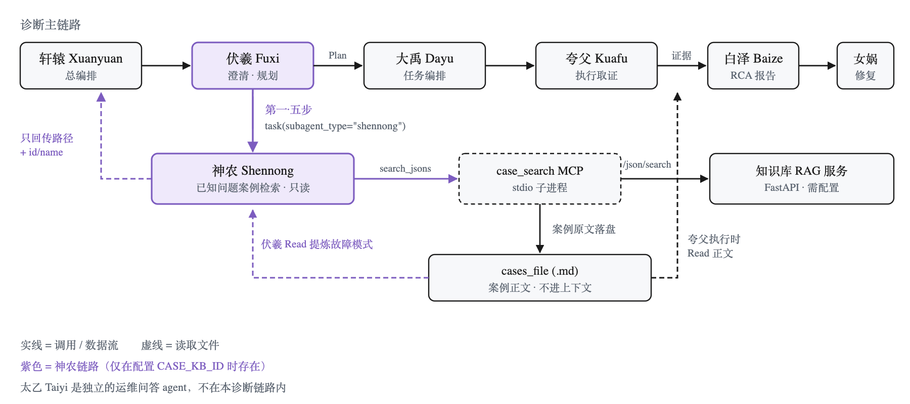
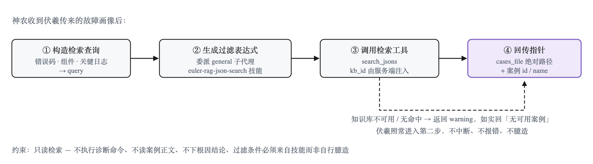

# 神农 Agent：让诊断规划先问一句"这问题以前遇到过吗"

## 概述

在 Witty 诊断流水线中，伏羲（Fuxi）负责把用户模糊的故障描述转化为一份结构化的《诊断排查方案》。但它面临一个天然的局限：**它只能靠推断**。用户说"应用卡顿"，伏羲从常见故障模式里挑出 CPU 冲高、内存不足、磁盘 IO 抖动三个候选——这是合理的推断，但它完全没有利用组织内部已经积累的、被处理过成百上千次的历史案例。

神农（Shennong）就是为填补这个空白而存在的。它挂在伏羲的规划阶段，职责单一到近乎苛刻：**根据故障画像检索知识库中的相似历史案例，把结果回传给伏羲，仅此而已**。它不下根因结论、不设计验证步骤、不执行任何诊断命令，甚至连检索到的案例正文都不读。

本文拆解神农的调用链路、内部工作流、以及它与其余 Agent 的协作边界。

## 背景

### 为什么需要一个独立的检索 Agent

最直接的做法是让伏羲自己去查知识库。但这条路有三个问题：

| 问题 | 表现 | 后果 |
|:---|:---|:---|
| **上下文膨胀** | 命中的历史案例含完整现象、调用栈、错误码、根因，动辄数十 KB JSON | 塞进伏羲上下文后挤占规划本身的空间 |
| **职责混淆** | 伏羲既要推断故障模式，又要构造检索表达式、解析检索结果 | 提示词臃肿，模型容易在两种任务间漂移 |
| **能力污染** | 检索需要调用外部 RAG 服务与专用技能 | 这些能力对不需要检索的场景是纯负担 |

神农的解法是**把检索隔离成一个只读子代理**，并且约定了一条严格的返回契约：只回传**文件路径 + 案例 id/name**，案例正文落盘、不进上下文。

### 设计目标

- **上下文可控**：案例正文永远不经过模型上下文，只传指针。
- **单一职责**：只做"案例关联与检索"，不越界做诊断、根因或修复。
- **来源可信**：结构化过滤条件必须来自专用技能，严禁模型自行臆造字段。
- **优雅降级**：知识库不可用时如实回报，诊断流程照常推进，绝不中断、不编造。
- **完全可选**：未配置知识库时，整条链路对系统不可见，零感知。

## 设计方案

### 神农在诊断链路中的位置



关键在于两条虚线：神农**只回传指针**给伏羲，而案例正文由伏羲（为提炼故障模式）和夸父（执行取证时参考）各自按需从文件读取。这样大 JSON 从不流经任何一个 Agent 的对话上下文。

> **注**：太乙（Taiyi）是独立的运维问答 Agent，走 LightRAG 知识库，与神农的 FastAPI 案例库是两套不同服务，不在本诊断链路内。

### 神农的四步工作流



四步中有两处值得强调：

**第二步的过滤表达式不由神农自己写。** `logical_expression` 必须由一个独立子代理调用 `euler-rag-json-search` 技能生成——该技能了解知识库的字段结构（`name`、`kernel_version` 等）。让模型凭印象手写过滤条件，产出的多半是查不到东西的无效表达式。

**第三步的 `kb_id` 不经过模型。** 它由 MCP 服务端从环境变量注入。模型只能决定"查什么"，不能决定"查哪个库"，凭据也就不会出现在对话里。

### 各 Agent 职责一览

| Agent | 角色 | 职责 | 可见性 |
|:---|:---|:---|:---|
| **轩辕** Xuanyuan | 总编排 | 接收故障描述，驱动澄清→规划→执行→报告→修复全流程 | UI 可见 |
| **伏羲** Fuxi | 澄清与规划 | 补全故障现象与环境信息，生成诊断排查计划（仅写 .md） | UI 可见 |
| **神农** Shennong | 已知问题检索 | 检索历史相似案例，回传案例文件路径与 id/name；只读 | 隐藏 · 需配置 |
| **大禹** Dayu | 任务编排 | 基于 Plan 构建诊断任务集，委派夸父并行执行并汇总 | 隐藏 |
| **夸父** Kuafu | 执行取证 | 逐步执行采集与分析命令，记录证据链 | 隐藏 |
| **白泽** Baize | 报告生成 | 汇总证据链产出 RCA 报告（md / html） | 隐藏 |
| **女娲** Nuwa | 修复建议 | 给出止血、根治、预防三级方案，含风险与回滚 | 隐藏 |
| **太乙** Taiyi | 运维问答 | 检索 LightRAG 知识库带引用作答；*独立 Agent，不在诊断链路内* | UI 可见 |

"隐藏"指该 Agent 不出现在 UI 的 Agent 选择器中，只能被上游通过原生 `task` 工具委派。

### 检索结果如何影响诊断规划

神农的产出不是"事后印证"，而是**证据级输入**，会实质参与伏羲的故障模式集构建：

| 场景 | 历史案例的作用 |
|:---|:---|
| **用户已明确给出故障模式** | 故障模式列表仍以用户为准，知识库不得增删拆分；命中案例只写入对应任务的取证侧重 |
| **仅有故障现象，需假设推断** | **优先用命中案例的历史故障模式组成候选集**，再用常见模式补足，合并去重后仍受 Top 3 上限约束 |
| **与 `fault-model` 关联补齐交叉** | 两者取并集去重，相互印证，不互相删减 |

伏羲会把 `cases_file` 路径与相关案例的 id/name 写进方案第 5 节任务元数据的 `known_issue_refs` 字段，经大禹透传给夸父。夸父执行时先读该文件参考历史案例尝试快速定位，不足时再走常规技能检索流程。

**历史案例始终是参考而非结论**——最终根因必须有本次实际取证支撑。

## 启用与配置

神农是 **opt-in** 的，开关是环境变量 `CASE_KB_ID`。

### 配置项

| 环境变量 | 必填 | 说明 |
|:---|:---|:---|
| `CASE_KB_ID` | **是** | 知识库 ID，同时是整个功能的**总开关**；为空则功能完全关闭 |
| `CASE_API_BASE_URL` | 建议 | RAG 服务地址，缺省 `http://127.0.0.1:8000` |
| `CASE_ACCESS_KEY` | 否 | 服务需鉴权时作为 `access_key` 请求头发送 |
| `CASE_API_TIMEOUT_MS` | 否 | 单次请求超时，缺省 15000 |
| `CASE_TOP_K` | 否 | 检索返回案例数上限，缺省 5 |
| `CASE_CASES_DIR` | 否 | 案例落盘目录，缺省 `~/.witty-diagnosis-agent/shennong/cases` |

此外，配置文件中的 `disabled_mcps: ["case_search"]` 可强制关闭本功能。

### 配置与不配置的区别

| 维度 | 未配置 `CASE_KB_ID` | 已配置 |
|:---|:---|:---|
| Agent 数量 | 7 个 | 8 个（+神农，隐藏） |
| `case_search` MCP | 不注册，不拉起子进程 | 注册，stdio 拉起 |
| `euler-rag-json-search` 技能 | **不暴露** | 暴露到 `.opencode/skills/` |
| 伏羲提示词 | 无任何神农痕迹 | 注入第一·五步、强制门禁、Kuafu 交接段等 |
| 伏羲行为 | 原诊断流程，不知有知识库 | 分类后必须先调神农检索再进入下一步 |

四层门控（Agent 注册 / MCP 注册 / 技能暴露 / 提示词注入）共用同一个判定，同进同退。**未配置时该功能在系统中完全不存在**，模型看不到神农、看不到检索工具、也看不到那个技能。

### 配置方式

这两个是**进程环境变量**，必须能被启动 opencode 的 shell 读到：

```bash
export CASE_KB_ID=<your-kb-id>
export CASE_API_BASE_URL=http://<host>:<port>
```

推荐写入 `~/.bashrc` 或 `~/.zshrc` 后新开终端再启动 opencode。

> **注意**：写进 `opencode.json` **无效**——顶层没有 env 注入字段。运行中修改环境变量对已启动实例无效，需重启 opencode。

### 验证是否生效

```bash
ls .opencode/skills/ | grep euler-rag
```

有输出即表示技能门控已放行，说明插件确实读到了 `CASE_KB_ID`。

> **一个已知取舍**：只配 `CASE_KB_ID` 而不配 `CASE_API_BASE_URL` 时，功能会正常启用，但请求会打到默认的 `127.0.0.1:8000`。若该地址无服务，神农每次都返回"知识库不可用"并降级——**不报错、不中断**，但功能等同未启用，且每轮规划会多一次子代理开销。部署在远端 RAG 服务时，两个变量都要配。

## 约束边界

神农受以下系统级约束，不可被用户请求覆盖：

1. **只读检索，不做执行**：除调用 `search_jsons` 与委派检索技能外，不执行任何诊断/修复命令。
2. **过滤条件来源唯一**：`logical_expression` 必须来自 `euler-rag-json-search` 技能，严禁自行手写或猜测字段。
3. **不臆造案例**：检索为空就是空，严禁虚构知识库中不存在的案例。
4. **不下根因结论**：只提供"相关案例参考"，根因判定属于后续阶段。
5. **不读案例正文**：只转发 `cases_file` 路径与案例 id/name，正文交由伏羲与夸父按需读取。

## 相关文档

- [诊断 Agent 定义](../../agents/diagnosis-agent.md)
- [witty-diagnosis-agent 架构设计](./witty-diagnosis-agent-architecture-design.md)
- [故障模型 Agent](./fault-model-agent.md)
