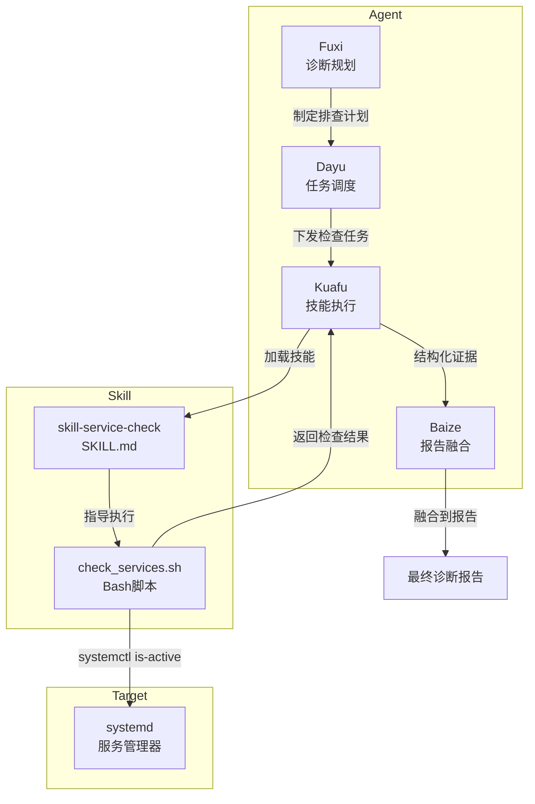
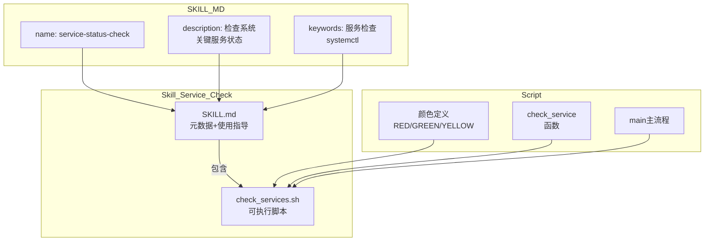
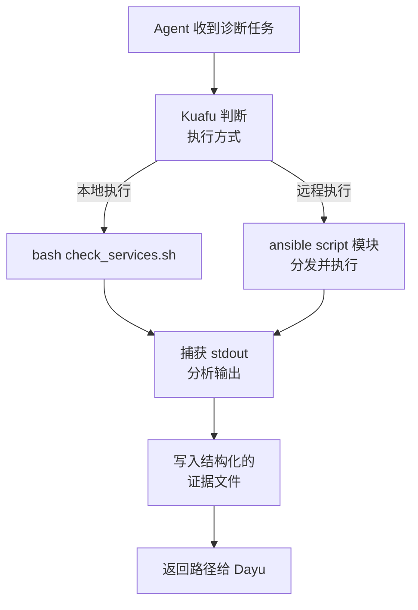

# 系统服务状态检查：一个 Agent 的诊断第一站

## 概述

当系统出现故障时，Agent 的第一反应不是扎进日志海，而是问一个最朴素的问题：**"服务还活着吗？"**。`skill-service-check` 正是为此而生——它是 Witty 诊断 Agent 技能体系中最为轻量也最为前置的一个技能，职责单一却至关重要：快速摸清目标主机的系统服务健康状况，为后续的深度排查提供第一手基础信息。

与其他深度分析型技能（如 OOM 分析、VMCore 分析）不同，这个技能不追求"挖地三尺"，而是追求"一眼看清全局"。如果把一次故障诊断比作一场战役，那么服务状态检查就是战役打响前的**战场态势感知**——先看清哪里冒烟了，再决定派哪支部队。

## 背景

### 痛点分析

在 Agent 的实际诊断工作中，我们反复面对同一个困境：每一次故障诊断的起始阶段都充斥着信息盲区。

当用户提交一句"系统好像出问题了"时，Agent 面对的是一个黑盒。我们不知道：

- SSH 是否还活着（能不能连上去）
- 数据库是否已崩溃（应用报错是因为 DB down 了）
- Nginx 是否在正常服务（前端 502 是因为服务挂了还是配置错了）
- Docker 守护进程是否还在运行（容器化应用的底层依赖是否正常）

传统的做法是什么？运维人员 SSH 登上去，手动敲 `systemctl status` 逐个检查，或者写一个定制化的监控脚本。但在 Agent 的工作场景中，我们没有"人工登机"这个选项，我们需要的是**程序化、可重复、标准化的服务探查手段**。

更重要的是，这个探查不能太重。如果每次诊断都先启动一套 Prometheus + Grafana 级别的监控采集，光部署时间就够故障蔓延到不可收拾了。我们需要的是"从零到一"的快速起步能力。

### 设计目标

基于上述痛点，这套技能的设计目标清晰而克制：

- **零依赖**：在任何 Linux 系统上直接运行，不需要 Python 运行时、不需要安装额外的包
- **秒级响应**：整个检查流程应在 1-2 秒内完成，不成为诊断管道的瓶颈
- **信号明确**：输出结果一眼可辨——绿色是健康、红色是异常、黄色是未安装
- **目标机导向**：不仅要能在本机执行，更要能通过 Ansible 在远端目标机上执行

## 设计解决方案

### 整体架构

`skill-service-check` 不是孤立运行的脚本，它是 Witty 诊断 Agent **Multi-Agent 管道中的一个标准化环节**。技能本身只封装"做什么"（执行 systemctl 检查），而"何时做、在哪做、做完后怎么办"则由 Agent 层解决。



### 为什么选择 Bash 脚本？

这是一个关键的设计决策。在 Witty 的技能体系中，大部分深度诊断技能采用 Python 实现（如 `disk-health-diagnosis/smart_diagnosis.py`），但 `skill-service-check` 坚持使用纯 Bash。原因有三：

**1. 最小化启动开销**

当 Agent 需要检查服务状态时，通常处于诊断管道的**最前端**。此时每一毫秒的延迟都会连锁放大到后续所有环节。Python 脚本需要解释器启动时间（~50-100ms）、依赖导入时间，而 Bash 的启动开销是微秒级的。

> **Note:** 启动时间数据基于典型 Linux 环境实测估算，具体数值因硬件和操作系统版本可能有所差异。

**2. 零依赖约束**

诊断场景中，Agent 可能面对各种"残缺"环境——没有 Python、没有 Perl、没有 `pip`、甚至没有 `/tmp` 写入权限。但 `bash` 和 `systemctl` 是所有 systemd Linux 发行版（CentOS 7+/Ubuntu 16.04+/openEuler/等）的标配。用 Bash 实现意味着**在任何目标机上都能跑**，不需要前置条件。

> **Note:** 这一设计假设目标机使用 systemd 作为 init 系统。对于使用 SysV init、Upstart 或其他 init 系统的老旧发行版，此技能需要适配。

**3. 输出即结果，无需二次解析**

Bash 脚本直接通过 `echo -e` 输出带颜色的状态文本，Agent（Kuafu）只需捕获 stdout 即可获取完整检查结果。不需要 JSON 序列化、不需要解析 XML、不需要理解复杂的数据结构。这种"输出即结果"的模式在诊断管道的前置环节中极大地降低了认知负载。

### 为什么作为 OpenCode Skill？

这是一个有趣的问题：为什么不直接把 `systemctl status` 命令写到 Agent 的系统提示词里，而是要多一层 SKILL.md 的封装？

答案在于 Witty 的**技能架构设计原则**。如图所示：



SKILL.md 的 YAML 元数据（name、description、keywords）使得技能可以被 Agent 系统自动发现、索引和按需加载。这意味着：

- Agent 不需要在系统提示词中硬编码每一种技能的知识
- 技能可以独立迭代版本，不影响 Agent 核心
- 用户可以新增自定义技能，Agent 自动感知

**这是一种"知识即代码"的封装哲学**——每一份专家经验（即使简单如"检查服务"）都被标准化为可发现、可加载、可执行的技能单元。

### 扩展性设计

尽管当前技能只检查 6 个默认服务（sshd、network、docker、nginx、mysql、postgresql），但其执行路径天然支持扩展：

- **任意服务名**：脚本接受用户自定义参数，`./check_services.sh <service1> <service2>`，不限于默认列表
- **新增服务**：在 `DEFAULT_SERVICES` 数组中追加即可，代码无需结构性修改
- **Ansible 集成**：通过 Kuafu 的远程执行机制，同一脚本可直接在远端目标机上执行

## 实现原理

### 核心流程

从 Agent 的视角来看，一次完整的服务状态检查经历以下 6 个步骤：



### 关键代码实现

脚本的核心逻辑集中在 `check_service` 函数中，仅 13 行却涵盖了三种状态的精确判定：

```bash
check_service() {
    local service=$1
    if systemctl list-unit-files | grep -q "^${service}.service"; then
        local status=$(systemctl is-active $service 2>/dev/null)
        if [ "$status" = "active" ]; then
            echo -e "${GREEN}✓ $service: 运行中${NC}"
        else
            echo -e "${RED}✗ $service: $status${NC}"
        fi
    else
        echo -e "${YELLOW}? $service: 未安装${NC}"
    fi
}
```

**为什么设计为三步判定而不是简单调用 `systemctl is-active`？**

| 步骤 | 命令 | 判定逻辑 | 设计意图 |
|:---:|:---|:---|:---|
| 1 | `systemctl list-unit-files` | 是否存在对应的 `.service` 单元文件 | 区分"服务未安装"和"已安装但挂了"，提供更精准的排查方向 |
| 2 | `systemctl is-active` | 服务的当前活跃状态 | 获取真实运行状态（active/inactive/failed/activating等） |
| 3 | 综合判定 | 单元存在 + 活跃 = 健康；单元存在 + 非活跃 = 异常；单元不存在 = 未安装 | 三态输出，每种状态对应不同的后续行动建议 |

### 颜色编码设计

脚本定义了四种颜色，每种颜色对应一种诊断信号：

| 颜色 | 用途 | 含义 | Agent 决策 |
|:---:|:---|:---|:---|
| `RED` | `✗ 服务: 异常状态` | 服务已安装但不在运行 | 需要深入排查该服务 |
| `GREEN` | `✓ 服务: 运行中` | 服务健康 | 排除此服务作为嫌疑对象 |
| `YELLOW` | `? 服务: 未安装` | 服务未安装 | 非故障，但提示环境差异 |
| `BLUE` | 标题/框架文字 | 信息框架 | 分隔输出，提升可读性 |

这种颜色编码不只是为了"好看"。对于 Agent 而言，彩色输出提供了**视觉化信号压缩**——Kuafu 在解析输出时，可以通过匹配 `✓/✗/?` 三个符号快速定位异常服务，而不需要逐行解析文本。

### 远程执行设计

服务检查最典型的场景是在**远端目标机**上执行。Witty 的诊断 Agent 采用 Ansible 的 `script` 模块来实现远程执行（Source: `src/agents/kuafu/agent.ts:39-48`）：

```shell
ansible -i ~/.witty-diagnosis-agent/ansible/hosts.ini <组名> -m script -a "<本地脚本路径>"
```

**为什么是 Ansible script 模块而不是 SSH 直连？**

| 方案 | 优势 | 劣势 |
|:---|:---|:---|
| SSH 直连 `ssh user@host "systemctl status..."` | 简单直接 | 需处理密钥管理、主机验证、多主机并发复杂 |
| Ansible script 模块 | 统一的 inventory 管理、内置错误处理、支持批量执行 | 需安装 Ansible、有学习成本 |
| Agent 内置 SSH 库 | 编程可控 | 引入额外依赖，安全性需自行保障 |

Witty 选择 Ansible 模块，核心考虑是**生态复用**——运维环境通常已有 Ansible 的 inventory 配置，Agent 不需要重新发明一套远程执行机制。这也是 Witty"不重复造轮子"设计哲学的一个体现。

### 边界条件处理

脚本中隐藏着几个值得关注的边界处理逻辑：

1. **stderr 吞没**：`systemctl is-active $service 2>/dev/null` —— 当命令本身出错时（如权限不足），错误信息被丢弃，返回空字符串。此时脚本会将其判定为"异常状态"而非"未安装"。这意味着：如果 Agent 没有 root 权限，所有需要提权才能查询的服务都会显示 `✗`。这是有意为之——**宁可误报不可漏报**。

2. **服务名精确匹配**：`grep -q "^${service}.service"` —— 使用 `^` 进行行首精确匹配，防止 `docker.service` 匹配到 `docker-compose-install.service` 这类子串碰撞。但这也意味着如果服务文件命名不规范（如 `docker-install.service` 的实际文件是 `docker-install@.service`），会匹配失败导致误判为"未安装"。

3. **无超时保护**：脚本本身没有超时机制。如果 `systemctl is-active` 因为某些原因挂起（如 systemd D-Bus 死锁），脚本也会被阻塞。在实际诊断中，这个超时保护由调用方 Kuafu Agent 的 Tool 超时机制提供，而非脚本自身。

## 权衡

### 简单 vs 深度

**选择**：`skill-service-check` 选择了极致的简单性，只做 `systemctl is-active` 的表面检查。

**放弃**：它不做：

- 服务的资源消耗分析（CPU/内存）
- 服务的日志错误扫描
- 服务的配置正确性校验
- 服务之间的依赖链分析

**为什么放弃**：因为**职责分离**。深度分析应该由其他专用技能完成。服务检查只是"冒烟测试"，它的输出价值在于为后续的深入排查提供方向指引，而不是给出最终答案。

### 通用性 vs 精确性

**选择**：使用 `systemctl` 这一 Linux 系统服务的标准接口。

**放弃**：对非 systemd 系统（如 `init.d`、`upstart`）的兼容。

**权衡结果**：鉴于现代 Linux 发行版已全面迁移到 systemd，放弃对旧 init 系统的兼容是一个务实的决定。覆盖 95% 的现代环境，而不是为了 5% 的遗产系统引入复杂性。

### 颜色编码 vs 结构化输出

**选择**：输出是人类友好的 ANSI 彩色文本（`✓/✗/?` + 颜色）。

**放弃**：输出是机器友好的 JSON/YAML 结构化数据（`{"service":"sshd","status":"active"}`）。

**为什么放弃**：因为这个技能的主要消费者**既是人类又是 Agent**。在诊断管道的早期阶段，人类运维人员需要快速阅读和理解输出；而 Agent（Kuafu）同样可以通过颜色符号的正则匹配来解析状态。彩色文本是同时满足两种消费者的最佳性价比方案。

## 使用指南

### 作为 Agent 的使用者（你告诉 Agent 做什么）

在 Witty 诊断 Agent 中，你不需要手动运行这个脚本。当你描述一个系统问题时，Agent 会自动判断是否需要执行服务状态检查。

**场景示例：**

```text
用户: "我的应用连不上数据库了，帮我查查问题"
```

Agent 的诊断管道会：

1. **Fuxi** 规划任务时，将"检查目标主机的系统关键服务状态"列为第一优先级
2. **Dayu** 将检查任务下发给 Kuafu
3. **Kuafu** 加载 `skill-service-check`，在目标机上执行
4. **Baize** 在最终报告中说：
   - "检查发现：MySQL 服务未运行（状态: inactive），Nginx 和 SSH 正常。建议优先排查 MySQL 异常停止的原因。"

### 作为技能的直接使用者（命令行）

如果你在调试或测试，也可以直接使用脚本：

```bash
# 检查所有默认关键服务
./skills/skill-service-check/scripts/check_services.sh

# 检查指定服务
./skills/skill-service-check/scripts/check_services.sh sshd nginx

# 查看帮助
./skills/skill-service-check/scripts/check_services.sh --help
```

### 自定义检查列表

编辑 `check_services.sh`，修改 `DEFAULT_SERVICES` 数组：

```bash
DEFAULT_SERVICES=("sshd" "network" "docker" "nginx" "mysql" "postgresql" "redis" "kubelet")
```

### 在诊断管道中的位置（技术细节）

| 阶段 | 角色 | 与本技能的关系 |
|:---|:---|:---|
| Phase 0: 故障报告 | 用户 | 描述系统异常现象 |
| Phase 1: 规划 (Fuxi) | 诊断规划 Agent | 将"服务状态检查"列为前置预检步骤 |
| Phase 2: 调度 (Dayu) | 任务调度 Agent | 将检查任务分发给 Kuafu，提供目标主机信息 |
| Phase 3: 执行 (Kuafu) | 执行 Agent | **实际加载并执行此技能**，收集证据 |
| Phase 4: 融合 (Baize) | 报告 Agent | 将检查结果融入最终诊断报告 |

## 总结

`skill-service-check` 是 Witty 诊断 Agent 技能体系中理念最朴素、实现最简洁的一个技能。它的价值不在于"有多深"，而在于"有多快"、"有多可靠"、"有多通用"。

回看设计的核心选择：

- **Bash 而非 Python**：零依赖、微秒级启动，确保在任意残缺环境中都能运行
- **systemctl 而非定制化采集**：复用系统标准接口，不做 Agent 自己的"监控替身"
- **彩色文本而非 JSON**：同时服务人类阅读和 Agent 解析，最佳性价比
- **SKILL.md 封装而非硬编码**：技能可发现、可加载、可迭代，遵循 Witty 的四层架构

这背后体现的设计哲学是：**在诊断管道的最前端，确定性比信息量更重要**。一个 66 行的 Bash 脚本，用 13 行核心逻辑回答了诊断中最基础、最关键的问题——"服务还活着吗？"——并为后续所有深度分析提供了可靠的起点。

对于 AI Agent 而言，这不仅是"一个脚本"，更是一种诊断思维的原点：**在深入复杂系统之前，先确认最基础的前提是否成立**。这既是运维的常识，也是诊断 Agent 的第一课。
