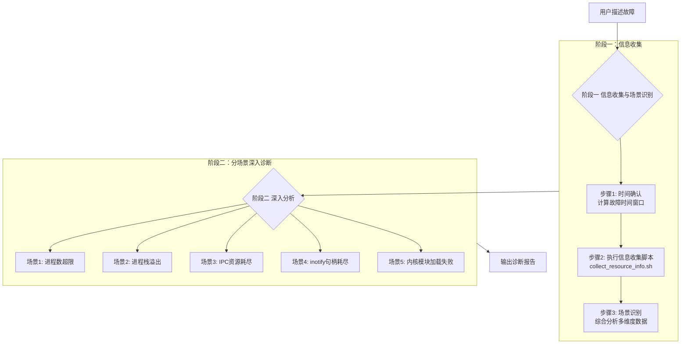
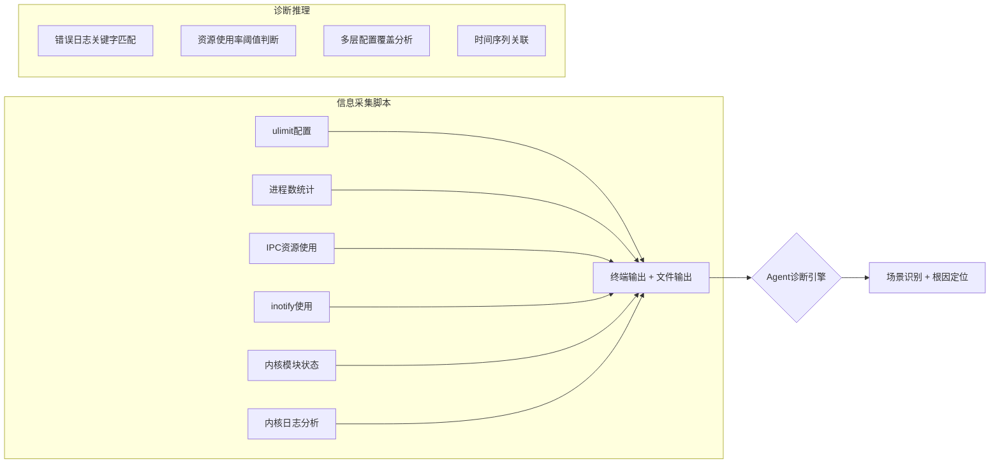

# 系统资源诊断 Agent：当 AI 学会解读 Linux 资源的"暗号"

## 概述

设想这样一个场景：生产环境告警突然响起，你的应用无法创建新进程、文件监控失效、SIGSEGV 崩溃接踵而至。你 SSH 上机器，`dmesg` 里有 "Resource temporarily unavailable"，或者 "fork failed"。但你面对的是几十个 ulimit 参数、数百个内核参数、一堆正在运行的进程——哪个才是罪魁祸首？

本文拆解的，是 Witty 智能诊断 Agent 中的 **system-resource-diagnosis Skill**——一个让 AI Agent 能够在 Linux 系统资源层面"像资深系统工程师一样思考"的结构化诊断方法。我们将从 Agent 的视角，深入分析它如何做到：一句"进程 fork 失败了"，就自动走完一套从信息收集、场景识别到根因定位的完整排查链路。

## 一、背景：为什么系统资源诊断这么难？

### 1.1 问题的多层复杂性

Linux 系统资源管理涉及多个层级：用户级 ulimit、内核参数、服务级资源配额、cgroup 限制。这些限制之间存在复杂的优先级和覆盖关系。一次 fork 失败，可能是：

| 层级 | 典型根因 | 现象 |
|------|----------|------|
| ulimit 用户限制 | `max user processes` 过小 | fork 返回 EAGAIN |
| 内核参数 | `pid_max` 达到上限 | 系统级无法创建新进程 |
| 服务配置 | systemd `LimitNPROC` 覆盖 | 特定服务启动不了 |
| IPC 资源 | 信号量/消息队列/共享内存耗尽 | `No space left on device`（非磁盘） |
| inotify 句柄 | `max_user_watches` 用完 | 文件监控/热重载失效 |
| 内核模块 | `modules_disabled` = 1 | insmod/modprobe 失败 |

**传统的排查方式是怎样的？**

- 工程师凭经验依次执行 `ulimit -a`、`ps`、`ipcs`、`sysctl` 等命令
- 漫无目的地 grep `/var/log/messages`，希望找到关键线索
- 每次检查一个维度，然后靠人工把各个维度的数据关联起来
- 整个过程严重依赖个人经验，新手可能花数小时

### 1.2 为什么需要一个 Agent 来做这件事

核心矛盾在于：**资源限制故障涉及面广，但故障窗口期极短**。进程数暴涨可能几分钟就回落，IPC 资源可能被重启释放，dmesg 环形缓冲区随时可能被新日志覆盖。

一个结构化的 Agent Skill 要解决的正是：

1. **多维度并行采集**：不再靠一个个命令手动执行，而是自动化采集所有资源维度的信息
2. **场景自动路由**：基于错误关键字，自动识别故障场景，走对应的分析路径
3. **证据驱动诊断**：每个结论都有多个数据源交叉印证，而非单一指标
4. **时间线锚定**：所有分析基于故障时间窗口，避免分析海量无关数据

## 二、设计思路：Agent 是如何"思考"的？

### 2.1 总体架构：两阶段渐进式诊断

system-resource-diagnosis 采用 **两阶段渐进式诊断架构**，对应 Agent 的两个思考阶段：



**设计哲学**：第一阶段是"全身体检"——一次性采集所有维度的数据，不做方向假设。第二阶段是"定向深挖"——根据第一阶段发现的问题，进入对应场景做深入取证。这种设计避免了传统排查中"猜方向 → 走到黑 → 回溯 → 重新猜"的低效模式。

### 2.2 关键设计之一：时间窗口精准锚定

这是 Skill 最核心的设计决策之一。绝大多数系统资源问题都与时间相关——是在特定负载高峰发生的，还是在某个部署变更后出现的。没有时间锚点，分析将面对海量日志无从下手。

**为什么不直接扫全量日志？**

- `journalctl`/`dmesg` 的输出可能包含数万行，直接全量扫描效率极低
- Agent 的时间理解能力可以解析"今天下午 14:30"这类自然语言描述
- 时间窗口缩小后，大大降低了日志分析的信噪比，提升诊断准确性

Agent 根据用户描述自动计算时间窗口：

| 用户描述 | 时间窗口 |
|---------|---------|
| "下午 14:30 左右" | `[14:25, 14:35+持续时间]` |
| "刚才/刚刚" | `[当前时间-30min, 当前时间]` |
| "间歇性发生" | `[当前时间-2h, 当前时间]` |
| 无法确定 | `[当前时间-1h, 当前时间]` |

### 2.3 关键设计之二：信息采集与诊断分离

另一个重要的设计决策是：**脚本只负责采集和初步标记，Agent 负责综合诊断**。



**为什么这样设计？**

1. **职责分离**：脚本输出原始数据 + 初步标记（`⚠️ 进程数接近上限`），Agent 综合分析得出结论。如果脚本承担过多诊断逻辑，变更场景需要改脚本；如果 Agent 从零分析原始数据，效率低下。
2. **中间输出可检验**：脚本的完整输出保存到 `/tmp/resource_diag_*/`，用户可以复查 Agent 的判断依据。
3. **降级可用**：即使 Agent 推理能力有限，输出的初步标记（如 `⚠️ stack size 限制较小`）也对人工排查有参考价值。

### 2.4 关键设计之三：组合场景识别

实际运维中，系统资源故障很少是单一原因。一个进程泄漏可能同时导致进程数超限和 IPC 资源耗尽；inotify 句柄耗尽可能伴随文件描述符泄漏。

Skill 的设计者为此设计了一个 **现象 → 场景映射矩阵**：

| 现象组合 | 可能场景 | 分析方向 |
|---------|---------|---------|
| fork 失败 + 进程数接近 ulimit | 进程数超限 | 检查进程泄漏、调整 ulimit |
| SIGSEGV + 栈限制较小 | 进程栈溢出 | 增大栈限制、优化递归 |
| IPC 调用失败 + IPC 资源达上限 | IPC 资源耗尽 | 清理泄漏资源、调整内核参数 |
| inotify 失败 + udev/rsyslog 异常 | inotify 句柄耗尽 | 调整 inotify 上限、优化监控 |
| insmod 失败 + modules_disabled=1 | 模块加载被禁用 | 检查内核安全配置 |

**Agent 的识别策略**：先看错误日志关键字 → 再看资源使用率 → 最后检查配置限制。三个步骤逐层递进，确保场景识别的准确性。

## 三、实现原理：Agent 是如何一步步诊断的？

### 3.1 第一阶段：信息收集与场景识别

#### 步骤 1：时间确认

当用户说"今天下午 14:30 开始，我的应用时不时 fork 失败"时，Agent 内部发生了什么？

1. **时间解析**：提取 `14:30` 作为参考时间点
2. **时间窗口计算**：`[14:25, 15:30]`（参考时间前 5 分钟 + 预计持续时间 + 额外 5 分钟）
3. **格式化参数**：`-S "2026-06-02 14:25:00" -E "2026-06-02 15:30:00"`

Agent 不会询问"请告诉我故障的准确开始和结束时间"。它提取对话中已有的时间信息，自动填充参数，仅在完全没有时间信息时才询问。

#### 步骤 2：执行信息收集脚本

脚本 `collect_resource_info.sh` 是核心信息采集工具，它一次性收集 7 个维度的数据：

| Section | 内容 | 输出方式 |
|---------|------|---------|
| 1 | ulimit 配置与诊断 | 终端 |
| 2 | 进程数统计与诊断 | 终端 |
| 3 | 栈限制与 core dump | 终端 |
| 4 | IPC 资源使用（消息队列/共享内存/信号量） | 终端 + 文件 |
| 5 | inotify 使用情况（实例数/监控点数） | 终端 + 文件 |
| 6 | 内核模块状态 | 终端 + 文件 |
| 7 | 内核日志分析（时间段过滤） | 终端 + 文件 |

**脚本的设计亮点：**

**亮点 1：`cmd_info` 元数据**

每一条关键命令前都有 `cmd_info` 说明，帮助 Agent 理解输出的用途和含义：

```bash
cmd_info "ps -eo user | sort | uniq -c | sort -rn" \
    "统计各用户的进程数量" \
    "找出进程数最多的用户，与 ulimit -u 对比"
```

> **Note:** 这与 linux-oom-analyzer Skill 的 cmd_info 模式一致，是 Witty Diagnosis Agent 系列 Skill 的共同设计模式，用于辅助 Agent 理解命令输出。

**亮点 2：嵌入式诊断标记**

脚本不仅仅是数据采集器——它内置了初步诊断逻辑，用 emoji 标记为 Agent 提供快速预判：

```bash
# 进程数使用率诊断
if [ "$(echo "$USAGE_RATIO > 90" | bc 2>/dev/null)" = "1" ]; then
    echo "⚠️  进程数接近 ulimit 上限，可能导致 fork 失败"
elif [ "$(echo "$USAGE_RATIO > 70" | bc 2>/dev/null)" = "1" ]; then
    echo "⚠️  进程数使用率较高，需关注"
else
    echo "✅ 进程数使用正常"
fi
```

```bash
# inotify 监控点诊断
if [ "$(echo "$WATCH_USAGE > 90" | bc 2>/dev/null)" = "1" ]; then
    echo "⚠️  CRITICAL: inotify 监控点 (Watches) 已接近或达到上限！"
    echo "    >>> 这会导致 tail -f 失败、IDE 热重载失效或文件同步中断。"
fi
```

这些标记让 Agent 可以"一目十行"地扫过脚本输出，快速定位问题区域，再按需回溯源数据。

**亮点 3：大量数据的文件分流**

- 终端输出：ulimit 配置、进程数统计、IPC 资源统计、inotify 使用、关键异常提示——这些是诊断的核心摘要，直接展示
- 文件输出：完整内核日志（`dmesg_full.txt`）、IPC 限制详情（`ipc_limits.txt`）、完整模块列表（`lsmod_full.txt`）——这些是海量原始数据，供 Agent 按需查阅

这种设计避免了终端输出过于冗长，同时保留了原始数据供深度分析。

#### 步骤 3：场景识别

脚本执行完毕后，Agent 综合分析各维度数据，识别故障场景。识别策略是**三层递进**：

```text
第一层：看错误日志
  → "Resource temporarily unavailable" → 关注进程数限制
  → "Segmentation fault" / "SIGSEGV" → 关注进程栈溢出
  → "No space left on device" (非磁盘) → 关注 IPC 资源
  → "inotify add watch failed" → 关注 inotify 句柄
  → "Could not insert module" → 关注内核模块加载

第二层：看资源使用率
  → 进程数 / ulimit -u > 90% → 进程数超限
  → IPC 资源 / 内核参数上限 > 90% → IPC 资源耗尽
  → inotify 使用量 / 上限 > 90% → inotify 句柄耗尽

第三层：检查配置限制
  → ulimit 配置是否合理
  → 内核参数是否需要调整
  → 服务级配置是否覆盖系统配置
```

Agent 输出场景识别结果：

```text
识别场景：场景 1 - 进程数超 ulimit 限制
判断依据：
  - 线索1: 内核日志搜索到 "Resource temporarily unavailable"
  - 线索2: 当前用户进程使用率 97.5%
  - 线索3: ulimit -u = 4096，符合默认配置但偏低
  - 综合判断: 进程数接近上限，新增进程 fork 失败
```

### 3.2 第二阶段：分场景深入分析

#### 场景 1：进程数超 ulimit 限制

这是最常见的系统资源故障之一。Agent 的分析路径：

1. **查看进程数统计**（Section 2）
   - 当前用户进程数是否接近 `max user processes` 限制
   - 哪些用户进程数最多

2. **查看 ulimit 配置**（Section 1）
   - 当前用户的 `ulimit -u` 限制值
   - 是否有服务级配置覆盖（`/etc/security/limits.conf`、`limits.d/`）

3. **查看内核日志**（Section 7）
   - 搜索 `Resource temporarily unavailable`
   - 搜索 `fork` 相关错误

**Agent 的诊断逻辑**：

| 配置状态 | 诊断结论 | 修复建议 |
|---------|---------|---------|
| 进程数 = ulimit -u | 已达上限 | 检查进程泄漏、增大 ulimit |
| ulimit -u 过小 | 限制过严 | 调整 /etc/security/limits.conf |
| 服务级 LimitNPROC 覆盖 | 服务配置限制 | 调整服务配置文件 |

**深入取证命令**（Agent 按需执行）：

```bash
# 查看进程树关系
pstree -p -s <pid>

# 检查僵尸进程
ps -eo pid,ppid,stat,cmd | awk '$3 ~ /Z/ {print}'
```

#### 场景 2：进程栈溢出

栈溢出通常表现为 SIGSEGV 或 Segmentation fault。Agent 的分析路径：

1. **查看栈限制配置**（Section 3）
   - `stack size` 限制值
   - 是否有进程触发 SIGSEGV

2. **查看 core dump 信息**（Section 4）
   - Core dump 文件是否存在
   - Core pattern 配置指向哪里

3. **查看内核日志**（Section 7.5）
   - 搜索 `Segmentation fault`

**Agent 的诊断逻辑**：

```text
摘要诊断（脚本内置）：
stack size (KB): 8192 → 正常
Core dump 限制: unlimited → 正常

深入分析（Agent 执行）：
- 搜索 dmesg 中 SIGSEGV 记录 → 发现 PID 12345 触发段错误
- 检查 PID 12345 的状态 → /proc/12345/status 已不可用（进程已退出）
- 回退到日志搜索 → journalctl 中搜索 12345 的历史记录
```

#### 场景 3：IPC 资源耗尽

IPC 资源包括消息队列、共享内存和信号量。Agent 的诊断路径：

1. **查看 IPC 资源使用**（Section 4）
   - 消息队列 `msgmni`：当前数 vs 上限
   - 共享内存 `shmmni`：当前数 vs 上限
   - 信号量 `semmni`：当前数 vs 上限

2. **查看 IPC 资源详情**（输出目录 `ipc_details.txt`）
   - 哪些进程占用了 IPC 资源
   - 资源创建时间和权限

3. **查看内核日志**（Section 7）
   - 搜索 `No space left on device`（IPC 场景）

**脚本中的诊断计算**：

```bash
# 信号量使用率计算
SEM_COUNT=$(ipcs -s 2>/dev/null | wc -l)
SEM_MAX=$(cat /proc/sys/kernel/semmni 2>/dev/null)
SEM_USAGE=$(echo "scale=2; ($SEM_COUNT - 3) * 100 / $SEM_MAX" | bc 2>/dev/null)

if [ "$(echo "$SEM_USAGE > 90" | bc 2>/dev/null)" = "1" ]; then
    echo "⚠️  信号量接近上限"
fi
```

#### 场景 4：inotify 句柄耗尽

inotify 是现代 Linux 文件监控的基础机制（`tail -f`、IDE 热重载、systemd 监控等都需要它）。Agent 的诊断路径：

1. **查看 inotify 使用情况**（Section 5）
   - `max_user_instances`：当前 inotify 实例数 vs 上限
   - `max_user_watches`：当前监控点数 vs 上限

2. **查看 inotify 详情**（输出目录 `inotify_details.txt`）
   - 哪些进程占用了大量 inotify 实例

3. **检查受影响服务**
   - udev 服务状态（依赖 inotify）
   - rsyslog 服务状态（依赖 inotify）

**脚本中的 inotify 统计**——一个巧妙的技术实现：

```bash
# 统计实例数：通过 /proc/*/fd 符号链接
find /proc/*/fd -lname "anon_inode:inotify" 2>/dev/null | wc -l

# 统计监控点数：通过 /proc/*/fdinfo 内容  
find /proc/*/fdinfo/ -type f 2>/dev/null | xargs grep -s 'inotify' | wc -l

# 找出使用 inotify 最多的进程
for pid in $(ps -eo pid --no-headers | head -200); do
    if [ -d "/proc/$pid/fd" ]; then
        inotify_cnt=$(ls -la /proc/$pid/fd 2>/dev/null | grep inotify | wc -l)
        if [ "$inotify_cnt" -gt 0 ]; then
            comm=$(cat /proc/$pid/comm 2>/dev/null)
            echo "$inotify_cnt $pid $comm"
        fi
    fi
done
```

这里的关键是使用 `/proc` 文件系统来获取 inotify 使用情况，而不是依赖专门的工具。**为什么用 `/proc` 而不是某个命令？**

- `lsof` 等工具可能未安装
- `/proc` 是所有 Linux 系统都支持的伪文件系统
- 通过遍历每个进程的 fd 目录，可以精确定位占用 inotify 的进程

#### 场景 5：内核模块加载失败

当用户报告 `insmod`/`modprobe` 失败时，Agent 的诊断路径：

1. **查看模块加载配置**（Section 6）
   - `modules_disabled` 是否为 1

2. **查看内核日志**（Section 7.6）
   - 搜索 `Could not insert module`
   - 搜索 `Module already exists`
   - 搜索 `modules_disabled`

**Agent 的诊断逻辑**：

```text
摘要诊断（脚本内置）：
modules_disabled: 0 → 模块加载未禁用 ✅
已加载模块数: 145

深入分析（Agent 执行）：
- 搜索 dmesg 发现 "Could not insert module xxx: Unknown symbol"
- 检查模块依赖：modprobe --show-depends xxx
- 发现缺失依赖模块 → 需先加载依赖
```

### 3.3 诊断报告输出

完成所有分析后，Agent 输出标准化的诊断报告，包含：

```text
# 系统资源故障诊断报告

## 基本信息
- 诊断时间：2026-06-02 15:30:00
- 故障时间窗口：2026-06-02 14:25:00 ~ 2026-06-02 15:30:00
- 严重级别：P2

## 问题确认
**报错信息**：Resource temporarily unavailable
**影响范围**：用户 app 下的应用进程
**复现方式**：高并发请求触发

## 场景识别结果
**识别场景**：场景 1 - 进程数超 ulimit 限制
**判断依据**：
- 进程数使用率: 97.5%（3890/4096）
- 内核日志: "Resource temporarily unavailable" 出现 12 次
- ulimit -u: 4096（默认配置）

## 深入分析
**分析过程**：
- app 用户进程数 3890，接近上限 4096
- 主要消耗来自 Tomcat 实例（PID 12345~12355），每个实例创建约 350 个线程
- ulimit -u 为系统默认值 4096，对高并发应用偏低

**关键证据**：
1. ps 统计显示 app 用户进程占比 89%
2. dmesg 确认 fork 失败日志
3. /etc/security/limits.conf 无自定义配置

## 故障结论
**根因描述**：应用并发线程数超过系统默认 ulimit -u (4096) 限制
**置信度**：高

## 修复建议
### 临时措施
1. 增大 ulimit -u: ulimit -u 65535（当前会话）
### 永久措施
1. 在 /etc/security/limits.conf 中配置:
   app  soft  nproc  65535
   app  hard  nproc  65535
2. 如有 systemd 服务，配置 LimitNPROC=65535
```

## 四、权衡之道

### 4.1 采集全面性 vs 执行效率

`collect_resource_info.sh` 一次性采集了 7 个维度的数据。理论上，可以将脚本拆成 7 个独立脚本，按需执行。

- **实际选择**：**全量采集，一次完成**
- **理由**：
    - 系统资源维度之间有潜在关联（如 inotify 和 fd 相关联）
    - 多个脚本依次执行的累积开销可能超过一个全量脚本的单次开销
    - Agent 减少执行步骤，降低了出错概率
- **代价**：即使故障明显只是 inotify 问题，也要等待所有数据采集完成

> **Note:** 这种"全量采集后再分析"的模式与 linux-oom-analyzer 的"先采集基本信息，再按需执行专项脚本"有所不同。system-resource-diagnosis 的 7 个 Section 对应 5 个场景，采集的数据量可控，全量采集的额外开销较小。

### 4.2 脚本内置诊断 vs Agent 自主分析

- **实际选择**：**脚本提供初步标记 + Agent 做最终诊断**
- **理由**：
    - 脚本内置的阈值判断（如 `> 90%` 标记告警）效率高，不需要 Agent 逐行分析
    - Agent 的优势在于关联分析，而非简单的阈值判断
    - 脚本的 `⚠️` / `✅` 标记让 Agent 可以快速定位问题区域
- **代价**：Agent 可能过度依赖这些标记，如果脚本标记有误，Agent 的判断也会偏移

### 4.3 安全原则：只诊断不修复

Skill 中反复强调：

> 本 skill 仅进行信息收集和分析诊断，**不执行任何修复命令**，只给出修复建议。所有修复操作需由用户确认后手动执行。

这是一个重要的安全设计。诊断脚本以 root 权限执行时，如果同时执行修复命令，可能导致不可逆的损害。将诊断和修复分离，确保 Agent 在"读"阶段绝不执行"写"操作。

### 4.4 主动 vs 被动

- **偏向主动**：Agent 自动识别场景、自动生成脚本参数、自动执行深入分析
- **偏向被动**：Agent 在关键步骤询问用户（如"是否要执行 `pstree` 查看进程树？"）

**实际选择**：**信息收集阶段主动，深入取证阶段谨慎**。Agent 在信息收集阶段尽量自主决策，但在执行可能影响性能的命令（如扫描所有进程的 `/proc`）时，如果系统负载较高，会评估是否执行。

## 五、用户视角：如何在实战中使用

### 5.1 一句话触发诊断

用户只需用自然语言描述问题，Agent 自动完成全流程诊断：

```text
# 进程数超限
用户："应用频繁 fork 失败，显示 Resource temporarily unavailable，大概今天下午 14:30 开始"
Agent → 解析时间 → 执行 collect_resource_info.sh → 识别场景1 → 深入分析 → 输出报告

# inotify 问题
用户："文件监控失效了，tail -f 一直报错 inotify add watch failed"
Agent → 询问时间（如无）→ 执行脚本 → 识别场景4 → 深入分析 → 输出报告

# IPC 问题
用户："消息队列用不了了，报 No space left on device"
Agent → 询问时间 → 执行脚本 → 识别场景3 → 深入分析 → 输出报告
```

### 5.2 指定分析范围

用户可以通过对话指定分析粒度：

```text
# 指定用户
用户："请诊断 app 用户的应用为什么无法创建新进程，今天 14:30 开始"
Agent → 执行脚本时自动添加 -u app 参数

# 指定进程
用户："PID 12345 异常退出，怀疑栈溢出，帮忙查一下"
Agent → 执行脚本时自动添加 -p 12345 参数
```

### 5.3 多场景同时存在时的处理

由于系统的组合场景识别能力，Agent 会自动处理多故障并发的情况：

```text
用户："系统突然很多服务崩溃了，查看日志有 SIGSEGV 和 fork 失败两种现象"

Agent 分析路径：
1. 执行脚本 → 同时发现进程数使用率 95% + 栈限制较低
2. 识别到两个场景：
   - 场景1（进程数超限）：由于应用 A 泄漏导致进程数暴涨
   - 场景2（栈溢出）：应用 B 有深度递归调用，配合小栈限制触发 SIGSEGV
3. 分别输出两个根因，互不干扰
```

## 六、总结

system-resource-diagnosis Skill 的设计体现了几个重要的工程理念：

**1. 全维度并行采集替代逐项排查**
传统排查是逐个维度依次检查——"先看 ulimit，再查进程数，再看日志……"，发现某个维度正常就跳过，依次推进。Agent 的方式是"所有维度一次采集，同步分析"，因为 ulimit 和进程数的输出都在同一份数据里，Agent 不需要多次 SSH 执行多个命令。这不是简单的"脚本自动化"，而是一种诊断思维的重构。

**2. 嵌入式预诊断加速 Agent 推理**
脚本不仅仅是数据采集器——它在采集数据的同时，通过阈值分析给出初步标记（`⚠️  进程数接近上限`）。这些标记让 Agent 可以快速定位问题区域，而不需要逐行分析几百行原始数据。这是"AI + 传统脚本"协作模式的一个精妙实践。

**3. 时间锚点驱动精准分析**
通过故障时间窗口精准定位日志范围，大幅降低分析噪音。Agent 能够解析用户的自然语言时间描述（"今天下午"、"刚才"、"间歇性"），自动生成结构化的 `--since`/`--until` 参数。

**4. 安全设计贯穿始终**
"只诊断不修复"的原则确保了 Agent 在信息收集阶段的只读属性。所有修复建议以文本形式输出，由用户确认后手动执行，从根本上避免了误操作风险。

最后，这个 Skill 展示了 **AI Agent 与 Linux 系统诊断深度融合** 的一个方向：不是简单地将排查手册输入给 LLM，也不是将脚本包装成 Agent 了事，而是将资深运维工程师的排查逻辑——"先看错误关键字，再看资源使用率，最后检查配置"——编码为可执行的、可组合的结构化诊断流程。Agent 在这个流程中不再是"命令执行器"，而是"诊断推理器"。
