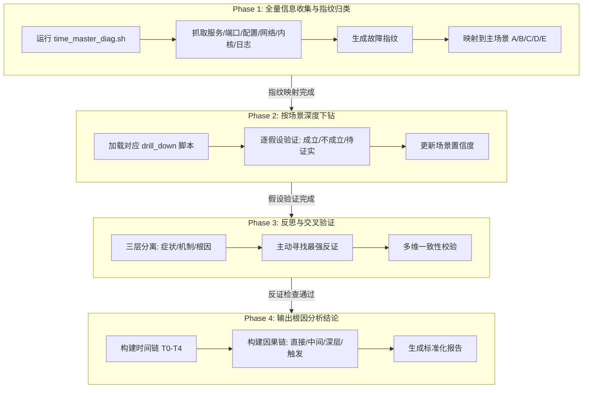
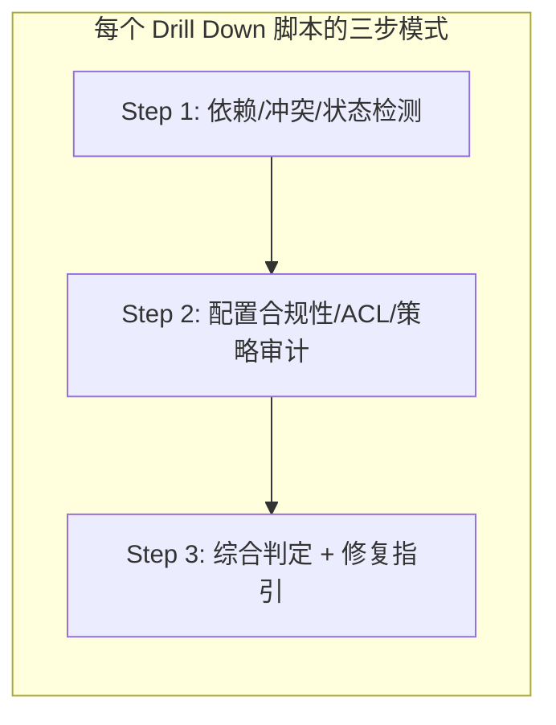

# 时间同步故障诊断：Agent 的四阶段指纹驱动排查方法论

## 概述

时间同步是 Linux 服务器最基础却又最容易被忽视的基础设施——它不产生业务数据，但所有依赖时序的子系统（日志审计、分布式事务、TLS 证书校验、监控告警）都建立在其准确性之上。当时间开始漂移时，表象可能是 `ntpq` 超时、`chronyc` 拒绝连接、`reach=0` 持续告警，甚至是应用层诡异的"证书过期"误报。而问题的根源可能横跨服务管理、网络链路、内核时钟、协议逻辑等多个层面。

Witty 诊断 Agent 内置的 time-sync-diagnosis 技能，采用了一种**指纹驱动的四阶段诊断方法论**——不是逐个命令盲目试探，而是通过一次性全量采集生成"故障指纹"，精准映射到预定义的五大场景之一，再按场景深度下钻，最后通过反思交叉验证输出结论。本文将站在 Agent 视角，完整拆解这套诊断工作流的设计思想与实现原理。

## 背景

### 痛点分析

在 Agent 所面对的故障案例中，时间同步问题有一种特殊的"欺骗性"——它的症状往往出现在离根因很远的层面。一个 chronyd 无法同步的问题，直接原因可能是 `chronyc tracking` 返回 "Cannot talk to daemon"，但这个 506 错误的背后，可能是服务根本没启动（场景 A）、管理通道 ACL 拦截（场景 B）、上游 NTP 服务器不可达（场景 C）、甚至是内核时钟源不稳定导致协议层自动弃选（场景 D/E）。传统排查面临三个系统性困境：

1. **信息孤岛**：诊断时间同步需要同时检查服务状态、端口占用、配置文件、网络连通性、内核时钟源、协议日志、虚拟化 Steal Time 等多个维度。人工操作时，这些信息分散在 `systemctl`、`chronyc`、`ntpq`、`ss`、`vmstat`、`journalctl` 等多个命令中，容易出现遗漏。

2. **因果链长**：时间同步的故障链往往跨越多层——一个虚拟化环境中的 CPU 超分（导致 Steal Time 升高）-> 内核时钟中断丢失 -> chronyd 采样的 jitter 飙升 -> 协议层将源标记为 False Ticker -> 最终表现为同步中断。如果只看最后一环，可能误判为上游 NTP 服务器故障。

3. **症状与根因错位**：`ntpq -p` 显示 `reach=0`，根因可能是 UDP 123 被另一服务占用（控制平面冲突）；`chronyc tracking` 输出高 offset，根因可能是 HPET 时钟源不稳定而非真正的时间漂移。Agent 需要建立"症状 -> 机制 -> 根因"三层映射，而不是将症状直接等同为根因。

### 设计目标

这套 time-sync-diagnosis 技能的设计目标可以概括为：

- **最短路径收敛**：通过一次性全量采集生成"故障指纹"，直接映射到单一主场景，避免在无关分支上浪费时间。四个阶段串行推进，每阶段产出自带 checkpoint。

- **证据驱动**：不猜、不假设，每个结论必须有至少一项命令输出或指标作为支持证据。Phase 2 的下钻脚本严格遵循"先验证是否成立，再解释为什么成立，最后界定影响范围"的顺序。

- **反思机制防误判**：Phase 3 引入显式的反思与交叉验证，要求 Agent 主动寻找"最强反证"来挑战当前假设，避免单一路径确认偏误。

- **标准化输出**：Phase 4 的输出按固定模板组织，包含基本信息、时间链（Time Chain）、因果链（Causal Chain）、证据清单、置信度评估，且缺失项必须显式标注"待补证据"。

## 设计方案

### 整体架构

time-sync-diagnosis 技能的架构设计遵循**四阶段流水线（Pipeline）+ 指纹映射**模式：



### 五类故障场景的划分逻辑

为什么是五类？这并非随意划分。Agent 在分析大量 Linux 时间同步故障后，发现所有故障都可以归因到时间同步系统的"五层脆弱面"：

| 场景 | 脆弱面 | 典型指纹 | 诊断原则 |
|:---:|:---|:---|:---|
| A 控制平面 | 服务生命周期管理 | 多服务并发、UDP 123 被抢占、配置语法错误 | 服务唯一性原则（同类守护进程冲突优先） |
| B 管理通道 | 本地通信与访问控制 | ntpq/chronyc refused、bindcmdaddress 未含 127.0.0.1 | 监听边界 + ACL 审计 |
| C 链路通断 | 网络连通性与上游可用性 | DNS 解析失败、UDP 123 TIMEOUT、reach=0 | 端到端剥离（DNS -> 网络 -> 对端） |
| D 内核与交付 | 计时源稳定性与虚拟化调度 | Steal Time 高、HPET 在 KVM 下不稳定 | 计时源 + 调度干预分析 |
| E 协议逻辑与安全 | NTP 协议层的自保护机制 | False Ticker、Panic 触发、jitter 离散度大 | 一致性与置信度校验 |

### 指纹映射：将混沌症状转化为确定场景

这是这套诊断方法论的精髓所在。`time_master_diag.sh` 一次性采集六个维度的数据，输出一个结构化的"故障指纹"。Agent 根据指纹中的关键信号，通过决策规则映射到主场景：

- 发现多个时间服务同时 active → **场景 A**（服务冲突优先）
- chronyd 运行中但 `chronyc tracking` 返回 506 → **场景 B**（管理通道问题唯一候选）
- DNS 解析失败或 UDP 123 TIMEOUT → **场景 C**（优先到 C 分支验证网络）
- /proc/cpuinfo 含 hypervisor 且 Steal Time > 0 → **场景 D**（怀疑虚拟化时钟干扰）
- `chronyc sources -v` 显示 `x`（不可信源）→ **场景 E**（协议逻辑优先）

Agent 不会仅凭单个信号就锁定场景。例如"UDP 123 TIMEOUT"可能同时被 C 和 A 捕获（timesyncd 占用了 123 端口导致外部无法连接），此时指纹中会包含"端口占用"和"TIMEOUT"两个信号，Agent 优先按 A 场景下钻——因为服务冲突是更高优先级的破坏因素。

## 实现原理

### Phase 1：全量信息采集的脚本设计

`time_master_diag.sh`（约 125 行）是整个诊断的入口。它的设计体现了"一次采集、多次分析"的原则：

```text
=== [1. 基础环境与配置文件探测] ===
  - 动态定位 chrony.conf 路径（从进程参数提取）
  - 扫描 ntpd/chronyd/timesyncd 服务竞争
  - 检测多服务并发（RED ALERT）

=== [2. 网络与 DNS 连通性] ===
  - 从配置文件递归提取 server/pool
  - 逐源做 DNS 解析检查（getent hosts）
  - UDP 123 连通性探测（nc -zu）

=== [3. 协议层与管理通道审计] ===
  - chronyc tracking（检测 506 错误）
  - 监听边界审计（ss -unlp | grep :323）
  - ntpq -p（检测 restrict 策略拒绝）

=== [4. 内核、硬件与虚拟化审计] ===
  - 当前 clocksource（TSC/HPET/ACPI_PM）
  - VM 环境下 Steal Time 检测（vmstat）

=== [5. 系统日志实时分析] ===
  - journalctl 抓取 chronyd panic/error/step 异常
```

关键设计决策：**配置路径的动态解析**。`chrony.conf` 在不同发行版中位于 `/etc/chrony.conf`、`/etc/chrony/chrony.conf` 等不同位置，且用户可能通过 `-f` 参数指定自定义路径。脚本通过 `ps -ef | grep chronyd` 先尝试从运行进程提取参数路径，再 fallback 到常见默认路径。这种"进程感知"的设计比静态硬编码路径更健壮。

### Phase 2：五路 Drill Down 的分支策略

五个 `drill_down_*.sh` 脚本各自对应一个场景，遵循统一的设计模式：



以 `drill_down_network.sh`（场景 C）为例，它的设计特别体现了"故障自愈"思路：

1. **配置文件完整性检查**：检测 `chrony.conf` 中是否包含 `server`/`pool` 指令。如果没有（空配置），自动从公共 NTP 池（ntp.aliyun.com、pool.ntp.org 等）选择探测目标——这样即使配置缺失，Agent 仍能判定"网络是否正常"。

2. **端到端链路剥离**：先 DNS、再 UDP 123 端口探测、最后 MTR/traceroute 路由路径分析。每一层都独立输出结果，Agent 可以精确定位断点在哪一层。

3. **四类结论自动生成**：脚本自动组合 IS_CONFIG_FAULT 和 NET_STATUS 两个布尔量，推导出"配置文件故障 / 双重复合故障 / 服务正常 / 特定链路故障"四种结论，每个结论都有对应的证据说明。

这种设计让 Agent 在 Phase 2 中不需要"思考"，直接读取脚本输出即可获得结构化判定结果——这正是"专家经验封装"的体现。

### Phase 3：反思机制如何减少误判

这是整个技能中最具"智能"感的部分。它不是简单的 if-else 规则，而是一套三层反思框架：

**第一层：症状 vs 机制 vs 根因的分离**

Agent 在 Phase 3 中必须重新审视之前的所有证据，将每个发现归类到三层中的一层：

- **症状层**：`reach=0`、`offset 持续增大`、`chronyc tracking 失败`
- **机制层**：UDP 123 端口被占用、ACL 拒绝本地查询、计时源采样不稳定
- **根因层**：`systemd-timesyncd` 被意外启用并与 chronyd 冲突、`bindcmdaddress` 排除了 `127.0.0.1`、KVM 超分配导致时钟中断丢失

如果第二阶段得出的 "根因" 实际仅仅是 "症状"，Agent 必须继续下钻。

**第二层：主动寻找最强反证**

Agent 需要问自己："什么证据可以推翻我当前的结论？"然后主动去寻找：

- 如果怀疑场景 C（链路故障），则检查是否场景 A 也可解释（端口被占导致外部探测失败）
- 如果怀疑场景 E（False Ticker），则检查是否是场景 D（时钟源不稳导致 jitter 升高，让协议层误报 False Ticker）
- 如果结论依赖单一证据源，自动降级置信度

**第三层：多维一致性校验**

每个结论必须有至少两个独立维度的证据支持：

| 维度 | 示例命令 | 验证什么 |
|:---|:---|:---|
| 服务 | systemctl、ps | 进程是否存在、是否 active |
| 网络 | nc、getent、mtr | UDP 123 是否可达、DNS 是否解析 |
| 时间 | chronyc、ntpq、vmstat | 同步状态、offset、时钟源稳定性 |

### Phase 4：标准化的结论输出模板

结论输出按固定模板组织，其核心是两个结构：

**时间链（Time Chain）**：按故障演进而非诊断步骤排列时间线。Agent 需要回答：何时发生了什么变更（T0）、首次出现异常（T1）、故障扩大（T2）、关键转折（T3）、恢复信号（T4）。这种时间叙事方式让运维人员能快速理解故障的完整演进过程。

**因果链（Causal Chain）**：从现象到根因的四层映射：

```text
直接原因：UDP 123 被 systemd-timesyncd 占用
    ↓
中间机制：进程冲突 → chronyd 无法绑定 123 → 选源失败 → reach 持续为 0
    ↓
深层原因：变更未执行服务唯一性校验（无安装前检查既有 NTP 服务）
    ↓
触发条件：升级后默认启用 timesyncd，未自动禁用冲突服务
```

这种分层输出让不同角色的读者各取所需——运维执行者关注"直接原因 + 触发条件"，架构治理者关注"深层原因 + 中间机制"。

## 权衡设计

### 通用性 vs 深度诊断

`time_master_diag.sh` 覆盖了 5 个场景的表面检查（约 125 行），而每个 drill_down 脚本都有 30-90 行。这意味着 Phase 1 脚本刻意保持"足够薄"——它只需要采集到能把故障分类到某一场景的信号量即可，不做任何非必要的深入检查。这种设计的权衡是：如果 Phase 1 的指纹覆盖度不够全面，可能将复杂复合故障误映射到单一场景，需要 Phase 3 的交叉验证来兜底。

### 自动纠偏 vs 安全边界

`drill_down_protocol.sh` 中包含 `chronyc burst 4/4` 和 `chronyc makestep` 这些具有"写"操作的命令。这与 Witty 诊断 Agent "诊断阶段严格只读"的原则存在一定张力。技能的设计选择是将其放在第二阶段而非自动执行，且不隐藏输出——Agent 可以向用户展示这些命令的输出结果，但实际执行是否需要用户确认，取决于上层的权限策略配置。

### 单机诊断 vs 分布式场景

当前这套技能完全面向单机时间同步诊断。但在实际生产环境中，时间同步问题往往是集群级的——NTP 层次结构中的某层服务器故障，会导致下游成百上千台机器同时漂移。当前技能的指纹映射在 Phase 1 中假设"主场景唯一"，在集群场景下可能需要引入"共享因果"的概念（多台机器同时出现 E 场景，则上层 NTP 源是共同嫌疑人）。

## 用户如何使用

### 快速诊断

```bash
# 第一步：收集全量信息并生成故障指纹
sudo bash ./scripts/time_master_diag.sh

# 根据脚本输出末尾的场景建议，执行对应的下钻脚本
# 例如输出提示 "建议进入场景 C"
sudo bash ./scripts/drill_down_network.sh
```

> **Note:** 脚本依赖 `chronyc`、`ntpq`、`nc`、`mtr`、`systemctl`、`vmstat`、`journalctl` 等工具。Agent 在诊断前会自动检测依赖完整性，缺失工具会在脚本输出中显式标注 `CHECK_SKIP`。

### 场景匹配速查

| 场景 | 典型触发条件 | 下钻脚本 | 输入给 Agent 的典型问题 |
|:---:|:---|:---|:---|
| A | 刚安装 chrony 发现不工作，或有多个 NTP 服务 | `drill_down_control.sh` | "时间服务器起不来"、"装完 chrony 无法同步" |
| B | chronyc 报 506 错误，但进程在运行 | `drill_down_mgmt.sh` | "chronyc 报 Cannot talk to daemon" |
| C | reach=0、TIMEOUT、同步中断 | `drill_down_network.sh` | "NTP 同步超时"、"上游不可达" |
| D | 云主机时间漂移、CPU 占用波动时时间不准 | `drill_down_kernel.sh` | "虚拟机时间一直漂移"、"KVM 里时间不准" |
| E | 时间跳过（step）、log 报 panic 或 false ticker | `drill_down_protocol.sh` | "时间突然跳了"、"报 false ticker" |

Agent 会自动完成场景判断和脚本调度，用户只需描述故障现象即可。

## 总结

time-sync-diagnosis 技能的设计体现了几条核心方法论：

1. **指纹驱动而非遍历驱动**：不是逐项检查所有可能性，而是通过一次采集生成指纹，精准映射到最可能的场景。这符合人类专家"第一眼直觉 + 系统化验证"的认知模式。

2. **证据链的显式构建**：每个阶段的输出都要求包含"支持证据"和"反证证据"，结论置信度始终开放给质疑。这种透明性让 Agent 的诊断过程可审计、可追溯。

3. **反思机制作为最后一道防线**：Phase 3 不是可选的"附加检查"，而是强制执行的验证环节。它确保 Agent 不会在单一路径上偏离，尤其适用于时间同步这类因果链长、跨层次多的故障类型。

4. **可观察性优先于自动化**：修复命令（如 `chronyc makestep`）虽然内置于脚本中，但始终是以"展示"而非"执行"的方式存在——让 Agent 首先成为一个优秀的诊断者，而不是一个冒失的修复者。
