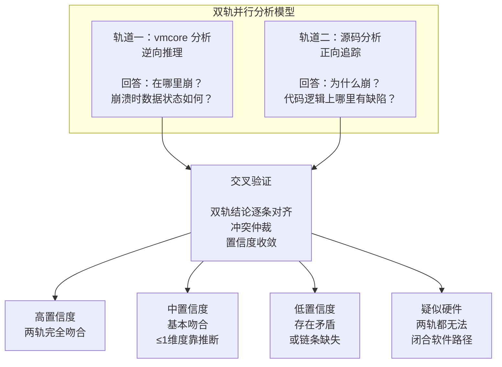

# Linux 内核崩溃诊断 Agent：当 AI 学会"双轨探案"

## 概述

一台承载核心数据库的物理机突然无声无息地躺了。没有应用报错日志，没有 gracefully shutdown，只有 BMC 界面上闪烁的告警红灯和 /var/crash/ 下那个 4GB 的 vmcore 文件。

这是内核崩溃——Linux 系统最严重的故障形态。而你手上唯一的线索就是这张"死亡快照"：某个时间点、某个 CPU 上、某段代码正在执行时，系统戛然而止。RIP 寄存器指向了一条汇编指令，调用栈定格在最后一帧，内核日志倒在了最后一条输出之后。

问题是：在这数亿条可能的执行路径中，是哪一条最终走向了崩溃？是驱动写了一个越界指针，还是内核本身的引用计数出了纰漏？是 NUMA 节点上的内存耗尽触发的 OOM，还是硬件悄悄发生了单比特翻转，把一个合法的指针值变成了一串乱码？

**VMcore Analysis** 正是 Witty 智能诊断 Agent 用来回答这些问题的核心技能。它封装了一套"双轨并行分析"方法论——vmcore 逆向推理与源码正向追踪同时推进，配合 22 个故障分支脚本做自动场景分类，最终通过交叉验证收敛到高置信度根因。Agent 加载这个 Skill 后，面对一个数 GB 的 vmcore，能够在分钟级完成从"现象确认"到"根因定位"的完整链路。

本文将从 Agent 的视角出发，拆解这套技能的设计思想、实现原理和工程权衡——它不是一篇工具命令速查，而是一份关于"如何让 AI 理解内核崩溃"的技术实录。

## 一、背景：为什么内核崩溃诊断这么难？

### 1.1 问题的复杂层级

一次内核崩溃（Kernel Panic / Oops）是 Linux 系统中最严重的故障形态。它不仅意味着服务中断，更意味着整个操作系统内核进入了不可恢复的异常状态。

诊断的难点来自三个层面：

**层面一：信息的不完整性。** vmcore 是一张"死亡瞬间的快照"。你看到的最后一个函数调用、最后一组寄存器值、最后一段内核日志，全都是结果而非原因。崩溃点往往不是根因点——一个指针在帧 #10 被错误释放，却直到帧 #0 才被解引用，中间隔了 10 层调用栈。

**层面二：故障类型的高度多样性。** 空指针、UAF、越界、死锁、栈溢出、MCE、Bit Flip、RCU Stall……每种故障的排查路径截然不同。选错方向意味着浪费大量的分析时间。

**层面三：纯逆向分析的不充分性。** vmcore 只能回答"崩溃时数据状态是什么"，但不能回答"代码逻辑上哪里有缺陷"。要回答后一个问题，必须有源码。但有了源码还不够——编译器优化（内联、指令重排、尾调用优化）会让源码与汇编之间的对应关系变得复杂。

### 1.2 为什么要做一个 Agent Skill？

传统的 vmcore 分析完全依赖人工经验：

- 工程师用 `crash` 工具手动执行命令，一条一条地看 `bt`、`log`、`dis`
- 判断故障类型依赖经验直觉——"看起来像空指针"
- 分析时需要在逆向（vmcore）和正向（源码）之间来回切换，靠记忆维持上下文
- 一次分析耗时从 30 分钟到数小时不等

Agent Skill 要解决的问题是：**把资深内核工程师的分析框架固化到代码中，让每个 Agent 实例都具备同样的诊断能力。**

## 二、设计思路：Agent 是如何"双轨探案"的？

### 2.1 核心架构：双轨并行分析模型

这是整个 Skill 最核心的设计决策。传统的排查思路是线性的：拿到 vmcore → 看崩溃现场 → 猜测故障类型 → 按该类型深挖 → 如果不对再回溯。VMcore Analysis 的设计者选择了一条不同的路：**两条轨道同时推进，最终交叉验证收敛结论。**



**为什么这样设计？**

| | vmcore 轨道（逆向） | 源码轨道（正向） |
|--|-------------------|----------------|
| **优势** | 崩溃时的真实数据、精确崩溃地址、并发时序痕迹 | 完整因果模型、错误路径可见、竞态窗口可分析 |
| **局限** | 只有结果快照，过程不可见；编译优化可能隐藏关键帧 | 需要版本精确匹配；编译优化可能改变代码结构 |
| **典型盲区** | 错误处理路径遗漏、引用计数不配对 | Bit Flip 伪装软件故障（源码逻辑完全正确） |

两条轨道在信息层面上互补——vmcore 提供"事实"，源码提供"逻辑"。它们各自有自己的盲区，但盲区不重叠。当两者结论一致时，置信度远高于任意单一轨道。

### 2.2 关键设计之一：22 路分支决策树

基线脚本 `01_baseline_info.sh` 就是 Agent 的"第一判断"。它的核心逻辑是：**从内核日志（log.txt）中提取故障关键词，自动匹配到对应的分支脚本。**

```text
崩溃日志
  ├─ 含 "NULL pointer dereference"             → 分支A: 空指针解引用
  ├─ 含 "KASAN: slab-out-of-bounds"            → 分支B: 内存越界 OOB
  ├─ 含 "KASAN: use-after-free"                → 分支C: Use-After-Free
  ├─ 含 "stack-protector"                      → 分支D: 内核栈溢出
  ├─ 含 "Machine check:" / MCE bank            → 分支E: 硬件 MCE
  ├─ 含 "possible circular locking"            → 分支G: 死锁
  ├─ 含 "kernel BUG at"                        → 分支J: BUG() 触发
  ├─ 含 "rcu_sched detected stalls"            → 分支M: RCU Stall
  ├─ 含随机崩溃 + 软件证据链不完整              → 分支V: 疑似 Bit Flip
  └─ 其他 13 个分支 ...                        → 并行执行所有匹配分支
```

**设计哲学：确定性规则优于概率模型。**

Agent 不需要一个机器学习模型来判断故障类型。24 条正则规则覆盖了 22 种已知故障模式，每条规则都有明确的日志关键字依据。这不仅是够用，而且有更重要的特性——**可追溯性**。"为什么走到分支A"的答案是"因为日志中包含 NULL pointer dereference"，而不是"模型预测概率为 0.94"。

一个关键细节是**分支V（Bit Flip）的检测机制与其他分支不同**：

- 其他 21 个分支只扫描 `log.txt`（内核日志）
- 分支V额外扫描 `bt.txt` 和 `bt_f.txt`（调用栈和栈帧内容）
- 因为 Bit Flip 在内核日志中可能没有任何明确的关键字痕迹，但会在调用栈中呈现栈帧损坏、非法地址、无效 opcode 等特征

```bash
BIT_FLIP_PATTERN="paging request|Data Abort|unable to handle kernel paging request"
BIT_FLIP_PATTERN+="|invalid opcode|undefined instruction|general protection fault"
BIT_FLIP_PATTERN+="|list_del corruption|list_add corruption|slab corruption"
BIT_FLIP_PATTERN+="|BUG: Bad page|Corrupted page table|corrupted stack end"
```

这个多源扫描的设计反映出 Agent 对 Bit Flip 这类"伪装性"故障的特殊处理——它不从单一证据下结论，而是综合多处异常信号做综合判断。

### 2.3 关键设计之二：脚本是"可执行的排查指南"

每个 `branch_*.sh` 脚本都有两个输出：**vmcore 命令自动执行** + **源码分析指引打印输出**。Agent 不需要记忆 crash 命令的语法——分支脚本已经把每一步分析都编码化了。

以 **分支A（空指针）** 为例，它的执行流程在编码层面就体现了完整的五步专家思维：

```bash
# A1: 确认 panic 类型
crash> log | grep -E "NULL pointer|unable to handle|Oops" | head -5

# A2: 崩溃现场重建（调用栈 + 寄存器）
crash> bt -f

# A3: 源码-汇编对齐（关键桥梁）
crash> dis -l <崩溃函数>    # 带源码行号的反汇编

# A4: 找到值为 NULL 的寄存器
crash> bt -f | grep -E "RIP|RAX|RBX|RCX|..." | head -20

# A5: 调用帧逐帧追踪（区分崩溃帧 vs 根因帧）
crash> bt -l
```

每个脚本不仅是命令集合，还内嵌了**证据链模板**和**结论模板**，Agent 可以直接填充输出：

```text
vmcore 轨道结论：
  崩溃位置：RIP=<addr>  函数：<func+offset>
  调用链：#0 → #1 → ... → #N
  异常值：<寄存器/内存值>
  vmcore 侧根因假设：<一句话>

源码轨道结论：
  根因代码位置：<file>:<line>  函数：<func>()
  缺陷类型：[缺失检查|引用计数错误|锁保护缺失|竞态|逻辑错误]
  因果链：[缺陷触发] → [异常状态] → [传播] → [bt #0 崩溃点]
```

### 2.4 关键设计之三：交叉验证——Agent 的"陪审团裁决"

两条轨道独立执行完毕后，Agent 进入**交叉验证**阶段。这不是简单的"两边的结论都对得上"，而是一个结构化的**五维度对齐检查**：

```text
| 验证维度 | vmcore 结论 | 源码结论 | 是否吻合？ |
|---------|------------|---------|-----------|
| 崩溃位置 | RIP 在 <func>+<offset> | <file>:<line> 对应此偏移 | □ 吻合 □ 不符 |
| 异常值  | 寄存器/内存读到 <value> | 源码在 <条件> 下产生此值 | □ 吻合 □ 不符 |
| 调用路径 | bt 路径 A→B→C→崩溃 | 源码中 A→B→C 的调用存在 | □ 吻合 □ 不符 |
| 根因帧  | #N 帧首次异常 | 对应函数存在缺陷 | □ 吻合 □ 不符 |
| 触发条件 | 并发/输入特征 | 缺陷在此条件下触发 | □ 吻合 □ 不符 |
```

**不一致时的仲裁原则**是精心设计的：

```text
崩溃位置/异常值：优先信任 vmcore（客观事实）
调用路径不符：优先检查内联/尾调用优化，用 bt -f 还原
根因帧不符：保留多假设并补证据（必要时 KASAN/LOCKDEP 复现）
```

最终置信度收敛到四个等级：

| 置信度 | 条件 |
|--------|------|
| **高** | 两轨完全吻合 + 反事实验证通过 |
| **中** | 两轨基本吻合，1 个维度依赖推断；或仅完成 vmcore 轨道 |
| **低** | 两轨存在矛盾且无法解释；或证据链缺失超过两环节 |
| **疑似硬件** | 两轨软件证据链均不完整 + 随机崩溃 + 无法复现 |

这个等级是 Agent 向用户输出结论时的核心元信息。置信度低的结论不会作为"根因"呈现，而会以"多种可能性"的方式列出，让用户自行判断。

## 三、实现原理：Agent 的每一步都在做什么？

### 3.1 Step 1：启动——Agent 的"望闻问切"

当 Agent 加载 vmcore-analysis Skill 时，它做的第一件事是运行基线脚本：

```bash
bash scripts/01_baseline_info.sh <vmcore> <vmlinux> [src_dir]
```

这个脚本在后台做了大量并行工作——9 个 `crash` 命令同时执行，用 `wait` 同步：

```bash
run_crash_async 'sys'    "sys.txt"    "系统基础信息"
run_crash_async 'log'    "log.txt"    "内核日志"
run_crash_async 'bt'     "bt.txt"     "当前崩溃调用栈"
run_crash_async 'bt -l'  "bt_l.txt"   "带行号调用栈"
run_crash_async 'bt -a'  "bt_a.txt"   "所有CPU调用栈"
run_crash_async 'bt -f'  "bt_f.txt"   "调用栈与寄存器"
run_crash_async 'mod'    "mod.txt"    "已加载内核模块"
run_crash_async 'kmem -i' "kmem_i.txt" "内存状态概览"
run_crash_async 'ps'     "ps.txt"     "进程状态概览"
```

**设计意图**：Agent 在"第一分钟"就完成全量信息采集，而不需要人工一步步输入 crash 命令。后续所有分析都基于这些采集到的文件，不会重复加载数 GB 的 vmcore。

采集完成后，Agent 从输出中提取四类关键信息：

1. 内核版本字符串（用于版本验证）
2. 崩溃位置（函数名、`RIP=<addr>`、`<func+offset>`）
3. 调用栈（`bt -f`/`bt -l` 的链路）
4. 异常值线索（NULL/poison/越界偏移/锁告警/MCE/UE 等关键词）

### 3.2 Step 2：故障定界——Agent 的"辨证"

基于 Step 1 的关键词匹配结果，Agent 决定执行哪些分支脚本。注意一个重要的设计：**如果匹配到多个分支，按输出顺序全部执行，不能只选一个。**

这是 Agent 与人类工程师的一个关键区别。人类工程师看到"NULL pointer dereference"会天然地只走空指针分析路径，但如果这个 NULL 指针其实是 Bit Flip 造成的呢？Agent 不会在早期做这种"预判"，它让数据自己说话——如果同时匹配了分支A和分支V，两条路径都走，最终交叉验证时再判断谁更合理。

每个分支脚本都内置了双轨结构。以 **分支C（UAF）**为例：

- **C1-C4（vmcore 轨道）**：分析 KASAN 报告、崩溃调用栈、目标对象内存状态（确认 0x6b6b6b6b poison 值）
- **C5-C7（源码轨道）**：追踪分配/释放/使用的完整生命周期，配对引用计数操作
- **C8（并发分析）**：`bt -a` 查看所有 CPU 的调用栈，判断是否有并发场景

### 3.3 Step 3-4：双轨并行——Agent 的"双向取证"

**vmcore 轨道的四步证据链：**

- **V1 崩溃现场还原**：确认 panic/oops 类型、精确 RIP、崩溃寄存器值
- **V2 调用栈重建**：用 `bt -f` + `bt -l` 确认 #0 崩溃帧与完整调用链
- **V3 数据状态验证**：用 `struct`/`kmem`/`rd` 读取关键结构体/指针/长度/引用计数
- **V4 独立归因**：仅基于 vmcore 数据给出"异常值是什么、首次出现在哪一帧、如何触发 #0"

**源码轨道的五步流程（S0-S5）：**

源码轨道的一个关键约束是**S0 版本验证**，这是很多分析容易忽略但极其重要的一步：

```bash
# 反汇编验证行号映射是否可信
crash> dis -l <崩溃函数名>
```

版本不匹配的典型信号：

- `dis -l <func>` 的源码行与 `src/` 实际内容语义不对应
- 源码里有逻辑分支但汇编里找不到（可能 backport patch 改动）
- 结构体字段偏移与 `struct <type>` 输出不一致

Agent 遇到版本不匹配时**不会停止分析**，而是标注"版本存在差异"，后续推断以 vmcore 事实校正。这是 Agent 的"降级但不停止"哲学——在信息不完全的情况下继续给出有用结论。

### 3.4 Step 5：反事实验证——Agent 的"逻辑闭环"

这是整个分析流程中最**关键但最容易被忽视**的步骤。反事实验证的核心是：**用你的根因假设正向推演一遍，看推演结果是否与 vmcore 观测一致。**

```text
推演的崩溃位置 == vmcore 的 RIP？   □ 是  □ 否
推演的异常值   == vmcore 的寄存器？  □ 是  □ 否
推演的调用路径 == vmcore 的 bt？     □ 是  □ 否
```

只有三条全 ✓，Agent 才会判定"根因确认"。任何一条不吻合，Agent 都不能止步于"找到可疑代码"——它必须回到分析流程中重新检查假设。

这个机制的设计意图是防止 Agent 最常见的错误模式：**找到一段"看起来有问题"的代码，就断言这是根因。** 反事实验证迫使用 Agent 建立完整的因果链：缺陷触发 → 异常状态 → 传播路径 → 崩溃点。任何一个环节无法用 vmcore 印证，都说明根因假设还需要修正。

### 3.5 特殊情况：硬件故障的识别

这是 VMcore Analysis 中最具特色的能力之一——**识别伪装成软件故障的硬件 Bit Flip**。

Bit Flip（比特翻转）是指内存中单个比特的物理值被反转（0→1 或 1→0），通常由宇宙射线或硬件老化引起。它在 vmcore 中看起来像一个软件 Bug——非法指针、异常值、崩溃，但源码分析却找不到任何逻辑缺陷。

Agent 的识别流程分为清晰的四个步骤：

```text
Step 1: 软件排除
  按对应软件故障类型完整分析，确认找不到可闭环的软件路径
Step 2: 硬件侧证据收集
  BMC/IPMI SEL、EDAC 统计、内存巡检日志
Step 3: 物理地址关联
  从 vmcore 崩溃地址推算物理地址 → PFN → DIMM slot
Step 4: 趋势分析
  CE 计数趋势、温度异常、同批次 DIMM 错误率比对
```

分支V 脚本提供了一个独特的验证工具——`check_bitflip.sh`，用于验证"预期值"与"实际值"之间是否仅相差 1 个比特位：

```bash
# 比对 XOR 结果是否只有 1 个 bit 不同
bash scripts/check_bitflip.sh <expected_value> <actual_value>

# 示例：检测到实际值是预期值的单比特翻转
bash scripts/check_bitflip.sh 0xffffffffb3a01000 0xfffffffbb3a01000
# XOR: 0x0000000400000000 → 只有 1 bit 不同 → 高度怀疑 Bit Flip
```

**但这里有一个容易踩的坑，脚本也给出了明确的警告：** 预期值和实际值必须在语义上是一对一匹配的——即"硬件刚发生乱序改写前，CPU 希望读到的正确值"。如果盲目地将 FAR/CR2 与任意值做 XOR，结论毫无意义。

Agent 推导"预期值"的过程本身就是一个推理过程——通过反汇编崩溃指令、分析寻址模式、理解 per-CPU 基址、结构体字段偏移等，推算出"如果硬件没出错，这里应该是什么值"。这个推理过程需要结合：

- `dis -r <PC/RIP>`：查看崩溃指令的汇编上下文
- `kmem -o`：获取 per-CPU 基址（必须确认链式一致性——崩溃 CPU、当前任务、per-CPU 基址必须指向同一颗逻辑 CPU）
- `struct <type> -o`：验证结构体字段偏移

这个细节揭示了一个重要的事实：**即使是"硬件故障"的判断，也需要深厚的软件知识作为基础。**

## 四、权衡之道

### 4.1 源码版本精确匹配 vs 近似分析

理想情况下，用于分析的源码必须与 vmcore 的内核版本精确匹配。但实践中，Agent 经常遇到的情况是：只有近似版本的源码，或者源码包含了一些 backport 的 patch。

VMcore Analysis 的选择是：**不要求完美匹配，但必须标注差异。** 版本不匹配时，Agent 继续分析，但用 vmcore 事实（寄存器值、内存内容、调用栈）来校正源码推理，并在最终结论中标注"版本存在差异"。

### 4.2 崩溃帧 vs 根因帧的区分

这是分析中最常见的误判来源，也是 Skill 设计中反复强调的一点：**崩溃点是异常传播的终点，根因帧是异常最初引入点**——它们通常不是同一帧。

Agent 在源码轨道的 Step S3 中做了明确的区分：

- 对每一帧（从 #0 到 #N），完成三件事：
  ① 找到对应源码函数
  ② 用 vmcore 的数据验证该帧的输入参数是否异常
  ③ 判断该帧是"崩溃帧"（终点）还是"根因帧"（起点）

根因帧的特征：

- 该帧的某个输入/返回值异常（如 NULL）
- 但其调用者（下一帧）没有对此做检查
- 这就是"应有检查但缺失"的位置

### 4.3 双轨的"智能"分布

另一个重要权衡：**两条轨道各自承担多少"智能"？**

VMcore Analysis 的答案是 **"数据在 vmcore 侧，逻辑在源码侧"**：

- vmcore 轨道负责回答"是什么"：崩溃位置、数据状态、寄存器值
- 源码轨道负责回答"为什么"：缺陷模式、根因位置、修复方案

两者独立推进、互不干扰，最终在交叉验证阶段融汇。这种分离的设计保证了：即使没有源码（仅有 vmcore），Agent 也能完成轨道的分析并给出"中置信度"的结论，而非直接退出。

### 4.4 22 个脚本而非 1 个巨无霸

为什么是 22 个独立脚本，而不是一个统一的大脚本？

- **每个分支的场景差异化明显**：空指针分析关注寄存器和调用栈，UAF 分析关注 KASAN 报告和 slab 状态，死锁分析关注所有 CPU 的调用栈和锁对象……如果合成一个脚本，输出的 90% 内容对当前场景是冗余的
- **部署独立性**：每个脚本自包含，Agent 可以只复制需要的分支到指定环境，没有模块依赖
- **运行效率**：只执行匹配到的分支，不需要采集无关数据，避免 Agent 的超时限制

## 五、用户视角：如何在实战中使用

### 5.1 Agent 接收崩溃分析请求

当用户说"帮我看一下这个 vmcore，服务器崩了"时，Agent 内部发生的是：

1. **参数识别**：从对话中提取 vmcore 路径、vmlinux 路径、源码路径
2. **第一阶段（基线）**：`bash scripts/01_baseline_info.sh <vmcore> <vmlinux> [src_dir]`
3. **自动分类**：从输出中自动匹配故障类型分支
4. **第二阶段（分支）**：执行匹配到的分支脚本
5. **双轨分析**：vmcore 命令自动执行 + 源码追踪指引输出
6. **交叉验证**：两轨结论逐条对齐，输出置信度评级
7. **最终输出**：结构化的根因分析报告

### 5.2 典型输出结构

Agent 最终输出的是按照第九节模板格式化的报告，包含：

```markdown
## 崩溃概要
- 故障模式：<类型>
- 置信度：<高/中/低/疑似硬件>
- 分析轨道：[双轨 | 单轨]
- 内核版本：<版本号>

## vmcore 轨道结论
- 崩溃位置：RIP=<addr> 函数：<func+offset>
- 调用链：#0 → #1 → ... → #N
- 异常值：<寄存器值/内存内容>

## 源码轨道结论
- 根因代码位置：<file>:<line> 函数：<func>()
- 缺陷类型：[缺失检查|引用计数错误|锁保护缺失|竞态|逻辑错误]
- 因果链：[缺陷触发] → [异常状态] → [传播] → [崩溃点]

## 交叉验证结果
- 五个维度的一致性比对

## 完整因果链
- [触发条件] → [代码缺陷] → [异常状态] → [传播] → [崩溃点]

## 排除的替代假设
- 假设X：排除原因 <...>

## 修复建议
- 最小修复：具体代码修改（diff 形式）
- 根本修复：设计层面的改进方向

## 验证建议
- 如何确认根因 + 如何验证修复有效
```

### 5.3 一键启动分析

用户只需一句话就能触发完整的分析流程：

```text
用户："帮我分析一下 /var/crash/vmcore，内核源码在 /home/src/linux-6.6"
Agent → 执行 01_baseline_info.sh 自动分类
     → 匹配到分支A（空指针）+ 分支C（UAF）（两路并行）
     → 双轨分析完成，交叉验证
     → 输出结构化报告
```

如果用户没有提供源码路径，Agent 会执行纯 vmcore 单轨分析，并在结论中标注"无源码，部分结论依赖推断"，置信度自动降级为"中"。

## 六、总结

VMcore Analysis Skill 的设计体现了几个关键工程理念：

**1. 双轨并行，交叉验证。** 不依赖单一信息源，vmcore 提供"事实"，源码提供"逻辑"，两者独立推进后融汇。这大幅提升诊断结论的可信度。

**2. 确定性规则驱动的故障分类。** 22 条正则规则匹配 22 种已知故障模式，每条规则都有明确的日志关键字依据。可追溯、可解释——这对诊断场景至关重要。

**3. 反事实验证是闭环的关键。** 找到可疑代码不等于找到根因。只有正向推演的结果与 vmcore 观测完全吻合，Agent 才能判定"根因确认"——这个机制防止了 Agent 最常见的"找到问题就停"的错误模式。

**4. 硬件的伪装可以被软件揭穿。** Bit Flip 在 vmcore 中伪装成软件故障，但通过结合反汇编寻址分析、XOR 比特位校验和硬件侧证据（EDAC/BMC SEL），Agent 能够穿透这个伪装。

**5. 降级但不停止。** 没有源码就走单轨、版本不匹配就标注差异、部分 dump 就保守推理——Agent 在信息不完全的环境下始终坚持"给出我可以给出的最佳结论"，而非拒绝服务。

最后，这个技能的设计展示了一个重要趋势：**AI Agent 与操作系统内核知识的深度融合。** 它的每一层设计都围绕着"让 AI 理解内核崩溃"这个核心目标展开。从崩溃现场重建到源码逻辑追踪，从故障分类到硬件故障识别，VMcore Analysis 把资深内核工程师十年积累的分析经验，编码为 Agent 可执行的诊断能力。
