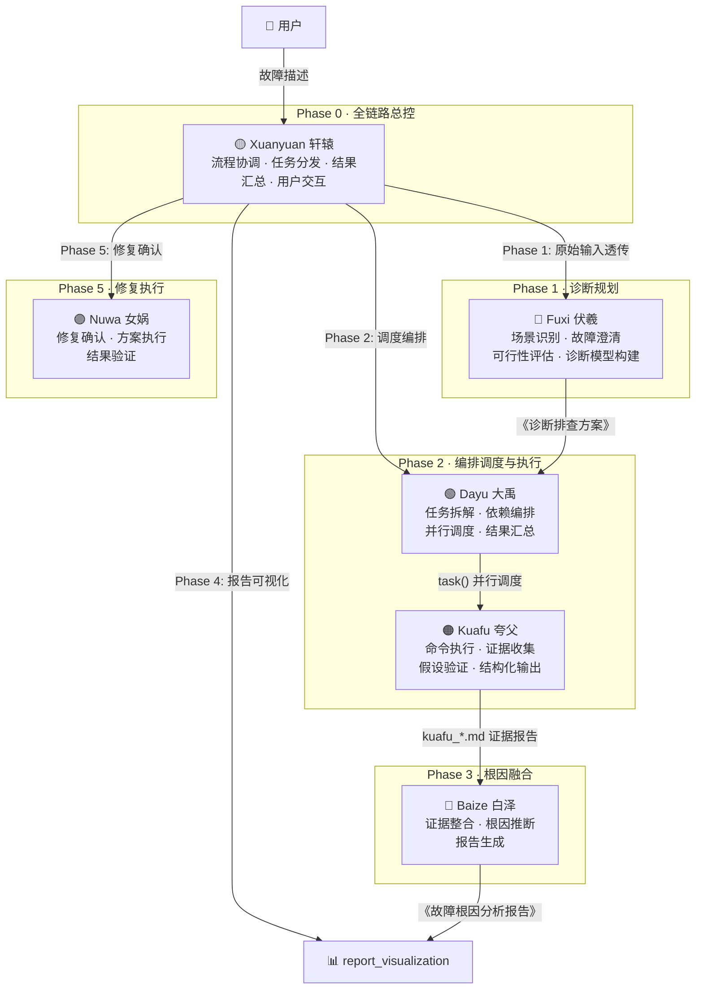
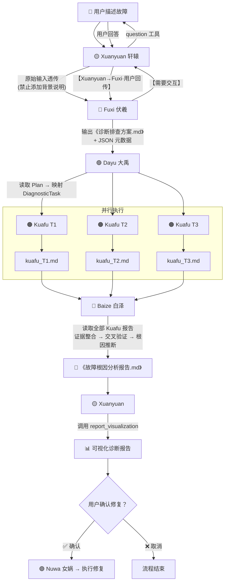
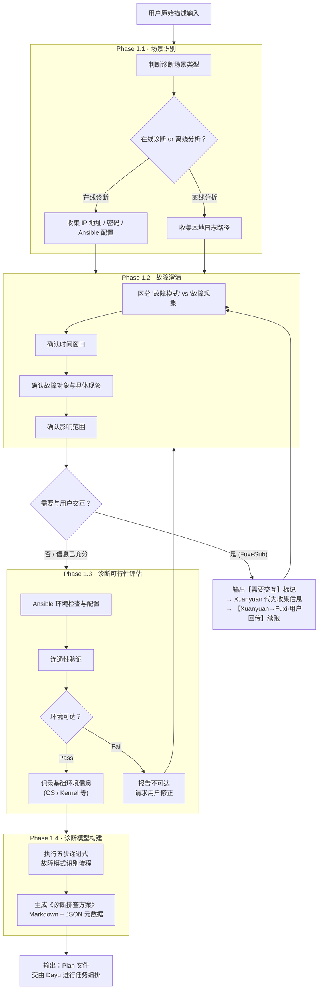
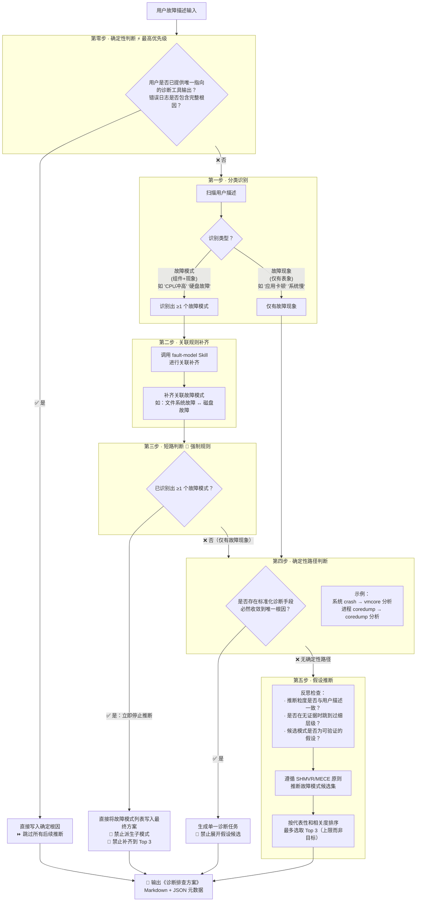
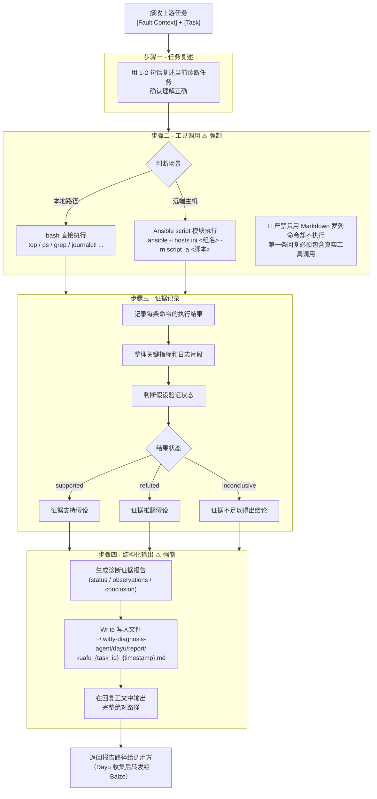
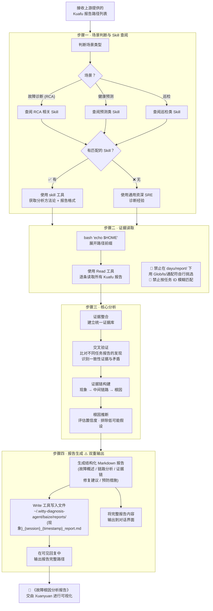
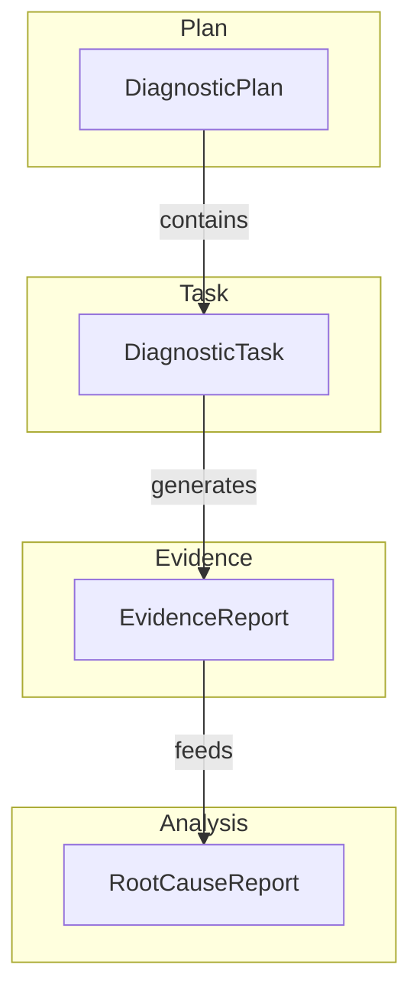

# Witty 智能诊断 Agent 架构与方案设计文档

> **版本**: v1.0  
> **日期**: 2026年5月12日  
> **文档性质**: 系统架构设计 · 内部技术文档

---

## 目录

- [一、背景与定位](#一背景与定位)
  - [1.1 业界智能诊断系统工程定义](#11-业界智能诊断系统工程定义)
  - [1.2 Witty 智能诊断 Agent 定位与目的](#12-witty-智能诊断-agent-定位与目的)
- [二、业界洞察](#二业界洞察)
  - [2.1 主流工具与平台概述](#21-主流工具与平台概述)
  - [2.2 竞品能力分析](#22-竞品能力分析)
    - [SUSE Liz](#suse-liz)
    - [RHEL Lightspeed](#rhel-lightspeed)
  - [2.3 业界方案的共性短板](#23-业界方案的共性短板)
  - [2.4 Witty 智能诊断 Agent 核心竞争力](#24-witty-智能诊断-agent-核心竞争力)
- [三、系统总体架构](#三系统总体架构)
  - [3.1 设计原则](#31-设计原则)
  - [3.2 架构总览](#32-架构总览)
  - [3.3 阶段划分](#33-阶段划分)
  - [3.4 数据流](#34-数据流)
- [四、Agent 详细设计](#四agent-详细设计)
  - [4.1 Xuanyuan 轩辕 — 总控 Agent](#41-xuanyuan-轩辕--总控-agent)
  - [4.2 Fuxi 伏羲 — 诊断规划 Agent](#42-fuxi-伏羲--诊断规划-agent)
  - [4.3 Dayu 大禹 — 编排调度 Agent](#43-dayu-大禹--编排调度-agent)
  - [4.4 Kuafu 夸父 — 执行采集 Agent](#44-kuafu-夸父--执行采集-agent)
  - [4.5 Baize 白泽 — 分析报告 Agent](#45-baize-白泽--分析报告-agent)
  - [4.6 Nuwa 女娲 — 修复执行 Agent](#46-nuwa-女娲--修复执行-agent)
- [五、核心机制设计](#五核心机制设计)
- [六、核心数据模型](#六核心数据模型)
- [七、代码模型](#七代码模型)
- [八、构建模型](#八构建模型)
- [九、文件体系与目录约定](#九文件体系与目录约定)
- [十、完整诊断流程示例](#十完整诊断流程示例)
- [十一、总结](#十一总结)

---

## 一、背景与定位

### 1.1 业界智能诊断系统工程定义

根据业界最新研究与实践（Gartner、Forrester、CNCF 云原生运维白皮书），**智能运维诊断系统**的权威定义如下：

> **智能运维诊断系统**是基于 AI/ML 技术的运维自动化平台，通过自动发现故障、定位根因、推荐修复方案，实现运维流程的智能化和自动化。它是传统监控告警系统的演进，将被动响应转变为主动预测和自动修复。

业界公认的智能诊断系统三大核心支柱（Gartner, 2026）：

1. **故障发现（Fault Detection）**：通过异常检测、趋势分析、模式识别等技术自动发现系统故障
2. **根因定位（Root Cause Analysis）**：基于多源数据关联分析，精准定位故障根本原因
3. **修复执行（Remediation Execution）**：自动或半自动执行修复方案，形成诊断闭环

智能诊断系统的三大外部化维度（CNCF, 2026）：

- **可观测性（Observability）**：覆盖日志、指标、链路追踪的全维度数据采集
- **可扩展性（Extensibility）**：支持多场景、多平台的诊断能力扩展
- **可解释性（Explainability）**：诊断过程和结果可追溯、可解释

### 1.2 Witty 智能诊断 Agent 定位与目的

**Witty 智能诊断 Agent**是一套基于大语言模型（LLM）的智能运维诊断系统，以"Prompt-as-Code"为核心设计理念，通过多 Agent 协作实现从故障发现到根因定位再到修复执行的全链路自动化闭环。

系统旨在：

- 将运维诊断从"人工排查"转变为"智能自动化"
- 为运维团队提供统一的诊断平台，降低故障定位时间
- 满足业界智能诊断系统三大支柱（故障发现、根因定位、修复执行）的工程诉求

系统核心提供三大关键能力：

1. **智能故障诊断**：基于 LLM 的故障模式识别与根因推断
2. **多 Agent 协作**：专业化分工的 Agent 流水线协作
3. **可扩展 Skill 体系**：支持新场景快速扩展的诊断技能库

---

## 二、业界洞察

### 2.1 主流工具与平台概述

当前业界面向智能运维诊断的解决方案主要分为三类：

**传统监控告警平台**：以 Prometheus + Grafana、Zabbix 为代表，通过规则引擎和阈值告警发现故障，依赖人工分析定位根因。

**AIOps 平台**：以 Moogsoft、BigPanda 为代表，引入机器学习算法进行异常检测和根因分析，但仍需人工介入执行修复。

**LLM 驱动的智能助手**：以 SUSE Liz、REHE Lightspeed 为代表，将大语言模型与运维场景结合，提供自然语言交互的诊断能力。

| 类别         | 代表产品                        | 核心定位      |
| ---------- | --------------------------- | --------- |
| 传统监控告警平台   | Prometheus + Grafana、Zabbix | 指标监控与告警   |
| AIOps 平台   | Moogsoft、BigPanda           | 智能异常检测与分析 |
| LLM 驱动智能助手 | SUSE Liz、RHEL Lightspeed    | 自然语言诊断与修复 |

### 2.2 竞品能力分析

#### SUSE Liz

SUSE Liz 是 SUSE 推出的 AI 驱动的云原生运维助手，专注于 K8S 容器环境的智能管理。

**能力：**

- 自然语言查询 K8S 集群状态
- 自动诊断容器编排问题
- 提供云原生场景修复建议
- 支持 K8S 资源配置优化建议

**优势：**

- 深度集成 SUSE Rancher 生态
- 专注 K8S 云原生场景，领域知识丰富
- 命令行原生体验，符合运维人员操作习惯
- 支持多语言交互

**短板：**

- 仅聚焦 K8S 云原生场景，对内核级、硬件故障溯源能力弱
- 缺少中文专属知识库，中文用户体验不佳
- 跨平台能力有限，主要面向 SUSE Linux 平台
- 依赖本地 LLM 模型，资源消耗较高

#### RHEL Lightspeed

RHEL Lightspeed 是红帽公司推出的基于 RHEL 操作系统的命令行 AI 助手。

**能力：**

- 自然语言查询系统状态（CPU、内存、磁盘等）
- 输出操作建议和命令示例
- 支持系统配置查询
- 提供基础故障排查指导

**优势：**

- 深度集成 RHEL 操作系统生态
- 命令行原生体验，响应速度快
- 轻量级部署，资源消耗低
- 支持中英文交互

**短板：**

- 仅输出操作建议，需要人工按照建议操作
- 交互次数多，效率低
- 不支持自动化的故障诊断，无闭环修复能力
- 根因分析能力较弱，以信息查询为主

### 2.3 业界方案的共性短板

综合分析现有方案，业界普遍存在以下不足：

**一、缺乏端到端自动化闭环**

现有方案大多停留在"发现+建议"阶段，修复执行环节仍需人工介入，无法形成完整的诊断修复闭环。

**二、跨平台能力不足**

多数方案针对特定平台或领域设计，难以统一管理混合 IT 环境。

**三、可解释性差**

诊断过程如同黑盒，用户难以理解推理逻辑和决策依据。

**四、扩展能力有限**

新场景、新故障类型的支持需要大量代码开发，难以快速响应业务需求。

### 2.4 Witty 智能诊断 Agent 核心竞争力

基于对业界方案的深度分析，Witty 智能诊断 Agent 在以下方面形成差异化优势：

**全链路自动化闭环**

系统覆盖"故障规划 → 任务编排 → 假设验证 → 根因融合 → 报告生成 → 修复执行"完整诊断生命周期，真正实现自动化运维。

**多 Agent 专业化分工**

通过六个专职 Agent 的流水线协作，实现职责分离与高内聚低耦合，每个 Agent 专注于特定阶段的任务。

**Prompt-as-Code 设计理念**

所有业务逻辑均以自然语言提示词表达，修改业务逻辑只需更新提示词，无需修改代码，支持快速迭代不同的诊断策略。

**可扩展 Skill 体系**

通过可热插拔的诊断技能库，支持对新场景、新故障类型的快速扩展，无需修改核心架构代码。

**透明可追溯**

诊断过程全程记录，支持全链路追踪和证据链构建，确保诊断结果可解释、可验证。

---

## 三、系统总体架构

### 3.1 设计原则

| 原则        | 体现                                         |
|:--------- |:------------------------------------------ |
| **职责单一**  | 每个 Agent 只承担一种职责，不越权、不越界                   |
| **声明式设计** | 通过描述"应该做什么"（Prompt）而非"怎么做"（代码）来实现功能        |
| **标准化交互** | 固定的 Prompt 格式、工具调用规范、文件路径约定确保多 Agent 协作一致性 |
| **证据驱动**  | 所有结论基于实际采集的证据，绝不编造日志或指标                    |
| **安全优先**  | 默认只读诊断，修复操作需用户明确确认                         |
| **强制闭环**  | 每个阶段必须产出标准化输出，未完成不得结束任务                    |
| **灵活扩展**  | 新增场景只需编写新 Skill 和更新 Prompt，无需修改架构代码        |
| **用户中心**  | 关键决策点与用户确认，诊断过程透明可追溯                       |

### 3.2 架构总览

Witty 智能诊断 Agent 采用"Agent-Skill-工具-知识"四层解耦架构，兼具高灵活性与可扩展性。


Witty 智能诊断 Agent 由一个总控 Agent 协调五个专职子 Agent 完成完整的诊断闭环。



系统由一个总控 Agent 和五个专职子 Agent 构成，各 Agent 的定位如下：

**Xuanyuan 轩辕（总控）**：全链路 Controller，本身不执行具体诊断命令，负责流程协调、任务分发、结果汇总和用户交互，通过 `task()` 工具调用各子 Agent。

**Fuxi 伏羲（Phase 1 · 诊断规划）**：从用户原始描述出发，完成场景识别、故障澄清、可行性评估和诊断模型构建，输出标准化的《诊断排查方案》。

**Dayu 大禹（Phase 2 · 编排调度）**：将 Fuxi 的诊断计划拆解为具体的 DiagnosticTask，按依赖关系进行并行或拓扑排序调度，通过 `task()` 调用 Kuafu 执行。

**Kuafu 夸父（Phase 2.x · 执行采集）**：执行层 Agent，使用 bash/Ansible 等工具在目标主机上执行诊断命令，收集证据，生成结构化的证据报告。

**Baize 白泽（Phase 3 · 根因融合）**：纯分析角色，读取所有 Kuafu 证据报告，进行交叉验证和证据链构建，推断根因并生成《故障根因分析报告》。

**Nuwa 女娲（Phase 5 · 修复执行）**：在根因分析完成并获得用户确认后，执行具体的修复方案。

### 3.3 阶段划分

| 阶段        | Agent       | 核心职责     | 输入           | 输出                        |
|:--------- |:----------- |:-------- |:------------ |:------------------------- |
| Phase 0   | Xuanyuan 轩辕 | 全链路协调与总控 | 用户请求         | 协调指令                      |
| Phase 1   | Fuxi 伏羲     | 诊断计划构建   | 用户原始描述       | 《诊断排查方案》(Markdown + JSON) |
| Phase 2   | Dayu 大禹     | 任务编排与调度  | 诊断计划文件       | Kuafu 执行结果路径清单            |
| Phase 2.x | Kuafu 夸父    | 诊断命令执行   | 单个诊断任务       | 诊断证据报告 (kuafu_*.md)       |
| Phase 3   | Baize 白泽    | 根因分析与报告  | Kuafu 报告路径列表 | 故障根因分析报告                  |
| Phase 4   | Xuanyuan 轩辕 | 报告可视化    | Baize 报告     | 可视化诊断报告                   |
| Phase 5   | Nuwa 女娲     | 修复确认与执行  | 修复建议         | 修复结果                      |

### 3.4 数据流



完整的数据流经过以下关键环节：

**① 用户输入 → Xuanyuan → Fuxi**：用户描述故障后，Xuanyuan 将原始输入直接透传给 Fuxi（禁止添加任何背景说明）。Fuxi-Sub 如需补充信息，通过 `【需要交互】` 标记请求 Xuanyuan 代为与用户交互，Xuanyuan 收集到回答后以 `【Xuanyuan→Fuxi·用户回传】` 格式续跑。

**② Fuxi → Dayu**：Fuxi 完成诊断规划后输出《诊断排查方案.md》及 JSON 元数据文件，Dayu 读取该 Plan 文件并将任务映射为内部的 DiagnosticTask。

**③ Dayu → Kuafu（并行扇出）**：Dayu 根据任务的 `dependsOn` 字段进行调度，无依赖的任务全部并行调用 Kuafu 执行。每个 Kuafu 实例独立执行一个诊断任务，生成对应的证据报告文件（kuafu_T*.md）。

**④ Kuafu → Baize（汇聚收敛）**：所有 Kuafu 任务完成后，Dayu 收集全部报告的完整绝对路径，传递给 Baize。Baize 逐条读取证据报告，进行整合分析与根因推断，生成《故障根因分析报告》。

**⑤ Baize → Xuanyuan → Nuwa**：Xuanyuan 调用 `report_visualization` 工具对 Baize 报告进行可视化展示，然后通过 `options` 选项卡向用户确认是否执行修复。用户确认后，Xuanyuan 调用 Nuwa 执行修复方案。

---

## 四、Agent 详细设计

### 4.1 Xuanyuan 轩辕 — 总控 Agent

#### 4.1.1 角色定位

Xuanyuan 是整个诊断系统的**全链路总控 Agent（Controller）**，本身不执行具体的诊断命令，作为 Orchestrator 协调下游子 Agent 完成工作。

#### 4.1.2 核心职责

- **流程协调**：按五阶段流水线依次调度各子 Agent。
- **任务分发**：通过 `task()` 工具调用子 Agent，将用户原始输入透传给 Fuxi-Sub。
- **用户交互**：通过 `question` 工具在关键决策点与用户确认（如修复确认）。
- **报告可视化**：必须调用 `report_visualization` 工具，禁止自行编写脚本。

#### 4.1.3 权限配置

```typescript
export const XUANYUAN_PERMISSION = {
  task: "allow",                 // 调用子 Agent
  edit: "allow",                 // 编辑文件
  bash: "allow",                 // 执行命令
  webfetch: "allow",             // 网络请求
  question: "allow",             // 用户交互
  report_visualization: "allow", // 报告可视化
}
```

#### 4.1.4 Prompt 组装

Xuanyuan 的 System Prompt 由"身份约束"和"行为总结"两个模块组合而成，并在运行时动态注入环境信息和语言指令：

```typescript
export const XUANYUAN_SYSTEM_PROMPT = `${XUANYUAN_IDENTITY_CONSTRAINTS}
${XUANYUAN_BEHAVIORAL_SUMMARY}`

export async function getXuanyuanPrompt(model?, outputLanguage = "zh") {
  const extraPrompt = await getSharedEnvPrompt()
  const langPrompt = buildGlobalLanguageInstruction(outputLanguage)
  return XUANYUAN_SYSTEM_PROMPT + `\n\n${langPrompt}\n\n` + extraPrompt
}
```

#### 4.1.5 关键设计约束

| 约束        | 说明                                                         |
|:--------- |:---------------------------------------------------------- |
| Prompt 透传 | 首次调用 Fuxi-Sub 必须直接使用用户原始输入，不得添加任何背景说明                      |
| 固定头续跑     | 续跑时必须使用 `【Xuanyuan→Fuxi·用户回传】` 或 `【Xuanyuan→Nuwa·用户回传】` 格式 |
| 绝对路径      | Kuafu 报告路径必须使用完整绝对路径，禁止按 ID 或通配符匹配                         |
| 工具强制      | 禁止自行编写脚本转换报告，必须使用 `report_visualization`                   |
| 选项卡确认     | 修复确认必须使用 `options` 字段渲染选项卡                                 |

#### 4.1.6 配置构建器

系统提供灵活的配置构建器（`xuanyuan-agent-config-builder.ts`），支持模型解析与 fallback 链、类别配置继承、参数覆盖（temperature、top_p、maxTokens 等）以及 Prompt 追加。

---

### 4.2 Fuxi 伏羲 — 诊断规划 Agent

#### 4.2.1 角色定位

Fuxi 是系统的**诊断规划 Agent（Phase 1）**，负责从用户原始描述出发，完成场景识别、故障澄清、可行性评估和诊断模型构建。系统包含两个变体——Fuxi（主模块，独立运行）和 Fuxi-Sub（子模块，供 Xuanyuan 调用）。

两者的关键区别：Fuxi-Sub 没有 `question` 权限，它通过输出 `【需要交互】` 标记来请求 Xuanyuan 代为与用户交互。

#### 4.2.2 四阶段工作流程



**Phase 1.1 — 场景识别**：判断在线诊断（远程主机）还是离线分析（本地日志），收集场景依赖信息（IP/密码或日志路径）。

**Phase 1.2 — 故障澄清**：区分"故障模式"（组件+现象，如"硬盘故障"）与"故障现象"（仅表象，如"系统慢"），确认时间窗口、故障对象和具体现象。

**Phase 1.3 — 诊断可行性评估**：Ansible 环境检查与配置，连通性验证（仅验证，不执行诊断命令）。

**Phase 1.4 — 诊断模型构建**：这是 Fuxi 最核心的智能逻辑，采用五步递进式故障模式识别流程。

#### 4.2.3 五步递进式故障模式识别

这一流程是 Fuxi 的核心智能逻辑，完全通过提示词定义，体现了系统在故障推理上的设计深度：



**第零步 — 确定性判断（最高优先级）**：检查用户是否已提供唯一指向的诊断工具输出或包含完整根因信息的错误日志。若是，直接写入确定根因，跳过所有推断。

**第一步 — 分类识别**：扫描用户描述，判断是"故障模式"（组件+现象，如"CPU冲高"）还是"故障现象"（仅有表象，如"应用卡顿"）。

**第二步 — 关联规则补齐**：仅当识别出至少一个故障模式时执行。通过创建子 Agent 调用 fault-model Skill 进行关联补齐，例如"文件系统故障"与"磁盘故障"必须同时出现。

**第三步 — 短路判断（强制规则，最高优先级）**：若已识别出至少一个故障模式，立即停止后续推断，直接将该故障模式列表写入最终方案。禁止派生子模式、相关模式和候选模式，禁止补齐到 Top 3。否则进入第四步。

**第四步 — 确定性路径判断**：判断是否存在标准化诊断手段必然收敛到唯一根因的情况（如系统 crash 对应 vmcore 分析，进程 coredump 对应 coredump 分析）。若存在，生成单一诊断任务，禁止展开假设候选。

**第五步 — 假设推断**：仅在第四步判定无确定性诊断路径时执行。结合对象、时间窗口、上下文信息推断可能的故障模式候选集，遵循 SHMVR/MECE 原则，保持推断粒度与用户输入一致，按代表性和相关度排序，最多选取 Top 3（上限而非目标）。

#### 4.2.4 输出产物格式

Fuxi 输出标准化的《诊断排查方案》，包含 Markdown 文档和 JSON 元数据两部分：

```markdown
# 诊断排查方案: {Plan Title}

## 1. 故障场景 (Fault Scenario)
- 场景类型: [在线诊断 | 离线分析]
- 连接信息: Target / Access

## 2. 故障澄清 (Issue Clarification)
- 用户原始描述 / 时间窗口 / 关键故障现象 / 影响范围

## 3. 前期检测结果 (Pre-check Results)
- 环境可达性 / 基础环境信息 / 数据完备性

## 4. 诊断模型 (Diagnostic Model)
| 故障模式 (Failure Mode) |
| :--- |
| {Failure Mode 1} |

## 5. 任务元数据 (JSON Metadata)
```

JSON 元数据结构：

```json
{
  "plan_path": "~/.witty-diagnosis-agent/dayu/plans/{timestamp}_{topic}.md",
  "created_at": "{ISO Date}",
  "mode": "{online|offline}",
  "target": "{ip_or_path}",
  "tasks": [
    { "id": "T1", "symptom": "{Symptom}", "failure_mode": "{Failure Mode}" }
  ]
}
```

#### 4.2.5 与 Xuanyuan 的交互机制

Fuxi-Sub 没有 `question` 权限，需要与用户交互时输出 `【需要交互】` 标记及问题内容，Xuanyuan 收到后使用 `question` 工具收集用户回答，再以 `【Xuanyuan→Fuxi·用户回传】` 格式续跑 Fuxi-Sub。

#### 4.2.6 关键设计约束

| 约束       | 说明                                 |
|:-------- |:---------------------------------- |
| 禁止直接诊断   | 不执行 `top`、`free`、`tail logs` 等诊断命令 |
| 禁止修复操作   | 只负责信息收集和方案生成                       |
| 禁止读取日志内容 | 仅确认路径存在性，不解析日志                     |
| 必须使用绝对路径 | Write 工具使用前先获取 `$HOME` 实际路径        |
| 强制短路规则   | 识别出故障模式后立即停止推断                     |
| 防越界自省    | 每步执行前进行自我检查，防止越权                   |

---

### 4.3 Dayu 大禹 — 编排调度 Agent

#### 4.3.1 角色定位

Dayu 是系统的**诊断任务编排调度 Agent（Phase 2）**，负责将 Fuxi 生成的诊断计划拆解为具体任务，按依赖关系调度 Kuafu 执行。

#### 4.3.2 双模输入机制

Dayu 支持两种输入模式：

**Plan Execution 模式（基于 Fuxi 计划）**：读取 Fuxi 生成的 Plan 文件，严格按照任务元数据映射为 DiagnosticTask。此模式下有严格约束——禁止拆分、合并、增加或修改任务。

**Direct Input 模式（临时诊断）**：用户直接描述问题，Dayu 通过访谈收集目标/范围、时间窗口、现象与信号、风险与限制等信息，自行构造 DiagnosticTask。

#### 4.3.3 内部数据结构 — DiagnosticTask

DiagnosticTask 是 Dayu 内部的任务抽象数据结构，用于任务建模、调度决策和上下文传递：

```typescript
interface DiagnosticTask {
  id: string                         // 任务唯一标识（如 "T1"）
  title: string                      // 任务标题（如 "验证 CPU 冲高"）
  description: string                // 任务描述（故障现象）
  category?: string                  // 任务类别（如 "cpu"、"network"）
  planPath?: string                  // 来源 Plan 文件路径
  dependsOn?: string[]               // 依赖的其他任务 ID 列表
  metadata?: Record<string, unknown> // 额外元数据
}
```

任务映射规则中，Plan JSON 中的 `failure_mode` 字段承担双重角色：映射为 `title`（格式："验证 {failure_mode}"）和推断出 `category`（用于 Skill 匹配）。

#### 4.3.4 调度与并发原则

调度策略完全依赖 `dependsOn` 字段：无依赖任务全部并行执行（不做 Wave 分组），有依赖任务按拓扑顺序调度。在 Plan Execution 模式下，Fuxi 生成的任务元数据中通常不包含 `dependsOn` 字段，Dayu 默认为空数组（即并行执行）。在 Direct Input 模式下，Dayu 根据诊断逻辑自行推断依赖关系。

调用 Kuafu 的标准格式：

```typescript
task({
  "subagent_type": "kuafu",
  "load_skills": [],
  "description": "T1: 验证 CPU 冲高",
  "prompt": "[Fault Context]\n...\n[Task]\n...",
  "run_in_background": true
})
```

#### 4.3.5 结果汇总与交接

所有 Kuafu 任务完成后，Dayu 收集每个任务的报告完整绝对路径，输出标准化的任务清单（禁止做根因分析），并引导用户切换到 Baize 进行下一阶段分析。

---

### 4.4 Kuafu 夸父 — 执行采集 Agent

#### 4.4.1 角色定位

Kuafu 是系统的**执行层 Agent**，负责接收上游传递的单个诊断任务，使用标准工具执行具体诊断命令，收集环境信号，验证或推翻故障假设，并生成结构化的证据报告。

#### 4.4.2 执行流程



**步骤一 — 任务复述**：用 1-2 句话复述当前诊断任务，确认理解正确。

**步骤二 — 工具调用（强制）**：第一条回复必须至少包含一个真实的工具调用（通常是 bash），严禁只用 Markdown 罗列命令却不执行。

**步骤三 — 证据记录**：记录每条命令的执行结果，整理关键指标和日志片段。

**步骤四 — 结构化输出（强制）**：将证据报告写入 `~/.witty-diagnosis-agent/dayu/report/kuafu_{task_id}_{timestamp}.md`，并返回完整绝对路径给调用方。

#### 4.4.3 Skill 匹配机制

Kuafu 的技能匹配是一个**动态决策过程**，依赖大语言模型根据任务上下文自主判断，而非硬编码的匹配算法。匹配逻辑分为三步：首先判断工具类型（简单命令用标准 CLI、复杂场景用 Skill 脚本），然后判断场景（本地直接 bash、远端用 Ansible），最后按优先级"标准 CLI 工具 > Skill 脚本"选择执行方式。

上游（Dayu）可通过 `load_skills` 字段预加载特定技能，但通常为空数组，Skill 匹配主要由 Kuafu 在执行时根据任务的 `category` 和故障描述动态决定。

#### 4.4.4 远程执行红线

所有远程脚本**必须使用 Ansible `script` 模块**执行：

```bash
ansible -i ~/.witty-diagnosis-agent/ansible/hosts.ini <组名> -m script -a "<本地脚本路径>"
```

禁止使用 `shell` 模块执行远端脚本。执行前须检查并自动安装 Ansible 环境。

#### 4.4.5 输出内容结构

Kuafu 的证据报告包含诊断状态（supported / refuted / inconclusive）、观察结果表（命令、摘要、原始输出片段）、初步结论、故障链路分析和备注。

#### 4.4.6 核心配置

```typescript
{
  description: "Kuafu - General Diagnostic Executor",
  mode: "all",
  temperature: 0.1,    // 低随机性，保证诊断一致性
  color: "#F97316",    // 橙色主题
}
```

---

### 4.5 Baize 白泽 — 分析报告 Agent

#### 4.5.1 角色定位

Baize 是系统的**分析与报告 Agent（Phase 3）**，角色类似资深 SRE / 架构级工程师，专注于在多源数据与报告基础上完成系统性的根因分析。Baize 是一个**纯分析角色**，严禁使用 `ping`、`top`、`curl`、`ansible` 等系统命令主动连接目标机器，只能对已收集到的文件和数据进行后置分析。

#### 4.5.2 标准工作流程



**步骤一 — 场景判断与 Skill 查阅**：判断场景类型（故障诊断 RCA / 健康预测 / 巡检），如有适用 Skill 则使用 `skill` 工具获取分析方法论。

**步骤二 — 证据读取**：使用 Read 工具读取上游提供的所有 Kuafu 报告路径，路径必须先用 `bash("echo $HOME")` 展开。严禁自行在目录中搜索或模糊匹配文件。

**步骤三 — 核心分析**：严格按照 Skill 方法论（或通用 SRE 经验）分析，构建证据链（现象 → 中间链路 → 根因）。

**步骤四 — 报告生成**：使用 Write 工具写入报告文件，同时将完整 Markdown 报告内容输出到对话界面（双重输出要求）。

#### 4.5.3 Skill 使用机制

Baize 使用 Skill 的方式与 Kuafu 不同。Kuafu 使用 Skill 提供的**可执行诊断脚本**进行数据采集，而 Baize 使用 Skill 提供的**分析方法论和报告输出格式**进行后置推理。Skill 查阅的核心目标是获取特定场景的分析步骤指导和报告结构规范。

当没有匹配的 Skill 时，Baize 运用资深 SRE 的通用诊断经验——现象确认、证据收集、日志分析、指标关联、根因推断、验证确认——完成分析。

#### 4.5.4 多报告根因推断机制

面对多份 Kuafu 报告时，Baize 的推断流程为：证据整合（建立统一证据库） → 交叉验证（寻找一致性证据与矛盾） → 证据链构建（按"现象 → 中间链路 → 根因"逻辑串联） → 根因推断（评估置信度、排除低可能假设）。

分析过程不依赖贝叶斯网络、决策树、因果图等特定算法，完全依靠大语言模型的推理能力结合 Skill 方法论指导来完成。

#### 4.5.5 inconclusive 场景处理

当所有 Kuafu 报告均返回 inconclusive 状态时，Baize 仍然会整合所有证据进行分析，输出候选根因列表（按可能性排序，标注置信度），提供下一步诊断建议，并清晰写出推理路径。Baize 不会在证据不足的情况下编造根因。

#### 4.5.6 核心配置

```typescript
{
  description: "Baize - Analysis & Report Agent",
  mode: "all",
  maxTokens: 32000,            // 大上下文窗口，支持长报告
  color: "#0D9488",            // 青色主题
  permission: {
    question: "allow",          // 仅当路径缺失时允许提问
    call_witty_agent: "deny",   // 禁止调用其他 Agent
  },
  reasoningEffort: "medium",
}
```

#### 4.5.7 报告输出格式

```markdown
# 故障根因分析报告

## 一、故障概述
- 故障现象 / 发生时间 / 影响范围

## 二、故障链路分析
- 现象 → 触发原因 → 传播路径

## 三、证据链
| 证据来源 | 关键发现 | 置信度 |

## 四、修复建议
- 紧急措施 / 短期优化 / 长期改进

## 五、预防措施
```

---

### 4.6 Nuwa 女娲 — 修复执行 Agent

Nuwa 是系统的**修复执行 Agent（Phase 5）**，在 Baize 完成根因分析并提出修复建议后，由 Xuanyuan 协调进入修复阶段。修复执行前必须通过 `options` 选项卡获得用户明确确认，确保不会在无授权情况下执行任何变更操作。

---

## 五、核心机制设计

### 5.1 Prompt-as-Code 设计范式

整个系统的业务逻辑均以自然语言提示词表达，每个 Agent 的 System Prompt 由多个功能模块组合而成：

| 模块                   | 作用              |
|:-------------------- |:--------------- |
| Identity Constraints | 角色定位、核心职责、绝对约束  |
| Interview Mode       | 交互流程、场景识别、信息收集  |
| Plan Generation      | 计划生成逻辑（仅 Fuxi）  |
| Plan Template        | 标准化输出模板（仅 Fuxi） |
| Behavioral Summary   | 行为总结、收尾流程、最终约束  |

这种设计的核心优势在于：修改业务逻辑只需更新提示词，无需修改代码；业务规则以自然语言存在，易于理解和审查；支持快速迭代不同的诊断策略。

### 5.2 防越界自省机制

每个 Agent 的提示词中都嵌入了"防越界自省规则"，引导模型在执行前进行自我检查，防止越权操作：

```
🛑 自省锁：
1. "我现在是在执行具体的故障诊断，还是在制定诊断计划？"
2. "这个命令/查询是否可以先不执行，而是写进计划里交给后续 Agent 去执行？"
3. "我是否越界了？"
```

### 5.3 多 Agent 协作协议

Agent 间的交互通过提示词约定的标准化协议实现，包括固定格式的消息头（如 `【Xuanyuan→Fuxi·用户回传】`）、需要交互标记（`【需要交互】`）以及严格的路径传递规范（禁止模糊匹配，必须完整绝对路径）。

### 5.4 Skill 体系

Skill 是系统的可扩展诊断知识库，为不同 Agent 提供不同层面的支持：

| Agent | Skill 用途   | 使用方式                            |
|:----- |:---------- |:------------------------------- |
| Fuxi  | 关联规则补齐     | 调用 fault-model Skill 进行故障模式关联   |
| Kuafu | 领域诊断脚本     | 通过 Ansible script 模块执行 Skill 脚本 |
| Baize | 分析方法论与报告格式 | 通过 skill 工具获取方法论指导              |

Skill 是增强手段而非必要条件——无匹配 Skill 时，各 Agent 均可使用通用能力完成任务。

### 5.5 多语言支持

系统通过本地化模块（`localization.ts`）为所有 Agent 提供中英文名称和描述，运行时通过 `buildGlobalLanguageInstruction()` 注入语言指令，实现全链路输出语言切换。

---

## 六、核心数据模型

### 6.1 数据结构定义

**诊断任务数据结构（DiagnosticTask）**：

```typescript
interface DiagnosticTask {
  id: string                         // 任务唯一标识，格式如 "T1"、"T2"
  title: string                      // 任务标题，格式如 "验证 CPU 冲高"
  description: string                // 任务描述，详细说明故障现象
  category?: string                  // 任务类别，用于 Skill 匹配，如 "cpu"、"network"、"disk"
  planPath?: string                  // 来源 Plan 文件的完整绝对路径
  dependsOn?: string[]               // 依赖的其他任务 ID 列表，用于任务调度排序
  status: 'pending' | 'running' | 'completed' | 'failed'
                                     // 任务状态：待执行、执行中、已完成、失败
  metadata?: Record<string, unknown> // 额外元数据，存储任务相关的自定义信息
}
```

**字段说明：**

| 字段            | 类型       | 必填  | 说明                                                      |
|:------------- |:-------- |:--- |:------------------------------------------------------- |
| `id`          | string   | 是   | 任务唯一标识，由 Dayu 生成，格式为 "T" + 数字序号                         |
| `title`       | string   | 是   | 任务标题，从 Plan 的 failure_mode 映射生成，格式为 "验证 {failure_mode}" |
| `description` | string   | 是   | 任务详细描述，包含故障现象和诊断目标                                      |
| `category`    | string   | 否   | 任务类别，用于 Kuafu 匹配对应的诊断 Skill                             |
| `planPath`    | string   | 否   | 来源 Plan 文件路径，用于追溯任务来源                                   |
| `dependsOn`   | string[] | 否   | 依赖的任务 ID 数组，空数组表示无依赖可并行执行                               |
| `status`      | enum     | 是   | 任务执行状态，初始为 pending，由 Dayu 调度更新                          |
| `metadata`    | object   | 否   | 自定义元数据，可存储任务执行所需的额外配置                                   |

**诊断计划数据结构（DiagnosticPlan）**：

```json
{
  "plan_path": "~/.witty-diagnosis-agent/dayu/plans/{timestamp}_{topic}.md",
  "created_at": "{ISO Date}",
  "mode": "{online|offline}",
  "target": "{ip_or_path}",
  "tasks": [
    { "id": "T1", "symptom": "{Symptom}", "failure_mode": "{Failure Mode}" }
  ],
  "scenario_type": "在线诊断 | 离线分析",
  "connection_info": {
    "target": "string",
    "access_method": "ansible | local"
  },
  "issue_clarification": {
    "original_description": "string",
    "time_window": "string",
    "phenomenon": "string",
    "impact_scope": "string"
  },
  "precheck_results": {
    "reachability": "boolean",
    "os_info": "string",
    "kernel_version": "string"
  }
}
```

**字段说明：**

| 字段                                         | 类型      | 必填  | 说明                               |
|:------------------------------------------ |:------- |:--- |:-------------------------------- |
| `plan_path`                                | string  | 是   | Plan 文件的存储路径                     |
| `created_at`                               | string  | 是   | Plan 创建时间，ISO 8601 格式            |
| `mode`                                     | string  | 是   | 诊断模式：online（远程主机）或 offline（本地日志） |
| `target`                                   | string  | 是   | 诊断目标：IP 地址或本地日志路径                |
| `tasks`                                    | array   | 是   | 任务元数据列表，包含故障模式信息                 |
| `scenario_type`                            | string  | 是   | 场景类型：在线诊断或离线分析                   |
| `connection_info.target`                   | string  | 是   | 目标主机地址或路径                        |
| `connection_info.access_method`            | string  | 是   | 访问方式：ansible（远程）或 local（本地）      |
| `issue_clarification.original_description` | string  | 是   | 用户原始故障描述                         |
| `issue_clarification.time_window`          | string  | 是   | 故障发生的时间窗口                        |
| `issue_clarification.phenomenon`           | string  | 是   | 明确的故障现象                          |
| `issue_clarification.impact_scope`         | string  | 是   | 故障影响范围                           |
| `precheck_results.reachability`            | boolean | 是   | 目标可达性检查结果                        |
| `precheck_results.os_info`                 | string  | 是   | 目标操作系统信息                         |
| `precheck_results.kernel_version`          | string  | 是   | 目标内核版本                           |

**证据报告数据结构（EvidenceReport）**：

```json
{
  "task_id": "T1",
  "status": "supported | refuted | inconclusive",
  "observations": [
    {
      "command": "string",
      "summary": "string",
      "output": "string"
    }
  ],
  "conclusion": "string",
  "fault_chain": "string",
  "timestamp": "{ISO Date}"
}
```

**字段说明：**

| 字段                       | 类型     | 必填  | 说明                                                      |
|:------------------------ |:------ |:--- |:------------------------------------------------------- |
| `task_id`                | string | 是   | 关联的诊断任务 ID                                              |
| `status`                 | enum   | 是   | 诊断结果状态：supported（支持假设）、refuted（推翻假设）、inconclusive（证据不足） |
| `observations`           | array  | 是   | 观察结果列表，每条包含执行的命令、摘要和原始输出                                |
| `observations[].command` | string | 是   | 执行的诊断命令                                                 |
| `observations[].summary` | string | 是   | 命令执行结果摘要                                                |
| `observations[].output`  | string | 是   | 命令原始输出片段                                                |
| `conclusion`             | string | 是   | 初步结论，基于证据的判断                                            |
| `fault_chain`            | string | 否   | 故障链路描述，现象到原因的路径                                         |
| `timestamp`              | string | 是   | 报告生成时间                                                  |

**根因分析报告数据结构（RootCauseReport）**：

```json
{
  "fault_summary": {
    "phenomenon": "string",
    "occurrence_time": "string",
    "impact_scope": "string"
  },
  "fault_chain_analysis": {
    "phenomenon": "string",
    "trigger_cause": "string",
    "propagation_path": "string"
  },
  "evidence_chain": [
    {
      "source": "string",
      "key_finding": "string",
      "confidence": "high | medium | low"
    }
  ],
  "root_cause": "string",
  "repair_suggestions": {
    "immediate_actions": ["string"],
    "short_term_optimizations": ["string"],
    "long_term_improvements": ["string"]
  },
  "preventive_measures": ["string"],
  "report_path": "string",
  "generated_at": "{ISO Date}"
}
```

**字段说明：**

| 字段                                            | 类型     | 必填  | 说明                  |
|:--------------------------------------------- |:------ |:--- |:------------------- |
| `fault_summary.phenomenon`                    | string | 是   | 故障现象描述              |
| `fault_summary.occurrence_time`               | string | 是   | 故障发生时间              |
| `fault_summary.impact_scope`                  | string | 是   | 故障影响范围              |
| `fault_chain_analysis.phenomenon`             | string | 是   | 观察到的现象              |
| `fault_chain_analysis.trigger_cause`          | string | 是   | 触发原因                |
| `fault_chain_analysis.propagation_path`       | string | 是   | 故障传播路径              |
| `evidence_chain`                              | array  | 是   | 证据链列表               |
| `evidence_chain[].source`                     | string | 是   | 证据来源（Kuafu 报告路径）    |
| `evidence_chain[].key_finding`                | string | 是   | 关键发现                |
| `evidence_chain[].confidence`                 | enum   | 是   | 置信度：high、medium、low |
| `root_cause`                                  | string | 是   | 推断的根因               |
| `repair_suggestions.immediate_actions`        | array  | 否   | 紧急修复措施              |
| `repair_suggestions.short_term_optimizations` | array  | 否   | 短期优化建议              |
| `repair_suggestions.long_term_improvements`   | array  | 否   | 长期改进方案              |
| `preventive_measures`                         | array  | 否   | 预防措施                |
| `report_path`                                 | string | 是   | 报告存储路径              |
| `generated_at`                                | string | 是   | 报告生成时间              |

### 6.2 实体关系



### 6.3 核心实体汇总

| 实体类型            | 说明                | 存储位置                                      |
|:--------------- |:----------------- |:----------------------------------------- |
| DiagnosticPlan  | 诊断计划，包含故障场景和任务元数据 | `~/.witty-diagnosis-agent/dayu/plans/`    |
| DiagnosticTask  | 诊断任务，由 Dayu 调度执行  | 内存中流转                                     |
| EvidenceReport  | 证据报告，由 Kuafu 生成   | `~/.witty-diagnosis-agent/dayu/report/`   |
| RootCauseReport | 根因分析报告，由 Baize 生成 | `~/.witty-diagnosis-agent/baize/reports/` |

---

## 七、代码模型

### 7.1 目录结构

```
witty-diagnosis-agent/
├── .claude-plugin/               # Claude 插件配置
│   ├── marketplace.json
│   └── plugin.json
├── .codex/                       # Codex 集成配置
├── .github/workflows/            # CI/CD 工作流
├── .opencode/                    # OpenCode 配置
├── agents/                       # Agent 文档说明
├── ansible/                      # Ansible 配置
│   └── hosts.ini                 # 主机清单模板
├── assets/                       # 静态资源
│   └── witty-diagnosis-agent.schema.json
├── commands/                     # 命令定义
├── config/                       # 全局配置
│   └── global.yaml
├── docs/                         # 文档
│   ├── assets/                   # 文档资源
│   ├── guide/                    # 使用指南
│   ├── reference/                # 参考文档
│   └── standards/                # 标准规范
├── hooks/                        # 钩子脚本
│   ├── hooks.json
│   └── session-start.sh
├── script/                       # 构建脚本
│   ├── build-binaries.ts
│   └── build-schema.ts
├── skills/                       # Skill 技能库（运行时加载）
│   ├── coredump_diagnose/        # Core Dump 诊断
│   ├── disk-health-diagnosis/    # 磁盘健康诊断
│   ├── docker-fault-analysis/    # Docker 故障分析
│   ├── fault-model/              # 故障模式关联
│   ├── flamegraph-analyzer/      # Flame Graph 分析
│   ├── grub-ibmc-diagnosis/     # GRUB/IBMC 诊断
│   ├── linux-oom-analyzer/       # Linux OOM 分析
│   ├── linux-security-diagnosis/ # Linux 安全诊断
│   ├── network-diagnosis/        # 网络诊断
│   ├── os-restart-diagnosis/     # OS 重启诊断
│   ├── root-cause-analysis/      # 根因分析
│   ├── root-cause-localization/  # 根因定位
│   ├── skill-service-check/      # 服务检查
│   ├── system-resource-diagnosis/# 系统资源诊断
│   ├── time-sync-diagnosis/      # 时间同步诊断
│   └── vmcore-analysis/          # VM Core 分析
├── src/                          # 源代码
│   ├── agents/                   # Agent 核心模块
│   │   ├── baize/                # 白泽分析报告 Agent
│   │   ├── dayu/                 # 大禹编排调度 Agent
│   │   ├── fuxi/                 # 伏羲诊断规划 Agent
│   │   │   ├── fuxi/             # Fuxi 主模块
│   │   │   └── fuxi-sub/         # Fuxi 子模块（供调用）
│   │   ├── kuafu/                # 夸父执行采集 Agent
│   │   ├── nuwa/                 # 女娲修复执行 Agent
│   │   ├── shared/               # 共享模块
│   │   ├── xuanyuan/             # 轩辕总控 Agent
│   │   ├── agent-builder.ts      # Agent 构建器
│   │   ├── builtin-agents.ts     # 内置 Agent 定义
│   │   └── types.ts              # Agent 类型定义
│   ├── cli/                      # 命令行界面
│   │   ├── config-manager/        # 配置管理
│   │   ├── doctor/               # 健康检查
│   │   ├── get-local-version/    # 版本获取
│   │   ├── mcp-oauth/            # OAuth 认证
│   │   ├── run/                  # 运行命令
│   │   └── cli-program.ts        # CLI 程序入口
│   ├── config/                   # 配置管理
│   │   └── schema/               # 配置 Schema
│   ├── features/                 # 功能特性
│   │   ├── background-agent/     # 后台 Agent
│   │   ├── boulder-state/        # 状态管理
│   │   ├── builtin-commands/     # 内置命令
│   │   ├── builtin-skills/       # 内置技能
│   │   ├── claude-tasks/         # Claude 任务
│   │   └── context-injector/     # 上下文注入
│   ├── create-hooks.ts           # 钩子创建
│   ├── create-managers.ts        # 管理器创建
│   └── create-tools.ts           # 工具创建
├── .env.example                  # 环境变量示例
├── package.json                  # 依赖配置
└── install.sh                    # 安装脚本
```

### 7.2 核心模块职责

| 模块                     | 职责                                           |
|:---------------------- |:-------------------------------------------- |
| `src/agents/xuanyuan/` | 全链路总控，协调各子 Agent，用户交互，报告可视化                  |
| `src/agents/fuxi/`     | 诊断规划，场景识别，故障澄清，诊断模型构建，生成《诊断排查方案》             |
| `src/agents/dayu/`     | 任务编排调度，将 Plan 映射为 DiagnosticTask，调用 Kuafu 执行 |
| `src/agents/kuafu/`    | 命令执行，证据收集，假设验证，生成结构化证据报告                     |
| `src/agents/baize/`    | 根因分析，证据整合，交叉验证，生成《故障根因分析报告》                  |
| `src/agents/nuwa/`     | 修复执行，方案验证，结果确认                               |
| `src/agents/shared/`   | 共享工具函数（如 localization.ts）                    |
| `src/cli/`             | 命令行界面，处理用户输入和输出                              |
| `src/config/`          | 配置管理，Schema 定义                               |
| `src/features/`        | 功能特性模块（后台 Agent、状态管理、内置技能等）                  |
| `skills/`              | 可扩展诊断技能库，包含多种故障诊断场景的 Skill                   |
| `ansible/`             | Ansible 配置和主机清单                              |
| `script/`              | 构建脚本（Schema 构建、二进制打包）                        |

---

## 八、构建模型

### 8.1 依赖工具

| 工具         | 版本    | 用途              |
|:---------- |:----- |:--------------- |
| Node.js    | 20.x  | JavaScript 运行时  |
| npm        | 10.x  | 包管理器            |
| TypeScript | 5.x   | 类型检查            |
| Ansible    | 2.15+ | 远程命令执行          |
| ts-node    | 10.x  | TypeScript 直接运行 |

### 8.2 编译打包方案

**开发环境运行**：

```bash
npm run dev
```

启动开发模式，支持热重载，适用于开发调试场景。

**生产环境构建**：

```bash
npm run build
```

执行以下步骤：

1. TypeScript 编译
2. 生成类型声明文件
3. 打包输出到 `dist/` 目录


### 8.3 产物输出

**开发环境**：

- 直接运行 TypeScript 源码
- 热重载支持
- 源码映射

**生产环境**：

- `dist/` 目录：编译后的 JavaScript 代码
- `dist/types/` 目录：类型声明文件
- `package.json`：包含运行脚本配置

**部署方式**：

- 本地 Node.js 运行
- Docker 容器部署
- 集成到现有运维平台

---

## 九、文件体系与目录约定

系统所有产物文件统一存放在用户 Home 目录下的 `.witty-diagnosis-agent/` 路径：

```
~/.witty-diagnosis-agent/
├── ansible/
│   └── hosts.ini                    # Ansible 主机清单
├── dayu/
│   ├── plans/
│   │   └── {timestamp}_{topic}.md   # Fuxi 生成的诊断计划
│   └── report/
│       └── kuafu_{task_id}_{ts}.md  # Kuafu 生成的证据报告
└── baize/
    └── reports/
        └── {现象}_{session}_{ts}_report.md  # Baize 生成的分析报告
```

所有文件操作均使用完整绝对路径，禁止使用 `~`、环境变量或通配符。

---

## 十、完整诊断流程示例

以"CPU 使用率过高"为例，展示完整的端到端诊断流程：

**第一步 — 用户输入**：用户向系统描述"生产环境某台主机 CPU 使用率持续 100%，应用响应超时"。

**第二步 — Xuanyuan 协调**：Xuanyuan 将用户原始输入直接透传给 Fuxi-Sub。

**第三步 — Fuxi 诊断规划**：Fuxi-Sub 进行场景识别（在线诊断），通过 `【需要交互】` 标记请求用户提供 IP 地址和时间窗口。经过故障澄清和可行性评估后，执行五步故障模式识别——第一步分类识别判定为"故障模式：CPU 冲高"，第三步短路判断直接写入方案，输出《诊断排查方案》。

**第四步 — Dayu 编排调度**：Dayu 读取 Plan 文件，将 `failure_mode: "CPU 冲高"` 映射为 DiagnosticTask（title: "验证 CPU 冲高"，category: "cpu"），通过 `task()` 调用 Kuafu 并行执行。

**第五步 — Kuafu 执行采集**：Kuafu 通过 Ansible 在目标主机执行 `top`、`ps aux`、进程分析等命令，收集 CPU 使用率、进程列表、GC 日志等证据，写入 `kuafu_T1_{timestamp}.md`。

**第六步 — Baize 根因分析**：Baize 读取所有 Kuafu 报告，构建证据链（Java 进程占用 98% CPU → GC 频繁 → 磁盘 I/O 等待队列过长 → 磁盘 I/O 瓶颈），推断根因为磁盘 I/O 瓶颈导致系统级性能下降，生成《故障根因分析报告》。

**第七步 — 报告可视化与修复**：Xuanyuan 调用 `report_visualization` 进行可视化展示，随后通过 `options` 选项卡向用户确认是否执行修复，用户确认后调用 Nuwa 执行修复方案。

---

## 十一、总结

Witty 智能诊断 Agent 围绕 **Prompt-as-Code** 设计理念，构建了一套完整的智能运维诊断系统，实现了从故障发现到根因定位再到修复执行的全链路自动化闭环。

**多 Agent 协作架构**：通过六个专职 Agent（Xuanyuan 总控、Fuxi 诊断规划、Dayu 编排调度、Kuafu 执行采集、Baize 分析报告、Nuwa 修复执行）的流水线协作，实现职责分离与高内聚低耦合。每个 Agent 专注于特定阶段的任务，通过标准化协议进行交互，确保系统整体的可维护性与可扩展性。

**Prompt-as-Code 设计范式**：系统的业务逻辑完全以自然语言提示词表达，修改诊断策略只需更新提示词，无需修改代码。这种声明式设计大幅降低了业务迭代成本，使系统能够快速响应新的故障场景和诊断需求。

**五步递进式故障模式识别**：Fuxi Agent 采用"确定性判断 → 分类识别 → 关联规则补齐 → 短路判断 → 假设推断"的递进式流程，在保证诊断精度的同时避免过度推断。这种设计既处理了确定性场景（如 vmcore 分析），又为不确定性场景提供了合理的假设候选集。

**可扩展 Skill 体系**：通过可热插拔的诊断技能库，支持对新场景、新故障类型的快速扩展。Skill 为不同 Agent 提供不同层面的支持——Fuxi 使用故障模式关联规则、Kuafu 使用可执行诊断脚本、Baize 使用分析方法论与报告格式，形成完整的诊断能力矩阵。

**证据驱动的根因分析**：Baize Agent 基于所有 Kuafu 收集的证据进行交叉验证与证据链构建，推断根因并生成结构化报告。所有结论基于实际采集的证据，绝不编造日志或指标，确保诊断结果的可信度。

**业界差异化优势**：相比 SUSE Liz（仅聚焦 K8S 云原生场景）和 RHEL Lightspeed（仅输出操作建议、无闭环修复能力），Witty 智能诊断 Agent 提供了覆盖内核级、硬件故障的完整诊断能力，支持自动化闭环修复，具备中文专属知识库，真正实现了"故障规划 → 任务编排 → 假设验证 → 根因融合 → 报告生成 → 修复执行"的端到端自动化。

Witty 智能诊断 Agent 正在推动运维诊断从"人工排查"向"智能自动化"演进，为运维团队提供统一的诊断平台，显著降低故障定位时间，提升运维效率。
