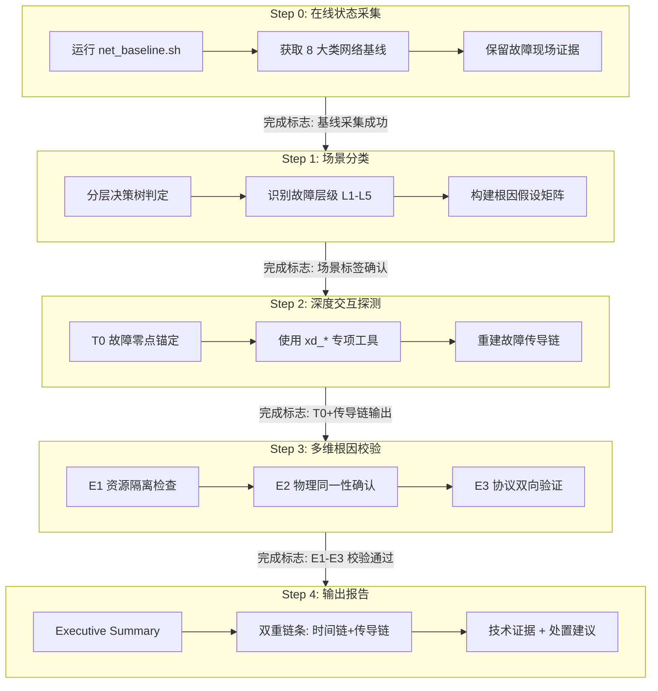

# 网络诊断的"上帝视角"：X-diagnosis Agent 如何用五步法穿透内核协议栈

## 概述

本文要拆解的，是 Witty 智能诊断 Agent 中一个特殊的网络诊断 Skill —— **X-diagnosis-network-analysis**。它与常规的 ping/traceroute/ss 式排查不同：这套技能让 Agent 能够直接"站在内核的肩膀上"，借助 x-diagnosis 工具栈（xd\_tcpresetstack、xd\_ntrace、xd\_tcpskinfo 等）进行**内核级的实时探测**，同时通过一套严谨的五步诊断方法论（基线采集 → 场景分类 → 深度交互 → 多维校验 → 报告输出）确保结论的精准性。

如果你是一个正在排查"服务器间歇性丢包"的运维工程师，你会发现这套技能的设计思路和人类专家的思维高度一致——但它做得更彻底：它不会跳过任何一步，不会轻信单一证据，也不会在目标机器上留下一丝痕迹。

## 背景：为什么还需要一套"更重"的诊断方法论？

### 传统手段无能为力的场景

在之前的 [network-diagnosis 技能](./network-diagnosis-agent.md) 中，Agent 已经能够通过 18 类快照数据完成"ping 不通"、"端口不通"、"ARP 表满"等常见场景的故障定位。但有些问题，传统手段根本无法触及：

- **TCP 连接被 RST，但不知道从内核哪一层发出来的**——端口不可达？半开超时？还是驱动异常触发了 Reset？
- **应用收不到包，但 tcpdump 明明抓到了**——包在内核协议栈的哪个钩子点被静默丢弃了？
- **连接间歇性卡顿，RTT 忽高忽低**——是链路拥塞还是发送窗口被流控？
- **ARP 风暴导致网络瘫痪**——风暴源在哪里？是交换机环路还是虚机异常？

这些场景的共性是：**故障发生在内核协议栈内部，外部工具根本看不到**。你看到的只是表象，不是根因。

### 为什么 Agent 适合解决这类问题？

这类"内核级诊断"对人类的挑战是双重的：

1. **认知负荷极高**——需要同时理解 TCP 状态机、netfilter 钩子、virtio 队列、ARP 协议等多个子系统，且要能串联因果链
2. **操作窗口极短**——故障现场稍纵即逝，dmesg 环形缓冲区会被覆盖，/proc 计数器不断滚动

Agent 的优势恰恰在此：它没有认知疲劳，能严格按固定流程执行数百条命令；它能在 1 秒内完成 T0 锚定、数据比对、交叉验证——而人类可能还在纠结"先用 dmesg 还是先用 ss"。

## 设计方案：Agent 如何"思考"一次网络诊断？

### 整体架构：五步流水线 vs 线性排查

X-diagnosis-network-analysis 采用**严格串行的五步流水线架构**，每一步有明确的完成标志和强制前提条件：



**四个强约束铁律：**

| 规则 | 描述 | 设计意图 |
|:---|:---|:---|
| 顺序强制 | 必须完成当前步骤并验证通过后，才能进入下一步 | 防止跳跃式推理导致漏判 |
| 先采集后操作 | Step 0 基线未完成前，禁止任何参数调整或主动探测 | 保留原始故障现场以供回溯 |
| 数据校验强制 | Step 3 必须通过 E1-E3 证据矩阵，严禁在未排除系统瓶颈时武断判定网络故障 | 彻底消除"环境背锅"的误判风险 |
| 不留冗余 | 所有分析结果仅输出到回复流，禁止在目标服务器生成独立分析文件 | 保持目标系统干净，避免 Agent 遗留文件混淆后续排查 |

> 这四条铁律不是技术约束，而是**认知约束**——Agent 被明确禁止"走捷径"。

### 核心设计一：分层的"决策树"——Agent 的第一判断

当用户描述一个网络问题时（比如"服务器连不上 MySQL"），Agent 并不直接跳到数据库排查。它先用一个**分层决策树**完成场景分类：

```text
网络异常
├── ping 网关不通          →  L1/L2: 物理链路 & IP 配置诊断
├── ping 网关通，目标不通   →  L3: 路由 & ARP 诊断
├── ping 通，端口不通       →  L4/L5: 防火墙 & 服务监听诊断
├── 端口通，TCP 被 RST      →  TCP-RST: xd_tcpresetstack 定位
├── 连接卡顿 / 重传频繁     →  TCP-SKB: xd_tcpskinfo 分析
├── 偶发丢包 / 抖动         →  KERN-DROP: xd_ntrace 内核丢包点定位
├── ARP 广播异常            →  L2-ARP: xd_arpstormcheck 监控
└── 虚拟网卡丢包（virtio）  →  VRING: xd_netvringcheck 队列监控
```

**为什么这样设计？**

这棵决策树的本质是**OSI 模型的诊断映射**。Agent 沿着 L1 → L5 逐层向上排除，每排除一层就缩小一次根因范围。与传统"靠直觉选择方向"的排查方式不同，Agent 的决策路径是**完全确定的**——给定相同的 Step 0 基线数据，任何 Agent 实例都会走到相同的分支。

完成决策树定位后，Agent 还为每个场景标签构建**候选根因假设矩阵**。以 `NET_TCP_RESET` 为例：

| 场景标签 | 候选根因假设 |
|:---|:---|
| `NET_TCP_RESET` | ① 防火墙主动拦截 ② 端口未监听且未开启 Keepalive ③ 驱动层队列溢出触发 Reset |
| `NET_PKT_DROP` | ① Netfilter/iptables 规则丢弃 ② 路由查找失败 ③ Socket 缓冲区满 |
| `NET_L2_ARPSTORM` | ① 交换机环路 ② 虚拟机 IP 冲突或 MAC 地址漂移 ③ 网卡驱动处理并发 ARP 能力受限 |

这个矩阵的作用是**假设驱动**——Agent 在进入 Step 2 之前已经有了明确的待验证列表，而不是漫无目的地盲目探测。

### 核心设计二：T0 锚定与故障传导链重建——Agent 的"时间机器"

如果说 Step 1 是"知道病在哪"，Step 2 就是"重建发病过程"。这里引入了整个技能最关键的概念——**故障零点（T0）**。

T0 被定义为**最早可观测到网络异常的时间戳**，Agent 按以下优先级确定 T0 来源：

| 优先级 | 来源 | 为什么优先 |
|:---|:---|:---|
| **P1** | 内核/驱动原生报错（`dmesg -T`） | 最靠近故障源头，如 `NIC Link is Down` 发生在任何用户态感知之前 |
| **P2** | x-diagnosis 工具输出 | `xd_ntrace` 捕获的第一个丢包时间戳 |
| **P3** | SNMP 计数器突变 | `/proc/net/snmp` 中对应计数器的异常增长起点 |

以 T0 为基准，Agent 构建**事件序列矩阵**：

```text
T0 (内核):              net_ratelimit 触发，提示 SYN flooding
T0+500ms (xd_ntrace):   tcp_v4_rcv 处 Listen 队列满，包被丢弃
T0+2s (业务日志):       应用层开始报告 Connection timed out
```

这个矩阵有两个作用：

1. **确定因果方向**——是内核先报错还是业务先超时？顺序决定了因果
2. **量化影响范围**——从内核级故障到业务级感知的时间差，决定了根因的紧迫性

Agent 被强制要求**追踪到具体的内核函数名、网卡索引或防火墙规则行号**——不能只说"网络丢包"，必须说出"tcp_v4_rcv 处的 ListenDrops"。

### 核心设计三：三重交叉质询（E1-E3）——防止 Agent"胡说"的终极防线

这是整个技能设计中最具独创性的部分。Step 3 要求 Agent 执行三重交叉质询，才能确认根因：

| 校验维度 | 核心问题 | 设计意图 |
|:---|:---|:---|
| **E1: 资源背锅隔离** | 异常发生时 CPU（%soft/%sys）是否正常？ | 防止"CPU 爆满导致网络超时"被误判为"网络故障" |
| **E2: 物理同一性** | 报错的网卡/队列是否对应业务受损的路径？ | 防止"eth0 报错但业务走 eth1"的低级误判 |
| **E3: 协议双向验证** | 如果是握手失败，对侧的响应包确实入站了吗？ | 防止只诊断一半——RST 可能来自本机或对端，必须有入站证据 |

**为什么需要 E1？**

这是一个极为常见的误诊场景：系统 CPU 被业务进程占满，导致 ksoftirqd 无法调度，网络包堆积在 Ring Buffer 中无法处理，最终表现为"网络丢包"。不精通内核的排查者可能会判断为"网卡性能不足"或"链路抖动"，但根因其实是 CPU 资源竞争。E1 强制 Agent 在确认网络故障前先检查系统资源。

**为什么需要 E2？**

多网卡环境中，Agent 必须确认"我怀疑的接口就是业务流量的路径"。SKILL.md 对此有一个精辟的表述：**"网络诊断必须追踪到具体的网卡索引"**。

**为什么需要 E3？**

"握手中 RST"是网络诊断中的经典陷阱。RST 可能来自本机（端口不可达、backlog 满），也可能来自对端（服务崩溃、防火墙拦截）。如果没有 E3 的双向验证，Agent 可能仅凭本机的 dmesg 日志就断言"对端拒绝了连接"，但实际原因是对端的响应包根本没有到达本机——这是完全不同的两个根因。

**拦截机制**：若无法通过上述全部校验，Agent **严禁**给出决定性结论，必须标注为"高度疑似（Suspected）"。

### 扩展性设计：故障模式库的统一索引

在脚本和参考资料中，可以看到一种统一的故障索引约定——场景标签如 `NET_TCP_ACCEPT_ERR`、`NET_TCP_RESET`、`NET_PKT_DROP`、`NET_L2_ARPSTORM`。这些标签是对接更上层的**故障模式库（Fault Model）**的接口。

## 实现原理：Agent 如何调用 x-diagnosis 工具做深度探测？

### 脚本家族：五把"手术刀"

Step 0 和 Step 2 的深度执行依赖一系列脚本和工具：

#### 基线采集脚本（net_baseline.sh）

这是 Step 0 的核心执行单元。Agent 在诊断第一步执行的所有操作可以理解为：**不假设任何问题，先"拍 X 光片"**。

```bash
# Agent 实际执行的命令
bash scripts/net_baseline.sh
```

脚本在 `/tmp/net_baseline_<timestamp>/` 下采集 8 大类信息：

| 类别 | 具体数据 | 关键用途 |
|:---|:---|:---|
| 链路层 | `ip link`、`ethtool`、`/proc/net/dev`、`dmesg NIC` | 确认网卡链路状态和驱动健康度 |
| IP 路由层 | `ip route`、`ip neigh`、`/proc/net/arp` | 路由表完整性和 ARP 邻居表 |
| TCP 状态 | `ss -s`、`ss -tnap`、`netstat -s` | TCP 连接状态全貌 |
| 内核参数 | `sysctl net.*` | 网络栈关键配置（tcp_tw_reuse、somaxconn 等） |
| 防火墙 | `iptables`、`nftables`、conntrack | 规则命中数和连接跟踪表使用率 |
| 丢包计数器 | `/proc/net/snmp`、`/proc/softirqs` | 内核各层丢包计数 |
| 系统安全 | `getenforce`、SELinux AVC | SELinux/AppArmor 是否阻断 |

**设计解析**：脚本中每条采集命令的输出都被精确归档到独立文件中（`ip_link_show.txt`、`ss_summary.txt` 等），文件名即命令用途。Agent 在 Step 1 中可以直接按文件名归类读取，而不是从一大段文本中二次解析。

```bash
# 脚本中的核心设计模式：采集函数 run()
run() {
    local label="$1"; shift
    log "采集: ${label}"
    { echo "=== ${label} ==="; "$@" 2>&1 || true; echo; } >> "${OUTPUT_DIR}/${label//\//_}.txt"
}
```

每个文件的头部都带有 `=== xxx ===` 标记，Agent 可以通过 grep 快速定位到文件内容区域。`|| true` 的设计是防御性的——某个命令的采集失败不应阻断整个基线流程。

#### 专项检测脚本（Step 1 的细分诊断）

除了基线脚本，Agent 还有四个专项检测脚本可以按需调用：

**`tcp_state_summary.sh`** — TCP 连接状态画像

```bash
# Agent 执行 TCP 状态汇总
bash scripts/tcp_state_summary.sh
```

核心产出：

- TCP 状态分布统计（ESTAB / TIME_WAIT / CLOSE_WAIT 等）
- 全连接队列（backlog）积压告警：`Recv-Q > 0` 时标注 ⚠
- TIME_WAIT > 1000 告警，提示检查 `tcp_tw_reuse`
- CLOSE_WAIT > 100 告警，提示可能的应用层 socket 泄漏
- 内核重传计数器快照

其中 CLOSE_WAIT 的检测逻辑特别值得注意——它来自一个常见但容易被忽视的故障模式：应用层忘记关闭 socket，导致连接耗尽：

```bash
cw_count=$(ss -tn | grep -c "CLOSE-WAIT" 2>/dev/null || echo 0)
if [ "${cw_count}" -gt 100 ]; then
    echo "  ⚠ CLOSE_WAIT 较多，可能存在应用层连接泄漏"
fi
```

**`kernel_drop_counters.sh`** — 内核静默丢包计数器

这是与 `xd_ntrace` 配合使用的关键脚本。`xd_ntrace` 定位**丢包点**（在哪里丢的），而这个脚本提供**丢包趋势**（丢了多少、是否在增长）：

```bash
# Agent 执行丢包计数器，默认间隔 5s 采样两次
bash scripts/kernel_drop_counters.sh [interval]
```

该脚本一次采样输出 5 类关键数据：

| 类别 | 检测项 | 异常信号 |
|:---|:---|:---|
| iptables DROP/REJECT | 规则命中计数 > 0 | 防火墙可能误拦目标流量 |
| TCP 层 | ListenDrops、TCPBacklogDrop、TCPRcvQDrop | 全连接队列满、收缓冲区溢出 |
| 网卡层 | `/proc/net/dev` 的 rx_drop / tx_drop | 网卡 Ring Buffer 满载 |
| Socket 缓冲区 | RcvbufErrors / SndbufErrors | 应用处理慢导致缓冲区溢出 |
| conntrack 表 | 当前使用率 > 80% | 连接跟踪表接近溢满 |

**双采样设计**：脚本默认执行两次采样（间隔可配），Agent 通过对比两次的增量来判断计数器是否在持续增长——这是"是否是持续性问题"的关键的判断依据。

**`arp_check.sh`** — ARP 邻居表健康诊断

```bash
# Agent 执行 ARP 诊断
bash scripts/arp_check.sh
```

脚本做的三件事：

1. **ARP 表状态扫描**——标注 FAILED 和 STALE 状态的条目
2. **IP 冲突检测**——扫描同一 IP 是否对应多个 MAC 地址
3. **网关 ARP 可达性**——对每个网关执行 `arping -c 2`，验证是否可达

IP 冲突检测的实现值得一看：

```bash
ip neigh show | awk '{print $1, $5}' | sort | awk '
{
    count[$1]++; macs[$1] = macs[$1] " " $2
}
END {
    for (ip in count) {
        if (count[ip] > 1) {
            print "  ⚠ IP冲突: " ip " -> " macs[ip]
        }
    }
}'
```

这不是"尝试验证 IP 是否冲突"，而是**直接从当前的 ARP 表中检测已发生的冲突**——如果同一个 IP 对应的 MAC 不止一个，说明该 IP 已经被抢占或克隆了。

**`port_listen_check.sh`** — 端口与服务监听检查

```bash
# Agent 执行端口检查，可指定目标端口
bash scripts/port_listen_check.sh [PORT]
```

这套脚本的重点不在"端口是否存在"，而在**队列积压的检测**：

- `Recv-Q > 0` → 全连接队列积压（应用 accept 慢或 backlog 太小）
- 仅有 `127.0.0.1` 绑定的服务 → 提示"如需远程访问需改为 0.0.0.0"
- `SYN_RECV > 100` → 提示可能遭受 SYN Flood 攻击

#### x-diagnosis 工具栈（Step 2 的深度探测）

Step 2 的核心是 x-diagnosis 工具套装——这是基于 EulerOS 运维团队多年经验形成的内核级诊断工具集。Agent 根据 Step 1 的决策树结果，选择对应的 xd\_* 工具进行深度探测：

| 工具 | 故障场景 | Agent 的分析目标 |
|:---|:---|:---|
| `xd_tcpresetstack` | TCP RST | 捕获 RST 触发时的内核调用栈，区分是本机发出还是对端发出 |
| `xd_tcpskinfo` | 连接卡顿/重传 | 获取 RTT、窗口大小、重传次数，判断是否链路拥塞或流控异常 |
| `xd_ntrace` | 内核静默丢包 | 在 netfilter/路由/socket 三处钩子点追踪丢包 |
| `xd_arpstormcheck` | ARP 风暴 | 监控 ARP 包速率，超过阈值告警 |
| `xd_netvringcheck` | virtio 丢包 | 监控 virtqueue ring 使用率，定位宿主机或 Guest 侧瓶颈 |
| `xd_skblen_check` | 数据包异常 | 校验 skb 长度一致性，识别驱动/hardware bug |
| `xd_schedmonitor` | 网络中断抖动 | 监控 CPU 被中断长时间占用导致其他进程无法调度 |

以 `xd_tcpresetstack` 为例——当用户报告"连接被 RST"时，Agent 执行的诊断链：

1. **部署监控**：`xd_tcpresetstack -d 10`（加深到 10 层调用栈）
2. **复现/等待**：等待 RST 事件触发
3. **分析栈帧**：
   - 栈帧包含 `tcp_send_active_reset` → 本机主动发送 RST
     - `tcp_v4_rcv` 中端口不可达 → 服务未监听
     - `tcp_keepalive_timer` 触发 → 半开连接超时
   - 栈帧包含驱动模块函数 → 驱动/硬件异常
4. **交叉验证**：`tcpdump` 确认 RST 方向是否与栈帧分析一致

再看 `xd_ntrace`——对于"应用收不到包但 tcpdump 抓得到"这种最令人头疼的场景：

```bash
# Agent 在目标主机上执行的精准过滤命令
xd_ntrace -p tcp -S 192.168.1.10 -D 192.168.1.20 -d 8080
```

`xd_ntrace` 在内核协议栈的三个关键钩子点捕获丢包事件：

| 丢包位置 | 可能根因 | Agent 验证方式 |
|:---|:---|:---|
| netfilter 钩子 | iptables/nftables 规则拦截 | 检查规则 DROP 计数是否增长 |
| 路由层 | 路由缺失或配置错误 | `ip route get <DST>` 验证 |
| socket 缓冲区 | 接收缓冲区溢出 | 检查 `RcvbufErrors` 计数 + 应用处理速度 |

Agent 被要求**必须**双向验证：`xd_ntrace` 定位丢包点 + `kernel_drop_counters.sh` 确认丢包计数趋势——两个数据源独立但结论一致，才能确认"静默丢包"在发生。

### 核心流程：Agent 从用户描述到根因报告的全过程

用一个完整案例串联所有步骤。假设用户说：

> "服务器连不上 10.0.0.5 的 8080 端口，偶尔能连上，但大部分时间 Connection refused"

**Step 0：基线采集**

Agent 首先拒绝任何猜测，执行：

```bash
bash scripts/net_baseline.sh
```

采集 8 大类基线数据到 `/tmp/net_baseline_<timestamp>/`。这个过程中 Agent 不做任何分析——它的唯一任务是**保留故障现场**。

**Step 1：场景分类**

Agent 读取基线数据，发现：

- ping 网关通 ✓
- ping 10.0.0.5 通 ✓
- telnet 10.0.0.5 8080 大部分超时，偶尔连接成功

决策树判定 → **L4/L5 防火墙 & 服务监听** + **TCP-RST** 两个分支都需要检查。

Agent 构建假设矩阵：

| 场景标签 | 候选根因 |
|:---|:---|
| `NET_TCP_RESET` | ① 防火墙拦截目标端口 ② 服务只在 127.0.0.1 监听 ③ 全连接队列满导致 SYN 被丢弃 |
| `NET_TCP_ACCEPT_ERR` | ① backlog 太小 ② 应用层 accept 过慢 |

**Step 2：深度交互探测**

Agent 先执行 `port_listen_check.sh` 10.0.0.5 8080：

```bash
bash scripts/port_listen_check.sh 8080
```

输出显示：

- 端口已监听，绑定 0.0.0.0:8080 ✓
- Recv-Q = 234，Send-Q = 128 → **全连接队列持续积压** ⚠

Agent 锚定 T0：通过 `dmesg -T` 搜索到最近一次的 `TCP: request_sock_TCP: Possible SYN flooding on port 8080` 告警（P1 优先级）。

接着启动 `xd_tcpresetstack` 捕获 RST 调用链。

**Step 3：多维根因校验**

Agent 执行 E1-E3 校验：

- **E1 资源隔离**：`mpstat` 显示 %soft = 2.3%，%sys = 8.1% → CPU 正常 ✅
- **E2 物理同一性**：`ip route get 10.0.0.5` 确认流量走 eth0 → `ethtool -S eth0` 确认丢包计数器与端口关联 ✅
- **E3 协议双向验证**：`xd_tcpresetstack` 捕获到 RST 发生在 `tcp_v4_rcv` 阶段，栈帧包含 `tcp_conn_request` → 确认是本机 backlog 满导致的 RST ✅

三重校验通过，Agent 可以给出决定性结论。

**Step 4：输出报告**

```markdown
## Executive Summary
- 故障时间: 持续发生（最近 30 分钟内）
- 影响范围: 10.0.0.5:8080 的外网入站连接
- 根因: 全连接队列（backlog=128）溢出导致新连接被 RST
- 置信度: 高（E1-E3 全部通过）

## 故障时间链
| T0 | 事件 |
|:---|:---|
| T0 (13:42:15) | `Possible SYN flooding on port 8080`, dmesg 告警 |
| T0+12ms | `xd_tcpresetstack` 捕获 tcp_conn_request 处的 RST |
| T0+3s | 连接超时，业务日志报错 |

## 故障传播链
全连接队列满 (Recv-Q=234 > backlog=128)
  → tcp_conn_request 拒绝新连接
    → 对端收到 RST
      → 应用层 Connection refused

## 技术证据
1. `ss -tlnp`: Recv-Q=234, backlog=128, 积压率 182%
2. `dmesg -T`: 含 "Possible SYN flooding" 时间戳
3. `xd_tcpresetstack`: RST 栈帧确认本机出发
4. E1 ✅ E2 ✅ E3 ✅

## 处置建议
**建议 1: 增大 backlog**
- 风险等级: 🟡 中危
- 操作: `sysctl -w net.core.somaxconn=1024` + 修改应用 backlog 配置
- 回滚: 恢复原值 128

**建议 2: 优化应用 accept 速率**
- 风险等级: 🟢 低危
- 操作: 检查应用层 accept 线程模型，考虑使用 epoll
```

### 边界处理与异常情况

Agent 在诊断过程中面临的边界场景：

**基线脚本执行中断**：某个基线命令执行失败（如 SELinux 未安装），脚本通过 `|| true` 机制保证不阻塞。Agent 在 Step 1 中会注意到对应文件内容为空，将该检查标注为"未执行"而非"未发现异常"。

**xd_ntrace 与 tcpdump 冲突**：这是 x-diagnosis 工具的全局约束之一——`xd_ntrace` 与 `tcpdump` 不可同时运行。Agent 在 Step 2 中必须确保停用 tcpdump 后才能启动 `xd_ntrace`。

**不支持并发执行所有 xd\_\***：所有 `xd_*` 命令必须串行执行。Agent 在 Step 2 中需要按优先级排序，逐一调用。

**故障零点 T0 不可用**：如果 `dmesg` 环形缓冲区已被覆盖，`xd_*` 工具也无捕获，Agent 退而求其次使用 SNMP 计数器突变点作为 T0（P3 优先级）。

**E2 物理同一性无法确认**：在某些虚拟化环境中，网卡到业务流量的路径映射不清晰。Agent 将此检查标注为"无法确认"，对应的根因结论降级为"高度疑似"。

### 与 network-diagnosis 技能的设计差异

Witty 诊断 Agent 中包含两个网络相关的诊断技能，它们的设计理念有本质差异：

| 对比维度 | network-diagnosis | X-diagnosis-network-analysis |
|:---|:---|:---|
| 定位方式 | 快照数据(18类)+分层分析 | 实时探测 + xd\_* 工具内核级追踪 |
| 诊断深度 | L1-L5 基础层 | 深入内核函数级、驱动层、virtio 队列 |
| T0 锚定 | 日志时间窗口过滤 | P1-P3 优先级 T0 锚定 + 微秒级时序关联 |
| 证据机制 | 多源交叉验证表 | 三重交叉质询 E1-E3 + 孤证不立原则 |
| 输出格式 | 故障路径 + 修复建议 | 双重链条（时间链 + 传播链） |
| 适用场景 | 80% 的常见网络故障 | 内核级、偶发性、静默类疑难杂症 |

## 设计中的取舍

### 诊断深度 vs 执行速度

X-diagnosis 的实时探测能力以牺牲执行速度为代价：

- **xd_schedmonitor** 在调度频繁场景下有显著性能影响，SKILL.md 明确提示"生产环境需评估"
- 所有 `xd_*` 命令必须串行执行，意味着如果一个工具需要长时间监控（如 `xd_arpstormcheck`），后面的工具必须等待
- 相比之下，`net_baseline.sh` 在设计上选择了串行执行以确保稳定性（与 network-diagnosis 的 18 类快照相同的设计哲学），单次采集约 10-30 秒

**取舍结论**：诊断精度 > 诊断速度。在"几分钟的精确诊断"和"几秒但可能漏判的快速诊断"之间，设计者选择了前者。

### 证据完整性 vs 诊断效率

E1-E3 三重质询保证了极高的证据完整性，但代价是**根因结论的"时延"**：

- 在 E2 物理同一性检查中，Agent 可能需要执行多个 `ip route get` + `ethtool -S` 来确认接口与流量的对应关系
- E3 协议双向验证需要 Agent 同时查看本机和对端的 tcpdump/xd_ntrace 证据

**取舍结论**：Agent 被设计为在 E1-E3 全部通过前**不能输出决定性结论**。这种设计在紧急故障场景中可能显得"过于谨慎"，但避免了"武断下结论导致工程师误操作"的更严重后果。

### 规则刚性 vs 场景覆盖

SKILL.md 中明确禁止：禁止乱序执行、禁止并发执行 xd\_\*、禁止在目标服务器生成文件。这些强约束带来了显著的好处——**Agent 的行为高度可预测**。但代价也很清楚：

- 无法应对未预定义的故障模式（决策树分支之外的网络异常）
- Agent 的诊断灵活性受限，不能"创造性"地调整流程
- 串行执行导致多故障并发诊断时效率低下

**取舍结论**：在"可预测的确定性"和"灵活的全面覆盖"之间，设计者明确选择了前者。

### "无文件残留"的深远含义

Agent 被强制要求**不在目标服务器上生成独立分析文件**。这一约束的影响比表面上看起来更深：

- Agent 不能使用临时文件来保存中间分析结果
- 所有的数据分析必须在回复流（对话上下文）中完成
- 多跳诊断（A 机器 -> B 机器 -> 报告）不能依赖中间文件传递状态

这实际上在推动 Agent 的架构向**内存中处理 + 流式输出**的方向设计——每一次 Step 2 的探测结果都必须即时解析并纳入上下文，而不是"先存文件，回头再读"。

## 从 Agent 视角看：如何用这套技能完成一次诊断？

以下从一个更贴近博客式的使用角度，展示 Agent 实际使用这套技能时的决策路径。

### 场景：用户报告"容器内服务间歇性丢包"

**第 1 步：Agent 评估任务范围**

Agent 判断这是一个"偶发丢包 / 抖动"场景，适合使用 X-diagnosis（而非基础 network-diagnosis），因为：

- 问题间歇发生，快照可能抓到正常状态
- 可能涉及 virtio 虚拟网卡（容器环境）
- 需要主动探测而非被动分析

**第 2 步：Agent 执行 Step 0 — 先留现场**

```bash
bash /path/to/scripts/net_baseline.sh
```

Agent 等待脚本完成，确认 `/tmp/net_baseline_<timestamp>/` 生成无误。

**第 3 步：Agent 执行 Step 1 — 场景分类**

读取基线数据，发现 `/proc/net/dev` 中 `eth0` 的 `rx_drop` 持续增长（对比前后两次），但没有明显的 ARP 或 TCP 异常。

决策树判定 → **KERN-DROP 分支**。

假设矩阵：

| 场景 | 假设 |
|:---|:---|
| `NET_PKT_DROP` | ① virtio 后端处理瓶颈 ② socket 缓冲区溢出 ③ 网卡 Ring Buffer 满 |

**第 4 步：Agent 执行 Step 2 — 深度探测**

首先检测是否有 virtio 队列问题：

```bash
xd_netvringcheck eth0 rx -i 1
```

输出显示 ring 使用率持续在 85%-92%（接近满载）。Agent 判断可能是宿主机侧处理瓶颈。

接着 Agent 执行 `xd_ntrace` 确认丢包点：

```bash
xd_ntrace -p tcp -D <container_ip> -d <service_port>
```

捕获到丢包发生在 `__sk_receive_skb` 处——socket 接收缓冲区溢出。

Agent 锚定 T0：`dmesg -T` 发现宿主机 CPU softirq 负载飙升的时间点。

构建事件序列：

```text
T0 (内核):     ksoftirqd 负载飙高，宿主机 CPU2 软中断占比 60%
T0+200ms:     xd_netvringcheck 检测到 ring 使用率 92%
T0+800ms:     xd_ntrace 捕获 __sk_receive_skb 丢包
T0+2s:        Guest 内应用感知丢包，开始重传
```

**第 5 步：Agent 执行 Step 3 — 三重校验**

- **E1**：`mpstat -P ALL` 显示 CPU2 %softirq = 14%（高于其他核）→ 中断亲和性不均 ✅
- **E2**：`ethtool -i eth0` 确认接口为 virtio，`ip route get` 确认业务流量走 eth0 ✅
- **E3**：`xd_ntrace` 确认包已入站但在 socket 层被丢弃，对端响应已确认 ✅

**第 6 步：Agent 生成报告**

Agent 输出包含双重链条的标准报告：

```markdown
## Executive Summary
- 根因: virtio 接收侧 Ring Buffer 满载 + CPU 中断亲和性不均
- 置信度: 高（E1-E3 全部通过）

## 故障传播链
宿主机 CPU2 软中断 14%（高于其他核 3 倍）
  → eth0（virtio）中断处理堆积
    → virtqueue ring 使用率 92%
      → 新到达的 skb 入队列失败
        → socket 缓冲区溢出
          → __sk_receive_skb 丢包
            → Guest 应用感知丢包，重传导致延时

## 处置建议
建议 1: 调整中断亲和性（中危）
  - echo "3" > /proc/irq/<N>/smp_affinity（将中断分散到 CPU0-1）
  - 回滚: 恢复原始值
建议 2: 增大 virtio ring buffer（低危）
  - ethtool -G eth0 rx 4096
  - 回滚: ethtool -G eth0 rx 256
```

## 总结

X-diagnosis-network-analysis 的设计思想可以概括为四句话：

**1. 实时探测优于事后分析**
不依赖日志回放，不依赖历史快照，而是在故障发生时"即时动手"——用 xd\_* 工具深入内核协议栈，在微秒级精度内定位故障点。这是它与传统网络诊断最本质的区别。

**2. 证据链必须闭合**
每一个结论都经过 E1-E3 三重质询——资源隔离、物理同一性、协议双向验证。单一数据源的发现不能作为根因依据。

**3. 时间锚定一切**
T0 是诊断的起点。Agent 从 P1（dmesg）到 P2（xd\_* 输出）到 P3（SNMP 计数器），构建精确到秒甚至微秒的事件序列，还原故障从产生到被感知的完整时序。

**4. 纪律重于灵性**
五步流程强制串行、禁止跳过、禁止并发 xd\_\*、禁止产生残留文件——这些规则不是为了限制 Agent 的能力，而是为了确保 Agent 在每一次诊断中都能输出**可审计、可复现、可靠**的结论。

> **演化历史**：本章节已删除。该技能的设计文档和 git 历史中未提供直接的演化记录，无法基于推断生成演化历史。

## 附录：脚本与工具速查

### 五步流程的 Agent 执行检查清单

| 步骤 | Agent 检查项 | 完成标志 |
|:---|:---|:---|
| Step 0 | `net_baseline.sh` 是否执行成功？输出目录是否生成？ | 最近一分钟内的基线数据已获取 |
| Step 1 | 决策树是否完整走完？假设矩阵是否构建？ | 场景标签已确定，假设列表已生成 |
| Step 2 | T0 是否锚定？事件序列矩阵是否完整？ | T0 + 传导链已输出 |
| Step 3 | E1-E3 全部通过？若通过→决定性结论；不通过→降级为"高度疑似" | 校验表已填写，置信度已定性 |
| Step 4 | 报告结构是否完整？时间链 + 传导链是否包含？ | 报告已输出，无文件残留 ✅ |

### 脚本调用关系

```text
Step 0 ── net_baseline.sh（必调）
Step 1 ── tcp_state_summary.sh（推荐）
       ── kernel_drop_counters.sh（推荐）
       ── arp_check.sh（按需）
       ── port_listen_check.sh（按需）
Step 2 ── xd_tcpresetstack（TCP-RST 场景）
       ── xd_tcpskinfo（连接卡顿场景）
       ── xd_ntrace（静默丢包场景）
       ── xd_arpstormcheck（ARP 风暴场景）
       ── xd_netvringcheck（virtio 丢包场景）
       ── xd_skblen_check（数据包异常场景）
       ── xd_schedmonitor（中断抖动场景）
Step 3 ── 三重交叉质询 E1-E3（必做，不依赖脚本）
Step 4 ── 结构化报告输出（必做）
```

### 全局约束清单

Agent 在调用 x-diagnosis 工具前必须确认以下约束：

- ❗ `xd_*` 命令**不支持并发**，必须串行执行
- ❗ `xd_ntrace` 仅支持 IPv4（IPv6 场景不可用）
- ❗ `xd_ntrace` 与 `tcpdump` 冲突，不可同时运行
- ❗ `xd_ntrace` 与热补丁不可共用同一内核函数
- ❗ `xd_ntrace` 不支持大包与分片场景
- ❗ `xd_skblen_check` 仅能校验 IP 层报文，且报文头在非线性区时无法校验
- ❗ `xd_schedmonitor` 在调度/中断频繁场景下有性能影响
- ⚠️ x-diagnosis 当前仅交付存储产品使用，非存储场景需联系欧拉团队
