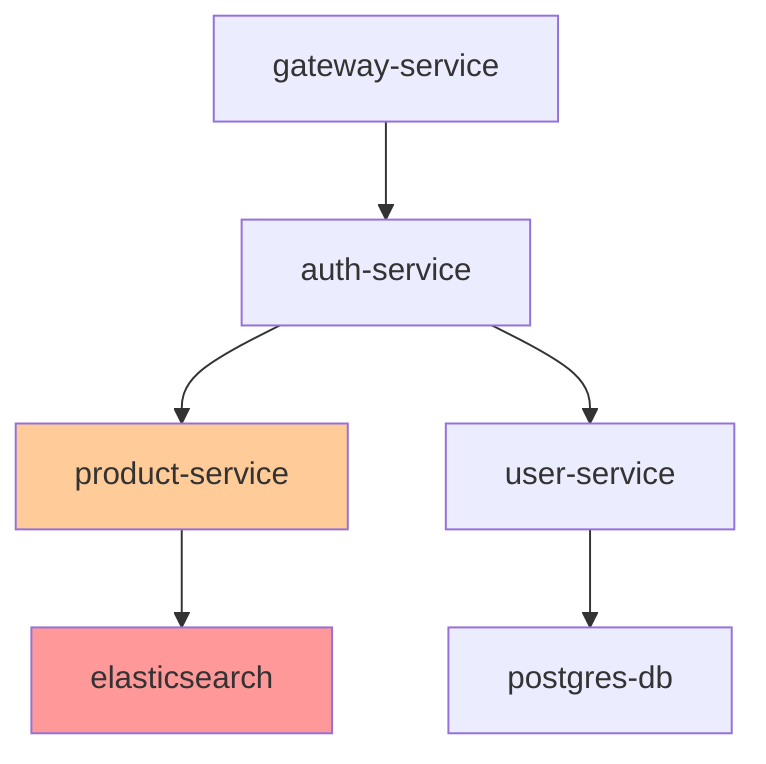

# 服务调用追踪示例

## 场景描述

在一个基于微服务架构的电商系统中，用户报告商品搜索功能响应缓慢。系统包含以下服务：
- `gateway-service`：API网关，接收所有外部请求
- `auth-service`：身份验证服务，验证JWT令牌
- `product-service`：商品服务，处理商品搜索和详情
- `elasticsearch`：搜索引擎，存储和索引商品数据
- `user-service`：用户服务，管理用户信息
- `postgres-db`：主数据库，存储用户和订单数据

用户执行商品搜索时，完整的调用链路应该是：
```
gateway-service → auth-service → product-service → elasticsearch
```

## 前置条件

### 系统要求
- 欧拉OS 2.0或更高版本
- 已部署完整的微服务架构
- 已配置分布式追踪系统（如Jaeger、Zipkin）
- 追踪数据已收集并导出为JSON格式

### 配置要求
- 确保所有服务都正确配置了追踪ID传播
- 追踪数据包含完整的调用链路信息
- 时间戳格式统一（建议使用ISO 8601）

### 数据准备
1. 从追踪系统导出相关时间段的追踪数据
2. 确保数据包含完整的traceId、spanId、parentSpanId关系
3. 验证服务名称和操作名称的准确性
4. 准备测试输入文件：`product-search-trace.json`

## 执行步骤

### 步骤1：准备追踪数据

创建包含商品搜索调用链路的追踪数据文件：

```json
// product-search-trace.json
[
  {
    "traceId": "search-trace-001",
    "spanId": "span-gateway",
    "parentSpanId": null,
    "operationName": "HTTP GET /api/products/search",
    "startTime": "2026-02-03T10:30:00.123Z",
    "duration": 1250,
    "tags": {
      "http.method": "GET",
      "http.path": "/api/products/search",
      "http.status_code": 200,
      "component": "nginx",
      "service.name": "gateway-service",
      "user.id": "user-12345",
      "query": "laptop"
    }
  },
  {
    "traceId": "search-trace-001",
    "spanId": "span-auth",
    "parentSpanId": "span-gateway",
    "operationName": "JWT Token Validation",
    "startTime": "2026-02-03T10:30:00.168Z",
    "duration": 45,
    "tags": {
      "component": "spring",
      "service.name": "auth-service",
      "token.valid": true,
      "user.role": "customer"
    }
  },
  {
    "traceId": "search-trace-001",
    "spanId": "span-product",
    "parentSpanId": "span-auth",
    "operationName": "Search Products",
    "startTime": "2026-02-03T10:30:00.213Z",
    "duration": 1150,
    "tags": {
      "component": "spring",
      "service.name": "product-service",
      "search.query": "laptop",
      "search.results": 125
    }
  },
  {
    "traceId": "search-trace-001",
    "spanId": "span-es",
    "parentSpanId": "span-product",
    "operationName": "Elasticsearch Query",
    "startTime": "2026-02-03T10:30:00.263Z",
    "duration": 1100,
    "tags": {
      "component": "elasticsearch",
      "service.name": "elasticsearch",
      "db.system": "elasticsearch",
      "db.query": "{\"query\": {\"match\": {\"name\": \"laptop\"}}}",
      "hits.total": 125
    }
  },
  {
    "traceId": "search-trace-001",
    "spanId": "span-user",
    "parentSpanId": "span-auth",
    "operationName": "Get User Profile",
    "startTime": "2026-02-03T10:30:00.218Z",
    "duration": 120,
    "tags": {
      "component": "spring",
      "service.name": "user-service",
      "db.system": "postgresql",
      "db.operation": "SELECT",
      "user.id": "user-12345"
    }
  }
]
```

### 步骤2：执行链路追踪分析

使用trace-analyzer技能分析服务调用链路：

```bash
# 基础分析：识别性能瓶颈
claude witty-diagnosis:trace-analyzer \
  --session-id "product-search-analysis-001" \
  --trace-data product-search-trace.json \
  --analysis-type latency \
  --latency-threshold-ms 500 \
  --output-format json \
  --verbosity info
```

### 步骤3：分析依赖关系

进一步分析服务间的依赖关系：

```bash
# 依赖关系分析
claude witty-diagnosis:trace-analyzer \
  --session-id "dependency-analysis-001" \
  --trace-data product-search-trace.json \
  --analysis-type dependency \
  --dependency-depth 3 \
  --visualization-format mermaid \
  --output-format json
```

### 步骤4：综合全面分析

执行包含所有分析维度的全面分析：

```bash
# 全面分析：性能+依赖+根因+可视化
claude witty-diagnosis:trace-analyzer \
  --session-id "comprehensive-analysis-001" \
  --trace-data product-search-trace.json \
  --analysis-type comprehensive \
  --latency-threshold-ms 500 \
  --dependency-depth 5 \
  --visualization-format mermaid \
  --output-format json \
  --include-raw-trace false
```

## 预期结果

### 性能分析结果

分析应识别出以下关键发现：

1. **总体延迟**：1250ms，超过可接受范围（目标<500ms）
2. **主要瓶颈**：elasticsearch查询耗时1100ms，占总延迟的88%
3. **关键路径**：gateway-service → auth-service → product-service → elasticsearch
4. **异常模式**：elasticsearch响应时间显著高于其他服务

### 依赖关系分析结果

分析应生成以下依赖关系：

1. **直接依赖**：
   - gateway-service → auth-service
   - auth-service → product-service
   - auth-service → user-service
   - product-service → elasticsearch
   - user-service → postgres-db

2. **依赖强度**：
   - product-service对elasticsearch的依赖强度：0.95（极强）
   - auth-service对user-service的依赖强度：0.65（中等）

### 可视化输出

生成的Mermaid拓扑图：



### 根因定位结果

分析应定位以下根因：

1. **主要根因**：elasticsearch查询性能问题
   - 置信度：0.92
   - 证据：延迟贡献度88%，位于关键路径末端
   - 影响范围：所有商品搜索请求

2. **次要根因**：product-service处理逻辑可能优化
   - 置信度：0.68
   - 证据：在elasticsearch查询前的处理耗时50ms

## 故障排除

### 常见问题1：追踪数据不完整

**症状**：分析结果显示数据质量评分低，警告信息提示span缺失
**解决方法**：
1. 检查追踪系统配置，确保所有服务都正确上报追踪数据
2. 验证traceId在服务间正确传播
3. 检查网络连接和追踪收集器状态

```bash
# 检查数据完整性
claude witty-diagnosis:trace-analyzer \
  --trace-data product-search-trace.json \
  --analysis-type latency \
  --verbosity debug
```

### 常见问题2：时间戳格式不一致

**症状**：时序分析结果异常，时间线显示错误
**解决方法**：
1. 统一所有服务的时间戳格式为ISO 8601
2. 确保时区配置一致
3. 使用追踪系统的标准化时间戳输出

```json
// 正确的时间戳格式
{
  "startTime": "2026-02-03T10:30:00.123Z",  // ISO 8601 with milliseconds
  "duration": 1250  // milliseconds
}
```

### 常见问题3：服务名称不一致

**症状**：依赖分析显示重复服务或无法识别服务
**解决方法**：
1. 标准化所有服务的命名规范
2. 在追踪配置中统一service.name标签
3. 使用服务发现机制自动注册服务名称

```json
// 统一的服务名称标签
{
  "tags": {
    "service.name": "product-service",  // 使用统一命名
    "service.version": "1.2.0",
    "deployment.environment": "production"
  }
}
```

### 常见问题4：分析性能问题

**症状**：大规模追踪数据分析耗时过长
**解决方法**：
1. 使用时间窗口过滤，只分析相关时间段
2. 采样分析，减少数据量
3. 增加分析超时时间

```bash
# 使用时间窗口过滤
claude witty-diagnosis:trace-analyzer \
  --trace-data product-search-trace.json \
  --time-window-start "2026-02-03T10:00:00Z" \
  --time-window-end "2026-02-03T11:00:00Z" \
  --timeout 600  # 增加超时时间
```

## 优化建议

基于分析结果，提出以下优化建议：

### 立即执行（高优先级）
1. **优化elasticsearch查询**：
   - 检查查询DSL，优化搜索条件
   - 添加适当的索引
   - 考虑查询缓存

2. **监控elasticsearch性能**：
   - 设置性能基线
   - 配置告警规则
   - 定期性能评估

### 短期优化（中优先级）
1. **优化product-service**：
   - 异步处理非关键逻辑
   - 实现请求批处理
   - 添加本地缓存

2. **服务降级策略**：
   - 为elasticsearch依赖添加熔断器
   - 实现优雅降级（返回缓存结果）
   - 配置超时和重试策略

### 长期架构优化（低优先级）
1. **架构改进**：
   - 考虑引入搜索服务专用缓存层
   - 评估搜索引擎替代方案
   - 实现读写分离

2. **容量规划**：
   - 基于历史数据分析容量需求
   - 规划弹性扩展方案
   - 建立性能SLA

## 验证方法

### 验证优化效果
1. **性能对比**：优化后重新执行追踪分析，对比延迟数据
2. **用户反馈**：监控用户报告的响应时间问题
3. **系统指标**：观察系统吞吐量和错误率变化

### 自动化验证脚本
```bash
#!/bin/bash
# 自动化验证脚本

# 执行优化前的基准测试
echo "执行优化前基准测试..."
claude witty-diagnosis:trace-analyzer \
  --session-id "benchmark-before" \
  --trace-data before-optimization.json \
  --analysis-type latency \
  --output-format json > before.json

# 执行优化
echo "执行优化措施..."
# 这里执行实际的优化操作

# 执行优化后的测试
echo "执行优化后测试..."
claude witty-diagnosis:trace-analyzer \
  --session-id "benchmark-after" \
  --trace-data after-optimization.json \
  --analysis-type latency \
  --output-format json > after.json

# 对比结果
echo "对比分析结果..."
python3 compare_results.py before.json after.json
```

## 总结

本示例展示了如何使用trace-analyzer技能分析电商系统中的商品搜索调用链路。通过分析，我们成功识别了elasticsearch查询作为主要性能瓶颈，并提出了针对性的优化建议。该技能能够：

1. **准确重建调用链路**：清晰展示服务间调用关系
2. **识别性能瓶颈**：定位延迟最高的服务节点
3. **分析依赖关系**：理解系统架构和依赖强度
4. **提供优化建议**：基于分析结果提出具体改进措施
5. **支持决策制定**：为架构优化和容量规划提供数据支持

通过定期执行链路追踪分析，可以持续监控系统性能，及时发现和解决潜在问题，确保系统稳定高效运行。